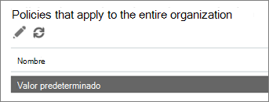
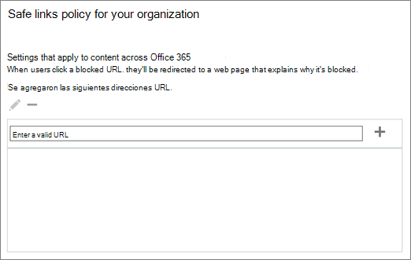

# Configurar una lista de direcciones URL bloqueadas personalizadas mediante vínculos seguros de ATPSet up a custom blocked URLs list using ATP Safe Links

> [!IMPORTANT]
> Este artículo está destinado a los clientes empresariales que tienen la [Protección contra amenazas avanzada de Office 365](office-365-atp.md).This article is intended for business customers who have [Office 365 Advanced Threat Protection](office-365-atp.md). Si es un usuario doméstico que busca información sobre vínculos seguros en Outlook, consulte [Advanced Outlook.com Security](https://support.office.com/article/882d2243-eab9-4545-a58a-b36fee4a46e2).If you are a home user looking for information about Safe Links in Outlook, see [Advanced Outlook.com security](https://support.office.com/article/882d2243-eab9-4545-a58a-b36fee4a46e2).

Con [Office 365 Advanced Threat Protection](office-365-atp.md) (ATP), su organización puede tener una lista personalizada de direcciones de sitios web (URL) que están bloqueadas.With [Office 365 Advanced Threat Protection](office-365-atp.md) (ATP), your organization can have a custom list of website addresses (URLs) that are blocked. Cuando se bloquea una dirección URL, los usuarios que hacen clic en los vínculos a la dirección URL bloqueada se toman en una [Página de advertencia](atp-safe-links-warning-pages.md) similar a la siguiente:When a URL is blocked, people who click on links to the blocked URL are taken to a [warning page](atp-safe-links-warning-pages.md) that resembles the following image: 
  

  
La lista de URL bloqueadas se define en el equipo de seguridad de Microsoft 365 para empresas de la organización, y esa lista se aplica a todos los usuarios de la organización que están cubiertos por las directivas de vínculos seguros de ATP de Office 365.The blocked URLs list is defined by your organization's Microsoft 365 for business security team, and that list applies to everyone in the organization who is covered by Office 365 ATP Safe Links policies. 
  
Lea este artículo para obtener información sobre cómo configurar la lista de direcciones URL bloqueadas personalizadas de la organización para [vínculos seguros de ATP en Office 365](atp-safe-links.md).Read this article to learn how to set up your organization's custom blocked URLs list for [ATP Safe Links in Office 365](atp-safe-links.md).
  
## Ver o editar una lista personalizada de direcciones URL bloqueadasView or edit a custom list of blocked URLs

[Vínculos seguros de ATP en Office 365](atp-safe-links.md) usa varias listas, incluida la lista de direcciones URL bloqueadas personalizadas de la organización.[ATP Safe Links in Office 365](atp-safe-links.md) uses several lists, including your organization's custom blocked URLs list. Si tiene los permisos necesarios, puede configurar la lista personalizada de su organización.If you have the necessary permissions, you can set up your organization's custom list. Para ello, edite la Directiva de vínculos a prueba de errores predeterminada de su organización.You do this by editing your organization's default Safe Links policy.

Para editar (o definir) las directivas de ATP, debe tener asignado uno de los roles descritos en la siguiente tabla:To edit (or define) ATP policies, you must be assigned one of the roles described in the following table: 

|RoleRole  |Dónde y cómo se asignaWhere/how assigned  |
|---------|---------|
|administrador globalglobal administrator |La persona que se registra para comprar Microsoft 365 es un administrador global de forma predeterminada.The person who signs up to buy Microsoft 365 is a global admin by default. (Para obtener más información, consulte [acerca de los roles de administrador de Microsoft 365](https://docs.microsoft.com/office365/admin/add-users/about-admin-roles) .)(See [About Microsoft 365 admin roles](https://docs.microsoft.com/office365/admin/add-users/about-admin-roles) to learn more.)         |
|Administrador de seguridadSecurity Administrator |Centro de administración de Azure Active[https://aad.portal.azure.com](https://aad.portal.azure.com)Directory ()Azure Active Directory admin center ([https://aad.portal.azure.com](https://aad.portal.azure.com))|
|Administración de la organización en Exchange OnlineExchange Online Organization Management |Centro de administración de[https://outlook.office365.com/ecp](https://outlook.office365.com/ecp)Exchange ()Exchange admin center ([https://outlook.office365.com/ecp](https://outlook.office365.com/ecp))  o bienor    Cmdlets de PowerShell (vea [Exchange Online PowerShell](https://docs.microsoft.com/powershell/exchange/exchange-online/exchange-online-powershell))PowerShell cmdlets (See [Exchange Online PowerShell](https://docs.microsoft.com/powershell/exchange/exchange-online/exchange-online-powershell)) |

> [!TIP]
> Para obtener más información acerca de los roles y los permisos, consulte [permisos en el centro de seguridad &amp; y cumplimiento](permissions-in-the-security-and-compliance-center.md).To learn more about roles and permissions, see [Permissions in the Security &amp; Compliance Center](permissions-in-the-security-and-compliance-center.md).

### Para ver o editar una lista de direcciones URL bloqueadas personalizadasTo view or edit a custom blocked URLs list
  
1. Vaya a [https://protection.office.com](https://protection.office.com) e inicie sesión con su cuenta profesional o educativa.Go to [https://protection.office.com](https://protection.office.com) and sign in with your work or school account. 
    
2. En el panel de navegación izquierdo, en **Administración de amenazas**, elija **vínculos seguros**de **Directiva** \> .In the left navigation, under **Threat management**, choose **Policy** \> **Safe Links**.
    
3. En la sección **directivas que se aplican a toda la organización** , seleccione predeterminado y, a continuación, elija **Editar** (el botón Editar **es**similar a un lápiz).In the **Policies that apply to the entire organization** section, select **Default**, and then choose **Edit** (the Edit button resembles a pencil).  Esto le permite ver la lista de direcciones URL bloqueadas.This enables you to view your list of blocked URLs. En primer lugar, es posible que no tenga ninguna dirección URL mencionada aquí.At first, you might not have any URLs listed here. 
  
4. Seleccione el cuadro **Escriba una dirección URL válida** , escriba una dirección URL y, a continuación, elija**+** el signo más ().Select the **Enter a valid URL** box, type a URL, and then choose the plus sign (**+**). 

5. Cuando termine de agregar direcciones URL, en la esquina inferior derecha de la pantalla, elija **Guardar**.When you are finished adding URLs, in the lower right corner of the screen, choose **Save**.
    
## Algunas cosas que debe tener en cuentaA few things to keep in mind

Mientras agrega direcciones URL a la lista, tenga en cuenta los siguientes puntos:While you add URLs to your list, keep the following points in mind: 

- No incluya una barra diagonal ( **/**) al final de la dirección URL.Do not include a forward slash ( **/**) at the end of the URL. Por ejemplo, en lugar de escribir `https://www.contoso.com/`, escriba `https://www.contoso.com`.For example, instead of entering `https://www.contoso.com/`, enter `https://www.contoso.com`.
    
- Puede especificar una dirección URL de solo dominio (like `contoso.com` o `tailspintoys.com`).You can specify a domain-only URL (like `contoso.com` or `tailspintoys.com`). Esto impedirá que se haga clic en cualquier dirección URL que contenga el dominio.This will block clicks on any URL that contains the domain.

- Puede especificar un subdominio (como `toys.contoso.com*`) sin bloquear un dominio completo (como `contoso.com`).You can specify a subdomain (like `toys.contoso.com*`) without blocking a full domain (like `contoso.com`). Este bloque hará clic en cualquier dirección URL que contenga el subdominio, pero no bloqueará los clics en una dirección URL que contenga el dominio completo.This will block clicks any URL that contains the subdomain, but it won't block clicks to a URL that contains the full domain.  
    
- Puede incluir hasta tres asteriscos comodín (\*) por dirección URL.You can include up to three wildcard asterisks (\*) per URL. En la tabla siguiente se enumeran algunos ejemplos de lo que se puede especificar y el efecto que tienen dichas entradas.The following table lists some examples of what you can enter and what effect those entries have.
    
|**Entrada de ejemplo****Example Entry**|**Qué hace****What It Does**|
|:-----|:-----|
|`contoso.com` o `*contoso.com*``contoso.com` or `*contoso.com*`    |Bloquea el dominio, los subdominios y las rutas de los `https://www.contoso.com`, `https://sub.contoso.com`como, y`https://contoso.com/abc`Blocks the domain, subdomains, and paths, such as `https://www.contoso.com`, `https://sub.contoso.com`, and `https://contoso.com/abc`    |
|`https://contoso.com/a`    |Bloquea un sitio `https://contoso.com/a` , pero no otros subtrazados adicionales como`https://contoso.com/a/b`Blocks a site `https://contoso.com/a` but not additional subpaths like `https://contoso.com/a/b`    |
|`https://contoso.com/a*`    |Bloquea un sitio `https://contoso.com/a` y subrutas adicionales como`https://contoso.com/a/b`Blocks a site `https://contoso.com/a` and additional subpaths like `https://contoso.com/a/b`    |
|`https://toys.contoso.com*`    |Bloquea un subdominio ("juguetes" en este caso), pero permite hacer clic en otras direcciones URL de `https://contoso.com` dominio `https://home.contoso.com`(como o).Blocks a subdomain ("toys" in this case) but allow clicks to other domain URLs (like `https://contoso.com` or `https://home.contoso.com`).    |
   

## Cómo definir excepciones para determinados usuarios de una organizaciónHow to define exceptions for certain users in an organization

Si desea que determinados grupos puedan ver direcciones URL que puedan estar bloqueadas para otros usuarios, puede especificar una directiva de vínculos seguros ATP que se aplique a destinatarios específicos.If you want certain groups to be able to view URLs that might be blocked for others, you can specify an ATP Safe Links policy that applies to specific recipients. Consulte [configurar una lista de direcciones URL personalizadas "no reescribir" mediante vínculos seguros de ATP](set-up-a-custom-do-not-rewrite-urls-list-with-atp.md).See [Set up a custom "do not rewrite" URLs list using ATP Safe Links](set-up-a-custom-do-not-rewrite-urls-list-with-atp.md).
  

