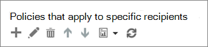

# Configurar una lista de direcciones URL de do-not-Rewrite personalizada mediante vínculos seguros de ATPSet up a custom do-not-rewrite URLs list using ATP Safe Links

> [!IMPORTANT]
> Este artículo está destinado a los clientes empresariales que tienen la [Protección contra amenazas avanzada de Office 365](office-365-atp.md).This article is intended for business customers who have [Office 365 Advanced Threat Protection](office-365-atp.md). Si es un usuario doméstico que busca información sobre vínculos seguros en Outlook, consulte [Advanced Outlook.com Security](https://support.microsoft.com/office/882d2243-eab9-4545-a58a-b36fee4a46e2).If you are a home user looking for information about Safe Links in Outlook, see [Advanced Outlook.com security](https://support.microsoft.com/office/882d2243-eab9-4545-a58a-b36fee4a46e2).

Con [Office 365 Advanced Threat Protection](office-365-atp.md) (ATP), su organización puede tener [direcciones URL bloqueadas personalizadas](set-up-a-custom-blocked-urls-list-atp.md), de modo que cuando los usuarios hagan clic en direcciones web (URL) en mensajes de correo electrónico o en determinados documentos de Office, no se les impedirá ir a esas direcciones URL.With [Office 365 Advanced Threat Protection](office-365-atp.md) (ATP), your organization can have a [custom blocked URLs](set-up-a-custom-blocked-urls-list-atp.md), such that when people click on web addresses (URLs) in email messages or certain Office documents, they are prevented from going to those URLs. La organización también puede tener listas personalizadas de "no reescribir" para grupos específicos de la organización.Your organization can also have custom "do not rewrite" lists for specific groups in your organization. Una lista "no reescribir" permite que algunas personas visiten direcciones URL que, de lo contrario, se bloquearán mediante [vínculos seguros de ATP en Office 365](atp-safe-links.md).A "do not rewrite" list enables some people to visit URLs that are otherwise blocked by [ATP Safe Links in Office 365](atp-safe-links.md).

En este artículo se describe cómo especificar una lista de direcciones URL que se excluyen del análisis de vínculos seguros de ATP y algunos puntos importantes que se deben tener en cuenta.This article describes how to specify a list of URLs that are excluded from ATP Safe Links scanning, and a few important points to keep in mind.

> [!NOTE]
> Si su organización usa directivas de vínculos a prueba de errores, la lista "no reescribir" es el único método admitido para las pruebas de suplantación de identidad de terceros.If your organization use Safe Links policies, the "do not rewrite" list is the only supported method for third party phishing tests.

## Configurar una lista de "no reescribir"Set up a "do not rewrite" list

La protección de vínculos seguros de ATP usa varias listas, incluidas la lista de URL bloqueadas de su organización y las listas "no reescribir" para las excepciones.ATP Safe Links protection uses several lists, including your organization's blocked URLs list and the "do not rewrite" lists for exceptions. Si tiene los permisos necesarios, puede configurar las listas de "no reescribir" personalizadas.If you have the necessary permissions, you can set up your custom "do not rewrite" lists. Esto se hace al agregar o editar directivas de vínculos a prueba de errores que se aplican a destinatarios específicos de la organización.You do this when you add or edit Safe Links policies that apply to specific recipients in your organization.

Para editar (o definir) las directivas de ATP, debe tener asignado un rol apropiado.To edit (or define) ATP policies, you must be assigned an appropriate role. En la tabla siguiente se incluyen algunos ejemplos.The following table includes some examples. Para obtener más información, consulte [permisos en el centro de seguridad & cumplimiento](permissions-in-the-security-and-compliance-center.md).To learn more, see [Permissions in the Security & Compliance Center](permissions-in-the-security-and-compliance-center.md).

|RoleRole|Dónde y cómo se asignaWhere/how assigned|
|---|---|
|administrador globalglobal administrator|La persona que se registra para comprar Microsoft 365 es un administrador global de forma predeterminada.The person who signs up to buy Microsoft 365 is a global admin by default. (Para obtener más información, consulte [acerca de los roles de administrador de Microsoft 365](https://docs.microsoft.com/microsoft-365/admin/add-users/about-admin-roles) .)(See [About Microsoft 365 admin roles](https://docs.microsoft.com/microsoft-365/admin/add-users/about-admin-roles) to learn more.)|
|Administrador de seguridadSecurity Administrator|Centro de administración de Azure Active Directory ( [https://aad.portal.azure.com](https://aad.portal.azure.com) )Azure Active Directory admin center ([https://aad.portal.azure.com](https://aad.portal.azure.com))|
|Administración de la organización en Exchange OnlineExchange Online Organization Management|Centro de administración de Exchange ( [https://outlook.office365.com/ecp](https://outlook.office365.com/ecp) )Exchange admin center ([https://outlook.office365.com/ecp](https://outlook.office365.com/ecp))  oor    Cmdlets de PowerShell (vea [Exchange Online PowerShell](https://docs.microsoft.com/powershell/exchange/exchange-online-powershell))PowerShell cmdlets (See [Exchange Online PowerShell](https://docs.microsoft.com/powershell/exchange/exchange-online-powershell))|
|

> [!TIP]
> Para obtener más información acerca de los roles y los permisos, consulte [Permissions in the Security & Compliance Center](permissions-in-the-security-and-compliance-center.md).To learn more about roles and permissions, see [Permissions in the Security & Compliance Center](permissions-in-the-security-and-compliance-center.md).

### Para ver o editar una lista de direcciones URL "no reescribir" personalizadasTo view or edit a custom "do not rewrite" URLs list

1. Vaya a [https://protection.office.com](https://protection.office.com) e inicie sesión con su cuenta profesional o educativa.Go to [https://protection.office.com](https://protection.office.com) and sign in with your work or school account.

2. En el panel de navegación izquierdo **Threat management** , en \> **Policy** \> **vínculos seguros**de la Directiva de administración de amenazas.In the left navigation, under **Threat management** \> **Policy** \> **Safe Links**.

3. En la sección **directivas que se aplican a destinatarios específicos** , elija **nuevo** (el botón nuevo es similar a un signo más ( **+** )) para crear una nueva Directiva.In the **Policies that apply to specific recipients** section, choose **New** (the New button resembles a plus sign ( **+**)) to create a new policy. (También puede editar una directiva existente).(Alternatively, you can edit an existing policy.) 

4. Especifique un nombre y una descripción para la Directiva.Specify a name and description for your policy.

5. Active **las direcciones URL** se rescribirán y comprobarán con una lista de vínculos malintencionados conocidos cuando el usuario haga clic en el vínculo.Turn **ON** URLs will be rewritten and checked against a list of known malicious links when user clicks on the link.

6. En la sección no **reescribir las siguientes direcciones** URL, seleccione el cuadro **Escriba una dirección URL válida** , escriba una dirección URL y, a continuación, elija el signo más (+).In the **Do not rewrite the following URLs** section, select the **Enter a valid URL** box, enter a URL, and then choose the plus sign (+).

7. En la sección **aplicado a** , elija **el destinatario es miembro de**y, a continuación, elija el grupo o los grupos que desea incluir en la Directiva.In the **Applied To** section, choose **The recipient is a member of**, and then choose the group(s) you want to include in your policy. Elija **Agregar**y, después, haga clic en **Aceptar**.Choose **Add**, and then choose **OK**.

8. Cuando termine de agregar direcciones URL, en la esquina inferior derecha de la pantalla, elija **Guardar**.When you are finished adding URLs, in the lower right corner of the screen, choose **Save**.

> [!NOTE]
> Asegúrese de revisar la lista personalizada de direcciones URL bloqueadas de su organización.Make sure to review your organization's custom list of blocked URLs. Consulte [configurar una lista de direcciones URL bloqueadas personalizadas mediante vínculos seguros de ATP](set-up-a-custom-blocked-urls-list-atp.md).See [Set up a custom blocked URLs list using ATP Safe Links](set-up-a-custom-blocked-urls-list-atp.md).

## Aspectos importantes que debe tener en cuentaImportant points to keep in mind

- Las direcciones URL que especifique en la lista "no reescribir" se excluyen del análisis de vínculos seguros de ATP para los destinatarios que especifique.Any URLs that you specify in the "do not rewrite" list are excluded from ATP Safe Links scanning for the recipients that you specify.

- Considere la posibilidad de agregar direcciones URL internas de uso frecuente a la lista "no reescribir" para mejorar la experiencia del usuario.Consider adding commonly used internal URLs to the "do not rewrite" list to improve the user experience. Por ejemplo, si tiene servicios locales, como Skype empresarial o SharePoint, puede agregar sus URL a la lista para excluirlos del análisis.For example, if you have on-premises services, such as Skype for Business or Sharepoint, you can add their URLs to the list to exclude them from scanning.

- Si ya tiene una lista de direcciones URL en la lista "no reescribir", asegúrese de revisar dicha lista y agregar caracteres comodín según corresponda.If you already have a list of URLs in your "do not rewrite" list, make sure to review that list and add wildcards as appropriate. Por ejemplo, si la lista existente tiene una entrada como `https://contoso.com/a` y desea incluir subrutas como `https://contoso.com/a/b` en la Directiva, agregue un carácter comodín a la entrada para que tenga el aspecto deseado `https://contoso.com/a/*` .For example, if your existing list has an entry like `https://contoso.com/a` and you want to include subpaths like `https://contoso.com/a/b` in your policy, add a wildcard to your entry so it looks like `https://contoso.com/a/*`.

- Cuando especifica una lista de "no reescribir" para una directiva de vínculos seguros de ATP, puede incluir hasta tres caracteres comodín ( \* ).When you specify a "do not rewrite" list for an ATP Safe Links policy, you can include up to three wildcards (\*). Los caracteres comodín incluyen explícitamente prefijos o subdominios.Wildcards explicitly include prefixes or subdomains. Por ejemplo, la entrada `contoso.com` no es la misma que `*.contoso.com/*` , ya que `*.contoso.com/*` permite a los usuarios visitar subdominios y rutas de acceso en el dominio especificado.For example, the entry `contoso.com` is not the same as `*.contoso.com/*`, because `*.contoso.com/*` allows people to visit subdomains and paths in the specified domain.

En la tabla siguiente se muestran ejemplos de lo que se puede especificar y el efecto que tienen estas entradas.The following table lists examples of what you can enter and what effect those entries have.

****

|Entrada de ejemploExample Entry|Qué haceWhat It Does|
|---|---|
|`contoso.com`|Permite a los destinatarios visitar un sitio como, por ejemplo, `https://contoso.com` subdominios o rutas de una ruta.Allows recipients to visit a site like `https://contoso.com` but not subdomains or paths.|
|`*.contoso.com/*`|Permite a los destinatarios visitar un dominio, subdominios y rutas de, como `https://www.contoso.com` , `https://www.contoso.com` , `https://maps.contoso.com` o `https://www.contoso.com/a` .Allows recipients to visit a domain, subdomains, and paths, such as `https://www.contoso.com`, `https://www.contoso.com`, `https://maps.contoso.com`, or `https://www.contoso.com/a`.    Esta entrada es intrínsecamente mejor que `*contoso.com*` , ya que no incluye sitios potencialmente fraudulentos, como `https://www.falsecontoso.com` o `https://www.false.contoso.completelyfalse.com`This entry is inherently better than `*contoso.com*`, because it doesn't include potentially fraudulent sites, like `https://www.falsecontoso.com` or `https://www.false.contoso.completelyfalse.com`|
|`https://contoso.com/a`|Permite a los destinatarios específicos visitar un sitio como `https://contoso.com/a` , pero no subtrazados como `https://contoso.com/a/b`Allows specific recipients to visit a site like `https://contoso.com/a`, but not subpaths like `https://contoso.com/a/b`|
|`https://contoso.com/a/*`|Permite a los destinatarios específicos visitar un sitio como `https://contoso.com/a` y subrutas como `https://contoso.com/a/b`Allows specific recipients to visit a site like `https://contoso.com/a` and subpaths like `https://contoso.com/a/b`|
|
