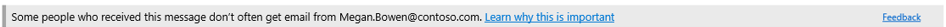

# Directivas contra la suplantación de identidad en Microsoft 365Anti-phishing policies in Microsoft 365

[!INCLUDE [Microsoft 365 Defender rebranding](../includes/microsoft-defender-for-office.md)]

**Se aplica a****Applies to**
- [Exchange Online ProtectionExchange Online Protection](exchange-online-protection-overview.md)
- [Plan 1 y Plan 2 de Microsoft Defender para Office 365Microsoft Defender for Office 365 plan 1 and plan 2](defender-for-office-365.md)
- [Microsoft 365 DefenderMicrosoft 365 Defender](../defender/microsoft-365-defender.md)

Las directivas para configurar las opciones de protección contra suplantación de identidad están disponibles en organizaciones de Microsoft 365 con buzones de Exchange Online, organizaciones independientes de Exchange Online Protection (EOP) sin buzones de correo Exchange Online y Microsoft Defender para Office 365 organizaciones.Policies to configure anti-phishing protection settings are available in Microsoft 365 organizations with Exchange Online mailboxes, standalone Exchange Online Protection (EOP) organizations without Exchange Online mailboxes, and Microsoft Defender for Office 365 organizations.

Algunos ejemplos de Microsoft Defender para Office 365 organizaciones incluyen:Examples of Microsoft Defender for Office 365 organizations include:

- Microsoft 365 Enterprise E5, Microsoft 365 Educación A5, etc.Microsoft 365 Enterprise E5, Microsoft 365 Education A5, etc.
- [Microsoft 365 EnterpriseMicrosoft 365 Enterprise](https://www.microsoft.com/microsoft-365/enterprise/home)
- [Microsoft 365 EmpresaMicrosoft 365 Business](https://www.microsoft.com/microsoft-365/business)
- [Microsoft Defender para Office 365 como complementoMicrosoft Defender for Office 365 as an add-on](https://products.office.com/exchange/advance-threat-protection)

Las diferencias de alto nivel entre las directivas contra suplantación de identidad (phishing) en EOP y las directivas contra suplantación de identidad en Defender para Office 365 se describen en la tabla siguiente:The high-level differences between anti-phishing policies in EOP and anti-phishing policies in Defender for Office 365 are described in the following table:

 

****

|CaracterísticaFeature|Directivas contra suplantación de identidad en EOPAnti-phishing policies in EOP|Directivas contra la suplantación de identidad en Defender para Office 365Anti-phishing policies in Defender for Office 365|
|---|:---:|:---:|
|Directiva predeterminada creada automáticamenteAutomatically created default policy|||
|Crear directivas personalizadasCreate custom policies|||
|Configuración de directiva común\*Common policy settings\*|||
|Configuración de suplantaciónSpoof settings|||
|Primer contacto consejo de seguridadFirst contact safety tip|||
|Configuración de suplantaciónImpersonation settings|||
|Umbrales de suplantación de identidad avanzadaAdvanced phishing thresholds|||
|

\* En la directiva predeterminada, el nombre de la directiva y la descripción son de solo lectura (la descripción está en blanco) y no puede especificar a quién se aplica la directiva (la directiva predeterminada se aplica a todos los destinatarios).\* In the default policy, the policy name, and description are read-only (the description is blank), and you can't specify who the policy applies to (the default policy applies to all recipients).

Para configurar directivas contra suplantación de identidad, consulte los artículos siguientes:To configure anti-phishing policies, see the following articles:

- [Configuración de directivas contra phishing en EOPConfigure anti-phishing policies in EOP](configure-anti-phishing-policies-eop.md)
- [Configurar directivas contra suplantación de identidad en Microsoft Defender para Office 365Configure anti-phishing policies in Microsoft Defender for Office 365](configure-mdo-anti-phishing-policies.md)

El resto de este artículo describe la configuración disponible en las directivas contra suplantación de identidad en EOP y Defender para Office 365.The rest of this article describes the settings that are available in anti-phishing policies in EOP and Defender for Office 365.

## Configuración de directiva comúnCommon policy settings

La siguiente configuración de directiva está disponible en las directivas contra suplantación de identidad en EOP y Defender para Office 365:The following policy settings are available in anti-phishing policies in EOP and Defender for Office 365:

- **Nombre:** no puede cambiar el nombre de la directiva contra suplantación de identidad predeterminada.**Name**: You can't rename the default anti-phishing policy. Después de crear una directiva contra suplantación de identidad personalizada, no puede cambiar el nombre de la directiva en el portal de Microsoft 365 Defender suplantación de identidad.After you create a custom anti-phishing policy, you can't rename the policy in the Microsoft 365 Defender portal.

- **Descripción** No puede agregar una descripción a la directiva contra suplantación de identidad predeterminada, pero puede agregar y cambiar la descripción de las directivas personalizadas que cree.**Description** You can't add a description to the default anti-phishing policy, but you can add and change the description for custom policies that you create.

- **Usuarios, grupos y dominios:** identifica los destinatarios internos a los que se aplica la directiva contra suplantación de identidad.**Users, groups, and domains**: Identifies internal recipients that the anti-phishing policy applies to. Este valor es necesario en las directivas personalizadas y no está disponible en la directiva predeterminada (la directiva predeterminada se aplica a todos los destinatarios).This value is required in custom policies, and not available in the default policy (the default policy applies to all recipients).

  Solo puede usar una condición o excepción una vez, pero puede especificar varios valores para la condición o excepción.You can only use a condition or exception once, but you can specify multiple values for the condition or exception. Varios valores de una misma condición o excepción usan la lógica OR (por ejemplo, _\<recipient1\>_ o _\<recipient2\>_).Multiple values of the same condition or exception use OR logic (for example, _\<recipient1\>_ or _\<recipient2\>_). Condiciones o excepciones diversas usan la lógica AND (por ejemplo, _\<recipient1\>_ y _\<member of group 1\>_).Different conditions or exceptions use AND logic (for example, _\<recipient1\>_ and _\<member of group 1\>_).

  - **Usuarios:** uno o más buzones, usuarios de correo o contactos de correo de la organización.**Users**: One or more mailboxes, mail users, or mail contacts in your organization.
  - **Grupos:** uno o más grupos de la organización.**Groups**: One or more groups in your organization.
  - **Dominios:** uno o varios de los dominios [aceptados](/exchange/mail-flow-best-practices/manage-accepted-domains/manage-accepted-domains) configurados en Microsoft 365.**Domains**: One or more of the configured [accepted domains](/exchange/mail-flow-best-practices/manage-accepted-domains/manage-accepted-domains) in Microsoft 365.

  - **Excluir estos usuarios, grupos y dominios:** excepciones para la directiva.**Exclude these users, groups, and domains**: Exceptions for the policy. La configuración y el comportamiento son exactamente iguales a las condiciones:The settings and behavior are exactly like the conditions:
    - **Users****Users**
    - **Grupos****Groups**
    - **Dominios****Domains**

  > [!NOTE]
  > Al menos una selección en la configuración **usuarios,** grupos y dominios es necesaria en las directivas **personalizadas** contra la suplantación de identidad para identificar los destinatarios de mensajes a los que se aplica <u>la directiva</u>.At least one selection in the **Users, groups, and domains** settings is required in custom anti-phishing policies to identify the message **recipients** <u>that the policy applies to</u>. Las directivas contra suplantación de identidad  en Defender para Office 365 también tienen una configuración <u></u> de suplantación en la que puede especificar direcciones de correo electrónico de remitente individuales o dominios de remitente que recibirán protección contra suplantación, tal como se describe más adelante en este artículo.Anti-phishing policies in Defender for Office 365 also have [impersonation settings](#impersonation-settings-in-anti-phishing-policies-in-microsoft-defender-for-office-365) where you can specify individual sender email addresses or sender domains <u>that will receive impersonation protection</u> as described later in this article.

## Configuración de suplantaciónSpoof settings

La suplantación de identidad es cuando la dirección De de un mensaje de correo electrónico (la dirección del remitente que se muestra en los clientes de correo electrónico) no coincide con el dominio del origen de correo electrónico.Spoofing is when the From address in an email message (the sender address that's shown in email clients) doesn't match the domain of the email source. Para obtener más información acerca de la suplantación, vea Protección contra la suplantación [en Microsoft 365](anti-spoofing-protection.md).For more information about spoofing, see [Anti-spoofing protection in Microsoft 365](anti-spoofing-protection.md).

La siguiente configuración de suplantación de identidad está disponible en las directivas contra suplantación de identidad en EOP y Defender para Office 365:The following spoof settings are available in anti-phishing policies in EOP and Defender for Office 365:

- **Habilitar la inteligencia de suplantación:** activa o desactiva la inteligencia de suplantación.**Enable spoof intelligence**: Turns spoof intelligence on or off. Le recomendamos que lo deje activado.We recommend that you leave it turned on.

  Cuando la inteligencia de suplantación de identidad está habilitada, la información de inteligencia suplantada muestra remitentes suplantados que se detectaron y permitieron o bloquearon automáticamente mediante la inteligencia de suplantación de identidad. When spoof intelligence is enabled, the **spoof intelligence insight** shows spoofed senders that were automatically detected and allowed or blocked by spoof intelligence. Puede invalidar manualmente el veredicto de suplantación de identidad para permitir o bloquear los remitentes suplantados detectados desde dentro de la información.You can manually override the spoof intelligence verdict to allow or block the detected spoofed senders from within the insight. Pero, cuando lo hace, el remitente suplantado desaparece de la información de  inteligencia suplantada y ahora solo está visible en la pestaña Suplantación de identidad de la lista de permitidos o bloqueados del espacio empresarial.But when you do, the spoofed sender disappears from the spoof intelligence insight, and is now visible only on the **Spoof** tab in the Tenant Allow/Block List. También puede crear manualmente entradas de permitir o bloquear para remitentes suplantados en la lista de inquilinos permitidos o bloqueados.You can also manually create allow or block entries for spoofed senders in the Tenant Allow/Block List. Para más información, consulte los siguientes artículos:For more information, see the following articles:

  - [Suplantación de información de inteligencia en EOPSpoof intelligence insight in EOP](learn-about-spoof-intelligence.md)
  - [Administrar la lista de inquilinos permitidos o bloqueados en EOPManage the Tenant Allow/Block List in EOP](tenant-allow-block-list.md)

  > [!NOTE]
  >
  > - La protección contra la suplantación de identidad está habilitada de forma predeterminada en la directiva contra suplantación de identidad predeterminada y en cualquier nueva directiva contra suplantación de identidad personalizada que cree.Anti-spoofing protection is enabled by default in the default anti-phishing policy and in any new custom anti-phishing policies that you create.
  > - No es necesario deshabilitar la protección contra la suplantación si el registro MX no apunta a Microsoft 365; habilitar el filtrado mejorado para conectores en su lugar.You don't need to disable anti-spoofing protection if your MX record doesn't point to Microsoft 365; you enable Enhanced Filtering for Connectors instead. Para obtener instrucciones, consulte [Enhanced Filtering for Connectors in Exchange Online](/Exchange/mail-flow-best-practices/use-connectors-to-configure-mail-flow/enhanced-filtering-for-connectors).For instructions, see [Enhanced Filtering for Connectors in Exchange Online](/Exchange/mail-flow-best-practices/use-connectors-to-configure-mail-flow/enhanced-filtering-for-connectors).
  > - Deshabilitar la protección contra la suplantación solo deshabilita la protección de suplantación implícita de las comprobaciones de [autenticación](email-validation-and-authentication.md#composite-authentication) compuesta. Disabling anti-spoofing protection only disables _implicit_ spoofing protection from [composite authentication](email-validation-and-authentication.md#composite-authentication) checks. Si el remitente produce un error _en las_ comprobaciones [de DMARC](use-dmarc-to-validate-email.md) explícitas en las que la directiva está establecida en cuarentena o rechazada, el mensaje sigue en cuarentena o rechazado.If the sender fails _explicit_ [DMARC](use-dmarc-to-validate-email.md) checks where the policy is set to quarantine or reject, the message is still quarantined or rejected.

- **Notificaciones de remitente no autenticadas:** estas notificaciones solo están disponibles cuando la inteligencia de suplantación de identidad está activada.**Unauthenticated sender notifications**: These notifications are available only when spoof intelligence is turned on. Vea la información en la sección siguiente.See the information in the next section.
- **Acciones:** para los mensajes de remitentes suplantados bloqueados (bloqueados automáticamente por la inteligencia de suplantación de identidad o bloqueados manualmente en la lista Permitir/Bloquear inquilino), también puede especificar la acción que debe realizar en los mensajes:**Actions**: For messages from blocked spoofed senders (automatically blocked by spoof intelligence or manually blocked in the Tenant Allow/Block list), you can also specify the action to take on the messages:
  - **Mover mensajes a las carpetas de correo no** deseado de los destinatarios: este es el valor predeterminado.**Move messages to the recipients' Junk Email folders**: This is the default value. El mensaje se entrega en el buzón y se mueve a la carpeta Correo no deseado.The message is delivered to the mailbox and moved to the Junk Email folder. En Exchange Online, el mensaje se mueve a la carpeta Correo no deseado si la regla de correo no deseado está habilitada en el buzón (está habilitada de forma predeterminada).In Exchange Online, the message is moved to the Junk Email folder if the junk email rule is enabled on the mailbox (it's enabled by default). Para obtener más información, vea [Configure junk email settings on Exchange Online mailboxes in Microsoft 365](configure-junk-email-settings-on-exo-mailboxes.md).For more information, see [Configure junk email settings on Exchange Online mailboxes in Microsoft 365](configure-junk-email-settings-on-exo-mailboxes.md).
  - **Poner en cuarentena el mensaje:** envía el mensaje a la cuarentena en lugar de los destinatarios previstos.**Quarantine the message**: Sends the message to quarantine instead of the intended recipients. Para obtener información acerca de la cuarentena, vea los artículos siguientes:For information about quarantine, see the following articles:
    - [Cuarentena en Microsoft 365Quarantine in Microsoft 365](quarantine-email-messages.md)
    - [Administrar mensajes y archivos en cuarentena como administrador en Microsoft 365Manage quarantined messages and files as an admin in Microsoft 365](manage-quarantined-messages-and-files.md)
    - [Buscar y liberar mensajes en cuarentena como usuario en Microsoft 365Find and release quarantined messages as a user in Microsoft 365](find-and-release-quarantined-messages-as-a-user.md)

### Remitente no autenticadoUnauthenticated sender

Las notificaciones de remitente no autenticados  forman parte de la configuración de suplantación de identidad que están disponibles en las directivas contra suplantación de identidad en EOP y Defender para Office 365 como se describe en la sección anterior.The unauthenticated sender notifications are part of the [Spoof settings](#spoof-settings) that are available in anti-phishing policies in EOP and Defender for Office 365 as described in the previous section. La siguiente configuración solo está disponible cuando la inteligencia de suplantación está activada:The following settings are available only when spoof intelligence is turned on:

- **Mostrar (?)** para remitentes no autenticados para suplantación de identidad: Esta notificación agrega un signo de interrogación se agrega a  la foto del remitente en el cuadro De si el mensaje no pasa comprobaciones SPF o DKIM y el mensaje no pasa dmarc o autenticación compuesta [.](email-validation-and-authentication.md#composite-authentication)**Show (?) for unauthenticated senders for spoof**: This notification adds a question mark is added to the sender's photo in the From box if the message does not pass SPF or DKIM checks **and** the message does not pass DMARC or [composite authentication](email-validation-and-authentication.md#composite-authentication). Cuando esta configuración está desactivada, el signo de interrogación no se agrega a la foto del remitente.When this setting is turned off, the question mark isn't added to the sender's photo.

- **Mostrar etiqueta "via":** esta notificación agrega la etiqueta via (chris@contoso.com a través de <u>fabrikam.com)</u> en el cuadro De si el dominio de la dirección De (el remitente del mensaje que se muestra en los clientes de correo electrónico) es diferente del dominio de la firma DKIM o la dirección **MAIL FROM.****Show "via" tag?**: This notification adds the via tag (chris@contoso.com <u>via</u> fabrikam.com) in the From box if the domain in the From address (the message sender that's displayed in email clients) is different from the domain in the DKIM signature or the **MAIL FROM** address. Para obtener más información acerca de estas direcciones, vea [An overview of email message standards](how-office-365-validates-the-from-address.md#an-overview-of-email-message-standards).For more information about these addresses, see [An overview of email message standards](how-office-365-validates-the-from-address.md#an-overview-of-email-message-standards).

Para evitar que el signo de interrogación o la etiqueta a través de la etiqueta se agregó a los mensajes de remitentes específicos, tiene las siguientes opciones:To prevent the question mark or via tag from being added to messages from specific senders, you have the following options:

- Permitir al remitente suplantado  en la información de inteligencia suplantada o manualmente en la lista de [inquilinos permitidos o bloqueados.](tenant-allow-block-list.md)Allow the spoofed sender in the [spoof intelligence insight](learn-about-spoof-intelligence.md) or manually in the [Tenant Allow/Block List](tenant-allow-block-list.md). Permitir que el remitente suplantado impida que la etiqueta via aparezca en los mensajes del remitente cuando la identificación del remitente no autenticada esté deshabilitada.Allowing the spoofed sender will prevent the via tag from appearing in messages from the sender when unauthenticated sender identification is disabled.
- [Configurar la autenticación de](email-validation-and-authentication.md#configure-email-authentication-for-domains-you-own) correo electrónico para el dominio del remitente.[Configure email authentication](email-validation-and-authentication.md#configure-email-authentication-for-domains-you-own) for the sender domain.
  - Para el signo de interrogación de la foto del remitente, SPF o DKIM son los más importantes.For the question mark in the sender's photo, SPF or DKIM are the most important.
  - Para la etiqueta via, confirme que el dominio de la firma DKIM o la dirección **MAIL FROM** coincide (o es un subdominio de) el dominio en la dirección De.For the via tag, confirm the domain in the DKIM signature or the **MAIL FROM** address matches (or is a subdomain of) the domain in the From address.

Para obtener más información, vea [Identificar mensajes sospechosos en Outlook.com y Outlook en la Web](https://support.microsoft.com/office/3d44102b-6ce3-4f7c-a359-b623bec82206)For more information, see [Identify suspicious messages in Outlook.com and Outlook on the web](https://support.microsoft.com/office/3d44102b-6ce3-4f7c-a359-b623bec82206)

## Primer contacto consejo de seguridadFirst contact safety tip

La configuración mostrar el primer contacto **consejo de seguridad** está disponible en EOP y Defender para organizaciones Office 365 y no depende de la configuración de la inteligencia de suplantación o la protección de suplantación.The **Show first contact safety tip** settings is available in EOP and Defender for Office 365 organizations, and has no dependency on spoof intelligence or impersonation protection settings. La consejo de seguridad se muestra a los destinatarios en los siguientes escenarios:The safety tip is shown to recipients in the following scenarios:

- La primera vez que obtienen un mensaje de un remitenteThe first time they get a message from a sender
- Si no suelen recibir mensajes del remitente.If they don't often get messages from the sender.

Esta funcionalidad agrega una capa adicional de protección de seguridad contra posibles ataques de suplantación, por lo que se recomienda activarla.This capability adds an extra layer of security protection against potential impersonation attacks, so we recommend that you turn it on.

El primer consejo de seguridad de contacto también reemplaza la necesidad de crear reglas de flujo de correo (también conocidas como reglas de transporte) que agreguen el encabezado denominado **X-MS-Exchange-EnableFirstContactSafetyTip** con el valor **Enable** to messages (aunque esta funcionalidad aún está disponible).The first contact safety tip also replaces the need to create mail flow rules (also known as transport rules) that add the header named **X-MS-Exchange-EnableFirstContactSafetyTip** with the value **Enable** to messages (although this capability is still available).

## Configuración exclusiva en directivas contra suplantación de identidad en Microsoft Defender para Office 365Exclusive settings in anti-phishing policies in Microsoft Defender for Office 365

En esta sección se describe la configuración de directiva que solo está disponible en las directivas contra suplantación de identidad en Defender para Office 365.This section describes the policy settings that are only available in anti-phishing policies in Defender for Office 365.

> [!NOTE]
> La directiva contra suplantación de identidad predeterminada  en Defender for Office 365 proporciona protección contra suplantación de identidad e inteligencia de buzones para todos los destinatarios.The default anti-phishing policy in Defender for Office 365 provides [spoof protection](set-up-anti-phishing-policies.md#spoof-settings) and mailbox intelligence for all recipients. Sin embargo, las otras [características](#impersonation-settings-in-anti-phishing-policies-in-microsoft-defender-for-office-365) de protección de suplantación disponibles y la configuración avanzada [no](set-up-anti-phishing-policies.md#advanced-phishing-thresholds-in-anti-phishing-policies-in-microsoft-defender-for-office-365) están configuradas ni habilitadas en la directiva predeterminada.However, the other available [impersonation protection](#impersonation-settings-in-anti-phishing-policies-in-microsoft-defender-for-office-365) features and [advanced settings](set-up-anti-phishing-policies.md#advanced-phishing-thresholds-in-anti-phishing-policies-in-microsoft-defender-for-office-365) are not configured or enabled in the default policy. Para habilitar todas las características de protección, modifique la directiva contra suplantación de identidad predeterminada o cree directivas adicionales contra la suplantación de identidad.To enable all protection features, modify the default anti-phishing policy or create additional anti-phishing policies.

### Configuración de suplantación en directivas contra suplantación de identidad en Microsoft Defender para Office 365Impersonation settings in anti-phishing policies in Microsoft Defender for Office 365

La suplantación es donde el remitente o el dominio de correo electrónico del remitente en un mensaje tiene un aspecto similar al de un remitente o dominio real:Impersonation is where the sender or the sender's email domain in a message looks similar to a real sender or domain:

- Un ejemplo de suplantación del dominio contoso.com es ćóntoso.com.An example impersonation of the domain contoso.com is ćóntoso.com.
- Un ejemplo de suplantación del usuario michelle@contoso.com es michele@contoso.com.An example impersonation of the user michelle@contoso.com is michele@contoso.com.

Un dominio suplantado podría considerarse legítimo (dominio registrado, registros de autenticación de correo electrónico configurados, etc.), salvo que su intención sea engañar a los destinatarios.An impersonated domain might otherwise be considered legitimate (registered domain, configured email authentication records, etc.), except its intent is to deceive recipients.

La siguiente configuración de suplantación solo está disponible en las directivas contra suplantación de identidad en Defender para Office 365:The following impersonation settings are only available in anti-phishing policies in Defender for Office 365:

- **Permitir a los usuarios proteger:** evita que las direcciones de correo electrónico internas o externas especificadas se suplanten **como remitentes de mensajes**.**Enable users to protect**: Prevents the specified internal or external email addresses from being impersonated **as message senders**. Por ejemplo, recibe un mensaje de correo electrónico del vicepresidente de su empresa pidiéndole que le envíe información interna de la compañía.For example, you receive an email message from the Vice President of your company asking you to send her some internal company information. ¿Lo haría?Would you do it? Muchas personas enviarían la respuesta sin pensarlo.Many people would send the reply without thinking.

  Puede usar usuarios protegidos para agregar direcciones de correo electrónico de remitente internos y externos para protegerse de la suplantación.You can use protected users to add internal and external sender email addresses to protect from impersonation. Esta lista de **remitentes** protegidos contra la suplantación  de usuario es diferente de la lista de destinatarios a los que se aplica la directiva (todos los destinatarios de la directiva predeterminada; destinatarios específicos configurados en la configuración **Usuarios,** grupos y dominios de la sección Configuración de directiva común). This list of **senders** that are protected from user impersonation is different from the list of **recipients** that the policy applies to (all recipients for the default policy; specific recipients as configured in the **Users, groups, and domains** setting in the [Common policy settings](#common-policy-settings) section).

  > [!NOTE]
  >
  > - En cada directiva contra phishing, puede especificar un máximo de 60 usuarios protegidos (direcciones de correo electrónico del remitente).In each anti-phishing policy, you can specify a maximum of 60 protected users (sender email addresses). No puede especificar el mismo usuario protegido en varias directivas.You can't specify the same protected user in multiple policies. Por lo tanto, independientemente de cuántas directivas se aplican a un destinatario, el número máximo de usuarios protegidos (direcciones de correo electrónico del remitente) para cada destinatario individual es 60.So, regardless of how many policies apply to a recipient, the maximum number of protected users (sender email addresses) for each individual recipient is 60. Para obtener más información sobre la prioridad de la directiva y cómo se detiene el procesamiento de directivas después de aplicar la primera directiva, vea [Order and precedence of email protection](how-policies-and-protections-are-combined.md).For more information about policy priority and how policy processing stops after the first policy is applied, see [Order and precedence of email protection](how-policies-and-protections-are-combined.md).
  > - La protección de suplantación de usuario no funciona si el remitente y el destinatario se han comunicado previamente por correo electrónico.User impersonation protection does not work if the sender and recipient have previously communicated via email. Si el remitente y el destinatario nunca se han comunicado por correo electrónico, el mensaje se identificará como un intento de suplantación.If the sender and recipient have never communicated via email, the message will be identified as an impersonation attempt.

  De forma predeterminada, no hay direcciones de correo electrónico del remitente configuradas para la protección de suplantación **en Usuarios para proteger**.By default, no sender email addresses are configured for impersonation protection in **Users to protect**. Por lo tanto, de forma predeterminada, ninguna dirección de correo electrónico del remitente está cubierta por la protección de suplantación, ya sea en la directiva predeterminada o en directivas personalizadas.Therefore, by default, no sender email addresses are covered by impersonation protection, either in the default policy or in custom policies.

  Al agregar direcciones de correo electrónico internas o externas a la **lista Usuarios** para proteger, los mensajes de esos **remitentes** están sujetos a comprobaciones de protección de suplantación.When you add internal or external email addresses to the **Users to protect** list, messages from those **senders** are subject to impersonation protection checks. El mensaje se comprueba para suplantación si **el** mensaje se envía **a** un destinatario al que se aplica la directiva (todos los destinatarios de la directiva predeterminada; **Usuarios, grupos y destinatarios de dominios** en directivas personalizadas).The message is checked for impersonation **if** the message is sent to a **recipient** that the policy applies to (all recipients for the default policy; **Users, groups, and domains** recipients in custom policies). Si se detecta suplantación en la dirección de correo electrónico del remitente, las acciones de protección de suplantación para los usuarios se aplican al mensaje (qué hacer con el mensaje, si se muestran sugerencias de seguridad de usuarios suplantados, etc.).If impersonation is detected in the sender's email address, the impersonation protections actions for users are applied to the message (what to do with the message, whether to show impersonated users safety tips, etc.).

- **Habilitar dominios para proteger:** evita que los dominios especificados se suplanten en el dominio **del remitente del mensaje**.**Enable domains to protect**: Prevents the specified domains from being impersonated **in the message sender's domain**. Por ejemplo, todos los dominios que posee ([dominios](/exchange/mail-flow-best-practices/manage-accepted-domains/manage-accepted-domains)aceptados ) o dominios personalizados específicos (dominios que posee o dominios asociados).For example, all domains that you own ([accepted domains](/exchange/mail-flow-best-practices/manage-accepted-domains/manage-accepted-domains)) or specific custom domains (domains you own or partner domains). Esta lista de dominios de remitente que están protegidos  contra la suplantación es diferente de la lista de destinatarios a los que se aplica la  directiva (todos los destinatarios de la directiva predeterminada; destinatarios específicos configurados en la configuración **Usuarios,** grupos y dominios de la sección Configuración de directiva común). This list of **sender domains** that are protected from impersonation is different from the list of **recipients** that the policy applies to (all recipients for the default policy; specific recipients as configured in the **Users, groups, and domains** setting in the [Common policy settings](#common-policy-settings) section).

  > [!NOTE]
  > El número máximo de dominios protegidos que puede definir en todas las directivas contra suplantación de identidad es 50.The maximum number of protected domains that you can define in all anti-phishing policies is 50.

  De forma predeterminada, no hay dominios de remitente configurados para la protección de suplantación en **Habilitar dominios para proteger**.By default, no sender domains are configured for impersonation protection in **Enable domains to protect**. Por lo tanto, de forma predeterminada, ningún dominio de remitente está cubierto por la protección de suplantación, ya sea en la directiva predeterminada o en directivas personalizadas.Therefore, by default, no sender domains are covered by impersonation protection, either in the default policy or in custom policies.

  Al agregar dominios a la lista Habilitar dominios **para** proteger, los mensajes de **los remitentes** de esos dominios están sujetos a comprobaciones de protección de suplantación.When you add domains to the **Enable domains to protect** list, messages from **senders in those domains** are subject to impersonation protection checks. El mensaje se comprueba para suplantación si **el** mensaje se envía **a** un destinatario al que se aplica la directiva (todos los destinatarios de la directiva predeterminada; **Usuarios, grupos y destinatarios de dominios** en directivas personalizadas).The message is checked for impersonation **if** the message is sent to a **recipient** that the policy applies to (all recipients for the default policy; **Users, groups, and domains** recipients in custom policies). Si se detecta suplantación en el dominio del remitente, las acciones de protección de suplantación de dominios se aplican al mensaje (qué hacer con el mensaje, si se muestran sugerencias de seguridad de usuarios suplantados, etc.).If impersonation is detected in the sender's domain, the impersonation protection actions for domains are applied to the message (what to do with the message, whether to show impersonated users safety tips, etc.).

- **Acciones:** elija la acción que se debe realizar en los mensajes entrantes que contienen intentos de suplantación contra los usuarios protegidos y los dominios protegidos de la directiva.**Actions**: Choose the action to take on inbound messages that contain impersonation attempts against the protected users and protected domains in the policy. Puede especificar diferentes acciones para la suplantación de usuarios protegidos frente a la suplantación de dominios protegidos:You can specify different actions for impersonation of protected users vs. impersonation of protected domains:
  - **No aplicar ninguna acción****Don't apply any action**
  - **Redirigir el mensaje a otras direcciones de correo** electrónico: envía el mensaje a los destinatarios especificados en lugar de a los destinatarios previstos.**Redirect message to other email addresses**: Sends the message to the specified recipients instead of the intended recipients.
  - **Mover mensajes a las carpetas** de correo no deseado de los destinatarios: el mensaje se entrega en el buzón y se mueve a la carpeta correo no deseado.**Move messages to the recipients' Junk Email folders**: The message is delivered to the mailbox and moved to the Junk Email folder. En Exchange Online, el mensaje se mueve a la carpeta Correo no deseado si la regla de correo no deseado está habilitada en el buzón (está habilitada de forma predeterminada).In Exchange Online, the message is moved to the Junk Email folder if the junk email rule is enabled on the mailbox (it's enabled by default). Para obtener más información, vea [Configure junk email settings on Exchange Online mailboxes in Microsoft 365](configure-junk-email-settings-on-exo-mailboxes.md).For more information, see [Configure junk email settings on Exchange Online mailboxes in Microsoft 365](configure-junk-email-settings-on-exo-mailboxes.md).
  - **Poner en cuarentena el mensaje:** envía el mensaje a la cuarentena en lugar de los destinatarios previstos.**Quarantine the message**: Sends the message to quarantine instead of the intended recipients. Para obtener información acerca de la cuarentena, vea los artículos siguientes:For information about quarantine, see the following articles:
    - [Cuarentena en Microsoft 365Quarantine in Microsoft 365](quarantine-email-messages.md)
    - [Administrar mensajes y archivos en cuarentena como administrador en Microsoft 365Manage quarantined messages and files as an admin in Microsoft 365](manage-quarantined-messages-and-files.md)
    - [Buscar y liberar mensajes en cuarentena como usuario en Microsoft 365Find and release quarantined messages as a user in Microsoft 365](find-and-release-quarantined-messages-as-a-user.md)
  - Entregue el mensaje y agregue otras direcciones a la línea **CCO:** entregue el mensaje a los destinatarios previstos y entregue el mensaje de forma silenciosa a los destinatarios especificados.**Deliver the message and add other addresses to the Bcc line**: Deliver the message to the intended recipients and silently deliver the message to the specified recipients.
  - **Elimine el mensaje antes de entregarlo:** elimina silenciosamente todo el mensaje, incluidos todos los datos adjuntos.**Delete the message before it's delivered**: Silently deletes the entire message, including all attachments.

- **Sugerencias de seguridad de** suplantación: Active o desactive las siguientes sugerencias de seguridad de suplantación que aparecerán en los mensajes que no puedan comprobar la suplantación:**Impersonation safety tips**: Turn on or turn off the following impersonation safety tips that will appear messages that fail impersonation checks:
  - **Mostrar sugerencia para usuarios suplantados:** la dirección De contiene **un permiso para que los usuarios protejan al** usuario.**Show tip for impersonated users**: The From address contains an **Enable users to protect** user. Solo está disponible si **Habilitar usuarios para proteger** está activado y configurado.Available only if **Enable users to protect** is turned on and configured.
  - **Mostrar sugerencia para dominios suplantados:** la dirección De contiene **un habilitar dominios para proteger el** dominio.**Show tip for impersonated domains**: The From address contains an **Enable domains to protect** domain. Solo está disponible si **Habilitar dominios para proteger** está activado y configurado.Available only if **Enable domains to protect** is turned on and configured.
  - **Mostrar sugerencia** para caracteres inusuales: la dirección De contiene conjuntos de caracteres inusuales (por ejemplo,  símbolos matemáticos y  texto o una combinación de letras mayúsculas y minúsculas) en un permitir a los usuarios proteger al remitente o habilitar dominios para proteger el dominio del remitente.**Show tip for unusual characters**: The From address contains unusual character sets (for example, mathematical symbols and text or a mix of uppercase and lowercase letters) in an **Enable users to protect** sender or an **Enable domains to protect** sender domain.  Solo está disponible si **Habilitar a los usuarios para proteger** _o_ **Habilitar dominios** para proteger está activado y configurado.Available only if **Enable users to protect** _or_ **Enable domains to protect** is turned on and configured.

- **Habilitar la inteligencia de** buzones: habilita o deshabilita la inteligencia artificial (IA) que determina los patrones de correo electrónico del usuario con sus contactos frecuentes.**Enable mailbox intelligence**: Enables or disables artificial intelligence (AI) that determines user email patterns with their frequent contacts. Esta configuración ayuda a la IA a distinguir entre mensajes de remitentes legítimos y suplantados.This setting helps the AI distinguish between messages from legitimate and impersonated senders.

  Por ejemplo, Gabriela Laureano (glaureano@contoso.com) es la ceo de su empresa, por lo que la agrega como remitente protegida en **permitir** que los usuarios protejan la configuración de la directiva.For example, Gabriela Laureano (glaureano@contoso.com) is the CEO of your company, so you add her as a protected sender in the **Enable users to protect** settings of the policy. Sin embargo, algunos de los destinatarios que la directiva aplica para comunicarse regularmente con un proveedor que también se llama Gabriela Laureano (glaureano@fabrikam.com).But, some of the recipients that the policy applies to communicate regularly with a vendor who is also named Gabriela Laureano (glaureano@fabrikam.com). Dado que esos destinatarios tienen un historial de comunicación con glaureano@fabrikam.com, la inteligencia de buzones de correo no identificará los mensajes de glaureano@fabrikam.com como un intento de suplantación de glaureano@contoso.com para esos destinatarios.Because those recipients have a communication history with glaureano@fabrikam.com, mailbox intelligence will not identify messages from glaureano@fabrikam.com as an impersonation attempt of glaureano@contoso.com for those recipients.

  Para usar contactos frecuentes aprendidos por la inteligencia de buzones (y su falta) para ayudar a proteger a los usuarios de ataques de suplantación, puede activar **Habilitar** la protección de suplantación de inteligencia después de activar Habilitar inteligencia de buzones. To use frequent contacts that were learned by mailbox intelligence (and lack thereof) to help protect users from impersonation attacks, you can turn on **Enable intelligence impersonation protection** after you turn on **Enable mailbox intelligence**.

- **Habilitar la protección de suplantación** de inteligencia: active esta configuración para especificar la acción que se debe realizar en los mensajes para las detecciones de suplantación de los resultados de inteligencia de buzones:**Enable intelligence impersonation protection**: Turn on this setting to specify the action to take on messages for impersonation detections from mailbox intelligence results:
  - **No aplicar ninguna acción:** tenga en cuenta que este  valor tiene el mismo resultado que activar la inteligencia de buzones pero desactivar Habilitar protección de **suplantación de inteligencia**.**Don't apply any action**: Note that this value has the same result as turning on **Mailbox intelligence** but turning off **Enable intelligence impersonation protection**.
  - **Redirigir el mensaje a otras direcciones de correo electrónico****Redirect message to other email addresses**
  - **Mover el mensaje a las carpetas de correo no deseado de los destinatarios****Move message to the recipients' Junk Email folders**
  - **Poner en cuarentena el mensaje****Quarantine the message**
  - **Entregar el mensaje y agregar otras direcciones a la línea CCO****Deliver the message and add other addresses to the Bcc line**
  - **Eliminar el mensaje antes de entregarlo****Delete the message before it's delivered**

- **Agregar remitentes y dominios de confianza:** excepciones a la configuración de protección de suplantación.**Add trusted senders and domains**: Exceptions to the impersonation protection settings. Los mensajes de los remitentes y dominios de remitente especificados nunca se clasifican como ataques basados en suplantación por la directiva.Messages from the specified senders and sender domains are never classified as impersonation-based attacks by the policy. En otras palabras, la acción para remitentes protegidos, dominios protegidos o protección de inteligencia de buzones de correo no se aplica a estos remitentes o dominios de remitente de confianza.In other words, the action for protected senders, protected domains, or mailbox intelligence protection aren't applied to these trusted senders or sender domains. El límite máximo de estas listas es de aproximadamente 1000 entradas.The maximum limit for these lists is approximately 1000 entries.

### Umbrales de suplantación de identidad avanzados en directivas contra suplantación de identidad en Microsoft Defender para Office 365Advanced phishing thresholds in anti-phishing policies in Microsoft Defender for Office 365

Los siguientes umbrales avanzados de suplantación de identidad solo están disponibles en las directivas contra suplantación de identidad en Defender para Office 365.The following advanced phishing thresholds are only available in anti-phishing policies in Defender for Office 365. Estos umbrales controlan la confidencialidad para aplicar modelos de aprendizaje automático a los mensajes para determinar un veredicto de phishing:These thresholds control the sensitivity for applying machine learning models to messages to determine a phishing verdict:

- **1 - Estándar:** este es el valor predeterminado.**1 - Standard**: This is the default value. La gravedad de la acción que se toma en el mensaje depende del grado de confianza que el mensaje es la suplantación de identidad (confianza baja, mediana, alta o muy alta).The severity of the action that's taken on the message depends on the degree of confidence that the message is phishing (low, medium, high, or very high confidence). Por ejemplo, los mensajes identificados como phishing con un grado de confianza muy alto tienen las acciones más graves aplicadas, mientras que los mensajes que se identifican como phishing con un bajo grado de confianza tienen acciones menos graves aplicadas.For example, messages that are identified as phishing with a very high degree of confidence have the most severe actions applied, while messages that are identified as phishing with a low degree of confidence have less severe actions applied.
- **2 - Agresivo:** los mensajes que se identifican como suplantación de identidad con un alto grado de confianza se tratan como si se identificaron con un grado de confianza muy alto.**2 - Aggressive**: Messages that are identified as phishing with a high degree of confidence are treated as if they were identified with a very high degree of confidence.
- **3 - Más** agresivo: los mensajes que se identifican como suplantación de identidad con un grado de confianza medio o alto se tratan como si se identificaron con un grado de confianza muy alto.**3 - More aggressive**: Messages that are identified as phishing with a medium or high degree of confidence are treated as if they were identified with a very high degree of confidence.
- **4 - Más** agresivo: los mensajes que se identifican como suplantación de identidad con un grado de confianza bajo, medio o alto se tratan como si se identificaron con un grado de confianza muy alto.**4 - Most aggressive**: Messages that are identified as phishing with a low, medium, or high degree of confidence are treated as if they were identified with a very high degree of confidence.

La probabilidad de falsos positivos (mensajes buenos marcados como negativos) aumenta a medida que aumenta esta configuración.The chance of false positives (good messages marked as bad) increases as you increase this setting. Para obtener información sobre la configuración recomendada, vea la directiva [contra la suplantación](recommended-settings-for-eop-and-office365.md#anti-phishing-policy-settings-in-microsoft-defender-for-office-365)de identidad en Microsoft Defender para obtener Office 365 configuración.For information about the recommended settings, see [anti-phishing policy in Microsoft Defender for Office 365 settings](recommended-settings-for-eop-and-office365.md#anti-phishing-policy-settings-in-microsoft-defender-for-office-365).
