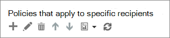

# Configurar directivas de vínculos seguros de Office 365 ATPSet up Office 365 ATP Safe Links policies

> [!IMPORTANT]
> Este artículo está destinado a los clientes empresariales que tienen la [Protección contra amenazas avanzada de Office 365](office-365-atp.md).This article is intended for business customers who have [Office 365 Advanced Threat Protection](office-365-atp.md). Si es un usuario doméstico que busca información sobre vínculos seguros en Outlook, consulte [Advanced Outlook.com Security](https://support.office.com/article/882d2243-eab9-4545-a58a-b36fee4a46e2).If you are a home user looking for information about Safe Links in Outlook, see [Advanced Outlook.com security](https://support.office.com/article/882d2243-eab9-4545-a58a-b36fee4a46e2).

[Vínculos seguros ATP](atp-safe-links.md), una característica de la [protección contra amenazas avanzada](office-365-atp.md) (atp) de Office 365, puede ayudar a proteger su organización de vínculos malintencionados usados en suplantación de identidad (phishing) y otros ataques.[ATP Safe Links](atp-safe-links.md), a feature of [Office 365 Advanced Threat Protection](office-365-atp.md) (ATP), can help protect your organization from malicious links used in phishing and other attacks. Si dispone de los [permisos necesarios para el centro de seguridad &amp; y cumplimiento de Office 365](permissions-in-the-security-and-compliance-center.md), puede configurar directivas de vínculos seguros de ATP para ayudar a garantizar que cuando los usuarios hagan clic en direcciones web (URL), su organización esté protegida.If you have the necessary [permissions for the Office 365 Security &amp; Compliance Center](permissions-in-the-security-and-compliance-center.md), you can set up ATP Safe Links policies to help ensure that when people click web addresses (URLs), your organization is protected. Las directivas de vínculos seguros de ATP se pueden configurar para analizar direcciones URL en correo electrónico y direcciones URL en documentos de Office.Your ATP Safe Links policies can be configured to scan URLs in email and URLs in Office documents.

Con los vínculos seguros ATP habilitados, si un usuario hace clic en un vínculo en un correo electrónico y la lista de direcciones URL bloqueadas personalizadas de la organización ha bloqueado la URL, o si la dirección URL se determina como malintencionada, se abrirá una página de advertencia.With ATP Safe Links enabled, if a user clicks on a link in an email and the URL has been blocked by your organization's custom blocked URL list or if the URL is determined to be malicious, a warning page will open.
  
[Las nuevas características se agregan continuamente a ATP](office-365-atp.md#new-features-in-office-365-atp).[New features are continually being added to ATP](office-365-atp.md#new-features-in-office-365-atp). A medida que se agreguen nuevas características, es posible que deba realizar ajustes en las directivas de vínculos seguros de ATP existentes.As new features are added, you may need to make adjustments to your existing ATP Safe Links policies.

## Qué hacerWhat to do 
  
1. Revise los requisitos previos.Review the prerequisites.
    
2. Revise y edite la directiva predeterminada de vínculos seguros de ATP que se aplica a todos los usuarios.Review and edit the default ATP Safe Links policy that applies to everyone. Por ejemplo, puede [configurar la lista de direcciones URL bloqueadas personalizadas para vínculos seguros ATP](set-up-a-custom-blocked-urls-list-wtih-atp.md).For example, you can [set up your custom blocked URLs list for ATP Safe Links](set-up-a-custom-blocked-urls-list-wtih-atp.md).
    
3. Agregar o editar directivas para destinatarios de correo electrónico específicos, incluida [la configuración de la lista de direcciones URL "no reescribir" personalizadas para vínculos seguros de ATP](set-up-a-custom-do-not-rewrite-urls-list-with-atp.md).Add or edit policies for specific email recipients, including [setting up your custom "Do not rewrite" URLs list for ATP Safe Links](set-up-a-custom-do-not-rewrite-urls-list-with-atp.md).
    
4. Obtenga información sobre las opciones de directiva de vínculos seguros de ATP (en este artículo), incluida la configuración de cambios recientes.Learn about ATP Safe Links policy options (in this article), including settings for recent changes.
    
## Paso 1: revisar los requisitos previosStep 1: Review the prerequisites

- Asegúrese de que su organización tiene la [protección contra amenazas avanzada de Office 365](office-365-atp.md).Make sure that your organization has [Office 365 Advanced Threat Protection](office-365-atp.md).
    
- Asegúrese de que tiene los permisos necesarios.Make sure that you have the necessary permissions. Para definir (o editar) las directivas de ATP, debe tener asignado un rol apropiado.To define (or edit) ATP policies, you must be assigned an appropriate role. En la tabla siguiente se describen algunos ejemplos:Some examples are described in the following table:  

    |RoleRole  |Dónde y cómo se asignaWhere/how assigned  |
    |---------|---------|
    |Administrador global de Office 365Office 365 Global Administrator |La persona que se registra para comprar Office 365 es un administrador global de forma predeterminada.The person who signs up to buy Office 365 is a global admin by default. (Consulte [acerca de los roles de administrador de Office 365](https://docs.microsoft.com/office365/admin/add-users/about-admin-roles) para obtener más información).(See [About Office 365 admin roles](https://docs.microsoft.com/office365/admin/add-users/about-admin-roles) to learn more.)         |
    |Administrador de seguridadSecurity Administrator |Centro de administración de Azure Active[https://aad.portal.azure.com](https://aad.portal.azure.com)Directory ()Azure Active Directory admin center ([https://aad.portal.azure.com](https://aad.portal.azure.com))|
    |Administración de la organización en Exchange OnlineExchange Online Organization Management |Centro de administración de[https://outlook.office365.com/ecp](https://outlook.office365.com/ecp)Exchange ()Exchange admin center ([https://outlook.office365.com/ecp](https://outlook.office365.com/ecp))  oor    Cmdlets de PowerShell (vea [Exchange Online PowerShell](https://docs.microsoft.com/powershell/exchange/exchange-online/exchange-online-powershell))PowerShell cmdlets (See [Exchange Online PowerShell](https://docs.microsoft.com/powershell/exchange/exchange-online/exchange-online-powershell)) |

    Para obtener más información acerca de los roles y los permisos, consulte [Permissions in the Office 365 Security &amp; Compliance Center](permissions-in-the-security-and-compliance-center.md).To learn more about roles and permissions, see [Permissions in the Office 365 Security &amp; Compliance Center](permissions-in-the-security-and-compliance-center.md).

- Asegúrese de que los clientes de Office estén configurados para usar la [autenticación moderna](https://docs.microsoft.com/office365/enterprise/modern-auth-for-office-2013-and-2016) (esto es para la protección de vínculos seguros de ATP en documentos de Office).Make sure that Office clients are configured to use [Modern Authentication](https://docs.microsoft.com/office365/enterprise/modern-auth-for-office-2013-and-2016) (this is for ATP Safe Links protection in Office documents).
    
- [Obtenga información sobre las opciones de directiva de vínculos seguros de ATP](#step-4-learn-about-atp-safe-links-policy-options) (en este artículo).[Learn about ATP Safe Links policy options](#step-4-learn-about-atp-safe-links-policy-options) (in this article). 

- Espere hasta 30 minutos para que la directiva nueva o actualizada se extienda a todos los centros de seguridad de Office 365.Allow up to 30 minutes for your new or updated policy to spread to all Office 365 datacenters.
    
## Paso 2: definir (o revisar) la Directiva de vínculos seguros de ATP que se aplica a todos los usuariosStep 2: Define (or review) the ATP Safe Links policy that applies to everyone

Cuando tenga la [protección contra amenazas avanzada de Office 365](office-365-atp.md), tendrá una directiva predeterminada de vínculos seguros de ATP que se aplica a todos los usuarios de la organización.When you have [Office 365 Advanced Threat Protection](office-365-atp.md), you will have a default ATP Safe Links policy that applies to everyone in your organization. Asegúrese de revisar y, si es necesario, modifique la directiva predeterminada.Make sure to review, and if needed, edit your default policy.
  
1. Vaya a [https://protection.office.com](https://protection.office.com) e inicie sesión con su cuenta profesional o educativa.Go to [https://protection.office.com](https://protection.office.com) and sign in with your work or school account. 
    
2. En el panel de navegación izquierdo, en **Administración de amenazas**, elija **vínculos seguros**de \*\*directiva \> \*\* .In the left navigation, under **Threat management**, choose **Policy \>** **Safe Links**.
    
3. En la sección **directivas que se aplican a toda la organización** , seleccione predeterminado y, a continuación, elija **Editar** (el botón Editar **es**similar a un lápiz).In the **Policies that apply to the entire organization** section, select **Default**, and then choose **Edit** (the Edit button resembles a pencil). 
  
4. En la sección **bloquear las siguientes direcciones URL** , especifique una o más direcciones URL en las que desee impedir que los usuarios de la organización puedan visitar.In the **Block the following URLs** section, specify one or more URLs that you want to prevent people in your organization from visiting. (Consulte [configurar una lista de direcciones URL bloqueadas personalizadas mediante vínculos seguros de ATP](set-up-a-custom-blocked-urls-list-wtih-atp.md)).(See [Set up a custom blocked URLs list using ATP Safe Links](set-up-a-custom-blocked-urls-list-wtih-atp.md).)
    
5. En la sección **configuración que se aplica a los contenidos excepto el correo electrónico** , active (o desactive) las opciones que desee usar.In the **Settings that apply to content except email** section, select (or clear) the options you want to use. (Le recomendamos que seleccione todas las opciones).(We recommend that you select all the options.) 
    
6. Elija **Guardar**.Choose **Save**.
    
## Paso 3: agregar (o editar) directivas de vínculos seguros de ATP que se aplican a destinatarios de correo electrónico específicosStep 3: Add (or edit) ATP Safe Links policies that apply to specific email recipients

Una vez que haya revisado (o editado) la directiva predeterminada de vínculos seguros de ATP que se aplica a todos los usuarios, el siguiente paso consiste en definir directivas adicionales que se aplicarán a destinatarios específicos.After you have reviewed (or edited) the default ATP Safe Links policy that applies to everyone, your next step is to define additional policies that would apply to specific recipients. Por ejemplo, puede especificar excepciones a su directiva predeterminada definiendo una directiva adicional.For example, you can specify exceptions to your default policy by defining an additional policy. 
  
1. Vaya a [https://protection.office.com](https://protection.office.com) e inicie sesión con su cuenta profesional o educativa.Go to [https://protection.office.com](https://protection.office.com) and sign in with your work or school account. 
    
2. En el panel de navegación izquierdo, en **Administración de amenazas**, elija **Directiva**.In the left navigation, under **Threat management**, choose **Policy**.
    
3. Elija **vínculos seguros**.Choose **Safe Links**.
    
4. En la sección **directivas que se aplican a destinatarios específicos** , elija **nuevo** (el botón nuevo es similar a un **+** signo más ()).In the **Policies that apply to specific recipients** section, choose **New** (the New button resembles a plus sign ( **+**)). 
  
5. Especifique el nombre, la descripción y la configuración de la directiva.Specify the name, description, and settings for your policy. **Ejemplo:** Para configurar una directiva denominada "no hay clic directo a través de" que no permite a los usuarios de un grupo determinado de su organización hacer clic a través de un sitio web específico sin protección de vínculos seguros de ATP, puede especificar la siguiente configuración recomendada:**Example:** To set up a policy called "no direct click through" that does not allow people in a certain group in your organization to click through to a specific website without ATP Safe Links protection, you might specify the following recommended settings: 
    
    - En el cuadro **nombre** , escriba sin clic directo.In the **Name** box, type no direct click through.

    - En el cuadro **Descripción** , escriba una descripción como, para evitar que los usuarios de determinados grupos puedan hacer clic en un sitio web sin verificación de vínculos seguros de ATP.In the **Description** box, type a description like, Prevents people in certain groups from clicking through to a website without ATP Safe Links verification.

    - En **Seleccione la acción para direcciones URL potencialmente malintencionadas desconocidas en los mensajes**, elija **activado**.Under **Select the action for unknown potentially malicious URLs in messages**, choose **On**.

    - Si ve **la acción correspondiente a direcciones URL potencialmente malintencionadas o desconocidas en Microsoft Teams**, seleccione **activado**.If you see **Select the action for unknown or potentially malicious URLs within Microsoft Teams**, choose **On**.  

    - Seleccione **aplicar análisis de URL en tiempo real para vínculos sospechosos y vínculos que apunten a archivos** si desea habilitar la detonación de dirección URL para direcciones URL que señalen archivos y sospechosos (recomendado).Select **Apply real-time URL scanning for suspicious links and links that point to files** if you would like to enable URL detonation for suspicious and file-pointing URLs (recommended). Y seleccione **esperar a que se complete el análisis de URL antes de entregar el mensaje** si solo quiere que los usuarios reciban mensajes después de que se hayan examinado completamente las direcciones URL.And select **Wait for URL scanning to complete before delivering the message** if you wish to only have users receive messages after the URLs have been fully scanned.

    - Seleccione **aplicar vínculos seguros a los mensajes enviados dentro de la organización** si desea habilitar vínculos seguros para los mensajes enviados entre usuarios de la organización (recomendado).Select **Apply Safe Links to messages sent within the organization** if you would like to enable Safe Links for messages sent between users within your organization (recommended).

    - Seleccione no permitir que el **usuario haga clic a través de la dirección URL original** si no desea que los usuarios individuales invaliden las páginas *de notificación de análisis en curso* o *URL bloqueadas* .Select **Do not allow user to click through to original URL** if you do not wish the individual users to override a *scan in progress* or *URL blocked* notification pages.

    - (Opcional) En la sección no **reescribir las siguientes direcciones URL** , especifique una o más direcciones URL que se consideren seguras para su organización.(This is optional) In the **Do not rewrite the following URLs** section, specify one or more URLs that are considered to be safe for your organization. (Consulte [configurar una lista de direcciones URL personalizadas "no reescribir" mediante vínculos seguros ATP](set-up-a-custom-do-not-rewrite-urls-list-with-atp.md))(See [Set up a custom "Do not rewrite" URLs list using ATP Safe Links](set-up-a-custom-do-not-rewrite-urls-list-with-atp.md))

    - En la sección **aplicado a** , elija **el destinatario es miembro de**y, a continuación, elija el grupo o los grupos que desea incluir en la Directiva.In the **Applied To** section, choose **The recipient is a member of**, and then choose the group(s) you want to include in your policy. Elija **Agregar**y, después, haga clic en **Aceptar**.Choose **Add**, and then choose **OK**.
    
6. Elija **Guardar**.Choose **Save**.

> [!NOTE]
> Las directivas de vínculos seguros de ATP con prioridad más alta tendrán prioridad.ATP Safe Links policies with higher priority will take precedence. Si un usuario está sujeto a dos o más directivas, sólo tendrá efecto la Directiva de mayor prioridad.If a user is subject to two or more polices, only the higher priority policy will take effect.
    
## Paso 4: información sobre las opciones de directiva de vínculos seguros de ATPStep 4: Learn about ATP Safe Links policy options

Al configurar o editar las directivas de vínculos seguros de ATP, verá que hay varias opciones disponibles.As you set up or edit your ATP Safe Links policies, will see several options available. En caso de que se pregunte Cuáles son estas opciones, en la tabla siguiente se describe cada una de ellas y su efecto.In case you are wondering what these options are, the following table describes each one and its effect. Recuerde que hay dos tipos principales de directivas de vínculos seguros de ATP que debe definir o editar:Remember that there are two main kinds of ATP Safe Links policies to define or edit:
- una [directiva predeterminada](#default-policy-options) que se aplica a todos los usuarios; ya [default policy](#default-policy-options) that applies to everyone; and  
- [directivas adicionales para destinatarios específicos](#policies-that-apply-to-specific-email-recipients)additional [policies for specific recipients](#policies-that-apply-to-specific-email-recipients) 

### Opciones de directivas predeterminadasDefault policy options

Las opciones de directiva predeterminadas se aplican a todos los usuarios de la organización.Default policy options apply to everyone in your organization.

|Esta opciónThis option  |Se obtiene este resultadoDoes this  |
|---------|---------|
| **Bloquear las siguientes direcciones URL****Block the following URLs**      | Permite a su organización tener una lista personalizada de direcciones URL que se bloquean automáticamente.Enables your organization to have a custom list of URLs that are automatically blocked. Cuando los usuarios hagan clic en una dirección URL de esta lista, se les redirigirá a una [Página de advertencia](atp-safe-links-warning-pages.md) que explica por qué se bloquea la dirección URL.When users click a URL in this list, they'll be taken to a [warning page](atp-safe-links-warning-pages.md) that explains why the URL is blocked. Para obtener más información, consulte [configurar una lista de direcciones URL bloqueadas personalizadas con los vínculos seguros de Office 365 ATP](set-up-a-custom-blocked-urls-list-wtih-atp.md).To learn more, see [Set up a custom blocked URLs list using Office 365 ATP Safe Links](set-up-a-custom-blocked-urls-list-wtih-atp.md). |
| **Office 365 ProPlus, Office para iOS y Android****Office 365 ProPlus, Office for iOS and Android**      | Cuando se selecciona esta opción, la protección de vínculos seguros de ATP se aplica a direcciones URL en archivos de Word, Excel y PowerPoint en Windows o Mac OS, mensajes de correo electrónico en Outlook, documentos de Office en dispositivos iOS o Android, archivos de Visio 2016 en Windows y archivos abiertos en las versiones web de las aplicaciones de Office (Word, PowerPoint, Excel, Outlook y OneNote), siempre y 365When this option is selected, ATP Safe Links protection is applied to URLs in Word, Excel, and PowerPoint files on Windows or Mac OS, email messages in Outlook, Office documents on iOS or Android devices, Visio 2016 files on Windows, and files open in the web versions of Office apps (Word, PowerPoint, Excel, Outlook, and OneNote), provided the user has signed in to Office 365. |
| **No hacer un seguimiento cuando los usuarios hacen clic en ATP vínculos seguros****Don't track when users click ATP Safe Links**    | Cuando se selecciona esta opción, se hace clic en datos de direcciones URL en Word, Excel, PowerPoint, documentos de Visio y los mensajes de correo electrónico de Outlook no se almacenan.When this option is selected, click data for URLs in Word, Excel, PowerPoint, Visio documents, and Outlook email messages is not stored.    |
|**No permitir que los usuarios haga clic en los vínculos seguros ATP a la dirección URL original****Don't let users click through ATP Safe Links to original URL**   |Cuando se selecciona esta opción, los usuarios no pueden continuar después de una [Página de advertencia](atp-safe-links-warning-pages.md) en una dirección URL que se determina como malintencionada.When this option is selected, users cannot proceed past a [warning page](atp-safe-links-warning-pages.md) to a URL that is determined to be malicious.    |

### Directivas que se aplican a destinatarios de correo electrónico específicosPolicies that apply to specific email recipients

|Esta opciónThis option  |Se obtiene este resultadoDoes this  |
|---------|---------|
|**Desactivado****Off**   |No examina direcciones URL en mensajes de correo electrónico.Does not scan URLs in email messages.    Permite definir una regla de excepción, como una regla que no examina direcciones URL en mensajes de correo electrónico para un grupo específico de destinatarios.Enables you to define an exception rule, such as a rule that does not scan URLs in email messages for a specific group of recipients.    |
|**On****On**   |Reescribe las direcciones URL para enrutar a los usuarios a través de la protección de vínculos seguros de ATP cuando los usuarios hacen clic en direcciones URL en mensajes de correo electrónico y habilita vínculos seguros de ATP en Outlook (C2R) en Windows.Rewrites URLs to route users through ATP Safe Links protection when the users click URLs in email messages and enables ATP Safe Links within Outlook (C2R) on Windows.    Comprueba una dirección URL al hacer clic en una lista de direcciones URL malintencionadas o bloqueadas y desencadena una detonación de la dirección URL en segundo plano si la dirección URL no tiene una reputación válida.Checks a URL when clicked against a list of blocked or malicious URLs and triggers a detonation of the URL in the background asynchronously if the URL does not have a valid reputation.    |
|**URL desconocidas o potencialmente malintencionadas en Microsoft Teams****Unknown or potentially malicious URLs within Microsoft Teams** |Cuando esta opción está disponible y seleccionada, activa vínculos seguros de ATP en los canales y chats de Microsoft Teams.When this option is available and selected, it turns on ATP Safe Links in Microsoft Teams chats and channels. Cuando un usuario hace clic en una dirección URL en un canal o chat de Microsoft Teams, se comprueba el vínculo.When a user clicks on a URL in a Microsoft Teams chat or channel, the link is checked. La dirección URL se comprueba con una lista de URL malintencionadas o bloqueadas y desencadena una detonación de la dirección URL en el fondo de forma asincrónica si la dirección URL no tiene una reputación válida.The URL is checked against a list of blocked or malicious URLs and triggers a detonation of the URL in the background asynchronously if the URL does not have a valid reputation. |
|**Aplicar un análisis de URL en tiempo real de vínculos y vínculos sospechosos que señalan a archivos****Apply real-time URL scanning for suspicious links and links that point to files**   |Cuando se selecciona esta opción, se examinan direcciones URL sospechosas y vínculos que apuntan al contenido descargable.When this option is selected, suspicious URLs and links that point to downloadable content are scanned.    |
|**Esperar a que se complete el análisis de URL antes de entregar el mensaje****Wait for URL scanning to complete before delivering the message**   |Cuando se selecciona esta opción, los mensajes que contienen direcciones URL que se examinarán se retendrán hasta que las direcciones URL terminen de analizar y se confirmen como seguras antes de que se entreguen los mensajes.When this option is selected, messages that contain URLs to be scanned will be held until the URLs finish scanning and are confirmed to be safe before the messages are delivered.    |
|**Aplicar vínculos seguros a los mensajes enviados dentro de la organización****Apply Safe Links to messages sent within the organization**   | Cuando se selecciona esta opción, la protección de vínculos seguros de ATP se aplica a los mensajes de correo electrónico enviados entre las personas de la organización, siempre que las cuentas de correo electrónico se hospeden en Office 365.When this option is selected, ATP Safe Links protection is applied to email messages sent between people in your organization, provided the email accounts are hosted in Office 365.    |
|**No hacer un seguimiento de los clics del usuario****Do not track user clicks**   |Cuando se selecciona esta opción, no se almacenan los datos de las direcciones URL del correo electrónico de remitentes externos.When this option is selected, click data for URLs in email from external senders is not stored. Dirección URL haga clic en seguimiento para los vínculos de los mensajes de correo electrónico enviados dentro de la organización actualmente no se admite.URL click tracking for links within email messages sent within the organization is currently not supported.    |
|**No permitir que los usuarios hagan clic a través de la dirección URL original****Do not allow users to click through to original URL**   |Cuando se selecciona esta opción, los usuarios no pueden continuar después de una [Página de advertencia](atp-safe-links-warning-pages.md) en una dirección URL que se determina como malintencionada.When this option is selected, users cannot proceed past a [warning page](atp-safe-links-warning-pages.md) to a URL that is determined to be malicious.    |
|**No volver a escribir las siguientes direcciones URL****Do not rewrite the following URLs**   |Deja las direcciones URL tal y como están.Leaves URLs as they are. Mantiene una lista personalizada de direcciones URL seguras que no necesitan análisis para un grupo específico de destinatarios de correo electrónico de la organización.Keeps a custom list of safe URLs that don't need scanning for a specific group of email recipients in your organization.  Consulte [configurar una lista de direcciones URL personalizadas "no reescribir" mediante vínculos seguros ATP](set-up-a-custom-do-not-rewrite-urls-list-with-atp.md) para obtener más información, incluidos los cambios recientes para la compatibilidad con asteriscos comodín (\*).See [Set up a custom "Do not rewrite" URLs list using ATP Safe Links](set-up-a-custom-do-not-rewrite-urls-list-with-atp.md) for more details, including recent changes to support for wildcard asterisks (\*).    |
   
## Pasos siguientesNext steps

Una vez que se hayan implementado las directivas de vínculos seguros de ATP, podrá ver cómo está trabajando ATP para su organización consultando los informes.Once your ATP Safe Links policies are in place, you can see how ATP is working for your organization by viewing reports. Vea los siguientes recursos para obtener más información:See the following resources to learn more:

- [Ver informes para la protección contra amenazas avanzada de Office 365View reports for Office 365 Advanced Threat Protection](view-reports-for-atp.md)

- [Usar el explorador en el &amp; centro de seguridad y cumplimientoUse Explorer in the Security &amp; Compliance Center](threat-explorer.md)

Manténgase al tanto de las nuevas características que llegarán a ATP.Stay on top of new features coming to ATP. visite el [plan de desarrollo de Microsoft 365](https://www.microsoft.com/microsoft-365/roadmap?filters=O365).visit the [Microsoft 365 Roadmap](https://www.microsoft.com/microsoft-365/roadmap?filters=O365).
