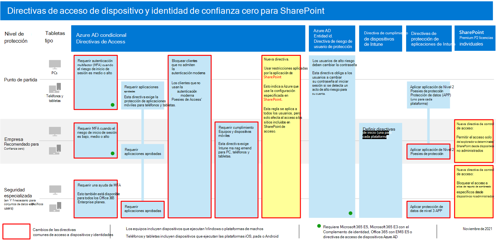
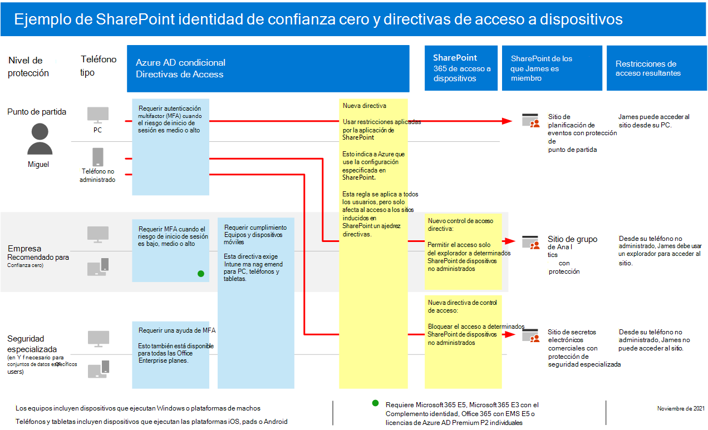

# Recomendaciones de directiva para proteger archivos y sitios de SharePointPolicy recommendations for securing SharePoint sites and files

**Se aplica a****Applies to**
- [Exchange Online ProtectionExchange Online Protection](exchange-online-protection-overview.md)
- [Plan 1 y Plan 2 de Microsoft Defender para Office 365Microsoft Defender for Office 365 plan 1 and plan 2](office-365-atp.md)
- SharePoint en lineaSharePoint Online 

En este artículo se describe cómo implementar las directivas de identidad y acceso a dispositivos recomendadas para proteger SharePoint y OneDrive para la Empresa.This article describes how to implement the recommended identity and device-access policies to protect SharePoint and OneDrive for Business. Esta guía se basa en las directivas [comunes de acceso a dispositivos y identidades.](identity-access-policies.md)This guidance builds on the [common identity and device access policies](identity-access-policies.md).

Estas recomendaciones se basan en tres niveles diferentes de seguridad y protección para archivos de SharePoint que se pueden aplicar en función de la granularidad de sus necesidades: **línea** **base,** confidencial y altamente **regulado.**These recommendations are based on three different tiers of security and protection for SharePoint files that can be applied based on the granularity of your needs: **baseline**, **sensitive**, and **highly regulated**. Puede obtener más información sobre estos niveles de seguridad y los sistemas operativos de cliente recomendados, a los que se hace referencia en estas recomendaciones [en la introducción](microsoft-365-policies-configurations.md).You can learn more about these security tiers, and the recommended client operating systems, referenced by these recommendations in [the overview](microsoft-365-policies-configurations.md).

Además de implementar esta guía, asegúrese de configurar los sitios de SharePoint con la cantidad de protección adecuada, incluida la configuración de permisos adecuados para contenido confidencial y altamente regulado.In addition to implementing this guidance, be sure to configure SharePoint sites with the right amount of protection, including setting appropriate permissions for sensitive and highly-regulated content.

## Actualizar directivas comunes para incluir SharePoint y OneDrive para la EmpresaUpdating common policies to include SharePoint and OneDrive for Business

Para proteger los archivos de SharePoint y OneDrive, en el siguiente diagrama se muestran las directivas que se actualizarán a partir de las directivas comunes de acceso a dispositivos y identidades.To protect files in SharePoint and OneDrive, the following diagram illustrates which policies to update from the the common identity and device access policies.

Si incluyó SharePoint al crear las directivas comunes, solo necesita crear las nuevas directivas.If you included SharePoint when you created the common policies, you only need to create the new policies. Para las directivas de acceso condicional, SharePoint incluye OneDrive.For Conditional Access policies, SharePoint includes OneDrive.

Las nuevas directivas implementan la protección de dispositivos para contenido confidencial y altamente regulado mediante la aplicación de requisitos de acceso específicos a los sitios de SharePoint que especifique.The new policies implement device protection for sensitive and highly-regulated content by applying specific access requirements to SharePoint sites that you specify.

En la tabla siguiente se enumeran las directivas que necesita revisar y actualizar o crear nuevas para SharePoint.The following table lists the policies you either need to review and update or create new for SharePoint. Las directivas comunes se vinculan a las instrucciones de configuración asociadas en [el artículo Identidad común y directivas de acceso a dispositivos.](identity-access-policies.md)The common policies link to the associated configuration instructions in the [Common identity and device access policies](identity-access-policies.md) article.

|Nivel de protecciónProtection level|DirectivasPolicies|Más informaciónMore information|
|---|---|---|
|**Baseline****Baseline**|[Requerir MFA cuando el riesgo de inicio de sesión *es medio* o *alto*Require MFA when sign-in risk is *medium* or *high*](identity-access-policies.md#require-mfa-based-on-sign-in-risk)|Incluir SharePoint en la asignación de aplicaciones en la nube.Include SharePoint in the assignment of cloud apps.|
||[Bloquear a los clientes que no sean compatibles con la autenticación modernaBlock clients that don't support modern authentication](identity-access-policies.md#block-clients-that-dont-support-multi-factor)|Incluir SharePoint en la asignación de aplicaciones en la nube.Include SharePoint in the assignment of cloud apps.|
||[Aplicar directivas de protección de datos de APPApply APP data protection policies](identity-access-policies.md#apply-app-data-protection-policies)|Asegúrate de que todas las aplicaciones recomendadas estén incluidas en la lista de aplicaciones.Be sure all recommended apps are included in the list of apps. Asegúrate de actualizar la directiva para cada plataforma (iOS, Android, Windows).Be sure to update the policy for each platform (iOS, Android, Windows).|
||[Exigir equipos PC compatiblesRequire compliant PCs](identity-access-policies.md#require-compliant-pcs-but-not-compliant-phones-and-tablets)|Incluir SharePoint en la lista de aplicaciones en la nube.Include SharePoint in list of cloud apps.|
||[Usar restricciones aplicadas por la aplicación en SharePointUse app enforced restrictions in SharePoint](#use-app-enforced-restrictions-in-sharepoint)|Agregue esta nueva directiva.Add this new policy. Esto indica a Azure Active Directory (Azure AD) que use la configuración especificada en SharePoint.This tells Azure Active Directory (Azure AD) to use the settings specified in SharePoint. Esta directiva se aplica a todos los usuarios, pero solo afecta al acceso a los sitios incluidos en las directivas de acceso de SharePoint.This policy applies to all users, but only affects access to sites included in SharePoint access policies.|
|**Confidencial****Sensitive**|[Requerir MFA cuando el riesgo de inicio de sesión *es bajo,* *medio* o *alto*Require MFA when sign-in risk is *low*, *medium* or *high*](identity-access-policies.md#require-mfa-based-on-sign-in-risk)|Incluir SharePoint en las asignaciones de aplicaciones en la nube.Include SharePoint in the assignments of cloud apps.|
||[Requerir equipos y *dispositivos* móviles compatiblesRequire compliant PCs *and* mobile devices](identity-access-policies.md#require-compliant-pcs-and-mobile-devices)|Incluir SharePoint en la lista de aplicaciones en la nube.Include SharePoint in the list of cloud apps.|
||[Directiva de control de acceso de SharePoint:](#sharepoint-access-control-policies)permitir el acceso de solo explorador a sitios específicos de SharePoint desde dispositivos no administrados.[SharePoint access control policy](#sharepoint-access-control-policies): Allow browser-only access to specific SharePoint sites from unmanaged devices.|Esto evita la edición y descarga de archivos.This prevents edit and download of files. Use PowerShell para especificar sitios.Use PowerShell to specify sites.|
|**Extremadamente regulado****Highly regulated**|[*Requerir* siempre MFA*Always* require MFA](identity-access-policies.md#require-mfa-based-on-sign-in-risk)|Incluir SharePoint en la asignación de aplicaciones en la nube.Include SharePoint in the assignment of cloud apps.|
||[Directiva de control de acceso de SharePoint:](#use-app-enforced-restrictions-in-sharepoint)bloquear el acceso a sitios específicos de SharePoint desde dispositivos no administrados.[SharePoint access control policy](#use-app-enforced-restrictions-in-sharepoint): Block access to specific SharePoint sites from unmanaged devices.|Use PowerShell para especificar sitios.Use PowerShell to specify sites.|
|

## Usar restricciones aplicadas por la aplicación en SharePointUse app-enforced restrictions in SharePoint

Si implementa controles de acceso en SharePoint, debe crear esta directiva de acceso condicional en Azure AD para que le diga a Azure AD que aplique las directivas que configure en SharePoint.If you implement access controls in SharePoint, you must create this Conditional Access policy in Azure AD to tell Azure AD to enforce the policies you configure in SharePoint. Esta directiva se aplica a todos los usuarios, pero solo afecta al acceso a los sitios que especifique con PowerShell al crear los controles de acceso en SharePoint.This policy applies to all users, but only affects access to the sites you specify using PowerShell when you create the access controls in SharePoint.

Para configurar esta directiva, vea "Bloquear o limitar el acceso a determinadas colecciones de sitios de SharePoint o cuentas de OneDrive" en Control access [from unmanaged devices](/sharepoint/control-access-from-unmanaged-devices).To configure this policy see "Block or limit access to specific SharePoint site collections or OneDrive accounts" in [Control access from unmanaged devices](/sharepoint/control-access-from-unmanaged-devices).

## Directivas de control de acceso de SharePointSharePoint access control policies

Microsoft recomienda proteger el contenido de los sitios de SharePoint con contenido confidencial y altamente regulado con controles de acceso a dispositivos.Microsoft recommends you protect content in SharePoint sites with sensitive and highly-regulated content with device access controls. Para ello, cree una directiva que especifique el nivel de protección y los sitios a los que aplicar la protección.You do this by creating a policy that specifies the level of protection and the sites to apply the protection to.

- Sitios confidenciales: permitir el acceso solo del explorador.Sensitive sites: Allow browser-only access. Esto impide que los usuarios editen y descarguen archivos.This prevents users from editing and downloading files.
- Sitios altamente regulados: bloquear el acceso desde dispositivos no administrados.Highly regulated sites: Block access from unmanaged devices.

Vea "Bloquear o limitar el acceso a colecciones de sitios de SharePoint específicas o cuentas de OneDrive" en [Control access from unmanaged devices](/sharepoint/control-access-from-unmanaged-devices).See "Block or limit access to specific SharePoint site collections or OneDrive accounts" in [Control access from unmanaged devices](/sharepoint/control-access-from-unmanaged-devices).

## Cómo funcionan conjuntamente estas directivasHow these policies work together

Es importante comprender que los permisos de sitio de SharePoint suelen basarse en la necesidad empresarial de acceso a los sitios.It's important to understand that SharePoint site permissions are typically based on business need for access to sites. Estos permisos los administran los propietarios del sitio y pueden ser altamente dinámicos.These permissions are managed by site owners and can be highly dynamic. El uso de directivas de acceso a dispositivos de SharePoint garantiza la protección de estos sitios, independientemente de si los usuarios están asignados a un grupo de Azure AD asociado con la protección de línea base, confidencial o altamente regulada.Using SharePoint device access policies ensures protection to these sites, regardless of whether users are assigned to an Azure AD group associated with baseline, sensitive, or highly regulated protection.

En la siguiente ilustración se proporciona un ejemplo de cómo las directivas de acceso a dispositivos de SharePoint protegen el acceso a los sitios de un usuario.The following illustration provides an example of how SharePoint device access policies protect access to sites for a user.

[Ver una versión más grande de esta imagenSee a larger version of this image](https://github.com/MicrosoftDocs/microsoft-365-docs/raw/public/microsoft-365/media/microsoft-365-policies-configurations/SharePoint-rules-scenario.png)

James tiene asignadas directivas de acceso condicional de línea base, pero se le puede dar acceso a sitios de SharePoint con protección confidencial o altamente regulada.James has baseline Conditional Access policies assigned, but he can be given access to SharePoint sites with sensitive or highly-regulated protection.

- Si James tiene acceso a un sitio confidencial o altamente regulado, es miembro del uso de su equipo, su acceso se concede siempre que su EQUIPO cumpla con las normas.If James accesses a sensitive or highly-regulated site he is a member of using his PC, his access is granted as long as his PC is compliant.
- Si James tiene acceso a un sitio confidencial, es miembro del uso de su teléfono no administrado, que está permitido para los usuarios de línea base, recibirá acceso de solo explorador al sitio confidencial debido a la directiva de acceso de dispositivos configurada para este sitio.If James accesses a sensitive site he is a member of using his unmanaged phone, which is allowed for baseline users, he will receive browser-only access to the sensitive site due to the device access policy configured for this site.
- Si James tiene acceso a un sitio altamente regulado, es miembro del uso de su teléfono no administrado, se bloqueará debido a la directiva de acceso configurada para este sitio.If James accesses a highly regulated site he is a member of using his unmanaged phone, he will be blocked due to the access policy configured for this site. Solo puede acceder a este sitio con su equipo administrado y compatible.He can only access this site using his managed and compliant PC.

## Paso siguienteNext step

Configurar directivas de acceso condicional para:Configure Conditional Access policies for:

- [Microsoft TeamsMicrosoft Teams](teams-access-policies.md)
- [Exchange OnlineExchange Online](secure-email-recommended-policies.md)