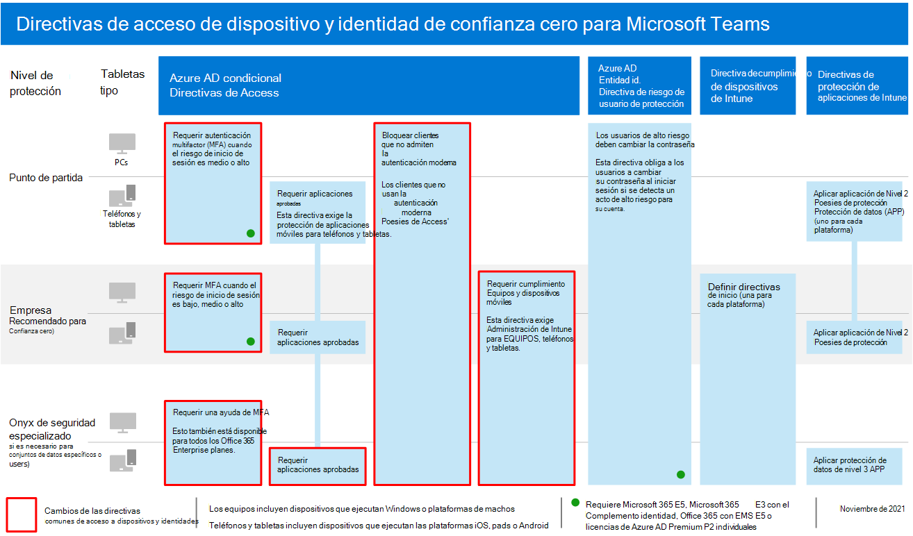
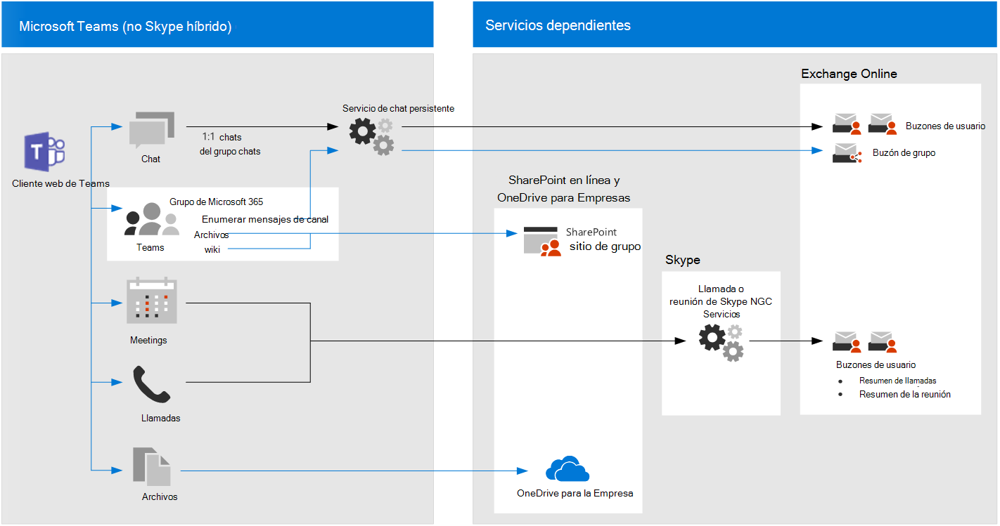

# Recomendaciones de directiva para proteger los chats, grupos y archivos de TeamsPolicy recommendations for securing Teams chats, groups, and files

En este artículo se describe cómo implementar las directivas recomendadas de acceso a dispositivos e identidades para proteger los chats, grupos y contenido de Microsoft Teams, como archivos y calendarios.This article describes how to implement the recommended identity and device-access policies to protect Microsoft Teams chats, groups, and content such as files and calendars. Esta guía se basa en las directivas comunes [de acceso](identity-access-policies.md)a dispositivos e identidades, con información adicional específica de Teams.This guidance builds on the [common identity and device access policies](identity-access-policies.md), with additional information that's Teams-specific. Dado que Teams se integra con nuestros otros productos, vea también recomendaciones de directiva para proteger archivos y sitios de [SharePoint](sharepoint-file-access-policies.md) y recomendaciones de directiva [para proteger el correo electrónico.](secure-email-recommended-policies.md)Because Teams integrates with our other products, also see [Policy recommendations for securing SharePoint sites and files](sharepoint-file-access-policies.md) and [Policy recommendations for securing email](secure-email-recommended-policies.md).

Estas recomendaciones se basan en tres niveles diferentes de seguridad y protección para Teams que se pueden aplicar en función de la granularidad de sus necesidades: línea base, confidencial y altamente regulado.These recommendations are based on three different tiers of security and protection for Teams that can be applied based on the granularity of your needs: baseline, sensitive, and highly regulated. Puede obtener más información sobre estos niveles de seguridad y las directivas recomendadas a las que hacen referencia estas recomendaciones en las configuraciones de acceso a dispositivos e [identidades.](microsoft-365-policies-configurations.md)You can learn more about these security tiers and the recommended policies referenced by these recommendations in the [Identity and device access configurations](microsoft-365-policies-configurations.md).

En este artículo se incluyen más recomendaciones específicas para la implementación de Teams con el fin de cubrir circunstancias de autenticación específicas, incluidos los usuarios externos a la organización.More recommendations specific to Teams deployment are included in this article to cover specific authentication circumstances, including for users outside your organization. Deberá seguir estas instrucciones para obtener una experiencia de seguridad completa.You will need to follow this guidance for a complete security experience.

## Introducción a Teams antes que otros servicios dependientesGetting started with Teams before other dependent services

No es necesario habilitar los servicios dependientes para empezar a trabajar con Microsoft Teams.You don't need to enable dependent services to get started with Microsoft Teams. Todos estos servicios "solo funcionarán".These services will all "just work." Sin embargo, debe estar preparado para administrar los siguientes elementos relacionados con el servicio:However, you do need to be prepared to manage the following service-related elements:

- Grupos de Microsoft 365Microsoft 365 groups
- Sitios de grupo de SharePointSharePoint team sites
- OneDrive para la EmpresaOneDrive for Business
- Buzones de ExchangeExchange mailboxes
- Transmitir vídeos y planes de Planner (si estos servicios están habilitados)Stream videos and Planner plans (if these services are enabled)

## Actualización de directivas comunes para incluir TeamsUpdating common policies to include Teams

Para proteger el chat, los grupos y el contenido de Teams, en el siguiente diagrama se ilustran las directivas que se actualizarán a partir de las directivas comunes de acceso a dispositivos e identidades.To protect chat, groups and content in Teams, the following diagram illustrates which policies to update from the the common identity and device access policies. Para que cada directiva se actualice, asegúrese de que Teams y los servicios dependientes se incluyen en la asignación de aplicaciones en la nube.For each policy to update, make sure that Teams and dependent services are included in the assignment of cloud apps.

[Ver una versión más grande de esta imagenSee a larger version of this image](https://github.com/MicrosoftDocs/microsoft-365-docs/raw/public/microsoft-365/media/microsoft-365-policies-configurations/identity-access-ruleset-teams.png)

Estos servicios son los servicios dependientes que se deben incluir en la asignación de aplicaciones en la nube para Teams:These services are the dependent services to include in the assignment of cloud apps for Teams:

- Microsoft TeamsMicrosoft Teams
- SharePoint y OneDrive para la EmpresaSharePoint and OneDrive for Business
- Exchange OnlineExchange Online
- Skype Empresarial OnlineSkype for Business Online
- Microsoft Stream (grabaciones de reuniones)Microsoft Stream (meeting recordings)
- Microsoft Planner (tareas de Planner y datos del plan)Microsoft Planner (Planner tasks and plan data)

En esta tabla se enumeran las directivas que deben revisarse y los vínculos a cada directiva en las directivas comunes de acceso a dispositivos e identidades, que tiene la directiva más amplia establecida para todas las aplicaciones de Office.This table lists the policies that need to be revisited and links to each policy in the [common identity and device access policies](identity-access-policies.md), which has the wider policy set for all Office applications.

|Nivel de protecciónProtection level|DirectivasPolicies|Más información sobre la implementación de TeamsFurther information for Teams implementation|
|---|---|---|
|**Baseline****Baseline**|[Requerir MFA cuando el riesgo de inicio de sesión *es medio* o *alto*Require MFA when sign-in risk is *medium* or *high*](identity-access-policies.md#require-mfa-based-on-sign-in-risk)|Asegúrese de que Teams y los servicios dependientes se incluyen en la lista de aplicaciones.Be sure Teams and dependent services are included in the list of apps. Teams también tiene reglas de acceso de invitado y acceso externo que se deben tener en cuenta. Más adelante en este artículo encontrará más información sobre estas reglas.Teams has Guest Access and External Access rules to consider as well, you'll learn more about these rules later in this article.|
||[Bloquear a los clientes que no sean compatibles con la autenticación modernaBlock clients that don't support modern authentication](identity-access-policies.md#block-clients-that-dont-support-multi-factor)|Incluir Teams y servicios dependientes en la asignación de aplicaciones en la nube.Include Teams and dependent services in the assignment of cloud apps.|
||[Los usuarios de riesgo alto tienen que cambiar la contraseñaHigh risk users must change password](identity-access-policies.md#high-risk-users-must-change-password)|Fuerza a los usuarios de Teams a cambiar su contraseña al iniciar sesión si se detecta actividad de alto riesgo para su cuenta.Forces Teams users to change their password when signing in if high-risk activity is detected for their account. Asegúrese de que Teams y los servicios dependientes se incluyen en la lista de aplicaciones.Be sure Teams and dependent services are included in the list of apps.|
||[Aplicar directivas de protección de datos de APPApply APP data protection policies](identity-access-policies.md#apply-app-data-protection-policies)|Asegúrese de que Teams y los servicios dependientes se incluyen en la lista de aplicaciones.Be sure Teams and dependent services are included in the list of apps. Actualiza la directiva para cada plataforma (iOS, Android, Windows).Update the policy for each platform (iOS, Android, Windows).|
||[Definir directivas de cumplimiento de dispositivosDefine device compliance policies](identity-access-policies.md#define-device-compliance-policies)|Incluya Teams y servicios dependientes en esta directiva.Include Teams and dependent services in this policy.|
||[Exigir equipos PC compatiblesRequire compliant PCs](identity-access-policies.md#require-compliant-pcs-but-not-compliant-phones-and-tablets)|Incluya Teams y servicios dependientes en esta directiva.Include Teams and dependent services in this policy.|
|**Confidencial****Sensitive**|[Requerir MFA cuando el riesgo de inicio de sesión *es bajo,* *medio* o *alto*Require MFA when sign-in risk is *low*, *medium* or *high*](identity-access-policies.md#require-mfa-based-on-sign-in-risk)|Teams también tiene reglas de acceso de invitado y acceso externo que se deben tener en cuenta. Más adelante en este artículo encontrará más información sobre estas reglas.Teams has Guest Access and External Access rules to consider as well, you'll learn more about these rules later in this article. Incluya Teams y servicios dependientes en esta directiva.Include Teams and dependent services in this policy.|
||[Requerir equipos y *dispositivos* móviles compatiblesRequire compliant PCs *and* mobile devices](identity-access-policies.md#require-compliant-pcs-and-mobile-devices)|Incluya Teams y servicios dependientes en esta directiva.Include Teams and dependent services in this policy.|
|**Extremadamente regulado****Highly regulated**|[*Requerir* siempre MFA*Always* require MFA](identity-access-policies.md#require-mfa-based-on-sign-in-risk)|Independientemente de la identidad del usuario, su organización usará MFA.Regardless of user identity, MFA will be used by your organization. Incluya Teams y servicios dependientes en esta directiva.Include Teams and dependent services in this policy. |
|

## Arquitectura de servicios dependientes de TeamsTeams dependent services architecture

Como referencia, el siguiente diagrama ilustra los servicios en los que se basa Teams.For reference, the following diagram illustrates the services Teams relies on. Para obtener más información e ilustraciones, vea Microsoft Teams y los servicios de productividad relacionados [en Microsoft 365 para arquitectos de TI.](../../solutions/productivity-illustrations.md)For more information and illustrations, see [Microsoft Teams and related productivity services in Microsoft 365 for IT architects](../../solutions/productivity-illustrations.md).

[Ver una versión más grande de esta imagenSee a larger version of this image](https://github.com/MicrosoftDocs/microsoft-365-docs/raw/public/microsoft-365/media/microsoft-365-policies-configurations/identity-access-logical-architecture-teams.png)

## Acceso externo y de invitado para TeamsGuest and external access for Teams

Microsoft Teams define los siguientes tipos de acceso:Microsoft Teams defines the following access types:

- **El** acceso de invitado usa una cuenta B2B de Azure AD para un usuario invitado o externo que se puede agregar como miembro de un equipo y tener acceso con permiso a la comunicación y los recursos del equipo.**Guest access** uses an Azure AD B2B account for a guest or external user that can be added as a member of a team and have all permissioned access to the communication and resources of the team.

- **El acceso** externo es para un usuario externo que no tiene una cuenta B2B de Azure AD.**External access** is for an external user that does not have an Azure AD B2B account. El acceso externo puede incluir invitaciones y participación en llamadas, chats y reuniones, pero no incluye la pertenencia al equipo ni el acceso a los recursos del equipo.External access can include invitations and participation in calls, chats, and meetings, but does not include team membership and access to the resources of the team.

Las directivas de acceso condicional solo se aplican al acceso de invitado en Teams porque hay una cuenta B2B de Azure AD correspondiente.Conditional Access policies only apply to guest access in Teams because there is a corresponding Azure AD B2B account.

<!--
In Azure AD, guest and external users are the same. The user type for both of these is Guest. Guest users are B2B users. Microsoft Teams differentiates between guest users and external users in the app. While it's important to understand how each of these are treated in Teams, both types of users are B2B users in Azure AD and the recommended policies for B2B users apply to both.

-->

Para ver las directivas recomendadas para permitir el acceso a usuarios invitados y externos con una cuenta B2B de Azure AD, vea Directivas para permitir el acceso a cuentas [B2B](identity-access-policies-guest-access.md)externas y de invitado.For recommended policies to allow access for guest and external users with an Azure AD B2B account, see [Policies for allowing guest and external B2B account access](identity-access-policies-guest-access.md).

### Acceso de invitado a TeamsGuest access in Teams

Además de las directivas para los usuarios internos de su empresa u organización, los administradores pueden habilitar el acceso de invitado para permitir, de forma individual, que las personas externas a su empresa u organización accedan a los recursos de Teams e interactúen con personas internas para cosas como conversaciones de grupo, chat y reuniones.In addition to the policies for users who are internal to your business or organization, administrators may enable guest access to allow, on a user-by-user basis, people who are external to your business or organization to access Teams resources and interact with internal people for things like group conversations, chat, and meetings.

Para obtener más información sobre el acceso de invitados y cómo implementarlo, vea [Acceso de invitados de Teams.](https://docs.microsoft.com/microsoftteams/guest-access)For more information about guest access and how to implement it, see  [Teams guest access](https://docs.microsoft.com/microsoftteams/guest-access).

### Acceso externo en TeamsExternal access in Teams

El acceso externo a veces se confunde con el acceso de invitado, por lo que es importante tener claro que estos dos mecanismos de acceso no internos son diferentes tipos de acceso.External access is sometimes confused with guest access, so it's important to be clear that these two non-internal access mechanisms are different types of access.

El acceso externo es una forma de que los usuarios de Teams de un dominio externo completo puedan buscar, llamar, chatear y configurar reuniones con sus usuarios en Teams.External access is a way for Teams users from an entire external domain to find, call, chat, and set up meetings with your users in Teams. Los administradores de Teams configuran el acceso externo en el nivel de la organización.Teams administrators configure external access at the organization level. Para obtener más información, vea [Administrar el acceso externo en Microsoft Teams.](https://docs.microsoft.com/microsoftteams/manage-external-access)For more information, see [Manage external access in Microsoft Teams](https://docs.microsoft.com/microsoftteams/manage-external-access).

Los usuarios de acceso externo tienen menos acceso y funcionalidad que una persona que se ha agregado a través del acceso de invitado.External access users have less access and functionality than an individual who's been added via guest access. Por ejemplo, los usuarios de acceso externo pueden chatear con los usuarios internos con Teams, pero no pueden acceder a canales de equipo, archivos u otros recursos.For example, external access users can chat with your internal users with Teams but cannot access team channels, files, or other resources.

El acceso externo no usa cuentas de usuario B2B de Azure AD y, por lo tanto, no usa directivas de acceso condicional.External access does not use Azure AD B2B user accounts and therefore does not use Conditional Access policies.

## Directivas de TeamsTeams policies

Fuera de las directivas comunes enumeradas anteriormente, hay directivas específicas de Teams que pueden y deben configurarse para administrar diversas funcionalidades de Teams.Outside of the common policies listed above, there are Teams-specific policies that can and should be configured to manage various Teams functionalities.

### Directivas de teams y canalesTeams and channels policies

Los equipos y los canales son dos elementos que se usan habitualmente en Microsoft Teams y hay directivas que puede establecer para controlar lo que los usuarios pueden y no pueden hacer al usar equipos y canales.Teams and channels are two commonly used elements in Microsoft Teams, and there are policies you can put in place to control what users can and cannot do when using teams and channels. Aunque puede crear un equipo global, si su organización tiene 5000 usuarios o menos, es probable que le sea útil tener equipos y canales más pequeños para propósitos específicos, en línea con las necesidades de su organización.While you can create a global team, if your organization has 5000 users or less, you are likely to find it helpful to have smaller teams and channels for specific purposes, in-line with your organizational needs.

Se recomienda cambiar la directiva predeterminada o crear directivas personalizadas, y puede obtener más información sobre cómo administrar las directivas en este vínculo: Administrar directivas de equipos [en Microsoft Teams.](https://docs.microsoft.com/microsoftteams/teams-policies)Changing the default policy or creating custom policies would be recommended, and you can learn more about managing your policies at this link: [Manage teams policies in Microsoft Teams](https://docs.microsoft.com/microsoftteams/teams-policies).

### Directivas de mensajeríaMessaging policies

La mensajería o el chat también se pueden administrar a través de la directiva global predeterminada o mediante directivas personalizadas, lo que puede ayudar a los usuarios a comunicarse entre sí de una forma adecuada para su organización.Messaging, or chat, can also be managed through the default global policy, or through custom policies, and this can help your users communicate with one another in a way that's appropriate for your organization. Esta información se puede revisar en Administración [de directivas de mensajería en Teams.](https://docs.microsoft.com/microsoftteams/messaging-policies-in-teams)This information can be reviewed at [Managing messaging policies in Teams](https://docs.microsoft.com/microsoftteams/messaging-policies-in-teams).

### Directivas de reuniónMeeting policies

No se completaría ninguna discusión sobre Teams sin planear e implementar directivas en torno a las reuniones de Teams.No discussion of Teams would be complete without planning and implementing policies around Teams meetings. Las reuniones son un componente esencial de Teams, lo que permite a los usuarios reunirse formalmente y presentar a muchos usuarios a la vez, así como compartir contenido relevante para la reunión.Meetings are an essential component of Teams, allowing people to formally meet and present to many users at once, and to share content relevant to the meeting. Es esencial establecer las directivas adecuadas para su organización en torno a las reuniones.Setting the right policies for your organization around meetings is essential.

Para obtener más información, consulte [Administrar directivas de reunión en Teams.](https://docs.microsoft.com/microsoftteams/meeting-policies-in-teams)For more information, review [Manage meeting policies in Teams](https://docs.microsoft.com/microsoftteams/meeting-policies-in-teams).

### Directivas de permisos de aplicaciónApp permission policies

Teams también le permite usar aplicaciones en varios lugares, como canales o chats personales.Teams also allows you to use apps in various places, such as channels or personal chats. Tener directivas sobre qué aplicaciones se pueden agregar y usar, y dónde, es esencial para mantener un entorno con contenido enriquecido que también sea seguro.Having policies around what apps can be added and used, and where, is essential to maintaining a content-rich environment that is also secure.

Para obtener más información sobre las directivas de permisos de aplicación, consulte [Administrar directivas de permisos de aplicaciones en Microsoft Teams.](https://docs.microsoft.com/microsoftteams/teams-app-permission-policies)For more reading about App Permission Policies, check out [Manage app permission policies in Microsoft Teams](https://docs.microsoft.com/microsoftteams/teams-app-permission-policies).

## Pasos siguientesNext steps

Configure las directivas de acceso condicional para:Configure Conditional Access policies for:

- [Exchange OnlineExchange Online](secure-email-recommended-policies.md)
- [SharePointSharePoint](sharepoint-file-access-policies.md)
