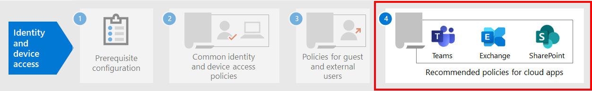

# Recomendaciones de directiva para proteger los chats, grupos y archivos de Teams

En este artículo se describe cómo implementar las directivas recomendadas de acceso a dispositivos e identidades para proteger los chats, grupos y contenido de Microsoft Teams, como archivos y calendarios. Esta guía se basa en las directivas comunes [de acceso](identity-access-policies.md)a dispositivos e identidades, con información adicional específica de Teams. Dado que Teams se integra con nuestros otros productos, vea también recomendaciones de directiva para proteger archivos y sitios de [SharePoint](sharepoint-file-access-policies.md) y recomendaciones de directiva [para proteger el correo electrónico.](secure-email-recommended-policies.md)

Estas recomendaciones se basan en tres niveles diferentes de seguridad y protección para Teams que se pueden aplicar en función de la granularidad de sus necesidades: línea base, confidencial y altamente regulado. Puede obtener más información sobre estos niveles de seguridad y las directivas recomendadas a las que hacen referencia estas recomendaciones en las configuraciones de acceso a dispositivos e [identidades.](microsoft-365-policies-configurations.md)

En este artículo se incluyen más recomendaciones específicas para la implementación de Teams para cubrir circunstancias de autenticación específicas, incluidos los usuarios externos a la organización. Deberá seguir estas instrucciones para obtener una experiencia de seguridad completa.

## Introducción a Teams antes que otros servicios dependientes

No es necesario habilitar los servicios dependientes para empezar a trabajar con Microsoft Teams. Todos estos servicios "solo funcionarán". Sin embargo, debe estar preparado para administrar los siguientes elementos relacionados con el servicio:

- Grupos de Microsoft 365
- Sitios de grupo de SharePoint
- OneDrive para la Empresa
- Buzones de Exchange
- Transmitir vídeos y planes de Planner (si estos servicios están habilitados)

## Actualización de directivas comunes para incluir Teams

Para proteger el chat, los grupos y el contenido de Teams, en el siguiente diagrama se ilustran las directivas que se actualizarán a partir de las directivas comunes de acceso a dispositivos e identidades. Para que cada directiva se actualice, asegúrese de que Teams y los servicios dependientes se incluyen en la asignación de aplicaciones en la nube.

[Ver una versión más grande de esta imagen](https://github.com/MicrosoftDocs/microsoft-365-docs/raw/public/microsoft-365/media/microsoft-365-policies-configurations/identity-access-ruleset-teams.png)

Estos servicios son los servicios dependientes que se deben incluir en la asignación de aplicaciones en la nube para Teams:

- Microsoft Teams
- SharePoint y OneDrive para la Empresa
- Exchange Online
- Skype Empresarial Online
- Microsoft Stream (grabaciones de reuniones)
- Microsoft Planner (tareas de Planner y datos del plan)

En esta tabla se enumeran las directivas que deben revisarse y los vínculos a cada directiva en las directivas comunes de acceso a dispositivos e identidades, que tiene la directiva más amplia establecida para todas las aplicaciones de Office.

|Nivel de protección|Directivas|Más información sobre la implementación de Teams|
|---|---|---|
|**Baseline**|[Requerir MFA cuando el riesgo de inicio de sesión *es medio* o *alto*](identity-access-policies.md#require-mfa-based-on-sign-in-risk)|Asegúrese de que Teams y los servicios dependientes se incluyen en la lista de aplicaciones. Teams también tiene reglas de acceso de invitado y acceso externo que se deben tener en cuenta. Más adelante en este artículo encontrará más información sobre estas reglas.|
||[Bloquear a los clientes que no sean compatibles con la autenticación moderna](identity-access-policies.md#block-clients-that-dont-support-multi-factor)|Incluir Teams y servicios dependientes en la asignación de aplicaciones en la nube.|
||[Los usuarios de riesgo alto tienen que cambiar la contraseña](identity-access-policies.md#high-risk-users-must-change-password)|Fuerza a los usuarios de Teams a cambiar su contraseña al iniciar sesión si se detecta actividad de alto riesgo para su cuenta. Asegúrese de que Teams y los servicios dependientes se incluyen en la lista de aplicaciones.|
||[Aplicar directivas de protección de datos de APP](identity-access-policies.md#apply-app-data-protection-policies)|Asegúrese de que Teams y los servicios dependientes se incluyen en la lista de aplicaciones. Actualiza la directiva para cada plataforma (iOS, Android, Windows).|
||[Definir directivas de cumplimiento de dispositivos](identity-access-policies.md#define-device-compliance-policies)|Incluya Teams y servicios dependientes en esta directiva.|
||[Exigir equipos PC compatibles](identity-access-policies.md#require-compliant-pcs-but-not-compliant-phones-and-tablets)|Incluya Teams y servicios dependientes en esta directiva.|
|**Confidencial**|[Requerir MFA cuando el riesgo de inicio de sesión *es bajo,* *medio* o *alto*](identity-access-policies.md#require-mfa-based-on-sign-in-risk)|Teams también tiene reglas de acceso de invitado y acceso externo que se deben tener en cuenta. Más adelante en este artículo encontrará más información sobre estas reglas. Incluya Teams y servicios dependientes en esta directiva.|
||[Requerir equipos y *dispositivos* móviles compatibles](identity-access-policies.md#require-compliant-pcs-and-mobile-devices)|Incluya Teams y servicios dependientes en esta directiva.|
|**Extremadamente regulado**|[*Requerir* siempre MFA](identity-access-policies.md#require-mfa-based-on-sign-in-risk)|Independientemente de la identidad del usuario, su organización usará MFA. Incluya Teams y servicios dependientes en esta directiva. |
|

## Arquitectura de servicios dependientes de Teams

Como referencia, el siguiente diagrama ilustra los servicios en los que se basa Teams. Para obtener más información e ilustraciones, vea Microsoft Teams y los servicios de productividad relacionados [en Microsoft 365 para arquitectos de TI.](../../solutions/productivity-illustrations.md)

[Ver una versión más grande de esta imagen](https://github.com/MicrosoftDocs/microsoft-365-docs/raw/public/microsoft-365/media/microsoft-365-policies-configurations/identity-access-logical-architecture-teams.png)

## Acceso externo y de invitado para Teams

Microsoft Teams define los siguientes tipos de acceso:

- **El** acceso de invitado usa una cuenta B2B de Azure AD para un usuario invitado o externo que se puede agregar como miembro de un equipo y tener acceso con permiso a la comunicación y los recursos del equipo.

- **El acceso** externo es para un usuario externo que no tiene una cuenta de Azure AD B2B. El acceso externo puede incluir invitaciones y participación en llamadas, chats y reuniones, pero no incluye la pertenencia al equipo ni el acceso a los recursos del equipo.

Las directivas de acceso condicional solo se aplican al acceso de invitado en Teams porque hay una cuenta B2B de Azure AD correspondiente.

<!--
In Azure AD, guest and external users are the same. The user type for both of these is Guest. Guest users are B2B users. Microsoft Teams differentiates between guest users and external users in the app. While it's important to understand how each of these are treated in Teams, both types of users are B2B users in Azure AD and the recommended policies for B2B users apply to both.

-->

Para ver las directivas recomendadas para permitir el acceso a usuarios invitados y externos con una cuenta B2B de Azure AD, vea Directivas para permitir el acceso a cuentas [B2B](identity-access-policies-guest-access.md)externas y de invitado.

### Acceso de invitado a Teams

Además de las directivas para los usuarios internos de su empresa u organización, los administradores pueden habilitar el acceso de invitado para permitir, de forma individual, que las personas externas a su empresa u organización accedan a los recursos de Teams e interactúen con personas internas para cosas como conversaciones de grupo, chat y reuniones.

Para obtener más información sobre el acceso de invitados y cómo implementarlo, consulte [Acceso de invitados de Teams.](https://docs.microsoft.com/microsoftteams/guest-access)

### Acceso externo en Teams

El acceso externo a veces se confunde con el acceso de invitado, por lo que es importante tener claro que estos dos mecanismos de acceso no internos son diferentes tipos de acceso.

El acceso externo es una forma de que los usuarios de Teams de un dominio externo completo puedan buscar, llamar, chatear y configurar reuniones con sus usuarios en Teams. Los administradores de Teams configuran el acceso externo en el nivel de la organización. Para obtener más información, vea [Administrar el acceso externo en Microsoft Teams.](https://docs.microsoft.com/microsoftteams/manage-external-access)

Los usuarios de acceso externo tienen menos acceso y funcionalidad que una persona que se ha agregado a través del acceso de invitado. Por ejemplo, los usuarios de acceso externo pueden chatear con los usuarios internos con Teams, pero no pueden acceder a canales de equipo, archivos u otros recursos.

El acceso externo no usa cuentas de usuario B2B de Azure AD y, por lo tanto, no usa directivas de acceso condicional.

## Directivas de Teams

Fuera de las directivas comunes enumeradas anteriormente, hay directivas específicas de Teams que pueden y deben configurarse para administrar diversas funcionalidades de Teams.

### Directivas de teams y canales

Los equipos y los canales son dos elementos que se usan habitualmente en Microsoft Teams y hay directivas que puede establecer para controlar lo que los usuarios pueden y no pueden hacer al usar equipos y canales. Aunque puede crear un equipo global, si su organización tiene 5000 usuarios o menos, es probable que le sea útil tener equipos y canales más pequeños para propósitos específicos, en línea con las necesidades de su organización.

Se recomienda cambiar la directiva predeterminada o crear directivas personalizadas, y puede obtener más información sobre cómo administrar las directivas en este vínculo: Administrar directivas de equipos [en Microsoft Teams.](https://docs.microsoft.com/microsoftteams/teams-policies)

### Directivas de mensajería

La mensajería o el chat también se pueden administrar a través de la directiva global predeterminada o mediante directivas personalizadas, lo que puede ayudar a los usuarios a comunicarse entre sí de una forma adecuada para su organización. Esta información se puede revisar en Administración [de directivas de mensajería en Teams.](https://docs.microsoft.com/microsoftteams/messaging-policies-in-teams)

### Directivas de reunión

No se completaría ninguna discusión sobre Teams sin planear e implementar directivas en torno a las reuniones de Teams. Las reuniones son un componente esencial de Teams, lo que permite a los usuarios reunirse formalmente y presentarse a muchos usuarios a la vez, así como compartir contenido relevante para la reunión. Es esencial establecer las directivas adecuadas para su organización en torno a las reuniones.

Para obtener más información, consulte [Administrar directivas de reunión en Teams.](https://docs.microsoft.com/microsoftteams/meeting-policies-in-teams)

### Directivas de permisos de aplicación

Teams también le permite usar aplicaciones en varios lugares, como canales o chats personales. Tener directivas sobre qué aplicaciones se pueden agregar y usar, y dónde, es esencial para mantener un entorno con contenido enriquecido que también sea seguro.

Para obtener más información sobre las directivas de permisos de aplicación, consulte [Administrar directivas de permisos de aplicaciones en Microsoft Teams.](https://docs.microsoft.com/microsoftteams/teams-app-permission-policies)

## Pasos siguientes

Configurar directivas de acceso condicional para:

- [Exchange Online](secure-email-recommended-policies.md)
- [SharePoint](sharepoint-file-access-policies.md)
