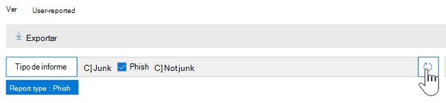
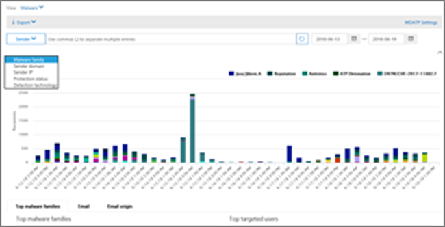
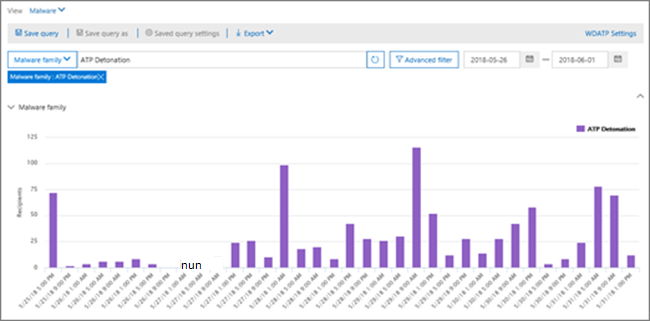
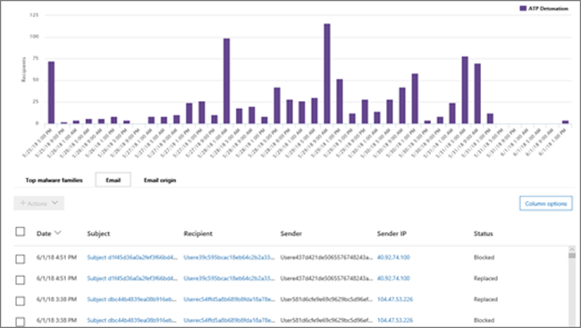
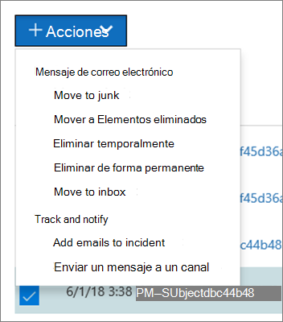

# Vistas en el Explorador de amenazas y detecciones en tiempo real

[!INCLUDE [Microsoft 365 Defender rebranding](../includes/microsoft-defender-for-office.md)]

**Se aplica a**
- [Plan 1 y Plan 2 de Microsoft Defender para Office 365](office-365-atp.md)
- [Microsoft 365 Defender](../mtp/microsoft-threat-protection.md)

[El Explorador](threat-explorer.md) de amenazas (y el informe de detecciones en tiempo real) es una herramienta eficaz y casi en tiempo real que ayuda a los equipos de operaciones de seguridad a investigar y responder a las amenazas en el Centro de seguridad & cumplimiento. El explorador (y el informe de detecciones en tiempo real) muestra información sobre el supuesto malware y la suplantación de identidad (phishing) en el correo electrónico y los archivos de Office 365, así como otras amenazas y riesgos de seguridad para su organización.

- Si tiene [Microsoft Defender para Office 365](office-365-atp.md) Plan 2, tiene Explorer.
- Si tiene Microsoft Defender para Office 365 Plan 1, tiene detecciones en tiempo real.

La primera vez que abre el Explorador (o el informe de detecciones en tiempo real), la vista predeterminada muestra las detecciones de malware de correo electrónico de los últimos 7 días. Este informe también puede mostrar detecciones de Microsoft Defender para Office 365, como direcciones URL malintencionadas detectadas por Vínculos seguros y archivos malintencionados detectados por [datos adjuntos seguros.](atp-safe-attachments.md) Este informe se puede modificar para mostrar los datos de los últimos 30 días (con una suscripción de pago de Microsoft Defender para Office 365 P2). Las suscripciones de prueba incluirán datos solo de los últimos siete días.

****

|Suscripción|Utilidad|Días de datos|
|---|---|---|
|Prueba de Microsoft Defender para Office 365 P1|Detecciones en tiempo real|7 |
|Microsoft Defender para Office 365 P1 de pago|Detecciones en tiempo real|30|
|Prueba de Pago de Defender para Office 365 P1 de Microsoft Defender para Office 365 P2|Explorador de amenazas|7 |
|Prueba de Microsoft Defender para Office 365 P2|Explorador de amenazas|7 |
|Microsoft Defender para Office 365 P2 de pago|Explorador de amenazas|30|
|

Use el **menú** Ver para cambiar la información que se muestra. La información sobre herramientas te ayuda a determinar qué vista usar.

Una vez que haya seleccionado una vista, puede aplicar filtros y configurar consultas para realizar análisis adicionales. En las secciones siguientes se proporciona una breve introducción a las distintas vistas disponibles en el Explorador (o detecciones en tiempo real).

## Correo electrónico > malware

Para ver este informe, en el Explorador (o detecciones en tiempo real), elija **Ver** malware \> **de correo** \> **electrónico.** Esta vista muestra información sobre los mensajes de correo electrónico identificados como que contienen malware.

Haga **clic en** Remitente para abrir la lista de opciones de visualización. Use esta lista para ver datos por remitente, destinatarios, dominio del remitente, asunto, tecnología de detección, estado de protección y mucho más.

Por ejemplo, para ver qué acciones se realizaron en los mensajes de correo electrónico detectados, elija **Estado de protección** en la lista. Seleccione una opción y, a continuación, haga clic en el botón Actualizar para aplicar ese filtro al informe.

Debajo del gráfico, vea más detalles sobre mensajes específicos. Cuando selecciona un elemento de la lista, se abre un panel desplegable, donde puede obtener más información sobre el elemento que seleccionó.

## Correo electrónico > phishing

Para ver este informe, en el Explorador (o detecciones en tiempo real), elija **Ver** \> **suplantación de** identidad de \> **correo electrónico.** Esta vista muestra los mensajes de correo electrónico identificados como intentos de suplantación de identidad.

Haga **clic en** Remitente para abrir la lista de opciones de visualización. Use esta lista para ver datos por remitente, destinatarios, dominio del remitente, IP del remitente, dominio de dirección URL, veredicto de clics y mucho más.

Por ejemplo, para ver qué acciones se realizaron cuando los usuarios hacen  clic en direcciones URL identificadas como intentos de suplantación de identidad( phishing), elija Veredicto de clic en la lista, seleccione una o más opciones y, a continuación, haga clic en el botón Actualizar.

Debajo del gráfico, vea más detalles sobre mensajes específicos, clics de url, direcciones URL y origen de correo electrónico.

Cuando selecciona un elemento de la lista, como una dirección URL detectada, se abre un panel desplegable, donde puede obtener más información sobre el elemento que seleccionó.

## Envíos > correo electrónico

Para ver este informe, en el Explorador (o detecciones en tiempo real), elija **Ver** \>  \> **envíos de correo electrónico.** Esta vista muestra el correo electrónico que los usuarios han notificado como correo no deseado, correo no deseado o correo electrónico de suplantación de identidad.

Haga **clic en** Remitente para abrir la lista de opciones de visualización. Use esta lista para ver información por remitente, destinatarios, tipo de informe (la determinación del usuario de que el correo electrónico era correo no deseado, correo no deseado o suplantación de identidad) y mucho más.

Por ejemplo, para ver información sobre los mensajes de  correo electrónico que se notificaron como intentos de suplantación de identidad, haga clic en Tipo de informe de remitente, seleccione Suplantación de identidad y, a continuación, haga clic en \> el botón Actualizar. 

Debajo del gráfico, vea más detalles sobre mensajes de correo electrónico específicos, como la línea de asunto, la dirección IP del remitente, el usuario que informó del mensaje como correo no deseado, correo no deseado o suplantación de identidad, etc.

Seleccione un elemento de la lista para ver detalles adicionales.

## Correo > todo el correo electrónico

Para ver este informe, en el Explorador, elija **Ver** \> **todo el** correo \> **electrónico.** Esta vista muestra una vista general de la actividad de correo electrónico, incluido el correo electrónico identificado como malintencionado debido a suplantación de identidad o malware, así como todo el correo no malintencionado (correo electrónico normal, correo no deseado y correo masivo).

> [!NOTE]
> Si recibe un error que lee **demasiados** datos para mostrar, agregue un filtro y, si es necesario, limite el intervalo de fechas que está viendo.

Para aplicar un filtro, elija **Remitente**, seleccione un elemento de la lista y, a continuación, haga clic en el botón Actualizar. En nuestro ejemplo, hemos usado la **tecnología de detección** como filtro (hay varias opciones disponibles). Ver información por remitente, dominio del remitente, destinatarios, asunto, nombre de archivo de datos adjuntos, familia de malware, estado de protección (acciones realizadas por las directivas y características de protección contra amenazas en Office 365), tecnología de detección (cómo se detectó el malware) y mucho más.

Debajo del gráfico, vea más detalles sobre mensajes de correo electrónico específicos, como la línea de asunto, el destinatario, el remitente, el estado, etc.

## Malware > contenido

Para ver este informe, en el Explorador (o detecciones en tiempo real), elija **Ver** \> **malware de** \> **contenido.** En esta vista se muestran los archivos identificados como malintencionados por Microsoft Defender para [Office 365 en SharePoint Online, OneDrive](atp-for-spo-odb-and-teams.md)para la Empresa y Microsoft Teams.

Ver información por familia de malware, tecnología de detección (cómo se detectó el malware) y carga de trabajo (OneDrive, SharePoint o Teams).

Debajo del gráfico, vea más detalles sobre archivos específicos, como el nombre de archivo de datos adjuntos, la carga de trabajo, el tamaño del archivo, quién modificó el archivo por última vez y mucho más.

## Capacidades de hacer clic y filtrar

Con explorer (y detecciones en tiempo real), puedes aplicar un filtro en un clic. Haga clic en un elemento de la leyenda y ese elemento se convertirá en un filtro para el informe. Por ejemplo, supongamos que estamos viendo la vista Malware en el Explorador:

Al **hacer clic en Detonación** de ATP en este gráfico, se produce una vista como esta:

En esta vista, ahora estamos buscando datos de archivos que se detonaron mediante [datos adjuntos seguros.](atp-safe-attachments.md) Debajo del gráfico, podemos ver detalles sobre mensajes de correo electrónico específicos que tenían datos adjuntos detectados por datos adjuntos seguros.

Al seleccionar uno o más  elementos, se activa el menú Acciones, que ofrece varias opciones entre las que elegir para los elementos seleccionados.

La capacidad de filtrar con un clic y navegar a detalles específicos puede ahorrarle mucho tiempo en investigar amenazas.

## Consultas y filtros

El Explorador (así como el informe de detecciones en tiempo real) tiene varios filtros eficaces y capacidades de consulta que le permiten profundizar en detalles, como los usuarios de destino principales, las principales familias de malware, la tecnología de detección y mucho más. Cada tipo de informe ofrece una variedad de formas de ver y explorar datos.

> [!IMPORTANT]
> No use caracteres comodín, como un asterisco o un signo de interrogación, en la barra de consulta del Explorador (o detecciones en tiempo real). Al buscar mensajes  de correo electrónico en el campo Asunto, el Explorador (o detecciones en tiempo real) realizará una coincidencia parcial y dará resultados similares a los de una búsqueda con caracteres comodín.
