# Explorador de amenazas y detecciones en tiempo real

**Se aplica a**
- [Plan 1 y Plan 2 de Microsoft Defender para Office 365](defender-for-office-365.md)
- [Microsoft 365 Defender](../defender/microsoft-365-defender.md)

Si su organización tiene [Microsoft Defender](defender-for-office-365.md)para Office 365 y tiene los permisos [necesarios,](#required-licenses-and-permissions)tiene detecciones en tiempo **real** o **explorador** (anteriormente informes en tiempo *real,* vea las novedades [!).](#new-features-in-threat-explorer-and-real-time-detections) En el Centro de & cumplimiento, vaya a **Administración** de amenazas y, a continuación, elija **Explorador**  o **Detecciones en** tiempo real.

 

****

|Con Microsoft Defender para Office 365 plan 2, verá:|Con Microsoft Defender para Office 365 plan 1, verá:|
|---|---|
||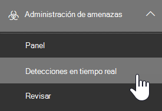|
|

Las detecciones de explorador o en tiempo real ayudan al equipo de operaciones de seguridad a investigar y responder a las amenazas de forma eficaz. El informe es similar a la imagen siguiente:

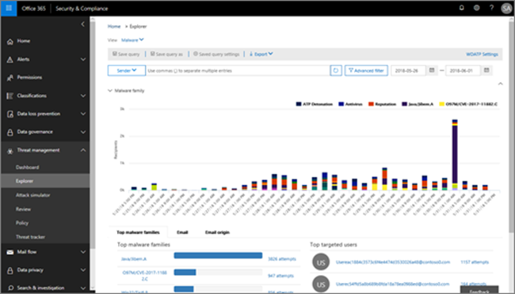

Con este informe, puede:

- [Ver malware detectado por Microsoft 365 de seguridad](#see-malware-detected-in-email-by-technology)
- [Ver la dirección URL de suplantación de identidad (phishing) y hacer clic en datos de veredicto](#view-phishing-url-and-click-verdict-data)
- [Iniciar un proceso automatizado de investigación y respuesta desde una vista en el Explorador](#start-automated-investigation-and-response) (solo Defender para Office 365 plan 2)
- [Investigar correo electrónico malintencionado y mucho más](#more-ways-to-use-explorer-and-real-time-detections)

## Mejoras en la experiencia de búsqueda de amenazas

### Introducción del identificador de alerta para alertas de MDO en detecciones en tiempo real o explorador (versión preliminar)

Hoy en día, si navega desde una alerta al Explorador de amenazas, abre una vista filtrada en el Explorador, con la vista filtrada por el identificador de directiva de alerta (el identificador de directiva es un identificador único de una directiva de alerta).
Estamos haciendo que esta integración sea más relevante mediante la introducción del identificador de alerta (vea un ejemplo de identificador de alerta a continuación) en el Explorador de amenazas y detecciones en tiempo real para que vea los mensajes que son relevantes para la alerta específica, así como un recuento de correos electrónicos. También podrá ver si un mensaje formaba parte de una alerta, así como navegar de ese mensaje a la alerta específica.

El identificador de alerta está disponible dentro de la dirección URL cuando se ve una alerta individual; un ejemplo es `https://protection.office.com/viewalerts?id=372c9b5b-a6c3-5847-fa00-08d8abb04ef1` .

> [!div class="mx-imgBorder"]
> 

> [!div class="mx-imgBorder"]
> 

### Ampliar el límite de retención de datos y búsqueda del Explorador (y detecciones en tiempo real) para los inquilinos de prueba de 7 a 30 días (versión preliminar)

Como parte de este cambio, podrá buscar y filtrar datos de correo electrónico durante 30 días (un aumento con respecto a los 7 días anteriores) en el Explorador de amenazas y detecciones en tiempo real para defender para inquilinos de prueba de P1 y P2 de Office.
Esto no afecta a los inquilinos de producción para clientes de P1 y P2/E5, que ya tienen capacidades de búsqueda y retención de datos de 30 días.

### Límites actualizados para la exportación de registros para el Explorador de amenazas (versión preliminar)

Como parte de esta actualización, el número de filas de registros de correo electrónico que se pueden exportar desde el Explorador de amenazas aumenta de 9990 a 200 000 registros. El conjunto de columnas que se pueden exportar actualmente seguirá siendo el mismo, pero el número de filas aumentará desde el límite actual.

### Etiquetas en el Explorador de amenazas

> [!NOTE]
> La característica de etiquetas de usuario está en *Versión* preliminar, no está disponible para todos y está sujeta a cambios. Para obtener información acerca de la programación de lanzamiento, consulte el mapa de ruta Microsoft 365 versión.

Las etiquetas de usuario identifican grupos específicos de usuarios en Microsoft Defender para Office 365. Para obtener más información acerca de las etiquetas, incluidas las licencias y la configuración, vea [Etiquetas de usuario](user-tags.md).

En el Explorador de amenazas, puede ver información sobre las etiquetas de usuario en las siguientes experiencias.

#### Vista cuadrícula de correo electrónico

La **columna Etiquetas** de la cuadrícula de correo electrónico contiene todas las etiquetas que se han aplicado a los buzones de remitente o destinatario. De forma predeterminada, las etiquetas del sistema como las cuentas de prioridad se muestran primero.

> [!div class="mx-imgBorder"]
> 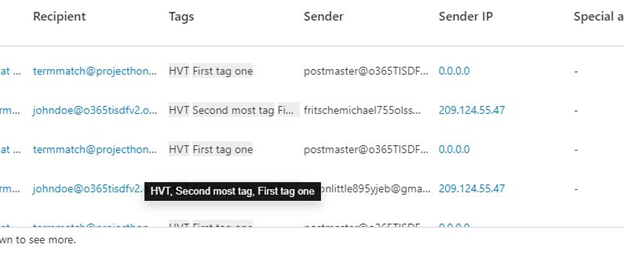

#### Filtrado

Puede usar etiquetas como filtro. Busca solo entre cuentas de prioridad o escenarios específicos de etiquetas de usuario. También puede excluir los resultados que tienen determinadas etiquetas. Combine esta funcionalidad con otros filtros para restringir el ámbito de investigación.

> [!div class="mx-imgBorder"]
> 

#### Flyout de detalles de correo electrónico

Para ver las etiquetas individuales del remitente y el destinatario, seleccione el asunto para abrir el control desplegable de detalles del mensaje. En la **pestaña Resumen,** las etiquetas de remitente y destinatario se muestran por separado, si están presentes para un correo electrónico.
La información sobre las etiquetas individuales del remitente y el destinatario también se extiende a los datos CSV exportados, donde puede ver estos detalles en dos columnas independientes.

> [!div class="mx-imgBorder"]
> 

La información de etiquetas también se muestra en el control desplegable de clics de dirección URL. Para verlo, vaya a la vista Phish o All Email y, a continuación, a la pestaña **Url o** **Url Clicks.** Seleccione un control desplegable de dirección URL individual para ver detalles adicionales acerca de los clics de esa dirección URL, incluidas las etiquetas asociadas con ese clic.

### Vista de escala de tiempo actualizada

> [!div class="mx-imgBorder"]
> 
>
Obtenga más información con [este vídeo](https://www.youtube.com/watch?v=UoVzN0lYbfY&list=PL3ZTgFEc7LystRja2GnDeUFqk44k7-KXf&index=4).

## Mejoras en la experiencia de búsqueda de amenazas (próximamente)

### Información actualizada sobre amenazas para correos electrónicos

Nos hemos centrado en las mejoras de la plataforma y la calidad de los datos para aumentar la precisión y coherencia de los datos para los registros de correo electrónico. Las mejoras incluyen la consolidación de la información previa y posterior a la entrega, como las acciones ejecutadas en un correo electrónico como parte del proceso de ZAP, en un único registro. También se incluyen detalles adicionales como el veredicto de correo no deseado, las amenazas de nivel de entidad (por ejemplo, qué dirección URL era malintencionada) y las ubicaciones de entrega más recientes.

Después de estas actualizaciones, verá una sola entrada para cada mensaje, independientemente de los diferentes eventos posteriores a la entrega que afectan al mensaje. Las acciones pueden incluir ZAP, corrección manual (lo que significa acción de administrador), entrega dinámica, y así sucesivamente.

Además de mostrar amenazas de malware y phishing, verá el veredicto de correo no deseado asociado a un correo electrónico. En el correo electrónico, vea todas las amenazas asociadas con el correo electrónico junto con las tecnologías de detección correspondientes. Un correo electrónico puede tener cero, una o varias amenazas. Verá las amenazas actuales en la sección **Detalles** del flyout de correo electrónico. Para varias amenazas (como malware y  phishing), el campo técnico Detección muestra la asignación de detección de amenazas, que es la tecnología de detección que identificó la amenaza.

El conjunto de tecnologías de detección ahora incluye nuevos métodos de detección, así como tecnologías de detección de correo no deseado. Puede usar el mismo conjunto de tecnologías de detección para filtrar los resultados en las diferentes vistas de correo electrónico (Malware, Phish, All Email).

> [!NOTE]
> Es posible que el análisis de veredicto no esté necesariamente vinculado a entidades. Por ejemplo, un correo electrónico puede clasificarse como suplantación de identidad o correo no deseado, pero no hay direcciones URL que estén selladas con un veredicto de suplantación de identidad o correo no deseado. Esto se debe a que los filtros también evalúan el contenido y otros detalles de un correo electrónico antes de asignar un veredicto.

#### Amenazas en direcciones URL

Ahora puede ver la amenaza específica de una dirección URL en la pestaña Detalles del control desplegable **de** correo electrónico. La amenaza puede ser *malware,* *phish,* *correo no deseado* o *ninguno*.)

> [!div class="mx-imgBorder"]
> 

### Vista de escala de tiempo actualizada (próxima)

> [!div class="mx-imgBorder"]
> 

La vista Escala de tiempo identifica todos los eventos de entrega y posterior a la entrega. Incluye información sobre la amenaza identificada en ese momento para un subconjunto de estos eventos. La vista Escala de tiempo también proporciona información sobre cualquier acción adicional realizada (como ZAP o corrección manual), junto con el resultado de esa acción. La información de vista de escala de tiempo incluye:

- **Origen:** Origen del evento. Puede ser admin/system/user.
- **Evento:** Incluye eventos de nivel superior como entrega original, corrección manual, ZAP, envíos y entrega dinámica.
- **Acción:** La acción específica que se ha realizado como parte de la acción DEA o de administrador (por ejemplo, eliminación suave).
- **Amenazas:** Cubre las amenazas (malware, phish, spam) identificadas en ese momento.
- **Resultado/Detalles:** Más información sobre el resultado de la acción, como si se realizó como parte de la acción ZAP/admin.

### Ubicación de entrega original y más reciente

Actualmente, se muestra la ubicación de entrega en la cuadrícula de correo electrónico y el control de distribución de correo electrónico. El **campo Ubicación de** entrega cambia el nombre Ubicación de **_entrega_ original *_. Y presentamos otro campo, _*_Ubicación de entrega más reciente._**

**La ubicación de entrega original** dará más información sobre dónde se entregó un correo electrónico inicialmente. **La ubicación de entrega más** reciente mostrará dónde aterrizó un correo electrónico después de acciones del sistema como *ZAP* o acciones de administración como Mover a *elementos eliminados.* La última ubicación de entrega está diseñada para decir a los administradores la última ubicación conocida del mensaje después de la entrega o cualquier acción del sistema o administrador. No incluye ninguna acción del usuario final en el correo electrónico. Por ejemplo, si un usuario eliminó un mensaje o movió el mensaje a archive/pst, la ubicación de "entrega" del mensaje no se actualizará. Pero si una acción del sistema actualiza la ubicación (por ejemplo, ZAP, que da como resultado un correo electrónico que pasa a cuarentena), **la** ubicación de entrega más reciente se mostrará como "cuarentena".

> [!div class="mx-imgBorder"]
> 

> [!NOTE]
> Hay algunos casos en los que **la ubicación de entrega** y la acción de entrega pueden mostrarse como "desconocidas": 
>
> - Es posible  que vea la  ubicación de entrega como "entregada" y la ubicación de entrega como "desconocida" si el mensaje se entregó, pero una regla de bandeja de entrada movió el mensaje a una carpeta predeterminada (como Borrador o Archivo) en lugar de a la carpeta Bandeja de entrada o correo no deseado.
>
> - **La ubicación de entrega más** reciente puede ser desconocida si se intentó realizar una acción de administrador/sistema (como ZAP), pero no se encontró el mensaje. Normalmente, la acción se produce después de que el usuario movió o eliminó el mensaje. En estos casos, compruebe la **columna Resultado/Detalles** en la vista escala de tiempo. Busque la instrucción "Mensaje movido o eliminado por el usuario".

> [!div class="mx-imgBorder"]
> 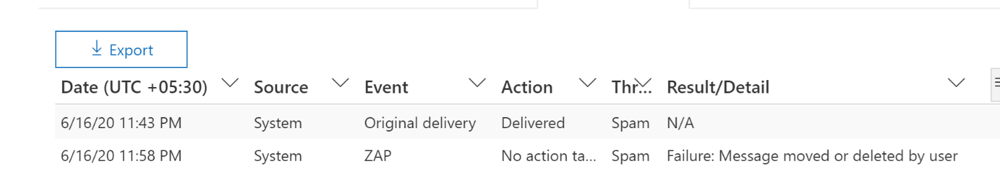

### Acciones adicionales

*Se aplicaron* acciones adicionales después de la entrega del correo electrónico. Pueden incluir *ZAP,* *corrección manual* (acción realizada por un administrador como la eliminación *temporal),* entrega dinámica y *reprocesamiento* (para un correo electrónico que se detectó retroactivamente como bueno).

> [!NOTE]
> Como parte de los cambios pendientes, el valor "Eliminado por ZAP" que se muestra actualmente en el filtro Acción de entrega desaparece. Tendrás una forma de buscar todo el correo electrónico con el intento de ZAP a través **de acciones adicionales**.

> [!div class="mx-imgBorder"]
> 

### Invalidaciones del sistema

*Las invalidaciones del* sistema permiten realizar excepciones a la ubicación de entrega prevista de un mensaje. Se invalida la ubicación de entrega proporcionada por el sistema, en función de las amenazas y otras detecciones identificadas por la pila de filtrado. Las invalidaciones del sistema se pueden establecer a través de la directiva de inquilino o de usuario para entregar el mensaje según lo sugerido por la directiva. Las invalidaciones pueden identificar la entrega involuntaria de mensajes malintencionados debido a las diferencias de configuraciones, como una directiva de remitente demasiado amplia Caja fuerte un usuario. Estos valores de invalidación pueden ser:

- Permitido por la directiva de usuario: un usuario crea directivas en el nivel de buzón para permitir dominios o remitentes.

- Bloqueado por la directiva de usuario: un usuario crea directivas en el nivel del cuadro de correo para bloquear dominios o remitentes.

- Permitido por la directiva de organización: los equipos de seguridad de la organización establecen directivas o reglas de flujo de correo Exchange (también conocidas como reglas de transporte) para permitir que los remitentes y dominios de los usuarios de su organización. Puede ser para un conjunto de usuarios o para toda la organización.

- Bloqueado por directiva de organización: los equipos de seguridad de la organización establecen directivas o reglas de flujo de correo para bloquear remitentes, dominios, idiomas de mensaje o direcciones IP de origen para los usuarios de su organización. Esto se puede aplicar a un conjunto de usuarios o a toda la organización.

- Extensión de archivo bloqueada por la directiva de organización: el equipo de seguridad de una organización bloquea una extensión de nombre de archivo a través de la configuración de directiva antimalware. Estos valores ahora se mostrarán en detalles de correo electrónico para ayudar con las investigaciones. Los equipos de Secops también pueden usar la funcionalidad de filtrado enriquecido para filtrar en extensiones de archivo bloqueadas.

> [!div class="mx-imgBorder"]
> 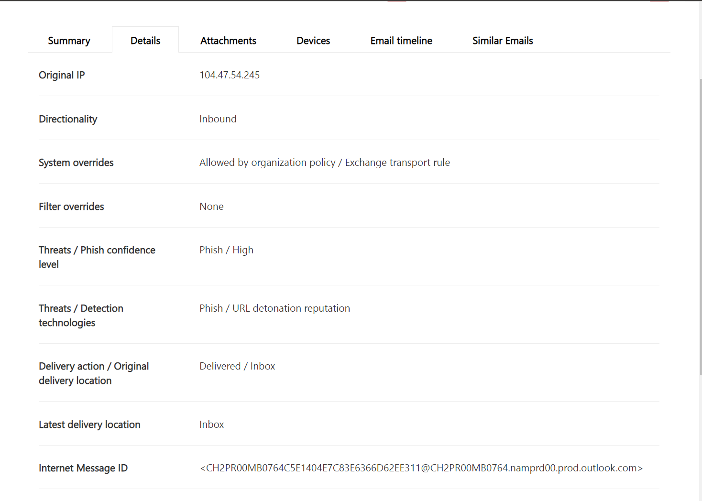

### Mejoras para la experiencia de url y clics

Las mejoras incluyen:

- Muestra la dirección URL con clic completo (incluidos los parámetros de consulta que forman parte de la dirección URL) en la sección **Clics** del control desplegable url. Actualmente, el dominio de dirección URL y la ruta de acceso aparecen en la barra de título. Estamos ampliando esa información para mostrar la dirección URL completa.

- Correcciones entre filtros de  dirección URL *(dirección URL* frente a dominio url frente a dominio y ruta de acceso): las actualizaciones afectan a la búsqueda de mensajes que contienen una dirección URL/veredicto de clic. Habilitamos la compatibilidad con búsquedas independientes del protocolo, por lo que puede buscar una dirección URL sin usar `http` . De forma predeterminada, la búsqueda de dirección URL se asigna a http, a menos que se especifique explícitamente otro valor. Por ejemplo:
  - Busque con y sin el prefijo en los `http://` campos **de filtro Url,** **Url Domain** y URL Domain **y Path.** Las búsquedas deben mostrar los mismos resultados.
  - Busque el prefijo `https://` en **dirección URL**. Cuando no se especifica ningún valor, se `http://` asume el prefijo.
  - `/`se omite al principio y al final de los campos Url **path**, **URL Domain,** **URL domain y path.** `/` al final del campo **dirección URL** se omite.

### Nivel de confianza de phish

El nivel de confianza de phishing ayuda a identificar el grado de confianza con el que se clasificó un correo electrónico como "phish". Los dos valores posibles *son High* y *Normal*. En las fases iniciales, este filtro solo estará disponible en la vista Phish del Explorador de amenazas.

[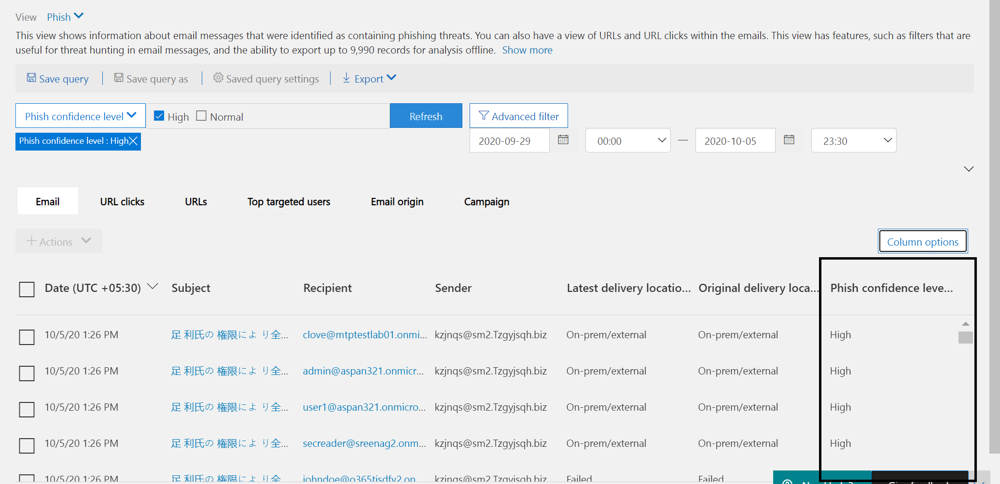](../../media/Phish_Confidence_Level.png#lightbox)

### Señal de dirección URL de ZAP

La señal de dirección URL de ZAP se usa normalmente para escenarios de alerta de phishing de ZAP donde un correo electrónico se identificó como phishing y se quitó después de la entrega. Esta señal conecta la alerta con los resultados correspondientes en el Explorador. Es uno de los IIC de la alerta.

Para mejorar el proceso de búsqueda, hemos actualizado el Explorador de amenazas y las detecciones en tiempo real para que la experiencia de búsqueda sea más coherente. Los cambios se describen aquí:

- [Mejoras en la zona horaria](#timezone-improvements)
- [Actualización en el proceso de actualización](#update-in-the-refresh-process)
- [Obtención de detalles de gráficos para agregar a filtros](#chart-drilldown-to-add-to-filters)
- [En actualizaciones de información del producto](#in-product-information-updates)

### Filtrar por etiquetas de usuario

Ahora puede ordenar y filtrar las etiquetas de usuario personalizadas o del sistema para comprender rápidamente el ámbito de las amenazas. Para obtener más información, vea [Etiquetas de usuario](user-tags.md).

> [!IMPORTANT]
> El filtrado y ordenación por etiquetas de usuario se encuentra actualmente en versión preliminar pública. Esta funcionalidad puede modificarse considerablemente antes de su lanzamiento comercial. Microsoft no ofrece garantías, explícitas o implícitas, con respecto a la información proporcionada al respecto.

> [!div class="mx-imgBorder"]
> 

### Mejoras en la zona horaria

Verá la zona horaria para los registros de correo electrónico en el Portal, así como para los datos exportados. Estará visible en experiencias como Cuadrícula de correo electrónico, Control de detalles, Escala de tiempo de correo electrónico y Correos electrónicos similares, por lo que la zona horaria del conjunto de resultados está clara.

> [!div class="mx-imgBorder"]
> 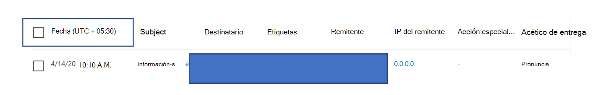

### Actualización en el proceso de actualización

Algunos usuarios han comentado confusión con la actualización automática (por ejemplo, tan pronto como cambia la fecha, la página se actualiza) y la actualización manual (para otros filtros). De forma similar, la eliminación de filtros conduce a la actualización automática. Cambiar los filtros al modificar la consulta puede provocar experiencias de búsqueda incoherentes. Para resolver estos problemas, nos estamos moviendo a un mecanismo de filtrado manual.

Desde el punto de vista de la experiencia, el usuario puede aplicar y quitar el distinto intervalo de filtros (del conjunto de filtros y la fecha) y seleccionar el botón actualizar para filtrar los resultados después de haber definido la consulta. El botón actualizar también se enfatiza ahora en la pantalla. También hemos actualizado la información sobre herramientas relacionada y la documentación del producto.

> [!div class="mx-imgBorder"]
> 

### Obtención de detalles de gráficos para agregar a filtros

Ahora puede gráfico de valores de leyenda para agregarlos como filtros. Seleccione el **botón Actualizar** para filtrar los resultados.

> [!div class="mx-imgBorder"]
> 

### Actualizaciones de información del producto

Ahora hay detalles adicionales disponibles en el producto, como el número total de resultados de búsqueda dentro de la cuadrícula (vea a continuación). Hemos mejorado las etiquetas, los mensajes de error y la información sobre herramientas para proporcionar más información sobre los filtros, la experiencia de búsqueda y el conjunto de resultados.

> [!div class="mx-imgBorder"]
> 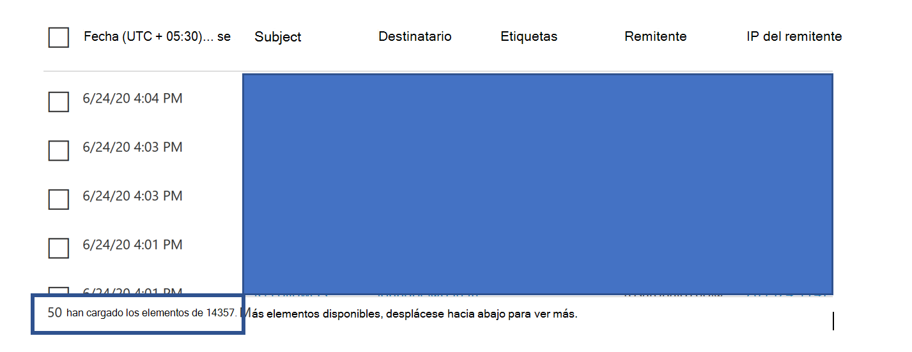

## Funcionalidades extendidas en el Explorador de amenazas

### Principales usuarios dirigidos

Hoy exponemos la lista de los principales usuarios dirigidos en la vista Malware para correos electrónicos, en la **sección Principales familias de malware.** También ampliaremos esta vista en las vistas Phish y All Email. Podrás ver los cinco primeros usuarios dirigidos, junto con el número de intentos de cada usuario para la vista correspondiente. Por ejemplo, para la vista Phish, verá el número de intentos de phishing.

Podrás exportar la lista de usuarios dirigidos, hasta un límite de 3.000, junto con el número de intentos de análisis sin conexión para cada vista de correo electrónico. Además, al seleccionar el número de intentos (por ejemplo, 13 intentos en la imagen siguiente) se abrirá una vista filtrada en el Explorador de amenazas, para que pueda ver más detalles entre correos electrónicos y amenazas para ese usuario.

> [!div class="mx-imgBorder"]
> 

### Exchange de transporte

Como parte del enriquecimiento de datos, podrá ver todas las diferentes reglas de Exchange de transporte (ETR) que se aplicaron a un mensaje. Esta información estará disponible en la vista Cuadrícula de correo electrónico. Para verlo, seleccione **Opciones de columna en** la cuadrícula y, a continuación, Exchange regla de transporte **en** las opciones de columna. También estará visible en el menú desplegable **Detalles** del correo electrónico.

Podrá ver tanto el GUID como el nombre de las reglas de transporte que se aplicaron al mensaje. Podrá buscar los mensajes con el nombre de la regla de transporte. Se trata de una búsqueda "Contiene", lo que significa que también puede realizar búsquedas parciales.

> [!IMPORTANT]
> La búsqueda etr y la disponibilidad de nombres dependen del rol específico que se le asigne. Debe tener uno de los siguientes roles o permisos para ver los nombres y la búsqueda de ETR. Si no tiene ninguna de estas funciones asignadas, no puede ver los nombres de las reglas de transporte ni buscar mensajes mediante nombres ETR. Sin embargo, puede ver la etiqueta ETR y la información guid en los detalles del correo electrónico. No se ven afectadas otras experiencias de visualización de registros en cuadrículas de correo electrónico, control de envío de correo electrónico, filtros y exportación.
>
> - Solo EXO: prevención de pérdida de datos: todos
> - EXO Only - O365SupportViewConfig: All
> - Microsoft Azure Active Directory o EXO: administrador de seguridad: todo
> - AAD o EXO: lector de seguridad: todos
> - Solo EXO: reglas de transporte: todas
> - Solo EXO: View-Only configuración: todo
>
> Dentro de la cuadrícula de correo electrónico, el control desplegable Detalles y csv exportado, los ETR se presentan con un Nombre/GUID como se muestra a continuación.
>
> > [!div class="mx-imgBorder"]
> > 

### Conectores de entrada

Los conectores son una colección de instrucciones que personalizan cómo fluye el correo electrónico hacia y desde Microsoft 365 o Office 365 organización. Permiten aplicar cualquier restricción o control de seguridad. En el Explorador de amenazas, ahora puede ver los conectores relacionados con un correo electrónico y buscar correos electrónicos mediante nombres de conector.

La búsqueda de conectores tiene un carácter "contiene", lo que significa que las búsquedas de palabras clave parciales también deben funcionar. En la vista cuadrícula principal, el control desplegable Detalles y el CSV exportado, los conectores se muestran en el formato Nombre/GUID, como se muestra aquí:

> [!div class="mx-imgBorder"]
> 

## Nuevas características en el Explorador de amenazas y detecciones en tiempo real

- [Ver correos electrónicos de suplantación de identidad enviados a usuarios y dominios suplantados](#view-phishing-emails-sent-to-impersonated-users-and-domains)
- [Vista previa del encabezado de correo electrónico y descarga del cuerpo del correo electrónico](#preview-email-header-and-download-email-body)
- [Escala de tiempo del correo electrónico](#email-timeline)
- [Exportar datos de clic de dirección URL](#export-url-click-data)

### Ver correos electrónicos de suplantación de identidad enviados a usuarios y dominios suplantados

Para identificar los intentos de suplantación de identidad contra usuarios y dominios que son usuarios suplantados, debe agregarse a la lista de *usuarios para proteger*. Para los dominios, los administradores deben habilitar dominios *de la* organización o agregar un nombre de dominio a Dominios *para proteger*. Los dominios que se van a proteger se encuentran en la página *Directiva contra suplantación* de identidad en la *sección Suplantación.*

Para revisar los mensajes de suplantación de identidad (phishing) y buscar usuarios o dominios suplantados, use la vista Correo electrónico [> phish del](threat-explorer-views.md) Explorador.

En este ejemplo se usa el Explorador de amenazas.

1. En el [Centro de seguridad & cumplimiento](https://protection.office.com) ( , elija Administración de amenazas > explorador https://protection.office.com) (o detecciones en tiempo real).

2. En el menú Ver, elija Correo electrónico > phishing.

   Aquí puede elegir **el dominio suplantado** o **el usuario suplantado.**

3. **Seleccione** **Dominio suplantado** y, a continuación, escriba un dominio protegido en el cuadro de texto.

   Por ejemplo, busque nombres de dominio protegidos como *contoso*, *contoso.com* o *contoso.com.au*.

4. Seleccione el Asunto de cualquier mensaje en la pestaña Correo > pestaña Detalles para ver información de suplantación adicional como Dominio suplantado / Ubicación detectada.

    **OR**

    Seleccione **Usuario suplantado y** escriba la dirección de correo electrónico de un usuario protegido en el cuadro de texto.

    > [!TIP]
    > **Para obtener mejores resultados,** use *direcciones de correo electrónico completa* para buscar usuarios protegidos. Encontrará el usuario protegido de forma más rápida y correcta si busca firstname.lastname@contoso.com *,* por ejemplo, al investigar la suplantación de usuario. Al buscar un dominio protegido, la búsqueda tomará el dominio raíz (contoso.com, por ejemplo) y el nombre de dominio (*contoso*). La búsqueda del dominio raíz *contoso.com* devolverá las suplantaciones de *contoso.com* y el nombre de dominio *contoso*.

5. Seleccione el **asunto de** cualquier mensaje en la pestaña **Detalles** de la pestaña Correo electrónico para ver información de suplantación adicional sobre el usuario o dominio, y la  >   ubicación *detectada*.

    :::image type="content" source="../../media/threat-ex-views-impersonated-user-image.png" alt-text="Panel de detalles del Explorador de amenazas para un usuario protegido que muestra la ubicación de detección y la amenaza que se detectó (aquí suplantación de identidad de un usuario).":::

> [!NOTE]
> En los pasos 3 o  5,  si elige Tecnología  de detección y selecciona Dominio de suplantación o Usuario de suplantación respectivamente, la información de la pestaña Detalles de la pestaña Correo electrónico sobre el usuario o dominio, y la ubicación detectada solo se mostrará en los mensajes relacionados con el usuario o dominio enumerados en la página Directiva contra suplantación de   >   identidad.  

### Vista previa del encabezado de correo electrónico y descarga del cuerpo del correo electrónico

Ahora puede obtener una vista previa de un encabezado de correo electrónico y descargar el cuerpo del correo electrónico en el Explorador de amenazas. Los administradores pueden analizar los encabezados o mensajes de correo electrónico descargados en busca de amenazas. Dado que la descarga de mensajes de correo electrónico puede correr el riesgo de exponer información, este proceso se controla mediante el control de acceso basado en roles (RBAC). Un nuevo rol, *Preview*, debe agregarse a otro grupo de roles (como Operaciones de seguridad o Administrador de seguridad) para conceder la capacidad de descargar correos en la vista de mensajes de todo el correo electrónico. Sin embargo, la visualización del encabezado de correo electrónico no requiere ningún rol adicional (aparte de lo necesario para ver mensajes en el Explorador de amenazas).

Las detecciones en tiempo real y explorador también recibirán nuevos campos que proporcionan una imagen más completa de dónde aterrizan los mensajes de correo electrónico. Estos cambios facilitan la búsqueda de las operaciones de seguridad. Pero el resultado principal es que puede conocer la ubicación de los mensajes de correo electrónico con problemas de un vistazo.

¿Cómo se hace esto? El estado de entrega ahora se divide en dos columnas:

- **Acción de entrega:** estado del correo electrónico.
- **Ubicación de entrega:** donde se enrutó el correo electrónico.

*La acción de* entrega es la acción realizada en un correo electrónico debido a las directivas o detecciones existentes. Estas son las acciones posibles para un correo electrónico:

 

****

|Entregado|Junked|Blocked|Reemplazado|
|---|---|---|---|
|El correo electrónico se entregó a la bandeja de entrada o carpeta de un usuario y el usuario puede acceder a él.|El correo electrónico se envió a la carpeta Correo no deseado o Eliminado del usuario y el usuario puede acceder a él.|Mensajes de correo electrónico que están en cuarentena, que han fallado o que se han eliminado. Estos correos no son accesibles para el usuario.|El correo electrónico tenía datos adjuntos malintencionados reemplazados por .txt que den como que los datos adjuntos son malintencionados.|
|

Esto es lo que el usuario puede y no puede ver:

 

****

|Accesible para usuarios finales|Inaccesible para los usuarios finales|
|---|---|
|Entregado|Blocked|
|Junked|Reemplazado|
|

**La ubicación de** entrega muestra los resultados de las directivas y detecciones que se ejecutan después de la entrega. Está vinculado a la **_acción Entrega._** Estos son los valores posibles:

- *Bandeja de entrada o carpeta:* el correo electrónico está en la bandeja de entrada o en una carpeta (según las reglas de correo electrónico).
- *Local o externo:* el buzón no existe en la nube, pero es local.
- *Carpeta no* deseado: el correo electrónico está en la carpeta de correo no deseado de un usuario.
- *Carpeta Elementos eliminados:* el correo electrónico de la carpeta Elementos eliminados de un usuario.
- *Cuarentena:* el correo electrónico está en cuarentena y no en el buzón de un usuario.
- *Error:* el correo electrónico no pudo llegar al buzón.
- *Dropped*: el correo electrónico se perdió en algún lugar del flujo de correo.

### Escala de tiempo del correo electrónico

La **escala de tiempo de** correo electrónico es una nueva característica del Explorador que mejora la experiencia de búsqueda de los administradores. Reduce el tiempo invertido en comprobar diferentes ubicaciones para intentar comprender el evento. Cuando se suceden varios eventos al mismo tiempo que llega un correo electrónico, estos eventos se muestran en una vista de escala de tiempo. Algunos eventos que suceden con el correo electrónico posterior a la entrega se capturan en la **columna Acción** especial. Los administradores pueden combinar información de la escala de tiempo con la acción especial que se ha realizado en el correo posterior a la entrega para obtener información sobre cómo funcionan sus directivas, dónde se enrutó finalmente el correo y, en algunos casos, cuál fue la evaluación final.

Para obtener más información, vea [Investigar y corregir](investigate-malicious-email-that-was-delivered.md)el correo electrónico malintencionado que se entregó en Office 365 .

### Exportar datos de clic de dirección URL

Ahora puede exportar informes de clics de dirección  URL a Microsoft Excel para ver su identificador de mensaje de red y hacer clic en veredicto, lo que ayuda a explicar dónde se originó el tráfico de clics de la dirección URL.  Así es como funciona: en Administración de amenazas en la Office 365 de inicio rápido, siga esta cadena:

**Explorador** \> **Ver phish** \> **Clics** \> **Las direcciones URL principales** o **los clics** superiores de la dirección URL \> seleccionan cualquier registro para abrir el menú desplegable de la dirección URL.

Cuando seleccione una dirección URL en la lista, verá un nuevo botón **Exportar** en el panel desplegable. Use este botón para mover datos a una Excel hoja de cálculo para facilitar la creación de informes.

Siga esta ruta de acceso para llegar a la misma ubicación en el informe de detecciones en tiempo real:

**Explorador** \> **Detecciones en tiempo real** \> **Ver phish** \> **DIRECCIONES URL** \> **Direcciones URL superiores** **o clics superiores** Seleccione cualquier registro para abrir el control desplegable \> dirección URL vaya a la pestaña \> **Clics.**

> [!TIP]
> El id. de mensaje de red asigna el clic a correos específicos cuando busca en el identificador a través del Explorador o las herramientas de terceros asociadas. Estas búsquedas identifican el correo electrónico asociado con un resultado de clic. Tener el identificador de mensaje de red correlacionado hace que el análisis sea más rápido y eficaz.

> [!div class="mx-imgBorder"]
> 

## Ver malware detectado en el correo electrónico por tecnología

Supongamos que desea ver malware detectado en el correo electrónico ordenado por Microsoft 365 tecnología. Para ello, use la vista Correo [> malware](threat-explorer-views.md#email--malware) del Explorador (o detecciones en tiempo real).

1. En el Centro de seguridad & cumplimiento ( ), elija Explorador de administración de amenazas <https://protection.office.com>  \>  (o **Detecciones en tiempo real**). (En este ejemplo se usa Explorer).

2. En el **menú Ver,** elija **Malware de** correo \> **electrónico**.

   > [!div class="mx-imgBorder"]
   > 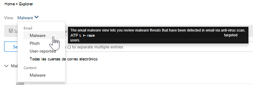

3. Haga **clic en Remitente** y, a continuación, elija **Tecnología** básica \> **de detección**.

   Las tecnologías de detección ahora están disponibles como filtros para el informe.

   > [!div class="mx-imgBorder"]
   > 

4. Elija una opción. A continuación, **seleccione el botón** Actualizar para aplicar ese filtro.

   > [!div class="mx-imgBorder"]
   > 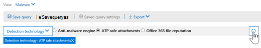

El informe se actualiza para mostrar los resultados que el malware detectó en el correo electrónico, mediante la opción de tecnología seleccionada. Desde aquí, puede realizar más análisis.

## Ver la dirección URL de suplantación de identidad (phishing) y hacer clic en datos de veredicto

Supongamos que desea ver intentos de suplantación de identidad a través de direcciones URL en el correo electrónico, incluida una lista de direcciones URL permitidas, bloqueadas e invalidadas. Para identificar las direcciones URL en las que [se hizo](safe-links.md) clic, Caja fuerte deben configurarse los vínculos. Asegúrese de configurar las directivas de [vínculos](set-up-safe-links-policies.md) Caja fuerte para la protección con tiempo de clic y el registro de veredictos de clics Caja fuerte vínculos.

Para revisar las direcciones URL de suplantación de identidad (phish) en mensajes y clics en las direcciones URL de los mensajes de suplantación de identidad (phish), use la vista Detección de [   >  **correo**](threat-explorer-views.md#email--phish) electrónico del Explorador o de detecciones en tiempo real.

1. En el Centro de seguridad & cumplimiento ( ), elija Explorador de administración de amenazas <https://protection.office.com>  \>  (o **Detecciones en tiempo real**). (En este ejemplo se usa Explorer).

2. En el **menú Ver,** elija **Email** \> **Phish**.

   > [!div class="mx-imgBorder"]
   > 

3. Haga **clic en Remitente** y, a continuación, elija Direcciones URL **Haga** clic \> **en Veredicto**.

4. Seleccione una o varias opciones, como **Bloqueado** y Bloquear  invalidado y, a continuación, seleccione el botón Actualizar en la misma línea que las opciones para aplicar ese filtro. (No actualice la ventana del explorador).

   > [!div class="mx-imgBorder"]
   > 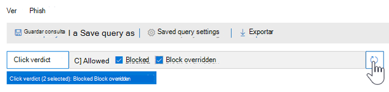

   El informe se actualiza para mostrar dos tablas de dirección URL diferentes en la pestaña Dirección URL del informe:

   - **Las direcciones URL principales** son las direcciones URL de los mensajes que se filtraron hacia abajo y la acción de entrega de correo electrónico cuenta para cada dirección URL. En la vista Correo electrónico de suplantación de identidad, esta lista suele contener direcciones URL legítimas. Los atacantes incluyen una combinación de direcciones URL buenas y malas en sus mensajes para intentar que se entreguen, pero hacen que los vínculos malintencionados parezcan más interesantes. La tabla de direcciones URL se ordena por recuento total de correo electrónico, pero esta columna está oculta para simplificar la vista.

   - **Los clics principales** son las Caja fuerte direcciones URL ajustadas por vínculos que se han hecho clic, ordenadas por recuento total de clics. Esta columna tampoco se muestra para simplificar la vista. Los recuentos totales por columna indican Caja fuerte recuento de veredictos de clics de vínculos para cada dirección URL en la que se ha hecho clic. En la vista Correo electrónico de suplantación de identidad, normalmente son direcciones URL sospechosas o malintencionadas. Pero la vista podría incluir direcciones URL que no son amenazas pero que están en mensajes de suplantación de identidad. Los clics de dirección URL en vínculos sin envolver no se muestran aquí.

   Las dos tablas de dirección URL muestran las direcciones URL principales en los mensajes de correo electrónico de suplantación de identidad por acción de entrega y ubicación. Las tablas muestran los clics de dirección URL bloqueados o visitados a pesar de una advertencia, por lo que puede ver qué posibles vínculos no se han presentado a los usuarios y que el usuario ha hecho clic. Desde aquí, puede realizar más análisis. Por ejemplo, debajo del gráfico puede ver las direcciones URL principales de los mensajes de correo electrónico bloqueados en el entorno de su organización.

   > [!div class="mx-imgBorder"]
   > 

   Seleccione una dirección URL para ver información más detallada.

   > [!NOTE]
   > En el cuadro de diálogo desplegable Dirección URL, el filtrado de mensajes de correo electrónico se quita para mostrar la vista completa de la exposición de la dirección URL en el entorno. Esto le permite filtrar los mensajes de correo electrónico que le preocupan en el Explorador, buscar direcciones URL específicas que son amenazas potenciales y, a continuación, ampliar la comprensión de la exposición de la dirección URL en su entorno (a través del cuadro de diálogo Detalles de dirección URL) sin tener que agregar filtros de dirección URL a la propia vista Explorador.

### Interpretación de veredictos de clic

Dentro de los menús desplegables Correo electrónico o URL, Clics superiores, así como dentro de nuestras experiencias de filtrado, verá diferentes valores de veredicto de clic:

- **Ninguno:** No se puede capturar el veredicto de la dirección URL. Es posible que el usuario haya hecho clic en la dirección URL.
- **Permitido:** Se permitió al usuario navegar a la dirección URL.
- **Bloqueado:** Se bloqueó al usuario para que no navegara a la dirección URL.
- **Veredicto pendiente:** El usuario se presentó con la página pendiente de detonación.
- **Bloqueado invalidado:** Se bloqueó al usuario para que no navegara directamente a la dirección URL. Pero el usuario sobreestroba el bloque para navegar a la dirección URL.
- **Se omitió el veredicto pendiente:** El usuario se presentó con la página de detonación. Pero el usuario sobrevó el mensaje para obtener acceso a la dirección URL.
- **Error:** El usuario se presentó con la página de error o se produjo un error al capturar el veredicto.
- **Error:** Se produjo una excepción desconocida al capturar el veredicto. Es posible que el usuario haya hecho clic en la dirección URL.

## Revisar los mensajes de correo electrónico notificados por los usuarios

Supongamos que desea ver los mensajes de correo electrónico que los usuarios de su organización notificaron como correo no *deseado,* no deseado o *suplantación* de identidad a través del complemento Report [Message](enable-the-report-message-add-in.md) o el complemento [Report Phishing](enable-the-report-phish-add-in.md). Para verlos, use la vista [   >  **Envíos de**](threat-explorer-views.md#email--submissions) correo electrónico del Explorador (o detecciones en tiempo real).

1. En el Centro de seguridad & cumplimiento ( ), elija Explorador de administración de amenazas <https://protection.office.com>  \>  (o **Detecciones en tiempo real**). (En este ejemplo se usa Explorer).

2. En el **menú Ver,** elija  \> **Envíos de correo electrónico**.

   > [!div class="mx-imgBorder"]
   > 

3. Haga **clic en Remitente** y, a continuación, elija **Tipo** de \> **informe básico**.

4. Seleccione una opción, como **Phish** y, a continuación, seleccione el **botón** Actualizar.

   > [!div class="mx-imgBorder"]
   > 

El informe se actualiza para mostrar datos sobre los mensajes de correo electrónico que los usuarios de la organización notificaron como intento de suplantación de identidad. Puede usar esta información para llevar a cabo más análisis y, si es necesario, ajustar las directivas [contra suplantación](configure-atp-anti-phishing-policies.md)de identidad en Microsoft Defender para Office 365 .

## Iniciar la investigación y respuesta automatizadas

> [!NOTE]
> Las capacidades automatizadas de investigación y respuesta están disponibles en *Microsoft Defender Office 365 plan 2* y Office 365 *E5*.

[La investigación y respuesta automatizadas](automated-investigation-response-office.md) pueden ahorrarle al equipo de operaciones de seguridad el tiempo y el esfuerzo invertidos en investigar y mitigar los ciberataques. Además de configurar alertas que pueden desencadenar un libro de juegos de seguridad, puedes iniciar un proceso automatizado de investigación y respuesta desde una vista en el Explorador. Para obtener más información, [vea Ejemplo: un administrador de seguridad desencadena una investigación desde el Explorador](automated-investigation-response-office.md#example-a-security-administrator-triggers-an-investigation-from-threat-explorer).

## Más formas de usar detecciones en tiempo real y explorador

Además de los escenarios descritos en este artículo, hay muchas más opciones de informes disponibles con explorer (o detecciones en tiempo real). Consulte los siguientes artículos:

- [Buscar e investigar el correo electrónico malintencionado que se ha entregado](investigate-malicious-email-that-was-delivered.md)
- [Ver archivos malintencionados detectados en SharePoint Online, OneDrive y Microsoft Teams](./mdo-for-spo-odb-and-teams.md)
- [Obtener información general sobre las vistas en el Explorador de amenazas (y detecciones en tiempo real)](threat-explorer-views.md)
- [Informe de estado de protección contra amenazas](view-email-security-reports.md#threat-protection-status-report)
- [Investigación y respuesta automatizadas en Microsoft 365 Defender](../defender/m365d-autoir.md)

## Permisos y licencias necesarios

Debe tener [Microsoft Defender para Office 365](defender-for-office-365.md) usar detecciones en tiempo real o explorador.

- El Explorador se incluye en Defender for Office 365 Plan 2.
- El informe de detecciones en tiempo real se incluye en Defender for Office 365 Plan 1.
- Planee asignar licencias para todos los usuarios que deberán estar protegidos por Defender para Office 365. Las detecciones de explorador y en tiempo real muestran datos de detección para usuarios con licencia.

Para ver y usar detecciones en tiempo real o explorador, debe tener los permisos adecuados, como los concedidos a un administrador de seguridad o un lector de seguridad.

- Para el Centro de & cumplimiento, debe tener uno de los siguientes roles asignados:

  - Administración de la organización
  - Administrador de seguridad (se puede asignar en el centro Azure Active Directory de administración ( <https://aad.portal.azure.com> )
  - Lector de seguridad

- Por Exchange Online, debe tener uno de los siguientes roles asignados en el Centro de administración de Exchange ( ) o <https://admin.protection.outlook.com/ecp/> [Exchange Online PowerShell](/powershell/exchange/exchange-online-powershell):

  - Administración de la organización
  - Administración de la organización de solo visualización
  - Destinatarios con permiso de vista
  - Administración de cumplimiento

Para obtener más información sobre roles y permisos, consulte los siguientes recursos:

- [Permisos en el Centro de seguridad y cumplimiento ](permissions-in-the-security-and-compliance-center.md)
- [Permisos de características de Exchange Online](/exchange/permissions-exo/feature-permissions)

## Diferencias entre el Explorador de amenazas y las detecciones en tiempo real

- El *informe de detecciones en* tiempo real está disponible en Defender for Office 365 Plan 1. *El Explorador de* amenazas está disponible en Defender para Office 365 Plan 2.
- El informe de detecciones en tiempo real permite ver las detecciones en tiempo real. El Explorador de amenazas también lo hace, pero también proporciona detalles adicionales para un ataque determinado.
- Una *vista De todo* el correo electrónico está disponible en el Explorador de amenazas, pero no en el informe de detecciones en tiempo real.
- En el Explorador de amenazas se incluyen más funciones de filtrado y acciones disponibles. Para obtener más información, vea [Microsoft Defender for Office 365 Service Description: Feature availability across Defender for Office 365 plans](/office365/servicedescriptions/office-365-advanced-threat-protection-service-description#feature-availability-across-advanced-threat-protection-atp-plans).

## Otros artículos

[Investigar correos electrónicos con la página Entidad de correo electrónico](mdo-email-entity-page.md)
