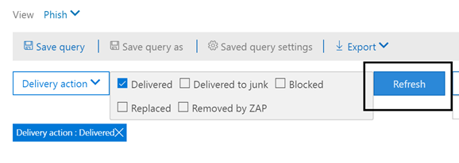
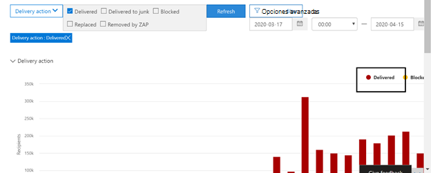

# Explorador de amenazas y detecciones en tiempo realThreat Explorer and real-time detections

Si su organización tiene [office 365 Advanced Threat Protection](office-365-atp.md) (Office 365 ATP) y dispone de los [permisos necesarios](#required-licenses-and-permissions), tiene tanto **exploradores** como **detecciones en tiempo real** (anteriormente *informes en tiempo real* , [vea lo nuevo](#new-features-in-threat-explorer-and-real-time-detections)!).If your organization has [Office 365 Advanced Threat Protection](office-365-atp.md) (Office 365 ATP), and you have the [necessary permissions](#required-licenses-and-permissions), you have either **Explorer** or **real-time detections** (formerly *real-time reports* — [see what's new](#new-features-in-threat-explorer-and-real-time-detections)!). En el centro de seguridad & cumplimiento, vaya a **Administración de amenazas**y, a continuación, elija **Explorador** _o_ **detecciones en tiempo real**.In the Security & Compliance Center, go to **Threat management**, and then choose **Explorer** _or_ **Real-time detections**.

| Con el plan ATP 2, verá:With ATP Plan 2, you see: | Con el plan ATP 1, verá:With ATP Plan 1, you see: |
|---|---|
|||
|

Con el explorador (o detecciones en tiempo real), dispone de un informe eficaz que permite al equipo de operaciones de seguridad investigar y responder a las amenazas de manera eficaz y eficaz.With Explorer (or real-time detections), you have a powerful report that enables your Security Operations team to investigate and respond to threats effectively and efficiently. El informe es similar a la siguiente imagen:The report resembles the following image:

Con este informe, puede:With this report, you can:

- [Ver malware detectado por las características de seguridad de Microsoft 365See malware detected by Microsoft 365 security features](#see-malware-detected-in-email-by-technology)
- [Ver datos sobre direcciones URL de suplantación de identidad y hacer clic en veredictoView data about phishing URLs and click verdict](#view-data-about-phishing-urls-and-click-verdict)
- [Iniciar un proceso de investigación y respuesta automatizado desde una vista del explorador](#start-automated-investigation-and-response) (solo planeación ATP 2)[Start an automated investigation and response process from a view in Explorer](#start-automated-investigation-and-response) (ATP Plan 2 only)
- ... [Investigue el correo electrónico malintencionado y mucho más](#more-ways-to-use-explorer-or-real-time-detections).... [Investigate malicious email, and more](#more-ways-to-use-explorer-or-real-time-detections)!

## Experimentar mejoras en el explorador de amenazas y detecciones en tiempo realExperience Improvements to Threat Explorer and Real-Time Detections

Como parte de la mejora del proceso de búsqueda, hemos realizado algunas actualizaciones en el explorador de amenazas y en las detecciones en tiempo real.As part of improving the hunting process, we have made a few updates to Threat Explorer and Real-Time Detections. Estas son mejoras de "experiencia" y se centran en hacer que la experiencia de búsqueda sea más coherente.These are ‘experience’ improvements, with the focus on making the hunting experience more consistent. Estos cambios se describen a continuación:These changes are outlined below: 

- [Mejoras en la zona horariaTimezone improvements](#timezone-improvements)
- [Actualizar en el proceso de actualizaciónUpdate in the Refresh process](#update-in-the-refresh-process)
- [Desglose del gráfico para agregar a los filtrosChart drilldown to add to filters](#chart-drilldown-to-add-to-filters)
- [En actualizaciones de información del productoIn product information updates](#in-product-information-updates)

### Mejoras en la zona horariaTimezone improvements 

Se mostrará la zona horaria para los registros de correo electrónico dentro del portal, así como para los datos exportados.We will show the timezone for the email records within the Portal, as well as for Exported data. La zona horaria será visible en todas las experiencias como cuadrícula de correo electrónico, flotante de detalles, escala de tiempo del correo electrónico y correos electrónicos similares, de modo que la zona horaria del conjunto de resultados quede clara para el usuario.The timezone will be visible across experiences like Email Grid, Details Flyout, Email Timeline, and Similar Emails, so that the timezone for the result set is clear to the user. 

### Actualizar en el proceso de actualizaciónUpdate in the Refresh process 

Hemos recibido comentarios sobre la confusión con la actualización automática (por ejemplo, para la fecha, en cuanto cambia la fecha, la página se actualizará) y la actualización manual (para otros filtros).We have heard feedback around confusion with automatic refresh (e.g. for date, as soon as you change the date, the page would refresh) and manual refresh (for other filters). De forma similar, la eliminación de filtros conduce a la actualización automática, lo que provoca situaciones en las que el cambio de distintos filtros mientras se modifica la consulta puede provocar experiencias de búsqueda incoherentes.Similarly, removing filters leads to automatic refresh, this causes situations where changing the different filters while modifying the query can cause inconsistent search experiences. Para solucionar esto, estamos cambiando a un mecanismo de filtrado manual.To solve this, we are moving to a manual filtering mechanism.
Desde el punto de vista de la experiencia, el usuario puede aplicar y quitar los distintos intervalos de filtros (desde el conjunto de filtros y la fecha) y hacer clic en el botón actualizar para filtrar los resultados una vez que se han realizado con la definición de la consulta.From an experience standpoint, the user can apply and remove the different range of filters (from the filter set, and date), and press the refresh button to filter the results once they are done with defining the query. El botón actualizar también se ha actualizado para llamarlo claramente en la pantalla.The refresh button has also been updated to call it out clearly on the screen. También hemos actualizado la información sobre herramientas y la documentación del producto sobre este cambio.We have also updated tooltips and in-product documentation around this change. 

### Desglose del gráfico para agregar a los filtrosChart drilldown to add to filters

Ahora, podrá hacer clic en los valores de leyenda de gráfico para agregar ese valor como filtro.You will now be able to click on the chart legend values to add that value as a filter. Tenga en cuenta que aún tendrá que hacer clic en el botón actualizar para filtrar los resultados como parte del cambio descrito anteriormente.Note that you will still have to click on the refresh button to filter the results as part of the change described above.

### En actualizaciones de información del productoIn product information updates 

También debe ver detalles adicionales dentro del producto.You should also see additional details within the product. Por ejemplo, el número total de resultados de búsqueda dentro de la cuadrícula (vea a continuación), así como mejoras en las etiquetas, los mensajes de error y la información sobre herramientas, para proporcionar más información sobre los filtros, la experiencia de búsqueda y el conjunto de resultados.For example, the total number of search results within grid (see below), as well as improvements around labels, error messages and tooltips, to give more information around filters, search experience, and result set. 

## Nuevas características en detecciones en tiempo realNew features in real-time detections

## Nuevas características del explorador de amenazas y detecciones en tiempo realNew features in Threat Explorer and real-time detections

Se agregaron tres nuevas características al explorador de amenazas y detecciones en tiempo real:Three new features added into Threat Explorer and real-time detections:

- [Vista previa del encabezado de correo electrónico y descarga del cuerpoPreview email header and download email body](#preview-email-header-and-download-email-body)
- [Escala de tiempo de correo electrónicoEmail timeline](#email-timeline)
- [Exportar dirección URL haga clic en datosExport URL click data](#export-url-click-data)

Estas nuevas características se describen a continuación.These new features are outlined below.

### Vista previa del encabezado de correo electrónico y descarga del cuerpoPreview email header and download email body

La posibilidad de obtener una vista previa de un encabezado de correo electrónico y descargar el cuerpo del correo electrónico son nuevas características disponibles en el explorador de amenazas.The ability to preview an email header and download the email body are new features available in Threat Explorer. Los administradores podrán analizar los encabezados y mensajes de correo electrónico descargados en busca de amenazas.Admins will be able to analyze downloaded headers/email messages for threats. Como la descarga de mensajes de correo electrónico puede arriesgar la exposición de la información, este proceso se controla mediante el control de acceso basado en roles (RBAC).Because downloading email messages can risk the exposure of information, this process is controlled by roles-based access control (RBAC). Un nuevo rol, *vista previa*, debe agregarse a otro grupo de roles (como operaciones de seguridad o administrador de seguridad) para poder descargar los correos electrónicos y obtener una vista previa de los encabezados en la vista de todos los mensajes de correo electrónico.A new role, *Preview*, must be added to another role group (such as Security Operations or Security Administrator) to grant the ability to download mails and preview headers in all-email messages view.

Pero el explorador (y las detecciones en tiempo real) también agrega nuevos campos nuevos diseñados para proporcionarle una imagen más completa de dónde se encuentran los mensajes de correo electrónico.But Explorer (and real-time detections) also adds fresh new fields designed to give you a more complete picture of where your email messages land. Parte del objetivo de este cambio es facilitar la búsqueda para los operadores de seguridad, pero el resultado neto es conocer la ubicación de los mensajes de correo electrónico con problemas de un vistazo.Part of the goal of this change is to make hunting easier for Security Ops people, but the net result is knowing the location of problem email messages at a glance.

¿Cómo se hace esto?How is this done? El estado de entrega ahora se divide en dos columnas:Delivery Status is now broken out into two columns:

- **Acción de entrega** : ¿Cuál es el estado de este correo electrónico?**Delivery Action** - What is the status of this email?
- **Ubicación de entrega** : ¿Dónde se distribuyó este correo electrónico como resultado?**Delivery Location** - Where was this email routed as a result?

La acción de entrega es la acción que se realiza en un correo electrónico debido a las directivas o detecciones existentes.Delivery Action is the action taken on an email due to existing policies or detections. Estas son las posibles acciones que puede realizar un correo electrónico:Here are the possible actions an email can take:

|PronunciaDelivered  |Correo electrónico no deseadoJunked  |BlockedBlocked  |SustituiReplaced  |
|---------|---------|---------|---------|
|El correo electrónico se entregó a la bandeja de entrada o a la carpeta de un usuario y el usuario puede acceder a él directamente.Email was delivered to Inbox or folder of a user and the user can directly access it.    | El correo electrónico se envió a la carpeta de correo no deseado o a la carpeta eliminada del usuario y el usuario tiene acceso a los mensajes de correo electrónico de esas carpetas.Email was sent to either user’s Junk folder or Deleted folder, and the user has access to emails in those folders.       | Los correos electrónicos que se han puesto en cuarentena, que no se han podido realizar o se han perdido.Any emails that are quarantined, that  failed, or were dropped. El usuario no tiene acceso completamente a esto.This is completely inaccessible by the user!     | Cualquier correo electrónico en el que se reemplacen archivos adjuntos malintencionados por archivos. txt que indiquen que los datos adjuntos eran malintencionados.Any email where malicious attachments are replaced by .txt files that state the attachment was malicious.     |
    

| PronunciaDelivered | Correo electrónico no deseadoJunked | BlockedBlocked | SustituiReplaced |
|---|---|---|---|
|El correo electrónico se entregó en la bandeja de entrada del usuario o en otra carpeta, y el usuario puede acceder a él directamente.Email was delivered to the user's inbox or another folder, and the user can directly access it.| El correo electrónico se envió a la carpeta de correo no deseado o a la carpeta eliminada del usuario y el usuario tiene acceso a los mensajes de correo electrónico de esas carpetas.Email was sent to either user's Junk folder or Deleted folder, and the user has access to email messages in those folders.| Los mensajes de correo electrónico que se han puesto en cuarentena, que no se han producido o se han quitado, y que el usuario no puede obtener acceso a ellos.Any email messages that are quarantined, that failed, or were dropped, and are not accessible by the user.| Los mensajes de correo electrónico en los que los datos adjuntos malintencionados fueron reemplazados por archivos. txt que indican que los datos adjuntos eran malintencionados.Any email messages where malicious attachments were replaced by .txt files that state the attachments were malicious.|
|

Y esto es lo que el usuario puede ver y lo que no puede:And here is what the user can see, and what they can't:

| Accesible para los usuarios finalesAccessible to end users | Inaccesibles para los usuarios finalesInaccessible to end users |
|---|---|
|PronunciaDelivered|BlockedBlocked|
|Correo electrónico no deseadoJunked|SustituiReplaced|

Ubicación de entrega muestra los resultados de las directivas y detecciones que se ejecutan después de la entrega.Delivery location shows the results of policies and detections that run post-delivery. Está vinculado a una acción de entrega.It's linked to a Delivery Action. Este campo se agregó para proporcionar información sobre la acción tomada cuando se encuentra un mensaje problemático.This field was added to give insight into the action taken when a problem mail is found. Estos son los valores posibles de la ubicación de entrega:Here are the possible values of delivery location:

- **Bandeja de entrada o carpeta**: el correo electrónico está en la bandeja de entrada o en una carpeta (según las reglas de correo electrónico).**Inbox or folder**: The email is in inbox or a folder (according to your email rules).
- **Local o externa**: el buzón no existe en la nube pero es local.**On-prem or external**: The mailbox doesn't exist on cloud but is on-premises.
- **Carpeta de correo no deseado**: el correo electrónico está en la carpeta de correo no deseado de un usuario.**Junk folder**: The email is in the Junk folder of a user.
- **Carpeta elementos eliminados**: el correo electrónico en la carpeta elementos eliminados de un usuario.**Deleted items folder**: The email in the Deleted items folder of a user.
- **Quarantine**: el correo electrónico en cuarentena y no se encuentra en el buzón de un usuario.**Quarantine**: The email in quarantine, and is not in a user's mailbox.
- **Error**: el correo electrónico no pudo llegar al buzón.**Failed**: The email failed to reach the mailbox.
- **Quitado**: el correo electrónico se pierde en algún lugar del flujo de correo.**Dropped**: The email gets lost somewhere in the mail flow.

### Escala de tiempo de correo electrónicoEmail timeline

La **escala de tiempo de correo electrónico** es otra nueva característica de Explorer destinada a conseguir la experiencia de búsqueda mejor para los administradores.The **Email Timeline** is another new Explorer feature aimed at making the hunting experience better for admins. Reduce el proceso aleatorio porque se dedica menos tiempo a comprobar las distintas ubicaciones para tratar de comprender el evento.It cuts down on randomization because there is less time spent checking different locations to try to understand the event. Cuando se producen varios eventos en, o cerca de, al mismo tiempo en un correo electrónico, esos eventos se mostrarán en una vista escala de tiempo.When multiple events happen at, or close to, the same time on an email, those events will show up in a timeline view. De hecho, algunos eventos que se producen después de la entrega a su correo se capturarán en la columna "acción especial".In fact, some events that happen post-delivery to your mail will be captured in the 'Special action' column. La combinación de la información de la escala de tiempo de ese correo con la acción especial tomada en la entrega posterior del correo proporcionará a los administradores información sobre cómo funcionan sus directivas, dónde se enrutó el correo finalmente y, en algunos casos, qué es la evaluación final.Combining the information from the timeline of that mail with the special action taken on the mail post-delivery will give admins insight into how their policies work, where the mail was finally routed, and, in some cases, what the final assessment was.

Para obtener más información acerca de la investigación de mensajes de correo electrónico malintencionados, consulte [investigar y corregir el correo electrónico malintencionado que se entregó en Office 365](investigate-malicious-email-that-was-delivered.md).For more discussion about investigating malicious email messages, see [Investigate and remediate malicious email that was delivered in Office 365](investigate-malicious-email-that-was-delivered.md).

### Exportar dirección URL haga clic en datosExport URL click data

Además, ahora podrá exportar informes para los clics de direcciones URL a Microsoft Excel para ver tanto el identificador de mensaje de red como el veredicto de clic, lo que hace que la tarea de comprender dónde se ha originado el tráfico en la dirección URL sea más fácil.Also, you will now be able to export reports for URL clicks to Microsoft Excel in order to view both their Network Message ID, and their Click Verdict, making the task of understanding where your URL click traffic originated easier. Así es cómo funciona.Here's how it works. A partir de la administración de amenazas en el inicio rápido de Office 365, haga clic en esta cadena:Starting in Threat Management on the Office 365 quick-launch, click through this chain:

**Explorador** \> **Ver phish** \> **Hace clic en** \> **Direcciones URL principales o clics principales en URL** \> **Haga clic en cualquier registro para abrir el control flotante de dirección URL****Explorer** \> **View Phish** \> **Clicks** \> **Top URLs or URL Top Clicks** \> **Click on any record to open URL flyout**

Al hacer clic en una dirección URL de la lista, verá un nuevo botón exportar en el panel desplegable.When you click on a URL in the list, you'll see a new Export button on the fly-out panel. Use este botón para mover datos a una hoja de cálculo de Excel para facilitar la creación de informes.Use this button to move data to an Excel spreadsheet for easier reporting.

Puede acceder a la misma ubicación en el informe de detecciones en tiempo real de la siguiente manera:You can get to the same location in the real-time detections report as follows:

**Explorador** \> Detecciones en tiempo **real** \> **Ver phish** \> **Direcciones URL** \> **Direcciones URL principales o clics principales** \> **Haga clic en cualquier registro para abrir el control flotante** \> de dirección URL **Vaya a la pestaña clics.****Explorer** \> **Real-time Detections** \> **View Phish** \> **URLs** \> **Top URLs or Top Clicks** \> **Click on any record to open URL flyout** \> **Navigate to the Clicks Tab.**

> [!TIP]
> IDENTIFICADOR de mensaje de red asigna el clic de nuevo a correos específicos cuando se realiza la búsqueda en el explorador o en las herramientas de terceros asociadas mediante el identificador de mensaje de red.Network Message ID maps the click back to specific mails when you search through Explorer or associated 3rd party tools via Network Message ID. La búsqueda en el identificador de mensaje de red dará a los administradores el correo electrónico específico asociado con un resultado de clic.Searching through the Network Message ID will give admins the specific email associated with a click result. En la exportación, la identificación de la identificación del mensaje de red facilita un análisis más rápido y eficaz.On export having, the correlating identification of Network Message ID makes for quicker and more powerful analysis.

## Ver malware detectado en correo electrónico por tecnologíaSee malware detected in email by technology

Supongamos que desea ver el malware detectado en el correo electrónico con la tecnología de Microsoft 365.Suppose you want to see malware detected in email, by Microsoft 365 technology. Para ello, use la vista [Email > malware](threat-explorer-views.md#email--malware) de Explorer (o detecciones en tiempo real).To do this, use the [Email > Malware](threat-explorer-views.md#email--malware) view of Explorer (or real-time detections).

1. En el centro de seguridad & cumplimiento ( [https://protection.office.com](https://protection.office.com) ), elija **Threat Management**  >  **Explorer** (o **detecciones en tiempo real**).In the Security & Compliance Center ([https://protection.office.com](https://protection.office.com)), choose **Threat management** > **Explorer** (or **Real-time detections**). (En este ejemplo se usa el explorador).(This example uses Explorer.)

2. En el menú **Ver** , elija malware de **correo electrónico**  >  **Malware**.In the **View** menu, choose **Email** > **Malware**.

   

3. Haga clic en **remitente**y, a continuación, elija tecnología de **Basic**  >  **detección**básica.Click **Sender**, and then choose **Basic** > **Detection technology**.

   Las tecnologías de detección están ahora disponibles como filtros para el informe.Your detection technologies are now available as filters for the report.

   

4. Seleccione una opción y, a continuación, haga clic en el botón **Actualizar** para aplicar ese filtro.Select an option, and then click the **Refresh** button to apply that filter.

   

El informe se actualiza para mostrar el malware de resultados detectado en el correo electrónico, usando la opción de tecnología que seleccionó.The report refreshes to show the results malware detected in email, using the technology option you selected. Desde aquí, puede realizar análisis adicionales.From here, you can conduct further analysis.

## Ver datos sobre direcciones URL de suplantación de identidad y hacer clic en veredictoView data about phishing URLs and click verdict

Supongamos que desea ver los intentos de suplantación de identidad mediante direcciones URL en el correo electrónico, incluida una lista de direcciones URL que se han permitido, bloqueado y reemplazado.Suppose that you want to see phishing attempts through URLs in email, including a list of URLs that were allowed, blocked, and overridden. La identificación de las direcciones URL en las que se hizo clic requiere que se configuren los [vínculos seguros de ATP](atp-safe-links.md) .Identifying URLs that were clicked requires [ATP Safe links](atp-safe-links.md) to be configured. Asegúrese de haber configurado [las directivas de vínculos seguros de ATP](set-up-atp-safe-links-policies.md) para la protección del tiempo de clic y el registro de los veredictos de clics por medio de vínculos seguros de ATP.Make sure that you have set up [ATP Safe Links policies](set-up-atp-safe-links-policies.md) for time-of-click protection and logging of click verdicts by ATP Safe Links.

Para revisar direcciones URL de phish en mensajes y hacer clic en direcciones URL en mensajes de Phish, use la vista de [correo electrónico > phish](threat-explorer-views.md#email--phish) de detecciones en tiempo real.To review phish URLs in messages and clicks on URLs in phish messages, use the [Email > Phish](threat-explorer-views.md#email--phish) view of Explorer (or real-time detections).

1. En el centro de seguridad & cumplimiento ( [https://protection.office.com](https://protection.office.com) ), elija **Threat Management**  >  **Explorer** (o **detecciones en tiempo real**).In the Security & Compliance Center ([https://protection.office.com](https://protection.office.com)), choose **Threat management** > **Explorer** (or **Real-time detections**). (En este ejemplo se usa el explorador).(This example uses Explorer.)

2. En el menú **Ver** , elija phishing de **correo electrónico**  >  **Phish**.In the **View** menu, choose **Email** > **Phish**.

   

3. Haga clic en **remitente**y, a continuación, elija **direcciones URL**,  >  **haga clic en veredicto**.Click **Sender**, and then choose **URLs** > **Click verdict**.

4. Seleccione una o más opciones, como **bloqueada** y **bloque invalidado**y, a continuación, haga clic en el botón **Actualizar** que se encuentra en la misma línea que las opciones para aplicar ese filtro.Select one or more options, such as **Blocked** and **Block overridden**, and then click the **Refresh** button that is on the same line as the options to apply that filter. (No actualice la ventana del explorador).(Don't refresh your browser window.)

   

    El informe se actualiza para mostrar dos tablas de direcciones URL diferentes en la ficha dirección URL del informe:The report refreshes to show two different URL tables on the URL tab under the report:

   - Las **direcciones URL principales** son las que se encuentran en los mensajes que se han filtrado y la acción de entrega de correo electrónico se recuento para cada dirección URL.**Top URLs** are the URLs contained in the messages you have filtered down to, and the email delivery action counts for each URL. En la vista correo phish, esta lista normalmente contendrá direcciones URL legítimas.In the phish email view, this list typically will contain legitimate URLs. Los atacantes incluyen una mezcla de direcciones URL buenas y incorrectas en sus mensajes para intentar entregarlos, pero harán que los vínculos malintencionados sean más interesantes para el usuario hacer clic en.Attackers include a mix of good and bad URLs in their messages to try to get them delivered, but they will make the malicious links more interesting for the user to click. La tabla de direcciones URL se ordena por el recuento de correo electrónico total (pero tenga en cuenta que esta columna está oculta para simplificar la vista).The table of URLs is sorted by total email count (but note that this column is hidden to simplify the view).

   - Los **clics principales** son las direcciones URL contenidas en vínculos seguros en las que se hizo clic, ordenadas por número total de clics (esta columna tampoco se muestra para simplificar la vista).**Top clicks** are the Safe Links wrapped URLs that were clicked, sorted by total click count (this column is also not shown to simplify the view). Número total de recuentos por columna indique los vínculos seguros haga clic en recuento de veredictos para cada dirección URL con clic.Total counts by column indicate the Safe Links click verdict count for each clicked URL. En la vista de correo electrónico phish, estos son direcciones URL sospechosas o malintencionadas, pero pueden incluir direcciones URL que no son amenazas pero que se encuentran en mensajes de phish.In the phish email view, these are more often suspicious or malicious URLs, but could include URLs that are not threats but are in phish messages. Los clics de dirección URL en vínculos desajustados no se mostrarán aquí.URL clicks on unwrapped links will not show up here.

   Las dos tablas de direcciones URL muestran las direcciones URL principales en los mensajes de correo electrónico de suplantación por acción y ubicación de entrega, y muestran los clics de direcciones URL que se bloquearon (o visitaron a pesar de una advertencia) para que pueda comprender los posibles vínculos no válidos que han recibido los usuarios e interactuar con ellos por los usuarios.The two URL tables show top URLs in phishing email messages by delivery action and location, and they show URL clicks that were blocked (or visited despite a warning) so that you can understand what potential bad links were received by users and interacted with by users. Desde aquí, puede realizar análisis adicionales.From here, you can conduct further analysis. Por ejemplo, debajo del gráfico, puede ver las direcciones URL principales en mensajes de correo electrónico que estaban bloqueados en el entorno de su organización.For example, below the chart, you can see the top URLs in email messages that were blocked in your organization's environment.

   

   Seleccione una dirección URL para ver información más detallada.Select a URL to view more detailed information.
   
   > [!NOTE]
   > En el cuadro de diálogo de URL flotante, se quita el filtrado de los mensajes de correo electrónico para mostrar la vista completa de la exposición de la URL en el entorno.In the URL flyout dialog, the filtering on email messages is removed to show you the full view of the URL's exposure in your environment. Esto le permite filtrar los mensajes de correo electrónico en el explorador a aquellos que le interesan, encontrar direcciones URL específicas que son posibles amenazas y, a continuación, ampliar su comprensión de la exposición de URL en su entorno (a través del cuadro de diálogo de detalles de URL) sin tener que agregar filtros de URL a la vista del explorador.This lets you filter down email messages in Explorer to ones you are concerned about, find specific URLs that are potential threats, then expand your understanding of the URL exposure in your environment (via the URL details dialog) without having to add URL filters to the Explorer view itself.

## Revisar los mensajes de correo electrónico enviados por los usuariosReview email messages reported by users

Supongamos que desea ver los mensajes de correo electrónico que los usuarios de la organización han notificado como correo no deseado, correo no deseado o suplantación de identidad mediante el [complemento de mensajes de informe para Outlook y Outlook en la web](enable-the-report-message-add-in.md).Suppose that you want to see email messages that users in your organization have reported as Junk, Not Junk, or Phishing by using the [Report Message add-in for Outlook and Outlook on the web](enable-the-report-message-add-in.md). Para ello, use el [correo electrónico > vista de envíos](threat-explorer-views.md#email--submissions) del explorador (o detecciones en tiempo real).To do this, use the [Email > Submissions](threat-explorer-views.md#email--submissions) view of Explorer (or real-time detections).

1. En el centro de seguridad & cumplimiento ( [https://protection.office.com](https://protection.office.com) ), elija **Threat Management**  >  **Explorer** (o **detecciones en tiempo real**).In the Security & Compliance Center ([https://protection.office.com](https://protection.office.com)), choose **Threat management** > **Explorer** (or **Real-time detections**). (En este ejemplo se usa el explorador).(This example uses Explorer.)

2. En el menú **Ver** , elija **Email**  >  **envíos**de correo electrónico.In the **View** menu, choose **Email** > **Submissions**.

   

3. Haga clic en **remitente**y, a continuación, elija tipo de **Basic**  >  **Informe**básico.Click **Sender**, and then choose **Basic** > **Report type**.

4. Seleccione una opción, como **phish**y, a continuación, haga clic en el botón **Actualizar** .Select an option, such as **Phish**, and then click the **Refresh** button.

   

El informe se actualiza para Mostrar datos sobre los mensajes de correo electrónico que las personas de su organización han notificado como un intento de suplantación de identidad.The report refreshes to show data about email messages that people in your organization have reported as a phishing attempt. Puede usar esta información para realizar análisis adicionales y, si es necesario, ajustar las [directivas antiphishing de ATP](configure-atp-anti-phishing-policies.md).You can use this information to conduct further analysis, and if necessary, adjust your [ATP anti-phishing policies](configure-atp-anti-phishing-policies.md).

## Iniciar investigación y respuesta automatizadasStart automated investigation and response

> [!NOTE]
> Las capacidades de investigación y respuesta automatizadas están disponibles en **office 365 ATP plan 2** y **Office 365 E5**.Automated investigation and response capabilities are available in **Office 365 ATP Plan 2** and **Office 365 E5**.

(Nueva) La [investigación y la respuesta automatizadas](automated-investigation-response-office.md) pueden guardar el equipo de operaciones de seguridad con mucho tiempo y esfuerzo para investigar y mitigar cyberattacks.(NEW!) [Automated investigation and response](automated-investigation-response-office.md) can save your security operations team much time and effort in investigating and mitigating cyberattacks. Además de configurar alertas que pueden desencadenar una guía de seguridad, puede iniciar un proceso de investigación y respuesta automatizado desde una vista en el explorador.In addition to configuring alerts that can trigger a security playbook, you can start an automated investigation and response process from a view in Explorer.

Para obtener más información sobre esto, consulte [ejemplo: un administrador de seguridad desencadena una investigación desde el explorador](automated-investigation-response-office.md#example-a-security-administrator-triggers-an-investigation-from-threat-explorer).For details on this, see [Example: A security administrator triggers an investigation from Explorer](automated-investigation-response-office.md#example-a-security-administrator-triggers-an-investigation-from-threat-explorer).

## Más formas de usar Explorer (o detecciones en tiempo real)More ways to use Explorer (or real-time detections)

Además de los escenarios descritos en este artículo, tiene muchas más opciones de informes disponibles con el explorador (o detecciones en tiempo real).In addition to the scenarios outlined in this article, you have many more reporting options available with Explorer (or real-time detections).

- [Buscar e investigar el correo electrónico malintencionado que se ha entregadoFind and investigate malicious email that was delivered](investigate-malicious-email-that-was-delivered.md)
- [Ver archivos malintencionados detectados en SharePoint Online, OneDrive y Microsoft TeamsView malicious files detected in SharePoint Online, OneDrive, and Microsoft Teams](malicious-files-detected-in-spo-odb-or-teams.md)
- [Obtener información general sobre las vistas en el explorador de amenazas (y detecciones en tiempo real)Get an overview of the views in Threat Explorer (and real-time detections)](threat-explorer-views.md)
- [Investigación y respuesta automatizada en la Protección contra amenazas de MicrosoftAutomated investigation and response in Microsoft Threat Protection](https://docs.microsoft.com/microsoft-365/security/mtp/mtp-autoir)

## Permisos y licencias necesariosRequired licenses and permissions

Debe tener [Office 365 ATP](office-365-atp.md) para obtener detecciones de Internet Explorer o en tiempo real.You must have [Office 365 ATP](office-365-atp.md) to get Explorer or real-time detections.

- Explorer se incluye en el plan 2 de ATP de Office 365.Explorer is included in Office 365 ATP Plan 2.
- El informe de detecciones en tiempo real se incluye en el plan 1 de ATP de Office 365.The real-time detections report is included in Office 365 ATP Plan 1.
- Planee la asignación de licencias para todos los usuarios que deberían estar protegidos por Office 365 ATP.Plan to assign licenses for all users who should be protected by Office 365 ATP. (El explorador o detecciones en tiempo real muestra los datos de detección de los usuarios con licencia).(Explorer or real-time detections shows detection data for licensed users.)

Para ver y usar el explorador o las detecciones en tiempo real, debe tener los permisos adecuados, como los que se han concedido a un administrador de seguridad o un lector de seguridad.To view and use Explorer or real-time detections, you must have appropriate permissions, such as those granted to a security administrator or security reader.

- Para el centro de seguridad &amp; y cumplimiento, debe tener asignada una de las siguientes funciones:For the Security &amp; Compliance Center, you must have one of the following roles assigned:

  - Administración de la organizaciónOrganization Management
  - Administrador de seguridad (puede asignarse en el centro de administración de Azure Active Directory ( [https://aad.portal.azure.com](https://aad.portal.azure.com) ))Security Administrator (this can be assigned in the Azure Active Directory admin center ([https://aad.portal.azure.com](https://aad.portal.azure.com)))
  - Lector de seguridadSecurity Reader

- Para Exchange Online, debe tener una de las siguientes funciones asignadas en el centro de administración de Exchange ( [https://outlook.office365.com/ecp](https://outlook.office365.com/ecp) ) o con cmdlets de PowerShell (vea [Exchange Online PowerShell](https://docs.microsoft.com/powershell/exchange/exchange-online-powershell)):For Exchange Online, you must have one of the following roles assigned in either the Exchange admin center ([https://outlook.office365.com/ecp](https://outlook.office365.com/ecp)) or with PowerShell cmdlets (See [Exchange Online PowerShell](https://docs.microsoft.com/powershell/exchange/exchange-online-powershell)):

  - Administración de la organizaciónOrganization Management
  - Administración de organización de solo lecturaView-only Organization Management
  - Rol Destinatarios con permiso de vistaView-Only Recipients role
  - Administración de cumplimientoCompliance Management

Para obtener más información acerca de los roles y los permisos, vea los siguientes recursos:To learn more about roles and permissions, see the following resources:

- [Permisos en el centro de seguridad y &amp; cumplimientoPermissions in the Security &amp; Compliance Center](permissions-in-the-security-and-compliance-center.md)
- [Permisos de características de Exchange OnlineFeature permissions in Exchange Online](https://docs.microsoft.com/exchange/permissions-exo/feature-permissions)

## Algunas diferencias entre el explorador de amenazas y las detecciones en tiempo realSome differences between Threat Explorer and real-time detections

- El informe de **detecciones en tiempo real** está disponible en Office 365 ATP plan 1, mientras que **Threat Explorer** está disponible en Office 365 ATP plan 2.The **real-time detections** report is available in Office 365 ATP Plan 1, whereas **Threat Explorer** is available in Office 365 ATP Plan 2.
- El informe de **detecciones en tiempo real** permite ver las detecciones en tiempo real.The **real-time detections** report allows you to view detections in real-time. El **Explorador de amenazas** hace esto también, pero también le permite ver más detalles de un ataque determinado.**Threat Explorer** does this as well, but also allows you to view additional details for a given attack.
- La vista **todo el correo electrónico** está disponible en el **Explorador de amenazas** (y no se encuentra en el informe de **detecciones en tiempo real** ).An **All email** view is available in **Threat Explorer** (and is not in the **real-time detections** report).
- En el **Explorador de amenazas**se incluyen más funciones de filtrado y acciones disponibles.More filtering capabilities and available actions are included in **Threat Explorer**.

Para obtener más información, consulte [Office 365 ATP Service Description: disponibilidad de características en los planes de protección contra amenazas avanzada (ATP)](https://docs.microsoft.com/office365/servicedescriptions/office-365-advanced-threat-protection-service-description#feature-availability-across-advanced-threat-protection-atp-plans).For more details, see [Office 365 ATP Service Description: Feature availability across Advanced Threat Protection (ATP) plans](https://docs.microsoft.com/office365/servicedescriptions/office-365-advanced-threat-protection-service-description#feature-availability-across-advanced-threat-protection-atp-plans).

