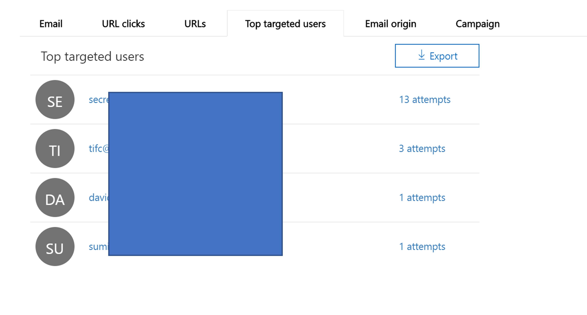

# Explorador de amenazas y detecciones en tiempo realThreat Explorer and Real-time detections

**Se aplica a****Applies to**
- [Plan 1 y Plan 2 de Microsoft Defender para Office 365Microsoft Defender for Office 365 plan 1 and plan 2](https://go.microsoft.com/fwlink/?linkid=2148715)
- [Microsoft 365 DefenderMicrosoft 365 Defender](https://go.microsoft.com/fwlink/?linkid=2118804)

Si su organización tiene Microsoft Defender para Office [365](office-365-atp.md)y tiene los permisos necesarios, tiene detecciones en tiempo **real** o **explorer** (anteriormente informes en tiempo *real,* vea las novedades). If your organization has [Microsoft Defender for Office 365](office-365-atp.md), and you have the [necessary permissions](#required-licenses-and-permissions), you have either **Explorer** or **Real-time detections** (formerly *Real-time reports* — [see what's new](#new-features-in-threat-explorer-and-real-time-detections)!). En el Centro de & cumplimiento, vaya a Administración de amenazas y, a continuación, elija  **Detecciones en** tiempo real o Explorador.  In the Security & Compliance Center, go to **Threat management**, and then choose **Explorer** _or_ **Real-time detections**.

|Con Microsoft Defender para Office 365 Plan 2, verá:With Microsoft Defender for Office 365 Plan 2, you see:|Con Microsoft Defender para Office 365 Plan 1, verá:With Microsoft Defender for Office 365 Plan 1, you see:|
|---|---|
|||
|

Las detecciones de explorador o en tiempo real ayudan al equipo de operaciones de seguridad a investigar y responder a las amenazas de forma eficaz.Explorer or Real-time detections helps your security operations team investigate and respond to threats efficiently. El informe es similar a la imagen siguiente:The report resembles the following image:

Con este informe, puede:With this report, you can:

- [Ver malware detectado por las características de seguridad de Microsoft 365See malware detected by Microsoft 365 security features](#see-malware-detected-in-email-by-technology)
- [Ver la dirección URL de suplantación de identidad (phishing) y hacer clic en los datos del veredictoView phishing URL and click verdict data](#view-phishing-url-and-click-verdict-data)
- [Iniciar un proceso automatizado de investigación y respuesta desde una vista en el Explorador](#start-automated-investigation-and-response) (solo Defender para Office 365 Plan 2)[Start an automated investigation and response process from a view in Explorer](#start-automated-investigation-and-response) (Defender for Office 365 Plan 2 only)
- [Investigar correo electrónico malintencionado y mucho másInvestigate malicious email, and more](#more-ways-to-use-explorer-and-real-time-detections)

## Mejoras en el Explorador de amenazas y las detecciones en tiempo realImprovements to Threat Explorer and Real-time detections

### Etiquetas en el Explorador de amenazasTags in Threat Explorer

> [!NOTE]
> La característica de etiquetas de usuario está en *versión preliminar,* no está disponible para todos los usuarios y está sujeta a cambios.The user tags feature is in *Preview*, isn't available to everyone, and is subject to change. Para obtener información sobre la programación de lanzamientos, consulte la guía básica de Microsoft 365.For information about the release schedule, check out the Microsoft 365 roadmap.

Las etiquetas de usuario identifican grupos específicos de usuarios en Microsoft Defender para Office 365.User tags identify specific groups of users in Microsoft Defender for Office 365. Para obtener más información acerca de las etiquetas, incluidas las licencias y la configuración, vea [Etiquetas de usuario.](user-tags.md)For more information about tags, including licensing and configuration, see [User tags](user-tags.md).

En el Explorador de amenazas, puede ver información sobre las etiquetas de usuario en las siguientes experiencias.In Threat Explorer, you can see information about user tags in the following experiences.

#### Vista de cuadrícula de correo electrónicoEmail grid view

La **columna** Etiquetas de la cuadrícula de correo electrónico contiene todas las etiquetas que se han aplicado a los buzones de correo del remitente o destinatario.The **Tags** column in the email grid contains all the tags that have been applied to the sender or recipient mailboxes. De forma predeterminada, las etiquetas del sistema, como las cuentas de prioridad, se muestran en primer lugar.By default, system tags like priority accounts are shown first.

> [!div class="mx-imgBorder"]
> 

#### FiltradoFiltering

Puede usar etiquetas como filtro.You can use tags as a filter. Busca solo entre cuentas de prioridad o escenarios de etiquetas de usuario específicos.Hunt just across priority accounts or specific user tags scenarios. También puede excluir los resultados que tienen determinadas etiquetas.You can also exclude results that have certain tags. Combine esta funcionalidad con otros filtros para restringir el ámbito de investigación.Combine this functionality with other filters to narrow your scope of investigation.

> [!div class="mx-imgBorder"]
> 

#### Menú desplegable de detalles de correo electrónicoEmail detail flyout
Para ver las etiquetas individuales del remitente y el destinatario, seleccione el asunto para abrir el control desplegable de detalles del mensaje.To view the individual tags for sender and recipient, select the subject to open the message details flyout. En la **pestaña Resumen,** las etiquetas de remitente y destinatario se muestran por separado, si están presentes para un correo electrónico.On the **Summary** tab, the sender and recipient tags are shown separately, if they're present for an email.
La información sobre las etiquetas individuales del remitente y el destinatario también se extiende a los datos CSV exportados, donde puede ver estos detalles en dos columnas independientes.The information about individual tags for sender and recipient also extends to exported CSV data, where you can see these details in two separate columns.

> [!div class="mx-imgBorder"]
> 

La información de etiquetas también se muestra en el control desplegable de clics de dirección URL.Tags information is also shown in the URL clicks flyout. Para verlo, vaya a la vista Suplantación de identidad o Todo el correo electrónico y, a continuación, a la pestaña Url **o** **Clics de** url. Seleccione un control desplegable de dirección URL individual para ver detalles adicionales sobre los clics de esa dirección URL, incluidas las etiquetas asociadas con ese clic.To view it, go to Phish or All Email view and then to the **URLs** or **URL Clicks** tab. Select an individual URL flyout to view additional details about clicks for that URL, including tags associated with that click.

> [!div class="mx-imgBorder"]
> 

## Mejoras en la experiencia de búsqueda de amenazas (próximamente)Improvements to the threat hunting experience (upcoming)

### Información de amenazas actualizada para mensajes de correo electrónicoUpdated threat information for emails

Nos hemos centrado en las mejoras de la plataforma y la calidad de los datos para aumentar la precisión y la coherencia de los datos para los registros de correo electrónico.We've focused on platform and data-quality improvements to increase data accuracy and consistency for email records. Entre las mejoras se incluye la consolidación de la información de entrega previa y posterior a la entrega, como las acciones ejecutadas en un correo electrónico como parte del proceso ZAP, en un único registro.Improvements include consolidation of pre-delivery and post-delivery information, such as actions executed on an email as part of the ZAP process, into a single record. También se incluyen detalles adicionales como el veredicto de correo no deseado, las amenazas de nivel de entidad (por ejemplo, qué dirección URL era malintencionada) y las ubicaciones de entrega más recientes.Additional details like spam verdict, entity-level threats (for example, which URL was malicious), and latest delivery locations are also included.

Después de estas actualizaciones, verá una sola entrada para cada mensaje, independientemente de los diferentes eventos posteriores a la entrega que afectan al mensaje.After these updates, you'll see a single entry for each message, regardless of the different post-delivery events that affect the message. Las acciones pueden incluir ZAP, corrección manual (lo que significa acción de administrador), entrega dinámica, entre otras.Actions can include ZAP, manual remediation (which means admin action), dynamic delivery, and so on.

Además de mostrar amenazas de malware y phishing, verá el veredicto de correo no deseado asociado a un correo electrónico.In addition to showing malware and phishing threats, you see the spam verdict associated with an email. En el correo electrónico, vea todas las amenazas asociadas con el correo electrónico junto con las tecnologías de detección correspondientes.Within the email, see all the threats associated with the email along with the corresponding detection technologies. Un correo electrónico puede tener cero, una o varias amenazas.An email can have zero, one, or multiple threats. Verá las amenazas actuales en la sección **Detalles** del menú desplegable de correo electrónico.You'll see the current threats in the **Details** section of the email flyout. Para varias amenazas (como malware y  phishing), el campo técnico Detección muestra la asignación de detección de amenazas, que es la tecnología de detección que identificó la amenaza.For multiple threats (such as malware and phishing), the **Detection tech** field shows the threat-detection mapping, which is the detection technology that identified the threat.

El conjunto de tecnologías de detección ahora incluye nuevos métodos de detección, así como tecnologías de detección de correo no deseado.The set of detection technologies now includes new detection methods, as well as spam-detection technologies. Puede usar el mismo conjunto de tecnologías de detección para filtrar los resultados en las distintas vistas de correo electrónico (malware, phishing, todo el correo electrónico).You can use the same set of detection technologies to filter the results across the different email views (Malware, Phish, All Email).

> [!NOTE]
> Es posible que el análisis de veredicto no esté necesariamente vinculado a entidades.Verdict analysis might not necessarily be tied to entities. Por ejemplo, un correo electrónico puede clasificarse como suplantación de identidad o correo no deseado, pero no hay direcciones URL que se marcan con un veredicto de suplantación de identidad o correo no deseado.As an example, an email might be classified as phish or spam, but there are no URLs that are stamped with a phish/spam verdict. Esto se debe a que los filtros también evalúan el contenido y otros detalles de un correo electrónico antes de asignar un veredicto.This is because the filters also evaluate content and other details for an email before assigning a verdict.

#### Amenazas en direcciones URLThreats in URLs

Ahora puede ver la amenaza específica de una dirección URL en la pestaña Detalles del control desplegable **de** correo electrónico. La amenaza puede ser *malware,* *phish,* *correo no deseado* o *ninguno).*You can now see the specific threat for a URL on the email flyout **Details** tab. The threat can be *malware*, *phish*, *spam*, or *none*.)

> [!div class="mx-imgBorder"]
> 

### Vista de escala de tiempo actualizada (próxima)Updated timeline view (upcoming)

> [!div class="mx-imgBorder"]
> 

La vista escala de tiempo identifica todos los eventos de entrega y posterior a la entrega.Timeline view identifies all delivery and post-delivery events. Incluye información sobre la amenaza identificada en ese momento para un subconjunto de estos eventos.It includes information about the threat identified at that point of time for a subset of these events. La vista escala de tiempo también proporciona información sobre cualquier acción adicional realizada (como ZAP o corrección manual), junto con el resultado de esa acción.Timeline view also provides information about any additional action taken (such as ZAP or manual remediation), along with the result of that action. La información de la vista escala de tiempo incluye:Timeline view information includes:

- **Origen:** Origen del evento.**Source:** Source of the event. Puede ser admin/system/user.It can be admin/system/user.
- **Evento:** Incluye eventos de nivel superior como entrega original, corrección manual, ZAP, envíos y entrega dinámica.**Event:** Includes top-level events like original delivery, manual remediation, ZAP, submissions, and dynamic delivery.
- **Acción:** La acción específica que se ha realizado como parte de la acción de ZAP o de administrador (por ejemplo, eliminación parcial).**Action:** The specific action that was taken either as part of ZAP or admin action (for example, soft delete).
- **Amenazas:** Cubre las amenazas (malware, phishing, correo no deseado) identificadas en ese momento.**Threats:** Covers the threats (malware, phish, spam) identified at that point of time.
- **Resultado/Detalles:** Más información sobre el resultado de la acción, como si se realizó como parte de la acción ZAP/admin.**Result/Details:** More information about the result of the action, such as whether it was performed as part of ZAP/admin action.

### Ubicación de entrega original y más recienteOriginal and latest delivery location

Actualmente, se muestra la ubicación de entrega en la cuadrícula de correo electrónico y el control desplegable de correo electrónico.Currently, we surface delivery location in the email grid and email flyout. El **campo Ubicación de** entrega cambia su nombre a Ubicación de entrega **_original_*_. Y estamos introduciendo otro campo, _*_Ubicación de entrega más reciente._**The **Delivery location** field is getting renamed **_Original delivery location_*_. And we're introducing another field, _*_Latest delivery location_**.

**La ubicación de entrega original** dará más información sobre dónde se entregó un correo electrónico inicialmente.**Original delivery location** will give more information about where an email was delivered initially. **La ubicación de entrega más** reciente mostrará dónde aterrizó un correo electrónico después de acciones del sistema como *ZAP* o acciones de administración como Mover a *elementos eliminados.***Latest delivery location** will state where an email landed after system actions like *ZAP* or admin actions like *Move to deleted items*. La ubicación de entrega más reciente está pensada para proporcionar a los administradores la última ubicación conocida posterior a la entrega del mensaje o cualquier acción del sistema o administrador.Latest delivery location is intended to tell admins the message's last-known location post-delivery or any system/admin actions. No incluye ninguna acción del usuario final en el correo electrónico.It doesn't include any end-user actions on the email. Por ejemplo, si un usuario eliminó un mensaje o movió el mensaje a archivo/pst, la ubicación del mensaje "entrega" no se actualizará.For example, if a user deleted a message or moved the message to archive/pst, the message "delivery" location won't be updated. Pero si una acción del sistema actualiza la ubicación (por ejemplo, ZAP da como resultado un correo electrónico que pasa a **cuarentena),** la ubicación de entrega más reciente se mostrará como "cuarentena".But if a system action updated the location (for example, ZAP resulting in an email moving to quarantine), **Latest delivery location** would show as "quarantine."

> [!div class="mx-imgBorder"]
> 

> [!NOTE]
> Hay algunos casos en los que la **ubicación de entrega** y la acción de **entrega** pueden mostrarse como "desconocidas":There are a few cases where **Delivery location** and **Delivery action** may show as "unknown":
>
> - Es posible  que vea la  ubicación de entrega como "entregado" y la ubicación de entrega como "desconocida" si el mensaje se entregó, pero una regla de bandeja de entrada movió el mensaje a una carpeta predeterminada (como Borrador o Archivo) en lugar de a la carpeta Bandeja de entrada o Correo no deseado.You might see **Delivery location** as "delivered" and **Delivery location** as "unknown" if the message was delivered, but an Inbox rule moved the message to a default folder (such as Draft or Archive) instead of to the Inbox or Junk Email folder.
>
> - **La ubicación de entrega más** reciente puede ser desconocida si se intentó realizar una acción de administrador o sistema (como ZAP), pero no se encontró el mensaje.**Latest delivery location** can be unknown if an admin/system action (such as ZAP) was attempted, but the message wasn't found. Normalmente, la acción se produce después de que el usuario haya movido o eliminado el mensaje.Typically, the action happens after the user  moved or deleted the message. En estos casos, compruebe la columna **Resultado/Detalles** en la vista escala de tiempo.In such cases, verify the **Result/Details** column in timeline view. Busque la instrucción "El usuario movió o eliminó el mensaje".Look for the statement "Message moved or deleted by the user."

> [!div class="mx-imgBorder"]
> 

### Acciones adicionalesAdditional actions

*Se aplicaron* acciones adicionales después de la entrega del correo electrónico.*Additional actions* were applied after delivery of the email. Pueden incluir *ZAP,* corrección *manual* (acción realizada por un administrador como eliminación *temporal),* entrega dinámica y *reprocesamiento* (para un correo electrónico que se detectó retroactivamente como correcto).They can include *ZAP*, *manual remediation* (action taken by an Admin such as soft delete), *dynamic delivery*, and *reprocessed* (for an email that was retroactively detected as good).

> [!NOTE]
> - Como parte de los cambios pendientes, el valor "Quitado por ZAP" que se muestra actualmente en el filtro acción de entrega va a desaparecer.As part of the pending changes, the "Removed by ZAP" value currently surfaced in the Delivery Action filter is going away. You'll have a way to search for all email with the ZAP attempt through **Additional actions**.You'll have a way to search for all email with the ZAP attempt through **Additional actions**.
>
> - Habrá nuevos campos y valores para las tecnologías **de** detección y **acciones adicionales** (especialmente para escenarios ZAP).There will be new fields and values for **Detection technologies** and **Additional actions** (especially for ZAP scenarios). Deberá evaluar las consultas guardadas existentes y las consultas de seguimiento para asegurarse de que funcionan con los nuevos valores.You'll need to evaluate your existing saved queries and tracked queries to make sure they work with the new values.

> [!div class="mx-imgBorder"]

> 

### Invalidaciones del sistemaSystem overrides

*Las invalidaciones del* sistema permiten realizar excepciones en la ubicación de entrega prevista de un mensaje.*System overrides* enable you to make exceptions to the intended delivery location of a message. Se reemplaza la ubicación de entrega proporcionada por el sistema, en función de las amenazas y otras detecciones identificadas por la pila de filtrado.You override the delivery location provided by the system, based on the threats and other detections identified by the filtering stack. Los reemplazos del sistema se pueden establecer a través de la directiva de usuario o inquilino para entregar el mensaje según lo sugerido por la directiva.System overrides can be set through tenant or user policy to deliver the message as suggested by the policy. Los reemplazos pueden identificar la entrega no intencionada de mensajes malintencionados debido a diferencias de configuraciones, como una directiva de remitente seguro demasiado amplia establecida por un usuario.Overrides can identify unintentional delivery of malicious messages due to configurations gaps, such as an overly broad Safe Sender policy set by a user. Estos valores de invalidación pueden ser:These override values can be:

- Permitido por la directiva de usuario: un usuario crea directivas en el nivel de buzón para permitir dominios o remitentes.Allowed by user policy: A user creates policies at the mailbox level to allows domains or senders.
- Bloqueado por la directiva de usuario: un usuario crea directivas en el nivel de cuadro de correo para bloquear dominios o remitentes.Blocked by user policy: A user creates policies at the mail box level to block domains or senders.
- Permitido por la directiva de la organización: los equipos de seguridad de la organización establecen directivas o reglas de flujo de correo de Exchange (también conocidas como reglas de transporte) para permitir remitentes y dominios para los usuarios de su organización.Allowed by org policy: The organization's security teams set policies or Exchange mail flow rules (also known as transport rules) to allow senders and domains for users in their organization. Puede ser para un conjunto de usuarios o para toda la organización.This can be for a set of users or the entire organization.
- Bloqueados por la directiva de la organización: los equipos de seguridad de la organización establecen directivas o reglas de flujo de correo para bloquear remitentes, dominios, idiomas de mensajes o direcciones IP de origen para los usuarios de su organización.Blocked by org policy: The organization's security teams set policies or mail flow rules to block senders, domains, message languages, or source IPs for users in their organization. Esto se puede aplicar a un conjunto de usuarios o a toda la organización.This can be applied to a set of users or the entire organization.
- Extensión de archivo bloqueada por la directiva de la organización: el equipo de seguridad de una organización bloquea una extensión de nombre de archivo a través de la configuración de directiva antimalware.File extension blocked by org policy: An organization's security team blocks a file name extension through the anti-malware policy settings. Estos valores ahora se mostrarán en los detalles del correo electrónico para ayudar con las investigaciones.These values will now be displayed in email details to help with investigations. Los equipos de Secops también pueden usar la capacidad de filtrado enriquecido para filtrar por extensiones de archivo bloqueadas.Secops teams can also use the rich-filtering capability to filter on blocked file extensions.

> [!div class="mx-imgBorder"]
> 

### Mejoras para la experiencia de url y clicsImprovements for the URL and clicks experience

Entre las mejoras se incluyen:The improvements include:

- Muestra la dirección URL con clics completos (incluidos los parámetros de consulta que forman parte de la dirección URL) en la sección **Clics** del control desplegable url.Show the full clicked URL (including any query parameters that are part of the URL) in the **Clicks** section of the URL flyout. Actualmente, el dominio de dirección URL y la ruta de acceso aparecen en la barra de título.Currently, the URL domain and path appear in the title bar. Estamos ampliando esa información para mostrar la dirección URL completa.We're extending that information to show the full URL.

- Correcciones entre filtros de dirección *URL* (dirección *URL* frente a dominio de dirección *URL* frente a dominio y ruta de acceso url): las actualizaciones afectan a la búsqueda de mensajes que contienen un veredicto de dirección URL/clic.Fixes across URL filters (*URL* versus *URL domain* versus *URL domain and path*): The updates affect searching for messages that contain a URL/click verdict. Habilitamos la compatibilidad con búsquedas independientes del protocolo, por lo que puede buscar una dirección URL sin usar `http` .We enabled support for protocol-agnostic searches, so you can search for a URL without using `http`. De forma predeterminada, la búsqueda de dirección URL se asigna a http, a menos que se especifique explícitamente otro valor.By default, the URL search maps to http, unless another value is explicitly specified. Por ejemplo:For example:

   -  Busque con y sin el prefijo en los campos de filtro Dirección URL, Dominio de dirección URL y `http://` Dominio y Ruta de acceso de la dirección **URL.**  Search with and without the `http://` prefix in the **URL**, **URL Domain**, and **URL Domain and Path** filter fields. Las búsquedas deben mostrar los mismos resultados.The searches should show the same results.

   -  Busque el `https://` prefijo en la dirección **URL.**Search for the `https://` prefix in **URL**. Cuando no se especifica ningún valor, se `http://` asume el prefijo.When no value is specified, the `http://` prefix is assumed.

   - `/` se omite al principio y al final de los campos de ruta de acceso **url,** dominio de dirección **URL,** dominio de dirección **URL y ruta de** acceso.`/` is ignored at the beginning and end of the **URL path**, **URL Domain**, **URL domain and path** fields. `/` al final del campo **dirección URL** se omite.`/` at the end of the **URL** field is ignored.

### Nivel de confianza de suplantación de identidadPhish confidence level

El nivel de confianza de suplantación de identidad ayuda a identificar el grado de confianza con el que se clasificó un correo electrónico como "phishing".Phish confidence level helps identify the degree of confidence with which an email was categorized as "phish." Los dos valores posibles *son High* y *Normal*.The two possible values are *High* and *Normal*. En las fases iniciales, este filtro solo estará disponible en la vista de suplantación de identidad del Explorador de amenazas.In the initial stages, this filter will be available only in the Phish view of Threat Explorer.

### Señal de DIRECCIÓN URL de ZAPZAP URL signal

La señal de dirección URL de ZAP se usa normalmente para escenarios de alerta de suplantación de identidad ZAP en los que un correo electrónico se identificó como phishing y se quitó después de la entrega.The ZAP URL signal is typically used for ZAP Phish alert scenarios where an email was identified as Phish and removed after delivery. Esta señal conecta la alerta con los resultados correspondientes en el Explorador.This signal connects the alert with the corresponding results in Explorer. Es uno de los IIC de la alerta.It's one of the IOCs for the alert.

Para mejorar el proceso de búsqueda, hemos actualizado el Explorador de amenazas y las detecciones en tiempo real para que la experiencia de búsqueda sea más coherente.To improve the hunting process, we've updated Threat Explorer and Real-time detections to make the hunting experience more consistent. Los cambios se describen aquí:The changes are outlined here:

- [Mejoras en la zona horariaTimezone improvements](#timezone-improvements)
- [Actualización en el proceso de actualizaciónUpdate in the refresh process](#update-in-the-refresh-process)
- [Obtención de detalles del gráfico para agregar a filtrosChart drilldown to add to filters](#chart-drilldown-to-add-to-filters)
- [En las actualizaciones de información del productoIn product information updates](#in-product-information-updates)

### Filtrar por etiquetas de usuarioFilter by user tags

Ahora puede ordenar y filtrar las etiquetas de usuario personalizadas o del sistema para comprender rápidamente el ámbito de las amenazas.You can now sort and filter on system or custom user tags to quickly grasp the scope of threats. Para obtener más información, vea [Etiquetas de usuario.](user-tags.md)To learn more, see [User tags](user-tags.md).

> [!IMPORTANT]
> El filtrado y la ordenación por etiquetas de usuario se encuentra actualmente en versión preliminar pública.Filtering and sorting by user tags is currently in public preview. Esta funcionalidad puede modificarse considerablemente antes de su lanzamiento comercial.This functionality may be substantially modified before it's commercially released. Microsoft no ofrece ninguna garantía, expresa o implícita, con respecto a la información proporcionada al respecto.Microsoft makes no warranties, express or implied, with respect to the information provided about it.

### Mejoras en la zona horariaTimezone improvements

Verá la zona horaria para los registros de correo electrónico en el portal, así como para los datos exportados.You'll see the time zone for the email records in the Portal as well as for Exported data. Estará visible en experiencias como Cuadrícula de correo electrónico, Control de detalles, Escala de tiempo de correo electrónico y Correos electrónicos similares, por lo que la zona horaria del conjunto de resultados es clara.It will be visible across experiences like Email Grid, Details flyout, Email Timeline, and Similar Emails, so the time zone for the result set is clear.

> [!div class="mx-imgBorder"]
> 

### Actualización en el proceso de actualizaciónUpdate in the refresh process

Algunos usuarios han comentado confusión con la actualización automática (por ejemplo, en cuanto cambia la fecha, la página se actualiza) y la actualización manual (para otros filtros).Some users have commented about confusion with automatic refresh (for example, as soon as you change the date, the page refreshes) and manual refresh (for other filters). De forma similar, la eliminación de filtros conduce a la actualización automática.Similarly, removing filters leads to automatic refresh. El cambio de filtros al modificar la consulta puede provocar experiencias de búsqueda incoherentes.Changing filters while modifying the query can cause inconsistent search experiences. Para resolver estos problemas, estamos pasando a un mecanismo de filtrado manual.To resolve these issues, we're moving to a manual-filtering mechanism.

Desde el punto de vista de la experiencia, el usuario puede aplicar y quitar los distintos intervalos de filtros (del conjunto de filtros y la fecha) y seleccionar el botón actualizar para filtrar los resultados después de haber definido la consulta.From an experience standpoint, the user can apply and remove the different range of filters (from the filter set and date) and select the refresh button to filter the results after they've defined the query. El botón de actualización también se resalta ahora en la pantalla.The refresh button is also now emphasized on the screen. También hemos actualizado la información sobre herramientas relacionada y la documentación del producto.We've also updated the related tooltips and in-product documentation.

> [!div class="mx-imgBorder"]
> 

### Obtención de detalles del gráfico para agregar a filtrosChart drilldown to add to filters

Ahora puede crear gráficos de valores de leyenda para agregarlos como filtros.You can now chart legend values to add them as filters. Seleccione el **botón Actualizar** para filtrar los resultados.Select the **Refresh** button to filter the results.

> [!div class="mx-imgBorder"]
> 

### Actualizaciones de información del productoIn-product information updates

Ahora hay detalles adicionales disponibles en el producto, como el número total de resultados de búsqueda dentro de la cuadrícula (vea a continuación).Additional details are now available within the product, such as the total number of search results within the grid (see below). Hemos mejorado las etiquetas, los mensajes de error y la información sobre herramientas para proporcionar más información sobre los filtros, la experiencia de búsqueda y el conjunto de resultados.We've improved labels, error messages, and tooltips to provide more information about the filters, search experience, and result set.

> [!div class="mx-imgBorder"]
> 

## Funcionalidades extendidas en el Explorador de amenazasExtended capabilities in Threat Explorer

### Principales usuarios de destinoTop targeted users

Hoy exponemos la lista de los principales usuarios de destino en la vista Malware de los correos electrónicos, en la sección Principales familias **de malware.**Today we expose the list of the top targeted users in the Malware view for emails, in the **Top Malware Families** section. También ampliaremos esta vista en las vistas Suplantación de identidad y Todo el correo electrónico.We'll be extending this view in the Phish and All Email views as well. Podrás ver los cinco primeros usuarios de destino, junto con el número de intentos de cada usuario para la vista correspondiente.You'll be able to see the top-five targeted users, along with the number of attempts for each user for the corresponding view. Por ejemplo, para la vista de suplantación de identidad, verá el número de intentos de suplantación de identidad.For example, for Phish view, you'll see the number of Phish attempts.

Podrá exportar la lista de usuarios de destino, hasta un límite de 3.000, junto con el número de intentos de análisis sin conexión para cada vista de correo electrónico.You'll be able to export the list of targeted users, up to a limit of 3,000, along with the number of attempts for offline analysis for each email view. Además, al seleccionar el número de intentos (por ejemplo, 13 intentos en la imagen siguiente) se abrirá una vista filtrada en el Explorador de amenazas, para que pueda ver más detalles entre correos electrónicos y amenazas para ese usuario.In addition, selecting the number of attempts (for example, 13 attempts in the image below) will open a filtered view in Threat Explorer, so you can see more details across emails and threats for that user.

> [!div class="mx-imgBorder"]
> 

### Reglas de transporte de ExchangeExchange transport rules

Como parte del enriquecimiento de datos, podrá ver todas las diferentes reglas de transporte de Exchange (ETR) que se aplicaron a un mensaje.As part of data enrichment, you'll be able to see all the different Exchange transport rules (ETR) that were applied to a message. Esta información estará disponible en la vista Cuadrícula de correo electrónico.This information will be available in the Email grid view. Para verlo, seleccione **Opciones de columna en** la cuadrícula y, a continuación, Agregue regla de transporte de **Exchange** desde las opciones de columna.To view it,  select **Column options** in the grid and then **Add Exchange Transport Rule** from the column options. También estará visible en el menú **desplegable** Detalles del correo electrónico.It will also be visible on the **Details** flyout in the email.

Podrá ver tanto el GUID como el nombre de las reglas de transporte que se aplicaron al mensaje.You'll be able to see both the GUID and the name of the transport rules that were applied to the message. Podrá buscar los mensajes con el nombre de la regla de transporte.You'll be able to search for the messages by using the name of the transport rule. Se trata de una búsqueda "Contiene", lo que significa que también puede realizar búsquedas parciales.This is a "Contains" search, which means you can do partial searches as well.

#### Nota importante:Important note:

La disponibilidad de nombre y búsqueda de ETR depende del rol específico que se le asigne.ETR search and name availability depend on the specific role that's assigned to you. Debe tener uno de los siguientes roles o permisos para ver los nombres y la búsqueda de ETR.You need to have one of the following roles/permissions to view the ETR names and search. Si no tiene ninguno de estos roles asignados, no puede ver los nombres de las reglas de transporte ni buscar mensajes con nombres ETR.If you don't have any of these roles assigned to you, you can't see the names of the transport rules or search for messages by using ETR names. Sin embargo, podría ver la etiqueta ETR y la información guid en los detalles de correo electrónico.However, you could see the ETR label and GUID information in the Email Details. Otras experiencias de visualización de registros en cuadrículas de correo electrónico, menús desplegables de correo electrónico, filtros y exportación no se ven afectadas.Other record-viewing experiences in Email Grids, Email flyouts, Filters, and Export are not affected.

- Exo solo - Prevención de pérdida de datos: todoEXO Only - Data Loss Prevention: All
- EXO Only - O365SupportViewConfig: AllEXO Only - O365SupportViewConfig: All
- Microsoft Azure Active Directory o EXO: administrador de seguridad: todosMicrosoft Azure Active Directory or EXO - Security Admin: All
- AAD o EXO: lector de seguridad: todosAAD or EXO - Security Reader: All
- Exo solo - Reglas de transporte: todasEXO Only - Transport Rules: All
- Solo EXO: View-Only configuración: todoEXO Only - View-Only Configuration: All

Dentro de la cuadrícula de correo electrónico, el control desplegable Detalles y el ARCHIVO CSV exportado, los ETR se presentan con un nombre o GUID, como se muestra a continuación.Within the email grid, Details flyout, and Exported CSV, the ETRs are presented with a Name/GUID as shown below.

> [!div class="mx-imgBorder"]
> 

### Conectores de entradaInbound connectors

Los conectores son una colección de instrucciones que personalizan cómo fluye el correo electrónico hacia y desde su organización de Microsoft 365 u Office 365.Connectors are a collection of instructions that customize how your email flows to and from your Microsoft 365 or Office 365 organization. Permiten aplicar restricciones o controles de seguridad.They enable you to apply any security restrictions or controls. En el Explorador de amenazas, ahora puede ver los conectores relacionados con un correo electrónico y buscar correos electrónicos mediante el uso de nombres de conectores.Within Threat Explorer, you can now view the connectors that are related to an email and search for emails by using connector names.

La búsqueda de conectores tiene un carácter "contiene", lo que significa que las búsquedas parciales de palabras clave también deberían funcionar.The search for connectors is "contains" in nature, which means partial keyword searches should work as well. Dentro de la vista de cuadrícula principal, el control desplegable Detalles y el CSV exportado, los conectores se muestran en el formato Nombre/GUID, como se muestra aquí:Within the Main grid view, the Details flyout, and the Exported CSV, the connectors are shown in the Name/GUID format as shown here:

> [!div class="mx-imgBorder"]
> 

## Nuevas características del Explorador de amenazas y detecciones en tiempo realNew features in Threat Explorer and Real-time detections

Hay tres nuevas características disponibles en el Explorador de amenazas y en las detecciones en tiempo real:Three new features are available in Threat Explorer and Real-time detections:

- [Obtener una vista previa del encabezado de correo electrónico y descargar el cuerpo del correo electrónicoPreview email header and download email body](#preview-email-header-and-download-email-body)
- [Escala de tiempo del correo electrónicoEmail timeline](#email-timeline)
- [Exportar datos de clic de dirección URLExport URL click data](#export-url-click-data)

Estas nuevas características se describen a continuación.These new features are outlined below.

### Obtener una vista previa del encabezado de correo electrónico y descargar el cuerpo del correo electrónicoPreview email header and download email body

Ahora puede obtener una vista previa de un encabezado de correo electrónico y descargar el cuerpo del correo electrónico en Los administradores del Explorador de amenazas pueden analizar los encabezados descargados o los mensajes de correo electrónico en busca de amenazas.You can now preview an email header and download the email body in Threat Explorer Admins can analyze downloaded headers/email messages for threats. Dado que la descarga de mensajes de correo electrónico puede correr el riesgo de exposición de información, este proceso se controla mediante el control de acceso basado en roles (RBAC).Because downloading email messages can risk exposure of information, this process is controlled by role-based access control (RBAC). Debe agregarse un nuevo *rol,* vista previa, a otro grupo de roles (como Operaciones de seguridad o Administrador de seguridad) para conceder la capacidad de descargar correos y obtener una vista previa de encabezados en la vista de mensajes de correo electrónico.A new role, *Preview*, must be added to another role group (such as Security Operations or Security Administrator) to grant the ability to download mails and preview headers in all-email messages view.

Las detecciones de explorador y en tiempo real también recibirán nuevos campos que proporcionan una imagen más completa de dónde llegarán los mensajes de correo electrónico.Explorer and Real-time detections will also get new fields that provide a more complete picture of where your email messages land. Estos cambios facilitan la búsqueda de operaciones de seguridad.These changes  make hunting easier for Security Ops. Pero el resultado principal es que puede conocer la ubicación de los mensajes de correo electrónico con problemas de un vistazo.But the main result is you can know the location of problem email messages at a glance.

¿Cómo se hace?How is this done? El estado de entrega ahora se divide en dos columnas:Delivery status is now broken out into two columns:

- **Acción de entrega:** estado del correo electrónico.**Delivery action** - Status of the email.
- **Ubicación de entrega:** dónde se enrutó el correo electrónico.**Delivery location** - Where the email was routed.

*La acción de* entrega es la acción realizada en un correo electrónico debido a directivas o detecciones existentes.*Delivery action* is the action taken on an email due to existing policies or detections. Estas son las acciones posibles para un correo electrónico:Here are the possible actions for an email:

|EntregadoDelivered|JunkedJunked|BlockedBlocked|ReemplazadoReplaced|
|---|---|---|---|
|El correo electrónico se entregó a la bandeja de entrada o carpeta de un usuario y el usuario puede acceder a él.Email was delivered to the inbox or folder of a user, and the user can access it.|El correo electrónico se envió a la carpeta Correo no deseado o Eliminado del usuario y el usuario puede acceder a él.Email was sent to the user's Junk  or Deleted folder, and the user can access it.|Mensajes de correo electrónico que se ponen en cuarentena, que han fallado o que se han descartado.Emails that are quarantined, that failed, or were dropped. Estos correos no son accesibles para el usuario.These mails are inaccessible to the user.|El correo electrónico tenía datos adjuntos malintencionados reemplazados por archivos .txt que den como resultado que los datos adjuntos son malintencionados.Email had malicious attachments replaced by .txt files that state the attachment was malicious.|

Esto es lo que el usuario puede y no puede ver:Here is what the user can and can't see:

|Accesible para los usuarios finalesAccessible to end users|Inaccesible para los usuarios finalesInaccessible to end users|
|---|---|
|EntregadoDelivered|BlockedBlocked|
|JunkedJunked|ReemplazadoReplaced|

**La ubicación de** entrega muestra los resultados de las directivas y detecciones que se ejecutan después de la entrega.**Delivery location** shows the results of policies and detections that run post-delivery. Está vinculado a la acción **_De entrega._**It's linked to **_Delivery action_**. Estos son los valores posibles:These are the possible values:

- *Bandeja de entrada o carpeta:* el correo electrónico está en la bandeja de entrada o en una carpeta (según las reglas de correo electrónico).*Inbox or folder*: The email is in the inbox or a folder (according to your email rules).
- *Local o externo:* el buzón no existe en la nube, pero es local.*On-prem or external*: The mailbox doesn't exist on cloud but is on-premises.
- *Carpeta de correo* no deseado: el correo electrónico se encuentra en la carpeta de correo no deseado de un usuario.*Junk folder*: The email is in a user's Junk folder.
- *Carpeta elementos eliminados:* el correo electrónico de la carpeta Elementos eliminados de un usuario.*Deleted items folder*: The email in a user's Deleted items folder.
- *Cuarentena:* el correo electrónico está en cuarentena y no en el buzón de un usuario.*Quarantine*: The email is in quarantine and not in a user's mailbox.
- *Error:* el correo electrónico no pudo llegar al buzón.*Failed*: The email failed to reach the mailbox.
- *Descartado:* el correo electrónico se perdió en algún lugar del flujo de correo.*Dropped*: The email got lost somewhere in the mail flow.

### Escala de tiempo del correo electrónicoEmail timeline

La **escala de tiempo de** correo electrónico es una nueva característica del explorador que mejora la experiencia de búsqueda para los administradores.The **Email timeline** is a new Explorer feature that improves the hunting experience for admins. Reduce el tiempo dedicado a comprobar diferentes ubicaciones para intentar comprender el evento.It cuts the time spent checking different locations to try to understand the event. Cuando se suceden varios eventos al mismo tiempo o casi al mismo tiempo que llega un correo electrónico, estos eventos se muestran en una vista de escala de tiempo.When multiple events happen at or close to the same time an email arrives, those events are displayed in a timeline view. Algunos eventos que se suceden en el correo electrónico posterior a la entrega se capturan en la **columna Acción** especial.Some events that happen to your email post-delivery are captured in the **Special action** column. Los administradores pueden combinar información de la escala de tiempo con la acción especial realizada en la entrega posterior al correo para obtener información sobre cómo funcionan sus directivas, dónde se enrutó finalmente el correo y, en algunos casos, cuál fue la evaluación final.Admins can combine  information from the timeline with the special action taken on the mail post-delivery to get insight into how their policies work, where the mail was finally routed, and, in some cases, what the final assessment was.

Para obtener más información, vea Investigar y corregir el correo electrónico malintencionado [que se entregó en Office 365.](investigate-malicious-email-that-was-delivered.md)For more information, see [Investigate and remediate malicious email that was delivered in Office 365](investigate-malicious-email-that-was-delivered.md).

### Exportar datos de clic de dirección URLExport URL click data

Ahora puede exportar informes de clics de  url a Microsoft Excel para ver el id. de mensaje de red y hacer clic en veredicto, lo que ayuda a explicar dónde se originó el tráfico de clics de la dirección URL.You can now export reports for URL clicks to Microsoft Excel to view their **network message ID** and **click verdict**, which helps explain where your URL click traffic originated. Así es como funciona: en Administración de amenazas en la barra de inicio rápido de Office 365, siga esta cadena:Here's how it works: In Threat Management on the Office 365 quick-launch bar, follow this chain:

**Explorador** \> **Ver suplantación de identidad** \> **Clics** \> **Las direcciones URL principales** o **los clics** superiores de la dirección URL \> seleccionan cualquier registro para abrir el menú desplegable de direcciones URL.**Explorer** \> **View Phish** \> **Clicks** \> **Top URLs** or **URL Top Clicks** \> select any record to open the URL flyout.

Cuando seleccione una dirección URL en la lista, verá un nuevo botón **Exportar** en el panel desplegable.When you select a URL in the list, you'll see a new **Export** button on the fly-out panel. Use este botón para mover datos a una hoja de cálculo de Excel para facilitar la creación de informes.Use this button to move data to an Excel spreadsheet for easier reporting.

Siga esta ruta para llegar a la misma ubicación en el informe de detecciones en tiempo real:Follow this path to get to the same location in the Real-time detections report:

**Explorador** \> **Detecciones en tiempo real** \> **Ver suplantación de identidad** \> **Direcciones URL** \> **Direcciones URL principales o** **clics superiores** Seleccione cualquier registro para abrir el control desplegable dirección URL, vaya a \> la pestaña \> **Clics.****Explorer** \> **Real-time detections** \> **View Phish** \> **URLs** \> **Top URLs** or **Top Clicks** \> Select any record to open the URL flyout \> navigate to the **Clicks** tab.

> [!TIP]
> El id. de mensaje de red asigna el clic a correos específicos cuando busca en el identificador a través del Explorador o las herramientas de terceros asociadas.The Network Message ID maps the click back to specific mails when you search on the ID through Explorer or associated third-party tools. Estas búsquedas identifican el correo electrónico asociado con un resultado de clic.Such searches identify the email associated with a click result. Tener el id. de mensaje de red correlacionado permite un análisis más rápido y eficaz.Having the correlated Network Message ID makes for quicker and more powerful analysis.

> [!div class="mx-imgBorder"]
> 

## Ver malware detectado en el correo electrónico por tecnologíaSee malware detected in email by technology

Supongamos que desea ver malware detectado en el correo electrónico ordenado por la tecnología de Microsoft 365.Suppose you want to see malware detected in email sorted by Microsoft 365 technology. Para ello, usa la vista [Detección > malware](threat-explorer-views.md#email--malware) del Explorador (o detecciones en tiempo real).To do this, use the [Email > Malware](threat-explorer-views.md#email--malware) view of Explorer (or Real-time detections).

1. En el Centro de & cumplimiento ( ), elija Explorador de administración de amenazas <https://protection.office.com>  \>  (o **detecciones en tiempo real).**In the Security & Compliance Center (<https://protection.office.com>), choose **Threat management** \> **Explorer** (or **Real-time detections**). (En este ejemplo se usa Explorer).(This example uses Explorer.)

2. En el **menú Ver,** elija Malware **de** \> **correo electrónico.**In the **View** menu, choose **Email** \> **Malware**.

   > [!div class="mx-imgBorder"]
   > 

3. Haga **clic en Remitente** y, a continuación, elija Tecnología **de** \> **detección básica.**Click **Sender**, and then choose **Basic** \> **Detection technology**.

   Las tecnologías de detección ahora están disponibles como filtros para el informe.Your detection technologies are now available as filters for the report.

   > [!div class="mx-imgBorder"]
   > 

4. Elija una opción.Choose an option. A continuación, **seleccione** el botón Actualizar para aplicar ese filtro.Then select the **Refresh** button to apply that filter.

   > [!div class="mx-imgBorder"]
   > 

El informe se actualiza para mostrar los resultados que el malware detectó en el correo electrónico, mediante la opción de tecnología seleccionada.The report refreshes to show the results that malware detected in email, using the technology option you selected. Desde aquí, puede realizar más análisis.From here, you can conduct further analysis.

## Ver la dirección URL de suplantación de identidad (phishing) y hacer clic en los datos del veredictoView phishing URL and click verdict data

Supongamos que desea ver intentos de suplantación de identidad a través de direcciones URL en el correo electrónico, incluida una lista de direcciones URL permitidas, bloqueadas e invalidadas.Suppose that you want to see phishing attempts through URLs in email, including a list of URLs that were allowed, blocked, and overridden. Para identificar las direcciones URL en las que se hizo clic, deben configurarse [vínculos](atp-safe-links.md) seguros.To identify URLs that were clicked, [Safe Links](atp-safe-links.md) must be configured. Asegúrese de configurar  directivas de vínculos seguros para la protección con el tiempo de clic y el registro de veredictos de clic mediante vínculos seguros.Make sure that you set up [Safe Links policies](set-up-atp-safe-links-policies.md) for time-of-click protection and logging of click verdicts by Safe Links.

Para revisar las direcciones URL de suplantación de identidad [   >   ](threat-explorer-views.md#email--phish) en los mensajes y los clics en las direcciones URL de los mensajes de suplantación de identidad, use la vista de suplantación de identidad de correo electrónico del explorador o las detecciones en tiempo real.To review phish URLs in messages and clicks on URLs in phish messages, use the [**Email** > **Phish**](threat-explorer-views.md#email--phish) view of Explorer or Real-time detections.

1. En el Centro de & cumplimiento ( ), elija Explorador de administración de amenazas <https://protection.office.com>  \>  (o **detecciones en tiempo real).**In the Security & Compliance Center (<https://protection.office.com>), choose **Threat management** \> **Explorer** (or **Real-time detections**). (En este ejemplo se usa Explorer).(This example uses Explorer.)

2. En el **menú Ver,** elija Suplantación de identidad **de correo** \> **electrónico.**In the **View** menu, choose **Email** \> **Phish**.

   > [!div class="mx-imgBorder"]
   > 

3. Haga **clic en Remitente** y, a continuación, elija Direcciones **URL** Hacer clic \> **en veredicto.**Click **Sender**, and then choose **URLs** \> **Click verdict**.

4. Seleccione una o más opciones, como **Bloqueado** y Bloquear  invalidados y, a continuación, seleccione el botón Actualizar en la misma línea que las opciones para aplicar ese filtro.Select one or more options, such as **Blocked** and **Block overridden**, and then select the **Refresh** button on the same line as the options to apply that filter. (No actualice la ventana del explorador).(Don't refresh your browser window.)

   > [!div class="mx-imgBorder"]
   > 

   El informe se actualiza para mostrar dos tablas de direcciones URL diferentes en la pestaña Dirección URL del informe:The report refreshes to show two different URL tables on the URL tab under the report:

   - **Las direcciones URL principales** son las direcciones URL de los mensajes filtrados y la acción de entrega de correo electrónico cuenta para cada dirección URL.**Top URLs** are the URLs in the messages that you filtered down to and the email delivery action counts for each URL. En la vista de correo electrónico de suplantación de identidad, esta lista normalmente contiene direcciones URL legítimas.In the Phish email view, this list typically contains legitimate URLs. Los atacantes incluyen una combinación de direcciones URL buenas y mal en sus mensajes para intentar que se entreguen, pero hacen que los vínculos malintencionados parezcan más interesantes.Attackers include a mix of good and bad URLs in their messages to try to get them delivered, but they make the malicious links look more interesting. La tabla de direcciones URL se ordena por recuento total de correo electrónico, pero esta columna está oculta para simplificar la vista.The table of URLs is sorted by total email count, but this column is hidden to simplify the view.

   - **Los clics principales** son las direcciones URL ajustadas por vínculos seguros en las que se hizo clic, ordenadas por recuento total de clics.**Top clicks** are the Safe Links-wrapped URLs that were clicked, sorted by total click count. Esta columna tampoco se muestra para simplificar la vista.This column also isn't displayed, to simplify the view. Los recuentos totales por columna indican el recuento de veredictos de clic de Vínculos seguros para cada dirección URL en la que se ha hecho clic.Total counts by column indicate the Safe Links click verdict count for each clicked URL. En la vista de correo electrónico de suplantación de identidad, normalmente son direcciones URL sospechosas o malintencionadas.In the Phish email view, these are usually suspicious or malicious URLs. Pero la vista podría incluir direcciones URL que no son amenazas pero que están en mensajes de suplantación de identidad.But the view could include URLs that aren't threats but are in phish messages. Los clics de url en vínculos sin envolver no se muestran aquí.URL clicks on unwrapped links don't show up here.

   Las dos tablas url muestran las direcciones URL principales en los mensajes de correo electrónico de suplantación de identidad por acción de entrega y ubicación.The two URL tables show top URLs in phishing email messages by delivery action and location. En las tablas se muestran los clics de dirección URL que se bloquearon o visitaron a pesar de una advertencia, para que pueda ver qué posibles vínculos no se mostraron a los usuarios y en los que se hizo clic en el usuario.The tables show URL clicks that were blocked or visited despite a warning, so you can see what potential bad links were presented to users and that the user's clicked. Desde aquí, puede realizar más análisis.From here, you can conduct further analysis. Por ejemplo, debajo del gráfico puede ver las direcciones URL principales de los mensajes de correo electrónico bloqueados en el entorno de su organización.For example, below the chart you can see the top URLs in email messages that were blocked in your organization's environment.

   > [!div class="mx-imgBorder"]
   > 

   Seleccione una dirección URL para ver información más detallada.Select a URL to view more detailed information.

   > [!NOTE]
   > En el cuadro de diálogo desplegable dirección URL, se quita el filtrado de mensajes de correo electrónico para mostrar la vista completa de la exposición de la dirección URL en su entorno.In the URL flyout dialog box, the filtering on email messages is removed to show the full view of the URL's exposure in your environment. Esto le permite filtrar los mensajes de correo electrónico que le preocupan en el Explorador, buscar direcciones URL específicas que son amenazas potenciales y, a continuación, ampliar su comprensión de la exposición de direcciones URL en su entorno (a través del cuadro de diálogo de detalles de la dirección URL) sin tener que agregar filtros de dirección URL a la propia vista del Explorador.This lets you filter for email messages you're concerned about in Explorer, find specific URLs that are potential threats, and then expand your understanding of the URL exposure in your environment (via the URL details dialog box) without having to add URL filters to the Explorer view itself.

### Interpretación de veredictos de clicInterpretation of click verdicts

Dentro de los menús desplegables Correo electrónico o URL, Clics principales, así como en nuestras experiencias de filtrado, verá diferentes valores de veredicto de clic:Within the Email or URL flyouts, Top Clicks as well as within our filtering experiences, you'll see different click verdict values:

- **Ninguno:** No se puede capturar el veredicto de la dirección URL.**None:** Unable to capture the verdict for the URL. Es posible que el usuario haya hecho clic en la dirección URL.The user might have clicked through the URL.
- **Permitido:** Se permitió al usuario navegar a la dirección URL.**Allowed:** The user was allowed to navigate to the URL.
- **Bloqueado:** Se bloqueó al usuario para que no navegara a la dirección URL.**Blocked:** The user was blocked from navigating to the URL.
- **Veredicto pendiente:** Al usuario se le presentó la página pendiente de detonación.**Pending verdict:** The user was presented with the detonation-pending page.
- **Bloqueado invalidado:** Se bloqueó al usuario para que no navegara directamente a la dirección URL.**Blocked overridden:** The user was blocked from navigating directly to the URL. Pero el usuario supera el bloque para navegar a la dirección URL.But the user overrode the block to navigate to the URL.
- **Se omitió el veredicto pendiente:** Se presentó al usuario la página de detonación.**Pending verdict bypassed:** The user was presented with the detonation page. Pero el usuario ha sobresalto el mensaje para tener acceso a la dirección URL.But the user overrode the message to access the URL.
- **Error:** Al usuario se le presentó la página de error o se produjo un error al capturar el veredicto.**Error:** The user was presented with the error page, or an error occurred in capturing the verdict.
- **Error:** Se produjo una excepción desconocida al capturar el veredicto.**Failure:** An unknown exception occurred while capturing the verdict. Es posible que el usuario haya hecho clic en la dirección URL.The user might have clicked through the URL.

## Revisar los mensajes de correo electrónico notificados por los usuariosReview email messages reported by users

Supongamos que desea ver los mensajes de correo electrónico que los usuarios de  su organización han notificado como correo no *deseado,* correo no deseado o *suplantación* de identidad a través del complemento Informar de mensajes o el complemento Informar de [suplantación de identidad](enable-the-report-phish-add-in.md).Suppose that you want to see email messages that users in your organization reported as *Junk*, *Not Junk*, or *Phishing* through the [Report Message add-in](enable-the-report-message-add-in.md) or the [Report Phishing add-in](enable-the-report-phish-add-in.md). Para verlos, usa la vista [   >  **Envíos de**](threat-explorer-views.md#email--submissions) correo electrónico del Explorador (o detecciones en tiempo real).To see them, use the [**Email** > **Submissions**](threat-explorer-views.md#email--submissions) view of Explorer (or Real-time detections).

1. En el Centro de & cumplimiento ( ), elija Explorador de administración de amenazas <https://protection.office.com>  \>  (o **detecciones en tiempo real).**In the Security & Compliance Center (<https://protection.office.com>), choose **Threat management** \> **Explorer** (or **Real-time detections**). (En este ejemplo se usa Explorer).(This example uses Explorer.)

2. En el **menú Ver,** elija  \> **Envíos de correo electrónico.**In the **View** menu, choose **Email** \> **Submissions**.

   > [!div class="mx-imgBorder"]
   > 

3. Haga **clic en Remitente** y, a continuación, elija Tipo **de** informe \> **básico.**Click **Sender**, and then choose **Basic** \> **Report type**.

4. Seleccione una opción, como **suplantación** de identidad y, a continuación, seleccione el **botón** Actualizar.Select an option, such as **Phish**, and then select the **Refresh** button.

   > [!div class="mx-imgBorder"]
   > 

El informe se actualiza para mostrar datos sobre los mensajes de correo electrónico que las personas de su organización han notificado como un intento de suplantación de identidad.The report refreshes to show data about email messages that people in your organization reported as a phishing attempt. Puede usar esta información para realizar más análisis y, si es necesario, ajustar las directivas contra suplantación de identidad en [Microsoft Defender para Office 365.](configure-atp-anti-phishing-policies.md)You can use this information to conduct further analysis, and, if necessary, adjust your [anti-phishing policies in Microsoft Defender for Office 365](configure-atp-anti-phishing-policies.md).

## Iniciar investigación y respuesta automatizadasStart automated investigation and response

> [!NOTE]
> Las capacidades automatizadas de investigación y respuesta están disponibles en Microsoft Defender para *Office 365 Plan 2* y *Office 365 E5.*Automated investigation and response capabilities are available in *Microsoft Defender for Office 365 Plan 2* and *Office 365 E5*.

[La investigación y respuesta automatizadas](automated-investigation-response-office.md) pueden ahorrarle al equipo de operaciones de seguridad el tiempo y el esfuerzo invertidos en investigar y mitigar los ciberataques.[Automated investigation and response](automated-investigation-response-office.md) can save your security operations team time and effort spent investigating and mitigating cyberattacks. Además de configurar alertas que pueden desencadenar un libro de estrategias de seguridad, puedes iniciar una investigación automatizada y un proceso de respuesta desde una vista en el Explorador.In addition to configuring alerts that can trigger a security playbook, you can start an automated investigation and response process from a view in Explorer. Para obtener más información, [vea Ejemplo: un administrador de seguridad desencadena una investigación desde el Explorador.](automated-investigation-response-office.md#example-a-security-administrator-triggers-an-investigation-from-threat-explorer)For details, see [Example: A security administrator triggers an investigation from Explorer](automated-investigation-response-office.md#example-a-security-administrator-triggers-an-investigation-from-threat-explorer).

## Más formas de usar detecciones en tiempo real y explorerMore ways to use Explorer and Real-time detections

Además de los escenarios descritos en este artículo, tienes muchas más opciones de informes disponibles con explorer (o detecciones en tiempo real).In addition to the scenarios outlined in this article, you have many more reporting options available with Explorer (or Real-time detections). Consulte los siguientes artículos:See the following articles:

- [Buscar e investigar el correo electrónico malintencionado que se ha entregadoFind and investigate malicious email that was delivered](investigate-malicious-email-that-was-delivered.md)
- [Ver archivos malintencionados detectados en SharePoint Online, OneDrive y Microsoft TeamsView malicious files detected in SharePoint Online, OneDrive, and Microsoft Teams](malicious-files-detected-in-spo-odb-or-teams.md)
- [Obtener información general sobre las vistas en el Explorador de amenazas (y detecciones en tiempo real)Get an overview of the views in Threat Explorer (and Real-time detections)](threat-explorer-views.md)
- [Informe de estado de protección contra amenazasThreat protection status report](view-email-security-reports.md#threat-protection-status-report)
- [Investigación y respuesta automatizada en la Protección contra amenazas de MicrosoftAutomated investigation and response in Microsoft Threat Protection](https://docs.microsoft.com/microsoft-365/security/mtp/mtp-autoir)

## Permisos y licencias necesariosRequired licenses and permissions

Debe tener [Microsoft Defender para Office 365](office-365-atp.md) para usar detecciones en tiempo real o explorer.You must have [Microsoft Defender for Office 365](office-365-atp.md) to use Explorer or Real-time detections.

- El explorador se incluye en Defender para Office 365 Plan 2.Explorer is included in Defender for Office 365 Plan 2.
- El informe de detecciones en tiempo real se incluye en Defender para Office 365 Plan 1.The Real-time detections report is included in Defender for Office 365 Plan 1.
- Planee asignar licencias para todos los usuarios que deberán estar protegidos por Defender para Office 365.Plan to assign licenses for all users who should be protected by Defender for Office 365. Las detecciones de explorador y en tiempo real muestran los datos de detección de los usuarios con licencia.Explorer and Real-time detections show detection data for licensed users.

Para ver y usar detecciones en tiempo real o explorer, debe tener los permisos adecuados, como los concedidos a un administrador de seguridad o un lector de seguridad.To view and use Explorer or Real-time detections, you must have appropriate permissions, such as those granted to a security administrator or security reader.

- Para el Centro de & cumplimiento, debe tener asignado uno de los siguientes roles:For the Security & Compliance Center, you must have one of the following roles assigned:

  - Administración de la organizaciónOrganization Management
  - Administrador de seguridad (se puede asignar en el Centro de administración de Azure Active Directory ( <https://aad.portal.azure.com> )Security Administrator (this can be assigned in the Azure Active Directory admin center (<https://aad.portal.azure.com>)
  - Lector de seguridadSecurity Reader

- Para Exchange Online, debe tener uno de los siguientes roles asignados en el Centro de administración de Exchange ( <https://admin.protection.outlook.com/ecp/> ) o Exchange Online [PowerShell](https://docs.microsoft.com/powershell/exchange/exchange-online-powershell):For Exchange Online, you must have one of the following roles assigned in either the Exchange admin center (<https://admin.protection.outlook.com/ecp/>) or [Exchange Online PowerShell](https://docs.microsoft.com/powershell/exchange/exchange-online-powershell):

  - Administración de la organizaciónOrganization Management
  - Administración de la organización de solo visualizaciónView-Only Organization Management
  - Destinatarios con permiso de vistaView-Only Recipients
  - Administración de cumplimientoCompliance Management

Para obtener más información acerca de los roles y permisos, vea los siguientes recursos:To learn more about roles and permissions, see the following resources:

- [Permisos en el Centro de seguridad y cumplimiento Permissions in the Security & Compliance Center](permissions-in-the-security-and-compliance-center.md)
- [Permisos de características de Exchange OnlineFeature permissions in Exchange Online](https://docs.microsoft.com/exchange/permissions-exo/feature-permissions)

## Diferencias entre el Explorador de amenazas y las detecciones en tiempo realDifferences between Threat Explorer and Real-time detections

- El *informe de detecciones en tiempo* real está disponible en Defender para Office 365 Plan 1.The *Real-time detections* report is available in Defender for Office 365 Plan 1. *El Explorador de* amenazas está disponible en Defender para Office 365 Plan 2.*Threat Explorer* is available in Defender for Office 365 Plan 2.
- El informe de detecciones en tiempo real permite ver las detecciones en tiempo real.The Real-time detections report allows you to view detections in real time. El Explorador de amenazas también hace esto, pero también proporciona detalles adicionales para un ataque determinado.Threat Explorer does this as well, but it also provides additional details for a given attack.
- La *vista Todo el* correo electrónico está disponible en el Explorador de amenazas, pero no en el informe de detecciones en tiempo real.An *All email* view is available in Threat Explorer but not in the Real-time detections report.
- En el Explorador de amenazas se incluyen más capacidades de filtrado y acciones disponibles.More filtering capabilities and available actions are included in Threat Explorer. Para obtener más información, vea Descripción del servicio de Microsoft Defender para Office 365: disponibilidad de características en los planes de Defender para [Office 365.](https://docs.microsoft.com/office365/servicedescriptions/office-365-advanced-threat-protection-service-description#feature-availability-across-advanced-threat-protection-atp-plans)For more information, see [Microsoft Defender for Office 365 Service Description: Feature availability across Defender for Office 365 plans](https://docs.microsoft.com/office365/servicedescriptions/office-365-advanced-threat-protection-service-description#feature-availability-across-advanced-threat-protection-atp-plans).
