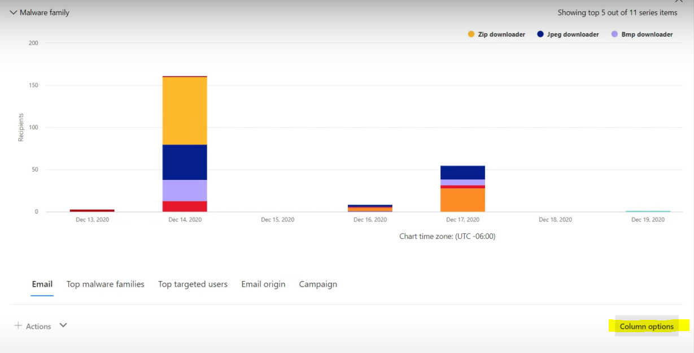
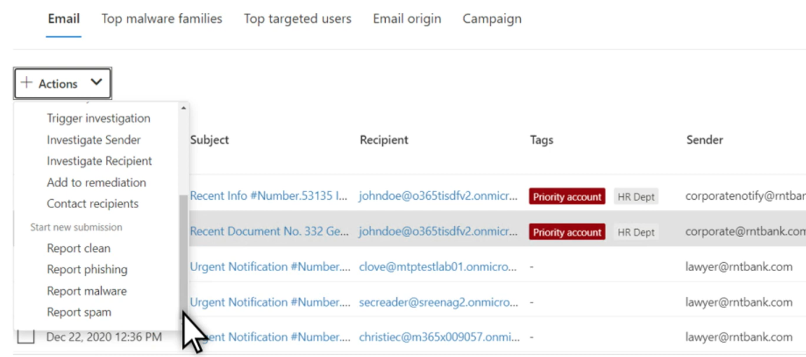

# Búsqueda de amenazas en el Explorador de amenazas para Microsoft Defender para Office 365Threat hunting in Threat Explorer for Microsoft Defender for Office 365

En este artículo:In this article:

- [Paso a paso del Explorador de amenazasThreat Explorer walk-through](#threat-explorer-walk-through)
- [Investigación de correo electrónicoEmail investigation](#email-investigation)
- [Corrección de correo electrónicoEmail remediation](#email-remediation)
- [Mejoras en la experiencia de búsqueda de amenazasImprovements to threat hunting experience](#improvements-to-threat-hunting-experience)

> [!NOTE]
> Esto forma parte de una serie de **3** artículos sobre explorador de amenazas **(Explorer),** seguridad de correo electrónico y **conceptos** básicos de detecciones de Explorador y tiempo real (como diferencias entre las herramientas y los permisos necesarios para operarlas).This is part of a **3-article series** on **Threat Explorer (Explorer)**, **email security**, and **Explorer and Real-time detections basics** (such as differences between the tools, and permissions needed to operate them). Los otros dos artículos de esta serie son Seguridad de correo [electrónico con](email-security-in-microsoft-defender.md) el Explorador de amenazas y el Explorador de amenazas y [conceptos](real-time-detections.md)básicos de detecciones en tiempo real .The other two articles in this series are [Email security with Threat Explorer](email-security-in-microsoft-defender.md) and [Threat Explorer and Real-time detections basics](real-time-detections.md).

**Se aplica a****Applies to**
- [Plan 1 y Plan 2 de Microsoft Defender para Office 365Microsoft Defender for Office 365 plan 1 and plan 2](defender-for-office-365.md)
- [Microsoft 365 DefenderMicrosoft 365 Defender](../defender/microsoft-365-defender.md)

Si su organización tiene [Microsoft Defender](defender-for-office-365.md)para Office 365 y tiene los [permisos,](#required-licenses-and-permissions)puede usar detecciones en tiempo **real** o **explorador** para detectar y corregir amenazas.If your organization has [Microsoft Defender for Office 365](defender-for-office-365.md), and you have the [permissions](#required-licenses-and-permissions), you can use **Explorer** or **Real-time detections** to detect and remediate threats.

En el portal Microsoft 365 Defender ( ), vaya a Correo electrónico & colaboración y, a continuación, elija Explorador o <https://security.microsoft.com> **Detecciones en tiempo real**.  In the Microsoft 365 Defender portal (<https://security.microsoft.com>), go to **Email & collaboration**, and then choose **Explorer** or **Real-time detections**. Para hacerlo directamente en la página, use <https://security.microsoft.com/threatexplorer> o <https://security.microsoft.com/realtimereports>To do directly to the page, use <https://security.microsoft.com/threatexplorer> or <https://security.microsoft.com/realtimereports>

Con estas herramientas, puede:With these tools, you can:

- Ver malware detectado por Microsoft 365 de seguridadSee malware detected by Microsoft 365 security features
- Ver la dirección URL de suplantación de identidad (phishing) y hacer clic en datos de veredictoView phishing URL and click verdict data
- Iniciar un proceso automatizado de investigación y respuesta desde una vista en el ExploradorStart an automated investigation and response process from a view in Explorer
- Investigar correo electrónico malintencionado y mucho másInvestigate malicious email, and more

Para obtener más información, vea [Email security with Threat Explorer](email-security-in-microsoft-defender.md).For more information, see [Email security with Threat Explorer](email-security-in-microsoft-defender.md).

## Paso a paso del Explorador de amenazasThreat Explorer walk-through

En Microsoft Defender para Office 365, hay dos planes de suscripción: plan 1 y plan 2.In Microsoft Defender for Office 365, there are two subscription plans—Plan 1 and Plan 2. Las herramientas de búsqueda de amenazas operadas manualmente existen en ambos planes, con nombres diferentes y con capacidades diferentes.Manually operated Threat hunting tools exist in both plans, under different names and with different capabilities.

Defender for Office 365 Plan 1 usa detecciones en tiempo *real,* que es un subconjunto de la herramienta de búsqueda Explorador de amenazas *(también* denominada *Explorador)* del Plan 2.Defender for Office 365 Plan 1 uses *Real-time detections*, which is a subset of the *Threat Explorer* (also called *Explorer*) hunting tool in Plan 2. En esta serie de artículos, la mayoría de los ejemplos se crearon con el Explorador de amenazas completo.In this series of articles, most of the examples were created using the full Threat Explorer. Los administradores deben probar los pasos de las detecciones en tiempo real para ver dónde se aplican.Admins should test any steps in Real-time detections to see where they apply.

Después de ir al **Explorador**, de forma predeterminada, llegarás  a la página **Malware,** pero usa la lista desplegable Ver para familiarizarte con tus opciones.After you go to **Explorer**, by default, you'll arrive on the **Malware** page, but use the **View** drop down to get familiar with your options. Si estás buscando phishing o buscando en una campaña de amenazas, elige esas vistas.If you're hunting Phish, or digging into a threat campaign, choose those views.

> [!div class="mx-imgBorder"]
> 

Una vez que una persona de operaciones de seguridad (Operaciones de sec) selecciona los datos que desea ver, si el  ámbito es una vista estrecha como **envíos** de usuario o una vista más amplia, como Todo el correo **electrónico,** puede usar el botón Remitente para filtrar aún más.Once a security operations (Sec Ops) person selects the data they want to see, whether the scope is narrow view like user **Submissions**, or a wider view, like **All email**, they can use the **Sender** button to further filter. Recuerde seleccionar Actualizar para completar las acciones de filtrado.Remember to select Refresh to complete your filtering actions.

> [!div class="mx-imgBorder"]
> 

El enfoque de refinamiento en el Explorador o la detección en tiempo real se puede pensar en capas.Refining focus in Explorer or Real-time detection can be thought of in layers. El primero es **View**.The first is **View**. El segundo se puede pensar como un *foco filtrado.*The second can be thought of as a *filtered focus*. Por ejemplo, puede volver a seguir los pasos que realizó para encontrar una amenaza registrando sus decisiones como esta: Para encontrar el problema en el Explorador, elegí la vista malware con un foco de filtro **de destinatarios**.For example, you can retrace the steps you took in finding a threat by recording your decisions like this: To find the issue in Explorer, **I chose the Malware View with a Recipient filter focus**. Esto facilita el retraso de los pasos.This makes retracing your steps easier.

> [!TIP]
> Si Sec Ops usa **etiquetas** para marcar cuentas que consideren destinos de alto valor, pueden realizar selecciones como La vista de suplantación de identidad con un foco de filtro *etiquetas (incluir* un intervalo de fechas si se usa).If Sec Ops uses **Tags** to mark accounts they consider high valued targets, they can make selections like *Phish View with a Tags filter focus (include a date range if used)*. Esto les mostrará los intentos de suplantación de identidad dirigidos a sus objetivos de usuario de alto valor durante un intervalo de tiempo (como las fechas en las que ciertos ataques de suplantación de identidad están sucediendo mucho para su sector).This will show them any phishing attempts directed at their high value user targets during a time-range (like dates when certain phishing attacks are happening a lot for their industry).

Los refinamientos se pueden realizar en intervalos de fechas mediante los controles de intervalo de fechas.Refinements can be made on date ranges by using the date range controls. Aquí puede ver explorador en la vista **Malware,** con un foco de filtro **de tecnología** de detección.Here you can see Explorer in **Malware** view, with a **Detection Technology** filter focus. Pero es el botón **Filtro** avanzado el que permite a los equipos de Sec Ops profundizar.But it's the **Advanced filter** button that lets Sec Ops teams dig deep.

> [!div class="mx-imgBorder"]
> 

Al hacer **clic en** el filtro Avanzado, aparece un panel que permitirá a los cazacarros de Sec Ops crear consultas por sí mismos, lo que les permite incluir o excluir la información que necesitan ver.Clicking the **Advanced filter** pops a panel that will let Sec Ops hunters build queries themselves, letting them include or exclude the information they need to see. Tanto el gráfico como la tabla de la página Explorador reflejarán sus resultados.Both the chart and table on the Explorer page will reflect their results.

> [!div class="mx-imgBorder"]
> 

Use el **botón Opciones de** columna para obtener el tipo de información de la tabla que sería más útil:Use the **Column options** button to get the kind of information on the table that would be most helpful:

> [!div class="mx-imgBorder"]
> 

> [!div class="mx-imgBorder"]
> 

En el mismo mien, asegúrate de probar las opciones de visualización.In the same mien, make sure to test your display options. Diferentes audiencias reaccionarán bien a diferentes presentaciones de los mismos datos.Different audiences will react well to different presentations of the same data. Para algunos visores, el mapa **Orígenes** de correo electrónico puede mostrar que una amenaza es generalizada o discreta más rápidamente que la opción Mostrar **campaña** justo al lado.For some viewers, the **Email Origins** map can show that a threat is widespread or discreet more quickly than the **Campaign display** option right next to it. Sec Ops puede hacer uso de estas pantallas para hacer puntos que subrayan la necesidad de seguridad y protección, o para la comparación posterior, para demostrar la eficacia de sus acciones.Sec Ops can make use of these displays to best make points that underscore the need for security and protection, or for later comparison, to demonstrate the effectiveness of their actions.

> [!div class="mx-imgBorder"]
> 

> [!div class="mx-imgBorder"]
> 

### Investigación de correo electrónicoEmail investigation

Cuando vea un correo electrónico sospechoso, haga clic en el nombre para expandir el menú desplegable a la derecha.When you see a suspicious email, click the name to expand the flyout on the right. Aquí, está disponible el banner que permite a las Operaciones de Sec ver la página [de entidad de correo](mdo-email-entity-page.md) electrónico.Here, the banner that lets Sec Ops see the [email entity page](mdo-email-entity-page.md) is available.

La página de entidad de correo electrónico reúne contenidos que se pueden encontrar en **Detalles**, **Datos adjuntos** **,** Dispositivos, pero incluye datos más organizados.The email entity page pulls together contents that can be found under **Details**, **Attachments**, **Devices**, but includes more organized data. Esto incluye aspectos como los resultados de DMARC, la presentación de texto sin formato del encabezado de correo electrónico con una opción de copia, la información de veredicto sobre los datos adjuntos que se detonaron de forma segura y los archivos que se eliminaron (pueden incluir direcciones IP que se han contactado y capturas de pantalla de páginas o archivos).This includes things like DMARC results, plain text display of the email header with a copy option, verdict information on attachments that were securely detonated, and files those detonations dropped (can include IP addresses that were contacted and screenshots of pages or files). Las direcciones URL y sus veredictos también se enumeran con detalles similares notificados.URLs and their verdicts are also listed with similar details reported.

Cuando llegue a esta fase, la página de entidad de correo electrónico será fundamental para el paso final:*corrección*.When you reach this stage, the email entity page will be critical to the final step—*remediation*.

> [!div class="mx-imgBorder"]
> 

> [!TIP]
> Para obtener más información sobre la página  de entidad de correo electrónico enriquecido (que se ve a continuación en la pestaña Análisis), incluidos los resultados de los datos adjuntos detonados, los resultados de las direcciones URL incluidas y la vista previa de correo electrónico seguro, haga clic [aquí](mdo-email-entity-page.md).To learn more about the rich email entity page (seen below on the **Analysis** tab), including the results of detonated Attachments, findings for included URLs, and safe Email preview, click [here](mdo-email-entity-page.md).

> [!div class="mx-imgBorder"]
> 

### Corrección de correo electrónicoEmail remediation

Una vez que una persona de Operaciones de Sec determina que un correo electrónico es una amenaza, el siguiente paso de detección en tiempo real o explorador se ocupa de la amenaza y la corrige.Once a Sec Ops person determines that an email is a threat, the next Explorer or Real-time detection step is dealing with the threat and remediating it. Esto se puede hacer volviendo al Explorador de amenazas, seleccionando la casilla del correo electrónico del problema y usando el **botón** Acciones.This can be done by returning to Threat Explorer, selecting the checkbox for the problem email, and using the **Actions** button.

> [!div class="mx-imgBorder"]
> 

Aquí, el analista puede realizar acciones como notificar el correo como correo no deseado, suplantación de identidad o malware, ponerse en contacto con destinatarios o realizar investigaciones adicionales que pueden incluir activar libros de juegos de investigación y respuesta automatizadas (o AIR) (si tienes plan 2).Here, the analyst can take actions like reporting the mail as Spam, Phishing, or Malware, contacting recipients, or further investigations that can include triggering Automated Investigation and Response (or AIR) playbooks (if you have Plan 2). O bien, el correo también puede ser notificado como limpio.Or, the mail can also be reported as clean.

> [!div class="mx-imgBorder"]
> 

## Mejoras en la experiencia de búsqueda de amenazasImprovements to threat hunting experience

### Id. de alertaAlert ID

Al navegar desde una alerta al Explorador de amenazas, **la vista** se filtrará mediante el identificador **de alerta**.When navigating from an alert into Threat Explorer, the **View** will be filtered by **Alert ID**. Esto también se aplica en la detección en tiempo real.This also applies in Real-time detection. Se muestran los mensajes relevantes para la alerta específica y un total de correo electrónico (un recuento).Messages relevant to the specific alert, and an email total (a count) are shown. Podrás ver si un mensaje formaba parte de una alerta, así como navegar de ese mensaje a la alerta relacionada.You will be able to see if a message was part of an alert, as well as navigate from that message to the related alert.

Por último, el identificador de alerta se incluye en la dirección URL, por ejemplo: `https://https://security.microsoft.com/viewalerts`Finally, alert ID is included in the URL, for example: `https://https://security.microsoft.com/viewalerts`

> [!div class="mx-imgBorder"]
> 

> [!div class="mx-imgBorder"]
> 

### Ampliar el límite de búsqueda y retención de datos del Explorador (y detecciones en tiempo real) para inquilinos de pruebaExtending Explorer (and Real-time detections) data retention and search limit for trial tenants

Como parte de este cambio, los analistas podrán buscar y filtrar datos de correo electrónico durante 30 días (aumentado a partir de siete días) en el Explorador de amenazas y detecciones en tiempo real para los inquilinos de prueba de Defender para Office P1 y P2.As part of this change, analysts will be able to search for, and filter email data across 30 days (increased from seven days) in Threat Explorer and Real-time detections for both Defender for Office P1 and P2 trial tenants. Esto no afecta a los inquilinos de producción para clientes de P1 y P2 E5, donde el valor predeterminado de retención ya es de 30 días.This doesn't impact any production tenants for both P1 and P2 E5 customers, where the retention default is already 30 days.

### Límite de exportación actualizadoUpdated Export limit

El número de registros de correos electrónicos que se pueden exportar desde el Explorador de amenazas es ahora de 200 000 (en lugar de 9990).The number of Emails records that can be exported from Threat Explorer is now 200,000 (was 9990). El conjunto de columnas que se pueden exportar no cambia.The set of columns that can be exported is unchanged.

### Etiquetas en el Explorador de amenazasTags in Threat Explorer

> [!NOTE]
> La característica de etiquetas de usuario está en Versión preliminar y puede que no esté disponible para todos.The user tags feature is in Preview and may not be available to everyone. Además, las vistas previas están sujetas a cambios.Also, Previews are subject to change. Para obtener información acerca de la programación de lanzamiento, consulte el mapa de ruta Microsoft 365 versión.For information about the release schedule, check out the Microsoft 365 roadmap.

Las etiquetas de usuario identifican grupos específicos de usuarios en Microsoft Defender para Office 365.User tags identify specific groups of users in Microsoft Defender for Office 365. Para obtener más información acerca de las etiquetas, incluidas las licencias y la configuración, vea [Etiquetas de usuario](user-tags.md).For more information about tags, including licensing and configuration, see [User tags](user-tags.md).

En el Explorador de amenazas, puede ver información sobre las etiquetas de usuario en las siguientes experiencias.In Threat Explorer, you can see information about user tags in the following experiences.

#### Vista cuadrícula de correo electrónicoEmail grid view

Cuando los analistas miran la columna **Etiquetas** de la cuadrícula de correo electrónico, están viendo todas las etiquetas que se han aplicado a buzones de remitente o destinatario.When analysts look at the **Tags** column the email grid, they are seeing all tags that have been applied to sender or recipient mailboxes. De forma predeterminada, las etiquetas del sistema como *las cuentas* de prioridad se muestran primero.By default, system tags like *priority accounts* are shown first.

> [!div class="mx-imgBorder"]
> 

#### FiltradoFiltering

Las etiquetas se pueden usar como filtros.Tags can be used as filters. Buscar solo entre cuentas de prioridad o usar escenarios de etiquetas de usuario específicos de esta manera.Hunt among priority accounts only, or use specific user tags scenarios this way. También puede excluir los resultados que tienen determinadas etiquetas.You can also exclude results that have certain tags. Combine etiquetas con otros filtros y intervalos de fechas para restringir el ámbito de investigación.Combine Tags with other filters and date ranges to narrow your scope of investigation.

> [!div class="mx-imgBorder"]
> 

#### Flyout de detalles de correo electrónicoEmail detail flyout

Para ver las etiquetas individuales del remitente y el destinatario, seleccione un correo electrónico para abrir el control desplegable de detalles del mensaje.To view the individual tags for sender and recipient, select an email to open the message details flyout. En la **pestaña Resumen,** las etiquetas de remitente y destinatario se muestran por separado.On the **Summary** tab, the sender and recipient tags are shown separately. La información sobre las etiquetas individuales del remitente y el destinatario se puede exportar como datos CSV.The information about individual tags for sender and recipient can be exported as CSV data.

> [!div class="mx-imgBorder"]
> 

La información de etiquetas también se muestra en el control desplegable de clics de dirección URL.Tags information is also shown in the URL clicks flyout. Para verlo, vaya a la vista Phish o All Email > **url url** **clicks** tab. Seleccione un control desplegable de dirección URL individual para ver detalles adicionales acerca de los clics de esa dirección URL, incluidas las etiquetas asociadas con ese clic.To see it, go to Phish or All Email view > **URLs** or **URL Clicks** tab. Select an individual URL flyout to see additional details about clicks for that URL, including any Tags associated with that click.

### Vista de escala de tiempo actualizadaUpdated Timeline View

> [!div class="mx-imgBorder"]
> 
>
Obtenga más información con [este vídeo](https://www.youtube.com/watch?v=UoVzN0lYbfY&list=PL3ZTgFEc7LystRja2GnDeUFqk44k7-KXf&index=4).Learn more by watching [this video](https://www.youtube.com/watch?v=UoVzN0lYbfY&list=PL3ZTgFEc7LystRja2GnDeUFqk44k7-KXf&index=4).

## Funcionalidades extendidasExtended capabilities

### Principales usuarios dirigidosTop targeted users

Las principales familias de malware muestran los principales usuarios **dirigidos** en la sección Malware.Top Malware Families shows the **top targeted users** in the Malware section. Los principales usuarios dirigidos también se extenderán a través de las vistas Phish y All Email.Top targeted users will be extended through Phish and All Email views too. Los analistas podrán ver los cinco primeros usuarios dirigidos, junto con el número de intentos de cada usuario en cada vista.Analysts will be able to see the top-five targeted users, along with the number of attempts for each user in each view.

Las personas de operaciones de seguridad pueden exportar la lista de usuarios dirigidos, hasta un límite de 3.000, junto con el número de intentos realizados, para el análisis sin conexión para cada vista de correo electrónico.Security operations people be able to export the list of targeted users, up to a limit of 3,000, along with the number of attempts made, for offline analysis for each email view. Además, al seleccionar el número de intentos (por ejemplo, 13 intentos en la imagen siguiente) se abrirá una vista filtrada en el Explorador de amenazas, para que pueda ver más detalles entre correos electrónicos y amenazas para ese usuario.Also, selecting the number of attempts (for example, 13 attempts in the image below) will open a filtered view in Threat Explorer, so you can see more details across emails, and threats for that user.

> [!div class="mx-imgBorder"]
> 

### Exchange de transporteExchange transport rules

El equipo de operaciones de seguridad podrá ver todas las reglas de transporte Exchange (o reglas de flujo de correo) aplicadas a un mensaje, en la vista Cuadrícula de correo electrónico.The security operations team will be able to see all the Exchange transport rules (or Mail flow rules) applied to a message, in the Email grid view. Seleccione **Opciones de columna** en la cuadrícula **y, a continuación, Exchange regla de transporte en** las opciones de columna.Select **Column options** in the grid and then **Add Exchange Transport Rule** from the column options. La Exchange reglas de transporte también está visible en el **menú** desplegable Detalles del correo electrónico.The Exchange transport rules option is also visible on the **Details** flyout in the email.

Aparecen nombres y GUID de las reglas de transporte aplicadas al mensaje.Names and GUIDs of the transport rules applied to the message appear. Los analistas podrán buscar mensajes mediante el nombre de la regla de transporte.Analysts will be able to search for messages by using the name of the transport rule. Se trata de una búsqueda CONTAINS, lo que significa que también puede realizar búsquedas parciales.This is a CONTAINS search, which means you can do partial searches as well.

> [!IMPORTANT]
> Exchange búsqueda de reglas de transporte y disponibilidad de nombres dependen del rol específico que se le asigne.Exchange transport rule search and name availability depend on the specific role assigned to you. Debe tener uno de los siguientes roles o permisos para ver los nombres de regla de transporte y la búsqueda.You need to have one of the following roles or permissions to view the transport rule names and search. Sin embargo, incluso sin los roles o permisos siguientes, un analista puede ver la etiqueta de regla de transporte y la información GUID en los detalles del correo electrónico.However, even without the roles or permissions below, an analyst may see the transport rule label and GUID information in the Email Details. No se ven afectadas otras experiencias de visualización de registros en cuadrículas de correo electrónico, control de envío de correo electrónico, filtros y exportación.Other record-viewing experiences in Email Grids, Email flyouts, Filters, and Export are not affected.
>
> - Exchange Online Solo - Prevención de pérdida de datos: TodoExchange Online Only - Data Loss Prevention: All
> - Exchange Online Only - O365SupportViewConfig: AllExchange Online Only - O365SupportViewConfig: All
> - Microsoft Azure Active Directory o Exchange Online: Administrador de seguridad: TodoMicrosoft Azure Active Directory or Exchange Online - Security Admin: All
> - Azure Active Directory o Exchange Online: Lector de seguridad: TodosAzure Active Directory or Exchange Online - Security Reader: All
> - Exchange Online Solo- Reglas de transporte: TodasExchange Online Only - Transport Rules: All
> - Exchange Online Solo - configuración View-Only: todoExchange Online Only - View-Only Configuration: All
>
> Dentro de la cuadrícula de correo electrónico, el control desplegable Detalles y csv exportado, los ETR se presentan con un Nombre/GUID como se muestra a continuación.Within the email grid, Details flyout, and Exported CSV, the ETRs are presented with a Name/GUID as shown below.
>
> > [!div class="mx-imgBorder"]
> > 

### Conectores de entradaInbound connectors

Los conectores son una colección de instrucciones que personalizan cómo fluye el correo electrónico hacia y desde Microsoft 365 o Office 365 organización.Connectors are a collection of instructions that customize how your email flows to and from your Microsoft 365 or Office 365 organization. Permiten aplicar cualquier restricción o control de seguridad.They enable you to apply any security restrictions or controls. En el Explorador de amenazas, puede ver los conectores relacionados con un correo electrónico y buscar correos electrónicos con nombres de conector.In Threat Explorer, you can view the connectors that are related to an email and search for emails using connector names.

La búsqueda de conectores es una consulta CONTAINS, lo que significa que las búsquedas de palabras clave parciales pueden funcionar:The search for connectors is a CONTAINS query, which means partial keyword searches can work:

> [!div class="mx-imgBorder"]
> 

## Permisos y licencias necesariosRequired licenses and permissions

Debe tener [Microsoft Defender para Office 365](defender-for-office-365.md) usar detecciones en tiempo real o explorador.You must have [Microsoft Defender for Office 365](defender-for-office-365.md) to use Explorer or Real-time detections.

- El Explorador se incluye en Defender for Office 365 Plan 2.Explorer is included in Defender for Office 365 Plan 2.
- El informe de detecciones en tiempo real se incluye en Defender for Office 365 Plan 1.The Real-time detections report is included in Defender for Office 365 Plan 1.
- Planee asignar licencias para todos los usuarios que deberán estar protegidos por Defender para Office 365.Plan to assign licenses for all users who should be protected by Defender for Office 365. Las detecciones de explorador y en tiempo real muestran datos de detección para usuarios con licencia.Explorer and Real-time detections show detection data for licensed users.

Para ver y usar detecciones en tiempo real o explorador, debe tener los siguientes permisos:To view and use Explorer or Real-time detections, you must have the following permissions:

- Para el portal Microsoft 365 Defender:For the Microsoft 365 Defender portal:
  - Administración de la organizaciónOrganization Management
  - Administrador de seguridad (se puede asignar en el centro Azure Active Directory de administración ( <https://aad.portal.azure.com> )Security Administrator (this can be assigned in the Azure Active Directory admin center (<https://aad.portal.azure.com>)
  - Lector de seguridadSecurity Reader
- Para Exchange Online:For Exchange Online:
  - Administración de la organizaciónOrganization Management
  - Administración de la organización de solo visualizaciónView-Only Organization Management
  - Destinatarios con permiso de vistaView-Only Recipients
  - Administración de cumplimientoCompliance Management

Para obtener más información sobre roles y permisos, consulte los siguientes recursos:To learn more about roles and permissions, see the following resources:

- [Permisos en el portal de Microsoft 365 DefenderPermissions in the Microsoft 365 Defender portal](permissions-microsoft-365-security-center.md)
- [Permisos de características de Exchange OnlineFeature permissions in Exchange Online](/exchange/permissions-exo/feature-permissions)
- [Exchange Online PowerShellExchange Online PowerShell](/powershell/exchange/exchange-online-powershell)

## Más informaciónMore information

- [Buscar e investigar el correo electrónico malintencionado que se ha entregadoFind and investigate malicious email that was delivered](investigate-malicious-email-that-was-delivered.md)
- [Ver archivos malintencionados detectados en SharePoint Online, OneDrive y Microsoft TeamsView malicious files detected in SharePoint Online, OneDrive, and Microsoft Teams](mdo-for-spo-odb-and-teams.md)
- [Obtener información general sobre las vistas en el Explorador de amenazas (y detecciones en tiempo real)Get an overview of the views in Threat Explorer (and Real-time detections)](threat-explorer-views.md)
- [Informe de estado de protección contra amenazasThreat protection status report](view-email-security-reports.md#threat-protection-status-report)
- [Investigación y respuesta automatizada en la Protección contra amenazas de MicrosoftAutomated investigation and response in Microsoft Threat Protection](automated-investigation-response-office.md)
- [Investigar correos electrónicos con la página Entidad de correo electrónicoInvestigate emails with the Email Entity Page](mdo-email-entity-page.md)
