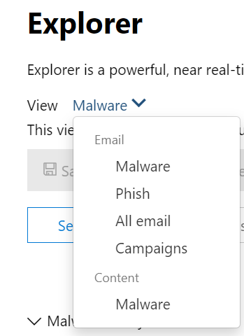

# Búsqueda de amenazas en el Explorador de amenazas para Microsoft Defender para Office 365

En este artículo:

- [Paso a paso del Explorador de amenazas](#threat-explorer-walk-through)
- [Investigación de correo electrónico](#email-investigation)
- [Corrección de correo electrónico](#email-remediation)
- [Mejoras en la experiencia de búsqueda de amenazas](#improvements-to-threat-hunting-experience)

> [!NOTE]
> Esto forma parte de una serie de **3** artículos sobre explorador de amenazas **(Explorer),** seguridad de correo electrónico y **conceptos** básicos de detecciones de Explorador y tiempo real (como diferencias entre las herramientas y los permisos necesarios para operarlas). Los otros dos artículos de esta serie son Seguridad de correo [electrónico con](email-security-in-microsoft-defender.md) el Explorador de amenazas y el Explorador de amenazas y [conceptos](real-time-detections.md)básicos de detecciones en tiempo real .

**Se aplica a**
- [Plan 1 y Plan 2 de Microsoft Defender para Office 365](defender-for-office-365.md)
- [Microsoft 365 Defender](../defender/microsoft-365-defender.md)

Si su organización tiene [Microsoft Defender](defender-for-office-365.md)para Office 365 y tiene los [permisos,](#required-licenses-and-permissions)puede usar detecciones en tiempo **real** o **explorador** para detectar y corregir amenazas.

En el portal Microsoft 365 Defender ( ), vaya a Correo electrónico & colaboración y, a continuación, elija Explorador o <https://security.microsoft.com> **Detecciones en tiempo real**.   Para hacerlo directamente en la página, use <https://security.microsoft.com/threatexplorer> o <https://security.microsoft.com/realtimereports>

Con estas herramientas, puede:

- Ver malware detectado por Microsoft 365 de seguridad
- Ver la dirección URL de suplantación de identidad (phishing) y hacer clic en datos de veredicto
- Iniciar un proceso automatizado de investigación y respuesta desde una vista en el Explorador
- Investigar correo electrónico malintencionado y mucho más

Para obtener más información, vea [Email security with Threat Explorer](email-security-in-microsoft-defender.md).

## Paso a paso del Explorador de amenazas

En Microsoft Defender para Office 365, hay dos planes de suscripción: plan 1 y plan 2. Las herramientas de búsqueda de amenazas operadas manualmente existen en ambos planes, con nombres diferentes y con capacidades diferentes.

Defender for Office 365 Plan 1 usa detecciones en tiempo *real,* que es un subconjunto de la herramienta de búsqueda Explorador de amenazas *(también* denominada *Explorador)* del Plan 2. En esta serie de artículos, la mayoría de los ejemplos se crearon con el Explorador de amenazas completo. Los administradores deben probar los pasos de las detecciones en tiempo real para ver dónde se aplican.

Después de ir al **Explorador**, de forma predeterminada, llegarás  a la página **Malware,** pero usa la lista desplegable Ver para familiarizarte con tus opciones. Si estás buscando phishing o buscando en una campaña de amenazas, elige esas vistas.

> [!div class="mx-imgBorder"]
> 

Una vez que una persona de operaciones de seguridad (Operaciones de sec) selecciona los datos que desea ver, si el  ámbito es una vista estrecha como **envíos** de usuario o una vista más amplia, como Todo el correo **electrónico,** puede usar el botón Remitente para filtrar aún más. Recuerde seleccionar Actualizar para completar las acciones de filtrado.

> [!div class="mx-imgBorder"]
> 

El enfoque de refinamiento en el Explorador o la detección en tiempo real se puede pensar en capas. El primero es **View**. El segundo se puede pensar como un *foco filtrado.* Por ejemplo, puede volver a seguir los pasos que realizó para encontrar una amenaza registrando sus decisiones como esta: Para encontrar el problema en el Explorador, elegí la vista malware con un foco de filtro **de destinatarios**. Esto facilita el retraso de los pasos.

> [!TIP]
> Si Sec Ops usa **etiquetas** para marcar cuentas que consideren destinos de alto valor, pueden realizar selecciones como La vista de suplantación de identidad con un foco de filtro *etiquetas (incluir* un intervalo de fechas si se usa). Esto les mostrará los intentos de suplantación de identidad dirigidos a sus objetivos de usuario de alto valor durante un intervalo de tiempo (como las fechas en las que ciertos ataques de suplantación de identidad están sucediendo mucho para su sector).

Los refinamientos se pueden realizar en intervalos de fechas mediante los controles de intervalo de fechas. Aquí puede ver explorador en la vista **Malware,** con un foco de filtro **de tecnología** de detección. Pero es el botón **Filtro** avanzado el que permite a los equipos de Sec Ops profundizar.

> [!div class="mx-imgBorder"]
> 

Al hacer **clic en** el filtro Avanzado, aparece un panel que permitirá a los cazacarros de Sec Ops crear consultas por sí mismos, lo que les permite incluir o excluir la información que necesitan ver. Tanto el gráfico como la tabla de la página Explorador reflejarán sus resultados.

> [!div class="mx-imgBorder"]
> 

Use el **botón Opciones de** columna para obtener el tipo de información de la tabla que sería más útil:

> [!div class="mx-imgBorder"]
> 

> [!div class="mx-imgBorder"]
> 

En el mismo mien, asegúrate de probar las opciones de visualización. Diferentes audiencias reaccionarán bien a diferentes presentaciones de los mismos datos. Para algunos visores, el mapa **Orígenes** de correo electrónico puede mostrar que una amenaza es generalizada o discreta más rápidamente que la opción Mostrar **campaña** justo al lado. Sec Ops puede hacer uso de estas pantallas para hacer puntos que subrayan la necesidad de seguridad y protección, o para la comparación posterior, para demostrar la eficacia de sus acciones.

> [!div class="mx-imgBorder"]
> 

> [!div class="mx-imgBorder"]
> 

### Investigación de correo electrónico

Cuando vea un correo electrónico sospechoso, haga clic en el nombre para expandir el menú desplegable a la derecha. Aquí, está disponible el banner que permite a las Operaciones de Sec ver la página [de entidad de correo](mdo-email-entity-page.md) electrónico.

La página de entidad de correo electrónico reúne contenidos que se pueden encontrar en **Detalles**, **Datos adjuntos** **,** Dispositivos, pero incluye datos más organizados. Esto incluye aspectos como los resultados de DMARC, la presentación de texto sin formato del encabezado de correo electrónico con una opción de copia, la información de veredicto sobre los datos adjuntos que se detonaron de forma segura y los archivos que se eliminaron (pueden incluir direcciones IP que se han contactado y capturas de pantalla de páginas o archivos). Las direcciones URL y sus veredictos también se enumeran con detalles similares notificados.

Cuando llegue a esta fase, la página de entidad de correo electrónico será fundamental para el paso final:*corrección*.

> [!div class="mx-imgBorder"]
> 

> [!TIP]
> Para obtener más información sobre la página  de entidad de correo electrónico enriquecido (que se ve a continuación en la pestaña Análisis), incluidos los resultados de los datos adjuntos detonados, los resultados de las direcciones URL incluidas y la vista previa de correo electrónico seguro, haga clic [aquí](mdo-email-entity-page.md).

> [!div class="mx-imgBorder"]
> 

### Corrección de correo electrónico

Una vez que una persona de Operaciones de Sec determina que un correo electrónico es una amenaza, el siguiente paso de detección en tiempo real o explorador se ocupa de la amenaza y la corrige. Esto se puede hacer volviendo al Explorador de amenazas, seleccionando la casilla del correo electrónico del problema y usando el **botón** Acciones.

> [!div class="mx-imgBorder"]
> 

Aquí, el analista puede realizar acciones como notificar el correo como correo no deseado, suplantación de identidad o malware, ponerse en contacto con destinatarios o realizar investigaciones adicionales que pueden incluir activar libros de juegos de investigación y respuesta automatizadas (o AIR) (si tienes plan 2). O bien, el correo también puede ser notificado como limpio.

> [!div class="mx-imgBorder"]
> 

## Mejoras en la experiencia de búsqueda de amenazas

### Id. de alerta

Al navegar desde una alerta al Explorador de amenazas, **la vista** se filtrará mediante el identificador **de alerta**. Esto también se aplica en la detección en tiempo real. Se muestran los mensajes relevantes para la alerta específica y un total de correo electrónico (un recuento). Podrás ver si un mensaje formaba parte de una alerta, así como navegar de ese mensaje a la alerta relacionada.

Por último, el identificador de alerta se incluye en la dirección URL, por ejemplo: `https://https://security.microsoft.com/viewalerts`

> [!div class="mx-imgBorder"]
> 

> [!div class="mx-imgBorder"]
> 

### Ampliar el límite de búsqueda y retención de datos del Explorador (y detecciones en tiempo real) para inquilinos de prueba

Como parte de este cambio, los analistas podrán buscar y filtrar datos de correo electrónico durante 30 días (aumentado a partir de siete días) en el Explorador de amenazas y detecciones en tiempo real para los inquilinos de prueba de Defender para Office P1 y P2. Esto no afecta a los inquilinos de producción para clientes de P1 y P2 E5, donde el valor predeterminado de retención ya es de 30 días.

### Límite de exportación actualizado

El número de registros de correos electrónicos que se pueden exportar desde el Explorador de amenazas es ahora de 200 000 (en lugar de 9990). El conjunto de columnas que se pueden exportar no cambia.

### Etiquetas en el Explorador de amenazas

> [!NOTE]
> La característica de etiquetas de usuario está en Versión preliminar y puede que no esté disponible para todos. Además, las vistas previas están sujetas a cambios. Para obtener información acerca de la programación de lanzamiento, consulte el mapa de ruta Microsoft 365 versión.

Las etiquetas de usuario identifican grupos específicos de usuarios en Microsoft Defender para Office 365. Para obtener más información acerca de las etiquetas, incluidas las licencias y la configuración, vea [Etiquetas de usuario](user-tags.md).

En el Explorador de amenazas, puede ver información sobre las etiquetas de usuario en las siguientes experiencias.

#### Vista cuadrícula de correo electrónico

Cuando los analistas miran la columna **Etiquetas** de la cuadrícula de correo electrónico, están viendo todas las etiquetas que se han aplicado a buzones de remitente o destinatario. De forma predeterminada, las etiquetas del sistema como *las cuentas* de prioridad se muestran primero.

> [!div class="mx-imgBorder"]
> 

#### Filtrado

Las etiquetas se pueden usar como filtros. Buscar solo entre cuentas de prioridad o usar escenarios de etiquetas de usuario específicos de esta manera. También puede excluir los resultados que tienen determinadas etiquetas. Combine etiquetas con otros filtros y intervalos de fechas para restringir el ámbito de investigación.

> [!div class="mx-imgBorder"]
> 

#### Flyout de detalles de correo electrónico

Para ver las etiquetas individuales del remitente y el destinatario, seleccione un correo electrónico para abrir el control desplegable de detalles del mensaje. En la **pestaña Resumen,** las etiquetas de remitente y destinatario se muestran por separado. La información sobre las etiquetas individuales del remitente y el destinatario se puede exportar como datos CSV.

> [!div class="mx-imgBorder"]
> 

La información de etiquetas también se muestra en el control desplegable de clics de dirección URL. Para verlo, vaya a la vista Phish o All Email > **url url** **clicks** tab. Seleccione un control desplegable de dirección URL individual para ver detalles adicionales acerca de los clics de esa dirección URL, incluidas las etiquetas asociadas con ese clic.

### Vista de escala de tiempo actualizada

> [!div class="mx-imgBorder"]
> 
>
Obtenga más información con [este vídeo](https://www.youtube.com/watch?v=UoVzN0lYbfY&list=PL3ZTgFEc7LystRja2GnDeUFqk44k7-KXf&index=4).

## Funcionalidades extendidas

### Principales usuarios dirigidos

Las principales familias de malware muestran los principales usuarios **dirigidos** en la sección Malware. Los principales usuarios dirigidos también se extenderán a través de las vistas Phish y All Email. Los analistas podrán ver los cinco primeros usuarios dirigidos, junto con el número de intentos de cada usuario en cada vista.

Las personas de operaciones de seguridad pueden exportar la lista de usuarios dirigidos, hasta un límite de 3.000, junto con el número de intentos realizados, para el análisis sin conexión para cada vista de correo electrónico. Además, al seleccionar el número de intentos (por ejemplo, 13 intentos en la imagen siguiente) se abrirá una vista filtrada en el Explorador de amenazas, para que pueda ver más detalles entre correos electrónicos y amenazas para ese usuario.

> [!div class="mx-imgBorder"]
> 

### Exchange de transporte

El equipo de operaciones de seguridad podrá ver todas las reglas de transporte Exchange (o reglas de flujo de correo) aplicadas a un mensaje, en la vista Cuadrícula de correo electrónico. Seleccione **Opciones de columna** en la cuadrícula **y, a continuación, Exchange regla de transporte en** las opciones de columna. La Exchange reglas de transporte también está visible en el **menú** desplegable Detalles del correo electrónico.

Aparecen nombres y GUID de las reglas de transporte aplicadas al mensaje. Los analistas podrán buscar mensajes mediante el nombre de la regla de transporte. Se trata de una búsqueda CONTAINS, lo que significa que también puede realizar búsquedas parciales.

> [!IMPORTANT]
> Exchange búsqueda de reglas de transporte y disponibilidad de nombres dependen del rol específico que se le asigne. Debe tener uno de los siguientes roles o permisos para ver los nombres de regla de transporte y la búsqueda. Sin embargo, incluso sin los roles o permisos siguientes, un analista puede ver la etiqueta de regla de transporte y la información GUID en los detalles del correo electrónico. No se ven afectadas otras experiencias de visualización de registros en cuadrículas de correo electrónico, control de envío de correo electrónico, filtros y exportación.
>
> - Exchange Online Solo - Prevención de pérdida de datos: Todo
> - Exchange Online Only - O365SupportViewConfig: All
> - Microsoft Azure Active Directory o Exchange Online: Administrador de seguridad: Todo
> - Azure Active Directory o Exchange Online: Lector de seguridad: Todos
> - Exchange Online Solo- Reglas de transporte: Todas
> - Exchange Online Solo - configuración View-Only: todo
>
> Dentro de la cuadrícula de correo electrónico, el control desplegable Detalles y csv exportado, los ETR se presentan con un Nombre/GUID como se muestra a continuación.
>
> > [!div class="mx-imgBorder"]
> > 

### Conectores de entrada

Los conectores son una colección de instrucciones que personalizan cómo fluye el correo electrónico hacia y desde Microsoft 365 o Office 365 organización. Permiten aplicar cualquier restricción o control de seguridad. En el Explorador de amenazas, puede ver los conectores relacionados con un correo electrónico y buscar correos electrónicos con nombres de conector.

La búsqueda de conectores es una consulta CONTAINS, lo que significa que las búsquedas de palabras clave parciales pueden funcionar:

> [!div class="mx-imgBorder"]
> 

## Permisos y licencias necesarios

Debe tener [Microsoft Defender para Office 365](defender-for-office-365.md) usar detecciones en tiempo real o explorador.

- El Explorador se incluye en Defender for Office 365 Plan 2.
- El informe de detecciones en tiempo real se incluye en Defender for Office 365 Plan 1.
- Planee asignar licencias para todos los usuarios que deberán estar protegidos por Defender para Office 365. Las detecciones de explorador y en tiempo real muestran datos de detección para usuarios con licencia.

Para ver y usar detecciones en tiempo real o explorador, debe tener los siguientes permisos:

- Para el portal Microsoft 365 Defender:
  - Administración de la organización
  - Administrador de seguridad (se puede asignar en el centro Azure Active Directory de administración ( <https://aad.portal.azure.com> )
  - Lector de seguridad
- Para Exchange Online:
  - Administración de la organización
  - Administración de la organización de solo visualización
  - Destinatarios con permiso de vista
  - Administración de cumplimiento

Para obtener más información sobre roles y permisos, consulte los siguientes recursos:

- [Permisos en el portal de Microsoft 365 Defender](permissions-microsoft-365-security-center.md)
- [Permisos de características de Exchange Online](/exchange/permissions-exo/feature-permissions)
- [Exchange Online PowerShell](/powershell/exchange/exchange-online-powershell)

## Más información

- [Buscar e investigar el correo electrónico malintencionado que se ha entregado](investigate-malicious-email-that-was-delivered.md)
- [Ver archivos malintencionados detectados en SharePoint Online, OneDrive y Microsoft Teams](mdo-for-spo-odb-and-teams.md)
- [Obtener información general sobre las vistas en el Explorador de amenazas (y detecciones en tiempo real)](threat-explorer-views.md)
- [Informe de estado de protección contra amenazas](view-email-security-reports.md#threat-protection-status-report)
- [Investigación y respuesta automatizada en la Protección contra amenazas de Microsoft](automated-investigation-response-office.md)
- [Investigar correos electrónicos con la página Entidad de correo electrónico](mdo-email-entity-page.md)
