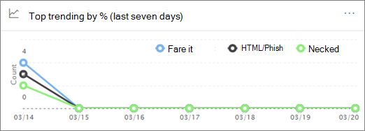
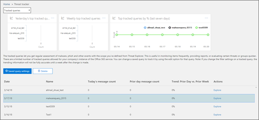
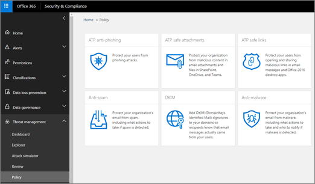

# Rastreadores de amenazas: nuevos y destacablesThreat Trackers - New and Noteworthy

[!INCLUDE [Microsoft 365 Defender rebranding](../includes/microsoft-defender-for-office.md)]

**Se aplica a****Applies to**
- [Plan 2 de Microsoft Defender para Office 365Microsoft Defender for Office 365 plan 2](office-365-atp.md)
- [Microsoft 365 DefenderMicrosoft 365 Defender](../mtp/microsoft-threat-protection.md)

Las capacidades de investigación y respuesta de amenazas de [Office 365](office-365-ti.md) permiten al equipo de seguridad de su organización detectar y tomar medidas contra las amenazas de ciberseguridad.[Office 365 Threat Investigation and Response](office-365-ti.md) capabilities enable your organization's security team to discover and take action against cybersecurity threats. Las funciones de investigación y respuesta de amenazas de Office 365 incluyen características del Rastreador de amenazas, incluidos los rastreadores notables.Office 365 Threat Investigation and Response capabilities include Threat Tracker features, including Noteworthy trackers. Lea este artículo para obtener información general sobre estas nuevas características y los pasos siguientes.Read this article to get an overview of these new features and next steps.

> [!IMPORTANT]
> Inteligencia sobre amenazas de Office 365 ahora es Microsoft Defender para Office 365 Plan 2, junto con capacidades adicionales de protección contra amenazas.Office 365 Threat Intelligence is now Microsoft Defender for Office 365 Plan 2, along with additional threat protection capabilities. Para obtener más información, vea los planes y precios de Microsoft Defender para [Office 365](https://products.office.com/exchange/advance-threat-protection) y la descripción del servicio de [Microsoft Defender para Office 365.](https://docs.microsoft.com/office365/servicedescriptions/office-365-advanced-threat-protection-service-description)To learn more, see [Microsoft Defender for Office 365 plans and pricing](https://products.office.com/exchange/advance-threat-protection) and the [Microsoft Defender for Office 365 Service Description](https://docs.microsoft.com/office365/servicedescriptions/office-365-advanced-threat-protection-service-description).

## ¿Qué son los rastreadores de amenazas?What are Threat Trackers?

Los Rastreadores de amenazas son widgets informativos y vistas que proporcionan inteligencia sobre diferentes problemas de ciberseguridad que pueden afectar a su empresa.Threat Trackers are informative widgets and views that provide you with intelligence on different cybersecurity issues that might impact your company. Por ejemplo, puede ver información sobre las campañas de malware de tendencias con rastreadores de amenazas.For example, you can view information about trending malware campaigns using Threat Trackers.

La mayoría de las páginas de seguimiento incluyen números de tendencias que se actualizan periódicamente, widgets para  ayudarte a comprender qué problemas son los más grandes o han aumentado más, y un vínculo rápido en la columna Acciones que te lleva al Explorador, donde puedes ver información más detallada.Most tracker pages include trending numbers that are updated periodically, widgets to help you understand which issues are the biggest or have grown the most, and a quick link in the **Actions** column that takes you to Explorer, where you can view more detailed information.

Los rastreadores son solo algunas de las muchas características excelentes que obtiene con [Microsoft Defender para Office 365 Plan 2.](office-365-ti.md)Trackers are just a few of the many great features you get with [Microsoft Defender for Office 365 Plan 2](office-365-ti.md). Los rastreadores de amenazas incluyen [rastreadores notables,](#noteworthy-trackers)rastreadores de [tendencias,](#trending-trackers)consultas de seguimiento [y](#tracked-queries) [consultas guardadas.](#saved-queries)Threat Trackers include [Noteworth trackers](#noteworthy-trackers), [Trending trackers](#trending-trackers), [Tracked queries](#tracked-queries), and [Saved queries](#saved-queries).

Para ver y usar los Rastreadores de amenazas de su organización, vaya al Centro de seguridad y cumplimiento de & ( ) y elija El rastreador de amenazas de administración <https://protection.office.com>  \> **de amenazas.**To view and use your Threat Trackers for your organization, go to the Security & Compliance Center (<https://protection.office.com>) and choose **Threat management** \> **Threat tracker**.

> [!NOTE]
> Para usar rastreadores de amenazas, debe ser administrador global, administrador de seguridad o lector de seguridad.To use Threat Trackers, you must be a global administrator, security administrator, or security reader. Vea [Permisos en el Centro de seguridad & cumplimiento.](permissions-in-the-security-and-compliance-center.md)See [Permissions in the Security & Compliance Center](permissions-in-the-security-and-compliance-center.md).

### Rastreadores notablesNoteworthy trackers

Los rastreadores notables son los lugares donde encontrarás amenazas y riesgos grandes y pequeños que creemos que deberías conocer.Noteworthy trackers are where you'll find big and smaller threats and risks that we think you should know about. Los rastreadores notables le ayudan a averiguar si estos problemas existen en su entorno de Microsoft 365, además de vínculos a artículos (como este) que le dan más detalles sobre lo que está sucediendo y cómo afectarán al uso de Office 365 por parte de su organización.Noteworthy trackers help you find whether these issues exist in your Microsoft 365 environment, plus link to articles (like this one) that give you more details on what is happening, and how they'll impact your organization's use of Office 365. Tanto si se trata de una amenaza nueva (por ejemplo, Wannacry, Petya) como de una amenaza existente que puede crear nuevos desafíos (como nuestro otro elemento notable: Nemucod), aquí es donde encontrará nuevos elementos importantes que usted y su equipo de seguridad deben revisar y examinar periódicamente.Whether it's a big new threat (e.g. Wannacry, Petya) or an existing threat that might create some new challenges (like our other inaugural Noteworthy item - Nemucod), this is where you'll find important new items you and your security team should review and examine periodically.

Por lo general, los rastreadores notables se publicarán solo durante un par de semanas cuando identifiquemos nuevas amenazas y creemos que es posible que necesites la visibilidad adicional que proporciona esta característica.Typically Noteworthy trackers will be posted for just a couple of weeks when we identify new threats and think you might need the extra visibility that this feature provides. Una vez que haya pasado el mayor riesgo de una amenaza, quitaremos ese elemento notable.Once the biggest risk for a threat has passed, we'll remove that Noteworthy item. De esta forma, podemos mantener la lista actualizada con otros elementos nuevos relevantes.This way, we can keep the list fresh and up to date with other relevant new items.

### Rastreadores de tendenciasTrending trackers

Los rastreadores de tendencias (anteriormente denominados campañas) resaltan las nuevas amenazas recibidas en el correo electrónico de su organización en la semana pasada.Trending trackers (formerly called Campaigns) highlight new threats received in your organization's email in the past week.

Los rastreadores de tendencias le dan una idea de las nuevas amenazas que debe revisar para asegurarse de que su entorno corporativo más amplio está preparado contra ataques.Trending trackers give you an idea of new threats you should review to ensure your broader corporate environment is prepared against attacks.

### Consultas de seguimientoTracked queries

Las consultas de seguimiento aprovechan las consultas guardadas para evaluar periódicamente la actividad de Microsoft 365 en su organización.Tracked queries leverage your saved queries to periodically assess Microsoft 365 activity in your organization. Esto le ofrece tendencias de eventos, con más información en los próximos meses.This gives you event trending, with more to come in the coming months. Las consultas de seguimiento se ejecutan automáticamente, lo que proporciona información actualizada sin tener que recordar volver a ejecutar las consultas.Tracked queries run automatically, giving you up-to-date information without having to remember to re-run your queries.

### Consultas guardadasSaved queries

Las consultas guardadas también se encuentran en la sección Rastreadores.Saved queries are also found in the Trackers section. Puedes usar consultas guardadas para almacenar las búsquedas comunes del Explorador que quieras volver a rápidas y repetidas veces, sin tener que volver a crear la búsqueda cada vez.You can use Saved queries to store the common Explorer searches that you want to get back to quicker and repeatedly, without having to re-create the search every time.

Siempre puedes guardar una consulta de rastreador notable o cualquiera  de tus propias consultas del Explorador mediante el botón Guardar consulta en la parte superior de la página del Explorador.You can always save a Noteworthy tracker query or any of your own Explorer queries using the **Save query** button at the top of the Explorer page. Cualquier cosa guardada allí aparecerá en la **lista de consultas guardadas** en la página Rastreador.Anything saved there will show up in the **Saved queries** list on the Tracker page.

## Rastreadores y exploradorTrackers and Explorer

Tanto si está revisando el correo electrónico, el contenido o las actividades de Office (próximamente), explorer y rastreadores trabajan juntos para ayudarle a investigar y realizar un seguimiento de los riesgos y amenazas de seguridad.Whether you're reviewing email, content, or Office activities (coming soon), Explorer and Trackers work together to help you investigate and track security risks and threats. En conjunto, los rastreadores le proporcionan información para proteger a los usuarios resaltando los problemas nuevos, notables y que se buscan con frecuencia, lo que garantiza que su empresa esté mejor protegida a medida que se mueve a la nube.All together, Trackers provide you with information to protect your users by highlighting new, notable, and frequently searched issues - ensuring your business is better protected as it moves to the cloud.

Recuerde que siempre puede proporcionarnos comentarios sobre esta u otras características  de seguridad de Microsoft 365 haciendo clic en el botón Comentarios en la esquina inferior derecha de la información general del Centro de seguridad [& cumplimiento.](https://support.microsoft.com/office/a5f2fd18-b029-4257-b5a8-ae83e7768c85)And remember that you can always provide us feedback on this or other Microsoft 365 security features by clicking on the **Feedback** button in the lower right corner of the [Overview of the Security & Compliance Center](https://support.microsoft.com/office/a5f2fd18-b029-4257-b5a8-ae83e7768c85).

## Rastreadores y Microsoft Defender para Office 365Trackers and Microsoft Defender for Office 365

Con nuestra amenaza notable, destacamos las amenazas avanzadas de malware detectadas por [datos adjuntos seguros.](atp-safe-attachments.md)With our inaugural Noteworthy threat, we're highlighting advanced malware threats detected by [Safe Attachments](atp-safe-attachments.md). If you're an Office 365 Enterprise E5 customer and you're not using [Microsoft Defender for Office 365](office-365-atp.md), you should be - it's included in your subscription.If you're an Office 365 Enterprise E5 customer and you're not using [Microsoft Defender for Office 365](office-365-atp.md), you should be - it's included in your subscription. Defender para Office 365 proporciona valor incluso si tiene otras herramientas de seguridad que filtran el flujo de correo electrónico con sus servicios de Office 365.Defender for Office 365 provides value even if you have other security tools filtering email flow with your Office 365 services. Sin embargo, las  características contra correo no deseado y Vínculos seguros funcionan mejor cuando la solución de seguridad de correo electrónico principal es a través de Office 365.However, anti-spam and [Safe Links](atp-safe-links.md) features work best when your main email security solution is through Office 365.

En el mundo actual de amenazas, ejecutar solo exámenes antimalware tradicionales significa que no está suficientemente protegido contra ataques.In today's threat-riddled world, running only traditional anti-malware scans means you are not protected well enough against attacks. Los atacantes más sofisticados de hoy en día usan herramientas habitualmente disponibles para crear ataques nuevos, ofuscados o retrasados que no serán reconocidos por los motores antimalware tradicionales basados en firmas.Today's more sophisticated attackers use commonly available tools to create new, obfuscated, or delayed attacks that won't be recognized by traditional signature-based anti-malware engines. La característica Datos adjuntos seguros toma datos adjuntos de correo electrónico y los detona en un entorno virtual para determinar si son seguros o malintencionados.The Safe Attachments feature takes email attachments and detonates them in a virtual environment to determine whether they're safe or malicious. Este proceso de detonación abre cada archivo en un entorno de equipo virtual y, a continuación, observa lo que sucede después de abrir el archivo.This detonation process opens each file in a virtual computer environment, then watches what happens after the file is opened. Ya sea un archivo PDF y comprimido, o un documento de Office, el código malintencionado puede ocultarse en un archivo, activando solo una vez que la víctima lo abra en su equipo.Whether it's a PDF, and compressed file, or an Office document, malicious code can be hidden in a file, activating only once the victim opens it on their computer. Al detonar y analizar el archivo en el flujo de correo electrónico, las funcionalidades de Defender para Office 365 encuentran estas amenazas en función de comportamientos, reputación del archivo y una serie de reglas heurísticas.By detonating and analyzing the file in the email flow, Defender for Office 365 capabilities finds these threats based on behaviors, file reputation, and a number of heuristic rules.

El nuevo filtro de amenazas destacable resalta los elementos que se detectaron recientemente a través de datos adjuntos seguros.The new Noteworthy threat filter highlights items that were recently detected through Safe Attachments. Estas detecciones representan elementos que son archivos malintencionados nuevos, no encontrados anteriormente por Microsoft 365 en el flujo de correo electrónico o en el correo electrónico de otros clientes.These detections represent items that are new malicious files, not previously found by Microsoft 365 in either your email flow or other customers' email. Preste atención a los elementos del Rastreador de amenazas notable, vea a quién se ha dirigido y revise los detalles de detonación que se muestran en la pestaña Análisis avanzado (que se encuentra haciendo clic en el asunto del correo electrónico en el Explorador).Pay attention to the items in the Noteworthy Threat Tracker, see who was targeted by them, and review the detonation details shown on the Advanced Analysis tab (found by clicking on the subject of the email in Explorer). Ten en cuenta que solo encontrarás esta pestaña en los correos electrónicos detectados por la funcionalidad datos adjuntos seguros: este rastreador notable incluye ese filtro, pero también puedes usar ese filtro para otras búsquedas en el Explorador.Note you'll only find this tab on emails detected by the Safe Attachments capability - this Noteworthy tracker includes that filter, but you can also use that filter for other searches in Explorer.

## Pasos siguientesNext steps

- Si su organización aún no tiene estas capacidades de investigación y respuesta de amenazas de Office 365, consulte ¿Cómo se obtienen las capacidades de investigación y respuesta de amenazas de [Office 365?](office-365-ti.md)If your organization doesn't already have these Office 365 Threat Investigation and Response capabilities, see [How do we get Office 365 Threat Investigation and Response capabilities?](office-365-ti.md).

- Asegúrese de que el equipo de seguridad tiene asignados los roles y permisos correctos.Make sure that your security team has the correct roles and permissions assigned. Debe ser administrador global o tener asignado el rol Administrador de seguridad o Búsqueda y depuración en el Centro de & cumplimiento.You must be a global administrator, or have the Security Administrator or Search and Purge role assigned in the Security & Compliance Center. Vea [Permisos en el Centro de seguridad & cumplimiento.](permissions-in-the-security-and-compliance-center.md)See [Permissions in the Security & Compliance Center](permissions-in-the-security-and-compliance-center.md).

- Observe que los nuevos rastreadores se muestren en su entorno de Microsoft 365.Watch for the new Trackers to show up in your Microsoft 365 environment. Cuando esté disponible, encontrará sus rastreadores [aquí.](https://protection.office.com/)When available, you'll find your Trackers [here](https://protection.office.com/). Vaya a **Rastreadores de** \> **amenazas de administración de amenazas.**Go to **Threat management** \> **Threat trackers**.

- Si aún no lo ha hecho, obtenga más información y configure Microsoft Defender  para [Office 365](office-365-atp.md) para su organización, incluidos vínculos seguros y [datos adjuntos seguros.](atp-safe-attachments.md)If you haven't already done so, learn more about and configure [Microsoft Defender for Office 365](office-365-atp.md) for your organization, including [Safe links](atp-safe-links.md) and [Safe Attachments](atp-safe-attachments.md).
