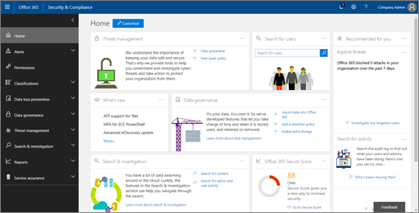

# Rastreadores de amenazas: nuevos y destacables

[!INCLUDE [Microsoft 365 Defender rebranding](../includes/microsoft-defender-for-office.md)]

**Se aplica a**
- [Plan 2 de Microsoft Defender para Office 365](office-365-atp.md)
- [Microsoft 365 Defender](../mtp/microsoft-threat-protection.md)

Las capacidades de investigación y respuesta de amenazas de [Office 365](office-365-ti.md) permiten al equipo de seguridad de su organización detectar y tomar medidas contra las amenazas de ciberseguridad. Las funciones de investigación y respuesta de amenazas de Office 365 incluyen características del rastreador de amenazas, incluidos los rastreadores notables. Lea este artículo para obtener información general sobre estas nuevas características y los pasos siguientes.

> [!IMPORTANT]
> Inteligencia de amenazas de Office 365 ahora es Microsoft Defender para Office 365 Plan 2, junto con capacidades adicionales de protección contra amenazas. Para obtener más información, vea Planes y precios de [Microsoft Defender para Office 365](https://products.office.com/exchange/advance-threat-protection) y Descripción del servicio de Microsoft Defender para Office [365](/office365/servicedescriptions/office-365-advanced-threat-protection-service-description).

## ¿Qué son los rastreadores de amenazas?

Los rastreadores de amenazas son widgets informativos y vistas que le proporcionan inteligencia sobre diferentes problemas de ciberseguridad que pueden afectar a su empresa. Por ejemplo, puedes ver información sobre las campañas de malware de tendencias con rastreadores de amenazas.

La mayoría de las páginas de seguimiento incluyen números de tendencia que se actualizan periódicamente, widgets que  le ayudarán a comprender qué problemas son los más grandes o han aumentado más, y un vínculo rápido en la columna Acciones que le lleva al Explorador, donde puede ver información más detallada.

Los rastreadores son solo algunas de las muchas características excelentes que obtiene con [Microsoft Defender para Office 365 Plan 2](office-365-ti.md). Los rastreadores de amenazas [incluyen rastreadores notables,](#noteworthy-trackers)rastreadores [de tendencias,](#trending-trackers)consultas rastreadas [y](#tracked-queries) [consultas guardadas.](#saved-queries)

Para ver y usar los Rastreadores de amenazas para su organización, vaya al Centro de seguridad y & cumplimiento ( ) y elija Rastreador de amenazas <https://protection.office.com>  \> **de administración de amenazas.**

> [!NOTE]
> Para usar rastreadores de amenazas, debe ser un administrador global, un administrador de seguridad o un lector de seguridad. Vea [Permisos en el Centro de seguridad & cumplimiento](permissions-in-the-security-and-compliance-center.md).

### Rastreadores destacados

Los rastreadores destacados son donde encontrará amenazas y riesgos grandes y pequeños que creemos que debe conocer. Los rastreadores destacados le ayudan a averiguar si estos problemas existen en su entorno de Microsoft 365, además de un vínculo a artículos (como este) que le dan más detalles sobre lo que está sucediendo y cómo afectarán al uso de Office 365 por parte de su organización. Tanto si se trata de una amenaza nueva (por ejemplo, Wannacry, Petya) como de una amenaza existente que podría crear algunos desafíos nuevos (como nuestro otro elemento notable, Nemucod), aquí es donde encontrará nuevos elementos importantes que usted y su equipo de seguridad deben revisar y examinar periódicamente.

Normalmente, los rastreadores destacados se publicarán solo durante un par de semanas cuando identifiquemos nuevas amenazas y pensemos que podrías necesitar la visibilidad adicional que proporciona esta característica. Una vez que haya pasado el mayor riesgo de una amenaza, quitaremos ese elemento notable. De esta forma, podemos mantener la lista actualizada y actualizada con otros elementos nuevos relevantes.

### Rastreadores de tendencias

Los rastreadores de tendencias (anteriormente denominados Campañas) destacan las nuevas amenazas recibidas en el correo electrónico de la organización en la última semana.

Los rastreadores de tendencias te dan una idea de las nuevas amenazas que debes revisar para asegurarte de que tu entorno corporativo más amplio esté preparado contra ataques.

### Consultas de seguimiento

Las consultas de seguimiento aprovechan las consultas guardadas para evaluar periódicamente la actividad de Microsoft 365 en su organización. Esto le ofrece tendencias de eventos, con más que venir en los próximos meses. Las consultas rastreadas se ejecutan automáticamente, lo que le proporciona información actualizada sin tener que recordar volver a ejecutar las consultas.

### Consultas guardadas

Las consultas guardadas también se encuentran en la sección Rastreadores. Puede usar consultas guardadas para almacenar las búsquedas comunes del Explorador a las que desea volver más rápido y repetidamente, sin tener que volver a crear la búsqueda cada vez.

Siempre puede guardar una consulta de rastreador notable o cualquiera  de sus propias consultas del Explorador con el botón Guardar consulta en la parte superior de la página Explorador. Cualquier cosa guardada allí aparecerá en la **lista Consultas guardadas** en la página Rastreador.

## Rastreadores y Explorador

Tanto si está revisando el correo electrónico, el contenido o las actividades de Office (próximamente), Explorer y Trackers trabajan juntos para ayudarle a investigar y realizar un seguimiento de los riesgos y amenazas de seguridad. En conjunto, los rastreadores le proporcionan información para proteger a los usuarios resaltando problemas nuevos, notables y buscados con frecuencia, lo que garantiza que su empresa esté mejor protegida a medida que se mueve a la nube.

Y recuerde que siempre puede proporcionarnos comentarios sobre esta u otras  características de seguridad de Microsoft 365 haciendo clic en el botón Comentarios de la esquina inferior derecha de La información general del Centro de seguridad [y cumplimiento](https://support.microsoft.com/office/a5f2fd18-b029-4257-b5a8-ae83e7768c85)& .

## Rastreadores y Microsoft Defender para Office 365

Con nuestra amenaza notable, destacamos las amenazas de malware avanzadas detectadas por [datos adjuntos seguros.](atp-safe-attachments.md) Si es un cliente de Office 365 Enterprise E5 y no usa [Microsoft Defender para Office 365,](office-365-atp.md)debería estarlo: está incluido en la suscripción. Defender para Office 365 proporciona valor incluso si tiene otras herramientas de seguridad que filtran el flujo de correo electrónico con sus servicios de Office 365. Sin embargo, las  características contra correo no deseado y vínculos seguros funcionan mejor cuando la solución de seguridad de correo electrónico principal es a través de Office 365.

In today's threat-riddled world, running only traditional anti-malware scans means you are not protected well enough against attacks. Los atacantes más sofisticados de hoy en día usan herramientas disponibles habitualmente para crear ataques nuevos, ofuscados o retrasados que no serán reconocidos por los motores antimalware tradicionales basados en firmas. La característica Datos adjuntos seguros toma datos adjuntos de correo electrónico y los detona en un entorno virtual para determinar si son seguros o malintencionados. Este proceso de detonación abre cada archivo en un entorno de equipo virtual y, a continuación, observa lo que sucede después de abrir el archivo. Ya sea un archivo PDF y comprimido, o un documento de Office, el código malintencionado puede ocultarse en un archivo, activando solo una vez que la víctima lo abra en su equipo. Al detonar y analizar el archivo en el flujo de correo electrónico, las capacidades de Defender para Office 365 encuentran estas amenazas en función de comportamientos, reputación de archivos y una serie de reglas heurísticas.

El nuevo filtro de amenazas notables resalta los elementos que se detectaron recientemente a través de datos adjuntos seguros. Estas detecciones representan elementos que son nuevos archivos malintencionados, no encontrados anteriormente por Microsoft 365 en el flujo de correo electrónico o en el correo electrónico de otros clientes. Preste atención a los elementos del Rastreador de amenazas notables, vea quién fue el objetivo de ellos y revise los detalles de detonación que se muestran en la pestaña Análisis avanzado (que se encuentra haciendo clic en el asunto del correo electrónico en el Explorador). Ten en cuenta que solo encontrarás esta pestaña en los correos electrónicos detectados por la funcionalidad Datos adjuntos seguros: este rastreador notable incluye ese filtro, pero también puedes usar ese filtro para otras búsquedas en el Explorador.

## Pasos siguientes

- Si su organización aún no tiene estas capacidades de investigación y respuesta de amenazas de Office 365, vea [How do we get Office 365 Threat Investigation and Response capabilities?](office-365-ti.md).

- Asegúrese de que el equipo de seguridad tenga asignados los roles y permisos correctos. Debe ser un administrador global o tener asignado el rol Administrador de seguridad o Buscar y purgar en el Centro de seguridad & cumplimiento. Vea [Permisos en el Centro de seguridad & cumplimiento](permissions-in-the-security-and-compliance-center.md).

- Busca que los nuevos rastreadores se muestren en el entorno de Microsoft 365. Cuando esté disponible, encontrará los rastreadores [aquí](https://protection.office.com/). Vaya a **Administración de amenazas** \> **Rastreadores de amenazas**.

- Si aún no lo ha hecho, obtenga más información y configure [Microsoft Defender para Office 365](office-365-atp.md) para su organización, [incluidos](atp-safe-links.md) vínculos seguros y [datos adjuntos seguros.](atp-safe-attachments.md)