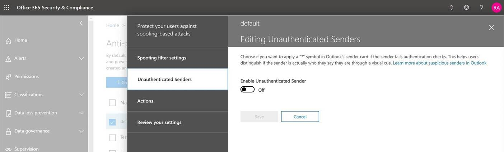

# Remitente no verificadoUnverified Sender

> [!NOTE]
> Estas actualizaciones se están implementando ahora y es posible que no estén disponibles para todos los usuarios.These updates are rolling out now, and might not be available yet for all users. Esta característica es compatible con los usuarios de Enterprise outlook.com.This feature is supported for Enterprise outlook.com users. Actualmente no está disponible para el consumidor outlook.com.It is not currently available for consumer outlook.com.

Para evitar que los mensajes de suplantación de identidad lleguen a su buzón, Outlook.com y Outlook en la web Compruebe que el remitente es quien dice ser y marcar los mensajes sospechosos como correo no deseado.To prevent phishing messages from reaching your mailbox, Outlook.com and Outlook on the web verify that the sender is who they say they are and mark suspicious messages as junk email.

> [!IMPORTANT]
> Cuando un mensaje se marca como una estafa de suplantación de identidad (phishing), Outlook.com y Outlook en la web muestran una advertencia en la parte superior de la página, pero los vínculos del mensaje todavía se pueden abrir.When a message is marked as a phishing scam, Outlook.com and Outlook on the web display a warning at the top of the page, but any links in the message can still be opened.

## ¿Cómo puedo identificar un mensaje sospechoso en mi bandeja de entrada?How can I identify a suspicious message in my inbox?

Outlook.com y Outlook en la web muestran indicadores cuando no se puede identificar el remitente de un mensaje o su identidad es diferente de la que se ve en la dirección de remitente.Outlook.com and Outlook on the web show indicators when the sender of a message either can't be identified or their identity is different from what you see in the From address.

## Ve un '? ' en la imagen del remitenteYou see a '?' in the sender image

Cuando Outlook.com y Outlook en la web no pueden comprobar la identidad del remitente mediante técnicas de autenticación de correo electrónico, muestran un '? ' en la foto del remitente.When Outlook.com and Outlook on the web can't verify the identity of the sender using email authentication techniques, they display a '?' in the sender photo.

No todos los mensajes que no se autentican son malintencionados.Not every message that fails to authenticate is malicious. Sin embargo, debe tener cuidado al interactuar con los mensajes que no se autentican si no reconoce al remitente.However, you should be careful about interacting with messages that don't authenticate if you don't recognize the sender. O bien, si reconoce a un remitente que normalmente no tiene un '? ' en la imagen del remitente, pero, de repente, lo empieza a ver, es posible que se trate de una firma en la que se está suplantando el remitente.Or, if you recognize a sender that normally doesn't have a '?' in the sender image, but you suddenly start seeing it, that could be a sign the sender is being spoofed.

## Cómo administrar qué mensajes reciben el tratamiento de remitentes no comprobadosHow to manage which messages receive the unverified sender treatment 

Si es un cliente de Office 365, puede administrar esta característica a través del centro de seguridad & cumplimiento de Office 365.If you are an Office 365 customer you can manage this feature through the Office 365 Security & Compliance Center.

- En el centro de seguridad & cumplimiento, los administradores globales o de seguridad pueden activar o desactivar la característica mediante protección contra la suplantación de identidad (phishing) en la Directiva ANTIPHISH.In the Security & Compliance Center, global or security administrators can turn the feature on or off, through anti-spoofing protection under the Anti-Phish policy. Además, puede usar el cmdlet **set-AntiPhishPolicy** en Exchange Online PowerShell.Additionally, you can use the **Set-AntiPhishPolicy** cmdlet in Exchange Online PowerShell. Para obtener más información, consulte [protección contra la suplantación de identidad en Office 365](anti-phishing-protection.md) y [set-AntiPhishPolicy](https://docs.microsoft.com/powershell/module/exchange/advanced-threat-protection/set-antiphishpolicy).For details, see [Anti-phishing protection in Office 365](anti-phishing-protection.md) and [Set-AntiPhishPolicy](https://docs.microsoft.com/powershell/module/exchange/advanced-threat-protection/set-antiphishpolicy).

    

- Si un administrador ha identificado un falso positivo y un remitente no debe recibir el tratamiento de remitente no verificado, se puede llevar a cabo una de las siguientes acciones para agregar el remitente a la lista de permitidos de falsificación de inteligencia de identidad:If an admin has identified a false positive, and a sender should not be receiving the unverified sender treatment, one of the following actions can be taken to add the sender to the Spoof Intelligence spoof allow list:

  - Agregue el par de dominios mediante el conocimiento de inteligencia de ti falso.Add the domain pair through the Spoof Intelligence Insight. Para obtener más información, vea [Tutorial: suplantar la información sobre inteligencia empresarial](walkthrough-spoof-intelligence-insight.md).For details, see [Walkthrough: spoof intelligence insight](walkthrough-spoof-intelligence-insight.md).

  - Agregue el par de dominios mediante el cmdlet **set-PhishFilterPolicy** en Exchange Online PowerShell.Add the domain pair through the **Set-PhishFilterPolicy** cmdlet in Exchange Online PowerShell. Para obtener más información, consulte [set-PhishFilterPolicy](https://docs.microsoft.com/powershell/module/exchange/advanced-threat-protection/set-phishfilterpolicy) y [set up Office 365 ATP anti-phishing and anti-phishing Policies](set-up-anti-phishing-policies.md).For details, see [Set-PhishFilterPolicy](https://docs.microsoft.com/powershell/module/exchange/advanced-threat-protection/set-phishfilterpolicy) and [Set up Office 365 ATP anti-phishing and anti-phishing policies](set-up-anti-phishing-policies.md).

Además, no se aplica el tratamiento de remitente no verificado si el mensaje se entregó a la bandeja de entrada a través de reglas de flujo de correo (también denominadas reglas de transporte), lista de dominios seguros (Directiva contra correo no deseado) o lista de remitentes seguros.Additionally, we don't apply the unverified sender treatment if the message was delivered to the Inbox via mail flow rules (also known as transport rules), Safe Domain List (Anti-Spam Policy), or Safe Sender List.

## Preguntas más frecuentesFrequently asked questions

### ¿Qué criterios usa Outlook.com y Outlook en la web para agregar las propiedades "?" y "Via"?What criteria does Outlook.com and Outlook on the web use to add the '?' and the 'via' properties?

Para el '? ' en la imagen del remitente: Outlook.com requiere que el mensaje pase la autenticación de SPF o DKIM y reciba una transferencia de dMarc o un paso de autenticación compuesto de la inteligencia de Office 365 suplantación de identidad.For the '?' in the sender image:  Outlook.com requires that the message pass either SPF or DKIM authentication and receive either a dmarc pass, or a composite authentication pass from Office 365 Spoof Intelligence. Para obtener más información, consulte [configurar SPF en Office 365 para evitar la suplantación de identidad (spoofing](set-up-spf-in-office-365-to-help-prevent-spoofing.md) ) y el [uso de DKIM para validar el correo electrónico saliente enviado desde su dominio personalizado en Office 365](use-dkim-to-validate-outbound-email.md).For details, see [Set up SPF in Office 365 to help prevent spoofing](set-up-spf-in-office-365-to-help-prevent-spoofing.md) and [Use DKIM to validate outbound email sent from your custom domain in Office 365](use-dkim-to-validate-outbound-email.md).

Para la etiqueta Via: Si el dominio de la dirección de es diferente del dominio de la firma DKIM o del correo SMTP de, Outlook.com muestra el dominio en uno de estos dos campos (prefiriendo la firma DKIM).For the via tag: If the domain in the From address is different from the domain in the DKIM signature or the SMTP MAIL FROM, Outlook.com displays the domain in one of those two fields (preferring the DKIM signature).

### ¿Cómo quito el "?"How do I remove the '?'

Para el '? ' en la imagen del remitente: como remitente, debe autenticar el mensaje con SPF o DKIM.For the '?' in the sender image: As a sender, you should authenticate your message with either SPF or DKIM.

Para la etiqueta Via: como remitente, debe asegurarse de que el dominio de la firma DKIM o el correo SMTP de sea el mismo que o sea un subdominio de, el dominio de la dirección de remitente.For the via tag: As a sender, you should ensure that either the domain in the DKIM signature or the SMTP MAIL FROM is the same as, or is a subdomain of, the domain in the From address.

### ¿Outlook.com y Outlook en la web muestran esto por cada mensaje que no supera la autenticación?Does Outlook.com and Outlook on the web show this for every message that doesn't pass authentication?

No necesariamente.Not necessarily. Outlook.com y Outlook en la web pueden tener otras propiedades dentro del mensaje para autenticar al remitente.Outlook.com and Outlook on the web may have other properties within the message to authenticate the sender.

## Temas relacionadosRelated topics

[Ayuda para proteger su cuenta de correo electrónico de Outlook.comHelp protect your Outlook.com email account](https://support.office.com/article/a4f20fc5-4307-4ece-8231-6d4d4bd8a9ba)

[Trabajar con suplantación de identidad (phishing) en Outlook.comDeal with phishing or spoofing in Outlook.com](https://support.office.com/article/0d882ea5-eedc-4bed-aebc-079ffa1105a3)

[Filtrar correo no deseado y correo no deseado en Outlook en la webFilter junk email and spam in Outlook on the web](https://support.office.com/article/db786e79-54e2-40cc-904f-d89d57b7f41d)
