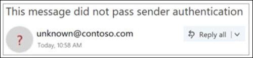

# Remitente no verificado

> [!NOTE]
> Estas actualizaciones se están implementando ahora y es posible que no estén disponibles para todos los usuarios. Esta característica es compatible con los usuarios de Outlook.com y de escritorio de Outlook de empresa de Enterprise. Actualmente no está disponible para usuarios de Office 365 de consumo.

Para evitar que los mensajes de suplantación de identidad lleguen a su buzón, Office 365 comprueba que los remitentes son quienes dicen que son y marcan los mensajes sospechosos como correo no deseado.

> [!IMPORTANT]
> Cuando un mensaje se marca como una estafa de suplantación de identidad, Outlook muestra una advertencia en la parte superior de la página, pero los vínculos del mensaje todavía se pueden abrir.

## ¿Cómo puedo identificar un mensaje sospechoso en mi bandeja de entrada?

Outlook muestra indicadores cuando no se puede identificar el remitente de un mensaje o su identidad es diferente de la que se ve en la dirección from.

## Ve un '? ' en la imagen del remitente

Cuando Office 365 no puede comprobar la identidad del remitente mediante técnicas de autenticación de correo electrónico, se muestra un '? ' en la imagen del remitente.

No todos los mensajes que no se autentican son malintencionados. Sin embargo, debe tener cuidado al interactuar con los mensajes que no se autentican si no reconoce al remitente. O bien, si reconoce a un remitente que normalmente no tiene un '? ' en la imagen del remitente, pero, de repente, lo empieza a ver, es posible que se trate de una firma en la que se está suplantando el remitente.

## Cómo administrar qué mensajes reciben el tratamiento de remitentes no comprobados 

Si es un cliente de Office 365, puede administrar esta característica a través del centro de seguridad & cumplimiento de Office 365.

- En el centro de seguridad & cumplimiento, los administradores globales o de seguridad pueden activar o desactivar la característica mediante protección contra la suplantación de identidad (phishing) en la Directiva ANTIPHISH. Además, puede usar el cmdlet **set-AntiPhishPolicy** en Exchange Online PowerShell. Para obtener más información, consulte [protección contra la suplantación de identidad en Office 365](anti-phishing-protection.md) y [set-AntiPhishPolicy](https://docs.microsoft.com/powershell/module/exchange/set-antiphishpolicy).

    

- Si un administrador ha identificado un falso positivo y un remitente no debe recibir el tratamiento de remitente no verificado, se puede llevar a cabo una de las siguientes acciones para agregar el remitente a la lista de permitidos de falsificación de inteligencia de identidad:

  - Agregue el par de dominios mediante el conocimiento de inteligencia de ti falso. Para obtener más información, vea [Tutorial: suplantar la información sobre inteligencia empresarial](walkthrough-spoof-intelligence-insight.md).

  - Agregue el par de dominios mediante el cmdlet **set-PhishFilterPolicy** en Exchange Online PowerShell. Para obtener más información, consulte [set-PhishFilterPolicy](https://docs.microsoft.com/powershell/module/exchange/set-phishfilterpolicy) y [set up Office 365 ATP anti-phishing and anti-phishing Policies](set-up-anti-phishing-policies.md).

Además, no se aplica el tratamiento de remitente no verificado si el mensaje se entregó a la bandeja de entrada a través de reglas de flujo de correo (también conocidas como reglas de transporte) o la lista de dominios seguros (directivas contra correo no deseado).

## Cómo administrar la etiqueta "mediante" 

Si es un cliente de Office 365, puede administrar esta característica a través del centro de seguridad & cumplimiento de Office 365, del mismo modo que administra el tratamiento de remitentes no comprobados. Si agrega el remitente a la lista de permitidos de imitación de inteligencia empresarial, no se aplicará el tratamiento "Via".

## Preguntas más frecuentes

### ¿Qué criterios Outlook.com y Outlook Win32 Desktop usan para agregar las propiedades "?" y "Via"?

Para el '? ' en la imagen del remitente: Outlook.com requiere que el mensaje pase la autenticación de SPF o DKIM y reciba una transferencia de dMarc o un paso de autenticación compuesto de la inteligencia de Office 365 suplantación de identidad. Para obtener más información, consulte [configurar SPF en Office 365 para evitar la suplantación de identidad (spoofing](set-up-spf-in-office-365-to-help-prevent-spoofing.md) ) y el [uso de DKIM para validar el correo electrónico saliente enviado desde su dominio personalizado en Office 365](use-dkim-to-validate-outbound-email.md).

Para la etiqueta Via: Si el dominio de la dirección de es diferente del dominio de la firma DKIM o del correo SMTP de, Outlook.com muestra el dominio en uno de estos dos campos (prefiriendo la firma DKIM).

### ¿Cómo quito el '? ' sin usar la lista de permitidos de simulación de simulación de falsificación?

Para el '? ' en la imagen del remitente: como remitente, debe autenticar el mensaje con SPF o DKIM.

Para la etiqueta Via: como remitente, debe asegurarse de que el dominio de la firma DKIM o el correo SMTP de sea el mismo que o sea un subdominio de, el dominio de la dirección de remitente.

### ¿Outlook.com y Outlook Win32 de escritorio muestran esto para cada mensaje que no supera la autenticación?

No necesariamente. Office 365 puede tener otras propiedades dentro del mensaje para autenticar al remitente.

## Temas relacionados

[Ayuda para proteger su cuenta de correo electrónico de Outlook.com](https://support.microsoft.com/office/a4f20fc5-4307-4ece-8231-6d4d4bd8a9ba)

[Cómo tratar la suplantación de identidad (phishing) en Outlook.com](https://support.microsoft.com/office/0d882ea5-eedc-4bed-aebc-079ffa1105a3)

[Filtrar correo no deseado y correo no deseado en Outlook en la web](https://support.microsoft.com/office/db786e79-54e2-40cc-904f-d89d57b7f41d)
