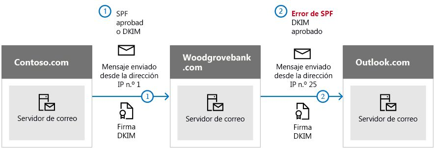

# <a name="use-dkim-to-validate-outbound-email-sent-from-your-custom-domain"></a><span data-ttu-id="b7ac5-103">Usar DKIM para validar el correo electrónico saliente enviado desde su dominio personalizado</span><span class="sxs-lookup"><span data-stu-id="b7ac5-103">Use DKIM to validate outbound email sent from your custom domain</span></span>

[!INCLUDE [Microsoft 365 Defender rebranding](../includes/microsoft-defender-for-office.md)]


 <span data-ttu-id="b7ac5-104">**Resumen**: Este artículo describe cómo usa DomainKeys Identified Mail (DKIM) con Microsoft 365 para asegurarse de que los sistemas de correo electrónico de destino confían en los mensajes enviados desde su dominio personalizado.</span><span class="sxs-lookup"><span data-stu-id="b7ac5-104">**Summary:** This article describes how you use DomainKeys Identified Mail (DKIM) with Microsoft 365 to ensure that destination email systems trust messages sent outbound from your custom domain.</span></span>

<span data-ttu-id="b7ac5-105">Debería usar DKIM además de SPF y DMARC para ayudarle a evitar que los suplantadores de identidad envíen mensajes que parece que provienen de su dominio.</span><span class="sxs-lookup"><span data-stu-id="b7ac5-105">You should use DKIM in addition to SPF and DMARC to help prevent spoofers from sending messages that look like they are coming from your domain.</span></span> <span data-ttu-id="b7ac5-106">DKIM le permite agregar una firma digital a los mensajes de correo electrónico salientes en el encabezado del mensaje.</span><span class="sxs-lookup"><span data-stu-id="b7ac5-106">DKIM lets you add a digital signature to outbound email messages in the message header.</span></span> <span data-ttu-id="b7ac5-107">Puede sonar complicado, pero realmente no lo es.</span><span class="sxs-lookup"><span data-stu-id="b7ac5-107">It may sound complicated, but it's really not.</span></span> <span data-ttu-id="b7ac5-108">Cuando configura DKIM, autoriza su dominio para asociar, o firmar, su nombre a un mensaje de correo electrónico mediante la autenticación criptográfica.</span><span class="sxs-lookup"><span data-stu-id="b7ac5-108">When you configure DKIM, you authorize your domain to associate, or sign, its name to an email message by using cryptographic authentication.</span></span> <span data-ttu-id="b7ac5-109">Los sistemas de correo electrónico que reciben correo electrónico desde el dominio pueden usar esta firma digital para ayudarles a determinar si el correo entrante que reciben es legítimo.</span><span class="sxs-lookup"><span data-stu-id="b7ac5-109">Email systems that receive email from your domain can use this digital signature to help determine if incoming email that they receive is legitimate.</span></span>

<span data-ttu-id="b7ac5-110">Básicamente, usa una clave privada para cifrar el encabezado del correo electrónico saliente del dominio.</span><span class="sxs-lookup"><span data-stu-id="b7ac5-110">Basically, you use a private key to encrypt the header in your domain's outgoing email.</span></span> <span data-ttu-id="b7ac5-111">Publica una clave pública en los registros DNS del dominio que los servidores de recepción pueden usar para descodificar la firma.</span><span class="sxs-lookup"><span data-stu-id="b7ac5-111">You publish a public key to your domain's DNS records that receiving servers can then use to decode the signature.</span></span> <span data-ttu-id="b7ac5-112">Usan la clave pública para comprobar que los mensajes proceden realmente de usted y no de alguien que está *suplantando la identidad* del dominio.</span><span class="sxs-lookup"><span data-stu-id="b7ac5-112">They use the public key to verify that the messages are really coming from you and not coming from someone *spoofing* your domain.</span></span>

<span data-ttu-id="b7ac5-113">Microsoft 365 configura automáticamente DKIM para sus dominios "onmicrosoft.com" iniciales.</span><span class="sxs-lookup"><span data-stu-id="b7ac5-113">Microsoft 365 automatically sets up DKIM for its initial 'onmicrosoft.com' domains.</span></span> <span data-ttu-id="b7ac5-114">Lo que significa que no es necesario realizar ninguna acción para configurar DKIM para un nombre de dominio inicial (por ejemplo, litware.onmicrosoft.com).</span><span class="sxs-lookup"><span data-stu-id="b7ac5-114">That means you don't need to do anything to set up DKIM for any initial domain names (for example, litware.onmicrosoft.com).</span></span> <span data-ttu-id="b7ac5-115">Para más información sobre los dominios, vea [Preguntas más frecuentes de dominios](https://docs.microsoft.com/microsoft-365/admin/setup/domains-faq#why-do-i-have-an-onmicrosoftcom-domain).</span><span class="sxs-lookup"><span data-stu-id="b7ac5-115">For more information about domains, see [Domains FAQ](https://docs.microsoft.com/microsoft-365/admin/setup/domains-faq#why-do-i-have-an-onmicrosoftcom-domain).</span></span>

<span data-ttu-id="b7ac5-116">También puede elegir no hacer nada acerca de DKIM para su dominio personalizado.</span><span class="sxs-lookup"><span data-stu-id="b7ac5-116">You can choose to do nothing about DKIM for your custom domain too.</span></span> <span data-ttu-id="b7ac5-117">Si usted no configura DKIM para su dominio personalizado, Microsoft 365 crea un par de claves privadas y públicas, que permiten que DKIM firme y configure la directiva predeterminada de Microsoft 365 para su dominio personalizado.</span><span class="sxs-lookup"><span data-stu-id="b7ac5-117">If you don't set up DKIM for your custom domain, Microsoft 365 creates a private and public key pair, enables DKIM signing, and then configures the Microsoft 365 default policy for your custom domain.</span></span> <span data-ttu-id="b7ac5-118">Aunque esto suponga una cobertura suficiente para la mayoría de los clientes, debería configurar manualmente DKIM para su dominio personalizado en las siguientes circunstancias:</span><span class="sxs-lookup"><span data-stu-id="b7ac5-118">While this is sufficient coverage for most customers, you should manually configure DKIM for your custom domain in the following circumstances:</span></span>

- <span data-ttu-id="b7ac5-119">Tiene más de un dominio personalizado en Microsoft 365</span><span class="sxs-lookup"><span data-stu-id="b7ac5-119">You have more than one custom domain in Microsoft 365</span></span>

- <span data-ttu-id="b7ac5-120">También va a configurar DMARC (recomendado)</span><span class="sxs-lookup"><span data-stu-id="b7ac5-120">You're going to set up DMARC too (recommended)</span></span>

- <span data-ttu-id="b7ac5-121">Quiere tener el control sobre la clave privada</span><span class="sxs-lookup"><span data-stu-id="b7ac5-121">You want control over your private key</span></span>

- <span data-ttu-id="b7ac5-122">Quiere personalizar los registros CNAME</span><span class="sxs-lookup"><span data-stu-id="b7ac5-122">You want to customize your CNAME records</span></span>

- <span data-ttu-id="b7ac5-123">Quiere configurar claves de DKIM para los correos electrónicos que se originen en un dominio de terceros, por ejemplo, si usa un troyano de envío masivo de correo electrónico de terceros.</span><span class="sxs-lookup"><span data-stu-id="b7ac5-123">You want to set up DKIM keys for email originating out of a third-party domain, for example, if you use a third-party bulk mailer.</span></span>

<span data-ttu-id="b7ac5-124">En este artículo:</span><span class="sxs-lookup"><span data-stu-id="b7ac5-124">In this article:</span></span>

- [<span data-ttu-id="b7ac5-125">Cómo DKIM funciona mejor que SPF solo para evitar la suplantación de identidad malintencionada</span><span class="sxs-lookup"><span data-stu-id="b7ac5-125">How DKIM works better than SPF alone to prevent malicious spoofing</span></span>](use-dkim-to-validate-outbound-email.md#HowDKIMWorks)

- [<span data-ttu-id="b7ac5-126">Actualizar manualmente las claves de 1024 bits a claves de cifrado DKIM de 2048 bits</span><span class="sxs-lookup"><span data-stu-id="b7ac5-126">Manually upgrade your 1024-bit keys to 2048-bit DKIM encryption keys</span></span>](use-dkim-to-validate-outbound-email.md#1024to2048DKIM)

- [<span data-ttu-id="b7ac5-127">Pasos que necesita seguir para configurar manualmente DKIM</span><span class="sxs-lookup"><span data-stu-id="b7ac5-127">Steps you need to do to manually set up DKIM</span></span>](use-dkim-to-validate-outbound-email.md#SetUpDKIMO365)

- [<span data-ttu-id="b7ac5-128">Configurar DKIM para más de un dominio personalizado</span><span class="sxs-lookup"><span data-stu-id="b7ac5-128">To configure DKIM for more than one custom domain</span></span>](use-dkim-to-validate-outbound-email.md#DKIMMultiDomain)

- [<span data-ttu-id="b7ac5-129">Deshabilitar la directiva de firmas DKIM para un dominio personalizado</span><span class="sxs-lookup"><span data-stu-id="b7ac5-129">Disabling the DKIM signing policy for a custom domain</span></span>](use-dkim-to-validate-outbound-email.md#DisableDKIMSigningPolicy)

- [<span data-ttu-id="b7ac5-130">Comportamiento predeterminado para DKIM y Microsoft 365</span><span class="sxs-lookup"><span data-stu-id="b7ac5-130">Default behavior for DKIM and Microsoft 365</span></span>](use-dkim-to-validate-outbound-email.md#DefaultDKIMbehavior)

- [<span data-ttu-id="b7ac5-131">Configurar DKIM para que un servicio de terceros pueda enviar, o suplantar, correo electrónico en nombre de su dominio personalizado</span><span class="sxs-lookup"><span data-stu-id="b7ac5-131">Set up DKIM so that a third-party service can send, or spoof, email on behalf of your custom domain</span></span>](use-dkim-to-validate-outbound-email.md#SetUp3rdPartyspoof)

- [<span data-ttu-id="b7ac5-132">Pasos siguientes: una vez configurado DKIM para Microsoft 365</span><span class="sxs-lookup"><span data-stu-id="b7ac5-132">Next steps: After you set up DKIM for Microsoft 365</span></span>](use-dkim-to-validate-outbound-email.md#DKIMNextSteps)

## <a name="how-dkim-works-better-than-spf-alone-to-prevent-malicious-spoofing"></a><span data-ttu-id="b7ac5-133">Cómo DKIM funciona mejor que SPF solo para evitar la suplantación de identidad malintencionada</span><span class="sxs-lookup"><span data-stu-id="b7ac5-133">How DKIM works better than SPF alone to prevent malicious spoofing</span></span>
<span data-ttu-id="b7ac5-134"><a name="HowDKIMWorks"> </a></span><span class="sxs-lookup"><span data-stu-id="b7ac5-134"><a name="HowDKIMWorks"> </a></span></span>

<span data-ttu-id="b7ac5-p105">SPF agrega información a un sobre del mensaje pero DKIM cifra realmente una firma dentro del encabezado del mensaje. Cuando reenvía un mensaje, el servidor de reenvío puede quitar partes de ese sobre del mensaje. Como la firma digital permanece en el mensaje de correo electrónico porque forma parte del encabezado del correo, DKIM funciona incluso cuando un mensaje se ha reenviado como se muestra en el siguiente ejemplo.</span><span class="sxs-lookup"><span data-stu-id="b7ac5-p105">SPF adds information to a message envelope but DKIM actually encrypts a signature within the message header. When you forward a message, portions of that message's envelope can be stripped away by the forwarding server. Since the digital signature stays with the email message because it's part of the email header, DKIM works even when a message has been forwarded as shown in the following example.</span></span>



<span data-ttu-id="b7ac5-p106">En este ejemplo, si solo había publicado un registro TXT de SPF en su dominio, el servidor de correo del destinatario podría haber marcado el correo electrónico como correo no deseado y generar un resultado de falso positivo. La adición de DKIM en este escenario reduce los informes de correo no deseado de falso positivo. Debido a que DKIM se basa en la criptografía de clave pública para autenticar y no solo en las direcciones IP, DKIM se considera una forma mucho más segura de autenticación que SPF. Se recomienda usar SPF y DKIM, así como DMARC, en la implementación.</span><span class="sxs-lookup"><span data-stu-id="b7ac5-p106">In this example, if you had only published an SPF TXT record for your domain, the recipient's mail server could have marked your email as spam and generated a false positive result. The addition of DKIM in this scenario reduces false positive spam reporting. Because DKIM relies on public key cryptography to authenticate and not just IP addresses, DKIM is considered a much stronger form of authentication than SPF. We recommend using both SPF and DKIM, as well as DMARC in your deployment.</span></span>

<span data-ttu-id="b7ac5-p107">Información esencial: DKIM usa una clave privada para insertar una firma cifrada en los encabezados del mensaje. El dominio de firma, o el dominio saliente, se inserta como el valor del campo **d=** en el encabezado. El dominio de comprobación, o dominio del destinatario, usa entonces el campo **=d** para buscar la clave pública desde DNS y autenticar el mensaje. Si el mensaje se comprueba, supera la comprobación DKIM.</span><span class="sxs-lookup"><span data-stu-id="b7ac5-p107">The nitty gritty: DKIM uses a private key to insert an encrypted signature into the message headers. The signing domain, or outbound domain, is inserted as the value of the **d=** field in the header. The verifying domain, or recipient's domain, then use the **d=** field to look up the public key from DNS and authenticate the message. If the message is verified, the DKIM check passes.</span></span>

## <a name="manually-upgrade-your-1024-bit-keys-to-2048-bit-dkim-encryption-keys"></a><span data-ttu-id="b7ac5-147">Actualizar manualmente las claves de 1024 bits a claves de cifrado DKIM de 2048 bits</span><span class="sxs-lookup"><span data-stu-id="b7ac5-147">Manually upgrade your 1024-bit keys to 2048-bit DKIM encryption keys</span></span>
<span data-ttu-id="b7ac5-148"><a name="1024to2048DKIM"> </a></span><span class="sxs-lookup"><span data-stu-id="b7ac5-148"><a name="1024to2048DKIM"> </a></span></span>

<span data-ttu-id="b7ac5-149">Ya que ambos valores de bits, 1024 y 2048, son compatibles con las claves DKIM, estas instrucciones le indicarán cómo actualizar la clave de 1024 bits a 2048.</span><span class="sxs-lookup"><span data-stu-id="b7ac5-149">Since both 1024 and 2048 bitness are supported for DKIM keys, these directions will tell you how to upgrade your 1024-bit key to 2048.</span></span> <span data-ttu-id="b7ac5-150">Los pasos que se muestran a continuación son dos casos de uso distintos, elija el que mejor se ajuste a su configuración.</span><span class="sxs-lookup"><span data-stu-id="b7ac5-150">The steps below are for two use-cases, please choose the one that best fits your configuration.</span></span>

1. <span data-ttu-id="b7ac5-151">Cuando **ya tiene configuradas las DKIM**, cambie el valor de los bits de la siguiente manera:</span><span class="sxs-lookup"><span data-stu-id="b7ac5-151">When you **already have DKIM configured**, you rotate bitness as follows:</span></span>

   1. <span data-ttu-id="b7ac5-152">[Conéctese con las cargas de trabajo de Office 365 a través de PowerShell](https://docs.microsoft.com/microsoft-365/enterprise/connect-to-all-microsoft-365-services-in-a-single-windows-powershell-window).</span><span class="sxs-lookup"><span data-stu-id="b7ac5-152">[Connect to Office 365 workloads via PowerShell](https://docs.microsoft.com/microsoft-365/enterprise/connect-to-all-microsoft-365-services-in-a-single-windows-powershell-window).</span></span> <span data-ttu-id="b7ac5-153">(El cmdlet viene de Exchange Online).</span><span class="sxs-lookup"><span data-stu-id="b7ac5-153">(The cmdlet comes from Exchange Online.)</span></span>
   1. <span data-ttu-id="b7ac5-154">Ejecute el siguiente comando:</span><span class="sxs-lookup"><span data-stu-id="b7ac5-154">Run the following command:</span></span>

      ```powershell 
      Rotate-DkimSigningConfig -KeySize 2048 -Identity {Guid of the existing Signing Config}
      ```

1. <span data-ttu-id="b7ac5-155">O para una **nueva implementación de DKIM**:</span><span class="sxs-lookup"><span data-stu-id="b7ac5-155">Or for a **new implementation of DKIM**:</span></span>

   1. <span data-ttu-id="b7ac5-156">[Conéctese con las cargas de trabajo de Office 365 a través de PowerShell](https://docs.microsoft.com/microsoft-365/enterprise/connect-to-all-microsoft-365-services-in-a-single-windows-powershell-window).</span><span class="sxs-lookup"><span data-stu-id="b7ac5-156">[Connect to Office 365 workloads via PowerShell](https://docs.microsoft.com/microsoft-365/enterprise/connect-to-all-microsoft-365-services-in-a-single-windows-powershell-window).</span></span> <span data-ttu-id="b7ac5-157">(Este es un cmdlet de Exchange Online).</span><span class="sxs-lookup"><span data-stu-id="b7ac5-157">(This is an Exchange Online cmdlet.)</span></span>
   1. <span data-ttu-id="b7ac5-158">Ejecute el siguiente comando:</span><span class="sxs-lookup"><span data-stu-id="b7ac5-158">Run the following command:</span></span>

      ```powershell
      New-DkimSigningConfig -DomainName {Domain for which config is to be created} -KeySize 2048 -Enabled $True
      ```

<span data-ttu-id="b7ac5-159">Manténgase conectado a Microsoft 365 para *verificar* la configuración.</span><span class="sxs-lookup"><span data-stu-id="b7ac5-159">Stay connected to Microsoft 365 to *verify* the configuration.</span></span>

1. <span data-ttu-id="b7ac5-160">Ejecute el siguiente comando:</span><span class="sxs-lookup"><span data-stu-id="b7ac5-160">Run the following command:</span></span>

   ```powershell
   Get-DkimSigningConfig -Identity {Domain for which the configuration was set} | Format-List
   ```

> [!TIP]
> <span data-ttu-id="b7ac5-161">Esta nueva clave de 2048 bits tendrá efecto en el RotateOnDate y mientras tanto enviará los mensajes de correo electrónico con la clave de 1024 bits.</span><span class="sxs-lookup"><span data-stu-id="b7ac5-161">This new 2048-bit key takes effect on the RotateOnDate, and will send emails with the 1024-bit key in the interim.</span></span> <span data-ttu-id="b7ac5-162">Después de cuatro días, puede volver a probar con la clave de 2048 bits (es decir, cuando la rotación surta efecto al segundo selector).</span><span class="sxs-lookup"><span data-stu-id="b7ac5-162">After four days, you can test again with the 2048-bit key (that is, once the rotation takes effect to the second selector).</span></span>

<span data-ttu-id="b7ac5-163">Si desea rotar hasta el segundo selector, las opciones son: a) dejar que el servicio de Microsoft 365 rote el selector y actualice al valor de 2048 bits en los próximos 6 meses, o b) después de 4 días y de confirmar que se está utilizando el valor de 2048 bits, rote manualmente la clave del segundo selector por usando el cmdlet apropiado de los que se enumeran arriba.</span><span class="sxs-lookup"><span data-stu-id="b7ac5-163">If you want to rotate to the second selector, your options are a) let the Microsoft 365 service rotate the selector and upgrade to 2048-bitness within the next 6 months, or b) after 4 days and confirming that 2048-bitness is in use, manually rotate the second selector key by using the appropriate cmdlet listed above.</span></span>

## <a name="steps-you-need-to-do-to-manually-set-up-dkim"></a><span data-ttu-id="b7ac5-164">Pasos que necesita seguir para configurar manualmente DKIM</span><span class="sxs-lookup"><span data-stu-id="b7ac5-164">Steps you need to do to manually set up DKIM</span></span>
<span data-ttu-id="b7ac5-165"><a name="SetUpDKIMO365"> </a></span><span class="sxs-lookup"><span data-stu-id="b7ac5-165"><a name="SetUpDKIMO365"> </a></span></span>

<span data-ttu-id="b7ac5-166">Para configurar DKIM, deberá completar estos pasos:</span><span class="sxs-lookup"><span data-stu-id="b7ac5-166">To configure DKIM, you will complete these steps:</span></span>

- [<span data-ttu-id="b7ac5-167">Publicar dos registros CNAME para su dominio personalizado en DNS</span><span class="sxs-lookup"><span data-stu-id="b7ac5-167">Publish two CNAME records for your custom domain in DNS</span></span>](use-dkim-to-validate-outbound-email.md#Publish2CNAME)

- [<span data-ttu-id="b7ac5-168">Habilitar la firma DKIM para su dominio personalizado</span><span class="sxs-lookup"><span data-stu-id="b7ac5-168">Enable DKIM signing for your custom domain</span></span>](use-dkim-to-validate-outbound-email.md#EnableDKIMinO365)

### <a name="publish-two-cname-records-for-your-custom-domain-in-dns"></a><span data-ttu-id="b7ac5-169">Publicar dos registros CNAME para su dominio personalizado en DNS</span><span class="sxs-lookup"><span data-stu-id="b7ac5-169">Publish two CNAME records for your custom domain in DNS</span></span>
<span data-ttu-id="b7ac5-170"><a name="Publish2CNAME"> </a></span><span class="sxs-lookup"><span data-stu-id="b7ac5-170"><a name="Publish2CNAME"> </a></span></span>

<span data-ttu-id="b7ac5-171">Para cada dominio para el que quiera agregar una firma DKIM en DNS, necesita publicar dos registros CNAME.</span><span class="sxs-lookup"><span data-stu-id="b7ac5-171">For each domain for which you want to add a DKIM signature in DNS, you need to publish two CNAME records.</span></span>

<span data-ttu-id="b7ac5-172">Ejecute los siguientes comandos para crear los registros del selector:</span><span class="sxs-lookup"><span data-stu-id="b7ac5-172">Run the following commands to create the selector records:</span></span>

```powershell
New-DkimSigningConfig -DomainName <domain> -Enabled $false
Get-DkimSigningConfig -Identity <domain> | Format-List Selector1CNAME, Selector2CNAME
```

<span data-ttu-id="b7ac5-173">Si ha aprovisionado dominios personalizados adicionales además del dominio inicial de Microsoft 365, debe publicar dos registros CNAME para cada dominio adicional.</span><span class="sxs-lookup"><span data-stu-id="b7ac5-173">If you have provisioned custom domains in addition to the initial domain in Microsoft 365, you must publish two CNAME records for each additional domain.</span></span> <span data-ttu-id="b7ac5-174">Por lo tanto, si tiene dos dominios, debe publicar dos registros CNAME adicionales, y así sucesivamente.</span><span class="sxs-lookup"><span data-stu-id="b7ac5-174">So, if you have two domains, you must publish two additional CNAME records, and so on.</span></span>

<span data-ttu-id="b7ac5-175">Use el formato siguiente para los registros CNAME.</span><span class="sxs-lookup"><span data-stu-id="b7ac5-175">Use the following format for the CNAME records.</span></span>

> [!IMPORTANT]
> <span data-ttu-id="b7ac5-176">Si es uno de nuestros clientes de GCC High, calcularemos _domainGuid_ de forma diferente.</span><span class="sxs-lookup"><span data-stu-id="b7ac5-176">If you are one of our GCC High customers, we calculate _domainGuid_ differently!</span></span> <span data-ttu-id="b7ac5-177">En lugar de buscar el registro MX para su _initialDomain_ para calcular _domainGuid_, lo calculamos directamente desde el dominio personalizado.</span><span class="sxs-lookup"><span data-stu-id="b7ac5-177">Instead of looking up the MX record for your _initialDomain_ to calculate _domainGuid_, instead we calculate it directly from the customized domain.</span></span> <span data-ttu-id="b7ac5-178">Por ejemplo, si su dominio personalizado es "contoso.com", su domainGuid se convierte en "contoso-com", los puntos se reemplazan por un guión.</span><span class="sxs-lookup"><span data-stu-id="b7ac5-178">For example, if your customized domain is "contoso.com" your domainGuid becomes "contoso-com", any periods are replaced with a dash.</span></span> <span data-ttu-id="b7ac5-179">Por lo tanto, independientemente del registro MX al que señale su initialDomain, siempre se usará el método anterior para calcular el domainGuid que se usará en sus registros CNAME.</span><span class="sxs-lookup"><span data-stu-id="b7ac5-179">So, regardless of what MX record your initialDomain points to, you'll always use the above method to calculate the domainGuid to use in your CNAME records.</span></span>

```console
Host name:            selector1._domainkey
Points to address or value:    selector1-<domainGUID>._domainkey.<initialDomain>
TTL:                3600

Host name:            selector2._domainkey
Points to address or value:    selector2-<domainGUID>._domainkey.<initialDomain>
TTL:                3600
```

<span data-ttu-id="b7ac5-180">Donde:</span><span class="sxs-lookup"><span data-stu-id="b7ac5-180">Where:</span></span>

- <span data-ttu-id="b7ac5-181">Para Microsoft 365, los selectores siempre serán "selector1" o "selector2".</span><span class="sxs-lookup"><span data-stu-id="b7ac5-181">For Microsoft 365, the selectors will always be "selector1" or "selector2".</span></span>

- <span data-ttu-id="b7ac5-182">El _domainGUID_ es el mismo que el _domainGUID_ del registro MX personalizado para su dominio personalizado que aparece antes de mail.protection.outlook.com.</span><span class="sxs-lookup"><span data-stu-id="b7ac5-182">_domainGUID_ is the same as the _domainGUID_ in the customized MX record for your custom domain that appears before mail.protection.outlook.com.</span></span> <span data-ttu-id="b7ac5-183">Por ejemplo, en el siguiente registro MX del dominio contoso.com, el _domainGUID_ es contoso-com:</span><span class="sxs-lookup"><span data-stu-id="b7ac5-183">For example, in the following MX record for the domain contoso.com, the _domainGUID_ is contoso-com:</span></span>

  > <span data-ttu-id="b7ac5-184">contoso.com.</span><span class="sxs-lookup"><span data-stu-id="b7ac5-184">contoso.com.</span></span>  <span data-ttu-id="b7ac5-185">3600  IN  MX   5 contoso-com.mail.protection.outlook.com</span><span class="sxs-lookup"><span data-stu-id="b7ac5-185">3600  IN  MX   5 contoso-com.mail.protection.outlook.com</span></span>

- <span data-ttu-id="b7ac5-186">_initialDomain_ es el dominio que usó al registrarse en Microsoft 365.</span><span class="sxs-lookup"><span data-stu-id="b7ac5-186">_initialDomain_ is the domain that you used when you signed up for Microsoft 365.</span></span> <span data-ttu-id="b7ac5-187">Los dominios iniciales siempre terminan en onmicrosoft.com.</span><span class="sxs-lookup"><span data-stu-id="b7ac5-187">Initial domains always end in onmicrosoft.com.</span></span> <span data-ttu-id="b7ac5-188">Para obtener información sobre cómo determinar el dominio inicial, vea [Preguntas más frecuentes de dominios](https://docs.microsoft.com/microsoft-365/admin/setup/domains-faq#why-do-i-have-an-onmicrosoftcom-domain).</span><span class="sxs-lookup"><span data-stu-id="b7ac5-188">For information about determining your initial domain, see [Domains FAQ](https://docs.microsoft.com/microsoft-365/admin/setup/domains-faq#why-do-i-have-an-onmicrosoftcom-domain).</span></span>

<span data-ttu-id="b7ac5-189">Por ejemplo, si tiene un dominio inicial de cohovineyardandwinery.onmicrosoft.com y dos dominios personalizados cohovineyard.com y cohowinery.com, necesitará configurar dos registros CNAME para cada dominio adicional, un total de cuatro registros CNAME.</span><span class="sxs-lookup"><span data-stu-id="b7ac5-189">For example, if you have an initial domain of cohovineyardandwinery.onmicrosoft.com, and two custom domains cohovineyard.com and cohowinery.com, you would need to set up two CNAME records for each additional domain, for a total of four CNAME records.</span></span>

```console
Host name:            selector1._domainkey
Points to address or value:    selector1-cohovineyard-com._domainkey.cohovineyardandwinery.onmicrosoft.com
TTL:                3600

Host name:            selector2._domainkey
Points to address or value:    selector2-cohovineyard-com._domainkey.cohovineyardandwinery.onmicrosoft.com
TTL:                3600

Host name:            selector1._domainkey
Points to address or value:    selector1-cohowinery-com._domainkey.cohovineyardandwinery.onmicrosoft.com
TTL:                3600

Host name:            selector2._domainkey
Points to address or value:    selector2-cohowinery-com._domainkey.cohovineyardandwinery.onmicrosoft.com
TTL:                3600
```

> [!NOTE]
> <span data-ttu-id="b7ac5-190">Es importante crear el segundo registro, pero solo uno de los selectores puede estar disponible en el momento de la creación.</span><span class="sxs-lookup"><span data-stu-id="b7ac5-190">It's important to create the second record, but only one of the selectors may be available at the time of creation.</span></span> <span data-ttu-id="b7ac5-191">En esencia, el segundo selector podría apuntar a una dirección que aún no ha sido creada.</span><span class="sxs-lookup"><span data-stu-id="b7ac5-191">In essence, the second selector might point to an address that hasn't been created yet.</span></span> <span data-ttu-id="b7ac5-192">Aun así, recomendamos crear el segundo registro CNAME, ya que la rotación de las teclas será perfecta.</span><span class="sxs-lookup"><span data-stu-id="b7ac5-192">We still recommended that you create the second CNAME record, because your key rotation will be seamless.</span></span>

> [!CAUTION]
> <span data-ttu-id="b7ac5-193">La rotación automática de clave se ha deshabilitado temporalmente porque implementamos algunos cambios de diseño en cómo hemos creado claves.</span><span class="sxs-lookup"><span data-stu-id="b7ac5-193">Automatic key rotation has been temporarily disabled as we implement some design changes in how we create keys.</span></span> <span data-ttu-id="b7ac5-194">Es recomendable tener varias claves para que pueda rotarlas periódicamente.</span><span class="sxs-lookup"><span data-stu-id="b7ac5-194">It's a good practice to have multiple keys so that you can rotate them periodically.</span></span> <span data-ttu-id="b7ac5-195">Aunque es difícil de averiguar, sigue siendo una estrategia práctica para protegerse frente a cosas como la suplantación.</span><span class="sxs-lookup"><span data-stu-id="b7ac5-195">Although it's hard to crack, it's still a practical mitigation strategy to protect against things like impersonation.</span></span> <span data-ttu-id="b7ac5-196">Puede seguir el documento [Rotate-DkimSigningConfig](https://docs.microsoft.com/powershell/module/exchange/rotate-dkimsigningconfig) para aprender a hacerlo en su organización.</span><span class="sxs-lookup"><span data-stu-id="b7ac5-196">You can follow the [Rotate-DkimSigningConfig](https://docs.microsoft.com/powershell/module/exchange/rotate-dkimsigningconfig) document to help do this for your organization.</span></span> <span data-ttu-id="b7ac5-197">Esperamos que la rotación automática se vuelva a habilitar en agosto de 2020.</span><span class="sxs-lookup"><span data-stu-id="b7ac5-197">We expect that automatic rotation will be enabled again by August 2020.</span></span>

### <a name="enable-dkim-signing-for-your-custom-domain"></a><span data-ttu-id="b7ac5-198">Habilitar la firma DKIM para su dominio personalizado</span><span class="sxs-lookup"><span data-stu-id="b7ac5-198">Enable DKIM signing for your custom domain</span></span>
<span data-ttu-id="b7ac5-199"><a name="EnableDKIMinO365"> </a></span><span class="sxs-lookup"><span data-stu-id="b7ac5-199"><a name="EnableDKIMinO365"> </a></span></span>

<span data-ttu-id="b7ac5-200">Una vez que haya publicado los registros CNAME en DNS, está preparado para habilitar la firma DKIM mediante Microsoft 365.</span><span class="sxs-lookup"><span data-stu-id="b7ac5-200">Once you have published the CNAME records in DNS, you are ready to enable DKIM signing through Microsoft 365.</span></span> <span data-ttu-id="b7ac5-201">Puede hacerlo a través del Centro de administración de Microsoft 365 o mediante PowerShell.</span><span class="sxs-lookup"><span data-stu-id="b7ac5-201">You can do this either through the Microsoft 365 admin center or by using PowerShell.</span></span>

#### <a name="to-enable-dkim-signing-for-your-custom-domain-through-the-admin-center"></a><span data-ttu-id="b7ac5-202">Para habilitar la firma DKIM para su dominio personalizado a través del Centro de administración</span><span class="sxs-lookup"><span data-stu-id="b7ac5-202">To enable DKIM signing for your custom domain through the admin center</span></span>

1. <span data-ttu-id="b7ac5-203">[Inicie sesión en Microsoft 365](https://support.microsoft.com/office/e9eb7d51-5430-4929-91ab-6157c5a050b4) con su cuenta profesional o educativa.</span><span class="sxs-lookup"><span data-stu-id="b7ac5-203">[Sign in to Microsoft 365](https://support.microsoft.com/office/e9eb7d51-5430-4929-91ab-6157c5a050b4) with your work or school account.</span></span>

2. <span data-ttu-id="b7ac5-204">Seleccione el icono del iniciador de aplicaciones en la esquina superior izquierda y elija **Administrador**.</span><span class="sxs-lookup"><span data-stu-id="b7ac5-204">Select the app launcher icon in the upper-left and choose **Admin**.</span></span>

3. <span data-ttu-id="b7ac5-205">En el panel de navegación inferior izquierdo, expanda **Administración** y elija **Exchange**.</span><span class="sxs-lookup"><span data-stu-id="b7ac5-205">In the lower-left navigation, expand **Admin** and choose **Exchange**.</span></span>

4. <span data-ttu-id="b7ac5-206">Vaya a **Protección** \> **dkim**.</span><span class="sxs-lookup"><span data-stu-id="b7ac5-206">Go to **Protection** \> **dkim**.</span></span>

5. <span data-ttu-id="b7ac5-p120">Seleccione el dominio para el que quiere habilitar DKIM y, después, en **Firmar los mensajes de este dominio con firmas DKIM**, elija **Habilitar**. Repita este paso para cada dominio personalizado.</span><span class="sxs-lookup"><span data-stu-id="b7ac5-p120">Select the domain for which you want to enable DKIM and then, for **Sign messages for this domain with DKIM signatures**, choose **Enable**. Repeat this step for each custom domain.</span></span>

#### <a name="to-enable-dkim-signing-for-your-custom-domain-by-using-powershell"></a><span data-ttu-id="b7ac5-209">Para habilitar la firma DKIM para su dominio personalizado mediante PowerShell</span><span class="sxs-lookup"><span data-stu-id="b7ac5-209">To enable DKIM signing for your custom domain by using PowerShell</span></span>

1. <span data-ttu-id="b7ac5-210">[Conéctese al PowerShell de Exchange Online](https://docs.microsoft.com/powershell/exchange/connect-to-exchange-online-powershell).</span><span class="sxs-lookup"><span data-stu-id="b7ac5-210">[Connect to Exchange Online PowerShell](https://docs.microsoft.com/powershell/exchange/connect-to-exchange-online-powershell).</span></span>

2. <span data-ttu-id="b7ac5-211">Ejecute el siguiente comando:</span><span class="sxs-lookup"><span data-stu-id="b7ac5-211">Run the following command:</span></span>

   ```powershell
   Set-DkimSigningConfig -Identity <domain> -Enabled $true
   ```

   <span data-ttu-id="b7ac5-212">Donde _domain_ es el nombre del dominio personalizado para el que quiere habilitar la firma DKIM.</span><span class="sxs-lookup"><span data-stu-id="b7ac5-212">Where _domain_ is the name of the custom domain that you want to enable DKIM signing for.</span></span>

   <span data-ttu-id="b7ac5-213">Por ejemplo, para el dominio contoso.com:</span><span class="sxs-lookup"><span data-stu-id="b7ac5-213">For example, for the domain contoso.com:</span></span>

   ```powershell
   Set-DkimSigningConfig -Identity contoso.com -Enabled $true
   ```

#### <a name="to-confirm-dkim-signing-is-configured-properly-for-microsoft-365"></a><span data-ttu-id="b7ac5-214">Para confirmar que la firma DKIM está configurada correctamente en Microsoft 365</span><span class="sxs-lookup"><span data-stu-id="b7ac5-214">To Confirm DKIM signing is configured properly for Microsoft 365</span></span>

<span data-ttu-id="b7ac5-p121">Espere unos minutos antes de seguir estos pasos para confirmar que ha configurado correctamente DKIM. Esto proporciona tiempo para que la información DKIM acerca del dominio se reparta por toda la red.</span><span class="sxs-lookup"><span data-stu-id="b7ac5-p121">Wait a few minutes before you follow these steps to confirm that you have properly configured DKIM. This allows time for the DKIM information about the domain to be spread throughout the network.</span></span>

- <span data-ttu-id="b7ac5-217">Envíe un mensaje desde una cuenta dentro de su dominio habilitado para DKIM en Microsoft 365 a otra cuenta de correo electrónico como outlook.com o Hotmail.com.</span><span class="sxs-lookup"><span data-stu-id="b7ac5-217">Send a message from an account within your Microsoft 365 DKIM-enabled domain to another email account such as outlook.com or Hotmail.com.</span></span>

- <span data-ttu-id="b7ac5-p122">No use una cuenta de aol.com con fines de prueba. AOL puede omitir la comprobación DKIM si se supera la comprobación SPF. Esto anulará la prueba.</span><span class="sxs-lookup"><span data-stu-id="b7ac5-p122">Do not use an aol.com account for testing purposes. AOL may skip the DKIM check if the SPF check passes. This will nullify your test.</span></span>

- <span data-ttu-id="b7ac5-p123">Abra el mensaje y observe el encabezado. Las instrucciones para ver el encabezado del mensaje variarán según el cliente de mensajería. Para obtener instrucciones acerca de cómo ver los encabezados de los mensajes en Outlook, consulte [Ver los encabezados de los mensajes de Internet en Outlook](https://support.microsoft.com/office/cd039382-dc6e-4264-ac74-c048563d212c).</span><span class="sxs-lookup"><span data-stu-id="b7ac5-p123">Open the message and look at the header. Instructions for viewing the header for the message will vary depending on your messaging client. For instructions on viewing message headers in Outlook, see [View internet message headers in Outlook](https://support.microsoft.com/office/cd039382-dc6e-4264-ac74-c048563d212c).</span></span>

  <span data-ttu-id="b7ac5-p124">El mensaje con firma DKIM contendrá el nombre de host y el dominio que definió cuando publicó las entradas CNAME. El mensaje tendrá un aspecto similar al de este ejemplo:</span><span class="sxs-lookup"><span data-stu-id="b7ac5-p124">The DKIM-signed message will contain the host name and domain you defined when you published the CNAME entries. The message will look something like this example:</span></span>

  ```console
    From: Example User <example@contoso.com>
    DKIM-Signature: v=1; a=rsa-sha256; q=dns/txt; c=relaxed/relaxed;
        s=selector1; d=contoso.com; t=1429912795;
        h=From:To:Message-ID:Subject:MIME-Version:Content-Type;
        bh=<body hash>;
        b=<signed field>;
  ```

- <span data-ttu-id="b7ac5-p125">Busque el encabezado Authentication-Results. Aunque cada servicio de recepción usa un formato ligeramente diferente para estampar el correo entrante, el resultado debe incluir algo como **DKIM=pass** o **DKIM=OK**.</span><span class="sxs-lookup"><span data-stu-id="b7ac5-p125">Look for the Authentication-Results header. While each receiving service uses a slightly different format to stamp the incoming mail, the result should include something like **DKIM=pass** or **DKIM=OK**.</span></span>

## <a name="to-configure-dkim-for-more-than-one-custom-domain"></a><span data-ttu-id="b7ac5-228">Configuración de DKIM para más de un dominio personalizado</span><span class="sxs-lookup"><span data-stu-id="b7ac5-228">To configure DKIM for more than one custom domain</span></span>
<span data-ttu-id="b7ac5-229"><a name="DKIMMultiDomain"> </a></span><span class="sxs-lookup"><span data-stu-id="b7ac5-229"><a name="DKIMMultiDomain"> </a></span></span>

<span data-ttu-id="b7ac5-230">Si en algún momento en el futuro decide agregar otro dominio personalizado y quiere habilitar DKIM para el dominio nuevo, debe completar los pasos de este artículo para cada dominio.</span><span class="sxs-lookup"><span data-stu-id="b7ac5-230">If at some point in the future you decide to add another custom domain and you want to enable DKIM for the new domain, you must complete the steps in this article for each domain.</span></span> <span data-ttu-id="b7ac5-231">En concreto, complete todos los pasos de [Lo que necesita hacer para configurar manualmente DKIM](use-dkim-to-validate-outbound-email.md#SetUpDKIMO365).</span><span class="sxs-lookup"><span data-stu-id="b7ac5-231">Specifically, complete all steps in [What you need to do to manually set up DKIM](use-dkim-to-validate-outbound-email.md#SetUpDKIMO365).</span></span>

## <a name="disabling-the-dkim-signing-policy-for-a-custom-domain"></a><span data-ttu-id="b7ac5-232">Deshabilitación de la directiva de firmas DKIM para un dominio personalizado</span><span class="sxs-lookup"><span data-stu-id="b7ac5-232">Disabling the DKIM signing policy for a custom domain</span></span> 
<span data-ttu-id="b7ac5-233"><a name="DisableDKIMSigningPolicy"> </a></span><span class="sxs-lookup"><span data-stu-id="b7ac5-233"><a name="DisableDKIMSigningPolicy"> </a></span></span>

<span data-ttu-id="b7ac5-234">Deshabilitar la directiva de firmas no deshabilita DKIM completamente.</span><span class="sxs-lookup"><span data-stu-id="b7ac5-234">Disabling the signing policy does not completely disable DKIM.</span></span> <span data-ttu-id="b7ac5-235">Después de un período de tiempo, Microsoft 365 aplicará automáticamente la directiva predeterminada para el dominio.</span><span class="sxs-lookup"><span data-stu-id="b7ac5-235">After a period of time, Microsoft 365 will automatically apply the default policy for your domain.</span></span> <span data-ttu-id="b7ac5-236">Para más información sobre esta firma, consulte [Comportamiento predeterminado para DKIM y Microsoft 365](use-dkim-to-validate-outbound-email.md#DefaultDKIMbehavior).</span><span class="sxs-lookup"><span data-stu-id="b7ac5-236">For more information, see [Default behavior for DKIM and Microsoft 365](use-dkim-to-validate-outbound-email.md#DefaultDKIMbehavior).</span></span>

### <a name="to-disable-the-dkim-signing-policy-by-using-windows-powershell"></a><span data-ttu-id="b7ac5-237">Para deshabilitar la directiva de firmas DKIM mediante Windows PowerShell</span><span class="sxs-lookup"><span data-stu-id="b7ac5-237">To disable the DKIM signing policy by using Windows PowerShell</span></span>

1. <span data-ttu-id="b7ac5-238">[Conéctese al PowerShell de Exchange Online](https://docs.microsoft.com/powershell/exchange/connect-to-exchange-online-powershell).</span><span class="sxs-lookup"><span data-stu-id="b7ac5-238">[Connect to Exchange Online PowerShell](https://docs.microsoft.com/powershell/exchange/connect-to-exchange-online-powershell).</span></span>

2. <span data-ttu-id="b7ac5-239">Ejecute uno de los siguientes comandos para cada dominio para el que quiera deshabilitar la firma DKIM.</span><span class="sxs-lookup"><span data-stu-id="b7ac5-239">Run one of the following commands for each domain for which you want to disable DKIM signing.</span></span>

   ```powershell
   $p = Get-DkimSigningConfig -Identity <domain>
   $p[0] | Set-DkimSigningConfig -Enabled $false
   ```

   <span data-ttu-id="b7ac5-240">Por ejemplo:</span><span class="sxs-lookup"><span data-stu-id="b7ac5-240">For example:</span></span>

   ```powershell
   $p = Get-DkimSigningConfig -Identity contoso.com
   $p[0] | Set-DkimSigningConfig -Enabled $false
   ```

   <span data-ttu-id="b7ac5-241">O bien</span><span class="sxs-lookup"><span data-stu-id="b7ac5-241">Or</span></span>

   ```powershell
   Set-DkimSigningConfig -Identity $p[<number>].Identity -Enabled $false
   ```

   <span data-ttu-id="b7ac5-242">Donde _number_ es el índice de la directiva.</span><span class="sxs-lookup"><span data-stu-id="b7ac5-242">Where _number_ is the index of the policy.</span></span> <span data-ttu-id="b7ac5-243">Por ejemplo:</span><span class="sxs-lookup"><span data-stu-id="b7ac5-243">For example:</span></span>

   ```powershell
   Set-DkimSigningConfig -Identity $p[0].Identity -Enabled $false
   ```

## <a name="default-behavior-for-dkim-and-microsoft-365"></a><span data-ttu-id="b7ac5-244">Comportamiento predeterminado para DKIM y Microsoft 365</span><span class="sxs-lookup"><span data-stu-id="b7ac5-244">Default behavior for DKIM and Microsoft 365</span></span>
<span data-ttu-id="b7ac5-245"><a name="DefaultDKIMbehavior"> </a></span><span class="sxs-lookup"><span data-stu-id="b7ac5-245"><a name="DefaultDKIMbehavior"> </a></span></span>

<span data-ttu-id="b7ac5-246">Si no habilita DKIM, Microsoft 365 crea automáticamente una clave pública DKIM de 1024 bits para el dominio predeterminado y la clave privada asociada que se almacena internamente en nuestro centro de datos.</span><span class="sxs-lookup"><span data-stu-id="b7ac5-246">If you do not enable DKIM, Microsoft 365 automatically creates a 1024-bit DKIM public key for your default domain and the associated private key which we store internally in our datacenter.</span></span> <span data-ttu-id="b7ac5-247">De forma predeterminada, Microsoft 365 usa una configuración de firmas predeterminada para los dominios que no tienen una directiva local.</span><span class="sxs-lookup"><span data-stu-id="b7ac5-247">By default, Microsoft 365 uses a default signing configuration for domains that do not have a policy in place.</span></span> <span data-ttu-id="b7ac5-248">Esto significa que si no configura DKIM, Microsoft 365 usará su política predeterminada y se creará la clave para habilitar DKIM para el dominio.</span><span class="sxs-lookup"><span data-stu-id="b7ac5-248">This means that if you do not set up DKIM yourself, Microsoft 365 will use its default policy and keys it creates to enable DKIM for your domain.</span></span>

<span data-ttu-id="b7ac5-249">Además, si deshabilita la firma DKIM después de habilitarla, después de un período de tiempo, Microsoft 365 aplicará automáticamente la directiva predeterminada para el dominio.</span><span class="sxs-lookup"><span data-stu-id="b7ac5-249">Also, if you disable DKIM signing after enabling it, after a period of time, Microsoft 365 will automatically apply the default policy for your domain.</span></span>

<span data-ttu-id="b7ac5-250">En el ejemplo siguiente, suponga que Microsoft 365 ha habilitado DKIM para fabrikam.com, no el administrador del dominio.</span><span class="sxs-lookup"><span data-stu-id="b7ac5-250">In the following example, suppose that DKIM for fabrikam.com was enabled by Microsoft 365, not by the administrator of the domain.</span></span> <span data-ttu-id="b7ac5-251">Esto significa que los CNAME necesarios no existen en DNS.</span><span class="sxs-lookup"><span data-stu-id="b7ac5-251">This means that the required CNAMEs do not exist in DNS.</span></span> <span data-ttu-id="b7ac5-252">Las firmas DKIM para el correo electrónico de este dominio tendrán un aspecto similar al siguiente:</span><span class="sxs-lookup"><span data-stu-id="b7ac5-252">DKIM signatures for email from this domain will look something like this:</span></span>

```console
From: Second Example <second.example@fabrikam.com>
DKIM-Signature: v=1; a=rsa-sha256; q=dns/txt; c=relaxed/relaxed;
    s=selector1-fabrikam-com; d=contoso.onmicrosoft.com; t=1429912795;
    h=From:To:Message-ID:Subject:MIME-Version:Content-Type;
    bh=<body hash>;
    b=<signed field>;
```

<span data-ttu-id="b7ac5-253">En este ejemplo, el nombre de host y el dominio contienen los valores a los que señalaría el registro CNAME si el administrador del dominio hubiera habilitado la firma DKIM para fabrikam.com.</span><span class="sxs-lookup"><span data-stu-id="b7ac5-253">In this example, the host name and domain contain the values to which the CNAME would point if DKIM-signing for fabrikam.com had been enabled by the domain administrator.</span></span> <span data-ttu-id="b7ac5-254">Finalmente, cada mensaje enviado desde Microsoft 365 contendrá una firma DKIM.</span><span class="sxs-lookup"><span data-stu-id="b7ac5-254">Eventually, every single message sent from Microsoft 365 will be DKIM-signed.</span></span> <span data-ttu-id="b7ac5-255">Si habilita DKIM, el dominio será el mismo que el dominio de la dirección en el campo De:, en este caso, fabrikam.com.</span><span class="sxs-lookup"><span data-stu-id="b7ac5-255">If you enable DKIM yourself, the domain will be the same as the domain in the From: address, in this case fabrikam.com.</span></span> <span data-ttu-id="b7ac5-256">Si no lo hace, el dominio no se alineará y en su lugar se usará el dominio inicial de la organización.</span><span class="sxs-lookup"><span data-stu-id="b7ac5-256">If you don't, it will not align and instead will use your organization's initial domain.</span></span> <span data-ttu-id="b7ac5-257">Para obtener información sobre cómo determinar el dominio inicial, vea [Preguntas más frecuentes de dominios](https://docs.microsoft.com/microsoft-365/admin/setup/domains-faq#why-do-i-have-an-onmicrosoftcom-domain).</span><span class="sxs-lookup"><span data-stu-id="b7ac5-257">For information about determining your initial domain, see [Domains FAQ](https://docs.microsoft.com/microsoft-365/admin/setup/domains-faq#why-do-i-have-an-onmicrosoftcom-domain).</span></span>

## <a name="set-up-dkim-so-that-a-third-party-service-can-send-or-spoof-email-on-behalf-of-your-custom-domain"></a><span data-ttu-id="b7ac5-258">Configurar DKIM para que un servicio de terceros pueda enviar, o suplantar, correo electrónico en nombre de su dominio personalizado</span><span class="sxs-lookup"><span data-stu-id="b7ac5-258">Set up DKIM so that a third-party service can send, or spoof, email on behalf of your custom domain</span></span>
<span data-ttu-id="b7ac5-259"><a name="SetUp3rdPartyspoof"> </a></span><span class="sxs-lookup"><span data-stu-id="b7ac5-259"><a name="SetUp3rdPartyspoof"> </a></span></span>

<span data-ttu-id="b7ac5-p132">Algunos proveedores de servicio de correo electrónico masivo o proveedores de software como servicio le permiten configurar claves DKIM para el correo electrónico que se origina de su servicio. Esto requiere la coordinación entre el usuario y el servicio de terceros para configurar los registros DNS necesarios. Algunos servidores de terceros pueden tener sus propios registros CNAME con diferentes selectores. No existen dos organizaciones que lo hagan exactamente de la misma manera. En su lugar, el proceso depende completamente de la organización.</span><span class="sxs-lookup"><span data-stu-id="b7ac5-p132">Some bulk email service providers, or software-as-a-service providers, let you set up DKIM keys for email that originates from their service. This requires coordination between yourself and the third-party in order to set up the necessary DNS records. Some third-party servers can have their own CNAME records with different selectors. No two organizations do it exactly the same way. Instead, the process depends entirely on the organization.</span></span>

<span data-ttu-id="b7ac5-265">Un mensaje de ejemplo que muestra un DKIM configurado correctamente para contoso.com y bulkemailprovider.com puede tener el aspecto siguiente:</span><span class="sxs-lookup"><span data-stu-id="b7ac5-265">An example message showing a properly configured DKIM for contoso.com and bulkemailprovider.com might look like this:</span></span>

```console
Return-Path: <communication@bulkemailprovider.com>
 From: <sender@contoso.com>
 DKIM-Signature: s=s1024; d=contoso.com
 Subject: Here is a message from Bulk Email Provider's infrastructure, but with a DKIM signature authorized by contoso.com
```

<span data-ttu-id="b7ac5-266">En este ejemplo, para conseguir este resultado:</span><span class="sxs-lookup"><span data-stu-id="b7ac5-266">In this example, in order to achieve this result:</span></span>

1. <span data-ttu-id="b7ac5-267">El proveedor de correo electrónico masivo le ha proporcionado una clave DKIM pública a Contoso.</span><span class="sxs-lookup"><span data-stu-id="b7ac5-267">Bulk Email Provider gave Contoso a public DKIM key.</span></span>

2. <span data-ttu-id="b7ac5-268">Contoso ha publicado la clave DKIM en su registro DNS.</span><span class="sxs-lookup"><span data-stu-id="b7ac5-268">Contoso published the DKIM key to its DNS record.</span></span>

3. <span data-ttu-id="b7ac5-p133">Al enviar el correo electrónico, el proveedor de correo electrónico masivo ha firmado la clave con la clave privada correspondiente. Al hacer esto, el proveedor de correo electrónico masivo ha adjuntado la firma DKIM al encabezado del mensaje.</span><span class="sxs-lookup"><span data-stu-id="b7ac5-p133">When sending email, Bulk Email Provider signs the key with the corresponding private key. By doing so, Bulk Email Provider attached the DKIM signature to the message header.</span></span>

4. <span data-ttu-id="b7ac5-271">Los sistemas de correo electrónico de recepción realizan una comprobación DKIM mediante la autenticación del valor d=\<domain\> comparado con el dominio en el campo De: (5322.From) de la dirección del mensaje.</span><span class="sxs-lookup"><span data-stu-id="b7ac5-271">Receiving email systems perform a DKIM check by authenticating the DKIM-Signature d=\<domain\> value against the domain in the From: (5322.From) address of the message.</span></span> <span data-ttu-id="b7ac5-272">En este ejemplo, los valores coinciden:</span><span class="sxs-lookup"><span data-stu-id="b7ac5-272">In this example, the values match:</span></span>

   > <span data-ttu-id="b7ac5-273">sender@**contoso.com**</span><span class="sxs-lookup"><span data-stu-id="b7ac5-273">sender@**contoso.com**</span></span>

   > <span data-ttu-id="b7ac5-274">d=**contoso.com**</span><span class="sxs-lookup"><span data-stu-id="b7ac5-274">d=**contoso.com**</span></span>
   
## <a name="identify-domains-that-do-not-send-email"></a><span data-ttu-id="b7ac5-275">Identificar dominios que no envían correos electrónicos</span><span class="sxs-lookup"><span data-stu-id="b7ac5-275">Identify domains that do not send email</span></span>

<span data-ttu-id="b7ac5-276">Las organizaciones deben indicar explícitamente si un dominio no envía correos electrónicos especificando `v=DKIM1; p=` en el registro DKIM de estos dominios.</span><span class="sxs-lookup"><span data-stu-id="b7ac5-276">Organizations should explicitly state if a domain does not send email by specifying `v=DKIM1; p=` in the DKIM record for those domains.</span></span> <span data-ttu-id="b7ac5-277">Esto aconseja rechazar la recepción de servidores de correo electrónico que no tengan claves públicas válidas para el dominio y cualquier correo electrónico que declare ser de ese dominio.</span><span class="sxs-lookup"><span data-stu-id="b7ac5-277">This advises receiving email servers that there are no valid public keys for the domain, and any email claiming to be from that domain should be rejected.</span></span> <span data-ttu-id="b7ac5-278">Debe hacerlo para cada dominio y subdominio mediante un carácter comodín DKIM.</span><span class="sxs-lookup"><span data-stu-id="b7ac5-278">You should do this for each domain and subdomain using a wildcard DKIM.</span></span>

<span data-ttu-id="b7ac5-279">Por ejemplo, el registro DKIM tendría el siguiente aspecto:</span><span class="sxs-lookup"><span data-stu-id="b7ac5-279">For example, the DKIM record would look like this:</span></span>

```console
*._domainkey.SubDomainThatShouldntSendMail.contoso.com. TXT "v=DKIM1; p="
```

## <a name="next-steps-after-you-set-up-dkim-for-microsoft-365"></a><span data-ttu-id="b7ac5-280">Pasos siguientes: una vez configurado DKIM para Microsoft 365</span><span class="sxs-lookup"><span data-stu-id="b7ac5-280">Next steps: After you set up DKIM for Microsoft 365</span></span>
<span data-ttu-id="b7ac5-281"><a name="DKIMNextSteps"> </a></span><span class="sxs-lookup"><span data-stu-id="b7ac5-281"><a name="DKIMNextSteps"> </a></span></span>

<span data-ttu-id="b7ac5-282">Aunque DKIM está diseñado para ayudar a evitar la suplantación de identidad, DKIM funciona mejor con SPF y DMARC.</span><span class="sxs-lookup"><span data-stu-id="b7ac5-282">Although DKIM is designed to help prevent spoofing, DKIM works better with SPF and DMARC.</span></span> <span data-ttu-id="b7ac5-283">Cuando haya configurado DKIM, si todavía no ha configurado SPF, debería hacerlo.</span><span class="sxs-lookup"><span data-stu-id="b7ac5-283">Once you have set up DKIM, if you have not already set up SPF you should do so.</span></span> <span data-ttu-id="b7ac5-284">Para obtener una introducción rápida a SPF y configurarlo rápidamente, consulte [Configuración de SPF en Microsoft 365 para evitar la suplantación de identidad](set-up-spf-in-office-365-to-help-prevent-spoofing.md).</span><span class="sxs-lookup"><span data-stu-id="b7ac5-284">For a quick introduction to SPF and to get it configured quickly, see [Set up SPF in Microsoft 365 to help prevent spoofing](set-up-spf-in-office-365-to-help-prevent-spoofing.md).</span></span> <span data-ttu-id="b7ac5-285">Para comprender en detalle cómo Microsoft 365 usa SPF, o para la solución de problemas o las implementaciones no estándar (por ejemplo, implementaciones híbridas), comience con [How Microsoft 365 uses Sender Policy Framework (SPF) to prevent spoofing](how-office-365-uses-spf-to-prevent-spoofing.md) (Cómo Microsoft 365 usa el marco de directivas permanente [SPF] para evitar la suplantación de identidad).</span><span class="sxs-lookup"><span data-stu-id="b7ac5-285">For a more in-depth understanding of how Microsoft 365 uses SPF, or for troubleshooting or non-standard deployments such as hybrid deployments, start with [How Microsoft 365 uses Sender Policy Framework (SPF) to prevent spoofing](how-office-365-uses-spf-to-prevent-spoofing.md).</span></span> <span data-ttu-id="b7ac5-286">Después, consulte [Uso de DMARC para validar el correo electrónico](use-dmarc-to-validate-email.md).</span><span class="sxs-lookup"><span data-stu-id="b7ac5-286">Next, see [Use DMARC to validate email](use-dmarc-to-validate-email.md).</span></span> <span data-ttu-id="b7ac5-287">Los [Encabezados de mensajes de correo no deseado](anti-spam-message-headers.md) incluyen la sintaxis y los campos de encabezado que usa Microsoft 365 para efectuar comprobaciones de DKIM.</span><span class="sxs-lookup"><span data-stu-id="b7ac5-287">[Anti-spam message headers](anti-spam-message-headers.md) includes the syntax and header fields used by Microsoft 365 for DKIM checks.</span></span>
