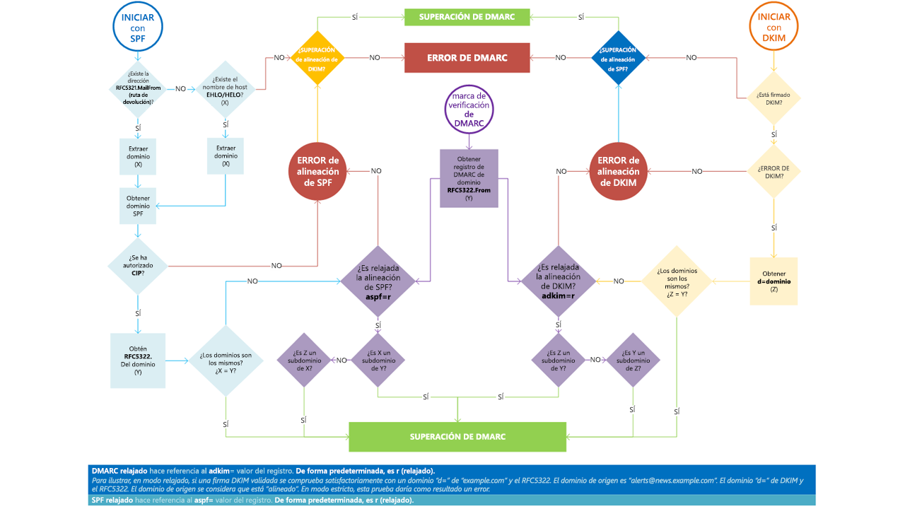

# <a name="use-dmarc-to-validate-email"></a><span data-ttu-id="278d9-103">Usar DMARC para validar el correo electrónico</span><span class="sxs-lookup"><span data-stu-id="278d9-103">Use DMARC to validate email</span></span>

[!INCLUDE [Microsoft 365 Defender rebranding](../includes/microsoft-defender-for-office.md)]


<span data-ttu-id="278d9-104">Domain-based Message Authentication, Reporting, and Conformance ([DMARC](https://dmarc.org)) trabaja con el marco de directivas de remitente (SPF) y DomainKeys Identified Mail (DKIM) para autenticar a los remitentes de los correos y garantizar que los sistemas de correo electrónico de destino confíen en los mensajes enviados desde su dominio.</span><span class="sxs-lookup"><span data-stu-id="278d9-104">Domain-based Message Authentication, Reporting, and Conformance ([DMARC](https://dmarc.org)) works with Sender Policy Framework (SPF) and DomainKeys Identified Mail (DKIM) to authenticate mail senders and ensure that destination email systems trust messages sent from your domain.</span></span> <span data-ttu-id="278d9-105">Implementar DMARC con SPF y DKIM ofrece protección adicional contra el correo electrónico de suplantación de identidad.</span><span class="sxs-lookup"><span data-stu-id="278d9-105">Implementing DMARC with SPF and DKIM provides additional protection against spoofing and phishing email.</span></span> <span data-ttu-id="278d9-106">DMARC permite a los sistemas que reciben los correos determinar qué hacer con los mensajes enviados desde su dominio que no superan las comprobaciones SPF o DKIM.</span><span class="sxs-lookup"><span data-stu-id="278d9-106">DMARC helps receiving mail systems determine what to do with messages sent from your domain that fail SPF or DKIM checks.</span></span>

> [!TIP]
> <span data-ttu-id="278d9-107">Visite el catálogo de la [Asociación de seguridad inteligente de Microsoft (MISA)](https://www.microsoft.com/misapartnercatalog) para ver los proveedores que ofrecen informes DMARC para Microsoft 365.</span><span class="sxs-lookup"><span data-stu-id="278d9-107">Visit the [Microsoft Intelligent Security Association (MISA)](https://www.microsoft.com/misapartnercatalog) catalog to view third-party vendors offering DMARC reporting for Microsoft 365.</span></span>

## <a name="how-do-spf-and-dmarc-work-together-to-protect-email-in-microsoft-365"></a><span data-ttu-id="278d9-108">¿Cómo se coordinan SPF y DMARC para proteger el correo electrónico en Microsoft 365?</span><span class="sxs-lookup"><span data-stu-id="278d9-108">How do SPF and DMARC work together to protect email in Microsoft 365?</span></span>

 <span data-ttu-id="278d9-109">Un mensaje de correo electrónico puede contener varias direcciones de remitentes</span><span class="sxs-lookup"><span data-stu-id="278d9-109">An email message may contain multiple originator or sender addresses.</span></span> <span data-ttu-id="278d9-110">que se usan para distintos propósitos.</span><span class="sxs-lookup"><span data-stu-id="278d9-110">These addresses are used for different purposes.</span></span> <span data-ttu-id="278d9-111">Por ejemplo, observe las siguientes direcciones:</span><span class="sxs-lookup"><span data-stu-id="278d9-111">For example, consider these addresses:</span></span>

- <span data-ttu-id="278d9-112">**Dirección "Correo de"**: identifica al remitente y especifica dónde se deben enviar los avisos de devolución si se produce algún problema al entregar el mensaje (por ejemplo, un aviso de no entrega).</span><span class="sxs-lookup"><span data-stu-id="278d9-112">**"Mail From" address**: Identifies the sender and specifies where to send return notices if any problems occur with the delivery of the message, such as non-delivery notices.</span></span> <span data-ttu-id="278d9-113">Aparece en la zona del sobre de un mensaje de correo electrónico, aunque su aplicación de correo electrónico no suele mostrarla.</span><span class="sxs-lookup"><span data-stu-id="278d9-113">This appears in the envelope portion of an email message and is not usually displayed by your email application.</span></span> <span data-ttu-id="278d9-114">A veces, recibe la denominación dirección 5321.MailFrom o dirección de ruta de acceso inversa.</span><span class="sxs-lookup"><span data-stu-id="278d9-114">This is sometimes called the 5321.MailFrom address or the reverse-path address.</span></span>

- <span data-ttu-id="278d9-115">**Dirección «De»**: es la dirección que se muestra como dirección De en el cliente de correo de la aplicación.</span><span class="sxs-lookup"><span data-stu-id="278d9-115">**"From" address**: The address displayed as the From address by your mail application.</span></span> <span data-ttu-id="278d9-116">Esta dirección identifica al autor del correo electrónico.</span><span class="sxs-lookup"><span data-stu-id="278d9-116">This address identifies the author of the email.</span></span> <span data-ttu-id="278d9-117">Es decir, el buzón de la persona o el sistema responsables de escribir el mensaje.</span><span class="sxs-lookup"><span data-stu-id="278d9-117">That is, the mailbox of the person or system responsible for writing the message.</span></span> <span data-ttu-id="278d9-118">A veces, recibe la denominación dirección 5322.From.</span><span class="sxs-lookup"><span data-stu-id="278d9-118">This is sometimes called the 5322.From address.</span></span>

<span data-ttu-id="278d9-p105">SPF usa un registro TXT de DNS para proporcionar una lista de direcciones IP de envío autorizadas en un dominio dado. Normalmente, solo se realizan comprobaciones de SPF en la dirección 5321.MailFrom. Esto significa que la dirección de 5322.From no se autentica al usar solamente SPF. Esto habilita un escenario donde un usuario puede recibir un mensaje que pasa una comprobación de SPF, pero tiene una dirección de remitente 5322.From falsificada. Por ejemplo, veamos esta transcripción de SMTP:</span><span class="sxs-lookup"><span data-stu-id="278d9-p105">SPF uses a DNS TXT record to provide a list of authorized sending IP addresses for a given domain. Normally, SPF checks are only performed against the 5321.MailFrom address. This means that the 5322.From address is not authenticated when you use SPF by itself. This allows for a scenario where a user can receive a message which passes an SPF check but has a spoofed 5322.From sender address. For example, consider this SMTP transcript:</span></span>

```console
S: Helo woodgrovebank.com
S: Mail from: phish@phishing.contoso.com
S: Rcpt to: astobes@tailspintoys.com
S: data
S: To: "Andrew Stobes" <astobes@tailspintoys.com>
S: From: "Woodgrove Bank Security" <security@woodgrovebank.com>
S: Subject: Woodgrove Bank - Action required
S:
S: Greetings User,
S:
S: We need to verify your banking details.
S: Please click the following link to verify that we have the right information for your account.
S:
S: https://short.url/woodgrovebank/updateaccount/12-121.aspx
S:
S: Thank you,
S: Woodgrove Bank
S: .
```

<span data-ttu-id="278d9-124">En esta transcripción, las direcciones del remitente son las siguientes:</span><span class="sxs-lookup"><span data-stu-id="278d9-124">In this transcript, the sender addresses are as follows:</span></span>

- <span data-ttu-id="278d9-125">Dirección MailFrom (5321.MailFrom): phish@phishing.contoso.com</span><span class="sxs-lookup"><span data-stu-id="278d9-125">Mail from address (5321.MailFrom): phish@phishing.contoso.com</span></span>

- <span data-ttu-id="278d9-126">Dirección From (5322.From): security@woodgrovebank.com</span><span class="sxs-lookup"><span data-stu-id="278d9-126">From address (5322.From): security@woodgrovebank.com</span></span>

<span data-ttu-id="278d9-p106">Si configuró SPF, el servidor receptor realiza una comprobación en la dirección MailFrom phish@phishing.contoso.com. Si el mensaje procede de un origen válido para el dominio phishing.contoso.com, entonces pasa la comprobación de SPF. Como el cliente de correo electrónico muestra solo la dirección From, el usuario verá que este mensaje procede de security@woodgrovebank.com. Usando solo SPF, la validez de woodgrovebank.com nunca se autentica.</span><span class="sxs-lookup"><span data-stu-id="278d9-p106">If you configured SPF, then the receiving server performs a check against the Mail from address phish@phishing.contoso.com. If the message came from a valid source for the domain phishing.contoso.com then the SPF check passes. Since the email client only displays the From address, the user sees that this message came from security@woodgrovebank.com. With SPF alone, the validity of woodgrovebank.com was never authenticated.</span></span>

<span data-ttu-id="278d9-p107">Cuando se usa DMARC, el servidor receptor también realiza una comprobación en la dirección From. En el ejemplo anterior, si no hay un registro TXT de DMARC para woodgrovebank.com, la comprobación de la dirección From da error.</span><span class="sxs-lookup"><span data-stu-id="278d9-p107">When you use DMARC, the receiving server also performs a check against the From address. In the example above, if there is a DMARC TXT record in place for woodgrovebank.com, then the check against the From address fails.</span></span>

## <a name="what-is-a-dmarc-txt-record"></a><span data-ttu-id="278d9-133">¿Qué es un registro TXT de DMARC?</span><span class="sxs-lookup"><span data-stu-id="278d9-133">What is a DMARC TXT record?</span></span>

<span data-ttu-id="278d9-p108">Al igual que los registros DNS para SPF, el registro para DMARC es un registro de texto (TXT) de DNS que ayuda a evitar la suplantación de identidad. Los registros TXT de DMARC se publican en DNS. Los registros TXT de DMARC validan el origen de los mensajes de correo electrónico contrastando la dirección IP del autor de un correo electrónico con el supuesto propietario del dominio de envío. El registro TXT de DMARC identifica los servidores de correo electrónico saliente autorizados. Así, los sistemas de correo electrónico de destino comprueban que los mensajes que reciben proceden de servidores de correo electrónico saliente autorizados.</span><span class="sxs-lookup"><span data-stu-id="278d9-p108">Like the DNS records for SPF, the record for DMARC is a DNS text (TXT) record that helps prevent spoofing and phishing. You publish DMARC TXT records in DNS. DMARC TXT records validate the origin of email messages by verifying the IP address of an email's author against the alleged owner of the sending domain. The DMARC TXT record identifies authorized outbound email servers. Destination email systems can then verify that messages they receive originate from authorized outbound email servers.</span></span>

<span data-ttu-id="278d9-139">El registro TXT de DMARC de Microsoft es algo así:</span><span class="sxs-lookup"><span data-stu-id="278d9-139">Microsoft's DMARC TXT record looks something like this:</span></span>

```console
_dmarc.microsoft.com.   3600    IN      TXT     "v=DMARC1; p=none; pct=100; rua=mailto:d@rua.agari.com; ruf=mailto:d@ruf.agari.com; fo=1"
```

<span data-ttu-id="278d9-140">Microsoft envía sus informes DMARC a [Agari](https://agari.com), un tercero.</span><span class="sxs-lookup"><span data-stu-id="278d9-140">Microsoft sends its DMARC reports to [Agari](https://agari.com), a third party.</span></span> <span data-ttu-id="278d9-141">Agari recoge y analiza los informes de la DMARC.</span><span class="sxs-lookup"><span data-stu-id="278d9-141">Agari collects and analyzes DMARC reports.</span></span> <span data-ttu-id="278d9-142">Visite el [catálogo de MISA](https://www.microsoft.com/misapartnercatalog) para ver más proveedores que ofrecen informes DMARC para Microsoft 365.</span><span class="sxs-lookup"><span data-stu-id="278d9-142">Please visit the [MISA catalog](https://www.microsoft.com/misapartnercatalog) to view more third-party vendors offering DMARC reporting for Microsoft 365.</span></span>

## <a name="implement-dmarc-for-inbound-mail"></a><span data-ttu-id="278d9-143">Implementar DMARC para el correo entrante</span><span class="sxs-lookup"><span data-stu-id="278d9-143">Implement DMARC for inbound mail</span></span>

<span data-ttu-id="278d9-p110">No hay que hacer nada para configurar DMARC para el correo que se recibe en Microsoft 365. Nosotros nos hemos encargado de todo. Si quiere saber lo que ocurre con el correo que no pasa las comprobaciones de DMARC, consulte [Cómo gestiona Microsoft 365 el correo electrónico entrante que genera errores DMARC](#how-microsoft-365-handles-inbound-email-that-fails-dmarc).</span><span class="sxs-lookup"><span data-stu-id="278d9-p110">You don't have to do a thing to set up DMARC for mail that you receive in Microsoft 365. We've taken care of everything for you. If you want to learn what happens to mail that fails to pass our DMARC checks, see [How Microsoft 365 handles inbound email that fails DMARC](#how-microsoft-365-handles-inbound-email-that-fails-dmarc).</span></span>

## <a name="implement-dmarc-for-outbound-mail-from-microsoft-365"></a><span data-ttu-id="278d9-147">Implementar DMARC para el correo saliente de Microsoft 365</span><span class="sxs-lookup"><span data-stu-id="278d9-147">Implement DMARC for outbound mail from Microsoft 365</span></span>

<span data-ttu-id="278d9-p111">Si usa Microsoft 365, pero no está usando un dominio personalizado (sino el dominio onmicrosoft.com), solo tiene que configurar o implementar DMARC para la organización. SPF ya está configurado y Microsoft 365 genera automáticamente una firma DKIM para el correo saliente. Para más información sobre esta firma, consulte [Comportamiento predeterminado para DKIM y Microsoft 365](use-dkim-to-validate-outbound-email.md#DefaultDKIMbehavior).</span><span class="sxs-lookup"><span data-stu-id="278d9-p111">If you use Microsoft 365 but you aren't using a custom domain, that is, you use onmicrosoft.com, you don't need to do anything else to configure or implement DMARC for your organization. SPF is already set up for you and Microsoft 365 automatically generates a DKIM signature for your outgoing mail. For more information about this signature, see [Default behavior for DKIM and Microsoft 365](use-dkim-to-validate-outbound-email.md#DefaultDKIMbehavior).</span></span>

 <span data-ttu-id="278d9-p112">Si tiene un dominio personalizado o usa servidores de Exchange locales aparte de Microsoft 365, implemente manualmente DMARC para el correo saliente. La implementación de DMARC para el dominio personalizado incluye estos pasos:</span><span class="sxs-lookup"><span data-stu-id="278d9-p112">If you have a custom domain or you are using on-premises Exchange servers in addition to Microsoft 365, you need to manually implement DMARC for your outbound mail. Implementing DMARC for your custom domain includes these steps:</span></span>

- [<span data-ttu-id="278d9-153">Paso 1: Identificar orígenes válidos de correo para el dominio</span><span class="sxs-lookup"><span data-stu-id="278d9-153">Step 1: Identify valid sources of mail for your domain</span></span>](#step-1-identify-valid-sources-of-mail-for-your-domain)

- [<span data-ttu-id="278d9-154">Paso 2: Configurar SPF para el dominio</span><span class="sxs-lookup"><span data-stu-id="278d9-154">Step 2: Set up SPF for your domain</span></span>](#step-2-set-up-spf-for-your-domain)

- [<span data-ttu-id="278d9-155">Paso 3: Configurar DKIM para el dominio personalizado</span><span class="sxs-lookup"><span data-stu-id="278d9-155">Step 3: Set up DKIM for your custom domain</span></span>](#step-3-set-up-dkim-for-your-custom-domain)

- [<span data-ttu-id="278d9-156">Paso 4: Formular el registro TXT de DMARC para el dominio</span><span class="sxs-lookup"><span data-stu-id="278d9-156">Step 4: Form the DMARC TXT record for your domain</span></span>](#step-4-form-the-dmarc-txt-record-for-your-domain)

### <a name="step-1-identify-valid-sources-of-mail-for-your-domain"></a><span data-ttu-id="278d9-157">Paso 1: Identificar orígenes válidos de correo para el dominio</span><span class="sxs-lookup"><span data-stu-id="278d9-157">Step 1: Identify valid sources of mail for your domain</span></span>

<span data-ttu-id="278d9-p113">Si tiene configurado SPF, quiere decir que ya ha hecho este paso. Sin embargo, para DMARC, hay que tener en cuenta otras cosas. Al identificar los orígenes de correo para el dominio, debemos responder a dos preguntas:</span><span class="sxs-lookup"><span data-stu-id="278d9-p113">If you have already set up SPF then you have already gone through this exercise. However, for DMARC, there are additional considerations. When identifying sources of mail for your domain there are two questions you need to answer:</span></span>

- <span data-ttu-id="278d9-161">¿Qué direcciones IP envían mensajes desde mi dominio?</span><span class="sxs-lookup"><span data-stu-id="278d9-161">What IP addresses send messages from my domain?</span></span>

- <span data-ttu-id="278d9-162">En los correos electrónicos enviados por parte de terceros en mi nombre, ¿coincidirán los dominios 5321.MailFrom y 5322.From?</span><span class="sxs-lookup"><span data-stu-id="278d9-162">For mail sent from third parties on my behalf, will the 5321.MailFrom and 5322.From domains match?</span></span>

### <a name="step-2-set-up-spf-for-your-domain"></a><span data-ttu-id="278d9-163">Paso 2: Configurar SPF para el dominio</span><span class="sxs-lookup"><span data-stu-id="278d9-163">Step 2: Set up SPF for your domain</span></span>

<span data-ttu-id="278d9-164">Ahora que tiene una lista de todos los remitentes válidos, puede seguir los pasos para [Configurar SPF para evitar la suplantación de identidad](set-up-spf-in-office-365-to-help-prevent-spoofing.md).</span><span class="sxs-lookup"><span data-stu-id="278d9-164">Now that you have a list of all your valid senders you can follow the steps to [Set up SPF to help prevent spoofing](set-up-spf-in-office-365-to-help-prevent-spoofing.md).</span></span>

<span data-ttu-id="278d9-165">Por ejemplo, suponiendo que contoso.com envía correos desde Exchange Online, un servidor Exchange local cuya dirección IP fuera 192.168.0.1 y una aplicación web cuya dirección IP fuera 192.168.100.100, el registro TXT de SPF tendría este aspecto:</span><span class="sxs-lookup"><span data-stu-id="278d9-165">For example, assuming contoso.com sends mail from Exchange Online, an on-premises Exchange server whose IP address is 192.168.0.1, and a web application whose IP address is 192.168.100.100, the SPF TXT record would look like this:</span></span>

```console
contoso.com  IN  TXT  " v=spf1 ip4:192.168.0.1 ip4:192.168.100.100 include:spf.protection.outlook.com -all"
```

<span data-ttu-id="278d9-166">Como práctica recomendada, asegúrese de que el registro TXT de SPF tenga en cuenta a los remitentes externos.</span><span class="sxs-lookup"><span data-stu-id="278d9-166">As a best practice, ensure that your SPF TXT record takes into account third-party senders.</span></span>

### <a name="step-3-set-up-dkim-for-your-custom-domain"></a><span data-ttu-id="278d9-167">Paso 3: Configurar DKIM para el dominio personalizado</span><span class="sxs-lookup"><span data-stu-id="278d9-167">Step 3: Set up DKIM for your custom domain</span></span>

<span data-ttu-id="278d9-p114">Cuando haya configurado SPF, deberá configurar DKIM. DKIM le permite agregar una firma digital en el encabezado de los mensajes de correo electrónico. Si no configura DKIM pero permite a Microsoft 365 usar la configuración predeterminada de DKIM para el dominio, DMARC puede dar errores. Esto se debe a que la configuración predeterminada de DKIM usa el dominio onmicrosoft.com inicial como dirección 5322.From, es decir, no usa el dominio personalizado. Esto provoca una discrepancia entre las direcciones 5321.MailFrom y 5322.From en todos los correos electrónicos enviados desde su dominio.</span><span class="sxs-lookup"><span data-stu-id="278d9-p114">Once you have set up SPF, you need to set up DKIM. DKIM lets you add a digital signature to email messages in the message header. If you do not set up DKIM and instead allow Microsoft 365 to use the default DKIM configuration for your domain, DMARC may fail. This is because the default DKIM configuration uses your initial onmicrosoft.com domain as the 5322.From address, not your custom domain. This forces a mismatch between the 5321.MailFrom and the 5322.From addresses in all email sent from your domain.</span></span>

<span data-ttu-id="278d9-p115">Si hay remitentes externos que envían correo en su nombre y el correo que envían tiene direcciones 5321.MailFrom y 5322.From que no coinciden, se producirá un error de DMARC para ese correo electrónico. Para evitar esto, tendrá que configurar DKIM para el dominio específicamente con ese remitente externo. Esto permite a Microsoft 365 autenticar el correo electrónico desde el servicio externo. Sin embargo, también permite a otros usuarios, por ejemplo, Yahoo, Gmail y Comcast, comprobar la validez del correo electrónico enviado por terceros como si lo hubiera enviado usted. Esto es beneficioso porque permite a los clientes generar relaciones de confianza con el dominio independientemente del sitio donde se encuentre su buzón y, al mismo tiempo, Microsoft 365 no marcará un mensaje como correo no deseado por suplantación de identidad, ya que pasa las comprobaciones de autenticación para el dominio.</span><span class="sxs-lookup"><span data-stu-id="278d9-p115">If you have third-party senders that send mail on your behalf and the mail they send has mismatched 5321.MailFrom and 5322.From addresses, DMARC will fail for that email. To avoid this, you need to set up DKIM for your domain specifically with that third-party sender. This allows Microsoft 365 to authenticate email from this 3rd-party service. However, it also allows others, for example, Yahoo, Gmail, and Comcast, to verify email sent to them by the third-party as if it was email sent by you. This is beneficial because it allows your customers to build trust with your domain no matter where their mailbox is located, and at the same time Microsoft 365 won't mark a message as spam due to spoofing because it passes authentication checks for your domain.</span></span>

<span data-ttu-id="278d9-178">Para ver las instrucciones sobre cómo configurar DKIM para el dominio, incluyendo cómo configurar DKIM para remitentes externos para que puedan suplantar la identidad de su dominio, consulte [Usar DKIM para validar el correo electrónico saliente enviado desde el dominio personalizado](use-dkim-to-validate-outbound-email.md).</span><span class="sxs-lookup"><span data-stu-id="278d9-178">For instructions on setting up DKIM for your domain, including how to set up DKIM for third-party senders so they can spoof your domain, see [Use DKIM to validate outbound email sent from your custom domain](use-dkim-to-validate-outbound-email.md).</span></span>

### <a name="step-4-form-the-dmarc-txt-record-for-your-domain"></a><span data-ttu-id="278d9-179">Paso 4: Formular el registro TXT de DMARC para el dominio</span><span class="sxs-lookup"><span data-stu-id="278d9-179">Step 4: Form the DMARC TXT record for your domain</span></span>

<span data-ttu-id="278d9-p116">Aunque existen otras opciones de sintaxis que no se mencionan aquí, estas son las opciones más usadas en Microsoft 365. Formule el registro TXT de DMARC para el dominio con el siguiente formato:</span><span class="sxs-lookup"><span data-stu-id="278d9-p116">Although there are other syntax options that are not mentioned here, these are the most commonly used options for Microsoft 365. Form the DMARC TXT record for your domain in the format:</span></span>

```console
_dmarc.domain  TTL  IN  TXT  "v=DMARC1; p=policy; pct=100"
```

<span data-ttu-id="278d9-182">donde:</span><span class="sxs-lookup"><span data-stu-id="278d9-182">where:</span></span>

- <span data-ttu-id="278d9-183">*domain* es el dominio que quiere proteger.</span><span class="sxs-lookup"><span data-stu-id="278d9-183">*domain* is the domain you want to protect.</span></span> <span data-ttu-id="278d9-184">De forma predeterminada, el registro protege el correo del dominio y todos los subdominios.</span><span class="sxs-lookup"><span data-stu-id="278d9-184">By default, the record protects mail from the domain and all subdomains.</span></span> <span data-ttu-id="278d9-185">Por ejemplo, si especifica \_dmarc.contoso.com, DMARC protege correo del dominio y todos los subdominios, como housewares.contoso.com o plumbing.contoso.com.</span><span class="sxs-lookup"><span data-stu-id="278d9-185">For example, if you specify \_dmarc.contoso.com, then DMARC protects mail from the domain and all subdomains, such as housewares.contoso.com or plumbing.contoso.com.</span></span>

- <span data-ttu-id="278d9-p118">*TTL* siempre debe ser el equivalente a una hora. La unidad usada para el TTL, ya sean las horas (1 hora), los minutos (60 minutos) o los segundos (3600 segundos), variará en función del registrador del dominio.</span><span class="sxs-lookup"><span data-stu-id="278d9-p118">*TTL* should always be the equivalent of one hour. The unit used for TTL, either hours (1 hour), minutes (60 minutes), or seconds (3600 seconds), will vary depending on the registrar for your domain.</span></span>

- <span data-ttu-id="278d9-188">*pct=100* indica que esta regla debe usarse para el 100 % del correo electrónico.</span><span class="sxs-lookup"><span data-stu-id="278d9-188">*pct=100* indicates that this rule should be used for 100% of email.</span></span>

- <span data-ttu-id="278d9-p119">*policy* especifica qué directiva quiere que el servidor de recepción siga si se produce un error en DMARC. Puede establecer la directiva en none, quarantine o reject.</span><span class="sxs-lookup"><span data-stu-id="278d9-p119">*policy* specifies what policy you want the receiving server to follow if DMARC fails. You can set the policy to none, quarantine, or reject.</span></span>

<span data-ttu-id="278d9-191">Para obtener información sobre las opciones que se usan, familiarícese con los conceptos en [Procedimientos recomendados para la implementación de DMARC en Microsoft 365](#best-practices-for-implementing-dmarc-in-microsoft-365).</span><span class="sxs-lookup"><span data-stu-id="278d9-191">For information about which options to use, become familiar with the concepts in [Best practices for implementing DMARC in Microsoft 365](#best-practices-for-implementing-dmarc-in-microsoft-365).</span></span>

<span data-ttu-id="278d9-192">Ejemplos:</span><span class="sxs-lookup"><span data-stu-id="278d9-192">Examples:</span></span>

- <span data-ttu-id="278d9-193">Directiva establecida en none</span><span class="sxs-lookup"><span data-stu-id="278d9-193">Policy set to none</span></span>

    ```console
    _dmarc.contoso.com 3600 IN  TXT  "v=DMARC1; p=none"
    ```

- <span data-ttu-id="278d9-194">Directiva establecida en quarantine</span><span class="sxs-lookup"><span data-stu-id="278d9-194">Policy set to quarantine</span></span>

    ```console
    _dmarc.contoso.com 3600 IN  TXT  "v=DMARC1; p=quarantine"
    ```

- <span data-ttu-id="278d9-195">Directiva establecida en reject</span><span class="sxs-lookup"><span data-stu-id="278d9-195">Policy set to reject</span></span>

    ```console
    _dmarc.contoso.com  3600 IN  TXT  "v=DMARC1; p=reject"
    ```

<span data-ttu-id="278d9-p120">Una vez que haya formulado el registro, debe actualizarlo en el registrador del dominios. Para obtener instrucciones sobre cómo agregar el registro TXT de DMARC a los registros DNS para Microsoft 365, consulte [Crear registros DNS para Microsoft 365 al administrar los registros DNS](https://docs.microsoft.com/microsoft-365/admin/get-help-with-domains/create-dns-records-at-any-dns-hosting-provider).</span><span class="sxs-lookup"><span data-stu-id="278d9-p120">Once you have formed your record, you need to update the record at your domain registrar. For instructions on adding the DMARC TXT record to your DNS records for Microsoft 365, see [Create DNS records for Microsoft 365 when you manage your DNS records](https://docs.microsoft.com/microsoft-365/admin/get-help-with-domains/create-dns-records-at-any-dns-hosting-provider).</span></span>

## <a name="best-practices-for-implementing-dmarc-in-microsoft-365"></a><span data-ttu-id="278d9-198">Procedimientos recomendados para la implementación de DMARC en Microsoft 365</span><span class="sxs-lookup"><span data-stu-id="278d9-198">Best practices for implementing DMARC in Microsoft 365</span></span>

<span data-ttu-id="278d9-p121">DMARC se puede implementar gradualmente sin que esto afecte al resto del flujo de correo. Cree e implemente un plan de distribución con estos pasos de implementación. Realice cada uno de estos pasos primero con un subdominio, luego con otros subdominios y, finalmente, con el dominio de nivel superior de la organización antes de continuar con el paso siguiente.</span><span class="sxs-lookup"><span data-stu-id="278d9-p121">You can implement DMARC gradually without impacting the rest of your mail flow. Create and implement a roll-out plan that follows these steps. Do each of these steps first with a sub-domain, then other sub-domains, and finally with the top-level domain in your organization before moving on to the next step.</span></span>

1. <span data-ttu-id="278d9-202">Supervisar el impacto de implementar DMARC</span><span class="sxs-lookup"><span data-stu-id="278d9-202">Monitor the impact of implementing DMARC</span></span>

    <span data-ttu-id="278d9-p122">Comience con un registro en modo de supervisión simple para un subdominio o dominio que solicita que los receptores DMARC le envíen estadísticas sobre los mensajes que usan ese dominio. Un registro en modo de supervisión es un registro TXT de DMARC con la directiva establecida en none (p=none). Muchas empresas publican un registro TXT de DMARC con p=none porque no saben cuánto correo electrónico se pueden perder al publicar una directiva de DMARC más restrictiva.</span><span class="sxs-lookup"><span data-stu-id="278d9-p122">Start with a simple monitoring-mode record for a sub-domain or domain that requests that DMARC receivers send you statistics about messages that they see using that domain. A monitoring-mode record is a DMARC TXT record that has its policy set to none (p=none). Many companies publish a DMARC TXT record with p=none because they are unsure about how much email they may lose by publishing a more restrictive DMARC policy.</span></span>

    <span data-ttu-id="278d9-p123">Puede hacer esto incluso antes de implementar SPF o DKIM en la infraestructura de mensajería. Sin embargo, no podrá poner en cuarentena ni rechazar eficazmente el correo mediante DMARC hasta que no implemente también SPF y DKIM. Al introducir SPF y DKIM, los informes generados mediante DMARC indicarán los números y los orígenes de los mensajes que pasen estas comprobaciones y los que no. Se puede ver fácilmente qué cantidad del tráfico legítimo está cubierto o no por ellos, así como solucionar los problemas. También empezará a ver cuántos mensajes fraudulentos se envían y desde dónde.</span><span class="sxs-lookup"><span data-stu-id="278d9-p123">You can do this even before you've implemented SPF or DKIM in your messaging infrastructure. However, you won't be able to effectively quarantine or reject mail by using DMARC until you also implement SPF and DKIM. As you introduce SPF and DKIM, the reports generated through DMARC will provide the numbers and sources of messages that pass these checks, and those that don't. You can easily see how much of your legitimate traffic is or isn't covered by them, and troubleshoot any problems. You'll also begin to see how many fraudulent messages are being sent, and from where.</span></span>

2. <span data-ttu-id="278d9-211">Solicitar que los sistemas de correo externos pongan en cuarentena el correo que no supera las comprobaciones de DMARC</span><span class="sxs-lookup"><span data-stu-id="278d9-211">Request that external mail systems quarantine mail that fails DMARC</span></span>

    <span data-ttu-id="278d9-p124">Cuando cree que todo el tráfico legítimo o la mayor parte está protegido por SPF y DKIM, y sabe cuál es el impacto de implementar DMARC, puede implementar una directiva de cuarentena. Una directiva de cuarentena es un registro TXT de DMARC con una directiva establecida en quarantine (p=quarantine). Al hacer esto, pedimos a los receptores DMARC que pongan los mensajes de su dominio que no superen las pruebas de DMARC en el equivalente local a una carpeta de correo no deseado, en lugar de en las bandejas de entrada de los clientes.</span><span class="sxs-lookup"><span data-stu-id="278d9-p124">When you believe that all or most of your legitimate traffic is protected by SPF and DKIM, and you understand the impact of implementing DMARC, you can implement a quarantine policy. A quarantine policy is a DMARC TXT record that has its policy set to quarantine (p=quarantine). By doing this, you are asking DMARC receivers to put messages from your domain that fail DMARC into the local equivalent of a spam folder instead of your customers' inboxes.</span></span>

3. <span data-ttu-id="278d9-215">Solicitar que los sistemas de correo externos no aceptan mensajes que no superen las pruebas de DMARC</span><span class="sxs-lookup"><span data-stu-id="278d9-215">Request that external mail systems not accept messages that fail DMARC</span></span>

    <span data-ttu-id="278d9-p125">El último paso es implementar una directiva de rechazo. Una directiva de rechazo es un registro TXT de DMARC con una directiva establecida en reject (p=reject). Al hacerlo, pedimos a los receptores DMARC que no acepten los mensajes que no pasan las comprobaciones de DMARC.</span><span class="sxs-lookup"><span data-stu-id="278d9-p125">The final step is implementing a reject policy. A reject policy is a DMARC TXT record that has its policy set to reject (p=reject). When you do this, you're asking DMARC receivers not to accept messages that fail the DMARC checks.</span></span>

4. <span data-ttu-id="278d9-219">¿Cómo configuro DMARC para un subdominio?</span><span class="sxs-lookup"><span data-stu-id="278d9-219">How to set up DMARC for subdomain?</span></span>

   <span data-ttu-id="278d9-220">DMARC se implementa al publicar una directiva como un registro TXT en DNS y es jerárquico (por ejemplo, una directiva publicada para contoso.com se aplicará a sub.domain.contoso.com a menos que se defina explícitamente una directiva diferente para el subdominio).</span><span class="sxs-lookup"><span data-stu-id="278d9-220">DMARC is implemented by publishing a policy as a TXT record in DNS and is hierarchical (e.g. a policy published for contoso.com will apply to sub.domain.contonos.com unless a different policy is explicitly defined for the subdomain).</span></span> <span data-ttu-id="278d9-221">Esto es útil para que las organizaciones puedan especificar un número más reducido de registros de DMARC de alto nivel para un mayor alcance.</span><span class="sxs-lookup"><span data-stu-id="278d9-221">This is useful as organizations may be able to specify a smaller number of high-level DMARC records for wider coverage.</span></span> <span data-ttu-id="278d9-222">Se debe prestar especial atención a la configuración de registros de DMARC de subdominios explícitos en los que no quiera que los subdominios hereden el registro de DMARC del dominio de nivel superior.</span><span class="sxs-lookup"><span data-stu-id="278d9-222">Care should be taken to configure explicit subdomain DMARC records where you do not want the subdomains to inherit the top-level domain's DMARC record.</span></span>

   <span data-ttu-id="278d9-223">Asimismo, con el valor `sp=reject`, puede agregar una directiva de tipo comodín para DMARC cuando los subdominios no puedan enviar correos electrónicos.</span><span class="sxs-lookup"><span data-stu-id="278d9-223">Also, you can add a wildcard-type policy for DMARC when subdomains shouldn't be sending email, by adding the `sp=reject` value.</span></span> <span data-ttu-id="278d9-224">Por ejemplo:</span><span class="sxs-lookup"><span data-stu-id="278d9-224">For example:</span></span>

   ```text
   _dmarc.contoso.com. TXT "v=DMARC1; p=reject; sp=reject; ruf=mailto:authfail@contoso.com; rua=mailto:aggrep@contoso.com"
   ```

## <a name="how-microsoft-365-handles-outbound-email-that-fails-dmarc"></a><span data-ttu-id="278d9-225">Cómo controla Microsoft 365 el correo electrónico saliente que no supera las comprobaciones de DMARC</span><span class="sxs-lookup"><span data-stu-id="278d9-225">How Microsoft 365 handles outbound email that fails DMARC</span></span>

<span data-ttu-id="278d9-226">Si un mensaje sale de Microsoft 365 y no supera las comprobaciones de DMARC, y ha establecido la directiva en p=quarantine o p=reject, el mensaje se enruta a través del [Grupo de entrega de alto riesgo para mensajes salientes](high-risk-delivery-pool-for-outbound-messages.md).</span><span class="sxs-lookup"><span data-stu-id="278d9-226">If a message is outbound from Microsoft 365 and fails DMARC, and you have set the policy to p=quarantine or p=reject, the message is routed through the [High-risk delivery pool for outbound messages](high-risk-delivery-pool-for-outbound-messages.md).</span></span> <span data-ttu-id="278d9-227">No hay ninguna invalidación para el correo saliente.</span><span class="sxs-lookup"><span data-stu-id="278d9-227">There is no override for outbound email.</span></span>

<span data-ttu-id="278d9-p129">Si publica una directiva de rechazo de DMARC (p=reject), ningún otro cliente de Office 365 podrá suplantar la identidad del dominio porque los mensajes no podrán pasar las comprobaciones de SPF o DKIM para el dominio al retransmitir un mensaje saliente a través del servicio. Sin embargo, si publica una directiva de rechazo de DMARC, pero no dispone de todo el correo electrónico autenticado a través de Microsoft 365, una parte del correo entrante puede ser marcado como correo no deseado (como se describió anteriormente) o se rechazará si no publica SPF e intenta retransmitirlo para que salga a través del servicio. Esto sucede, por ejemplo, si se olvida de incluir algunas de las direcciones IP para servidores y aplicaciones que envían correo en nombre de su dominio al formular el registro TXT de DMARC.</span><span class="sxs-lookup"><span data-stu-id="278d9-p129">If you publish a DMARC reject policy (p=reject), no other customer in Microsoft 365 can spoof your domain because messages will not be able to pass SPF or DKIM for your domain when relaying a message outbound through the service. However, if you do publish a DMARC reject policy but don't have all of your email authenticated through Microsoft 365, some of it may be marked as spam for inbound email (as described above), or it will be rejected if you do not publish SPF and try to relay it outbound through the service. This happens, for example, if you forget to include some of the IP addresses for servers and apps that send mail on behalf of your domain when you form your DMARC TXT record.</span></span>

## <a name="how-microsoft-365-handles-inbound-email-that-fails-dmarc"></a><span data-ttu-id="278d9-231">Cómo controla Microsoft 365 el correo electrónico entrante que no supera las comprobaciones de DMARC</span><span class="sxs-lookup"><span data-stu-id="278d9-231">How Microsoft 365 handles inbound email that fails DMARC</span></span>

<span data-ttu-id="278d9-232">Si la directiva DMARC del servidor de envío es `p=reject`, [Exchange Online Protection](exchange-online-protection-overview.md) (EOP) marca el mensaje como correo de suplantación de identidad en lugar de rechazarlo.</span><span class="sxs-lookup"><span data-stu-id="278d9-232">If the DMARC policy of the sending server is `p=reject`, [Exchange Online Protection](exchange-online-protection-overview.md) (EOP) marks the message as spoof instead of rejecting it.</span></span> <span data-ttu-id="278d9-233">En otras palabras, para el correo entrante, Microsoft 365 trata a `p=reject` y `p=quarantine` de la misma manera.</span><span class="sxs-lookup"><span data-stu-id="278d9-233">In other words, for inbound email, Microsoft 365 treats `p=reject` and `p=quarantine` the same way.</span></span> <span data-ttu-id="278d9-234">Los administradores pueden definir la acción que debe realizarse sobre los mensajes clasificados como suplantación de identidad dentro de la [directiva contra la suplantación de identidad](set-up-anti-phishing-policies.md).</span><span class="sxs-lookup"><span data-stu-id="278d9-234">Admins can define the action to take on messages classified as spoof within the [anti-phishing policy](set-up-anti-phishing-policies.md).</span></span>

<span data-ttu-id="278d9-235">Microsoft 365 está configurado así porque algunos mensajes de correo legítimos pueden no superar las comprobaciones de DMARC.</span><span class="sxs-lookup"><span data-stu-id="278d9-235">Microsoft 365 is configured like this because some legitimate email may fail DMARC.</span></span> <span data-ttu-id="278d9-236">Por ejemplo, un mensaje podría no superar las pruebas DMARC si se envía a una lista de distribución que luego transmite el mensaje a todos los participantes de la lista.</span><span class="sxs-lookup"><span data-stu-id="278d9-236">For example, a message might fail DMARC if it is sent to a mailing list that then relays the message to all list participants.</span></span> <span data-ttu-id="278d9-237">Si Microsoft 365 rechazara estos mensajes, las personas podrían perder el correo electrónico legítimo y no habría forma de recuperarlo.</span><span class="sxs-lookup"><span data-stu-id="278d9-237">If Microsoft 365 rejected these messages, people could lose legitimate email and have no way to retrieve it.</span></span> <span data-ttu-id="278d9-238">Es decir, estos mensajes seguirían provocando un error en DMARC, pero se marcarían como correo no deseado y no se rechazarían.</span><span class="sxs-lookup"><span data-stu-id="278d9-238">Instead, these messages will still fail DMARC but they will be marked as spam and not rejected.</span></span> <span data-ttu-id="278d9-239">Los usuarios que quisieran podrían colocar estos mensajes en la bandeja de entrada a través de estos métodos:</span><span class="sxs-lookup"><span data-stu-id="278d9-239">If desired, users can still get these messages in their inbox through these methods:</span></span>

- <span data-ttu-id="278d9-240">Los usuarios agregan a los remitentes seguros de manera individual mediante el cliente de correo electrónico</span><span class="sxs-lookup"><span data-stu-id="278d9-240">Users add safe senders individually by using their email client.</span></span>

- <span data-ttu-id="278d9-241">Los administradores pueden actualizar las notificaciones de [Inteligencia de suplantación de identidad](learn-about-spoof-intelligence.md) para permitir la suplantación de identidad.</span><span class="sxs-lookup"><span data-stu-id="278d9-241">Administrators can update the [Spoof Intelligence](learn-about-spoof-intelligence.md) reporting to allow the spoof.</span></span>

- <span data-ttu-id="278d9-242">Los administradores crean una regla de flujo de correo (también conocida como regla de transporte) de Exchange para todos los usuarios que permite los mensajes de esos remitentes concretos.</span><span class="sxs-lookup"><span data-stu-id="278d9-242">Administrators create an Exchange mail flow rule (also known as a transport rule) for all users that allows messages for those particular senders.</span></span>

<span data-ttu-id="278d9-243">Para obtener más información, consulte [Crear listas de remitentes seguros](create-safe-sender-lists-in-office-365.md).</span><span class="sxs-lookup"><span data-stu-id="278d9-243">For more information, see [Create safe sender lists](create-safe-sender-lists-in-office-365.md).</span></span>

## <a name="how-microsoft-365-utilizes-authenticated-received-chain-arc"></a><span data-ttu-id="278d9-244">Cómo Microsoft 365 utiliza la cadena de recepción autenticada (ARC)</span><span class="sxs-lookup"><span data-stu-id="278d9-244">How Microsoft 365 utilizes Authenticated Received Chain (ARC)</span></span>

<span data-ttu-id="278d9-245">Todos los buzones hospedados en Microsoft 365 ahora tendrán la ventaja de ARC con una mejor entrega de mensajes y la protección mejorada contra la suplantación de identidad.</span><span class="sxs-lookup"><span data-stu-id="278d9-245">All hosted mailboxes in Microsoft 365 will now gain the benefit of ARC with improved deliverability of messages and enhanced anti-spoofing protection.</span></span> <span data-ttu-id="278d9-246">ARC preserva los resultados de la autenticación de correo electrónico de todos los intermediarios participantes, o saltos, cuando un correo electrónico se enruta desde el servidor de origen hasta el buzón del destinatario.</span><span class="sxs-lookup"><span data-stu-id="278d9-246">ARC preserves the email authentication results from all participating intermediaries, or hops, when an email is routed from the originating server to the recipient mailbox.</span></span> <span data-ttu-id="278d9-247">Antes de ARC, las modificaciones realizadas por intermediarios en el enrutamiento del correo electrónico, tales como las reglas de reenvío o las firmas automáticas, podían causar errores de DMARC al momento en que el correo electrónico llegaba al buzón del destinatario.</span><span class="sxs-lookup"><span data-stu-id="278d9-247">Before ARC, modifications performed by intermediaries in email routing, like forwarding rules or automatic signatures, could cause DMARC failures by the time the email reached the recipient mailbox.</span></span> <span data-ttu-id="278d9-248">Con ARC, la conservación criptográfica de los resultados de la autenticación permite a Microsoft 365 comprobar la autenticidad del remitente de un correo electrónico.</span><span class="sxs-lookup"><span data-stu-id="278d9-248">With ARC, the cryptographic preservation of the authentication results allows Microsoft 365 to verify the authenticity of an email's sender.</span></span>

<span data-ttu-id="278d9-249">Actualmente, Microsoft 365 usa ARC para comprobar los resultados de la autenticación cuando Microsoft es el que proporciona el sello ARC, pero, en el futuro, tiene previsto proporcionar soporte a terceros que proporcionan el sello ARS.</span><span class="sxs-lookup"><span data-stu-id="278d9-249">Microsoft 365 currently utilizes ARC to verify authentication results when Microsoft is the ARC Sealer, but plan to add support for third-party ARC sealers in the future.</span></span>

## <a name="troubleshooting-your-dmarc-implementation"></a><span data-ttu-id="278d9-250">Solución de problemas en la implementación de DMARC</span><span class="sxs-lookup"><span data-stu-id="278d9-250">Troubleshooting your DMARC implementation</span></span>

<span data-ttu-id="278d9-251">Si configuró los registros MX de su dominio donde EOP no es la primera entrada, los errores de DMARC no se aplicarán en su dominio.</span><span class="sxs-lookup"><span data-stu-id="278d9-251">If you have configured your domain's MX records where EOP is not the first entry, DMARC failures will not be enforced for your domain.</span></span>

<span data-ttu-id="278d9-252">Si usted es cliente y el registro MX principal del dominio no apunta a EOP, no obtendrá las ventajas de DMARC.</span><span class="sxs-lookup"><span data-stu-id="278d9-252">If you're a customer, and your domain's primary MX record does not point to EOP, you will not get the benefits of DMARC.</span></span> <span data-ttu-id="278d9-253">Por ejemplo, DMARC no funcionará si apunta el registro MX al servidor de correo local y luego enruta el correo electrónico a EOP usando un conector.</span><span class="sxs-lookup"><span data-stu-id="278d9-253">For example, DMARC won't work if you point the MX record to your on-premises mail server and then route email to EOP by using a connector.</span></span> <span data-ttu-id="278d9-254">En este escenario, el dominio receptor es uno de los dominios aceptados, pero EOP no es el MX principal.</span><span class="sxs-lookup"><span data-stu-id="278d9-254">In this scenario, the receiving domain is one of your Accepted-Domains but EOP is not the primary MX.</span></span> <span data-ttu-id="278d9-255">Por ejemplo, si contoso.com apunta su MX a sí mismo y usa EOP como registro MX secundario, el registro MX de contoso.com será así:</span><span class="sxs-lookup"><span data-stu-id="278d9-255">For example, suppose contoso.com points its MX at itself and uses EOP as a secondary MX record, contoso.com's MX record looks like the following:</span></span>

```console
contoso.com     3600   IN  MX  0  mail.contoso.com
contoso.com     3600   IN  MX  10 contoso-com.mail.protection.outlook.com
```

<span data-ttu-id="278d9-256">Todo el correo electrónico o la mayor parte se enrutará primero a mail.contoso.com, ya que es el MX principal, y luego el correo se enrutará a EOP.</span><span class="sxs-lookup"><span data-stu-id="278d9-256">All, or most, email will first be routed to mail.contoso.com since it's the primary MX, and then mail will get routed to EOP.</span></span> <span data-ttu-id="278d9-257">En algunos casos, ni siquiera podría marcar EOP como registro MX y solo podría enlazar conectores para enrutar el correo electrónico.</span><span class="sxs-lookup"><span data-stu-id="278d9-257">In some cases, you might not even list EOP as an MX record at all and simply hook up connectors to route your email.</span></span> <span data-ttu-id="278d9-258">EOP no tiene por qué ser la primera entrada para que se realice la validación de DMARC.</span><span class="sxs-lookup"><span data-stu-id="278d9-258">EOP does not have to be the first entry for DMARC validation to be done.</span></span> <span data-ttu-id="278d9-259">Solo garantiza la validación, ya que no podemos asegurarnos de que todos los servidores locales o que no sean de O365 harán las comprobaciones de DMARC.</span><span class="sxs-lookup"><span data-stu-id="278d9-259">It just ensures the validation, as we cannot be certain that all on-premise/non-O365 servers will do DMARC checks.</span></span>  <span data-ttu-id="278d9-260">Es posible aplicar DMARC a un dominio del cliente (no a un servidor) cuando configura el registro TXT de DMARC, pero el servidor receptor es el que realmente hace la exigencia.</span><span class="sxs-lookup"><span data-stu-id="278d9-260">DMARC is eligible to be enforced for a customer's domain (not server) when you set up the DMARC TXT record, but it is up to the receiving server to actually do the enforcement.</span></span>  <span data-ttu-id="278d9-261">Si configura EOP como servidor de recepción, EOP realiza la exigencia de DMARC.</span><span class="sxs-lookup"><span data-stu-id="278d9-261">If you set up EOP as the receiving server, then EOP does the DMARC enforcement.</span></span>



## <a name="for-more-information"></a><span data-ttu-id="278d9-263">Más información</span><span class="sxs-lookup"><span data-stu-id="278d9-263">For more information</span></span>

<span data-ttu-id="278d9-p135">¿Quiere más información sobre DMARC? Estos recursos lo pueden ayudar.</span><span class="sxs-lookup"><span data-stu-id="278d9-p135">Want more information about DMARC? These resources can help.</span></span>

- <span data-ttu-id="278d9-266">Los [Encabezados de mensajes de correo no deseado](anti-spam-message-headers.md) incluyen la sintaxis y los campos de encabezado que usa Microsoft 365 para efectuar comprobaciones de DMARC.</span><span class="sxs-lookup"><span data-stu-id="278d9-266">[Anti-spam message headers](anti-spam-message-headers.md) includes the syntax and header fields used by Microsoft 365 for DMARC checks.</span></span>

- <span data-ttu-id="278d9-267">Siga la [Serie de aprendizaje de DMARC](https://www.m3aawg.org/activities/training/dmarc-training-series) de M<sup>3</sup>AAWG (Messaging, Malware, Mobile Anti-Abuse Working Group).</span><span class="sxs-lookup"><span data-stu-id="278d9-267">Take the [DMARC Training Series](https://www.m3aawg.org/activities/training/dmarc-training-series) from M<sup>3</sup>AAWG (Messaging, Malware, Mobile Anti-Abuse Working Group).</span></span>

- <span data-ttu-id="278d9-268">Use la lista de comprobación que verá en [dmarcian](https://space.dmarcian.com/deployment/).</span><span class="sxs-lookup"><span data-stu-id="278d9-268">Use the checklist at [dmarcian](https://space.dmarcian.com/deployment/).</span></span>

- <span data-ttu-id="278d9-269">Vaya directamente al origen en [DMARC.org](https://dmarc.org).</span><span class="sxs-lookup"><span data-stu-id="278d9-269">Go directly to the source at [DMARC.org](https://dmarc.org).</span></span>

## <a name="see-also"></a><span data-ttu-id="278d9-270">Vea también</span><span class="sxs-lookup"><span data-stu-id="278d9-270">See also</span></span>

[<span data-ttu-id="278d9-271">Cómo Microsoft 365 usa el marco de directivas de remitente (SPF) para evitar la suplantación de identidad</span><span class="sxs-lookup"><span data-stu-id="278d9-271">How Microsoft 365 uses Sender Policy Framework (SPF) to prevent spoofing</span></span>](how-office-365-uses-spf-to-prevent-spoofing.md)

[<span data-ttu-id="278d9-272">Configurar SPF en Microsoft 365 para ayudar a evitar la suplantación de identidad</span><span class="sxs-lookup"><span data-stu-id="278d9-272">Set up SPF in Microsoft 365 to help prevent spoofing</span></span>](set-up-spf-in-office-365-to-help-prevent-spoofing.md)

[<span data-ttu-id="278d9-273">Usar DKIM para validar el correo electrónico saliente enviado desde el dominio personalizado en Microsoft 365</span><span class="sxs-lookup"><span data-stu-id="278d9-273">Use DKIM to validate outbound email sent from your custom domain in Microsoft 365</span></span>](use-dkim-to-validate-outbound-email.md)
