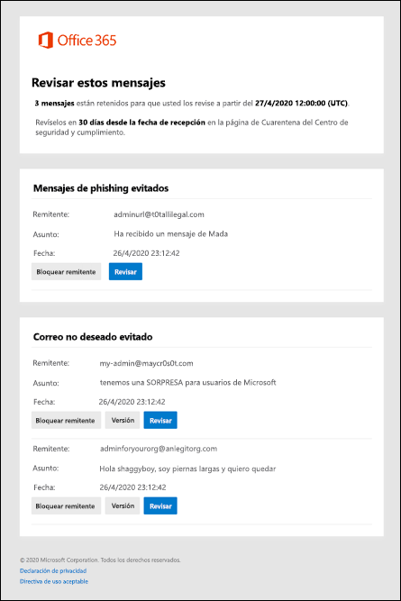

# Notificaciones de correo no deseado para el usuario final en Office 365End-user spam notifications in Office 365

La cuarentena retiene los mensajes que pueden ser peligrosos o no deseados en las organizaciones de Office 365 que tienen buzones de Exchange Online o en las organizaciones con Exchange Online Protection (EOP) independientes sin buzones de Exchange Online.Quarantine holds potentially dangerous or unwanted messages in Office 365 organizations with mailboxes in Exchange Online or standalone Exchange Online Protection (EOP) organizations without Exchange Online mailboxes. Para obtener más información, consulte [Cuarentena en Office 365](quarantine-email-messages.md).For more information, see [Quarantine in Office 365](quarantine-email-messages.md).

De forma predeterminada, las notificaciones de correo no deseado para el usuario final están deshabilitadas en las directivas contra correo no deseado.By default, end-user spam notifications are disabled in anti-spam policies. Cuando un administrador [habilita las notificaciones de correo no deseado para el usuario final](configure-your-spam-filter-policies.md), los destinatarios del mensaje recibirán notificaciones periódicas sobre sus mensajes que se pusieron en cuarentena como correo no deseado, correo electrónico masivo o (a partir de abril de 2020) phishing.When an admin [enables end-user spam notifications](configure-your-spam-filter-policies.md), message recipients will receive periodic notifications about their messages that were quarantined as spam, bulk email, or (as of April, 2020) phishing.

> [!NOTE]
> En octubre de 2019, eliminamos la capacidad de liberar los mensajes en cuarentena directamente de las notificaciones de correo no deseado para el usuario final.In October 2019, we removed the ability to release quarantined messages directly from end-user spam notifications. En su lugar, ahora los usuarios pueden ir al centro de cumplimiento de & de seguridad de Office 365 para liberar sus mensajes en cuarentena (ya sea directamente o haciendo clic en **revisar** en la notificación).Instead, users can now go to the Office 365 Security & Compliance Center to release their quarantined messages (either directly, or by clicking **Review** in the notification). Para obtener más información, vea [Buscar y liberar mensajes en cuarentena como un usuario en Office 365](find-and-release-quarantined-messages-as-a-user.md).For more information, see [Find and release quarantined messages as a user in Office 365](find-and-release-quarantined-messages-as-a-user.md).    Los mensajes que se pusieron en cuarentena como suplantación de identidad de alta confianza, malware o reglas de flujo de correo (también conocidas como reglas de transporte) solo están disponibles para los administradores.Messages that were quarantined as high confidence phishing, malware, or by mail flow rules (also known as transport rules) are only available to admins. Para obtener más información, consulte [Manage Quarantined messages and files as an admin in Office 365](manage-quarantined-messages-and-files.md).For more information, see [Manage quarantined messages and files as an admin in Office 365](manage-quarantined-messages-and-files.md).

Una notificación de correo no deseado para el usuario final contiene la siguiente información para cada mensaje en cuarentena:An end-user spam notification contains the following information for each quarantined message:

- **Sender**: el nombre de envío y la dirección de correo electrónico del mensaje en cuarentena.**Sender**: The send name and email address of the quarantined message.

- **Asunto**: el texto de la línea de asunto del mensaje en cuarentena.**Subject**: The subject line text of the quarantined message.

- **Fecha**: la fecha y hora (en UTC) en que el mensaje se ha puesto en cuarentena.**Date**: The date and time (in UTC) that the message was quarantined.

- **Bloquear remitente**: haga clic en este vínculo para agregar el remitente a la lista de remitentes bloqueados.**Block Sender**: Click this link to add the sender to your Blocked Senders list.

- **Revisión**: haga clic en este vínculo para ir a la cuarentena en el centro de seguridad & cumplimiento, donde puede liberar, eliminar o informar de los mensajes en cuarentena.**Review**: Click this link to go the the Quarantine in the Security & Compliance Center, where you can release, delete or report your quarantined messages.

