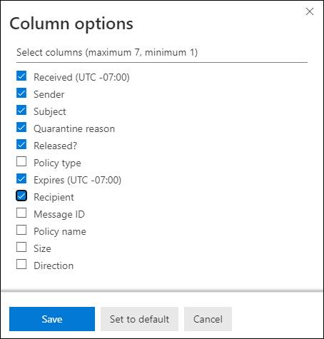

# <a name="view-and-release-quarantined-messages-from-shared-mailboxes"></a>Ver y liberar mensajes en cuarentena de buzones compartidos

> [!NOTE]
> Las características que se describen en este artículo están actualmente en versión preliminar, no están disponibles para todos los usuarios y están sujetas a cambios.

Los usuarios pueden administrar los mensajes en cuarentena donde son uno de los destinatarios, tal y como se describe en [Buscar y liberar mensajes en cuarentena como un usuario en EOP](find-and-release-quarantined-messages-as-a-user.md). Pero, ¿qué ocurre con los buzones compartidos en los que el usuario tiene permisos de acceso completo y enviar como o enviar en nombre de para el buzón como se describe en [buzones compartidos en Exchange Online](https://docs.microsoft.com/exchange/collaboration-exo/shared-mailboxes)?

Anteriormente, la capacidad de los usuarios de administrar los mensajes en cuarentena que se enviaron a los administradores de buzones compartidos para dejar la autoasignación habilitada para el buzón compartido (está habilitada de forma predeterminada cuando un administrador concede al usuario acceso a otro buzón). Sin embargo, según el tamaño y el número de buzones a los que el usuario tenga acceso, el rendimiento puede verse afectado porque los intentos de consulta para abrir *todos los* buzones a los que el usuario tiene acceso. Por este motivo, muchos administradores eligen [quitar la asignación automática de los buzones compartidos](https://docs.microsoft.com/outlook/troubleshoot/profiles-and-accounts/remove-automapping-for-shared-mailbox).

Ahora, la asignación automática ya no es necesaria para que los usuarios puedan administrar los mensajes en cuarentena que se enviaron a los buzones compartidos. Simplemente funciona. Hay dos métodos diferentes para acceder a los mensajes en cuarentena que se enviaron a un buzón compartido:

- Si el administrador ha [habilitado las notificaciones de correo no deseado para el usuario final](https://docs.microsoft.com/microsoft-365/security/office-365-security/configure-your-spam-filter-policies) en las directivas de correo no deseado, cualquier usuario que tenga acceso a las notificaciones de correo no deseado del usuario final en el buzón compartido podrá hacer clic en el botón **revisar** de la notificación para ir a cuarentena en el centro de seguridad & cumplimiento. Tenga en cuenta que este método sólo permite a los usuarios administrar los mensajes en cuarentena que se enviaron al buzón compartido. Los usuarios no pueden administrar sus propios mensajes de cuarentena en este contexto.

- El usuario puede [ir a la cuarentena en el centro de seguridad & cumplimiento](find-and-release-quarantined-messages-as-a-user.md). De forma predeterminada, solo se muestran los mensajes que se enviaron al usuario. Sin embargo, el usuario puede cambiar **los resultados de ordenación** (el **botón de identificador de mensaje** de forma predeterminada) por direcciones de **correo electrónico de destinatarios**, especificar la dirección de correo electrónico del buzón compartido y, a continuación, hacer clic en **Actualizar** para ver los mensajes en cuarentena que se enviaron al buzón compartido.

  

Independientemente del método, los usuarios pueden evitar la confusión al incluir la columna de **destinatarios** para los mensajes en cuarentena. El número máximo de columnas para mostrar es 7, por lo que el usuario tendrá que hacer clic en **modificar columnas**, quitar una columna existente (por ejemplo, **tipo de directiva**), seleccionar **destinatario** y, a continuación, hacer clic en **Guardar** o **Guardar como predeterminado**.

  

## <a name="things-to-keep-in-mind"></a>Aspectos importantes

- El primer usuario que actúe en el mensaje en cuarentena decide el destino del mensaje para todos los usuarios que usen el buzón compartido. Por ejemplo, si 10 usuarios acceden a un buzón compartido y un usuario decide eliminar el mensaje en cuarentena, el mensaje se elimina para los 10 usuarios. Del mismo modo, si un usuario decide liberar el mensaje, éste se publica en el buzón compartido y es accesible para todos los demás usuarios del buzón compartido.

- Actualmente, el botón **bloquear remitente** no está disponible en el control flotante de **detalles** para los mensajes en cuarentena que se enviaron al buzón compartido.

- Para administrar los mensajes en cuarentena para el buzón compartido en [Exchange Online PowerShell](https://docs.microsoft.com/powershell/exchange/connect-to-exchange-online-powershell), el usuario final deberá usar el cmdlet [Get-QuarantineMessage](https://docs.microsoft.com/powershell/module/exchange/get-quarantinemessage) con la dirección de correo electrónico del buzón compartido para el valor del parámetro _RecipientAddress_ para identificar los mensajes. Por ejemplo:

  ```powershell
  Get-QuarantinedMessage -RecipientAddress officeparty@contoso.com
  ```

  A continuación, el usuario final puede seleccionar un mensaje en cuarentena de la lista para ver o realizar acciones en.

  En este ejemplo se muestran todos los mensajes en cuarentena que se enviaron al buzón compartido y, a continuación, se libera el primer mensaje de la lista de cuarentena (el primer mensaje de la lista es 0, el segundo es 1, y así sucesivamente).

  ```powershell
  $SharedMessages = Get-QuarantinedMessage -RecipientAddress officeparty@contoso.com | select -ExpandProperty Identity
  $SharedMessages
  Release-QuarantinedMessage -Identity $SharedMessages[0]
  ```

  Para obtener información detallada acerca de la sintaxis y los parámetros, consulte los siguientes temas:

  - [Get-QuarantineMessage](https://docs.microsoft.com/powershell/module/exchange/get-quarantinemessage)
  - [Get-QuarantineMessageHeader](https://docs.microsoft.com/powershell/module/exchange/get-quarantinemessageheader)
  - [Vista previa de QuarantineMessage](https://docs.microsoft.com/powershell/module/exchange/preview-quarantinemessage)
  - [Versión-QuarantineMessage](https://docs.microsoft.com/powershell/module/exchange/release-quarantinemessage)
