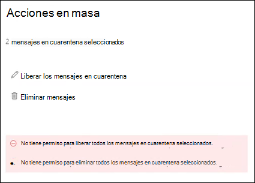

# <a name="view-and-release-quarantined-messages-from-shared-mailboxes"></a><span data-ttu-id="3c622-103">Ver y liberar mensajes en cuarentena de buzones compartidos</span><span class="sxs-lookup"><span data-stu-id="3c622-103">View and release quarantined messages from shared mailboxes</span></span>

> [!NOTE]
> <span data-ttu-id="3c622-104">Las características que se describen en este artículo están actualmente en versión preliminar, no están disponibles para todos los usuarios y están sujetas a cambios.</span><span class="sxs-lookup"><span data-stu-id="3c622-104">The features that are described in this article are currently in Preview, aren't available to everyone, and are subject to change.</span></span>

<span data-ttu-id="3c622-105">Los usuarios pueden administrar los mensajes en cuarentena donde son uno de los destinatarios, tal y como se describe en [Buscar y liberar mensajes en cuarentena como un usuario en EOP](find-and-release-quarantined-messages-as-a-user.md).</span><span class="sxs-lookup"><span data-stu-id="3c622-105">Users can manage quarantined messages where they are one of the recipients as described in [Find and release quarantined messages as a user in EOP](find-and-release-quarantined-messages-as-a-user.md).</span></span> <span data-ttu-id="3c622-106">Pero, ¿qué ocurre con los buzones compartidos en los que el usuario tiene permisos de acceso completo y enviar como o enviar en nombre de para el buzón como se describe en [buzones compartidos en Exchange Online](https://docs.microsoft.com/exchange/collaboration-exo/shared-mailboxes)?</span><span class="sxs-lookup"><span data-stu-id="3c622-106">But what about shared mailboxes where the user has Full Access and Send As or Send on Behalf permissions to the mailbox as described in [Shared mailboxes in Exchange Online](https://docs.microsoft.com/exchange/collaboration-exo/shared-mailboxes)?</span></span>

<span data-ttu-id="3c622-107">Anteriormente, la capacidad de los usuarios de administrar los mensajes en cuarentena que se enviaron a los administradores de buzones compartidos para dejar la autoasignación habilitada para el buzón compartido (está habilitada de forma predeterminada cuando un administrador concede al usuario acceso a otro buzón).</span><span class="sxs-lookup"><span data-stu-id="3c622-107">Previously, the ability for users to manage quarantined messages sent to a shared mailbox required admins to leave automapping enabled for the shared mailbox (it's enabled by default when an admin gives a user access to another mailbox).</span></span> <span data-ttu-id="3c622-108">Sin embargo, según el tamaño y el número de buzones a los que el usuario tenga acceso, el rendimiento puede verse afectado porque los intentos de consulta para abrir *todos los* buzones a los que el usuario tiene acceso.</span><span class="sxs-lookup"><span data-stu-id="3c622-108">However, depending on the size and number of mailboxes that the user has access to, performance can suffer as Outlooks tries to open *all* mailboxes that the user has access to.</span></span> <span data-ttu-id="3c622-109">Por este motivo, muchos administradores eligen [quitar la asignación automática de los buzones compartidos](https://docs.microsoft.com/outlook/troubleshoot/profiles-and-accounts/remove-automapping-for-shared-mailbox).</span><span class="sxs-lookup"><span data-stu-id="3c622-109">For this reason, many admins choose to [remove automapping for shared mailboxes](https://docs.microsoft.com/outlook/troubleshoot/profiles-and-accounts/remove-automapping-for-shared-mailbox).</span></span>

<span data-ttu-id="3c622-110">Ahora, la asignación automática ya no es necesaria para que los usuarios puedan administrar los mensajes en cuarentena que se enviaron a los buzones compartidos.</span><span class="sxs-lookup"><span data-stu-id="3c622-110">Now, automapping is no longer required for users to manage quarantined messages that were sent to shared mailboxes.</span></span> <span data-ttu-id="3c622-111">Simplemente funciona.</span><span class="sxs-lookup"><span data-stu-id="3c622-111">It just works.</span></span> <span data-ttu-id="3c622-112">Hay dos métodos diferentes para acceder a los mensajes en cuarentena que se enviaron a un buzón compartido:</span><span class="sxs-lookup"><span data-stu-id="3c622-112">There are two different methods to access quarantined messages that were sent to a shared mailbox:</span></span>

- <span data-ttu-id="3c622-113">Si el administrador ha [habilitado las notificaciones de correo no deseado para el usuario final](https://docs.microsoft.com/microsoft-365/security/office-365-security/configure-your-spam-filter-policies) en las directivas de correo no deseado, cualquier usuario que tenga acceso a las notificaciones de correo no deseado del usuario final en el buzón compartido podrá hacer clic en el botón **revisar** de la notificación para ir a cuarentena en el centro de seguridad & cumplimiento.</span><span class="sxs-lookup"><span data-stu-id="3c622-113">If the admin has [enabled end-user spam notifications](https://docs.microsoft.com/microsoft-365/security/office-365-security/configure-your-spam-filter-policies) in anti-spam policies, any user that has access to the end-user spam notifications in the shared mailbox can click the **Review** button in the notification to go to quarantine in the Security & Compliance Center.</span></span> <span data-ttu-id="3c622-114">Tenga en cuenta que este método sólo permite a los usuarios administrar los mensajes en cuarentena que se enviaron al buzón compartido.</span><span class="sxs-lookup"><span data-stu-id="3c622-114">Note that this method only allows users to manage quarantined messages that were sent to the shared mailbox.</span></span> <span data-ttu-id="3c622-115">Los usuarios no pueden administrar sus propios mensajes de cuarentena en este contexto.</span><span class="sxs-lookup"><span data-stu-id="3c622-115">Users can't manage their own quarantine messages in this context.</span></span>

- <span data-ttu-id="3c622-116">El usuario puede [ir a la cuarentena en el centro de seguridad & cumplimiento](find-and-release-quarantined-messages-as-a-user.md).</span><span class="sxs-lookup"><span data-stu-id="3c622-116">The user can [go to the quarantine in the Security & Compliance Center](find-and-release-quarantined-messages-as-a-user.md).</span></span> <span data-ttu-id="3c622-117">De forma predeterminada, solo se muestran los mensajes que se enviaron al usuario.</span><span class="sxs-lookup"><span data-stu-id="3c622-117">By default, only messages that were sent to the user are shown.</span></span> <span data-ttu-id="3c622-118">Sin embargo, el usuario puede cambiar **los resultados de ordenación** (el **botón de identificador de mensaje** de forma predeterminada) por direcciones de **correo electrónico de destinatarios**, especificar la dirección de correo electrónico del buzón compartido y, a continuación, hacer clic en **Actualizar** para ver los mensajes en cuarentena que se enviaron al buzón compartido.</span><span class="sxs-lookup"><span data-stu-id="3c622-118">However, the user can change the **Sort results** (the **Message ID button** by default) to **Recipient email address**, enter the shared mailbox email address, and then click **Refresh** to see the quarantined messages that were sent to the shared mailbox.</span></span>

  

<span data-ttu-id="3c622-120">Independientemente del método, los usuarios pueden evitar la confusión al incluir la columna de **destinatarios** para los mensajes en cuarentena.</span><span class="sxs-lookup"><span data-stu-id="3c622-120">Regardless of the method, users can avoid confusion by including the **Recipient** column for quarantined messages.</span></span> <span data-ttu-id="3c622-121">El número máximo de columnas para mostrar es 7, por lo que el usuario tendrá que hacer clic en **modificar columnas**, quitar una columna existente (por ejemplo, **tipo de directiva**), seleccionar **destinatario** y, a continuación, hacer clic en **Guardar** o **Guardar como predeterminado**.</span><span class="sxs-lookup"><span data-stu-id="3c622-121">The maximum number of columns to display is 7, so the user will need to click **Modify columns**, remove an existing column (for example, **Policy type**), select **Recipient**, and then click **Save** or **Save as default**.</span></span>

  

## <a name="things-to-keep-in-mind"></a><span data-ttu-id="3c622-123">Aspectos importantes</span><span class="sxs-lookup"><span data-stu-id="3c622-123">Things to keep in mind</span></span>

- <span data-ttu-id="3c622-124">El primer usuario que actúe en el mensaje en cuarentena decide el destino del mensaje para todos los usuarios que usen el buzón compartido.</span><span class="sxs-lookup"><span data-stu-id="3c622-124">The first user to act on the quarantined message decides the fate of the message for everyone who uses the shared mailbox.</span></span> <span data-ttu-id="3c622-125">Por ejemplo, si 10 usuarios acceden a un buzón compartido y un usuario decide eliminar el mensaje en cuarentena, el mensaje se elimina para los 10 usuarios.</span><span class="sxs-lookup"><span data-stu-id="3c622-125">For example, if a shared mailbox is accessed by 10 users, and a user decides to delete the quarantine message, the message is deleted for all 10 users.</span></span> <span data-ttu-id="3c622-126">Del mismo modo, si un usuario decide liberar el mensaje, éste se publica en el buzón compartido y es accesible para todos los demás usuarios del buzón compartido.</span><span class="sxs-lookup"><span data-stu-id="3c622-126">Likewise, if a user decides to release the message, it's released to the shared mailbox and is accessible by all other users of the shared mailbox.</span></span>

- <span data-ttu-id="3c622-127">Actualmente, si un usuario selecciona varios mensajes en cuarentena que se enviaron al buzón compartido, se devuelven los siguientes errores de confusión cuando el usuario hace clic en **mensajes de liberación** o **elimina mensajes** en el control flotante **acciones en masa** :</span><span class="sxs-lookup"><span data-stu-id="3c622-127">Currently, if a user selects multiple quarantined messages that were sent to the shared mailbox, the following misleading errors are returned when the user clicks **Release messages** or **Delete messages** in the **Bulk actions** flyout:</span></span>

  > <span data-ttu-id="3c622-128">No tiene permiso para liberar todos los mensajes en cuarentena seleccionados.</span><span class="sxs-lookup"><span data-stu-id="3c622-128">You do not have permission to release all selected quarantined messages.</span></span>
  >
  > <span data-ttu-id="3c622-129">No tiene permiso para eliminar todos los mensajes en cuarentena seleccionados.</span><span class="sxs-lookup"><span data-stu-id="3c622-129">You do not have permission to delete all selected quarantined messages.</span></span>

  <span data-ttu-id="3c622-130">Independientemente del error, la acción se lleva a cabo en los mensajes y el error se puede omitir.</span><span class="sxs-lookup"><span data-stu-id="3c622-130">Regardless of the error, the action is taken on the messages, and the error can be ignored.</span></span>

  

- <span data-ttu-id="3c622-132">Actualmente, el botón **bloquear remitente** no está disponible en el control flotante de **detalles** para los mensajes en cuarentena que se enviaron al buzón compartido.</span><span class="sxs-lookup"><span data-stu-id="3c622-132">Currently, the **Block sender** button is not available in the **Details** flyout for quarantined messages that were sent to the shared mailbox.</span></span>

- <span data-ttu-id="3c622-133">Para administrar los mensajes en cuarentena para el buzón compartido en [Exchange Online PowerShell](https://docs.microsoft.com/powershell/exchange/connect-to-exchange-online-powershell), el usuario final deberá usar el cmdlet [Get-QuarantineMessage](https://docs.microsoft.com/powershell/module/exchange/get-quarantinemessage) con la dirección de correo electrónico del buzón compartido para el valor del parámetro _RecipientAddress_ para identificar los mensajes.</span><span class="sxs-lookup"><span data-stu-id="3c622-133">To manage quarantined messages for the shared mailbox in [Exchange Online PowerShell](https://docs.microsoft.com/powershell/exchange/connect-to-exchange-online-powershell), the end-user will need to use the [Get-QuarantineMessage](https://docs.microsoft.com/powershell/module/exchange/get-quarantinemessage) cmdlet with shared mailbox email address for the value of the _RecipientAddress_ parameter to identify the messages.</span></span> <span data-ttu-id="3c622-134">Por ejemplo:</span><span class="sxs-lookup"><span data-stu-id="3c622-134">For example:</span></span>

  ```powershell
  Get-QuarantinedMessage -RecipientAddress officeparty@contoso.com
  ```

  <span data-ttu-id="3c622-135">A continuación, el usuario final puede seleccionar un mensaje en cuarentena de la lista para ver o realizar acciones en.</span><span class="sxs-lookup"><span data-stu-id="3c622-135">Then, the end-user can select a quarantined message from the list to view or take action on.</span></span>

  <span data-ttu-id="3c622-136">En este ejemplo se muestran todos los mensajes en cuarentena que se enviaron al buzón compartido y, a continuación, se libera el primer mensaje de la lista de cuarentena (el primer mensaje de la lista es 0, el segundo es 1, y así sucesivamente).</span><span class="sxs-lookup"><span data-stu-id="3c622-136">This example shows all of the quarantined messages that were sent to the shared mailbox, and then releases the first message in the list from quarantine (the first message in the list is 0, the second is 1, and so on).</span></span>

  ```powershell
  $SharedMessages = Get-QuarantinedMessage -RecipientAddress officeparty@contoso.com | select -ExpandProperty Identity
  $SharedMessages
  Release-QuarantinedMessage -Identity $SharedMessages[0]
  ```

  <span data-ttu-id="3c622-137">Para obtener información detallada acerca de la sintaxis y los parámetros, consulte los siguientes temas:</span><span class="sxs-lookup"><span data-stu-id="3c622-137">For detailed syntax and parameter information, see the following topics:</span></span>

  - [<span data-ttu-id="3c622-138">Get-QuarantineMessage</span><span class="sxs-lookup"><span data-stu-id="3c622-138">Get-QuarantineMessage</span></span>](https://docs.microsoft.com/powershell/module/exchange/get-quarantinemessage)
  - [<span data-ttu-id="3c622-139">Get-QuarantineMessageHeader</span><span class="sxs-lookup"><span data-stu-id="3c622-139">Get-QuarantineMessageHeader</span></span>](https://docs.microsoft.com/powershell/module/exchange/get-quarantinemessageheader)
  - [<span data-ttu-id="3c622-140">Vista previa de QuarantineMessage</span><span class="sxs-lookup"><span data-stu-id="3c622-140">Preview-QuarantineMessage</span></span>](https://docs.microsoft.com/powershell/module/exchange/preview-quarantinemessage)
  - [<span data-ttu-id="3c622-141">Versión-QuarantineMessage</span><span class="sxs-lookup"><span data-stu-id="3c622-141">Release-QuarantineMessage</span></span>](https://docs.microsoft.com/powershell/module/exchange/release-quarantinemessage)
