# Ver informes de seguridad de correo electrónico en el Centro de seguridad y cumplimientoView email security reports in the Security & Compliance Center

Hay disponibles varios informes en el centro de [seguridad & cumplimiento](https://protection.office.com) para ayudarle a ver cómo las características de seguridad del correo electrónico, como las características contra correo electrónico no deseado, antimalware y de cifrado de Microsoft 365 están protegiendo su organización.A variety of reports are available in the [Security & Compliance Center](https://protection.office.com) to help you see how email security features, such as anti-spam, anti-malware, and encryption features in Microsoft 365 are protecting your organization. Si dispone de los [permisos necesarios](#what-permissions-are-needed-to-view-these-reports), puede ver estos informes en el centro de seguridad & cumplimiento desde el panel de **informes** \> **Dashboard**.If you have the [necessary permissions](#what-permissions-are-needed-to-view-these-reports), you can view these reports in the Security & Compliance Center by going to **Reports** \> **Dashboard**. Para ir directamente al panel informes, Abra <https://protection.office.com/insightdashboard> .To go directly to the Reports dashboard, open <https://protection.office.com/insightdashboard>.

## Informe de usuarios comprometidosCompromised users report

> [!NOTE]
> Este informe está disponible en Microsoft 365 organizaciones con buzones de correo de Exchange Online.This report is available in Microsoft 365 organizations with Exchange Online mailboxes. No está disponible en organizaciones independientes de Exchange Online Protection (EOP).It's not available in standalone Exchange Online Protection (EOP) organizations.

El informe de **usuarios comprometedos** muestra el número de cuentas de usuario que se marcaron como **sospechosas** o **restringidas** en los últimos 7 días.The **Compromised users** report shows shows the number of user accounts that were marked as **Suspicious** or **Restricted** within the last 7 days. Las cuentas en cualquiera de estos Estados son problemáticas o incluso comprometidas.Accounts in either of these states are problematic or even compromised. Con el uso frecuente, puede usar el informe para identificar picos e incluso tendencias, en cuentas sospechosas o restringidas.With frequent use, you can use the report to spot spikes, and even trends, in suspicious or restricted accounts. Para obtener más información acerca de los usuarios comprometidos, consulte [responder a una cuenta de correo electrónico en peligro](responding-to-a-compromised-email-account.md).For more information about compromised users, see [Responding to a compromised email account](responding-to-a-compromised-email-account.md).

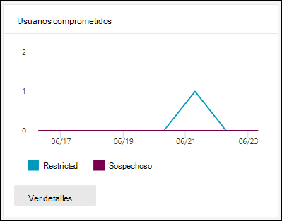

La vista agregada muestra los datos de los últimos 90 días y la vista de detalles muestra los datos de los últimos 30 días.The aggregate view shows data for the last 90 days and the detail view shows data for the last 30 days.

Para ver el informe, abra el [centro de seguridad & cumplimiento](https://protection.office.com), vaya **Reports** al \> **Panel** informes y seleccione **usuarios comprometidos**.To view the report, open the [Security & Compliance Center](https://protection.office.com), go to **Reports** \> **Dashboard** and select **Compromised users**. Para ir directamente al informe, Abra <https://protection.office.com/reportv2?id=CompromisedUsers> .To go directly to the report, open <https://protection.office.com/reportv2?id=CompromisedUsers>.

Puede filtrar tanto el gráfico como la tabla de detalles haciendo clic en **filtros** y seleccionando uno o más de los siguientes valores:You can filter both the chart and the details table by clicking **Filters** and selecting one or more of the following values:

- **Fecha de inicio** y **fecha de finalización****Start date** and **End date**

- **Sospechoso**: la cuenta de usuario ha enviado un mensaje de correo electrónico sospechoso y corre el riesgo de que se restrinja el envío de correo electrónico.**Suspicious**: The user account has sent suspicious email and is at risk of being restricted from sending email.

- **Restringido**: se ha restringido el envío de correo electrónico a la cuenta de usuario debido a patrones muy sospechosos.**Restricted**: The user account has been restricted from sending email due to highly suspicious patterns.

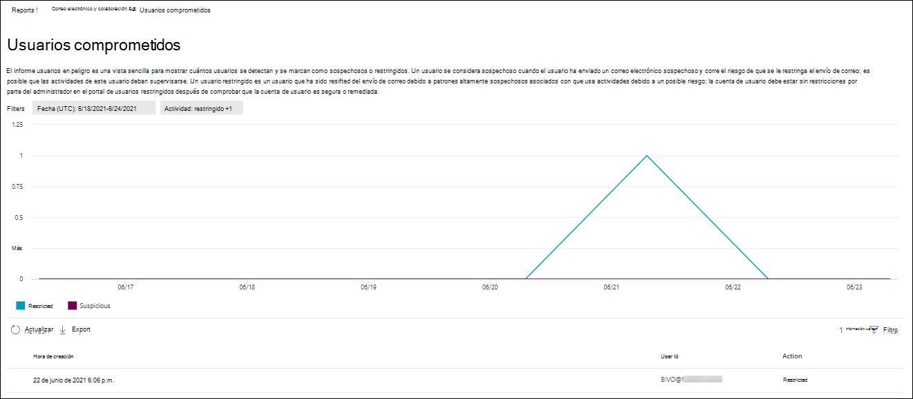

Si hace clic en **ver tabla de detalles**, puede ver los siguientes detalles:If you click **View details table**, you can see the following details:

- **Hora de creación****Creation time**
- **Nombre de usuario****User ID**
- **Acción****Action**

Para volver a la vista de informe, haga clic en **Ver informe**.To go back to the report view, click **View report**.

## Informe de cifradoEncryption report

El **Informe de cifrado** está disponible en EOP (suscripciones con buzones en Exchange online o EOP independiente sin buzones de Exchange Online).The **Encryption report** is available in EOP (subscriptions with mailboxes in Exchange Online or standalone EOP without Exchange Online mailboxes). El equipo de seguridad de la organización puede usar la información de este informe para identificar patrones y aplicar de forma proactiva o ajustar las directivas de los mensajes de correo electrónico confidenciales.Your organization's security team can use information in this report to identify patterns and proactively apply or adjust policies for sensitive email messages. Por ejemplo:For example:

- Si ve un gran número de mensajes de correo electrónico cifrados por los usuarios, es posible que desee agregar una directiva de cifrado para automatizar el cifrado para determinados casos de uso.If you see a high number of email messages encrypted by users, you might want to add an encryption policy to automate encryption for certain use cases. Para obtener más información, vea [definir reglas de flujo de correo para cifrar mensajes de correo electrónico en Microsoft 365](../../compliance/define-mail-flow-rules-to-encrypt-email.md).For more information, see [Define mail flow rules to encrypt email messages in Microsoft 365](../../compliance/define-mail-flow-rules-to-encrypt-email.md).

- Si tiene varias plantillas de cifrado disponibles pero nadie las está usando, puede explorar si los usuarios necesitan formación de características.If you have a number of encryption templates available but no one is using them, you might explore whether users need feature training.

La vista agregada permite filtrar los últimos 90 días, mientras que la vista de detalles permite el filtrado durante 10 días.The aggregate view allows filtering for the last 90 days, while the detail view allows filtering for 10 days.

Para ver el informe, abra el [centro de seguridad & cumplimiento](https://protection.office.com), vaya **Reports** al \> **Panel** informes y seleccione **Informe de cifrado**.To view the report, open the [Security & Compliance Center](https://protection.office.com), go to **Reports** \> **Dashboard** and select **Encryption report**. Para ir directamente al informe, Abra <https://protection.office.com/reportv2?id=EncryptionReport> .To go directly to the report, open <https://protection.office.com/reportv2?id=EncryptionReport>.

Para obtener más información sobre el cifrado, consulte [cifrado de correo electrónico en Microsoft 365](../../compliance/email-encryption.md).To learn more about encryption, see [Email encryption in Microsoft 365](../../compliance/email-encryption.md).

### Vista informes para el informe de cifradoReport view for the Encryption report

Puede usar los siguientes filtros en el gráfico:You can use the following filters on the chart:

- **Ver datos por: informe de cifrado de mensajes** y **desglose descendente por: método de cifrado**: están disponibles los siguientes métodos de cifrado:**View data by: Message Encryption Report** and **Break down by: Encryption method**: The following encryption methods are available:

  - **Cifrado por usuario****Encryption by user**
  - **Cifrado por directiva****Encryption by policy**

  Si hace clic en **filtros**, puede modificar el gráfico con los siguientes filtros:If you click **Filters**, you can modify the chart with the following filters:

  - **Fecha de inicio** y **fecha de finalización****Start date** and **End date**
  - Método de cifrado.Encryption method.
  - Plantilla de cifrado.Encryption template.

- **Ver datos por: informe de cifrado de mensajes** y **desglosar por: plantilla de cifrado**: están disponibles los siguientes métodos de cifrado:**View data by: Message Encryption Report** and **Break down by: Encryption template**: The following encryption methods are available:

  - **No reenviar****Do not forward**
  - **Cifrar solo****Encrypt only**
  - **OME anterior****OME previous**
  - **Personalizados****Custom**

  Si hace clic en **filtros**, puede modificar el gráfico con los siguientes filtros:If you click **Filters**, you can modify the chart with the following filters:

  - **Fecha de inicio** y **fecha de finalización****Start date** and **End date**
  - Método de cifradoEncryption method
  - Plantilla de cifradoEncryption template

- **Ver datos por: los 5 dominios de destinatarios principales**: esta vista muestra un gráfico circular con recuentos de mensajes enviados para los 5 principales dominios de destinatarios.**View data by: Top 5 recipient domains**: This view shows a pie chart with sent message counts for the top 5 recipient domains.

  Si hace clic en **filtros**, puede seleccionar una **fecha de inicio** y una fecha de **finalización**.If you click **Filters**, you can select a **Start date** and **End date**.

### Vista de tabla de detalles para el informe de cifradoDetails table view for the Encryption report

Si hace clic en **ver tabla de detalles**, la información que se muestra depende del gráfico que estaba viendo:If you click **View details table**, the information that's shown depends on the chart you were looking at:

- **Dividir por: método de cifrado** o **desglosar por: plantilla de cifrado**: se muestra la siguiente información:**Break down by: Encryption method** or **Break down by: Encryption template**: The following information is shown:

  - **Fecha****Date**
  - **Dirección del remitente****Sender address**
  - **Plantilla de cifrado****Encryption template**
  - **Método de cifrado****Encryption method**
  - **Dirección del destinatario****Recipient address**
  - **Asunto****Subject**

- **Ver datos por: los 5 dominios de destinatarios principales**:**View data by: Top 5 recipient domains**:

  - **Fecha****Date**
  - **Dominio del destinatario****Recipient domain**
  - **Número de mensajes****Message count**
  
Si hace clic en **filtros** en una vista de tabla de detalles, puede modificar los resultados con los filtros siguientes:If you click **Filters** in a details table view, you can modify the results with the following filters:

- **Fecha de inicio** y **fecha de finalización****Start date** and **End date**
- Método de cifradoEncryption method
- Plantilla de cifradoEncryption template

Para volver a la vista de informe, haga clic en **Ver informe**.To go back to the report view, click **View report**.

## Informe de estado de flujo de notificaciónMailflow status report

El **Informe de estado de flujo** de correo contiene información sobre malware, correo no deseado, phishing y mensajes bloqueados del servidor perimetral.The **Mailflow status report** contains information about malware, spam, phishing and edge blocked messages. Para obtener más información, consulte [Informe de estado de flujo](view-mail-flow-reports.md#mailflow-status-report)de datos.For more details, see [Mailflow status report](view-mail-flow-reports.md#mailflow-status-report).

## Informe de detecciones de malware en correo electrónicoMalware detections in email report

El informe **de detecciones de malware en el informe de correo electrónico** muestra información sobre las detecciones de malware en los mensajes entrantes y salientes (malware detectado por Exchange Online Protection o EOP).The **Malware detections in email** report shows information about malware detections in incoming and outgoing email messages (malware detected by Exchange Online Protection or EOP). Para obtener más información acerca de la protección contra malware en EOP, vea [Anti-Malware Protection in EOP](anti-malware-protection.md).For more information about malware protection in EOP, see [Anti-malware protection in EOP](anti-malware-protection.md).

 El filtro de vista agregado permite 90 días, mientras que el filtro de tabla de detalles sólo permite 10 días.The aggregate view filter allows for 90 days, while the details table filter only allows for 10 days.

Para ver el informe, abra el [centro de seguridad & cumplimiento](https://protection.office.com), vaya **Reports** al \> **Panel** informes y seleccione **detecciones de malware en correo electrónico**.To view the report, open the [Security & Compliance Center](https://protection.office.com), go to **Reports** \> **Dashboard** and select **Malware detections in email**. Para ir directamente al informe, Abra <https://protection.office.com/reportv2?id=MalwareDetections> .To go directly to the report, open <https://protection.office.com/reportv2?id=MalwareDetections>.

Puede filtrar tanto el gráfico como la tabla de detalles haciendo clic en **filtros** y seleccionando:You can filter both the chart and the details table by clicking **Filters** and selecting:

- **Fecha de inicio** y **fecha de finalización****Start date** and **End date**
- **Entrada****Inbound**
- **Saliente****Outbound**

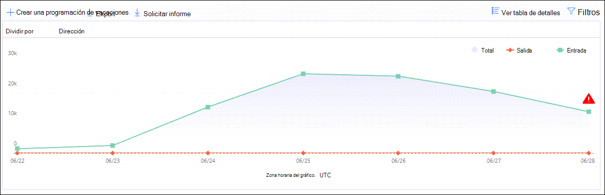

Si hace clic en **ver tabla de detalles**, puede ver los siguientes detalles:If you click **View details table**, you can see the following details:

- **Fecha****Date**
- **Dirección del remitente****Sender address**
- **Dirección del destinatario****Recipient address**
- **Identificador del mensaje**: disponible en el campo de encabezado del **identificador del mensaje** en el encabezado del mensaje y debe ser único.**Message ID**: Available in the **Message-ID** header field in the message header and should be unique. Un valor de ejemplo es `<08f1e0f6806a47b4ac103961109ae6ef@server.domain>` (observe los corchetes angulares).An example value is `<08f1e0f6806a47b4ac103961109ae6ef@server.domain>` (note the angle brackets).
- **Asunto****Subject**
- **Filename****Filename**
- **Nombre del malware****Malware name**

Para volver a la vista de informe, haga clic en **Ver informe**.To go back to the report view, click **View report**.

## Informe de correo electrónico enviado y recibidoSent and received email report

El informe de **correo electrónico enviado y recibido** contiene información sobre malware, correo no deseado, reglas de flujo de correo (también conocidos como reglas de transporte) y detecciones de malware avanzadas una vez que el correo electrónico entra en el servicio.The **Sent and received email** report contains information about malware, spam, mail flow rules (also known as transport rules), and advanced malware detections after email enters the service. Para obtener más información, consulte [Informe de correo electrónico enviado y recibido](view-mail-flow-reports.md#sent-and-received-email-report).For more information, see [Sent and received email report](view-mail-flow-reports.md#sent-and-received-email-report).

## Informe de detecciones de correo no deseadoSpam detections report

El informe de **detecciones de correo no deseado** muestra mensajes de correo electrónico no deseado bloqueados por EOP.The **Spam detections** report shows spam email messages that were blocked by EOP. Los mensajes se cuentan de forma individual, no por destinatario.Messages are counted individually, not per recipient. Por ejemplo, si se envió el mismo mensaje de correo no deseado a 100 destinatarios de la organización, se cuenta como un mensaje.For example, if the same spam message was sent to 100 recipients in your organization, it counts as one message.

La vista agregada permite el filtrado de 90 días, mientras que la tabla de detalles permite el filtrado de 10 días.The aggregate view allows for 90 days filtering, while the details table allows for 10 days filtering.

Para ver el informe, abra el [centro de seguridad & cumplimiento](https://protection.office.com), vaya **Reports** al \> **Panel** informes y seleccione **detecciones de correo no deseado**.To view the report, open the [Security & Compliance Center](https://protection.office.com), go to **Reports** \> **Dashboard** and select **Spam detections**. Para ir directamente al informe, Abra <https://protection.office.com/reportv2?id=SpamDetections> .To go directly to the report, open <https://protection.office.com/reportv2?id=SpamDetections>.

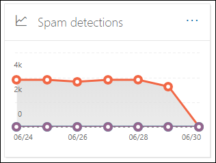

Para obtener más información acerca de la protección contra correo no deseado, vea [protección contra correo no deseado en EOP](anti-spam-protection.md).For more information about anti-spam protection, see [Anti-spam protection in EOP](anti-spam-protection.md).

### Vista informes para el informe de detecciones de correo no deseadoReport view for the Spam detections report

Los siguientes gráficos están disponibles en la vista de informe:The following charts are available in the report view:

- **Dividir por: acción**: se muestran los siguientes tipos de eventos:**Break down by: Action**: The following event types are shown:

  - **Contenido de correo no deseado filtrado****Spam content filtered**
  - **Bloqueo de IP de correo no deseado****Spam IP block**
  - **Bloque de sobre de correo no deseado****Spam envelope block**
  - **Filtro de DBEB de correo no deseado**: bloqueo perimetral basado en directorios (DBEB)**Spam DBEB filter**: Directory based edge blocking (DBEB)

  Al pasar el mouse por encima de un día (punto de datos) en el gráfico, puede ver cuántos elementos se bloquearon ese día, así como la forma en que se clasifican dichos elementos.When you hover over a day (data point) in the chart, you can see how many items were blocked that day, as well as how those items are categorized.

  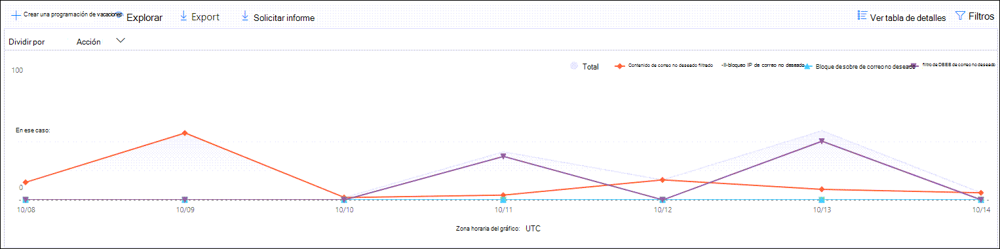

- **Desglose por: dirección**: se muestran las siguientes direcciones:**Break down by:Direction**: The following directions are shown:

  - **Entrada****Inbound**
  - **Saliente****Outbound**

  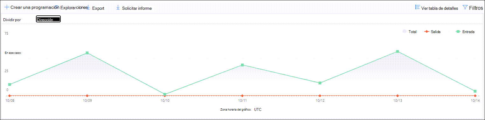

Si hace clic en **filtros** en una vista de informe, puede modificar los resultados con los siguientes filtros:If you click **Filters** in a report view, you can modify the results with the following filters:

- **Fecha de inicio** y **fecha de finalización****Start date** and **End date**
- Valores de direcciónDirection values
- Valores de tipo de eventoEvent type values

### Vista de tabla de detalles para el informe de detecciones de correo no deseadoDetails table view for the Spam detections report

Si hace clic en **ver tabla de detalles** en cualquier vista de informe, se mostrará la siguiente información:If you click **View details table** in any report view, the following information is shown:

- **Fecha****Date**
- **Dirección del remitente****Sender address**
- **Dirección del destinatario****Recipient address**
- **Tipo de evento****Event type**
- **Acción****Action**
- **Asunto****Subject**

Si hace clic en **filtros** en una tabla de detalles, puede modificar los resultados con los filtros siguientes:If you click **Filters** in a details table, you can modify the results with the following filters:

- **Fecha de inicio** y **fecha de finalización****Start date** and **End date**
- Valores de direcciónDirection values
- Valores de tipo de eventoEvent type values

Para volver a la vista de informe, haga clic en **Ver informe**.To go back to the report view, click **View report**.

## Informe de detecciones de suplantación de identidadSpoof detections report

El informe de **detecciones de suplantación de identidad** muestra el número de mensajes de correo falsificados que se han detectado y de aquellos que se consideran "buenos" (correo falsificado realizado por razones empresariales legítimas).The **Spoof detections** report shows how many spoof mail messages were detected, and of those, which ones were considered "good" (spoof mail done for legitimate business reasons). Para obtener más información sobre la suplantación de identidad, vea [anti-spoofing Protection in EOP](anti-spoofing-protection.md).For more information about spoofing, see [Anti-spoofing protection in EOP](anti-spoofing-protection.md).

La vista agregada del informe permite 90 días de filtrado, mientras que la vista de detalles sólo permite diez días de filtrado.The aggregate view of the report allows for 90 days of filtering, while the detail view only allows for ten days of filtering.

Para ver el informe, abra el [centro de seguridad & cumplimiento](https://protection.office.com), vaya **Reports** al \> **Panel** informes y seleccione **detecciones de suplantación de identidad**.To view the report, open the [Security & Compliance Center](https://protection.office.com), go to **Reports** \> **Dashboard** and select **Spoof detections**. Para ir directamente al informe, Abra <https://protection.office.com/reportv2?id=SpoofMailReport> .To go directly to the report, open <https://protection.office.com/reportv2?id=SpoofMailReport>.

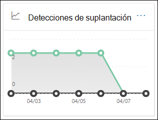

Al pasar el mouse por encima de un día (punto de datos) en el gráfico, puede ver cuántos mensajes de correo electrónico de falsificación llegaron.When you hover over a day (data point) in the chart, you can see how many spoof mail messages came through.

Puede filtrar tanto el gráfico como la tabla de detalles haciendo clic en **filtros** y seleccionando uno o más de los siguientes valores:You can filter both the chart and the details table by clicking **Filters** and selecting one or more of the following values:

- **Fecha de inicio** y **fecha de finalización****Start date** and **End date**

- **Correo bueno****Good mail**

- **Detectado como correo no deseado****Caught as spam**

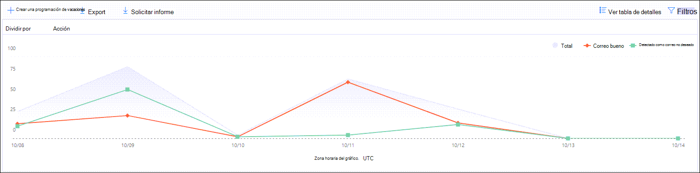

Si hace clic en **ver tabla de detalles**, puede ver los siguientes detalles:If you click **View details table**, you can see the following details:

- **Fecha****Date**
- **Remitente falsificado****Spoofed sender**
- **Auténtico remitente****True sender**
- **IP del remitente****Sender IP**
- **Acción****Action**
- **Número de mensajes****Message count**

Para volver a la vista de informe, haga clic en **Ver informe**.To go back to the report view, click **View report**.

## Informe de estado de protección contra amenazasThreat protection status report

El informe de **Estado de protección contra amenazas** está disponible en EOP y en Office 365 ATP; sin embargo, los informes contienen datos diferentes.The **Threat protection status** report is available in both EOP and Office 365 ATP; however, the reports contain different data. Por ejemplo, los clientes de EOP pueden ver información sobre malware detectado en el correo electrónico, pero no información sobre [los archivos malintencionados detectados en SharePoint Online, OneDrive o Microsoft Teams](atp-for-spo-odb-and-teams.md).For example, EOP customers can view information about malware detected in email, but not information about [malicious files detected in SharePoint Online, OneDrive, or Microsoft Teams](atp-for-spo-odb-and-teams.md).

El informe proporciona un recuento agregado de mensajes de correo electrónico únicos con contenido malintencionado, como archivos o direcciones de sitios web (URL) bloqueados por el motor antimalware, [purgado automático de cero horas (ZAP)](zero-hour-auto-purge.md)y características de ATP, como [vínculos seguros de ATP](atp-safe-links.md), [datos adjuntos seguros](atp-safe-attachments.md)de ATP y [antiphishing de ATP](set-up-anti-phishing-policies.md).The report provides an aggregated count of unique email messages with malicious content, such as files or website addresses (URLs) that were blocked by the anti-malware engine, [zero-hour auto purge (ZAP)](zero-hour-auto-purge.md), and ATP features like [ATP Safe Links](atp-safe-links.md), [ATP Safe Attachments](atp-safe-attachments.md), and [ATP anti-phishing](set-up-anti-phishing-policies.md). Puede usar esta información para identificar tendencias o determinar si es necesario ajustar las directivas de la organización.You can use this information to identify trends or determine whether organization policies need adjustment.

Para ver el informe, abra el [centro de seguridad & cumplimiento](https://protection.office.com), vaya **Reports** al \> **Panel** informes y seleccione estado de **protección contra amenazas**.To view the report, open the [Security & Compliance Center](https://protection.office.com), go to **Reports** \> **Dashboard** and select **Threat protection status**. Para ir directamente al informe, abra una de las siguientes direcciones URL:To go directly to the report, open one of the following URLs:

- Office 365 ATP: <https://protection.office.com/reportv2?id=ATPV2AggregateReport> .Office 365 ATP: <https://protection.office.com/reportv2?id=ATPV2AggregateReport>.
- EOP <https://protection.office.com/reportv2?id=ATPAggregateLightReport>EOP: <https://protection.office.com/reportv2?id=ATPAggregateLightReport>

De forma predeterminada, el gráfico muestra los datos de los últimos 7 días.By default, the chart shows data for the past 7 days. Si hace clic en **filtros**, puede seleccionar un intervalo de fechas de 90 días (las suscripciones de prueba pueden estar limitadas a 30 días).If you click **Filters**, you can select a 90 day date range (trial subscriptions might be limited to 30 days). La vista de tabla de detalles permite filtrar durante 30 días.The details table view allows filtering for 30 days.

### Vista informes para el informe de estado de protección contra amenazasReport view for the Threat protection status report

Están disponibles las siguientes vistas:The following views are available:

- **Ver datos por: información general**: se muestra la siguiente información de detección:**View data by: Overview**: The following detection information is shown:

  - **Malware de correo electrónico****Email malware**
  - **Phishing de correo electrónico****Email phish**
  - **Malware de contenido****Content malware**

  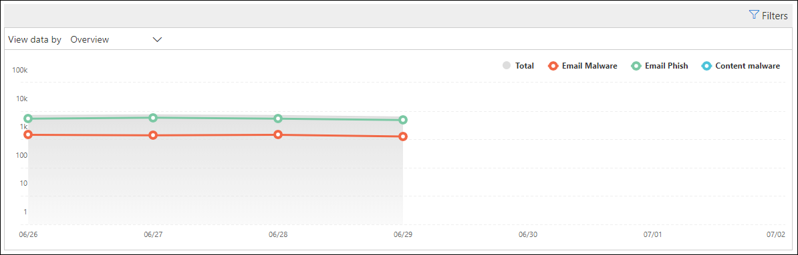

- **Ver datos por: contenido \> Malware**1: se muestra la siguiente información para las organizaciones de ATP de Office 365:**View data by: Content \> Malware**1: The following information is shown for Office 365 ATP organizations:

  - **Motor antimalware****Anti-malware engine**
  - **Detonación de archivos****File detonation**

  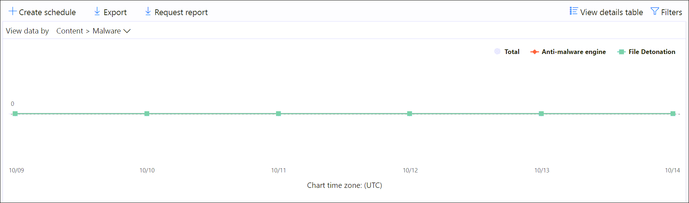

- **Desglose por: tecnología de detección** y **ver datos por: \> phishing email**: se muestra la siguiente información:**Break down by: Detection technology** and **View data by: Email \> Phish**: The following information is shown:

  - **Reputación de dirección URL generada por ATP**1**ATP-generated URL reputation**1
  - **Filtro de phish avanzado****Advanced phish filter**
  - **Anti-falseamiento: error de DMARC****Anti-spoof: DMARC failure**
  - **Anti-suplantación de identidad: intra-org****Anti-spoof: Intra-org**
  - **Anti-falsear: dominio externo****Anti-spoof: external domain**
  - **Suplantación de marca****Brand impersonation**
  - **Suplantación de dominio**1**Domain impersonation**1
  - **Reputación de dirección URL de EOP****EOP URL reputation**
  - **Filtro de phish general****General phish filter**
  - **Otros****Others**
  - **Zap de phish**2**Phish ZAP**2
  - **Detonación de dirección URL**1**URL detonation**1
  - **Suplantación de usuario**1**User impersonation**1

  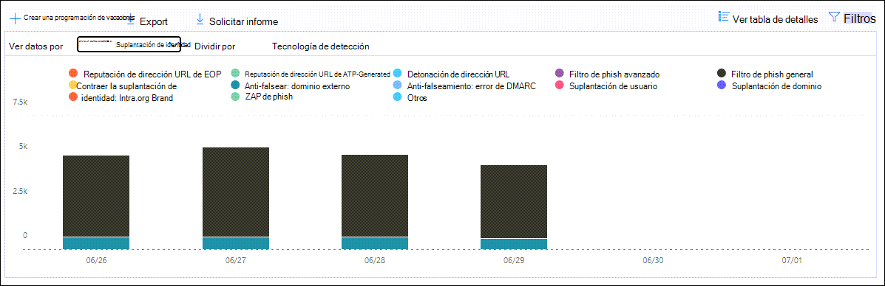

- **Desglose por: tecnología de detección** y **ver datos por: \> malware de correo electrónico**: se muestra la siguiente información:**Break down by: Detection technology** and **View data by: Email \> Malware**: The following information is shown:

  - **Reputación de archivo generada por ATP**1**ATP-generated file reputation**1
  - **Motor antimalware**1**Anti-malware engine**1
  - **Bloque de tipo de archivo de directiva antimalware****Anti-malware policy file type block**
  - **Detonación de archivo**1**File detonation**1
  - **Reputación de archivos malintencionados****Malicious file reputation**
  - **Zap de malware**2**Malware ZAP**2
  - **Otros****Others**

  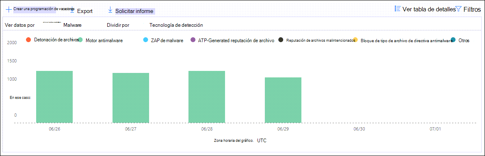

- **Desglose por: tipo de directiva** y **ver datos por: \> phishing de correo electrónico** o **ver datos por: \> malware de correo electrónico**: se muestra la siguiente información:**Break down by: Policy type** and **View data by: Email \> Phish** or **View data by: Email \> Malware**: The following information is shown:

  - **Antimalware****Anti-malware**
  - **Datos adjuntos seguros**1**Safe Attachment**1
  - **Anti-phish****Anti-phish**
  - **Contra correo electrónico no deseado****Anti-spam**
  - **Regla de flujo de correo** (también denominada regla de transporte)**Mail flow rule** (also known as a transport rule)
  - **Otros****Others**

  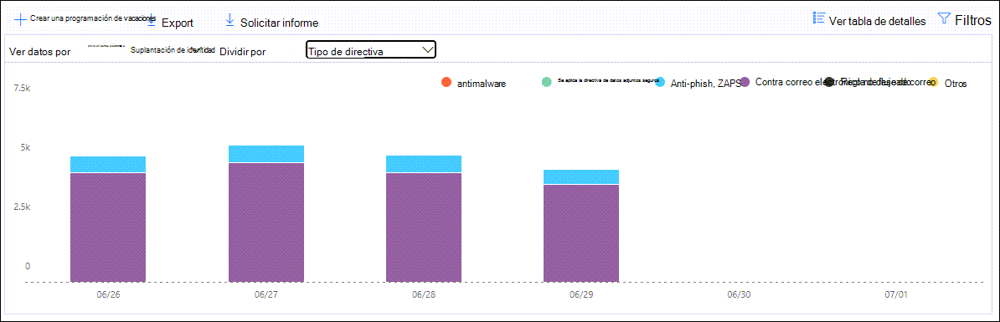

- **Desglose por: estado de entrega** y **ver datos por: \> phishing de correo electrónico** o **ver datos por: \> malware de correo electrónico**: se muestra la siguiente información:**Break down by: Delivery status** and **View data by: Email \> Phish** or **View data by: Email \> Malware**: The following information is shown:

  - **Error en la entrega****Delivery failed**
  - **Sombra****Dropped**
  - **Reenviado****Forwarded**
  - **Buzón de correo hospedado: carpeta personalizada****Hosted mailbox: Custom folder**
  - **Buzón de correo hospedado: elementos eliminados****Hosted mailbox: Deleted items**
  - **Buzón de correo hospedado: bandeja de entrada****Hosted mailbox: Inbox**
  - **Buzón hospedado: correo no deseado****Hosted mailbox: Junk**
  - **Servidor local: entregado****On-premises server: Delivered**
  - **Cuarentena****Quarantine**

  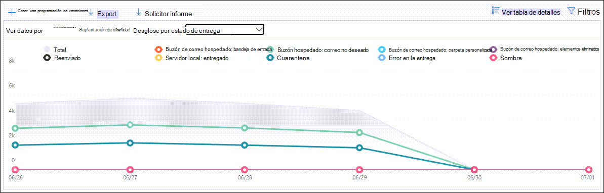

1 solo para ATP de Office 3651 Office 365 ATP only

2 la depuración automática de cero horas (ZAP) no está disponible en EOP independiente (solo funciona en buzones de Exchange Online).2 Zero-hour auto purge (ZAP) isn't available in standalone EOP (it only works in Exchange Online mailboxes).

Si hace clic en **filtros**, puede modificar el informe con los siguientes filtros:If you click **Filters**, you can modify the report with the following filters:

- **Fecha de inicio** y **fecha de finalización****Start date** and **End date**
- Valor de detecciónDetection value
- **Protegido por** (solo para ATP de Office 365): **ATP** o **EOP**.**Protected by** (Office 365 ATP only): **ATP** or **EOP**. Tenga en cuenta que esta propiedad filterable no está disponible en **ver datos por: \> malware de contenido**.Note that this filterable property isn't available in **View data by: Content \> Malware**.

### Vista de tabla de detalles para el informe de estado de protección contra amenazasDetails table view for the Threat protection status report

Si hace clic en **ver tabla de detalles**, la información que se muestra depende del gráfico que estaba viendo:If you click **View details table**, the information that's shown depends on the chart you were looking at:

- **Ver datos por: contenido \> Malware**:**View data by: Content \> Malware**:

  - **Fecha****Date**
  - **Location****Location**
  - **Dirigida por****Directed by**
  - **Nombre del malware****Malware name**

- **Ver datos por: información general**: no hay disponible ningún botón **tabla de detalles** de la vista.**View data by: Overview**: No **View details table** button is available.

- Todos los demás gráficos:All other charts:

  - **Fecha****Date**
  - **Asunto****Subject**
  - **Remitente****Sender**
  - **Destinatarios****Recipients**
  - **Detectado por****Detected by**
  - **Estado de entrega****Delivery status**
  - **Origen de la intromisión****Source of compromise**

Si hace clic en **filtros**, puede modificar el informe con los siguientes filtros:If you click **Filters**, you can modify the report with the following filters:

- **Fecha de inicio** y **fecha de finalización****Start date** and **End date**
- Valor de detecciónDetection value
- **Protegido por** (solo para ATP de Office 365): **ATP** o **EOP**.**Protected by** (Office 365 ATP only): **ATP** or **EOP**. Tenga en cuenta que esta propiedad filterable no está disponible en **ver datos por: \> malware de contenido**.Note that this filterable property isn't available in **View data by: Content \> Malware**.

## Informe de malware principalTop malware report

El informe de **malware más alto** muestra los distintos tipos de malware detectados por la [protección antimalware en EOP](anti-malware-protection.md).The **Top malware** report shows the various kinds of malware that was detected by [anti-malware protection in EOP](anti-malware-protection.md).

Para ver el informe, abra el [centro de seguridad & cumplimiento](https://protection.office.com), vaya **Reports** al \> **Panel** informes y seleccione **malware principal**.To view the report, open the [Security & Compliance Center](https://protection.office.com), go to **Reports** \> **Dashboard** and select **Top malware**. Para ir directamente al informe, Abra <https://protection.office.com/reportv2?id=TopMalware> .To go directly to the report, open <https://protection.office.com/reportv2?id=TopMalware>.

Cuando desplaza el puntero sobre una cuña del gráfico circular, puede ver el nombre de un tipo de malware y el número de mensajes que se detectaron como si tuvieran ese malware.When you hover over a wedge in the pie chart, you can see the name of a kind of malware and how many messages were detected as having that malware.

Si hace clic en **ver tabla de detalles**, puede ver los siguientes detalles:If you click **View details table**, you can see the following details:

- **Malware principal****Top malware**
- **Count****Count**

Si hace clic en **filtros** en la vista de informe o en la vista de tabla de detalles, puede especificar un intervalo de fechas con **fecha de inicio** y fecha de **finalización**.If you click **Filters** in the report view or details table view, you can specify a date range with **Start date** and **End date**.

## Informe de protección contra amenazas de URLURL threat protection report

El **Informe de protección contra amenazas de direcciones URL** está disponible en la protección contra amenazas avanzada (ATP) de Office 365.The **URL threat protection report** is available in Office 365 Advanced Threat Protection (ATP). Para obtener más información, consulte [Informe de protección contra amenazas de direcciones URL](view-reports-for-atp.md#url-threat-protection-report).For more information, see [URL threat protection report](view-reports-for-atp.md#url-threat-protection-report).

## Informe de mensajes notificados por el usuarioUser-reported messages report

El informe de **mensajes de** informes de usuario muestra información sobre los mensajes de correo electrónico que los usuarios han notificado como correo no deseado, intentos de suplantación de identidad (phishing) o correo correcto mediante el [complemento de mensajes de informe](https://docs.microsoft.com/microsoft-365/security/office-365-security/enable-the-report-message-add-in).The **User-reported messages** report shows information about email messages that users have reported as junk, phishing attempts, or good mail by using the [Report Message add-in](https://docs.microsoft.com/microsoft-365/security/office-365-security/enable-the-report-message-add-in).

Hay más detalles disponibles para cada mensaje, incluidos el motivo de la entrega, la excepción de la Directiva de correo no deseado o la regla de flujo de correo configurada para la organización.Details are available for each message, including the delivery reason, such a spam policy exception or mail flow rule configured for your organization. Para ver los detalles, seleccione un elemento de la lista de informes de usuarios y, a continuación, vea la información en las pestañas **Resumen** y **detalles** .To view details, select an item in the user-reports list, and then view the information on the **Summary** and **Details** tabs.

Para ver este informe, en el [centro de seguridad & cumplimiento](https://protection.office.com), realice una de las siguientes acciones:To view this report, in the [Security & Compliance Center](https://protection.office.com), do one of the following:

- Vaya a **Threat management** \> **Dashboard** \> **mensajes de los que ha informado el usuario del panel de administración de**amenazas.Go to **Threat management** \> **Dashboard** \> **User-reported messages**.

- Vaya a **Threat management** \> **Review** \> **los mensajes de revisión de administración de amenazas que ha informado el usuario**.Go to **Threat management** \> **Review** \> **User-reported messages**.

> [!IMPORTANT]
> Para que el informe de mensajes notificados por el usuario funcione correctamente, el **registro de auditoría debe estar activado** para su entorno de Office 365.In order for the User-reported messages report to work correctly, **audit logging must be turned on** for your Office 365 environment. Normalmente lo hace alguien que tiene el rol registros de auditoría asignado en Exchange Online.This is typically done by someone who has the Audit Logs role assigned in Exchange Online. Para obtener más información, consulte [activar o desactivar la búsqueda de registros de auditoría de Microsoft 365](https://docs.microsoft.com/microsoft-365/compliance/turn-audit-log-search-on-or-off).For more information, see [Turn Microsoft 365 audit log search on or off](https://docs.microsoft.com/microsoft-365/compliance/turn-audit-log-search-on-or-off).

## ¿Qué permisos se necesitan para ver estos informes?What permissions are needed to view these reports?

Para ver y usar los informes, debe ser miembro del grupo de roles especificado en el centro de seguridad & cumplimiento **y** en Exchange Online.To view and use the reports, you need to be a member of the specified role group in the Security & Compliance Center **and** in Exchange Online.

- En el centro de seguridad & cumplimiento, debe ser miembro de uno de los siguientes grupos de roles:In the Security & Compliance Center, you need to be a member of one of the following role groups:

  -Organization Management-administrador de seguridad (también puede hacerlo en el [centro de administración de Azure Active Directory](https://aad.portal.azure.com) -lector de seguridad-Organization Management -Security Administrator (you can also do this in the [Azure Active Directory admin center](https://aad.portal.azure.com) -Security Reader

  Para obtener más información, vea [Permisos en el Centro de seguridad y cumplimiento](https://docs.microsoft.com/microsoft-365/security/office-365-security/permissions-in-the-security-and-compliance-center).For more information, see [Permissions in the Security & Compliance Center](https://docs.microsoft.com/microsoft-365/security/office-365-security/permissions-in-the-security-and-compliance-center).

- En Exchange Online, debe ser miembro de uno de los siguientes grupos de roles:In Exchange Online, you need to be a member of one of the following role groups:

  -Administración de la organización: administración de la organización de solo vista-destinatarios de solo vista-administración de cumplimiento-Organization Management -View-only Organization Management -View-Only Recipients -Compliance Management

Para obtener más información, consulte [Permissions in Exchange Online](https://docs.microsoft.com/Exchange/permissions-exo/permissions-exo) y [Manage role Groups in Exchange Online](https://docs.microsoft.com/Exchange/permissions-exo/role-groups).For more information, see [Permissions in Exchange Online](https://docs.microsoft.com/Exchange/permissions-exo/permissions-exo) and [Manage role groups in Exchange Online](https://docs.microsoft.com/Exchange/permissions-exo/role-groups).

## ¿Qué ocurre si los informes no muestran datos?What if the reports aren't showing data?

Si no ve datos en los informes, compruebe que las directivas estén correctamente configuradas.If you are not seeing data in your reports, double-check that your policies are set up correctly. Para obtener más información, consulte [proteger contra amenazas](protect-against-threats.md).To learn more, see [Protect against threats](protect-against-threats.md).

## Temas relacionadosRelated topics

[Protección contra correo electrónico no deseado y antimalware en EOPAnti-spam and anti-malware protection in EOP](anti-spam-and-anti-malware-protection.md)

[Informes inteligentes y reportes en el Centro de seguridad y cumplimientoSmart reports and insights in the Security & Compliance Center](reports-and-insights-in-security-and-compliance.md)

[Ver informes de flujo de correo en el centro de seguridad & cumplimientoView mail flow reports in the Security & Compliance Center](view-mail-flow-reports.md)

[Ver informes para la protección contra amenazas avanzada de Office 365View reports for Office 365 Advanced Threat Protection](view-reports-for-atp.md)
