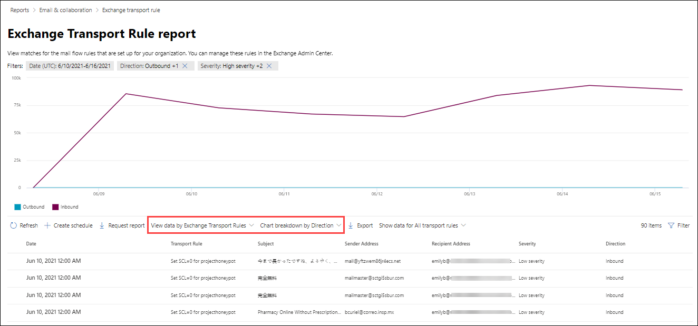
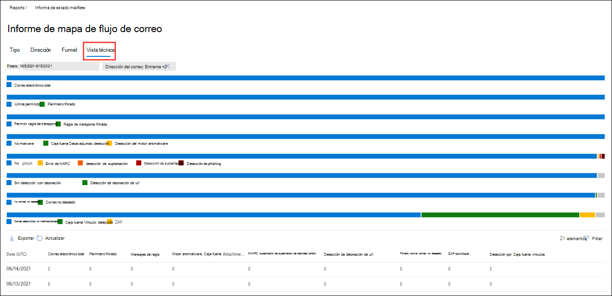
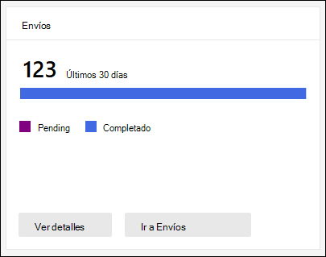
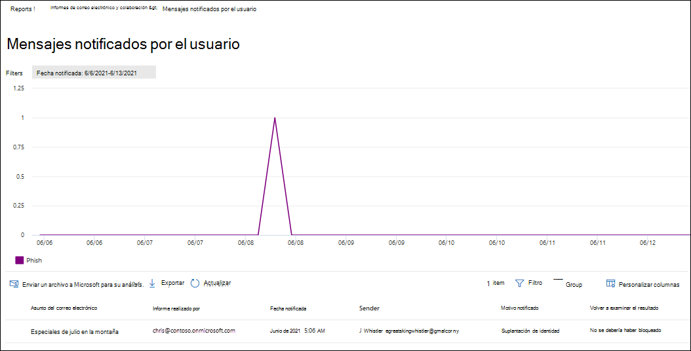

# Ver informes de seguridad de correo electrónico en el portal Microsoft 365 Defender correo electrónico

[!INCLUDE [Microsoft 365 Defender rebranding](../includes/microsoft-defender-for-office.md)]

**Se aplica a**
- [Exchange Online Protection](exchange-online-protection-overview.md)
- [Plan 1 y Plan 2 de Microsoft Defender para Office 365](defender-for-office-365.md)
- [Microsoft 365 Defender](../defender/microsoft-365-defender.md)

Hay una variedad de informes disponibles en el portal de Microsoft 365 Defender para ayudarle a ver cómo las características de seguridad del correo electrónico, como el correo no deseado, antimalware y las características de cifrado en Microsoft 365 protegen su <https://security.microsoft.com> organización. Si tiene los [permisos](#what-permissions-are-needed-to-view-these-reports)necesarios, puede ver estos informes en el  portal de Microsoft 365 Defender yendo a Informes de correo electrónico & colaboración Correo electrónico & informes \>  \> **de colaboración**. Para ir directamente a la página **Informes de colaboración & correo** electrónico, abra <https://security.microsoft.com/emailandcollabreport> .

> [!NOTE]
>
> Algunos de los informes de la página Informes de **colaboración & correo** electrónico requieren Microsoft Defender para Office 365. Para obtener información acerca de estos informes, vea [View Defender for Office 365 reports in the Microsoft 365 Defender portal](view-reports-for-mdo.md).
>
> Los informes relacionados con el flujo de correo se encuentran ahora en el Centro Exchange administración (EAC). Para obtener más información acerca de estos informes, vea Informes de flujo de correo [en el nuevo centro Exchange administración.](/exchange/monitoring/mail-flow-reports/mail-flow-reports)

## Informe de usuarios comprometidos

> [!NOTE]
> Este informe está disponible en Microsoft 365 organizaciones con Exchange Online buzones de correo. No está disponible en organizaciones independientes Exchange Online Protection (EOP).

El **informe Usuarios comprometidos** muestra el número de  cuentas  de usuario que se marcaron como Sospechosas o Restringidas en los últimos 7 días. Las cuentas en cualquiera de estos estados son problemáticas o incluso están en peligro. Con el uso frecuente, puede usar el informe para detectar picos e incluso tendencias en cuentas sospechosas o restringidas. Para obtener más información acerca de los usuarios en peligro, vea [Responder a una cuenta de correo electrónico comprometida.](responding-to-a-compromised-email-account.md)

La vista de agregado muestra los datos de los últimos 90 días y la vista de detalles muestra los datos de los últimos 30 días.

Para ver el informe en el portal de Microsoft 365 Defender, vaya a **Informes** de correo electrónico & \> **colaboración** Correo & \> **informes de colaboración**. En la página **Informes de colaboración &** correo electrónico, busque **Usuarios** en peligro y, a continuación, haga clic en **Ver detalles.** Para ir directamente al informe, abra <https://security.microsoft.com/reports/CompromisedUsers> .

En la **página Usuarios** en peligro, puede filtrar tanto  el gráfico como la tabla de detalles haciendo clic en Filtrar y seleccionando uno o varios de los siguientes valores en el menú desplegable que aparece:

- **Date (UTC):** **Fecha de inicio y** fecha de **finalización.**
- **Actividad**:
  - **Sospechoso:** la cuenta de usuario ha enviado un correo electrónico sospechoso y corre el riesgo de que se le restringa el envío de correo electrónico.
  - **Restringido:** la cuenta de usuario se ha restringido para enviar correo electrónico debido a patrones altamente sospechosos.

Cuando haya terminado de configurar los filtros, haga clic **en Aplicar,** **Cancelar** o **Borrar filtros**.

En la tabla de detalles debajo del gráfico, puede ver los siguientes detalles:

- **Tiempo de creación**
- **Nombre de usuario**
- **Action**

## Exchange de regla de transporte

El **Exchange de regla de** transporte muestra el efecto de las reglas de flujo de correo (también conocidas como reglas de transporte) en los mensajes entrantes y salientes de la organización.

Para ver el informe en el portal de Microsoft 365 Defender, vaya a **Informes** de correo electrónico & \> **colaboración** Correo & \> **informes de colaboración**. En la página **Informes de colaboración &** correo electrónico, busque Exchange de transporte **y, a** continuación, haga clic en Ver **detalles.** Para ir directamente al informe, abra <https://security.microsoft.com/reports/ETRRuleReport> .

En la página Exchange informe de reglas de **transporte,** los gráficos y datos disponibles se describen en las secciones siguientes.

### Desglose del gráfico por dirección

Si selecciona Desglose **de gráficos por dirección,** los siguientes gráficos estarán disponibles:

- **Ver datos por Exchange de transporte:** el  número **de** mensajes entrantes y salientes que se vieron afectados por las reglas de flujo de correo.
- **Ver datos por DLP Exchange** de transporte:  el  número de mensajes entrantes y salientes que se vieron afectados por las reglas de flujo de correo de prevención de pérdida de datos (DLP).

La siguiente información se muestra en la tabla de detalles debajo del gráfico:

- **Fecha**
- **Directiva DLP** (**Ver datos por DLP Exchange reglas de transporte)**
- **Regla de transporte**
- **Asunto**
- **Dirección del remitente**
- **Dirección de destinatario**
- **Gravedad**
- **Dirección**

Puede filtrar tanto el gráfico como  la tabla de detalles haciendo clic en Filtrar y seleccionando uno o varios de los siguientes valores en el menú desplegable que aparece:

- **Fecha (UTC) Fecha** **de inicio y** fecha de **finalización**
- **Dirección:** **saliente** y **entrante**
- **Gravedad:** **gravedad alta,** **gravedad media** y **gravedad baja**

Cuando haya terminado de configurar los filtros, haga clic **en Aplicar,** **Cancelar** o **Borrar filtros**.

### Desglose del gráfico por gravedad

Si selecciona Desglose **de gráficos por gravedad,** los siguientes gráficos están disponibles:

- **Ver datos por Exchange de transporte:** el número de mensajes de gravedad **alta,** gravedad media y **gravedad** baja. El nivel de gravedad se establece como una acción en la regla (**Auditar** esta regla con el nivel de gravedad o _SetAuditSeverity_). Para obtener más información, vea [Acciones de regla de flujo de correo en Exchange Online](/Exchange/security-and-compliance/mail-flow-rules/mail-flow-rule-actions).

- **Ver datos por DLP Exchange** de transporte: el número de mensajes  de gravedad **alta,** media y de gravedad baja que se vieron afectados por las reglas de flujo de correo DLP.

La siguiente información se muestra en la tabla de detalles debajo del gráfico:

- **Fecha**
- **Directiva DLP** (**Ver datos por DLP Exchange reglas de transporte)**
- **Regla de transporte**
- **Asunto**
- **Dirección del remitente**
- **Dirección de destinatario**
- **Gravedad**
- **Dirección**

Puede filtrar tanto el gráfico como  la tabla de detalles haciendo clic en Filtrar y seleccionando uno o varios de los siguientes valores en el menú desplegable que aparece:

- **Fecha (UTC) Fecha** **de inicio y** fecha de **finalización**
- **Dirección:** **saliente** y **entrante**
- **Gravedad:** **gravedad alta,** **gravedad media** y **gravedad baja**

Cuando haya terminado de configurar los filtros, haga clic **en Aplicar,** **Cancelar** o **Borrar filtros**.

## Informe de reenvío

> [!NOTE]
> El **informe de reenvío** ya está disponible en el EAC. Para obtener más información, vea Informe de mensajes reenviados [automáticamente en el nuevo EAC](/exchange/monitoring/mail-flow-reports/mfr-auto-forwarded-messages-report).

## Informe de estado de flujo de correo

El **informe de** estado de flujo de correo es un informe inteligente que muestra información sobre el correo electrónico entrante y saliente, las detecciones de correo no deseado, el malware, el correo electrónico identificado como "bueno" y la información sobre el correo electrónico permitido o bloqueado en el perímetro. Este es el único informe que contiene información de protección perimetral y muestra cuánto correo electrónico se bloquea antes de que se le permita entrar en el servicio para su evaluación por parte de Exchange Online Protection (EOP). Es importante comprender que si un mensaje se envía a cinco destinatarios, lo contamos como cinco mensajes diferentes y no un mensaje.

Para ver el informe en el portal de Microsoft 365 Defender, vaya a **Informes** de correo electrónico & \> **colaboración** Correo & \> **informes de colaboración**. En la página **Informes de colaboración &** correo electrónico, busque Resumen de estado de **flujo** de correo y, a continuación, haga clic en **Ver detalles.** Para ir directamente al informe, abra <https://security.microsoft.com/reports/mailflowStatusReport> .

### Vista de tipo para el informe de estado de flujo de correo

En la **página Informe de estado de flujo de** correo, la **pestaña** Tipo está seleccionada de forma predeterminada. De forma predeterminada, esta vista contiene un gráfico y una tabla de detalles que está configurada con los filtros siguientes:

- **Fecha (UTC)** Los últimos 7 días.
- **Dirección del correo**:
  - **Entrante**
  - **Saliente**
  - **Intra-org:** este recuento es para mensajes dentro de un espacio empresarial, es decir, sender abc@domain.com al destinatario xyz@domain.com (se cuenta por separado de **Entrante** y **Saliente**)
- **Tipo**:
  - **Correo bueno**
  - **Malware**
  - **Correo no deseado**
  - **Protección perimetral**
  - **Mensajes de regla**
  - **Correo de suplantación de identidad**
- **Dominio**: **Todos**

El gráfico está organizado por los **valores Type.**

Puede cambiar estos filtros haciendo clic en **Filtrar**.

La siguiente información se muestra en la tabla de detalles debajo del gráfico:

- **Dirección**
- **Tipo**
- **24 horas**
- **3 días**
- **7 días**
- **15 días**
- **30 días**

Si hace clic **en Elegir una categoría para obtener más información,** puede seleccionar entre los siguientes valores:

- **Correo electrónico de suplantación** de identidad : esta selección le lleva al informe [de estado de protección contra amenazas](view-email-security-reports.md#threat-protection-status-report).
- **Malware en el correo** electrónico: esta selección le lleva al informe [de estado de protección contra amenazas](view-email-security-reports.md#threat-protection-status-report).
- **Detecciones de correo** no deseado: esta selección le lleva al informe [Detecciones de correo no deseado](view-email-security-reports.md#spam-detections-report).
- **Correo no deseado bloqueado** perimetral: esta selección le lleva al informe [Detecciones de correo no deseado](view-email-security-reports.md#spam-detections-report).

#### Exportar desde la vista Tipo

Para la vista de detalles, solo puede exportar datos durante un día. Por lo tanto, si desea exportar datos durante 7 días, debe realizar 7 acciones de exportación diferentes.

Cada archivo .csv exportada está limitado a 150 000 filas. Si los datos de ese día contienen más de 150.000 filas, se crearán varios .csv archivos.

### Vista Dirección del informe de estado de flujo de correo

Si hace clic en la **pestaña Dirección,** se usan los mismos filtros predeterminados de la **vista** Tipo.

El gráfico está organizado por valores **direction.**

Puede cambiar estos filtros haciendo clic en **Filtrar**. Se usan los mismos filtros de **la vista** Tipo.

La tabla de detalles contiene la misma información de la **vista** Tipo.

La **categoría Elegir una categoría para obtener más detalles** sobre las selecciones y el comportamiento disponibles son los mismos que la **vista** Tipo.

#### Exportar desde la vista Dirección

Para la vista de detalles, solo puede exportar datos durante un día. Por lo tanto, si desea exportar datos durante 7 días, debe realizar 7 acciones de exportación diferentes.

Cada archivo .csv exportada está limitado a 150 000 filas. Si los datos de ese día contienen más de 150.000 filas, se crearán varios .csv archivos.

### Vista embudo para el informe de estado de flujo de correo

La **vista Embudo** muestra cómo las características de protección contra amenazas de correo electrónico de Microsoft filtran el correo electrónico entrante y saliente en su organización. Proporciona detalles sobre el recuento total de correo electrónico y cómo afectan a este recuento las características de protección contra amenazas configuradas, como la protección perimetral, el antimalware, la suplantación de identidad (phishing), el correo no deseado y la suplantación de identidad.

Si hace clic en la pestaña **Embudo,** de forma predeterminada, esta vista contiene un gráfico y una tabla de detalles configurada con los filtros siguientes:

- **Fecha:** los últimos 7 días.

- **Dirección**:
  - **Entrante**
  - **Saliente**
  - **Intra-org:** este recuento es para los mensajes enviados dentro de un espacio empresarial; Es decir, el remitente abc@domain.com al destinatario xyz@domain.com (se cuenta por separado de Entrante y Saliente).

La vista de agregado y la vista de tabla de detalles permiten 90 días de filtrado.

Puede cambiar estos filtros haciendo clic en **Filtrar**. Se usan los mismos filtros de **la vista** Tipo.

Este gráfico muestra el recuento de correo electrónico organizado por:

- **Correo electrónico total**
- **Correo electrónico después de la protección perimetral**
- **Correo electrónico después de la regla de transporte** (regla de flujo de correo)
- **Correo electrónico después de antimalware, reputación de archivo, bloqueo de tipo de archivo**
- **Correo electrónico después de anti phish, reputación url, suplantación de marca, anti suplantación de identidad**
- **Correo electrónico después de correo no deseado, filtrado masivo de correo**
- **Correo electrónico después de la suplantación de usuario y dominio**\*
- **Email after file and URL detonation**\*
- **Correo electrónico detectado como benigno después de la protección posterior a la entrega (url click time protection)**

\*Solo defender para Office 365

Para ver el correo electrónico filtrado por EOP o Defender Office 365 por separado, haga clic en el valor de la leyenda del gráfico.

La tabla de detalles contiene la siguiente información, que se muestra en orden de fecha descendente:

- **Fecha**
- **Correo electrónico total**
- **Protección perimetral**
- **Antimalware, reputación de archivo, bloque de tipo de archivo:**
  - **Reputación del archivo:** mensajes filtrados debido a la identificación de un archivo adjunto por otros clientes de Microsoft.
  - **Bloque de tipo de** archivo: mensajes filtrados debido al tipo de archivo malintencionado identificado en el mensaje.
- **Anti-phish, reputación url, suplantación de marca, suplantación de identidad:**
  - **Reputación de la dirección URL:** mensajes filtrados debido a la identificación de la dirección URL por otros clientes de Microsoft.
  - **Suplantación de marca:** mensajes filtrados debido al mensaje procedente de remitentes de suplantación de marca conocidos.
  - **Anti-spoof:** mensajes filtrados debido a que el mensaje intenta suplantar un dominio al que pertenece el destinatario o un dominio que el remitente del mensaje no posee.
- **Antispam, filtrado masivo de correo:**
  - **Filtrado masivo de correo:** mensajes filtrados según el umbral de nivel de queja masiva (BCL) en una directiva contra correo no deseado.
- **Suplantación de usuario y dominio (Defender para Office 365):**
  - Suplantación de **usuario:** mensajes filtrados debido a un intento de suplantar a un usuario (remitente de mensajes) que se define en la configuración de protección de suplantación de una directiva contra suplantación.
  - **Suplantación** de dominio: mensajes filtrados debido a un intento de suplantar un dominio definido en la configuración de protección de suplantación de una directiva contra suplantación.
- **Detonación de archivos y direcciones URL (Defender para Office 365):**
  - **Detonación de archivos:** mensajes filtrados por una directiva Caja fuerte datos adjuntos.
  - **Detonación de dirección URL:** mensaje filtrado por una directiva Caja fuerte vínculos.
- Protección posterior a la entrega y **ZAP (ATP) o ZAP (EOP):** purga automática de hora cero (ZAP) para malware, correo no deseado y phishing.

Si selecciona una fila en la tabla de detalles, se muestra un desglose adicional de los recuentos de correo electrónico en el menú desplegable.

#### Exportar desde la vista Embudo

Después de hacer **clic en Exportar** en **Opciones,** puede seleccionar uno de los siguientes valores:

- **Resumen (con datos de los últimos 90 días como máximo)**
- **Detalles (con datos de los últimos 30 días como máximo)**

En **Fecha**, elija un rango y, a continuación, haga clic **en Aplicar**. Los datos de los filtros actuales se exportarán a un .csv archivo.

Cada archivo .csv exportada está limitado a 150 000 filas. Si los datos contienen más de 150 000 filas, se crearán varios .csv archivos.

### Vista técnica del informe de estado del flujo de correo

La **vista Tech es** similar a la vista **Embudo,** lo que proporciona más detalles pormenorizados para las características de protección contra amenazas configuradas. En el gráfico, puede ver cómo se clasifican los mensajes en las distintas etapas de protección contra amenazas.

Si hace clic en la **pestaña Vista técnica,** de forma predeterminada, esta vista contiene un gráfico y una tabla de detalles configurada con los filtros siguientes:

- **Fecha:** los últimos 7 días.

- **Dirección**:
  - **Entrante**
  - **Saliente**
  - **Intra-org:** este recuento es para mensajes dentro de un espacio empresarial, es decir, remitente abc@domain.com al destinatario xyz@domain.com (se cuenta por separado de Entrante y Saliente)

La vista de agregado y la vista de tabla de detalles permiten 90 días de filtrado.

Puede cambiar estos filtros haciendo clic en **Filtrar**. Se usan los mismos filtros de **la vista** Tipo.

En este gráfico se muestran los mensajes organizados en las siguientes categorías:

- **Correo electrónico total**
- **Edge allow** y **Edge filtered**
- **Regla de transporte permitido** y **regla de transporte filtrada** (reglas de flujo de correo)
- **No malware,** **detección Caja fuerte datos adjuntos** y detección de motores \* **antimalware**
- **No phish**, **error DMARC,** **detección de suplantación,** detección \* de **suplantación** y detección **de suplantación** de identidad
- **No hay detección con detonación de dirección URL** y **detonación de url**\*
- **No correo no** deseado y  **correo no deseado**
- **Correo electrónico no malintencionado,** **Caja fuerte de detección de vínculos y** \* **ZAP**

\*Defender para Office 365

Al pasar el mouse sobre una categoría del gráfico, puede ver el número de mensajes de esa categoría.

La tabla de detalles contiene la siguiente información, que se muestra en orden de fecha descendente:

- **Fecha (UTC)**
- **Correo electrónico total**
- **Perímetro filtrado**
- **Mensajes de regla:** mensajes filtrados debido a reglas de flujo de correo (también conocidas como reglas de transporte).
- **Motor antimalware**, **Caja fuerte datos adjuntos** \* :
- **DMARC, suplantación,** \* **suplantación, suplantación** de **identidad filtrada**:
  - **DMARC:** mensajes filtrados debido a que el mensaje no ha fallado en la comprobación de autenticación de DMARC.
- **Detección de detonación de url**\*
- **Filtrado contra correo no deseado**
- **ZAP quitado**
- **Detección por Caja fuerte vínculos**\*

\*Defender para Office 365

Si selecciona una fila en la tabla de detalles, se muestra un desglose adicional de los recuentos de correo electrónico en el menú desplegable.

#### Exportar desde la vista Tech

Al hacer **clic en** Exportar , en **Opciones,** puede seleccionar uno de los siguientes valores:

- **Resumen (con datos de los últimos 90 días como máximo)**
- **Detalles (con datos de los últimos 30 días como máximo)**

En **Fecha**, elija un rango y, a continuación, haga clic **en Aplicar**. Los datos de los filtros actuales se exportarán a un .csv archivo.

Cada archivo .csv exportada está limitado a 150 000 filas. Si los datos contienen más de 150 000 filas, se crearán varios .csv archivos.

## Informe de detecciones de malware

El **informe de detecciones** de malware muestra información sobre detecciones de malware en mensajes de correo electrónico entrantes y salientes (malware detectado por Exchange Online Protection o EOP). Para obtener más información acerca de la protección contra malware en EOP, vea [Protección contra malware en EOP](anti-malware-protection.md).

El filtro de vista agregado permite 90 días, mientras que el filtro de tabla de detalles solo permite 10 días.

Para ver el informe en el portal de Microsoft 365 Defender, vaya a **Informes** de correo electrónico & \> **colaboración** Correo & \> **informes de colaboración**. En la **página Informes de colaboración &** correo electrónico, busque Malware detectado en el correo **electrónico** y, a continuación, haga clic en **Ver detalles.** Para ir directamente al informe, abra <https://security.microsoft.com/reports/MalwareDetections> .

En la **página Informe de detecciones de** malware, puede filtrar tanto el gráfico como la tabla de detalles haciendo clic en **Filtrar** y seleccionando uno de los siguientes valores:

- **Fecha (UTC) Fecha** **de inicio y** fecha de **finalización**
- **Dirección:** **entrante** y **saliente**

En la tabla de detalles debajo del gráfico, puede ver los siguientes detalles:

- **Fecha**
- **Dirección del remitente**
- **Dirección de destinatario**
- **Id. de** mensaje: disponible en el **campo de encabezado Id. de** mensaje en el encabezado del mensaje y debe ser único. Un valor de ejemplo es `<08f1e0f6806a47b4ac103961109ae6ef@server.domain>` (tenga en cuenta los corchetes angulares).
- **Asunto**
- **Filename**
- **Nombre de malware**

## Informe de latencia de correo

El **informe de latencia de** correo en Defender para Office 365 contiene información sobre la latencia de entrega y detonación de correo experimentada en su organización. Para obtener más información, vea [Informe de latencia de correo](view-reports-for-mdo.md#mail-latency-report).

## Informe de detecciones de correo no deseado

> [!NOTE]
> El **informe de detecciones de correo** no deseado desaparecerá finalmente. La misma información está disponible en el informe [de estado de protección contra amenazas](#threat-protection-status-report).

## Informe de detecciones de suplantación

> [!NOTE]
> El informe de detecciones de suplantación mejoradas, tal como se describe en este artículo, está en versión preliminar, está sujeto a cambios y no está disponible en todas las organizaciones. La versión anterior del informe muestra solo **Correo bueno** y Capturado como correo **no deseado.**

El **informe Detecciones** de suplantación muestra información sobre los mensajes bloqueados o permitidos debido a la suplantación. Para obtener más información acerca de la suplantación, vea Protección contra la suplantación [en EOP](anti-spoofing-protection.md).

La vista de agregado del informe permite 45 días de filtrado, mientras que la vista de detalles solo permite \* diez días de filtrado.

\* Con el tiempo, podrás usar hasta 90 días de filtrado.

Para ver el informe en el portal de Microsoft 365 Defender, vaya a **Informes** de correo electrónico & \> **colaboración** Correo & \> **informes de colaboración**. En la página **Informes de colaboración &** correo electrónico, busque **Detecciones** de suplantación de suplantación y, a continuación, haga clic **en Ver detalles.** Para ir directamente al informe, abra <https://security.microsoft.com/reports/SpoofMailReportV2> .

El gráfico muestra la siguiente información:

- **Pasar**
- **Error**
- **SoftPass**
- **Ninguna**
- **Otros**

Al pasar el mouse sobre un día (punto de datos) en el gráfico, puede ver cuántos mensajes suplantados se detectaron y por qué.

En la **página Informe** de correo suplantado, puede filtrar tanto el gráfico como la tabla de detalles haciendo clic en **Filtrar** y seleccionando uno o varios de los siguientes valores:

- **Fecha (UTC) Fecha** **de inicio y** fecha de **finalización**
- **Resultado**:
  - **Pasar**
  - **Error**
  - **SoftPass**
  - **Ninguna**
  - **Otros**
- **Tipo de suplantación:** **Interno** y **Externo**

En la tabla de detalles debajo del gráfico, puede ver los siguientes detalles:

- **Fecha**
- **Usuario suplantado**
- **Infraestructura de envío**
- **Tipo de suplantación**
- **Resultado**
- **Código de resultados**
- **SPF**
- **DKIM**
- **DMARC**
- **Recuento de mensajes**

Para obtener más información acerca de los códigos de resultados de autenticación compuesta, vea [Encabezados de mensajes](anti-spam-message-headers.md)contra correo no deseado en Microsoft 365 .

## Informe de envíos

El **informe Envíos** muestra información sobre los elementos que los administradores han notificado a Microsoft para su análisis. Para obtener más información, vea [Use Admin Submission to submit suspected spam, phish, URLs, and files to Microsoft](admin-submission.md).

Para ver el informe en el portal de Microsoft 365 Defender, vaya a **Informes** de correo electrónico & \> **colaboración** Correo & \> **informes de colaboración**. En la página **Informes de colaboración &** correo electrónico, busque **Envíos** y, a continuación, haga clic **en Ver detalles.** Para ir directamente al informe, abra <https://security.microsoft.com/adminSubmissionReport> . Para ir a [envíos de administrador en el portal de Microsoft 365 Defender,](admin-submission.md)haga clic **en Ir a Envíos**.

El gráfico muestra la siguiente información:

- **Pending**
- **Completed**

En la **página Envíos,** puede filtrar tanto el gráfico como la tabla de detalles haciendo clic en **Filtrar** y seleccionando uno o varios de los siguientes valores:

- **Fecha notificada:** **Hora de inicio** y hora de **finalización**
- **Tipo de envío**:
  - **Correo electrónico**
  - **URL**
  - **Archivo**
- **Identificador de envío**
- **Id. de mensaje de red**
- **Sender**
- **Nombre**
- **Enviado por**
- **Motivo para enviar**:
  - **No es correo no deseado**
  - **Suplantación de identidad**
  - **Malware**
  - **Correo no deseado**
- **Estado de volver a examinar:**
  - **Pending**
  - **Completed**

La tabla de detalles debajo del gráfico  muestra la misma información  y tiene las mismas opciones de grupo o personalizar columnas que en la pestaña Enviado para el análisis en Correo electrónico **& envíos** de  \> **colaboración.** Para obtener más información, vea [Ver envíos de administrador a Microsoft](admin-submission.md#view-admin-submissions-to-microsoft).

## Informe de estado de protección contra amenazas

El **informe de estado de** protección contra amenazas está disponible en EOP y Defender para Office 365; sin embargo, los informes contienen datos diferentes. Por ejemplo, los clientes de EOP pueden ver información sobre malware detectado en el correo electrónico, pero no información sobre archivos malintencionados detectados por [Caja fuerte Attachments for SharePoint, OneDrive](mdo-for-spo-odb-and-teams.md)y Microsoft Teams .

El informe proporciona el recuento de mensajes de correo electrónico con contenido malintencionado, como archivos o direcciones de sitios web (DIRECCIONES URL) bloqueadas por el motor antimalware, purga automática de hora cero [(ZAP)](zero-hour-auto-purge.md)y Defender para características de Office 365 como vínculos [de Caja fuerte,](safe-links.md)datos adjuntos de [Caja fuerte](safe-attachments.md)y características de protección de suplantación en directivas [contra suplantación.](set-up-anti-phishing-policies.md#exclusive-settings-in-anti-phishing-policies-in-microsoft-defender-for-office-365) Puede usar esta información para identificar tendencias o determinar si las directivas de la organización necesitan ajustes.

**Nota:** Es importante comprender que si un mensaje se envía a cinco destinatarios, lo contamos como cinco mensajes diferentes y no un mensaje.

Para ver el informe en el portal de Microsoft 365 Defender, vaya a **Informes** de correo electrónico & \> **colaboración** Correo & \> **informes de colaboración**. En la página **Informes de colaboración &** correo electrónico, busque Estado de protección contra **amenazas** y, a continuación, haga clic en **Ver detalles**. Para ir directamente al informe, abra una de las siguientes direcciones URL:

- Defender para Office 365:<https://security.microsoft.com/reports/TPSAggregateReportATP>
- EOP: <https://security.microsoft.com/reports/TPSAggregateReport>

De forma predeterminada, el gráfico muestra los datos de los últimos 7 días. Si hace clic **en Filtrar** en la página **Informe** de estado de protección contra amenazas, puede seleccionar un intervalo de fechas de 90 días (las suscripciones de prueba podrían limitarse a 30 días). La tabla de detalles permite filtrar durante 30 días.

Las vistas disponibles se describen en las secciones siguientes.

### Ver datos por información general

En la **vista Ver datos por información** general, se muestra la siguiente información de detección en el gráfico:

- **Malware de correo electrónico**
- **Phish de correo electrónico**
- **Malware de contenido**

No hay ninguna tabla de detalles disponible debajo del gráfico.

Si hace clic **en Filtrar,** estarán disponibles los siguientes filtros:

- **Fecha (UTC) Fecha** **de inicio y** fecha de **finalización**
- **Detección:** **malware de correo** electrónico, **suplantación** de identidad de correo electrónico o **malware de contenido**
- **Protegido por**: **MDO** (Defender para Office 365) o **EOP**
- **Etiqueta:** filtre los resultados por usuarios o grupos a los que se aplicó la etiqueta de usuario especificada (incluidas las cuentas de prioridad). Para obtener más información acerca de las etiquetas de usuario, vea [Etiquetas de usuario](user-tags.md).
- **Dirección**
- **Dominio**
- **Tipo de directiva**

Cuando haya terminado de configurar los filtros, haga clic **en Aplicar,** **Cancelar** o **Borrar filtros**.

### Ver datos por phishing de \> correo electrónico y desglose de gráficos por tecnología de detección

En la vista Ver  **datos por \> phishing** de correo electrónico y desglose de gráficos por tecnología de detección, se muestra la siguiente información en el gráfico:

- **Reputación malintencionada** de la dirección URL: reputación de url malintencionada generada desde \* Defender para Office 365 detonaciones en otros Microsoft 365 cliente.
- **Filtro avanzado:** señales de suplantación de identidad basadas en el aprendizaje automático.
- **Filtro general:** señales de suplantación de identidad basadas en reglas de analista.
- **Suplantación de** identidad dentro de la organización: el remitente está intentando suplantación del dominio de destinatario.
- **Suplantación de dominio externo:** el remitente está intentando suplantación de identidad de otro dominio.
- **Spoof DMARC:** error de autenticación DMARC en los mensajes.
- **Marca de suplantación:** suplantación de marcas conocidas basadas en remitentes.
- **Detección de análisis mixto**
- **Reputación de los archivos**
- **Coincidencia de huella digital**
- **Reputación de detonación de URL**\*
- **Detonación de dirección URL**\*
- **Usuario de suplantación**\*
- **Dominio de suplantación:** \* suplantación de dominios que el cliente posee o define.
- **Suplantación de inteligencia de buzones:** suplantación de usuarios definida por el administrador o aprendida a través \* de la inteligencia de buzones.
- **Detonación de archivos**\*
- **Campaña**\*

En la tabla de detalles debajo del gráfico, está disponible la siguiente información:

- **Fecha**
- **Asunto**
- **Remitente**
- **Destinatarios**
- **Detectado por**
- **Estado de entrega**
- **Origen de la transacción**
- **Tags**

Si hace clic **en Filtrar,** estarán disponibles los siguientes filtros:

- **Fecha (UTC) Fecha** **de inicio y** fecha de **finalización**
- **Detección**
- **Protegido por**: **MDO** (Defender para Office 365) o **EOP**
- **Dirección**
- **Etiqueta:** filtre los resultados por usuarios o grupos a los que se aplicó la etiqueta de usuario especificada (incluidas las cuentas de prioridad). Para obtener más información acerca de las etiquetas de usuario, vea [Etiquetas de usuario](user-tags.md).
- **Dominio**
- **Tipo de directiva**
- **Nombre de directiva** (solo tabla de detalles)
- **Destinatarios**

Cuando haya terminado de configurar los filtros, haga clic **en Aplicar,** **Cancelar** o **Borrar filtros**.

### Ver datos por malware de \> correo electrónico y desglose de gráficos por tecnología de detección

En la vista Ver  **datos por malware de \> correo** electrónico y desglose de gráficos por tecnología de detección, se muestra la siguiente información en el gráfico:

- **Detonación de archivos:** \* detección por Caja fuerte datos adjuntos.
- **Reputación de detonación de archivos:** toda la reputación de archivos malintencionados generada por \* Defender para Office 365 detonaciones.
- **Reputación de los archivos**
- **Motor antimalware: detección** \* de motores antimalware.
- Bloque de tipo de archivo de directiva **antimalware:** se trata de mensajes de correo electrónico filtrados debido al tipo de archivo malintencionado identificado en el mensaje.
- **Reputación malintencionada de URL**
- **Detonación de URL**
- **Reputación de detonación de URL**
- **Campaña**

En la tabla de detalles debajo del gráfico, está disponible la siguiente información:

- **Fecha**
- **Asunto**
- **Remitente**
- **Destinatarios**
- **Detectado por**
- **Estado de entrega**
- **Origen de la transacción**
- **Tags**

Si hace clic **en Filtrar,** estarán disponibles los siguientes filtros:

- **Fecha (UTC) Fecha** **de inicio y** fecha de **finalización**
- **Detección**
- **Protegido por**: **MDO** (Defender para Office 365) o **EOP**
- **Dirección**
- **Etiqueta:** filtre los resultados por usuarios o grupos a los que se aplicó la etiqueta de usuario especificada (incluidas las cuentas de prioridad). Para obtener más información acerca de las etiquetas de usuario, vea [Etiquetas de usuario](user-tags.md).
- **Dominio**
- **Tipo de directiva**
- **Nombre de directiva** (solo tabla de detalles)
- **Destinatarios**

Cuando haya terminado de configurar los filtros, haga clic **en Aplicar,** **Cancelar** o **Borrar filtros**.

### Desglose de gráficos por tipo de directiva y Ver datos por \> correo electrónico Phish o Ver datos por malware de correo \> electrónico

En las **vistas Desglose** de gráficos por tipo de directiva y Ver datos por correo electrónico **\> phish** o Ver datos por **\> correo** electrónico malintencionado, se muestra la siguiente información en los gráficos:

- **Antimalware**
- **Caja fuerte Datos adjuntos**\*
- **Anti-phish**
- **Contra correo no deseado**
- **Regla de flujo de** correo (también conocida como regla de transporte)
- **Otros**

En la tabla de detalles debajo del gráfico, está disponible la siguiente información:

- **Fecha**
- **Asunto**
- **Remitente**
- **Destinatarios**
- **Detectado por**
- **Estado de entrega**
- **Origen de la transacción**
- **Tags**

Si hace clic **en Filtrar,** estarán disponibles los siguientes filtros:

- **Fecha (UTC) Fecha** **de inicio y** fecha de **finalización**
- **Detección**
- **Protegido por**: **MDO** (Defender para Office 365) o **EOP**
- **Dirección**
- **Etiqueta:** filtre los resultados por usuarios o grupos a los que se aplicó la etiqueta de usuario especificada (incluidas las cuentas de prioridad). Para obtener más información acerca de las etiquetas de usuario, vea [Etiquetas de usuario](user-tags.md).
- **Dominio**
- **Tipo de directiva**
- **Nombre de directiva** (solo tabla de detalles)
- **Destinatarios**

Cuando haya terminado de configurar los filtros, haga clic **en Aplicar,** **Cancelar** o **Borrar filtros**.

### Desglose del gráfico por estado de entrega y Ver datos por correo electrónico \> phish o ver datos por malware de correo \> electrónico

En las **vistas Desglose** del gráfico por estado de entrega y Ver datos por correo electrónico **\> phish** o **Ver \>** datos por correo electrónico malintencionado, se muestra la siguiente información en los gráficos:

- **Buzón hospedado: Bandeja de entrada**
- **Buzón hospedado: correo no deseado**
- **Buzón hospedado: carpeta personalizada**
- **Buzón hospedado: elementos eliminados**
- **Reenviado**
- **Servidor local: entregado**
- **Cuarentena**
- **Error en la entrega**
- **Se ha descartado**

En la tabla de detalles debajo del gráfico, está disponible la siguiente información:

- **Fecha**
- **Asunto**
- **Remitente**
- **Destinatarios**
- **Detectado por**
- **Estado de entrega**
- **Origen de la transacción**
- **Tags**

Si hace clic **en Filtrar,** estarán disponibles los siguientes filtros:

- **Fecha (UTC) Fecha** **de inicio y** fecha de **finalización**
- **Detección**
- **Protegido por**: **MDO** (Defender para Office 365) o **EOP**
- **Dirección**
- **Etiqueta:** filtre los resultados por usuarios o grupos a los que se aplicó la etiqueta de usuario especificada (incluidas las cuentas de prioridad). Para obtener más información acerca de las etiquetas de usuario, vea [Etiquetas de usuario](user-tags.md).
- **Dominio**
- **Tipo de directiva**
- **Nombre de directiva** (solo tabla de detalles)
- **Destinatarios**

Cuando haya terminado de configurar los filtros, haga clic **en Aplicar,** **Cancelar** o **Borrar filtros**.

### Ver datos por malware \> de contenido

En la **vista Ver datos por \> malware** de contenido, la siguiente información se muestra en el gráfico de Microsoft Defender para Office 365 organizaciones:

- **Motor antimalware:** archivos malintencionados detectados en Sharepoint, OneDrive y Microsoft Teams por la detección de virus integrada en [Microsoft 365](virus-detection-in-spo.md).
- **Detonación de archivos:** archivos malintencionados detectados por Caja fuerte datos adjuntos para [SharePoint, OneDrive y Microsoft Teams](mdo-for-spo-odb-and-teams.md).

En la tabla de detalles debajo del gráfico, está disponible la siguiente información:

- **Fecha (UTC) Fecha** **de inicio y** fecha de **finalización**
- **Ubicación**
- **Detectado por**
- **Nombre de malware**

Si hace clic **en Filtrar,** estarán disponibles los siguientes filtros:

- **Fecha (UTC) Fecha** **de inicio y** fecha de **finalización**
- **Detección:** **motor antimalware o** **detonación de archivos**

Cuando haya terminado de configurar los filtros, haga clic **en Aplicar,** **Cancelar** o **Borrar filtros**.

### Ver datos por invalidación del sistema

En la **vista Ver datos por invalidación** del sistema, se muestra la siguiente información de motivo de invalidación en el gráfico:

- **Omitir localmente**
- **Ip allow**
- **Exchange de transporte de correo** (regla de flujo de correo)
- **Remitentes permitidos por la organización**
- **Dominios permitidos por la organización**
- **ZAP no habilitado**
- **Carpeta de correo no deseado no habilitada**
- **Remitente Caja fuerte usuario**
- **Dominio Caja fuerte usuario**

En la tabla de detalles debajo del gráfico, está disponible la siguiente información:

- **Fecha**
- **Asunto**
- **Remitente**
- **Destinatarios**
- **Detectado por**
- **Estado de entrega**
- **Origen de la transacción**
- **Tags**

Si hace clic **en Filtrar,** estarán disponibles los siguientes filtros:

- **Fecha (UTC) Fecha** **de inicio y** fecha de **finalización**
- **Detección**
- **Protegido por**: **MDO** (Defender para Office 365) o **EOP**
- **Dirección**
- **Etiqueta:** filtre los resultados por usuarios o grupos a los que se aplicó la etiqueta de usuario especificada (incluidas las cuentas de prioridad). Para obtener más información acerca de las etiquetas de usuario, vea [Etiquetas de usuario](user-tags.md).
- **Dominio**
- **Tipo de directiva**
- **Nombre de directiva** (solo tabla de detalles)
- **Destinatarios**

Cuando haya terminado de configurar los filtros, haga clic **en Aplicar,** **Cancelar** o **Borrar filtros**.

\*Solo defender para Office 365

## Informe de malware superior

El **informe de malware** top muestra los distintos tipos de malware detectados por la protección [antimalware en EOP](anti-malware-protection.md).

Para ver el informe en el portal de Microsoft 365 Defender, vaya a **Informes** de correo electrónico & \> **colaboración** Correo & \> **informes de colaboración**. En la página **Informes de colaboración &** correo electrónico, busque Top **malware** y, a continuación, haga clic en **Ver detalles**. Para ir directamente al informe, abra <https://security.microsoft.com/reports/TopMalware> .

Al pasar el mouse sobre una cuña en el gráfico circular, puede ver el nombre de un tipo de malware y cuántos mensajes se detectaron como que tienen ese malware.

En la **página Informe de malware superior,** se muestra una versión más grande del gráfico circular en la página del informe. La tabla de detalles debajo del gráfico muestra la siguiente información:

- **Malware superior**
- **Count**

Si hace clic **en Filtrar**, puede especificar un intervalo de fechas con Fecha de **inicio y** Fecha **de finalización.**

## Informe de protección contra amenazas de url

El **informe de protección contra amenazas de url** solo está disponible en Microsoft Defender para Office 365. Para obtener más información, vea [Informe de protección contra amenazas de url](view-reports-for-mdo.md#url-threat-protection-report).

## Informe de mensajes notificados por el usuario

> [!IMPORTANT]
> Para que el informe **de** mensajes notificados por el usuario funcione correctamente,  el registro de auditoría debe estar activado para el Microsoft 365 usuario. Esto lo suele hacer alguien que tenga el rol Registros de auditoría asignado en Exchange Online. Para obtener más información, vea Activar Microsoft 365 o desactivar la búsqueda del [registro de auditoría.](../../compliance/turn-audit-log-search-on-or-off.md)

El  informe de mensajes notificados por el usuario muestra información acerca de los mensajes de correo electrónico que los usuarios han notificado como correo no deseado, intentos de suplantación de identidad o correo bueno mediante el complemento Report [Message o](enable-the-report-message-add-in.md) el complemento [Report Phishing](enable-the-report-phish-add-in.md).

Para ver el informe en el portal de Microsoft 365 Defender, vaya a **Informes** de correo electrónico & \> **colaboración** Correo & \> **informes de colaboración**. En la página **Informes de colaboración &** correo electrónico, busque **Mensajes** notificados por el usuario y, a continuación, haga clic en **Ver detalles.** Para ir directamente al informe, abra <https://security.microsoft.com/reports/userSubmissionReport> . Para ir a [envíos de administrador en el portal de Microsoft 365 Defender,](admin-submission.md)haga clic **en Ir a Envíos**.

En **la página Mensajes** notificados por el usuario, puede  filtrar tanto el gráfico como la tabla de detalles haciendo clic en Filtrar y seleccionando uno o varios de los siguientes valores en el control desplegable que aparece:

- **Fecha notificada:** **Hora de inicio** y hora de **finalización**
- **Informe realizado por**
- **Asunto del correo electrónico**
- **Id. de mensaje notificado**
- **Id. de mensaje de red**
- **Sender**
- **Motivo notificado**
  - **No es correo no deseado**
  - **Suplantación de identidad**
  - **Correo no deseado**
- **Simulación de phish:** **Sí** o **No**

Cuando haya terminado de configurar los filtros, haga clic **en Aplicar,** **Cancelar** o **Borrar filtros**.

Para agrupar las entradas, haga clic **en Agrupar** y seleccione uno de los siguientes valores de la lista desplegable:

- **Ninguna**
- **Motivo**
- **Sender**
- **Informe realizado por**
- **Volver a examinar el resultado**
- **Simulación de phishing**

En la tabla de detalles debajo del gráfico, puede ver los siguientes detalles:

- **Asunto del correo electrónico**
- **Informe realizado por**
- **Fecha notificada**
- **Sender**
- **Motivo notificado**
- **Volver a examinar el resultado**
- **Tags**

Para enviar un mensaje a Microsoft para su análisis, seleccione la entrada de mensaje de la tabla, haga clic en Enviar a **Microsoft** para su análisis y, a continuación, seleccione uno de los siguientes valores de la lista desplegable:

- **Informe limpio**
- **Report phishing**
- **Informar de malware**
- **Notificar correo no deseado**'
- **Investigación de desencadenador** (Defender para Office 365)

## ¿Qué permisos se necesitan para ver estos informes?

Para ver y usar los informes descritos en este artículo, debe ser miembro de uno de los siguientes grupos de roles en el portal de Microsoft 365 Defender web:

- **Administración de organizaciones**
- **Administrador de seguridad**
- **Lector de seguridad**
- **Lector global**

Para obtener más información, consulte [Permisos en el portal de Microsoft 365 Defender](permissions-microsoft-365-security-center.md).

**Nota:** Agregar usuarios al rol Azure Active Directory correspondiente en el Centro de administración de Microsoft 365 proporciona a los usuarios los permisos necesarios en el _portal_ de Microsoft 365 Defender y permisos para otras características de Microsoft 365. Para obtener más información, vea [Sobre los roles de administrador](../../admin/add-users/about-admin-roles.md).

## ¿Qué ocurre si los informes no muestran datos?

Si no ve datos en los informes, compruebe que las directivas están configuradas correctamente. Para obtener más información, vea [Protect against threats](protect-against-threats.md).

## Temas relacionados

[Protección contra correo no deseado y antimalware en EOP](anti-spam-and-anti-malware-protection.md)

[Informes e información inteligentes en el portal Microsoft 365 Defender web](reports-and-insights-in-security-and-compliance.md)

[Ver informes de flujo de correo en el portal Microsoft 365 Defender correo](view-mail-flow-reports.md)

[Ver informes de Defender para Office 365](view-reports-for-mdo.md)
