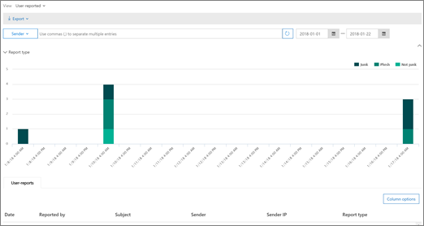

# Ver informes de seguridad de correo electrónico en el Centro de seguridad y cumplimiento

[!INCLUDE [Microsoft 365 Defender rebranding](../includes/microsoft-defender-for-office.md)]

**Se aplica a**
- [Exchange Online Protection](exchange-online-protection-overview.md)
- [Plan 1 y Plan 2 de Microsoft Defender para Office 365](defender-for-office-365.md)
- [Microsoft 365 Defender](../defender/microsoft-365-defender.md)

Hay varios informes disponibles en el Centro de seguridad y cumplimiento de & para ayudarle [a](https://protection.office.com) ver cómo las características de seguridad del correo electrónico, como el correo no deseado, antimalware y las características de cifrado en Microsoft 365 protegen su organización. Si tiene los permisos [necesarios,](#what-permissions-are-needed-to-view-these-reports)puede ver estos informes en el Centro de seguridad & cumplimiento yendo al **Panel de** \> **informes**. Para ir directamente al panel Informes, abra <https://protection.office.com/insightdashboard> .

## Informe de usuarios comprometidos

> [!NOTE]
> Este informe está disponible en Microsoft 365 organizaciones con Exchange Online buzones de correo. No está disponible en organizaciones independientes Exchange Online Protection (EOP).

El **informe Usuarios comprometidos** muestra el número de  cuentas  de usuario que se marcaron como Sospechosas o Restringidas en los últimos 7 días. Las cuentas en cualquiera de estos estados son problemáticas o incluso están en peligro. Con el uso frecuente, puede usar el informe para detectar picos e incluso tendencias en cuentas sospechosas o restringidas. Para obtener más información acerca de los usuarios en peligro, vea [Responder a una cuenta de correo electrónico comprometida.](responding-to-a-compromised-email-account.md)

La vista de agregado muestra los datos de los últimos 90 días y la vista de detalles muestra los datos de los últimos 30 días.

Para ver el informe, abra el Centro de  [seguridad & cumplimiento,](https://protection.office.com)vaya al Panel de informes y seleccione \>  **Usuarios comprometidos.** Para ir directamente al informe, abra <https://protection.office.com/reportv2?id=CompromisedUsers> .

Puede filtrar tanto el gráfico como la tabla de detalles haciendo clic en **Filtros** y seleccionando uno o varios de los siguientes valores:

- **Fecha de inicio** y **fecha de finalización**

- **Sospechoso:** la cuenta de usuario ha enviado un correo electrónico sospechoso y corre el riesgo de que se le restringa el envío de correo electrónico.

- **Restringido:** la cuenta de usuario se ha restringido para enviar correo electrónico debido a patrones altamente sospechosos.

Si hace clic **en Ver tabla de detalles,** puede ver los siguientes detalles:

- **Tiempo de creación**
- **Nombre de usuario**
- **Action**

Para volver a la vista informe, haga clic **en Ver informe**.

## Informe de cifrado

El **informe de cifrado** está disponible en EOP (suscripciones con buzones en Exchange Online o EOP independiente sin Exchange Online buzones de correo). El equipo de seguridad de su organización puede usar la información de este informe para identificar patrones y aplicar o ajustar proactivamente directivas para mensajes de correo electrónico confidenciales. Por ejemplo:

- Si ve un gran número de mensajes de correo electrónico cifrados por los usuarios, es posible que desee agregar una directiva de cifrado para automatizar el cifrado en determinados casos de uso. Para obtener más información, vea [Define mail flow rules to encrypt email messages in Microsoft 365](../../compliance/define-mail-flow-rules-to-encrypt-email.md).

- Si tiene varias plantillas de cifrado disponibles, pero nadie las usa, puede explorar si los usuarios necesitan formación en características.

La vista de agregado permite filtrar durante los últimos 90 días, mientras que la vista de detalles permite filtrar durante 10 días.

Para ver el informe, abra el Centro de  [seguridad & cumplimiento,](https://protection.office.com)vaya al Panel \> **de informes** y seleccione **Informe de cifrado**. Para ir directamente al informe, abra <https://protection.office.com/reportv2?id=EncryptionReport> .

Para obtener más información sobre el cifrado, vea [Cifrado de correo electrónico en Microsoft 365](../../compliance/email-encryption.md).

### Vista Informe para el informe de cifrado

Puede usar los siguientes filtros en el gráfico:

- **Ver datos por: Informe de cifrado de** mensajes y Dividir **por: Método de cifrado:** Los siguientes métodos de cifrado están disponibles:

  - **Cifrado por usuario**
  - **Cifrado por directiva**

  Si hace clic **en Filtros,** puede modificar el gráfico con los filtros siguientes:

  - **Fecha de inicio** y **fecha de finalización**
  - Método de cifrado.
  - Plantilla de cifrado.

- **Ver datos por: Informe de cifrado de** mensajes y Dividir **por: Plantilla de cifrado**: Los siguientes métodos de cifrado están disponibles:

  - **No reenviar**
  - **Cifrar solo**
  - **OME anterior**
  - **Personalizados**

  Si hace clic **en Filtros,** puede modificar el gráfico con los filtros siguientes:

  - **Fecha de inicio** y **fecha de finalización**
  - Método de cifrado
  - Plantilla de cifrado

- **Ver datos por: Principales 5** dominios de destinatarios: esta vista muestra un gráfico circular con recuentos de mensajes enviados para los 5 dominios de destinatarios principales.

  Si hace clic **en Filtros,** puede seleccionar una **fecha de inicio y** una fecha de **finalización.**

### Vista de tabla Detalles del informe de cifrado

Si hace clic **en Ver tabla de detalles,** la información que se muestra depende del gráfico que estaba mirando:

- **Dividir por: Método de cifrado o** Dividir **por: Plantilla de cifrado**: Se muestra la siguiente información:

  - **Fecha**
  - **Dirección del remitente**
  - **Plantilla de cifrado**
  - **Método de cifrado**
  - **Dirección de destinatario**
  - **Asunto**

- **Ver datos por: Dominios de destinatarios principales:**

  - **Fecha**
  - **Dominio del destinatario**
  - **Recuento de mensajes**

Si hace clic **en Filtros en** una vista de tabla de detalles, puede modificar los resultados con los filtros siguientes:

- **Fecha de inicio** y **fecha de finalización**
- Método de cifrado
- Plantilla de cifrado

Para volver a la vista informe, haga clic **en Ver informe**.

## Informe de estado de flujo de correo

El **informe de estado de flujo de** correo contiene información sobre malware, correo no deseado, phishing y mensajes bloqueados perimetrales. Para obtener más información, vea [Mailflow status report](view-mail-flow-reports.md#mailflow-status-report).

## Detecciones de malware en el informe de correo electrónico

El **informe Detecciones de** malware en el correo electrónico muestra información sobre detecciones de malware en mensajes de correo electrónico entrantes y salientes (malware detectado por Exchange Online Protection o EOP). Para obtener más información acerca de la protección contra malware en EOP, vea [Protección contra malware en EOP](anti-malware-protection.md).

 El filtro de vista agregado permite 90 días, mientras que el filtro de tabla de detalles solo permite 10 días.

Para ver el informe, abra el Centro de  [seguridad y & cumplimiento,](https://protection.office.com)vaya al Panel de informes y seleccione Detecciones de \>  malware en el **correo electrónico**. Para ir directamente al informe, abra <https://protection.office.com/reportv2?id=MalwareDetections> .

Puede filtrar tanto el gráfico como la tabla de detalles haciendo clic **en Filtros** y seleccionando:

- **Fecha de inicio** y **fecha de finalización**
- **Entrante**
- **Saliente**

Si hace clic **en Ver tabla de detalles,** puede ver los siguientes detalles:

- **Fecha**
- **Dirección del remitente**
- **Dirección de destinatario**
- **Id. de** mensaje: disponible en el **campo de encabezado Id. de** mensaje en el encabezado del mensaje y debe ser único. Un valor de ejemplo es `<08f1e0f6806a47b4ac103961109ae6ef@server.domain>` (tenga en cuenta los corchetes angulares).
- **Asunto**
- **Filename**
- **Nombre de malware**

Para volver a la vista informe, haga clic **en Ver informe**.

## Informe de latencia de correo

El **informe de latencia de correo** contiene información sobre la latencia de entrega y detonación de correo experimentada en su organización. Para obtener más información, vea [Informe de latencia de correo](view-reports-for-mdo.md#mail-latency-report).

## Informe de correo electrónico enviado y recibido

El **informe de correo electrónico** enviado y recibido contiene información sobre malware, correo no deseado, reglas de flujo de correo (también conocidas como reglas de transporte) y detecciones avanzadas de malware después de que el correo electrónico entre en el servicio. Para obtener más información, vea [Sent and received email report](view-mail-flow-reports.md#sent-and-received-email-report).

## Informe de detecciones de correo no deseado

El **informe Detecciones de** correo no deseado muestra los mensajes de correo electrónico no deseado bloqueados por EOP. Los mensajes se cuentan individualmente, no por destinatario. Por ejemplo, si el mismo mensaje de correo no deseado se envió a 100 destinatarios de la organización, cuenta como un mensaje.

La vista de agregado permite el filtrado de 90 días, mientras que la tabla de detalles permite el filtrado de 10 días.

Para ver el informe, abra el Centro de  [seguridad & cumplimiento,](https://protection.office.com)vaya al Panel de informes y seleccione Detecciones de correo \>  no **deseado.** Para ir directamente al informe, abra <https://protection.office.com/reportv2?id=SpamDetections> .

Para obtener más información acerca de la protección contra correo no deseado, vea [Protección contra correo no deseado en EOP](anti-spam-protection.md).

### Vista Informe para el informe de detecciones de correo no deseado

Los gráficos siguientes están disponibles en la vista informe:

- **Dividir por: Acción:** se muestran los siguientes tipos de eventos:

  - **Filtrado de contenido de correo no deseado**
  - **Bloqueo ip de correo no deseado**
  - **Bloqueo de sobre de correo no deseado**
  - **Filtro DBEB de correo no** deseado: bloqueo perimetral basado en directorios (DBEB)

  Cuando mantiene el mouse sobre un día (punto de datos) en el gráfico, puede ver cuántos elementos se bloquearon ese día, así como cómo se clasifican esos elementos.

  

- **Dividir por: Dirección:** se muestran las siguientes direcciones:

  - **Entrante**
  - **Saliente**

  

Si hace clic **en Filtros** en una vista de informe, puede modificar los resultados con los filtros siguientes:

- **Fecha de inicio** y **fecha de finalización**
- Valores de dirección
- Valores de tipo de evento

### Vista de tabla Detalles del informe de detecciones de correo no deseado

Si hace clic en **Ver tabla de detalles** en cualquier vista de informe, se muestra la siguiente información:

- **Fecha**
- **Dirección del remitente**
- **Dirección de destinatario**
- **Tipo de evento**
- **Action**
- **Asunto**

Si hace clic **en Filtros** en una tabla de detalles, puede modificar los resultados con los filtros siguientes:

- **Fecha de inicio** y **fecha de finalización**
- Valores de dirección
- Valores de tipo de evento

Para volver a la vista informe, haga clic **en Ver informe**.

## Informe de detecciones de suplantación

> [!NOTE]
> El informe de detecciones de suplantación mejoradas, tal como se describe en este artículo, está en versión preliminar, está sujeto a cambios y no está disponible en todas las organizaciones. La versión anterior del informe mostraba solo **Correo bueno** y Capturado como correo **no deseado.**

El **informe Detecciones** de suplantación muestra información sobre los mensajes bloqueados o permitidos debido a la suplantación. Para obtener más información acerca de la suplantación, vea Protección contra la suplantación [en EOP](anti-spoofing-protection.md).

La vista de agregado del informe permite 45 días de filtrado, mientras que la vista de detalles solo permite \* diez días de filtrado.

\* Con el tiempo, podrás usar hasta 90 días de filtrado.

Para ver el informe, abra el Centro de  [seguridad & cumplimiento,](https://protection.office.com)vaya al Panel de informes y \>  seleccione **Detecciones de suplantación de seguridad.** Para ir directamente al informe, abra <https://protection.office.com/reportv2?id=SpoofMailReport> .

Al pasar el mouse sobre un día (punto de datos) en el gráfico, puede ver cuántos mensajes suplantados se detectaron y por qué.

Puede filtrar tanto el gráfico como la tabla de detalles haciendo clic en **Filtros** y seleccionando uno o varios de los siguientes valores:

- **Fecha de inicio** y **fecha de finalización**

- **Resultado**
  - **Pasar**
  - **Error**
  - **SoftPass**
  - **Ninguna**
  - **Otros**

- **Tipo de suplantación:** **Interno** y **Externo**

Si hace clic **en Ver tabla de detalles,** puede ver los siguientes detalles:

- **Fecha**
- **Usuario suplantado**
- **Infraestructura de envío**
- **Tipo de suplantación**
- **Resultado**
- **Código de resultados**
- **SPF**
- **DKIM**
- **DMARC**
- **Recuento de mensajes**

Para volver a la vista informe, haga clic **en Ver informe**.

Para obtener más información acerca de los códigos de resultados de autenticación compuesta, vea [Encabezados de mensajes](anti-spam-message-headers.md)contra correo no deseado en Microsoft 365 .

## Informe de estado de protección contra amenazas

El **informe de estado de** protección contra amenazas está disponible en EOP y Microsoft Defender para Office 365; sin embargo, los informes contienen datos diferentes. Por ejemplo, los clientes de EOP pueden ver información sobre malware detectado en el correo electrónico, pero no información sobre archivos malintencionados detectados por [Caja fuerte Attachments for SharePoint, OneDrive](mdo-for-spo-odb-and-teams.md)y Microsoft Teams .

El informe proporciona el recuento de mensajes de correo electrónico con contenido malintencionado, como archivos o direcciones de sitio web (URL) bloqueadas por el motor antimalware, purga automática de hora cero [(ZAP)](zero-hour-auto-purge.md)y Defender para características de Office 365 como vínculos [de Caja fuerte,](safe-links.md)datos adjuntos de [Caja fuerte](safe-attachments.md)y anti [phishing.](set-up-anti-phishing-policies.md) Puede usar esta información para identificar tendencias o determinar si las directivas de la organización necesitan ajustes.

**Nota:** Es importante comprender que si un mensaje se envía a cinco destinatarios, lo contamos como cinco mensajes diferentes y no un mensaje.

Para ver el informe, abra el Centro de  [seguridad & cumplimiento,](https://protection.office.com)vaya al Panel de informes y seleccione Estado de protección \>  **contra amenazas**. Para ir directamente al informe, abra una de las siguientes direcciones URL:

- Microsoft Defender para Office 365:<https://protection.office.com/reportv2?id=TPSAggregateReportATP>
- EOP: <https://protection.office.com/reportv2?id=TPSAggregateReport>

De forma predeterminada, el gráfico muestra los datos de los últimos 7 días. Si hace clic **en Filtros,** puede seleccionar un intervalo de fechas de 90 días (las suscripciones de prueba podrían limitarse a 30 días). La vista de tabla de detalles permite filtrar durante 30 días.

### Vista Informe para el informe de estado de protección contra amenazas

Están disponibles las siguientes vistas:

- **Ver datos por: Información general:** se muestra la siguiente información de detección:

  - **Malware de correo electrónico**
  - **Phish de correo electrónico**
  - **Malware de contenido**

  

- **Ver datos por: Contenido \> Malware**1:Se muestra la siguiente información para Microsoft Defender para Office 365 organizaciones:

  - **Motor antimalware:** archivos malintencionados detectados en Sharepoint, OneDrive y Microsoft Teams por la detección de virus integrada en [Microsoft 365](virus-detection-in-spo.md).
  - **Detonación de archivos:** archivos malintencionados detectados por Caja fuerte datos adjuntos para [SharePoint, OneDrive y Microsoft Teams](mdo-for-spo-odb-and-teams.md).

  

- **Ver datos por: Invalidación de** mensaje: se muestra la siguiente información de motivo de invalidación:

  - **Omitir localmente**
  - **Permitir IP**
  - **Regla de flujo de correo**
  - **Permitir remitente**
  - **Permitir dominio**
  - **ZAP no habilitado**
  - **Carpeta de correo no deseado no habilitada**
  - **Remitente Caja fuerte usuario**
  - **Dominio Caja fuerte usuario**

  

- **Dividir por: Tecnología de detección** y **Ver datos por: Email \> Phish**: Se muestra la siguiente información:

  - **Reputación** de url generada por ATP 1:reputación de url malintencionada generada desde Defender para Office 365 detonaciones en otros Microsoft 365 clientes.
  - **Filtro de phishing** avanzado: señales de suplantación de identidad basadas en el aprendizaje automático.
  - **Anti-spoof: error dmarc:** error de autenticación dmarc en mensajes.
  - **Anti-spoof - intra-org**: El remitente está intentando suplantación del dominio de destinatario.
  - **Anti-spoof - external domain**: Sender is trying to spoof some other domain.
  - **Suplantación de marca:** suplantación de marcas conocidas basadas en remitentes.
  - **Suplantación de dominio**1:suplantación de dominios que el cliente posee o define.
  - **Reputación de dirección URL de EOP:** reputación de url malintencionada.
  - **Filtro de phishing** general: señales de suplantación de identidad basadas en reglas de analista.
  - **Otros**
  - **Phish ZAP**2:Purga automática de cero horas de mensajes de suplantación de identidad.
  - **Detonación de dirección URL**1
  - **Suplantación de usuario**1:suplantación de usuarios definida por el administrador o aprendida a través de la inteligencia de buzones.

  

- **Dividir por: Tecnología de detección** y **Ver datos por: Malware \> de correo** electrónico : Se muestra la siguiente información:

  - **Reputación de archivo generada por ATP**1:toda la reputación de archivos malintencionados generada por Defender para Office 365 detonaciones.
  - **Motor antimalware**1:Detección de motores antimalware.
  - Bloque de tipo de archivo de directiva **antimalware:** se trata de mensajes de correo electrónico filtrados debido al tipo de archivo malintencionado identificado en el mensaje.
  - **Detonación de archivos**1:Detección por Caja fuerte datos adjuntos.
  - **Reputación de archivos malintencionados**
  - **MALWARE ZAP**2
  - **Otros**

  

- **Dividir por: Tipo de directiva** y Ver datos **por: Email \> Phish** o **View data by: Email \> Malware**: Se muestra la siguiente información:

  - **Antimalware**
  - **Caja fuerte adjuntos**1
  - **Anti-phish**
  - **Contra correo no deseado**
  - **Regla de flujo de** correo (también conocida como regla de transporte)
  - **Otros**

  

- **Dividir por: Estado de** entrega y Ver datos por: Correo electrónico **\> Phish** o Ver datos **por: Malware de \> correo** electrónico : Se muestra la siguiente información:

  - **Error en la entrega**
  - **Se ha descartado**
  - **Reenviado**
  - **Buzón hospedado: carpeta personalizada**
  - **Buzón hospedado: elementos eliminados**
  - **Buzón hospedado: Bandeja de entrada**
  - **Buzón hospedado: correo no deseado**
  - **Servidor local: entregado**
  - **Cuarentena**

  

1 Defender para Office 365 solo

2 La purga automática de cero horas (ZAP) no está disponible en EOP independiente (solo funciona en Exchange Online buzones).

Si hace clic **en Filtros,** los filtros disponibles dependen del gráfico que esté mirando:

- Para **Ver datos por: Malware \> de** contenido, puede modificar el informe por fecha **de** inicio y fecha de **finalización,** y el valor **Detección.**

- Para **Ver datos por: Invalidación de** mensajes, puede modificar el informe con los filtros siguientes:

  - **Fecha de inicio** y **fecha de finalización**
  - **Motivo de invalidación**
  - **Etiqueta:** filtre los resultados por usuarios o grupos a los que se aplicó la etiqueta de usuario especificada (incluidas las cuentas de prioridad). Para obtener más información acerca de las etiquetas de usuario, vea [Etiquetas de usuario](user-tags.md).
  - **Dominio**

- Para el resto de vistas, puede modificar el informe con los filtros siguientes:

  - **Fecha de inicio** y **fecha de finalización**
  - **Detección**
  - **Protegido por**: **ATP** o **EOP**
  - **Etiqueta:** filtre los resultados por usuarios o grupos a los que se aplicó la etiqueta de usuario especificada (incluidas las cuentas de prioridad). Para obtener más información acerca de las etiquetas de usuario, vea [Etiquetas de usuario](user-tags.md).
  - **Dominio**

### Vista de tabla Detalles del informe de estado de protección contra amenazas

Si hace clic **en Ver tabla de detalles,** la información que se muestra depende del gráfico que estaba mirando:

- **Ver datos por: Información general:** No **hay disponible** el botón Ver tabla de detalles.

- **Ver datos por: Contenido \> Malware**:

  - **Fecha**
  - **Location**
  - **Dirigido por**
  - **Nombre de malware**

  Si hace clic **en Filtros** en esta  vista, puede modificar el informe por fecha de inicio y fecha de **finalización,** y el valor **Detección.**

- **Ver datos por: Invalidación de mensaje**:

  - **Fecha**
  - **Asunto**
  - **Remitente**
  - **Destinatarios**
  - **Detectado por**
  - **Motivo de invalidación**
  - **Origen de la transacción**
  - **Tags**

  Si hace clic **en Filtros** en esta vista, puede modificar el informe con los filtros siguientes:

  - **Fecha de inicio** y **fecha de finalización**
  - **Motivo de invalidación**
  - **Etiqueta:** filtre los resultados por usuarios o grupos a los que se aplicó la etiqueta de usuario especificada (incluidas las cuentas de prioridad). Para obtener más información acerca de las etiquetas de usuario, vea [Etiquetas de usuario](user-tags.md).
  - **Dominio**
  - **Destinatarios** (tenga en cuenta que esta propiedad filtrable solo está disponible en la vista de tabla de detalles)

- Todos los demás gráficos:

  - **Fecha**
  - **Asunto**
  - **Remitente**
  - **Destinatarios**
  - **Detectado por**
  - **Estado de entrega**
  - **Origen de la transacción**
  - **Tags**

  Si hace clic **en Filtros,** puede modificar el informe con los filtros siguientes:

  - **Fecha de inicio** y **fecha de finalización**
  - **Detección**
  - **Protegido por**: **Defender para Office 365** o **EOP**
  - **Etiqueta:** filtre los resultados por usuarios o grupos a los que se aplicó la etiqueta de usuario especificada (incluidas las cuentas de prioridad). Para obtener más información acerca de las etiquetas de usuario, vea [Etiquetas de usuario](user-tags.md).
  - **Dominio**
  - **Destinatarios** (tenga en cuenta que esta propiedad filtrable solo está disponible en la vista de tabla de detalles)

## Informe de malware superior

El **informe de malware** top muestra los distintos tipos de malware detectados por la protección [antimalware en EOP](anti-malware-protection.md).

Para ver el informe, abra el Centro de  [seguridad & cumplimiento,](https://protection.office.com)vaya al Panel \> **de informes** y seleccione Top **malware**. Para ir directamente al informe, abra <https://protection.office.com/reportv2?id=TopMalware> .

Al pasar el mouse sobre una cuña en el gráfico circular, puede ver el nombre de un tipo de malware y cuántos mensajes se detectaron como que tienen ese malware.

Si hace clic **en Ver tabla de detalles,** puede ver los siguientes detalles:

- **Malware superior**
- **Count**

Si hace clic **en Filtros en** la vista informe o en la vista tabla detalles, puede especificar un intervalo de fechas con **Fecha** de inicio y Fecha **de finalización.**

## Informe de protección contra amenazas de url

El **informe de protección contra amenazas de url** está disponible en Microsoft Defender para Office 365. Para obtener más información, vea [Informe de protección contra amenazas de url](view-reports-for-mdo.md#url-threat-protection-report).

## Informe de mensajes notificados por el usuario

El **informe** de mensajes notificados por el usuario muestra información sobre los mensajes de correo electrónico que los usuarios han notificado como correo no deseado, intentos de suplantación de identidad o correo bueno mediante el complemento Report [Message o](enable-the-report-message-add-in.md) el complemento Report [Phishing](enable-the-report-phish-add-in.md).

Los detalles están disponibles para cada mensaje, incluido el motivo de entrega, como una excepción de directiva de correo no deseado o una regla de flujo de correo configurada para su organización. Para ver detalles, seleccione un elemento en la lista de  informes de usuario y, a continuación, vea la información en las pestañas Resumen **y** Detalles.

Para ver este informe, en el Centro de [seguridad & cumplimiento](https://protection.office.com), realice una de las siguientes acciones:

- Vaya a **Administración de amenazas** \> **Mensajes** \> **notificados por el usuario.**

- Vaya a **Administración de amenazas** \> **Revisar** \> **mensajes notificados por el usuario**.

> [!IMPORTANT]
> Para que el informe de mensajes notificados  por el usuario funcione correctamente, el registro de auditoría debe estar activado para el Office 365 usuario. Esto lo suele hacer alguien que tenga el rol Registros de auditoría asignado en Exchange Online. Para obtener más información, vea Activar Microsoft 365 o desactivar la búsqueda del [registro de auditoría.](../../compliance/turn-audit-log-search-on-or-off.md)

## ¿Qué permisos se necesitan para ver estos informes?

Para ver y usar los informes descritos en este artículo, debe ser miembro de uno de los siguientes grupos de roles en el Centro de seguridad & cumplimiento:

- **Administración de organizaciones**
- **Administrador de seguridad**
- **Lector de seguridad**
- **Lector global**

Para obtener más información, vea [Permisos en el Centro de seguridad y cumplimiento](permissions-in-the-security-and-compliance-center.md).

**Nota:** Agregar usuarios al rol Azure Active Directory correspondiente en el Centro de administración de Microsoft 365 proporciona a  los usuarios los permisos necesarios en el Centro de seguridad y cumplimiento de & y permisos para otras características de Microsoft 365. Para más información, vea [Sobre los roles de administrador](../../admin/add-users/about-admin-roles.md).

## ¿Qué ocurre si los informes no muestran datos?

Si no ve datos en los informes, compruebe que las directivas están configuradas correctamente. Para obtener más información, vea [Protect against threats](protect-against-threats.md).

## Temas relacionados

[Protección contra correo no deseado y antimalware en EOP](anti-spam-and-anti-malware-protection.md)

[Informes inteligentes y reportes en el Centro de seguridad y cumplimiento](reports-and-insights-in-security-and-compliance.md)

[Ver informes de flujo de correo en el Centro de seguridad & cumplimiento](view-mail-flow-reports.md)

[Ver informes de Defender para Office 365](view-reports-for-mdo.md)
