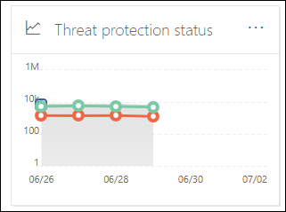

# Ver informes de seguridad de correo electrónico en el Centro de seguridad y cumplimientoView email security reports in the Security & Compliance Center

[!INCLUDE [Microsoft 365 Defender rebranding](../includes/microsoft-defender-for-office.md)]

**Se aplica a****Applies to**
- [Exchange Online ProtectionExchange Online Protection](exchange-online-protection-overview.md)
- [Plan 1 y Plan 2 de Microsoft Defender para Office 365Microsoft Defender for Office 365 plan 1 and plan 2](office-365-atp.md)
- [Microsoft 365 DefenderMicrosoft 365 Defender](../mtp/microsoft-threat-protection.md)

Hay varios informes disponibles en el Centro de seguridad y cumplimiento de [&](https://protection.office.com) para ayudarle a ver cómo protegen su organización las características de seguridad de correo electrónico, como el correo no deseado, el malware y las características de cifrado de Microsoft 365.A variety of reports are available in the [Security & Compliance Center](https://protection.office.com) to help you see how email security features, such as anti-spam, anti-malware, and encryption features in Microsoft 365 are protecting your organization. Si tiene los permisos [necesarios,](#what-permissions-are-needed-to-view-these-reports)puede ver estos informes en el Centro  de seguridad & Cumplimiento yendo al Panel \> **de informes.**If you have the [necessary permissions](#what-permissions-are-needed-to-view-these-reports), you can view these reports in the Security & Compliance Center by going to **Reports** \> **Dashboard**. Para ir directamente al panel Informes, abra <https://protection.office.com/insightdashboard> .To go directly to the Reports dashboard, open <https://protection.office.com/insightdashboard>.

## Informe de usuarios comprometidosCompromised users report

> [!NOTE]
> Este informe está disponible en organizaciones de Microsoft 365 con buzones de Exchange Online.This report is available in Microsoft 365 organizations with Exchange Online mailboxes. No está disponible en organizaciones independientes de Exchange Online Protection (EOP).It's not available in standalone Exchange Online Protection (EOP) organizations.

El **informe de usuarios comprometidos** muestra el número  de  cuentas de usuario que se marcaron como sospechosas o restringidas en los últimos 7 días.The **Compromised users** report shows shows the number of user accounts that were marked as **Suspicious** or **Restricted** within the last 7 days. Las cuentas de cualquiera de estos estados son problemáticas o incluso están en peligro.Accounts in either of these states are problematic or even compromised. Con el uso frecuente, puede usar el informe para detectar picos e incluso tendencias en cuentas sospechosas o restringidas.With frequent use, you can use the report to spot spikes, and even trends, in suspicious or restricted accounts. Para obtener más información acerca de los usuarios comprometidos, consulte [Responder a una cuenta de correo electrónico en peligro.](responding-to-a-compromised-email-account.md)For more information about compromised users, see [Responding to a compromised email account](responding-to-a-compromised-email-account.md).

La vista de agregado muestra los datos de los últimos 90 días y la vista de detalles muestra los datos de los últimos 30 días.The aggregate view shows data for the last 90 days and the detail view shows data for the last 30 days.

Para ver el informe, abra el Centro de  seguridad [& cumplimiento,](https://protection.office.com)vaya al Panel de \>  informes y seleccione **Usuarios comprometidos.**To view the report, open the [Security & Compliance Center](https://protection.office.com), go to **Reports** \> **Dashboard** and select **Compromised users**. Para ir directamente al informe, abra <https://protection.office.com/reportv2?id=CompromisedUsers> .To go directly to the report, open <https://protection.office.com/reportv2?id=CompromisedUsers>.

Puede filtrar el gráfico y la  tabla de detalles haciendo clic en Filtros y seleccionando uno o varios de los siguientes valores:You can filter both the chart and the details table by clicking **Filters** and selecting one or more of the following values:

- **Fecha de inicio** y **fecha de finalización****Start date** and **End date**

- **Sospechoso:** la cuenta de usuario ha enviado un correo electrónico sospechoso y corre el riesgo de que se le restringa el envío de correo electrónico.**Suspicious**: The user account has sent suspicious email and is at risk of being restricted from sending email.

- **Restringido:** se ha restringido el envío de correo electrónico a la cuenta de usuario debido a patrones altamente sospechosos.**Restricted**: The user account has been restricted from sending email due to highly suspicious patterns.

Si hace clic **en Ver tabla de detalles,** puede ver los siguientes detalles:If you click **View details table**, you can see the following details:

- **Hora de creación****Creation time**
- **Nombre de usuario****User ID**
- **Acción****Action**

Para volver a la vista informe, haga clic **en Ver informe.**To go back to the report view, click **View report**.

## Informe de cifradoEncryption report

El **informe de cifrado** está disponible en EOP (suscripciones con buzones en Exchange Online o EOP independiente sin buzones de Exchange Online).The **Encryption report** is available in EOP (subscriptions with mailboxes in Exchange Online or standalone EOP without Exchange Online mailboxes). El equipo de seguridad de su organización puede usar la información de este informe para identificar patrones y aplicar o ajustar directivas de forma proactiva para mensajes de correo electrónico confidenciales.Your organization's security team can use information in this report to identify patterns and proactively apply or adjust policies for sensitive email messages. Por ejemplo:For example:

- Si ve un gran número de mensajes de correo electrónico cifrados por los usuarios, es posible que desee agregar una directiva de cifrado para automatizar el cifrado en determinados casos de uso.If you see a high number of email messages encrypted by users, you might want to add an encryption policy to automate encryption for certain use cases. Para obtener más información, vea [Definir reglas de flujo de correo para cifrar mensajes de correo electrónico en Microsoft 365.](../../compliance/define-mail-flow-rules-to-encrypt-email.md)For more information, see [Define mail flow rules to encrypt email messages in Microsoft 365](../../compliance/define-mail-flow-rules-to-encrypt-email.md).

- Si tiene varias plantillas de cifrado disponibles, pero nadie las usa, puede explorar si los usuarios necesitan formación de características.If you have a number of encryption templates available but no one is using them, you might explore whether users need feature training.

La vista de agregado permite el filtrado de los últimos 90 días, mientras que la vista de detalles permite el filtrado durante 10 días.The aggregate view allows filtering for the last 90 days, while the detail view allows filtering for 10 days.

Para ver el informe, abra el Centro de  seguridad [& cumplimiento,](https://protection.office.com)vaya al Panel de \>  informes y seleccione Informe **de cifrado.**To view the report, open the [Security & Compliance Center](https://protection.office.com), go to **Reports** \> **Dashboard** and select **Encryption report**. Para ir directamente al informe, abra <https://protection.office.com/reportv2?id=EncryptionReport> .To go directly to the report, open <https://protection.office.com/reportv2?id=EncryptionReport>.

Para obtener más información sobre el cifrado, consulte [Cifrado de correo electrónico en Microsoft 365](../../compliance/email-encryption.md).To learn more about encryption, see [Email encryption in Microsoft 365](../../compliance/email-encryption.md).

### Vista de informe para el informe de cifradoReport view for the Encryption report

Puede usar los siguientes filtros en el gráfico:You can use the following filters on the chart:

- **Ver datos por: Informe de cifrado de mensajes** y Dividir **por: Método de cifrado**: Están disponibles los siguientes métodos de cifrado:**View data by: Message Encryption Report** and **Break down by: Encryption method**: The following encryption methods are available:

  - **Cifrado por usuario****Encryption by user**
  - **Cifrado por directiva****Encryption by policy**

  Si hace clic **en Filtros,** puede modificar el gráfico con los filtros siguientes:If you click **Filters**, you can modify the chart with the following filters:

  - **Fecha de inicio** y **fecha de finalización****Start date** and **End date**
  - Método de cifrado.Encryption method.
  - Plantilla de cifrado.Encryption template.

- **Ver datos por: Informe de cifrado de mensajes** y Dividir **por: Plantilla de cifrado:** Están disponibles los siguientes métodos de cifrado:**View data by: Message Encryption Report** and **Break down by: Encryption template**: The following encryption methods are available:

  - **No reenviar****Do not forward**
  - **Cifrar solo****Encrypt only**
  - **OME anterior****OME previous**
  - **Personalizados****Custom**

  Si hace clic **en Filtros,** puede modificar el gráfico con los filtros siguientes:If you click **Filters**, you can modify the chart with the following filters:

  - **Fecha de inicio** y **fecha de finalización****Start date** and **End date**
  - Método de cifradoEncryption method
  - Plantilla de cifradoEncryption template

- **Ver datos por: principales 5** dominios de destinatarios: esta vista muestra un gráfico circular con recuentos de mensajes enviados para los 5 dominios de destinatarios principales.**View data by: Top 5 recipient domains**: This view shows a pie chart with sent message counts for the top 5 recipient domains.

  Si hace clic **en Filtros,** puede seleccionar una **fecha de inicio y** una fecha de **finalización.**If you click **Filters**, you can select a **Start date** and **End date**.

### Vista de tabla de detalles para el informe de cifradoDetails table view for the Encryption report

Si hace clic **en Ver tabla de detalles,** la información que se muestra depende del gráfico que estaba viendo:If you click **View details table**, the information that's shown depends on the chart you were looking at:

- **Dividir por: Método de cifrado o** Dividir **por: Plantilla de cifrado**: Se muestra la siguiente información:**Break down by: Encryption method** or **Break down by: Encryption template**: The following information is shown:

  - **Fecha****Date**
  - **Dirección del remitente****Sender address**
  - **Plantilla de cifrado****Encryption template**
  - **Método de cifrado****Encryption method**
  - **Dirección del destinatario****Recipient address**
  - **Asunto****Subject**

- **Ver datos por: los 5 dominios de destinatarios principales:****View data by: Top 5 recipient domains**:

  - **Fecha****Date**
  - **Dominio del destinatario****Recipient domain**
  - **Recuento de mensajes****Message count**

Si hace clic **en Filtros** en una vista de tabla de detalles, puede modificar los resultados con los filtros siguientes:If you click **Filters** in a details table view, you can modify the results with the following filters:

- **Fecha de inicio** y **fecha de finalización****Start date** and **End date**
- Método de cifradoEncryption method
- Plantilla de cifradoEncryption template

Para volver a la vista informe, haga clic **en Ver informe.**To go back to the report view, click **View report**.

## Informe de estado de flujo de correoMailflow status report

El **informe de estado de flujo de** correo contiene información sobre malware, correo no deseado, suplantación de identidad y mensajes bloqueados perimetrales.The **Mailflow status report** contains information about malware, spam, phishing and edge blocked messages. Para obtener más información, vea [el informe de estado de flujo de correo.](view-mail-flow-reports.md#mailflow-status-report)For more details, see [Mailflow status report](view-mail-flow-reports.md#mailflow-status-report).

## Detecciones de malware en el informe de correo electrónicoMalware detections in email report

Las detecciones de malware en el informe de correo electrónico muestran información sobre las detecciones de malware en los mensajes de correo electrónico entrantes y **salientes** (malware detectado por Exchange Online Protection o EOP).The **Malware detections in email** report shows information about malware detections in incoming and outgoing email messages (malware detected by Exchange Online Protection or EOP). Para obtener más información acerca de la protección contra malware en EOP, vea [Protección antimalware en EOP.](anti-malware-protection.md)For more information about malware protection in EOP, see [Anti-malware protection in EOP](anti-malware-protection.md).

 El filtro de vista agregado permite 90 días, mientras que el filtro de tabla de detalles solo permite 10 días.The aggregate view filter allows for 90 days, while the details table filter only allows for 10 days.

Para ver el informe, abra el Centro de  seguridad [& cumplimiento,](https://protection.office.com)vaya al Panel de informes y seleccione \>  Detecciones de malware por correo **electrónico.**To view the report, open the [Security & Compliance Center](https://protection.office.com), go to **Reports** \> **Dashboard** and select **Malware detections in email**. Para ir directamente al informe, abra <https://protection.office.com/reportv2?id=MalwareDetections> .To go directly to the report, open <https://protection.office.com/reportv2?id=MalwareDetections>.

Puede filtrar el gráfico y la tabla de detalles haciendo clic en **Filtros** y seleccionando:You can filter both the chart and the details table by clicking **Filters** and selecting:

- **Fecha de inicio** y **fecha de finalización****Start date** and **End date**
- **Entrada****Inbound**
- **Saliente****Outbound**

Si hace clic **en Ver tabla de detalles,** puede ver los siguientes detalles:If you click **View details table**, you can see the following details:

- **Fecha****Date**
- **Dirección del remitente****Sender address**
- **Dirección del destinatario****Recipient address**
- **Id. de** mensaje: disponible en el **campo de encabezado Id.** de mensaje en el encabezado del mensaje y debe ser único.**Message ID**: Available in the **Message-ID** header field in the message header and should be unique. Un valor de ejemplo es `<08f1e0f6806a47b4ac103961109ae6ef@server.domain>` (tenga en cuenta los corchetes angulares).An example value is `<08f1e0f6806a47b4ac103961109ae6ef@server.domain>` (note the angle brackets).
- **Asunto****Subject**
- **Filename****Filename**
- **Nombre de malware****Malware name**

Para volver a la vista informe, haga clic **en Ver informe.**To go back to the report view, click **View report**.

## Informe de latencia de correoMail latency report

El **informe de latencia de correo** contiene información sobre la latencia de entrega y detonación de correo experimentada en la organización.The **Mail latency report** contains information on the mail delivery and detonation latency experienced within your organization. Para obtener más información, vea [el informe de latencia de correo.](view-reports-for-atp.md#mail-latency-report)For more information, see [Mail latency report](view-reports-for-atp.md#mail-latency-report).

## Informe de correo electrónico enviado y recibidoSent and received email report

El **informe de correo electrónico enviado** y recibido contiene información sobre malware, correo no deseado, reglas de flujo de correo (también conocidas como reglas de transporte) y detecciones avanzadas de malware después de que el correo electrónico entre en el servicio.The **Sent and received email** report contains information about malware, spam, mail flow rules (also known as transport rules), and advanced malware detections after email enters the service. Para obtener más información, vea [El informe de correo electrónico enviado y recibido.](view-mail-flow-reports.md#sent-and-received-email-report)For more information, see [Sent and received email report](view-mail-flow-reports.md#sent-and-received-email-report).

## Informe de detecciones de correo no deseadoSpam detections report

El **informe de detecciones de** correo no deseado muestra los mensajes de correo no deseado bloqueados por EOP.The **Spam detections** report shows spam email messages that were blocked by EOP. Los mensajes se cuentan individualmente, no por destinatario.Messages are counted individually, not per recipient. Por ejemplo, si el mismo mensaje de correo no deseado se envió a 100 destinatarios de su organización, cuenta como un mensaje.For example, if the same spam message was sent to 100 recipients in your organization, it counts as one message.

La vista de agregado permite el filtrado de 90 días, mientras que la tabla de detalles permite el filtrado de 10 días.The aggregate view allows for 90 days filtering, while the details table allows for 10 days filtering.

Para ver el informe, abra el Centro de  seguridad [& cumplimiento,](https://protection.office.com)vaya al Panel de informes y seleccione Detecciones \>  de correo **no deseado.**To view the report, open the [Security & Compliance Center](https://protection.office.com), go to **Reports** \> **Dashboard** and select **Spam detections**. Para ir directamente al informe, abra <https://protection.office.com/reportv2?id=SpamDetections> .To go directly to the report, open <https://protection.office.com/reportv2?id=SpamDetections>.

Para obtener más información acerca de la protección contra correo no deseado, vea [Protección contra correo no deseado en EOP.](anti-spam-protection.md)For more information about anti-spam protection, see [Anti-spam protection in EOP](anti-spam-protection.md).

### Vista de informe del informe de detecciones de correo no deseadoReport view for the Spam detections report

Los siguientes gráficos están disponibles en la vista de informe:The following charts are available in the report view:

- **Dividir por: Acción:** se muestran los siguientes tipos de evento:**Break down by: Action**: The following event types are shown:

  - **Contenido de correo no deseado filtrado****Spam content filtered**
  - **Bloqueo de IP de correo no deseado****Spam IP block**
  - **Bloqueo de sobre de correo no deseado****Spam envelope block**
  - **Filtro DBEB de correo no deseado:** bloqueo perimetral basado en directorios (DBEB)**Spam DBEB filter**: Directory based edge blocking (DBEB)

  Al mantener el puntero sobre un día (punto de datos) en el gráfico, puede ver cuántos elementos se bloquearon ese día, así como cómo se clasifican esos elementos.When you hover over a day (data point) in the chart, you can see how many items were blocked that day, as well as how those items are categorized.

  

- **Dividir por: Dirección:** se muestran las siguientes direcciones:**Break down by: Direction**: The following directions are shown:

  - **Entrada****Inbound**
  - **Saliente****Outbound**

  

Si hace clic **en Filtros** en una vista de informe, puede modificar los resultados con los filtros siguientes:If you click **Filters** in a report view, you can modify the results with the following filters:

- **Fecha de inicio** y **fecha de finalización****Start date** and **End date**
- Valores de direcciónDirection values
- Valores de tipo de eventoEvent type values

### Vista de tabla de detalles del informe de detecciones de correo no deseadoDetails table view for the Spam detections report

Si hace clic **en Ver tabla de detalles en** cualquier vista de informe, se muestra la siguiente información:If you click **View details table** in any report view, the following information is shown:

- **Fecha****Date**
- **Dirección del remitente****Sender address**
- **Dirección del destinatario****Recipient address**
- **Tipo de evento****Event type**
- **Acción****Action**
- **Asunto****Subject**

Si hace clic **en Filtros** en una tabla de detalles, puede modificar los resultados con los filtros siguientes:If you click **Filters** in a details table, you can modify the results with the following filters:

- **Fecha de inicio** y **fecha de finalización****Start date** and **End date**
- Valores de direcciónDirection values
- Valores de tipo de eventoEvent type values

Para volver a la vista informe, haga clic **en Ver informe.**To go back to the report view, click **View report**.

## Informe de detecciones de suplantación de seguridadSpoof detections report

El **informe de** detecciones de suplantación muestra cuántos mensajes de correo de suplantación de seguridad se detectaron y cuáles se consideraron "buenos" (correo de suplantación de seguridad realizado por motivos comerciales legítimos).The **Spoof detections** report shows how many spoof mail messages were detected, and of those, which ones were considered "good" (spoof mail done for legitimate business reasons). Para obtener más información acerca de la suplantación de nombre, vea Protección contra la suplantación [en EOP.](anti-spoofing-protection.md)For more information about spoofing, see [Anti-spoofing protection in EOP](anti-spoofing-protection.md).

La vista de agregado del informe permite 90 días de filtrado, mientras que la vista de detalles solo permite diez días de filtrado.The aggregate view of the report allows for 90 days of filtering, while the detail view only allows for ten days of filtering.

Para ver el informe, abra el Centro de  [seguridad & cumplimiento,](https://protection.office.com)vaya al Panel de informes y \>  seleccione **Detecciones de suplantación de seguridad.**To view the report, open the [Security & Compliance Center](https://protection.office.com), go to **Reports** \> **Dashboard** and select **Spoof detections**. Para ir directamente al informe, abra <https://protection.office.com/reportv2?id=SpoofMailReport> .To go directly to the report, open <https://protection.office.com/reportv2?id=SpoofMailReport>.

Al pasar el puntero sobre un día (punto de datos) en el gráfico, puede ver cuántos mensajes de correo de suplantación de voz se enviaron.When you hover over a day (data point) in the chart, you can see how many spoof mail messages came through.

Puede filtrar el gráfico y la  tabla de detalles haciendo clic en Filtros y seleccionando uno o varios de los siguientes valores:You can filter both the chart and the details table by clicking **Filters** and selecting one or more of the following values:

- **Fecha de inicio** y **fecha de finalización****Start date** and **End date**

- **Correo bueno****Good mail**

- **Detectado como correo no deseado****Caught as spam**

Si hace clic **en Ver tabla de detalles,** puede ver los siguientes detalles:If you click **View details table**, you can see the following details:

- **Fecha****Date**
- **Remitente suplantado****Spoofed sender**
- **Remitente verdadero****True sender**
- **IP del remitente****Sender IP**
- **Acción****Action**
- **Recuento de mensajes****Message count**

Para volver a la vista informe, haga clic **en Ver informe.**To go back to the report view, click **View report**.

## Informe de estado de protección contra amenazasThreat protection status report

El **informe de estado de** protección contra amenazas está disponible en EOP y Microsoft Defender para Office 365; sin embargo, los informes contienen datos diferentes.The **Threat protection status** report is available in both EOP and Microsoft Defender for Office 365; however, the reports contain different data. Por ejemplo, los clientes de EOP pueden ver información sobre el malware detectado en el correo electrónico, pero no información sobre archivos malintencionados detectados por datos adjuntos seguros para [SharePoint, OneDrive](atp-for-spo-odb-and-teams.md)y Microsoft Teams.For example, EOP customers can view information about malware detected in email, but not information about malicious files detected by [Safe Attachments for SharePoint, OneDrive, and Microsoft Teams](atp-for-spo-odb-and-teams.md).

El informe proporciona el recuento de mensajes de correo electrónico con contenido malintencionado, como archivos o direcciones de sitio web (DIRECCIONES URL) bloqueadas por el motor antimalware, purga automática de cero horas [(ZAP)](zero-hour-auto-purge.md)y características de Defender para Office 365 como vínculos [seguros,](atp-safe-links.md)datos adjuntos seguros y [antiphishing.](set-up-anti-phishing-policies.md)The report provides the count of email messages with malicious content, such as files or website addresses (URLs) that were blocked by the anti-malware engine, [zero-hour auto purge (ZAP)](zero-hour-auto-purge.md), and Defender for Office 365 features like [Safe Links](atp-safe-links.md), [Safe Attachments](atp-safe-attachments.md), and [Anti-phishing](set-up-anti-phishing-policies.md). Puede usar esta información para identificar tendencias o determinar si las directivas de la organización necesitan ajustes.You can use this information to identify trends or determine whether organization policies need adjustment.

**Nota:** Es importante comprender que si se envía un mensaje a cinco destinatarios, lo contamos como cinco mensajes diferentes y no un mensaje.**Note**: It's important to understand that if a message is sent to five recipients we count it as five different messages and not one message.

Para ver el informe, abra el Centro de  seguridad [& cumplimiento,](https://protection.office.com)vaya al Panel de informes y seleccione Estado de protección \>  contra **amenazas.**To view the report, open the [Security & Compliance Center](https://protection.office.com), go to **Reports** \> **Dashboard** and select **Threat protection status**. Para ir directamente al informe, abra una de las siguientes direcciones URL:To go directly to the report, open one of the following URLs:

- Microsoft Defender para Office 365: <https://protection.office.com/reportv2?id=TPSAggregateReportATP>Microsoft Defender for Office 365: <https://protection.office.com/reportv2?id=TPSAggregateReportATP>
- EOP: <https://protection.office.com/reportv2?id=TPSAggregateReport>EOP: <https://protection.office.com/reportv2?id=TPSAggregateReport>

De forma predeterminada, el gráfico muestra los datos de los últimos 7 días.By default, the chart shows data for the past 7 days. Si hace clic **en Filtros,** puede seleccionar un intervalo de fechas de 90 días (las suscripciones de prueba podrían estar limitadas a 30 días).If you click **Filters**, you can select a 90 day date range (trial subscriptions might be limited to 30 days). La vista de tabla de detalles permite filtrar durante 30 días.The details table view allows filtering for 30 days.

### Vista de informe del informe de estado de protección contra amenazasReport view for the Threat protection status report

Están disponibles las siguientes vistas:The following views are available:

- **Ver datos por: Información general:** se muestra la siguiente información de detección:**View data by: Overview**: The following detection information is shown:

  - **Malware de correo electrónico****Email malware**
  - **Suplantación de identidad de correo electrónico****Email phish**
  - **Malware de contenido****Content malware**

  

- **Ver datos por: Contenido \> Malware**1:se muestra la siguiente información para organizaciones de Microsoft Defender para Office 365:**View data by: Content \> Malware**1: The following information is shown for Microsoft Defender for Office 365 organizations:

  - **Motor antimalware:** archivos malintencionados detectados en SharePoint, OneDrive y Microsoft Teams mediante la detección de virus integrada [en Microsoft 365](virus-detection-in-spo.md).**Anti-malware engine**: Malicious files detected in Sharepoint, OneDrive, and Microsoft Teams by the [built-in virus detection in Microsoft 365](virus-detection-in-spo.md).
  - **Detonación de archivos:** archivos malintencionados detectados por datos adjuntos seguros [para SharePoint, OneDrive y Microsoft Teams](atp-for-spo-odb-and-teams.md).**File detonation**: Malicious files detected by [Safe Attachments for SharePoint, OneDrive, and Microsoft Teams](atp-for-spo-odb-and-teams.md).

  

- **Ver datos por: Invalidación de** mensaje: se muestra la siguiente información de motivo de invalidación:**View data by: Message Override**: The following override reason information is shown:

  - **Skip local****On-premises skip**
  - **Ip permitido****IP Allow**
  - **Regla de flujo de correo****Mail flow rule**
  - **Remitente permitido****Sender allow**
  - **Dominios permitidos****Domain allow**
  - **ZAP no habilitado****ZAP not enabled**
  - **Carpeta de correo no deseado no habilitada****Junk Mail folder not enabled**
  - **Remitente seguro de usuario****User Safe Sender**
  - **Dominio seguro de usuario****User Safe Domain**

  

- **Dividir por: Tecnología de detección** y **Ver datos por: Correo \> electrónico suplantación** de identidad : Se muestra la siguiente información:**Break down by: Detection technology** and **View data by: Email \> Phish**: The following information is shown:

  - **Reputación** de la dirección URL generada por ATP 1:reputación de url malintencionada generada desde Defender para detonaciones de Office 365 en otros clientes de Microsoft 365.**ATP-generated URL reputation**1: Malicious URL reputation generated from Defender for Office 365 detonations in other Microsoft 365 customers.
  - **Filtro de suplantación de** identidad avanzado: señales de suplantación de identidad basadas en el aprendizaje automático.**Advanced phish filter**: Phishing signals based on machine learning.
  - **Anti-spoof - Error de DMARC:** error de autenticación de DMARC en mensajes.**Anti-spoof - DMARC failure**: DMARC authentication failure on messages.
  - **Anti-spoof - dentro de la organización:** el remitente está intentando suplantación de identidad del dominio del destinatario.**Anti-spoof - intra-org**: Sender is trying to spoof the recipient domain.
  - **Anti-spoof - external domain**: Sender is trying to spoof some other domain.**Anti-spoof - external domain**: Sender is trying to spoof some other domain.
  - **Suplantación de marca:** suplantación de marcas conocidas basada en remitentes.**Brand impersonation**: Impersonation of well-known brands based on senders.
  - **Suplantación de dominio**1:suplantación de dominios que el cliente posee o define.**Domain impersonation**1: Impersonation of domains that the customer owns or defines.
  - **Reputación de la dirección URL de EOP:** reputación de la dirección URL malintencionada.**EOP URL reputation**: Malicious URL reputation.
  - **Filtro de suplantación de** identidad general: señales de suplantación de identidad basadas en reglas de analista.**General phish filter**: Phishing signals based on analyst rules.
  - **Otros****Others**
  - **Phish ZAP**2: Purga automática de cero horas de mensajes de suplantación de identidad.**Phish ZAP**2: Zero hour auto purge of phishing messages.
  - **Detonación de dirección URL**1**URL detonation**1
  - **Suplantación de usuario**1:suplantación de usuarios definida por el administrador o aprendida a través de la inteligencia de buzones.**User impersonation**1: Impersonation of users defined by admin or learned through mailbox intelligence.

  

- **Dividir por: Tecnología de detección** y **Ver datos por: Malware de \> correo** electrónico: se muestra la siguiente información:**Break down by: Detection technology** and **View data by: Email \> Malware**: The following information is shown:

  - **Reputación de archivo generada por ATP**1:toda la reputación de archivos malintencionados generada por Defender para detonaciones de Office 365.**ATP-generated file reputation**1: All malicious file reputation generated by Defender for Office 365 detonations.
  - **Motor antimalware**1:Detección de motores antimalware.**Anti-malware engine**1: Detection from anti-malware engines.
  - Bloque de tipo de archivo de directiva **antimalware:** se trata de mensajes de correo electrónico filtrados debido al tipo de archivo malintencionado identificado en el mensaje.**Anti-malware policy file type block**: These are email messages filtered out due to the type of malicious file identified in the message.
  - **Detonación de archivos**1:Detección por datos adjuntos seguros.**File detonation**1: Detection by Safe Attachments.
  - **Reputación de archivos malintencionados****Malicious file reputation**
  - **Malware ZAP**2**Malware ZAP**2
  - **Otros****Others**

  

- **Dividir por: Tipo de directiva** y Ver datos por: Correo electrónico **\> Phish** o Ver datos **por: \> Malware** de correo electrónico: Se muestra la siguiente información:**Break down by: Policy type** and **View data by: Email \> Phish** or **View data by: Email \> Malware**: The following information is shown:

  - **Antimalware****Anti-malware**
  - **Datos adjuntos**seguros 1**Safe Attachments**1
  - **Anti-phish****Anti-phish**
  - **Contra correo no deseado****Anti-spam**
  - **Regla de flujo de** correo (también conocida como regla de transporte)**Mail flow rule** (also known as a transport rule)
  - **Otros****Others**

  

- **Dividir por: Estado de** entrega y Ver datos por: Correo electrónico **\> suplantación** de identidad o ver datos **por: \> Malware** de correo electrónico : Se muestra la siguiente información:**Break down by: Delivery status** and **View data by: Email \> Phish** or **View data by: Email \> Malware**: The following information is shown:

  - **Error en la entrega****Delivery failed**
  - **Dropped****Dropped**
  - **Reenviado****Forwarded**
  - **Buzón hospedado: carpeta personalizada****Hosted mailbox: Custom folder**
  - **Buzón hospedado: elementos eliminados****Hosted mailbox: Deleted items**
  - **Buzón hospedado: Bandeja de entrada****Hosted mailbox: Inbox**
  - **Buzón hospedado: correo no deseado****Hosted mailbox: Junk**
  - **Servidor local: entregado****On-premises server: Delivered**
  - **Cuarentena****Quarantine**

  

1 Defender solo para Office 3651 Defender for Office 365 only

2 Purga automática de cero horas (ZAP) no está disponible en EOP independiente (solo funciona en buzones de Exchange Online).2 Zero-hour auto purge (ZAP) isn't available in standalone EOP (it only works in Exchange Online mailboxes).

Si hace clic **en Filtros,** los filtros disponibles dependen del gráfico que estuviera viendo:If you click **Filters**, the filters available depends on the chart you were looking at:

- Para **ver datos por: Malware de \>** contenido, puede modificar el informe por fecha **de** inicio **y** fecha de finalización, y el valor **de** detección.For **View data by: Content \> Malware**, you can modify the report by **Start date** and **End date**, and the **Detection** value.

- Para **ver datos mediante: Invalidación de** mensaje, puede modificar el informe con los filtros siguientes:For **View data by: Message Override**, you can modify the report with the following filters:

  - **Fecha de inicio** y **fecha de finalización****Start date** and **End date**
  - **Motivo de invalidación****Override Reason**
  - **Etiqueta:** filtre los resultados por usuarios o grupos a los que se haya aplicado la etiqueta de usuario especificada (incluidas las cuentas de prioridad).**Tag**: Filter the results by users or groups that have had the specified user tag applied (including priority accounts). Para obtener más información acerca de las etiquetas de usuario, vea [Etiquetas de usuario.](user-tags.md)For more information about user tags, see [User tags](user-tags.md).
  - **Dominio****Domain**

- Para todas las demás vistas, puede modificar el informe con los filtros siguientes:For all other views, you can modify the report with the following filters:

  - **Fecha de inicio** y **fecha de finalización****Start date** and **End date**
  - **Detección****Detection**
  - **Protegido por:** **ATP** o **EOP****Protected by**: **ATP** or **EOP**
  - **Etiqueta:** filtre los resultados por usuarios o grupos a los que se haya aplicado la etiqueta de usuario especificada (incluidas las cuentas de prioridad).**Tag**: Filter the results by users or groups that have had the specified user tag applied (including priority accounts). Para obtener más información acerca de las etiquetas de usuario, vea [Etiquetas de usuario.](user-tags.md)For more information about user tags, see [User tags](user-tags.md).
  - **Dominio****Domain**

### Vista de tabla de detalles del informe de estado de protección contra amenazasDetails table view for the Threat protection status report

Si hace clic **en Ver tabla de detalles,** la información que se muestra depende del gráfico que estaba viendo:If you click **View details table**, the information that's shown depends on the chart you were looking at:

- **Ver datos por: Información general:** no hay ningún botón **de tabla de detalles** de vista disponible.**View data by: Overview**: No **View details table** button is available.

- **Ver datos por: Contenido \> Malware:****View data by: Content \> Malware**:

  - **Fecha****Date**
  - **Location****Location**
  - **Dirigida por****Directed by**
  - **Nombre de malware****Malware name**

  Si hace clic **en Filtros** en esta vista, puede modificar el informe por fecha de inicio **y** **fecha** de finalización, y el valor **Detección.**If you click **Filters** in this view, you can modify the report by **Start date** and **End date**, and the **Detection** value.

- **Ver datos por: Invalidación de mensaje:****View data by: Message Override**:

  - **Fecha****Date**
  - **Asunto****Subject**
  - **Remitente****Sender**
  - **Destinatarios****Recipients**
  - **Detectado por****Detected by**
  - **Motivo de invalidación****Override Reason**
  - **Origen de peligro****Source of Compromise**
  - **Tags****Tags**

  Si hace clic **en Filtros** en esta vista, puede modificar el informe con los filtros siguientes:If you click **Filters** in this view, you can modify the report with the following filters:

  - **Fecha de inicio** y **fecha de finalización****Start date** and **End date**
  - **Motivo de invalidación****Override Reason**
  - **Etiqueta:** filtre los resultados por usuarios o grupos a los que se haya aplicado la etiqueta de usuario especificada (incluidas las cuentas de prioridad).**Tag**: Filter the results by users or groups that have had the specified user tag applied (including priority accounts). Para obtener más información acerca de las etiquetas de usuario, vea [Etiquetas de usuario.](user-tags.md)For more information about user tags, see [User tags](user-tags.md).
  - **Dominio****Domain**
  - **Destinatarios** (Tenga en cuenta que esta propiedad que se puede filtrar solo está disponible en la vista de tabla de detalles)**Recipients** (Note that this filterable property is only available in the details table view)

- Todos los demás gráficos:All other charts:

  - **Fecha****Date**
  - **Asunto****Subject**
  - **Remitente****Sender**
  - **Destinatarios****Recipients**
  - **Detectado por****Detected by**
  - **Estado de entrega****Delivery Status**
  - **Origen de peligro****Source of Compromise**
  - **Tags****Tags**

  Si hace clic **en Filtros,** puede modificar el informe con los filtros siguientes:If you click **Filters**, you can modify the report with the following filters:

  - **Fecha de inicio** y **fecha de finalización****Start date** and **End date**
  - **Detección****Detection**
  - **Protegido por**: **Defender para Office 365** o **EOP****Protected by**: **Defender for Office 365** or **EOP**
  - **Etiqueta:** filtre los resultados por usuarios o grupos a los que se haya aplicado la etiqueta de usuario especificada (incluidas las cuentas de prioridad).**Tag**: Filter the results by users or groups that have had the specified user tag applied (including priority accounts). Para obtener más información acerca de las etiquetas de usuario, vea [Etiquetas de usuario.](user-tags.md)For more information about user tags, see [User tags](user-tags.md).
  - **Dominio****Domain**
  - **Destinatarios** (Tenga en cuenta que esta propiedad que se puede filtrar solo está disponible en la vista de tabla de detalles)**Recipients** (Note that this filterable property is only available in the details table view)

## Informe de malware principalTop malware report

El **informe de malware** superior muestra los distintos tipos de malware detectados por la protección [antimalware en EOP.](anti-malware-protection.md)The **Top malware** report shows the various kinds of malware that was detected by [anti-malware protection in EOP](anti-malware-protection.md).

Para ver el informe, abra el Centro de  seguridad [& cumplimiento,](https://protection.office.com)vaya al Panel de \>  informes y seleccione **Malware superior.**To view the report, open the [Security & Compliance Center](https://protection.office.com), go to **Reports** \> **Dashboard** and select **Top malware**. Para ir directamente al informe, abra <https://protection.office.com/reportv2?id=TopMalware> .To go directly to the report, open <https://protection.office.com/reportv2?id=TopMalware>.

Al pasar el puntero sobre una malla en el gráfico circular, puede ver el nombre de un tipo de malware y cuántos mensajes se detectaron como malware.When you hover over a wedge in the pie chart, you can see the name of a kind of malware and how many messages were detected as having that malware.

Si hace clic **en Ver tabla de detalles,** puede ver los siguientes detalles:If you click **View details table**, you can see the following details:

- **Malware principal****Top malware**
- **Count****Count**

Si hace clic **en Filtros en** la vista informe o en la vista tabla de detalles, puede especificar un intervalo de fechas con fecha **de** inicio y fecha **de finalización.**If you click **Filters** in the report view or details table view, you can specify a date range with **Start date** and **End date**.

## Informe de protección contra amenazas de URLURL threat protection report

El **informe de protección contra amenazas de** url está disponible en Microsoft Defender para Office 365.The **URL threat protection report** is available in Microsoft Defender for Office 365. Para obtener más información, vea el [informe de protección contra amenazas de url.](view-reports-for-atp.md#url-threat-protection-report)For more information, see [URL threat protection report](view-reports-for-atp.md#url-threat-protection-report).

## Informe de mensajes notificados por el usuarioUser-reported messages report

El  informe de mensajes notificados por el usuario muestra información sobre los mensajes de  correo electrónico que los usuarios han notificado como correo no deseado, intentos de suplantación de identidad o correo electrónico bueno mediante el complemento Informar de mensaje o El complemento de suplantación de identidad de [informe.](enable-the-report-phish-add-in.md)The **User-reported messages** report shows information about email messages that users have reported as junk, phishing attempts, or good mail by using the [Report Message add-in](enable-the-report-message-add-in.md) or [The Report Phishing add-in](enable-the-report-phish-add-in.md).

Los detalles están disponibles para cada mensaje, incluido el motivo de la entrega, como una excepción de directiva de correo no deseado o una regla de flujo de correo configurada para su organización.Details are available for each message, including the delivery reason, such a spam policy exception or mail flow rule configured for your organization. Para ver detalles, seleccione un elemento en la lista de  informes de usuario y, a continuación, vea la información en las pestañas **Resumen** y Detalles.To view details, select an item in the user-reports list, and then view the information on the **Summary** and **Details** tabs.

Para ver este informe, en el Centro de & [cumplimiento,](https://protection.office.com)realice una de las siguientes acciones:To view this report, in the [Security & Compliance Center](https://protection.office.com), do one of the following:

- Vaya a Mensajes **del panel de administración** \> **de** \> **amenazas notificados por el usuario.**Go to **Threat management** \> **Dashboard** \> **User-reported messages**.

- Vaya a **Administración de amenazas** \> **Revisar** \> **mensajes notificados por el usuario.**Go to **Threat management** \> **Review** \> **User-reported messages**.

> [!IMPORTANT]
> Para que el informe de mensajes notificados  por el usuario funcione correctamente, el registro de auditoría debe estar activado para su entorno de Office 365.In order for the User-reported messages report to work correctly, **audit logging must be turned on** for your Office 365 environment. Esto lo suele hacer alguien que tiene el rol Registros de auditoría asignado en Exchange Online.This is typically done by someone who has the Audit Logs role assigned in Exchange Online. Para obtener más información, vea Activar o desactivar la búsqueda del registro de auditoría [de Microsoft 365.](../../compliance/turn-audit-log-search-on-or-off.md)For more information, see [Turn Microsoft 365 audit log search on or off](../../compliance/turn-audit-log-search-on-or-off.md).

## ¿Qué permisos se necesitan para ver estos informes?What permissions are needed to view these reports?

Para ver y usar los informes descritos en este artículo, debe ser miembro de uno de los siguientes grupos de roles en el Centro de seguridad & cumplimiento:In order to view and use the reports described in this article, you need to be a member of one of the following role groups in the Security & Compliance Center:

- **Administración de organizaciones****Organization Management**
- **Administrador de seguridad****Security Administrator**
- **Lector de seguridad****Security Reader**
- **Lector global****Global Reader**

Para más información, consulte [Permisos en el Centro de seguridad y cumplimiento](permissions-in-the-security-and-compliance-center.md).For more information, see [Permissions in the Security & Compliance Center](permissions-in-the-security-and-compliance-center.md).

**Nota:** agregar usuarios al rol de Azure Active Directory correspondiente en el Centro de administración de Microsoft  365 proporciona a los usuarios los permisos necesarios en el Centro de seguridad & Cumplimiento y permisos para otras características de Microsoft 365.**Note**: Adding users to the corresponding Azure Active Directory role in the Microsoft 365 admin center gives users the required permissions in the Security & Compliance Center _and_ permissions for other features in Microsoft 365. Para obtener más información, vea [Sobre los roles de administrador](../../admin/add-users/about-admin-roles.md).For more information, see [About admin roles](../../admin/add-users/about-admin-roles.md).

## ¿Qué ocurre si los informes no muestran datos?What if the reports aren't showing data?

Si no ve datos en los informes, compruebe que las directivas están configuradas correctamente.If you are not seeing data in your reports, double-check that your policies are set up correctly. Para obtener más información, vea [Proteger contra amenazas.](protect-against-threats.md)To learn more, see [Protect against threats](protect-against-threats.md).

## Temas relacionadosRelated topics

[Protección contra correo electrónico no deseado y antimalware en EOPAnti-spam and anti-malware protection in EOP](anti-spam-and-anti-malware-protection.md)

[Informes inteligentes y reportes en el Centro de seguridad y cumplimientoSmart reports and insights in the Security & Compliance Center](reports-and-insights-in-security-and-compliance.md)

[Ver informes de flujo de correo en el Centro de & cumplimientoView mail flow reports in the Security & Compliance Center](view-mail-flow-reports.md)

[Ver informes de Defender para Office 365View reports for Defender for Office 365](view-reports-for-atp.md)
