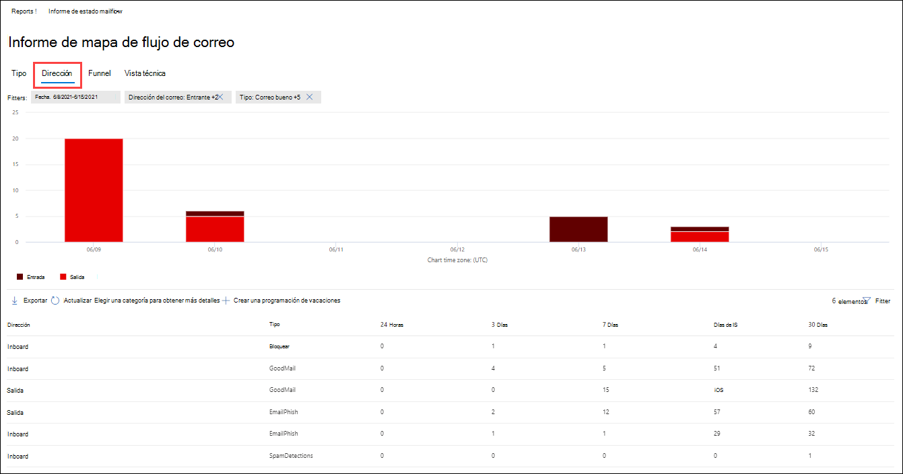
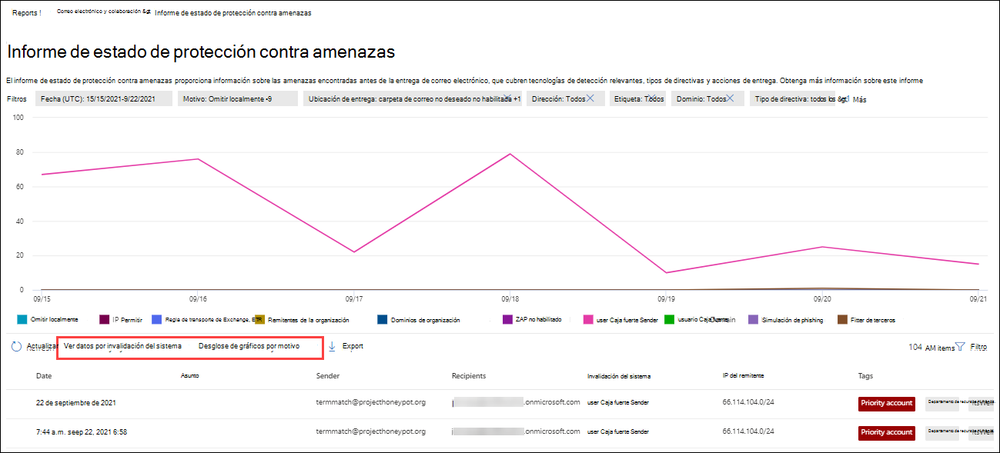
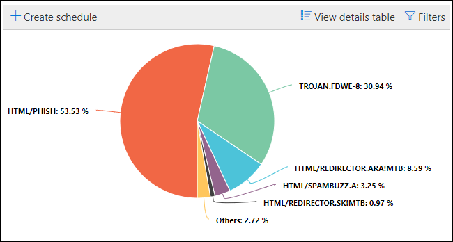

# Ver informes de seguridad de correo electrónico en el portal Microsoft 365 Defender correo electrónico

[!INCLUDE [Microsoft 365 Defender rebranding](../includes/microsoft-defender-for-office.md)]

**Se aplica a**
- [Exchange Online Protection](exchange-online-protection-overview.md)
- [Plan 1 y Plan 2 de Microsoft Defender para Office 365](defender-for-office-365.md)
- [Microsoft 365 Defender](../defender/microsoft-365-defender.md)

Hay una variedad de informes disponibles en el portal de Microsoft 365 Defender para ayudarle a ver cómo las características de seguridad del correo electrónico, como el correo no deseado, antimalware y las características de cifrado en Microsoft 365 protegen su <https://security.microsoft.com> organización. Si tiene los permisos [necesarios,](#what-permissions-are-needed-to-view-these-reports)puede ver y descargar estos informes como se describe en este artículo.

> [!NOTE]
>
> Algunos de los informes de la página Informes de **colaboración & correo** electrónico requieren Microsoft Defender para Office 365. Para obtener información acerca de estos informes, vea [View Defender for Office 365 reports in the Microsoft 365 Defender portal](view-reports-for-mdo.md).
>
> Los informes relacionados con el flujo de correo se encuentran ahora en el Centro Exchange administración (EAC). Para obtener más información acerca de estos informes, vea Informes de flujo de correo [en el nuevo centro Exchange administración.](/exchange/monitoring/mail-flow-reports/mail-flow-reports)

## Informe de usuarios comprometidos

> [!NOTE]
> Este informe está disponible en Microsoft 365 organizaciones con Exchange Online buzones de correo. No está disponible en organizaciones independientes Exchange Online Protection (EOP).

El **informe Usuarios comprometidos** muestra el número de  cuentas  de usuario que se marcaron como Sospechosas o Restringidas en los últimos 7 días. Las cuentas en cualquiera de estos estados son problemáticas o incluso están en peligro. Con el uso frecuente, puede usar el informe para detectar picos e incluso tendencias en cuentas sospechosas o restringidas. Para obtener más información acerca de los usuarios en peligro, vea [Responder a una cuenta de correo electrónico comprometida.](responding-to-a-compromised-email-account.md)

La vista de agregado muestra los datos de los últimos 90 días y la vista de detalles muestra los datos de los últimos 30 días.

Para ver el informe en el portal de Microsoft 365 Defender en , vaya a Informes de correo electrónico & <https://security.microsoft.com>  \> **colaboración** Correo & \> **informes de colaboración**. En la página **Informes de colaboración &** correo electrónico, busque **Usuarios** en peligro y, a continuación, haga clic en **Ver detalles.** Para ir directamente al informe, abra <https://security.microsoft.com/reports/CompromisedUsers> .

En la **página Usuarios en peligro,** el gráfico muestra la siguiente información para el intervalo de fechas especificado:

- **Restringido:** la cuenta de usuario se ha restringido para enviar correo electrónico debido a patrones altamente sospechosos.
- **Sospechoso:** la cuenta de usuario ha enviado un correo electrónico sospechoso y corre el riesgo de que se le restringa el envío de correo electrónico.

La tabla de detalles debajo del gráfico muestra la siguiente información:

- **Tiempo de creación**
- **Nombre de usuario**
- **Action**

Puede filtrar tanto el gráfico como  la tabla de detalles haciendo clic en Filtrar y seleccionando uno o varios de los siguientes valores en el menú desplegable que aparece:

- **Date (UTC):** **Fecha de inicio y** fecha de **finalización.**
- **Actividad**: **restringida o** **sospechosa**

Cuando haya terminado de configurar los filtros, haga clic **en Aplicar,** **Cancelar** o **Borrar filtros**.

En la página de informe principal, el  **[Crear programación,](#schedule-report)**  **[Informe de solicitud](#request-report)** y  **[Los botones](#export-report)** de exportación están disponibles.

## Exchange de regla de transporte

El **Exchange de regla de** transporte muestra el efecto de las reglas de flujo de correo (también conocidas como reglas de transporte) en los mensajes entrantes y salientes de la organización.

Para ver el informe en el portal de Microsoft 365 Defender, vaya a **Informes** de correo electrónico & \> **colaboración** Correo & \> **informes de colaboración**. En la página **Informes de colaboración &** correo electrónico, busque Exchange de transporte **y, a** continuación, haga clic en Ver **detalles.** Para ir directamente al informe, abra <https://security.microsoft.com/reports/ETRRuleReport> .

En la página Exchange informe de reglas de **transporte,** los gráficos y datos disponibles se describen en las secciones siguientes.

### Desglose del gráfico por dirección

Si selecciona Desglose **de gráficos por dirección,** los siguientes gráficos estarán disponibles:

- **Ver datos por Exchange de transporte:** el  número **de** mensajes entrantes y salientes que se vieron afectados por las reglas de flujo de correo.
- **Ver datos por DLP Exchange** de transporte:  el  número de mensajes entrantes y salientes que se vieron afectados por las reglas de flujo de correo de prevención de pérdida de datos (DLP).

La siguiente información se muestra en la tabla de detalles debajo del gráfico:

- **Fecha**
- **Directiva DLP** (**Ver datos por DLP Exchange reglas de transporte)**
- **Regla de transporte**
- **Asunto**
- **Dirección del remitente**
- **Dirección del destinatario**
- **Gravedad**
- **Dirección**

Puede filtrar tanto el gráfico como  la tabla de detalles haciendo clic en Filtrar y seleccionando uno o varios de los siguientes valores en el menú desplegable que aparece:

- **Fecha (UTC) Fecha** **de inicio y** fecha de **finalización**.
- **Direction**: **Outbound** and **Inbound**.
- **Gravedad:** **gravedad alta,** **gravedad media** y **gravedad baja**

Cuando haya terminado de configurar los filtros, haga clic **en Aplicar,** **Cancelar** o **Borrar filtros**.

En la página de informe principal, el  **[Crear programación,](#schedule-report)**  **[Informe de solicitud](#request-report)** y  **[Los botones](#export-report)** de exportación están disponibles.

### Desglose del gráfico por gravedad

Si selecciona Desglose **de gráficos por gravedad,** los siguientes gráficos están disponibles:

- **Ver datos por Exchange de transporte:** el número de mensajes de gravedad **alta,** gravedad media y **gravedad** baja. El nivel de gravedad se establece como una acción en la regla (**Auditar** esta regla con el nivel de gravedad o _SetAuditSeverity_). Para obtener más información, vea [Acciones de regla de flujo de correo en Exchange Online](/Exchange/security-and-compliance/mail-flow-rules/mail-flow-rule-actions).

- **Ver datos por DLP Exchange** de transporte: el número de mensajes  de gravedad **alta,** media y de gravedad baja que se vieron afectados por las reglas de flujo de correo DLP.

La siguiente información se muestra en la tabla de detalles debajo del gráfico:

- **Date**
- **Directiva DLP** (**Ver datos por DLP Exchange reglas de transporte)**
- **Regla de transporte**
- **Asunto**
- **Dirección del remitente**
- **Dirección del destinatario**
- **Gravedad**
- **Dirección**

Puede filtrar tanto el gráfico como  la tabla de detalles haciendo clic en Filtrar y seleccionando uno o varios de los siguientes valores en el menú desplegable que aparece:

- **Fecha (UTC) Fecha** **de inicio y** fecha de **finalización**
- **Dirección:** **saliente** y **entrante**
- **Gravedad:** **gravedad alta,** **gravedad media** y **gravedad baja**

Cuando haya terminado de configurar los filtros, haga clic **en Aplicar,** **Cancelar** o **Borrar filtros**.

En la página de informe principal, el  **[Crear programación,](#schedule-report)**  **[Informe de solicitud](#request-report)** y  **[Los botones](#export-report)** de exportación están disponibles.

## Informe de reenvío

> [!NOTE]
> Este informe ya está disponible en el EAC. Para obtener más información, vea Informe de mensajes reenviados [automáticamente en el nuevo EAC](/exchange/monitoring/mail-flow-reports/mfr-auto-forwarded-messages-report).

## Informe de estado de flujo de correo

El **informe de** estado de flujo de correo es un informe inteligente que muestra información sobre el correo electrónico entrante y saliente, las detecciones de correo no deseado, el malware, el correo electrónico identificado como "bueno" y la información sobre el correo electrónico permitido o bloqueado en el perímetro. Este es el único informe que contiene información de protección perimetral y muestra cuánto correo electrónico se bloquea antes de que se le permita entrar en el servicio para su evaluación por parte de Exchange Online Protection (EOP). Es importante comprender que si un mensaje se envía a cinco destinatarios, lo contamos como cinco mensajes diferentes y no un mensaje.

Para ver el informe en el portal de Microsoft 365 Defender en , vaya a Informes de correo electrónico & <https://security.microsoft.com>  \> **colaboración** Correo & \> **informes de colaboración**. En la página **Informes de colaboración &** correo electrónico, busque Resumen de estado de **flujo** de correo y, a continuación, haga clic en **Ver detalles.** Para ir directamente al informe, abra <https://security.microsoft.com/reports/mailflowStatusReport> .

### Vista de tipo para el informe de estado de flujo de correo

En la **página Informe de estado de flujo de** correo, la **pestaña** Tipo está seleccionada de forma predeterminada. El gráfico muestra la siguiente información para el intervalo de fechas especificado:

- **Correo bueno**
- **Total**
- **Malware**
- **Correo de suplantación de identidad**
- **Correo no deseado**
- **Protección perimetral**
- **Mensajes de regla**

La tabla de detalles debajo del gráfico muestra la siguiente información:

- **Dirección**
- **Tipo**
- **24 horas**
- **3 días**
- **7 días**
- **15 días**
- **30 días**

Puede filtrar tanto el gráfico como  la tabla de detalles haciendo clic en Filtrar y seleccionando uno o varios de los siguientes valores en el menú desplegable que aparece:

- **Date (UTC):** **Fecha de inicio y** fecha de **finalización.**
- **Dirección del correo:** **entrante** y **saliente**.
- **Tipo**:
  - **Correo bueno**
  - **Malware**
  - **Correo no deseado**
  - **Protección perimetral**
  - **Mensajes de regla**
  - **Correo de suplantación de identidad**

Cuando haya terminado de configurar los filtros, haga clic **en Aplicar,** **Cancelar** o **Borrar filtros**.

En la página principal del informe, si hace clic en **Elegir una** categoría para obtener más información, puede seleccionar entre los siguientes valores:

- **Correo electrónico de suplantación** de identidad : esta selección le lleva al informe [de estado de protección contra amenazas](view-email-security-reports.md#threat-protection-status-report).
- **Malware en el correo** electrónico: esta selección le lleva al informe [de estado de protección contra amenazas](view-email-security-reports.md#threat-protection-status-report).
- **Detecciones de correo** no deseado: esta selección le lleva al informe [Detecciones de correo no deseado](view-email-security-reports.md#spam-detections-report).
- **Correo no deseado bloqueado** perimetral: esta selección le lleva al informe [Detecciones de correo no deseado](view-email-security-reports.md#spam-detections-report).

En la página de informe principal, el  **[Crear programación](#schedule-report)** y  **[Los botones](#export-report)** de exportación están disponibles.

### Vista Dirección del informe de estado de flujo de correo

Si hace clic en la **pestaña Dirección,** el gráfico muestra la siguiente información para el intervalo de fechas especificado:

- **Entrante**
- **Salida**

Puede filtrar tanto el gráfico como  la tabla de detalles haciendo clic en Filtrar y seleccionando uno o varios de los siguientes valores en el menú desplegable que aparece:

- **Date (UTC):** **Fecha de inicio y** fecha de **finalización.**
- **Dirección del correo:** **entrante** y **saliente**.
- **Tipo**:
  - **Correo bueno**
  - **Malware**
  - **Correo no deseado**
  - **Protección perimetral**
  - **Mensajes de regla**
  - **Correo de suplantación de identidad**

Cuando haya terminado de configurar los filtros, haga clic **en Aplicar,** **Cancelar** o **Borrar filtros**.

En la página principal del informe, si hace clic en **Elegir una** categoría para obtener más información, puede seleccionar entre los siguientes valores:

- **Correo electrónico de suplantación** de identidad : esta selección le lleva al informe [de estado de protección contra amenazas](view-email-security-reports.md#threat-protection-status-report).
- **Malware en el correo** electrónico: esta selección le lleva al informe [de estado de protección contra amenazas](view-email-security-reports.md#threat-protection-status-report).
- **Detecciones de correo** no deseado: esta selección le lleva al informe [Detecciones de correo no deseado](view-email-security-reports.md#spam-detections-report).
- **Correo no deseado bloqueado** perimetral: esta selección le lleva al informe [Detecciones de correo no deseado](view-email-security-reports.md#spam-detections-report).

En la página de informe principal, el  **Crear programación** y  **Los botones** de exportación están disponibles.

### Vista Flujo de correo para el informe de estado de flujo de correo

La **vista Flujo de** correo muestra cómo las características de protección contra amenazas de correo electrónico de Microsoft filtran el correo electrónico entrante y saliente en su organización. Esta vista usa un diagrama de flujo horizontal (conocido como diagrama _de Sankey)_ para proporcionar detalles sobre el recuento total de correo electrónico y cómo afectan a este recuento las características de protección contra amenazas configuradas, incluida la protección perimetral, antimalware, anti phishing, correo no deseado y contra la suplantación de identidad.

La vista de agregado y la vista de tabla de detalles permiten 90 días de filtrado.

La información del diagrama está codificada por colores por **EOP** o **Defender para Office 365** tecnologías.

El diagrama se organiza en las siguientes bandas horizontales:

- **Banda total de** correo electrónico: este valor siempre se muestra primero.
- **Bloque perimetral** y **banda procesada:**
  - **Bloque perimetral:** mensajes filtrados en el borde e identificados como protección perimetral.
  - **Procesado:** mensajes que controla la pila de filtrado.
- Banda de resultados:
  - **Bloque de reglas:** mensajes procesados por Exchange de flujo de correo (reglas de transporte).
  - **Bloque de malware:** mensajes que se identifican como malware mediante varios filtros.\*
  - **Bloque de phishing:** mensajes identificados como phish durante el procesamiento por varios filtros.\*
  - **Bloqueo de correo** no deseado: mensajes identificados como correo no deseado durante el procesamiento por varios filtros.\*
  - **Bloque de suplantación:** mensajes detectados como suplantación de usuario o suplantación de dominio en Defender para Office 365.\*
  - **Bloque de detonación:** mensajes detectados durante la detonación de archivos o url mediante directivas de datos adjuntos Caja fuerte directivas de Caja fuerte vínculos en Defender para Office 365.\*
  - **ZAP eliminado:** mensajes que se quitan mediante purga automática de hora cero (ZAP).\*
  - **Entregado:** mensajes entregados a los usuarios debido a una permitir.\*

Si mantiene el mouse sobre una banda horizontal en el diagrama, verá el número de mensajes relacionados.

\* Si hace clic en este elemento, el diagrama se expande para mostrar más detalles. Para obtener una descripción de cada elemento de los nodos expandido, vea [Tecnologías de detección](/office/office-365-management-api/office-365-management-activity-api-schema#detection-technologies).

La tabla de detalles debajo del diagrama muestra la siguiente información:

- **Date**
- **Correo electrónico total**
- **Perímetro filtrado**
- **Mensajes de regla**
- **Motor antimalware, datos Caja fuerte datos adjuntos, reglas filtradas**
- **Suplantación de DMARC, suplantación de identidad, suplantación de identidad (phish) filtrada**
- **Detección de detonación**
- **Filtrado contra correo no deseado**
- **ZAP quitado**
- **Mensajes en los que no se detectaron amenazas**

Si selecciona una fila en la tabla de detalles, se muestra un desglose adicional de los recuentos de correo electrónico en el desplegable de detalles que aparece.

Puede filtrar tanto el gráfico como  la tabla de detalles haciendo clic en Filtrar y seleccionando uno o varios de los siguientes valores en el menú desplegable que aparece:

- **Fecha (UTC) Fecha** **de inicio y** fecha de **finalización**.
- **Direction**: **Outbound** and **Inbound**.

Cuando haya terminado de configurar los filtros, haga clic **en Aplicar,** **Cancelar** o **Borrar filtros**.

En la página principal del informe, puede hacer clic en **Mostrar** tendencias para ver los gráficos de tendencias en el menú desplegable **Tendencias** de flujo de correo que aparece.

En la página de informe principal, el  **El** botón Exportar está disponible.

## Informe de detecciones de malware

> [!NOTE]
> Este informe ha quedado en desuso. La misma información está disponible en el informe [de estado de protección contra amenazas](#threat-protection-status-report).

## Informe de latencia de correo

El **informe de latencia de** correo en Defender para Office 365 contiene información sobre la latencia de entrega y detonación de correo experimentada en su organización. Para obtener más información, vea [Informe de latencia de correo](view-reports-for-mdo.md#mail-latency-report).

## Informe de detecciones de correo no deseado

> [!NOTE]
> Este informe ha quedado en desuso. La misma información está disponible en el informe [de estado de protección contra amenazas](#threat-protection-status-report).

## Informe de detecciones de suplantación

El **informe Detecciones** de suplantación muestra información sobre los mensajes bloqueados o permitidos debido a la suplantación. Para obtener más información acerca de la suplantación, vea Protección contra la suplantación [en EOP](anti-spoofing-protection.md).

La vista de agregado del informe permite 45 días de filtrado, mientras que la vista de detalles solo permite \* diez días de filtrado.

\* Con el tiempo, podrás usar hasta 90 días de filtrado.

Para ver el informe en el portal de Microsoft 365 Defender, vaya a **Informes** de correo electrónico & \> **colaboración** Correo & \> **informes de colaboración**. En la página **Informes de colaboración &** correo electrónico, busque **Detecciones** de suplantación de suplantación y, a continuación, haga clic **en Ver detalles.** Para ir directamente al informe, abra <https://security.microsoft.com/reports/SpoofMailReportV2> .

El gráfico muestra la siguiente información:

- **Pasar**
- **Error**
- **SoftPass**
- **Ninguna**
- **Otros**

Al pasar el mouse sobre un día (punto de datos) en el gráfico, puede ver cuántos mensajes suplantados se detectaron y por qué.

Puede filtrar tanto el gráfico como  la tabla de detalles haciendo clic en Filtrar y seleccionando uno o varios de los siguientes valores en el menú desplegable que aparece:

- **Fecha (UTC) Fecha** **de inicio y** fecha de **finalización**
- **Resultado**:
  - **Pasar**
  - **Error**
  - **SoftPass**
  - **Ninguna**
  - **Otros**
- **Tipo de suplantación:** **Interno** y **Externo**

La tabla de detalles debajo del gráfico muestra la siguiente información:

- **Date**
- **Usuario suplantado**
- **Infraestructura de envío**
- **Tipo de suplantación**
- **Resultado**
- **Código de resultados**
- **SPF**
- **DKIM**
- **DMARC**
- **Recuento de mensajes**

Para obtener más información acerca de los códigos de resultados de autenticación compuesta, vea [Encabezados de mensajes](anti-spam-message-headers.md)contra correo no deseado en Microsoft 365 .

En la página de informe principal, el  **[Crear programación,](#schedule-report)**  **[Informe de solicitud](#request-report)** y  **[Los botones](#export-report)** de exportación están disponibles.

## Informe de envíos

El **informe Envíos** muestra información sobre los elementos que los administradores han notificado a Microsoft para su análisis. Para obtener más información, vea [Use Admin Submission to submit suspected spam, phish, URLs, and files to Microsoft](admin-submission.md).

Para ver el informe en el portal de Microsoft 365 Defender en , vaya a Informes de correo electrónico & <https://security.microsoft.com>  \> **colaboración** Correo & \> **informes de colaboración**. En la página **Informes de colaboración &** correo electrónico, busque **Envíos** y, a continuación, haga clic **en Ver detalles.** Para ir directamente al informe, abra <https://security.microsoft.com/adminSubmissionReport> . Para ir a [envíos de administrador en el portal de Microsoft 365 Defender,](admin-submission.md)haga clic **en Ir a Envíos**. Los administradores podrán ver el informe durante los últimos 30 días.

El gráfico muestra la siguiente información:

- **Pending**
- **Completed**

Puede filtrar tanto el gráfico como  la tabla de detalles haciendo clic en Filtrar y seleccionando uno o varios de los siguientes valores en el menú desplegable que aparece:

- **Fecha notificada:** **Hora de inicio** y hora de **finalización**
- **Tipo de envío**:
  - **Correo electrónico**
  - **URL**
  - **Archivo**
- **Identificador de envío**
- **Id. de mensaje de red**
- **Sender**
- **Nombre**
- **Enviado por**
- **Motivo para enviar**:
  - **No es correo no deseado**
  - **Suplantación de identidad**
  - **Malware**
  - **Correo no deseado**
- **Estado de volver a examinar:**
  - **Pending**
  - **Completed**

La tabla de detalles debajo del gráfico  muestra la misma información  y tiene las mismas opciones de grupo o personalizar columnas que en la pestaña Enviado para el análisis en Correo electrónico **& envíos** de  \> **colaboración.** Para obtener más información, vea [Ver envíos de administrador a Microsoft](admin-submission.md#view-admin-submissions-to-microsoft).

En la página de informe principal, el **[botón Exportar](#export-report)** está disponible.

## Informe de estado de protección contra amenazas

El **informe de estado de** protección contra amenazas está disponible en EOP y Defender para Office 365; sin embargo, los informes contienen datos diferentes. Por ejemplo, los clientes de EOP pueden ver información sobre malware detectado en el correo electrónico, pero no información sobre archivos malintencionados detectados por [Caja fuerte Attachments for SharePoint, OneDrive](mdo-for-spo-odb-and-teams.md)y Microsoft Teams .

El informe proporciona el recuento de mensajes de correo electrónico con contenido malintencionado, como archivos o direcciones de sitios web (DIRECCIONES URL) bloqueadas por el motor antimalware, purga automática de hora cero [(ZAP)](zero-hour-auto-purge.md)y Defender para características de Office 365 como vínculos [de Caja fuerte,](safe-links.md)datos adjuntos de [Caja fuerte](safe-attachments.md)y características de protección de suplantación en directivas [contra suplantación.](set-up-anti-phishing-policies.md#exclusive-settings-in-anti-phishing-policies-in-microsoft-defender-for-office-365) Puede usar esta información para identificar tendencias o determinar si las directivas de la organización necesitan ajustes.

**Nota:** Es importante comprender que si un mensaje se envía a cinco destinatarios, lo contamos como cinco mensajes diferentes y no un mensaje.

Para ver el informe en el portal de Microsoft 365 Defender, vaya a **Informes** de correo electrónico & \> **colaboración** Correo & \> **informes de colaboración**. En la página **Informes de colaboración &** correo electrónico, busque Estado de protección contra **amenazas** y, a continuación, haga clic en **Ver detalles**. Para ir directamente al informe, abra una de las siguientes direcciones URL:

- Defender para Office 365:<https://security.microsoft.com/reports/TPSAggregateReportATP>
- EOP: <https://security.microsoft.com/reports/TPSAggregateReport>

De forma predeterminada, el gráfico muestra los datos de los últimos 7 días. Si hace clic **en Filtrar** en la página **Informe** de estado de protección contra amenazas, puede seleccionar un intervalo de fechas de 90 días (las suscripciones de prueba podrían limitarse a 30 días). La tabla de detalles permite filtrar durante 30 días.

Las vistas disponibles se describen en las secciones siguientes.

### Ver datos por información general

En la **vista Ver datos por información** general, se muestra la siguiente información de detección en el gráfico:

- **Malware de correo electrónico**
- **Phish de correo electrónico**
- **Correo electrónico no deseado**
- **Malware de contenido**

No hay ninguna tabla de detalles disponible debajo del gráfico.

Si hace clic **en Filtrar,** estarán disponibles los siguientes filtros:

- **Fecha (UTC) Fecha** **de inicio y** fecha de **finalización**.
- **Detección**:
  - **Malware de correo electrónico**
  - **Phish de correo electrónico**
  - **Correo electrónico no deseado**
  - **Malware de contenido**
- **Protegido por**: **MDO** (Defender para Office 365) y **EOP**.
- **Etiqueta:** **todas** o la etiqueta de usuario especificada (incluidas las cuentas de prioridad). Para obtener más información acerca de las etiquetas de usuario, vea [Etiquetas de usuario](user-tags.md).
- **Dirección**:
  - **Todo**
  - **Entrante**
  - **Salida**
- **Dominio:** **todo** o [un dominio aceptado](/exchange/mail-flow-best-practices/manage-accepted-domains/manage-accepted-domains).
- **Tipo de directiva**:
  - **Todo**
  - **Antimalware**
  - **Archivos adjuntos seguros**
  - **Anti-phish**
  - **Contra correo no deseado**
  - **Regla de flujo de correo** (regla de transporte)
  - **Otros**

Cuando haya terminado de configurar los filtros, haga clic **en Aplicar,** **Cancelar** o **Borrar filtros**.

### Ver datos por phishing de \> correo electrónico y desglose de gráficos por tecnología de detección

En la vista Ver  **datos por \> phishing** de correo electrónico y desglose de gráficos por tecnología de detección, se muestra la siguiente información en el gráfico:

- **Reputación malintencionada** de la dirección URL: reputación de url malintencionada generada desde \* Defender para Office 365 detonaciones en otros Microsoft 365 cliente.
- **Filtro avanzado:** señales de suplantación de identidad basadas en el aprendizaje automático.
- **Filtro general:** señales de suplantación de identidad basadas en reglas de analista.
- **Suplantación de** identidad dentro de la organización: el remitente está intentando suplantación del dominio de destinatario.
- **Suplantación de dominio externo:** el remitente está intentando suplantación de identidad de otro dominio.
- **Spoof DMARC:** error de autenticación DMARC en los mensajes.
- **Marca de suplantación:** suplantación de marcas conocidas basadas en remitentes.
- **Detección de análisis mixto**
- **Reputación de los archivos**
- **Coincidencia de huella digital**
- **Reputación de detonación de URL**\*
- **Detonación de dirección URL**\*
- **Usuario de suplantación**\*
- **Dominio de suplantación:** \* suplantación de dominios que el cliente posee o define.
- **Suplantación de inteligencia de buzones:** suplantación de usuarios definida por el administrador o aprendida a través \* de la inteligencia de buzones.
- **Detonación de archivos**\*
- **Reputación de detonación de archivos**\*
- **Campaña**\*

\*Solo defender para Office 365

En la tabla de detalles debajo del gráfico, está disponible la siguiente información:

- **Date**
- **Asunto**
- **Remitente**
- **Destinatarios**
- **Tecnología de detección**
- **Estado de entrega**
- **IP del remitente**
- **Tags**

Si hace clic **en Filtrar,** estarán disponibles los siguientes filtros:

- **Fecha (UTC) Fecha** **de inicio y** fecha de **finalización**
- **Detección:** los mismos valores que en el gráfico.
- **Protegido por**: **MDO** (Defender para Office 365) o **EOP**
- **Dirección**:
  - **Todo**
  - **Entrante**
  - **Salida**
- **Etiqueta:** **todas** o la etiqueta de usuario especificada (incluidas las cuentas de prioridad). Para obtener más información acerca de las etiquetas de usuario, vea [Etiquetas de usuario](user-tags.md).
- **Dominio:** **todo** o [un dominio aceptado](/exchange/mail-flow-best-practices/manage-accepted-domains/manage-accepted-domains).
- **Tipo de directiva**:
  - **Todo**
  - **Antimalware**
  - **Archivos adjuntos seguros**
  - **Anti-phish**
  - **Contra correo no deseado**
  - **Regla de flujo de correo** (regla de transporte)
  - **Otros**
- **Nombre de directiva (solo vista de tabla de detalles):** **toda** o la directiva especificada.
- **Destinatarios**

Cuando haya terminado de configurar los filtros, haga clic **en Aplicar,** **Cancelar** o **Borrar filtros**.

En la página de informe principal, el  **[Crear programación,](#schedule-report)**  **[Informe de solicitud](#request-report)** y  **[Los botones](#export-report)** de exportación están disponibles.

### Ver datos por correo electrónico \> no deseado y desglose de gráficos por tecnología de detección

En la **vista Ver datos por correo electrónico no \> deseado** **y** Desglose de gráficos por tecnología de detección, se muestra la siguiente información en el gráfico:

- **Reputación malintencionada de URL**
- **Filtro avanzado**
- **Filtro general**
- **Detección de análisis mixto**
- **Coincidencia de huella digital**
- **Reputación de dominio**
- **Masivo**
- **Reputación de IP**

En la tabla de detalles debajo del gráfico, está disponible la siguiente información:

- **Fecha**
- **Asunto**
- **Remitente**
- **Destinatarios**
- **Tecnología de detección**
- **Estado de entrega**
- **IP del remitente**
- **Tags**

Si hace clic **en Filtrar,** estarán disponibles los siguientes filtros:

- **Fecha (UTC) Fecha** **de inicio y** fecha de **finalización**
- **Detección:** los mismos valores que en el gráfico.
- **Dirección**:
  - **Todo**
  - **Entrante**
  - **Salida**
- **Etiqueta:** **todas** o la etiqueta de usuario especificada (incluidas las cuentas de prioridad). Para obtener más información acerca de las etiquetas de usuario, vea [Etiquetas de usuario](user-tags.md).
- **Dominio:** **todo** o [un dominio aceptado](/exchange/mail-flow-best-practices/manage-accepted-domains/manage-accepted-domains).
- **Tipo de directiva**:
  - **Todo**
  - **Antimalware**
  - **Archivos adjuntos seguros**
  - **Anti-phish**
  - **Contra correo no deseado**
  - **Regla de flujo de correo** (regla de transporte)
  - **Otros**
- **Nombre de directiva (solo vista de tabla de detalles):** **toda** o la directiva especificada.
- **Destinatarios**

Cuando haya terminado de configurar los filtros, haga clic **en Aplicar,** **Cancelar** o **Borrar filtros**.

En la página de informe principal, el  **[Crear programación,](#schedule-report)**  **[Informe de solicitud](#request-report)** y  **[Los botones](#export-report)** de exportación están disponibles.

### Ver datos por malware de \> correo electrónico y desglose de gráficos por tecnología de detección

En la vista Ver  **datos por malware de \> correo** electrónico y desglose de gráficos por tecnología de detección, se muestra la siguiente información en el gráfico:

- **Detonación de archivos:** \* detección por Caja fuerte datos adjuntos.
- **Reputación de detonación de archivos:** toda la reputación de archivos malintencionados generada por \* Defender para Office 365 detonaciones.
- **Reputación de los archivos**
- **Motor antimalware: detección** \* de motores antimalware.
- Bloque de tipo de archivo de directiva **antimalware:** se trata de mensajes de correo electrónico filtrados debido al tipo de archivo malintencionado identificado en el mensaje.
- **Reputación malintencionada de url**\*
- **Detonación de dirección URL**\*
- **Reputación de detonación de URL**\*
- **Campaña**\*

En la tabla de detalles debajo del gráfico, está disponible la siguiente información:

- **Date**
- **Asunto**
- **Remitente**
- **Destinatarios**
- **Tecnología de detección**
- **Estado de entrega**
- **IP del remitente**
- **Tags**

Si hace clic **en Filtrar,** estarán disponibles los siguientes filtros:

- **Fecha (UTC) Fecha** **de inicio y** fecha de **finalización**
- **Detección:** los mismos valores que en el gráfico.
- **Protegido por**: **MDO** (Defender para Office 365) o **EOP**
- **Dirección**:
  - **Todo**
  - **Entrante**
  - **Salida**
- **Etiqueta:** **todas** o la etiqueta de usuario especificada (incluidas las cuentas de prioridad). Para obtener más información acerca de las etiquetas de usuario, vea [Etiquetas de usuario](user-tags.md).
- **Dominio:** **todo** o [un dominio aceptado](/exchange/mail-flow-best-practices/manage-accepted-domains/manage-accepted-domains).
- **Tipo de directiva**:
  - **Todo**
  - **Antimalware**
  - **Archivos adjuntos seguros**
  - **Anti-phish**
  - **Contra correo no deseado**
  - **Regla de flujo de correo** (regla de transporte)
  - **Otros**
- **Nombre de directiva (solo vista de tabla de detalles):** **toda** o la directiva especificada.
- **Destinatarios**

Cuando haya terminado de configurar los filtros, haga clic **en Aplicar,** **Cancelar** o **Borrar filtros**.

En la página de informe principal, el  **[Crear programación,](#schedule-report)**  **[Informe de solicitud](#request-report)** y  **[Los botones](#export-report)** de exportación están disponibles.

### Desglose del gráfico por tipo de directiva

En las vistas  Ver datos por **\> suplantación** de identidad de correo electrónico **, \>** Ver datos por correo no deseado o Ver datos por correo electrónico Malintencionado, al seleccionar Desglose del gráfico por tipo de directiva se muestra la siguiente información en el gráfico: **\>**

- **Antimalware**
- **Caja fuerte adjuntos**\*
- **Anti-phish**
- **Contra correo no deseado**
- **Regla de flujo de** correo (también conocida como regla de transporte)
- **Otros**

En la tabla de detalles debajo del gráfico, está disponible la siguiente información:

- **Fecha**
- **Asunto**
- **Remitente**
- **Destinatarios**
- **Tecnología de detección**
- **Estado de entrega**
- **IP del remitente**
- **Tags**

Si hace clic **en Filtrar,** estarán disponibles los siguientes filtros:

- **Fecha (UTC) Fecha** **de inicio y** fecha de **finalización**
- **Detección**:
  - **Reputación malintencionada** de la dirección URL: reputación de url malintencionada generada desde \* Defender para Office 365 detonaciones en otros Microsoft 365 cliente.
  - **Filtro avanzado:** señales de suplantación de identidad basadas en el aprendizaje automático.
  - **Filtro general:** señales de suplantación de identidad basadas en reglas de analista.
  - **Suplantación de** identidad dentro de la organización: el remitente está intentando suplantación del dominio de destinatario.
  - **Suplantación de dominio externo:** el remitente está intentando suplantación de identidad de otro dominio.
  - **Spoof DMARC:** error de autenticación DMARC en los mensajes.
  - **Marca de suplantación:** suplantación de marcas conocidas basadas en remitentes.
  - **Detección de análisis mixto**
  - **Reputación de los archivos**
  - **Coincidencia de huella digital**
  - **Reputación de detonación de URL**\*
  - **Detonación de dirección URL**\*
  - **Usuario de suplantación**\*
  - **Dominio de suplantación:** \* suplantación de dominios que el cliente posee o define.
  - **Suplantación de inteligencia de buzones:** suplantación de usuarios definida por el administrador o aprendida a través \* de la inteligencia de buzones.
  - **Detonación de archivos**\*
  - **Reputación de detonación de archivos**\*
  - **Campaña**\*
- **Protegido por**: **MDO** (Defender para Office 365) o **EOP**
- **Dirección**:
  - **Todo**
  - **Entrante**
  - **Salida**
- **Etiqueta:** **todas** o la etiqueta de usuario especificada (incluidas las cuentas de prioridad). Para obtener más información acerca de las etiquetas de usuario, vea [Etiquetas de usuario](user-tags.md).
- **Dominio:** **todo** o [un dominio aceptado](/exchange/mail-flow-best-practices/manage-accepted-domains/manage-accepted-domains).
- **Tipo de directiva**:
  - **Todo**
  - **Antimalware**
  - **Archivos adjuntos seguros**
  - **Anti-phish**
  - **Contra correo no deseado**
  - **Regla de flujo de correo** (regla de transporte)
  - **Otros**
- **Nombre de directiva (solo vista de tabla de detalles):** **toda** o la directiva especificada.
- **Destinatarios**

\*Solo defender para Office 365

Cuando haya terminado de configurar los filtros, haga clic **en Aplicar,** **Cancelar** o **Borrar filtros**.

En la página de informe principal, el  **[Crear programación,](#schedule-report)**  **[Informe de solicitud](#request-report)** y  **[Los botones](#export-report)** de exportación están disponibles.

### Desglose del gráfico por estado de entrega

En las vistas Ver datos por correo electrónico phish **, \>** Ver datos  por correo no deseado o Ver datos por correo electrónico malintencionado, al seleccionar Desglose del gráfico por estado de entrega se muestra la siguiente información en el gráfico: **\>** **\>**

- **Buzón hospedado: Bandeja de entrada**
- **Buzón hospedado: correo no deseado**
- **Buzón hospedado: carpeta personalizada**
- **Buzón hospedado: elementos eliminados**
- **Reenviado**
- **Servidor local: entregado**
- **Cuarentena**
- **Error en la entrega**
- **Se ha descartado**

En la tabla de detalles debajo del gráfico, está disponible la siguiente información:

- **Fecha**
- **Asunto**
- **Remitente**
- **Destinatarios**
- **Tecnología de detección**
- **Estado de entrega**
- **IP del remitente**
- **Tags**

Si hace clic **en Filtrar,** estarán disponibles los siguientes filtros:

- **Fecha (UTC) Fecha** **de inicio y** fecha de **finalización**
- **Detección**:
  - **Reputación malintencionada** de la dirección URL: reputación de url malintencionada generada desde \* Defender para Office 365 detonaciones en otros Microsoft 365 cliente.
  - **Filtro avanzado:** señales de suplantación de identidad basadas en el aprendizaje automático.
  - **Filtro general:** señales de suplantación de identidad basadas en reglas de analista.
  - **Suplantación de** identidad dentro de la organización: el remitente está intentando suplantación del dominio de destinatario.
  - **Suplantación de dominio externo:** el remitente está intentando suplantación de identidad de otro dominio.
  - **Spoof DMARC:** error de autenticación DMARC en los mensajes.
  - **Marca de suplantación:** suplantación de marcas conocidas basadas en remitentes.
  - **Detección de análisis mixto**
  - **Reputación de los archivos**
  - **Coincidencia de huella digital**
  - **Reputación de detonación de URL**\*
  - **Detonación de dirección URL**\*
  - **Usuario de suplantación**\*
  - **Dominio de suplantación:** \* suplantación de dominios que el cliente posee o define.
  - **Suplantación de inteligencia de buzones:** suplantación de usuarios definida por el administrador o aprendida a través \* de la inteligencia de buzones.
  - **Detonación de archivos**\*
  - **Reputación de detonación de archivos**\*
  - **Campaña**\*
- **Protegido por**: **MDO** (Defender para Office 365) o **EOP**
- **Dirección**:
  - **Todo**
  - **Entrante**
  - **Salida**
- **Etiqueta:** **todas** o la etiqueta de usuario especificada (incluidas las cuentas de prioridad). Para obtener más información acerca de las etiquetas de usuario, vea [Etiquetas de usuario](user-tags.md).
- **Dominio:** **todo** o [un dominio aceptado](/exchange/mail-flow-best-practices/manage-accepted-domains/manage-accepted-domains).
- **Tipo de directiva**:
  - **Todo**
  - **Antimalware**
  - **Archivos adjuntos seguros**
  - **Anti-phish**
  - **Contra correo no deseado**
  - **Regla de flujo de correo** (regla de transporte)
  - **Otros**
- **Nombre de directiva (solo vista de tabla de detalles):** **toda** o la directiva especificada.
- **Destinatarios**

\*Solo defender para Office 365

Cuando haya terminado de configurar los filtros, haga clic **en Aplicar,** **Cancelar** o **Borrar filtros**.

En la página de informe principal, el  **[Crear programación,](#schedule-report)**  **[Informe de solicitud](#request-report)** y  **[Los botones](#export-report)** de exportación están disponibles.

### Ver datos por malware \> de contenido

En la **vista Ver datos por \> malware** de contenido, la siguiente información se muestra en el gráfico de Microsoft Defender para Office 365 organizaciones:

- **Motor antimalware:** archivos malintencionados detectados en SharePoint, OneDrive y Microsoft Teams por la detección de virus integrada en [Microsoft 365](virus-detection-in-spo.md).
- **Detonación de archivos:** archivos malintencionados detectados por Caja fuerte datos adjuntos para [SharePoint, OneDrive y Microsoft Teams](mdo-for-spo-odb-and-teams.md).

En la tabla de detalles debajo del gráfico, está disponible la siguiente información:

- **Fecha (UTC) Fecha** **de inicio y** fecha de **finalización**
- **Location**
- **Tecnología de detección**
- **Nombre de malware**

Si hace clic **en Filtrar,** estarán disponibles los siguientes filtros:

- **Fecha (UTC) Fecha** **de inicio y** fecha de **finalización**
- **Detección:** **motor antimalware o** **detonación de archivos**

Cuando haya terminado de configurar los filtros, haga clic **en Aplicar,** **Cancelar** o **Borrar filtros**.

En la página de informe principal, el  **[Crear programación,](#schedule-report)**  **[Informe de solicitud](#request-report)** y  **[Los botones](#export-report)** de exportación están disponibles.

### Ver datos por invalidación del sistema y desglose de gráficos por motivo

En la **vista Ver datos por invalidación del** sistema y Desglose de gráficos por motivo, se muestra la siguiente información de motivo de invalidación en el gráfico: 

- **Omitir localmente**
- **Ip allow**
- **Exchange de transporte (regla** de flujo de correo)
- **Remitentes permitidos por la organización**
- **Dominios permitidos por la organización**
- **ZAP no habilitado**
- **Remitente Caja fuerte usuario**
- **Dominio Caja fuerte usuario**
- **Simulación de** suplantación de identidad : para obtener más información, vea [Configure the delivery of third-party phishing simulations to users and unfiltered messages to SecOps mailboxes](configure-advanced-delivery.md).
- **Filtro de terceros**

En la tabla de detalles debajo del gráfico, está disponible la siguiente información:

- **Fecha**
- **Asunto**
- **Remitente**
- **Destinatarios**
- **Invalidación del sistema**
- **IP del remitente**
- **Tags**

Si hace clic **en Filtrar,** estarán disponibles los siguientes filtros:

- **Fecha (UTC) Fecha** **de inicio y** fecha de **finalización**
- **Motivo:** los mismos valores que el gráfico.
- **Ubicación de entrega:** **carpeta correo no deseado no habilitada** o buzón de **SecOps**.
- **Dirección**:
  - **Todo**
  - **Entrante**
  - **Salida**
- **Etiqueta:** **todas** o la etiqueta de usuario especificada (incluidas las cuentas de prioridad). Para obtener más información acerca de las etiquetas de usuario, vea [Etiquetas de usuario](user-tags.md).
- **Dominio:** **todo** o [un dominio aceptado](/exchange/mail-flow-best-practices/manage-accepted-domains/manage-accepted-domains).
- **Tipo de directiva**: **All**
- **Nombre de directiva (solo vista de tabla de detalles):** **Todo**
- **Destinatarios**

Cuando haya terminado de configurar los filtros, haga clic **en Aplicar,** **Cancelar** o **Borrar filtros**.

En la página de informe principal, el  **[El](#export-report)** botón Exportar está disponible.

### Ver datos por invalidación del sistema y desglose de gráficos por ubicación de entrega

En la **vista Ver datos por invalidación** del sistema y Desglose del gráfico por ubicación de entrega, se muestra la siguiente información de motivo de invalidación en el gráfico: 

- **Carpeta de correo no deseado no habilitada**
- **Buzón de SecOps:** para obtener más información, vea [Configure the delivery of third-party phishing simulations to users and unfiltered messages to SecOps mailboxes](configure-advanced-delivery.md).

En la tabla de detalles debajo del gráfico, está disponible la siguiente información:

- **Fecha**
- **Asunto**
- **Remitente**
- **Destinatarios**
- **Invalidación del sistema**
- **IP del remitente**
- **Tags**

Si hace clic **en Filtrar,** estarán disponibles los siguientes filtros:

- **Fecha (UTC) Fecha** **de inicio y** fecha de **finalización**
- **Motivo**
  - **Omitir localmente**
  - **Ip allow**
  - **Exchange de transporte (regla** de flujo de correo)
  - **Remitentes permitidos por la organización**
  - **Dominios permitidos por la organización**
  - **ZAP no habilitado**
  - **Remitente Caja fuerte usuario**
  - **Dominio Caja fuerte usuario**
  - **Simulación de** suplantación de identidad : para obtener más información, vea [Configure the delivery of third-party phishing simulations to users and unfiltered messages to SecOps mailboxes](configure-advanced-delivery.md).
  - **Filtro de terceros**
- **Ubicación de entrega:** **carpeta correo no deseado no habilitada** o buzón de **SecOps**.
- **Dirección**:
  - **Todo**
  - **Entrante**
  - **Salida**
- **Etiqueta:** **todas** o la etiqueta de usuario especificada (incluidas las cuentas de prioridad). Para obtener más información acerca de las etiquetas de usuario, vea [Etiquetas de usuario](user-tags.md).
- **Dominio:** **todo** o [un dominio aceptado](/exchange/mail-flow-best-practices/manage-accepted-domains/manage-accepted-domains).
- **Tipo de directiva**:
  - **Todo**
  - **Antimalware**
  - **Caja fuerte adjuntos**\*
  - **Anti-phish**
  - **Contra correo no deseado**
  - **Regla de flujo de correo** (regla de transporte)
  - **Otros**
- **Nombre de directiva (solo vista de tabla de detalles):** **Todo**
- **Destinatarios**

\*Solo defender para Office 365

Cuando haya terminado de configurar los filtros, haga clic **en Aplicar,** **Cancelar** o **Borrar filtros**.

En la página de informe principal, el  **[El](#export-report)** botón Exportar está disponible.

## Informe de malware superior

El **informe de malware** top muestra los distintos tipos de malware detectados por la protección [antimalware en EOP](anti-malware-protection.md).

Para ver el informe en el portal de Microsoft 365 Defender, vaya a **Informes** de correo electrónico & \> **colaboración** Correo & \> **informes de colaboración**. En la página **Informes de colaboración &** correo electrónico, busque Top **malware** y, a continuación, haga clic en **Ver detalles**. Para ir directamente al informe, abra <https://security.microsoft.com/reports/TopMalware> .

Al pasar el mouse sobre una cuña en el gráfico circular, puede ver el nombre de un tipo de malware y cuántos mensajes se detectaron como que tienen ese malware.

En la **página Informe de malware superior,** se muestra una versión más grande del gráfico circular en la página del informe. La tabla de detalles debajo del gráfico muestra la siguiente información:

- **Malware superior**
- **Count**

Si hace clic **en Filtrar**, puede especificar un intervalo de fechas con Fecha de **inicio y** Fecha **de finalización.**

En la página de informe principal, el  **[Crear programación](#schedule-report)** y  **[Los botones](#export-report)** de exportación están disponibles.

## Informe de protección de direcciones URL

El **informe de protección de direcciones** URL solo está disponible en Microsoft Defender para Office 365. Para obtener más información, vea [Informe de protección de direcciones URL](view-reports-for-mdo.md#url-protection-report).

## Informe de mensajes notificados por el usuario

> [!IMPORTANT]
> Para que el informe **de** mensajes notificados por el usuario funcione correctamente,  el registro de auditoría debe estar activado para el Microsoft 365 usuario. Esto lo suele hacer alguien que tenga el rol Registros de auditoría asignado en Exchange Online. Para obtener más información, vea Activar Microsoft 365 o desactivar la búsqueda del [registro de auditoría.](../../compliance/turn-audit-log-search-on-or-off.md)

El  informe de mensajes notificados por el usuario muestra información acerca de los mensajes de correo electrónico que los usuarios han notificado como correo no deseado, intentos de suplantación de identidad o correo bueno mediante el complemento Report [Message o](enable-the-report-message-add-in.md) el complemento [Report Phishing](enable-the-report-phish-add-in.md).

Para ver el informe en el portal de Microsoft 365 Defender, vaya a **Informes** de correo electrónico & \> **colaboración** Correo & \> **informes de colaboración**. En la página **Informes de colaboración &** correo electrónico, busque **Mensajes** notificados por el usuario y, a continuación, haga clic en **Ver detalles.** Para ir directamente al informe, abra <https://security.microsoft.com/reports/userSubmissionReport> . Para ir a [envíos de administrador en el portal de Microsoft 365 Defender,](admin-submission.md)haga clic **en Ir a Envíos**.

Puede filtrar tanto el gráfico como  la tabla de detalles haciendo clic en Filtrar y seleccionando uno o varios de los siguientes valores en el menú desplegable que aparece:

- **Fecha notificada:** **Hora de inicio** y hora de **finalización**
- **Informe realizado por**
- **Asunto del correo electrónico**
- **Id. de mensaje notificado**
- **Id. de mensaje de red**
- **Sender**
- **Motivo notificado**
  - **No es correo no deseado**
  - **Suplantación de identidad**
  - **Correo no deseado**
- **Simulación de phish:** **Sí** o **No**

Cuando haya terminado de configurar los filtros, haga clic **en Aplicar,** **Cancelar** o **Borrar filtros**.

Para agrupar las entradas, haga clic **en Agrupar** y seleccione uno de los siguientes valores de la lista desplegable:

- **Ninguna**
- **Motivo**
- **Sender**
- **Informe realizado por**
- **Volver a examinar el resultado**
- **Simulación de phishing**

La tabla de detalles debajo del gráfico muestra la siguiente información:

- **Asunto del correo electrónico**
- **Informe realizado por**
- **Fecha notificada**
- **Sender**
- **Motivo notificado**
- **Volver a examinar el resultado**
- **Tags**

Para enviar un mensaje a Microsoft para su análisis, seleccione la entrada de mensaje de la tabla, haga clic en Enviar a **Microsoft** para su análisis y, a continuación, seleccione uno de los siguientes valores de la lista desplegable:

- **Informe limpio**
- **Report phishing**
- **Informar de malware**
- **Notificar correo no deseado**'
- **Investigación de desencadenador** (Defender para Office 365)

En la página de informe principal, el  **[El](#export-report)** botón Exportar está disponible.

## ¿Qué permisos se necesitan para ver estos informes?

Para ver y usar los informes descritos en este artículo, debe ser miembro de uno de los siguientes grupos de roles en el portal de Microsoft 365 Defender web:

- **Administración de organizaciones**
- **Administrador de seguridad**
- **Lector de seguridad**
- **Lector global**

Para obtener más información, consulte [Permisos en el portal de Microsoft 365 Defender](permissions-microsoft-365-security-center.md).

**Nota:** Agregar usuarios al rol Azure Active Directory correspondiente en el Centro de administración de Microsoft 365 proporciona a los usuarios los permisos necesarios en el _portal_ de Microsoft 365 Defender y permisos para otras características en Microsoft 365. Para obtener más información, vea [Sobre los roles de administrador](../../admin/add-users/about-admin-roles.md).

## ¿Qué ocurre si los informes no muestran datos?

Si no ve datos en los informes, compruebe los filtros que está usando y compruebe que las directivas están configuradas correctamente. Para obtener más información, vea [Protect against threats](protect-against-threats.md).

## Informe de programación

1. En la página de informe principal, haga clic  **Crear programación**.
2. Se **abrirá el Asistente para crear informes** programados. En la **página Informe programado Nombre,** revise o personalice el **valor Name** y, a continuación, haga clic en **Siguiente**.
3. En la **página Establecer preferencias,** configure las siguientes opciones:
   - **Frecuencia:** seleccione uno de los siguientes valores:
     - **Semanalmente** (predeterminado)
     - **Mensualmente**
   - **Fecha de inicio:** cuando comienza la generación del informe. El valor predeterminado es hoy.
   - **Fecha de expiración:** cuando finaliza la generación del informe. El valor predeterminado es de un año a partir de hoy.

   Cuando termine, haga clic en **Siguiente**.

4. En la **página Destinatarios,** elija destinatarios para el informe. El valor predeterminado es su dirección de correo electrónico, pero puede agregar otros.

   Cuando termine, haga clic en **Siguiente**.

5. En la **página Revisar,** revise las selecciones. Puede hacer clic en el **botón** Atrás o en **el** vínculo Editar en las secciones correspondientes para realizar cambios.

   Cuando haya terminado, haga clic en **Enviar**.

### Informes programados administrados

Para administrar los informes programados que ya ha creado, siga estos pasos:

1. En el portal Microsoft 365 Defender en , vaya a Informes expanda Correo electrónico & la colaboración <https://security.microsoft.com>  \> seleccione Administrar  \> **programaciones**.

   Para ir directamente a la **página Administrar programaciones,** use <https://security.microsoft.com/ManageSubscription> .

2. En la **página Administrar programaciones,** se muestra la siguiente información para cada informe programado:
   - **Fecha de inicio de programación**
   - **Nombre de programación**
   - **Tipo de informe**
   - **Frequency**
   - **Last sent**

   Busque el informe programado existente que desea modificar.

3. Después de seleccionar el informe programado, realice cualquiera de las siguientes acciones en el menú desplegable de detalles que se abre:
   - **Editar nombre:** haga clic en este botón, cambie el nombre del informe en el control desplegable que aparece y, a continuación, haga clic en **Guardar**.
   - **Eliminar programación:** haga clic en este botón, lea la advertencia que aparece (los informes anteriores ya no estarán disponibles para su descarga) y, a continuación, haga clic en **Guardar**.
   - **Sección Detalles de** programación: haga **clic en Editar preferencias** para cambiar la siguiente configuración:
     - **Frecuencia:** **semanal** **o mensual**
     - **Fecha de comienzo**
     - **Fecha de expiración**

     Cuando haya terminado, haga clic en **Guardar**.

   - **Sección Destinatarios:** haga clic **en Editar destinatarios** para agregar o quitar destinatarios para el informe programado. Cuando haya terminado, haga clic en **Guardar**

   Cuando haya terminado, haga clic en **Cerrar**.

## Informe de solicitud

1. En la página de informe principal, haga clic  **Informe de solicitud**.
2. Se **abrirá el Asistente para crear informes** a petición. En la **página Informe de nombre a petición,** revise o personalice el valor **Name** y, a continuación, haga clic en **Siguiente**.
3. En la **página Establecer preferencias,** revise o configure las siguientes opciones:
   - **Fecha de inicio:** cuando comienza la generación del informe. El valor predeterminado es hace un mes.
   - **Fecha de expiración:** cuando finaliza la generación del informe. El valor predeterminado es hoy.

   Cuando termine, haga clic en **Siguiente**.

4. En la **página Destinatarios,** elija destinatarios para el informe. El valor predeterminado es su dirección de correo electrónico, pero puede agregar otros.

   Cuando termine, haga clic en **Siguiente**.

5. En la **página Revisar,** revise las selecciones. Puede hacer clic en el **botón** Atrás o en **el** vínculo Editar en las secciones correspondientes para realizar cambios.

   Cuando haya terminado, haga clic en **Enviar**.

6. Una vez creado correctamente el informe, se le lleva a la página **Nuevo** informe a petición, donde puede hacer clic **en Crear** otro informe o **Listo.**

   El informe también está disponible en la **página Informes para descarga,** tal como se describe en la sección siguiente.

### Descargar informes

1. En el portal Microsoft 365 Defender en , vaya a <https://security.microsoft.com> **Informes** expanda Correo electrónico \> & **colaboración** \> seleccione Informes para **descargar**.

   Para ir directamente a la **página Informes para descarga,** use <https://security.microsoft.com/ReportsForDownload> .

2. En la **página Informes para descarga,** se muestra la siguiente información para cada informe disponible:
   - **Fecha de comienzo**
   - **Nombre**
   - **Tipo de informe**
   - **Last sent**
   - **Dirección**

   Busque y seleccione el informe que desea descargar.

## Exportar informe

1. En la página de informe principal, haga clic  **Exportar** (si ese vínculo está disponible).

Si hace clic en la página del informe principal, aparecerá un **menú** desplegable de condiciones de exportación donde puede configurar las siguientes opciones:

- **Seleccione una vista para exportar:** seleccione uno de los siguientes valores:
  - **Resumen:** los datos están disponibles durante los últimos 90 días.
  - **Detalles:** los datos están disponibles durante los últimos 30 días.
- **Date (UTC):** **Fecha de inicio y** fecha de **finalización.**

Cuando haya terminado de configurar los filtros, haga clic en **Exportar**. En el cuadro de diálogo que se abre, puede elegir abrir el archivo, guardar el archivo o recordar la selección.

Cada archivo .csv exportada está limitado a 150 000 filas. Si los datos contienen más de 150 000 filas, se crean varios .csv archivos.

## Temas relacionados

[Protección contra correo no deseado y antimalware en EOP](anti-spam-and-anti-malware-protection.md)

[Informes e información inteligentes en el portal Microsoft 365 Defender web](reports-and-insights-in-security-and-compliance.md)

[Ver informes de flujo de correo en el portal Microsoft 365 Defender correo](view-mail-flow-reports.md)

[Ver informes de Defender para Office 365](view-reports-for-mdo.md)
