# Ver informes de flujo de correo en el centro de seguridad & cumplimientoView mail flow reports in the Security & Compliance Center

Además de la [información del flujo de correo](mail-flow-insights-v2.md) que está disponible en el centro de seguridad & cumplimiento, hay disponible una variedad de informes de flujo de correo que le ayudarán a supervisar su organización de 365 de Microsoft.In addition to the [Mail flow insights](mail-flow-insights-v2.md) that are available in the Security & Compliance Center, a variety of mail flow reports are also available to help you monitor your Microsoft 365 organization. Si dispone de los [permisos necesarios](#what-permissions-are-needed-to-view-these-reports), puede ver estos informes en el centro de seguridad & cumplimiento en <https://office.protection.com> visitando el panel de **informes** \> **Dashboard**.If you have the [necessary permissions](#what-permissions-are-needed-to-view-these-reports), you can view these reports in the Security & Compliance Center at <https://office.protection.com> by going to **Reports** \> **Dashboard**. Para ir directamente al panel informes, Abra <https://office.protection.office.com/insightdashboard> .To go directly to the reports dashboard, open <https://office.protection.office.com/insightdashboard>.

## Informe de conectorConnector report

El **Informe de conectores** muestra la actividad de flujo de correo en los [conectores entrantes y](https://docs.microsoft.com/Exchange/mail-flow-best-practices/use-connectors-to-configure-mail-flow/use-connectors-to-configure-mail-flow) salientes que están configurados para su organización.The **Connector report** shows mail flow activity on the [inbound and outbound connectors](https://docs.microsoft.com/Exchange/mail-flow-best-practices/use-connectors-to-configure-mail-flow/use-connectors-to-configure-mail-flow) that are configured for your organization.

Para ver el informe, abra el [centro de seguridad & cumplimiento](https://protection.office.com), vaya **Reports** al \> **Panel** informes y seleccione **Informe de conector**.To view the report, open the [Security & Compliance Center](https://protection.office.com), go to **Reports** \> **Dashboard** and select **Connector report**. Para ir directamente al informe, Abra <https://protection.office.com/reportv2?id=ConnectorReport> .To go directly to the report, open <https://protection.office.com/reportv2?id=ConnectorReport>.

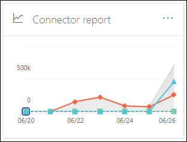

### Vista informes para el informe de conectorReport view for the Connector report

Los siguientes gráficos están disponibles en la vista de informe:The following charts are available in report view:

- **Ver datos por: flujo del correo**: en este gráfico se muestra el número de mensajes entrantes y salientes organizados por:**View data by: Mail flow**: This chart shows the number of inbound and outbound messages organized by:

  - **Total****Total**
  - **De Internet sin conector****From the internet without a connector**
  - **A Internet sin conector****To the internet without a connector**
  - Un conector específico que haya configurado.A specific connector that you've configured.
  
  Para aislar los datos del gráfico, use el control **Mostrar datos para** para seleccionar una de estas opciones o **todo el flujo de correo**.To isolate the data in the chart, use the **Show data for** control to select one of these options or **All mail flow**.

  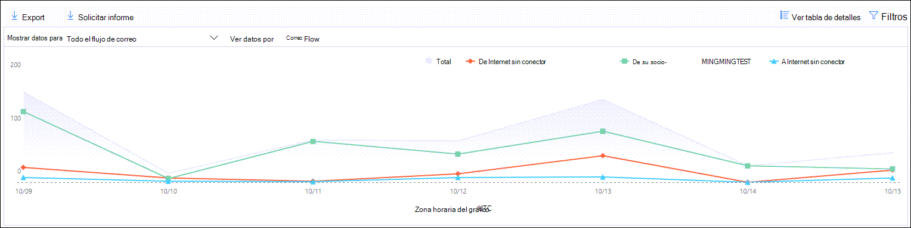

- **Ver datos por: uso de TLS**: en este gráfico se muestra el porcentaje de uso de la versión de seguridad de la capa de transporte (TLS) para el flujo de correo.**View data by: TLS usage**: This chart shows the percentage of Transport Layer Security (TLS) version usage for mail flow.

  Para aislar los datos del gráfico, use el control **Mostrar datos para** para seleccionar una de las siguientes opciones:To isolate the data in the chart, use the **Show data for** control to select one of the following options:

  - **Todo el flujo de correo****All mail flow**
  - **De Internet sin conector****From the internet without a connector**
  - **A Internet sin conector****To the internet without a connector**
  - Un conector específico que haya configurado.A specific connector that you've configured.

  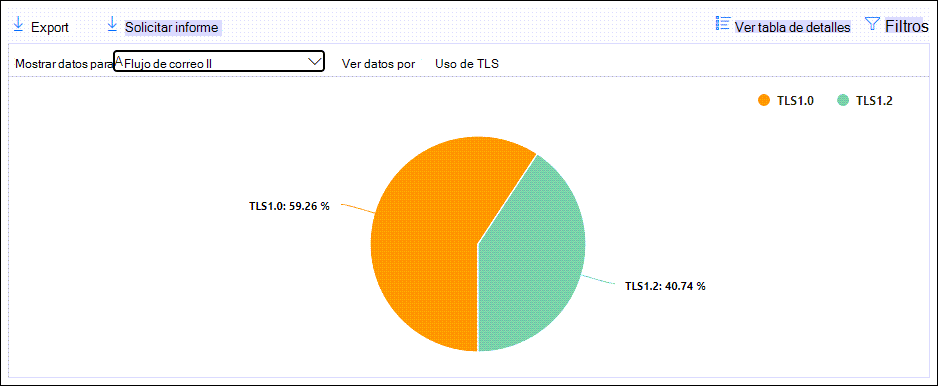

Si hace clic en **filtros** en una vista de informe, puede especificar un intervalo de fechas con **fecha de inicio** y fecha de **finalización**.If you click **Filters** in a report view, you can specify a date range with **Start date** and **End date**.

### Vista de tabla de detalles para el informe de conectorDetails table view for the Connector report

Si hace clic en **ver tabla de detalles** en una vista de informe, se mostrará la siguiente información:If you click **View details table** in a report view, the following information is shown:

- **Fecha****Date**
- **Dirección y nombre del conector****Connector direction and name**
- **Tipo de conector****Connector type**
- **¿TLS forzado?**: el valor **true** o **false**.**Forced TLS?**: The value **True** or **False**.
- **Sin TLS** (porcentaje)**No TLS** (percentage)
- **TLS 1,0** (porcentaje)**TLS 1.0** (percentage)
- **TLS 1,1** (porcentaje)**TLS 1.1** (percentage)
- **TLS 1,2** (porcentaje)**TLS 1.2** (percentage)
- **Volumen**: el número de mensajes.**Volume**: The number of messages.

Si hace clic en **filtros** en una vista de tabla de detalles, puede especificar un intervalo de fechas con **fecha de inicio** y fecha de **finalización**.If you click **Filters** in a details table view, you can specify a date range with **Start date** and **End date**.

Para volver a la vista de informe, haga clic en **Ver informe**.To go back to the report view, click **View report**.

## Informe de reglas de transporte de ExchangeExchange transport rule report

El **Informe de reglas de transporte de Exchange** muestra el efecto de las reglas de flujo de correo (también conocidas como reglas de transporte) en los mensajes entrantes y salientes de la organización.The **Exchange transport rule report** shows the effect of mail flow rules (also known as transport rules) on incoming and outgoing messages in your organization.

Para ver el informe, abra el [centro de seguridad & cumplimiento](https://protection.office.com), vaya **Reports** al \> **Panel** informes y seleccione regla de **transporte de Exchange**.To view the report, open the [Security & Compliance Center](https://protection.office.com), go to **Reports** \> **Dashboard** and select **Exchange Transport rule**. Para ir directamente al informe, Abra <https://protection.office.com/reportv2?id=ETRRuleReport> .To go directly to the report, open <https://protection.office.com/reportv2?id=ETRRuleReport>.

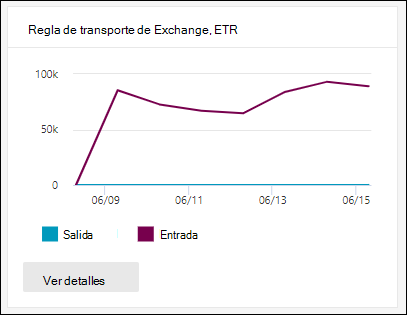

### Vista informes para el informe de reglas de transporte de ExchangeReport view for the Exchange transport rule report

Los siguientes gráficos están disponibles en la vista de informe:The following charts are available in report view:

- **Ver datos por: reglas** \> de transporte de Exchange **Desglose por: Dirección: en**este gráfico se muestra el número de mensajes **entrantes** y **salientes** que se vieron afectados por las reglas de transporte.**View data by: Exchange transport rules** \> **Break down by: Direction**: This chart shows the number of **Inbound** and **Outbound** messages that were affected by transport rules.

- **Ver datos por: reglas** \> de transporte de Exchange **Desglose por: gravedad: en**este gráfico se muestra el número de gravedad **alta** y **mediana**y los mensajes de **gravedad baja** .**View data by: Exchange transport rules** \> **Break down by: Severity**: This chart shows the number of **High severity** and **Medium severity**, and **Low severity** messages. El nivel de gravedad se establece como una acción en la regla (**auditar esta regla con el nivel de gravedad** o _SetAuditSeverity_).You set the severity level as an action in the rule (**Audit this rule with severity level** or _SetAuditSeverity_). Para obtener más información, vea [acciones de las reglas de flujo de correo en Exchange Online](https://docs.microsoft.com//Exchange/security-and-compliance/mail-flow-rules/mail-flow-rule-actions).For more information, see [Mail flow rule actions in Exchange Online](https://docs.microsoft.com//Exchange/security-and-compliance/mail-flow-rules/mail-flow-rule-actions).

- **Ver datos por: reglas de transporte de Exchange de DLP** \> **Desglose por: Dirección: en**este gráfico se muestra el número de mensajes **entrantes** y **salientes** que se vieron afectados por las reglas de transporte de prevención de pérdida de datos (DLP).**View data by: DLP Exchange transport rules** \> **Break down by: Direction**: This chart shows the number of **Inbound** and **Outbound** messages that were affected by data loss prevention (DLP) transport rules. Puede refinar aún más el gráfico si selecciona una de las siguientes opciones:You can further refine the chart by selecting on of the following options:

  - **Mostrar datos para: todas las reglas de transporte de DLP****Show data for: All DLP transport rules**
  - **Mostrar datos para: usuarios comprometidos****Show data for: Compromised users**
  - **Mostrar datos para: bajo volumen de contenido detectado Patriot Act de Estados Unidos****Show data for: Low volume of content detected U.S. Patriot Act**

- **Ver datos por: reglas de transporte de Exchange de DLP** \> **Dividir por: dirección**: esta vista muestra el número de gravedad **alta** y **mediana**y los mensajes de **gravedad baja** que se vieron afectados por las reglas de transporte de DLP.**View data by: DLP Exchange transport rules** \> **Break down by: Direction**: This view shows the number of **High severity** and **Medium severity**, and **Low severity** messages that were affected by DLP transport rules. Puede refinar aún más el gráfico si selecciona una de las siguientes opciones:You can further refine the chart by selecting on of the following options:

  - **Mostrar datos para: todas las reglas de transporte de DLP****Show data for: All DLP transport rules**
  - **Mostrar datos para: usuarios comprometidos****Show data for: Compromised users**
  - **Mostrar datos para: bajo volumen de contenido detectado Patriot Act de Estados Unidos****Show data for: Low volume of content detected U.S. Patriot Act**

Si hace clic en **filtros** en una vista de informe, puede modificar los resultados con los siguientes filtros::If you click **Filters** in a report view, you can modify the results with the following filters::

- **Fecha de inicio** y **fecha de finalización****Start date** and **End date**
- Valores de direcciónDirection values
- Valores de gravedadSeverity values

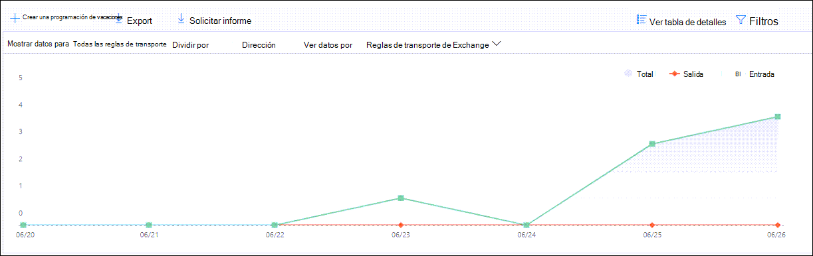

### Vista de tabla de detalles para el informe de regla de transporte de ExchangeDetails table view for the Exchange transport rule report

Si hace clic en **ver tabla de detalles**, la información que se muestra depende del gráfico que estaba viendo:If you click **View details table**, the information that's shown depends on the chart you were looking at:

- **Ver datos por: reglas de transporte de Exchange**:**View data by: Exchange Transport rules**:

  - **Fecha****Date**
  - **Regla de transporte****Transport rule**
  - **Asunto****Subject**
  - **Dirección del remitente****Sender address**
  - **Dirección del destinatario****Recipient address**
  - **Gravedad****Severity**
  - **Dirección****Direction**

- **Ver datos por: reglas de transporte de DLP de Exchange**:**View data by: DLP Exchange transport rules**:

  - **Fecha****Date**
  - **Directiva DLP****DLP policy**
  - **Regla de transporte****Transport rule**
  - **Asunto****Subject**
  - **Dirección del remitente****Sender address**
  - **Dirección del destinatario****Recipient address**
  - **Gravedad****Severity**
  - **Dirección****Direction**

Si hace clic en **filtros** en una vista de tabla de detalles, puede modificar los resultados con los filtros siguientes:If you click **Filters** in a details table view, you can modify the results with the following filters:

- **Fecha de inicio** y **fecha de finalización****Start date** and **End date**
- Valores de direcciónDirection values
- Valores de gravedadSeverity values

Para volver a la vista de informe, haga clic en **Ver informe**.To go back to the report view, click **View report**.

## Reenvío de informesForwarding report

El **Informe de reenvío** muestra los mensajes reenviados automáticamente de la organización a dominios externos de los buzones de Exchange Online.The **Forwarding report** shows your organization's automatically forwarded messages to external domains from Exchange Online mailboxes. Los mensajes reenviados pueden suponer un riesgo de seguridad o de cumplimiento, y pueden indicar una cuenta en peligro.Forwarded messages can pose a security or compliance risk, and might indicate a compromised account.

Para ver el informe, abra el [centro de seguridad & cumplimiento](https://protection.office.com), vaya **Reports** al \> **Panel** informes y seleccione **reenviar Informe**.To view the report, open the [Security & Compliance Center](https://protection.office.com), go to **Reports** \> **Dashboard** and select **Forwarding report**. Para ir directamente al informe, Abra <https://protection.office.com/reportv2?id=MailFlowForwarding> .To go directly to the report, open <https://protection.office.com/reportv2?id=MailFlowForwarding>.

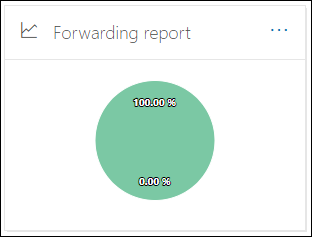

### Vista informes para el informe de reenvíoReport view for the Forwarding report

Los siguientes gráficos están disponibles en la vista de informe:The following charts are available in the report view:

- **Mostrar datos para: métodos de reenvío**: se muestran los métodos siguientes:**Show data for: Forwarding methods**: The following methods are shown:

  - **Regla de transporte**: también conocida como [reglas de flujo de correo](https://docs.microsoft.com/Exchange/security-and-compliance/mail-flow-rules/mail-flow-rules).**Transport rule**: Also known as [mail flow rules](https://docs.microsoft.com/Exchange/security-and-compliance/mail-flow-rules/mail-flow-rules).
  - **Regla de buzón de correo**: también conocida como reglas de la [bandeja de entrada](https://support.microsoft.com/office/c24f5dea-9465-4df4-ad17-a50704d66c59).**Mailbox rule**: Also known as [Inbox rules](https://support.microsoft.com/office/c24f5dea-9465-4df4-ad17-a50704d66c59).

  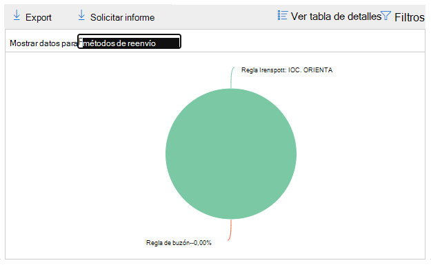

- **Mostrar datos de: dominios de reenvío**: esta vista muestra los dominios de destinatario que son los destinos para el reenvío.**Show data for: Forwarding domains**: This view shows the recipient domains that are the destinations for forwarding.

  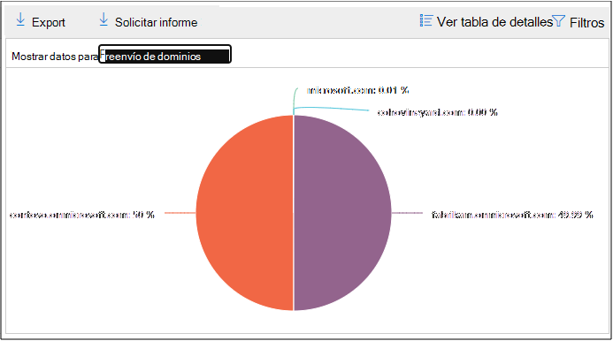

- **Mostrar datos para: reenviadores**: se muestran los siguientes reenviadores:**Show data for: Forwarders**: The following forwarders are shown:

  - **Regla de transporte****Transport rule**
  - El buzón de correo que contiene la regla de reenvío de la bandeja de entrada.The mailbox that contains the forwarding Inbox rule.

  

Si hace clic en **filtros** en una vista de informe, puede especificar un intervalo de fechas con **fecha de inicio** y fecha de **finalización**.If you click **Filters** in a report view, you can specify a date range with **Start date** and **End date**.

### Vista de tabla de detalles para el informe de reenvíoDetails table view for the Forwarding report

Si hace clic en **ver tabla de detalles** en una vista de informe, se mostrará la siguiente información:If you click **View details table** in a report view, the following information is shown:

- **Reenviadores**: la **regla de transporte** de valor o el buzón que contiene la regla de reenvío de la bandeja de entrada.**Forwarders**: The value **Transport rule** or the mailbox that contains the forwarding Inbox rule.
- **Tipo de reenvío**: regla de **buzón de correo** de valor o regla de **transporte**.**Forwarding type**: The value **Mailbox rule** or **Transport rule**.
- **Nombre de destinatario****Recipient name**
- **Dominio del destinatario****Recipient domain**
- **Detalles**: este es el valor de GUID de la regla de flujo de correo o el valor RuleIdentity de la regla de bandeja de entrada.**Details**: This is the GUID value of the mail flow rule, or the RuleIdentity value of the Inbox rule.
- **Count****Count**
- **Primera fecha de reenvío****First forward date**

Si hace clic en **filtros** en una vista de tabla de detalles, puede especificar un intervalo de fechas con **fecha de inicio** y fecha de **finalización**.If you click **Filters** in a details table view, you can specify a date range with **Start date** and **End date**.

Para volver a la vista informes, haga clic en **Ver informe**.To go back to the reports view, click **View report**.

## Informe de estado de flujo de notificaciónMailflow status report

El **Informe de estado de flujo** de correo es similar al [Informe de correo electrónico enviado y recibido](#sent-and-received-email-report), con información adicional sobre el correo electrónico permitido o bloqueado en el servidor perimetral.The **Mailflow status report** is similar to the [Sent and received email report](#sent-and-received-email-report), with additional information about email allowed or blocked on the edge. Este es el único informe que contiene información sobre la protección perimetral y muestra la cantidad de correo electrónico que se bloquea antes de que se permita el servicio para su evaluación por parte de Exchange Online Protection (EOP).This is the only report that contains edge protection information, and shows just how much email is blocked before being allowed into the service for evaluation by Exchange Online Protection (EOP).

Para ver el informe, abra el [centro de seguridad & cumplimiento](https://protection.office.com), vaya **Reports** al \> **Panel** informes y seleccione informe de **Estado de flujo**de información.To view the report, open the [Security & Compliance Center](https://protection.office.com), go to **Reports** \> **Dashboard** and select **Mailflow status report**. Para ir directamente al **Informe de estado del flujo de correo**, Abra <https://protection.office.com/mailflowStatusReport> .To go directly to the **Mail flow status report**, open <https://protection.office.com/mailflowStatusReport>.

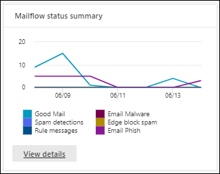

### Tipo de vista para el informe de estado de flujo de informaciónType view for the Mailflow status report

Al abrir el informe, la ficha **tipo** se selecciona de forma predeterminada.When you open the report, the **Type** tab is selected by default. De forma predeterminada, esta vista contiene un gráfico y una tabla de datos que se configura con los siguientes filtros:By default, this view contains a chart and a data table that's configured with the following filters:

- **Fecha**: los últimos 7 días.**Date**: The last 7 days.
- **Dirección**:**Direction**:

  - **Entrada****Inbound**
  - **Saliente****Outbound**
  - **Dentro de la organización** (cuenta por separado de **entrada** y de **salida**)**Intra-org** (counted separately from **Inbound** and **Outbound**)

- **Tipo**:**Type**:

  - **Correo bueno****Good mail**
  - **Malware****Malware**
  - **Correo no deseado****Spam**
  - **Protección perimetral****Edge protection**
  - **Mensajes de regla****Rule messages**
  - **Correo de suplantación de identidad****Phishing email**

El gráfico se organiza por los valores de **tipo** .The chart is organized by the **Type** values.

Puede cambiar estos filtros haciendo clic en **filtrar** o haciendo clic en un valor de la leyenda del gráfico.You can changes these filters by clicking **Filter** or by clicking a value in the chart legend.

La tabla de datos contiene la siguiente información:The data table contains the following information:

- **Dirección****Direction**
- **Tipo****Type**
- **24 horas****24 hours**
- **3 días****3 days**
- **7 días****7 days**
- **15 días****15 days**
- **30 días****30 days**

Si hace clic en **elegir una categoría para obtener más información**, puede seleccionar uno de los siguientes valores:If you click **Choose a category for more details**, you can select from the following values:

- **Correo electrónico de suplantación de identidad**: esta selección le lleva al [Informe de estado de protección contra amenazas](view-email-security-reports.md#threat-protection-status-report).**Phishing email**: This selection takes you to the [Threat protection status report](view-email-security-reports.md#threat-protection-status-report).
- **Malware en correo electrónico**: esta selección le lleva al [Informe de estado de protección contra amenazas](view-email-security-reports.md#threat-protection-status-report).**Malware in email**: This selection takes you to the [Threat protection status report](view-email-security-reports.md#threat-protection-status-report).
- **Detecciones de correo no deseado**: esta selección le lleva al [Informe de detecciones de correo no deseado](view-email-security-reports.md#spam-detections-report).**Spam detections**: This selection takes you to the [Spam Detections report](view-email-security-reports.md#spam-detections-report).
- **Correo no deseado de Edge bloqueado**: esta selección le lleva al [Informe de detecciones de correo no deseado](view-email-security-reports.md#spam-detections-report).**Edge blocked spam**: This selection takes you to the [Spam Detections report](view-email-security-reports.md#spam-detections-report).

**Exportar**:**Export**:

Para la vista de detalles, solo puede exportar datos de un día.For the detail view, you can only export data for one day. Por lo tanto, si desea exportar datos durante 7 días, necesitará hacer 7 acciones de exportación diferentes.So, if you want to export data for 7 days, you need to do 7 different export actions.

Cada archivo. csv exportado está limitado a 150.000 filas.Each exported .csv file is limited to 150,000 rows. Si los datos de ese día contienen más de 150.000 filas, se crearán varios archivos. csv.If the data for that day contains more than 150,000 rows, then multiple .csv files will be created.

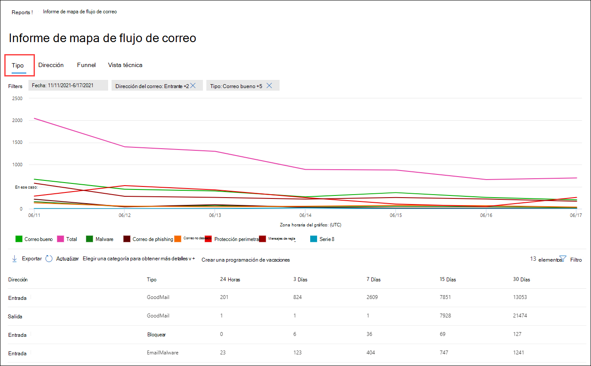

### Vista de dirección para el informe de estado de flujo de informaciónDirection view for the Mailflow status report

Si hace clic en la ficha **Dirección** , se usarán los mismos filtros predeterminados de la vista de **tipos** .If you click the **Direction** tab, the same default filters from the **Type** view are used.

El gráfico está organizado por valores de **Dirección** .The chart is organized by **Direction** values.

Puede cambiar estos filtros haciendo clic en **filtrar** o haciendo clic en un valor de la leyenda del gráfico.You can change these filters by clicking **Filter** or by clicking a value in the chart legend. Se usan los mismos filtros de la vista **tipo** .The same filters from the **Type** view are used.

La tabla de datos contiene la misma información de la vista de **tipo** .The data table contains same information from the **Type** view.

El comportamiento seleccionar **una categoría para obtener más información sobre** las selecciones disponibles y el comportamiento es el mismo que el de la vista **tipo** .The **Choose a category for more details** available selections and behavior are the same as the **Type** view.

**Exportar**:**Export**:

Para la vista de detalles, solo puede exportar datos de un día.For the detail view, you can only export data for one day. Por lo tanto, si desea exportar datos durante 7 días, necesitará hacer 7 acciones de exportación diferentes.So, if you want to export data for 7 days, you need to do 7 different export actions.

Cada archivo. csv exportado está limitado a 150.000 filas.Each exported .csv file is limited to 150,000 rows. Si los datos de ese día contienen más de 150.000 filas, se crearán varios archivos. csv.If the data for that day contains more than 150,000 rows, then multiple .csv files will be created.

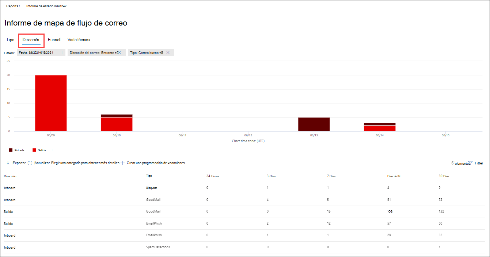

## Informe de correo electrónico enviado y recibidoSent and received email report

El informe de **correo electrónico enviado y recibido** es un informe inteligente que muestra información sobre el correo electrónico entrante y saliente, incluidas las detecciones de correo no deseado, malware y el correo electrónico identificado como "bueno".The **Sent and received email** report is a smart report that shows information about incoming and outgoing email, including spam detections, malware, and email identified as "good." La diferencia entre este informe y el [Informe de estado de flujo](#mailflow-status-report) de correos es la siguiente: este informe no incluye datos sobre los mensajes bloqueados por la protección perimetral.The difference between this report and the [Mailflow status report](#mailflow-status-report) is: this report doesn't include data about messages blocked by edge protection.

La vista agregada y la vista de detalles del informe permiten 90 días de filtrado.The aggregate view and the detail view of the report allow for 90 days of filtering.

Para ver el informe, abra el [centro de seguridad & cumplimiento](https://protection.office.com), vaya **Reports** al \> **Panel** informes y seleccione **correo electrónico enviado y recibido**.To view the report, open the [Security & Compliance Center](https://protection.office.com), go to **Reports** \> **Dashboard** and select **Sent and received email**. Para ir directamente al informe, Abra <https://protection.office.com/reportv2?id=SentAndReceivedMailATP> .To go directly to the report, open <https://protection.office.com/reportv2?id=SentAndReceivedMailATP>.

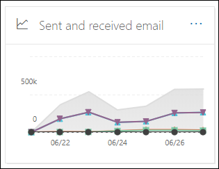

### Vista informes para el informe de correo electrónico enviado y recibidoReport view for the Sent and received email report

Los siguientes gráficos están disponibles en la vista de informe:The following charts are available in the report view:

- **Dividir por: escriba**: el gráfico muestra todas las categorías disponibles:**Break down by: Type**: The chart shows all available categories:

  - **Total****Total**
  - **Correo bueno****Good mail**
  - **Malware (anti-malware)** (EOP)**Malware (anti-malware)** (EOP)
  - **Detecciones de correo no deseado****Spam detections**
  - **Mensajes de regla****Rule messages**
  - **Malware avanzado** (Office 365 ATP)**Advanced malware** (Office 365 ATP)

  Al pasar el mouse sobre un día (punto de datos) del gráfico, puede ver los detalles de ese día.When you hover over a day (data point) in the chart, you can see details for that day.

  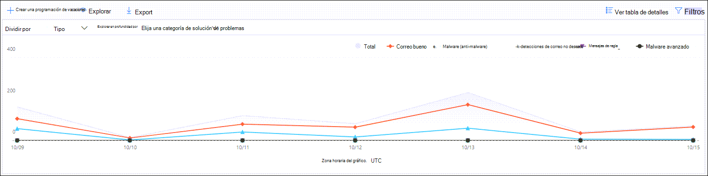

- **Desglose por: dirección**: el gráfico muestra los datos **totales**, **entrantes**y **salientes** .**Break down by: Direction**: The chart shows **Total**, **Inbound**, and **Outbound** data. Al pasar el mouse sobre un día (punto de datos) del gráfico, puede ver los detalles de ese día.When you hover over a day (data point) in the chart, you can see details for that day.

  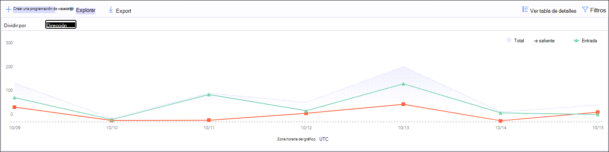

- **Explorar en profundidad por** \> **Malware (anti-malware)**: esta selección le lleva a la [detección de malware en el informe de correo electrónico](view-email-security-reports.md#malware-detection-in-email-report).**Drill down by** \> **Malware (anti-malware)**: This selection takes you to the [Malware detection in email report](view-email-security-reports.md#malware-detection-in-email-report).

- **Explorar en profundidad por** \> **Detecciones de correo no deseado)**: esta selección le lleva al [Informe de detecciones de correo no deseado](view-email-security-reports.md#spam-detections-report).**Drill down by** \> **Spam detections)**: This selection takes you to the [Spam Detections report](view-email-security-reports.md#spam-detections-report).

Si hace clic en **filtros** en una vista de informe, puede modificar los resultados con los siguientes filtros:If you click **Filters** in a report view, you can modify the results with the following filters:

- **Fecha de inicio** y **fecha de finalización****Start date** and **End date**
- Valores de direcciónDirection values
- Valores de tipoType values

Para volver a la vista de informe, haga clic en **Ver informe**.To go back to the report view, click **View report**.

### Vista de tabla de detalles para el informe de correo electrónico enviado y recibidoDetails table view for the Sent and received email report

Si hace clic en **ver tabla de detalles** en el cuadro **desglosar por: dirección** o **dividir por:** vista de dirección, se muestra la siguiente información:If you click **View details table** in the **Break down by: Direction** or **Break down by: Direction** view, the following information is shown:

- **Fecha (UTC)****Date (UTC)**
- **Tipo****Type**
- **Dirección****Direction**
- **Número de mensajes****Message count**

Si hace clic en **filtros** en una vista de tabla de detalles, puede modificar los resultados con los filtros siguientes:If you click **Filters** in a details table view, you can modify the results with the following filters:

- **Fecha de inicio** y **fecha de finalización****Start date** and **End date**
- Valores de direcciónDirection values
- Valores de tipoType values

Para volver a la vista de informe, haga clic en **Ver informe**.To go back to the report view, click **View report**.

## Informe de remitentes y destinatarios principalesTop senders and recipients report

El informe de **remitentes y destinatarios principales** es un gráfico circular que muestra los principales remitentes y destinatarios de correo electrónico.The **Top senders and recipients** report is a pie chart showing your top email senders and recipients.

Para ver el informe, abra el [centro de seguridad & cumplimiento](https://protection.office.com), vaya **Reports** al \> **Panel** informes y seleccione **principales remitentes y destinatarios**.To view the report, open the [Security & Compliance Center](https://protection.office.com), go to **Reports** \> **Dashboard** and select **Top senders and recipients**. Para ir directamente al informe, Abra <https://protection.office.com/reportv2?id=TopSenderRecipientsATP> .To go directly to the report, open <https://protection.office.com/reportv2?id=TopSenderRecipientsATP>.

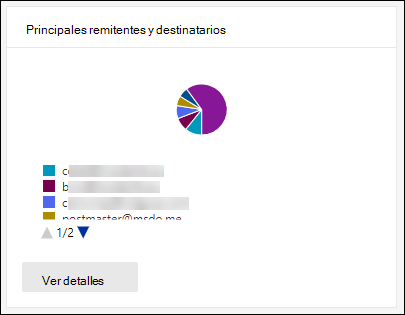

### Vista informes para los principales informes de remitentes y destinatariosReport view for the Top senders and recipient report

Los siguientes gráficos están disponibles en la vista de informe:The following charts are available in the report view:

- **Mostrar datos para los \> remitentes de correo principales****Show data for \> Top mail senders**
- **Mostrar datos para los \> principales destinatarios de correo****Show data for \> Top mail recipients**
- **Mostrar datos para los \> principales destinatarios de correo no deseado****Show data for \> Top spam recipients**
- **Mostrar datos para \> Destinatarios principales de malware** (EOP)**Show data for \> Top malware recipients** (EOP)
- **Mostrar datos para \> Principales destinatarios de malware (ATP)** (Office 365 ATP)**Show data for \> Top malware recipients (ATP)** (Office 365 ATP)

La composición del gráfico circular cambia en función de estas selecciones.The composition of the pie chart changes based on these selections.

Cuando desplaza el puntero sobre una cuña del gráfico circular, puede ver un recuento de los mensajes enviados o recibidos.When you hover over a wedge in the pie chart, you can see a count of messages sent or received.

Si hace clic en **filtros** en una vista de informe, puede especificar un intervalo de fechas con **fecha de inicio** y fecha de **finalización**.If you click **Filters** in a report view, you can specify a date range with **Start date** and **End date**.

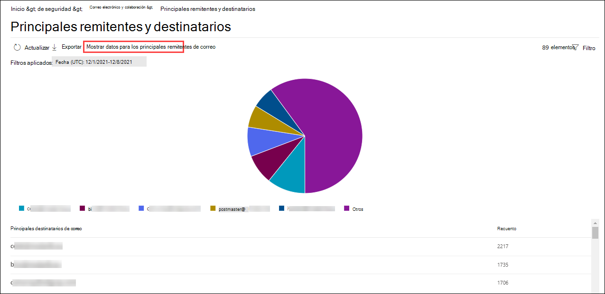

### Vista de tabla de detalles para el informe de remitentes y destinatarios principalesDetails table view for the Top senders and recipient report

Si hace clic en **ver tabla de detalles**, la información que se muestra depende del gráfico que estaba viendo:If you click **View details table**, the information that's shown depends on the chart you were looking at:

- **Mostrar datos para los \> remitentes de correo principales****Show data for \> Top mail senders**

  - **Principales remitentes de correo****Top mail senders**
  - **Count****Count**

- **Mostrar datos para los \> principales destinatarios de correo****Show data for \> Top mail recipients**

  - **Destinatarios principales de correo****Top mail recipients**
  - **Count****Count**

- **Mostrar datos para los \> principales destinatarios de correo no deseado****Show data for \> Top spam recipients**

  - **Principales destinatarios de correo no deseado****Top spam recipients**
  - **Count****Count**

- **Mostrar datos para \> Destinatarios principales de malware** (EOP)**Show data for \> Top malware recipients** (EOP)

  - **Destinatarios principales de malware****Top malware recipients**
  - **Count****Count**

- **Mostrar datos para \> Principales destinatarios de malware (ATP)** (Office 365 ATP)**Show data for \> Top malware recipients (ATP)** (Office 365 ATP)

  - **Destinatarios principales de malware (ATP)****Top malware recipients (ATP)**
  - **Count****Count**

Si hace clic en **filtros** en una vista de tabla de detalles, puede especificar un intervalo de fechas con **fecha de inicio** y fecha de **finalización**.If you click **Filters** in a details table view, you can specify a date range with **Start date** and **End date**.

Para volver a la vista de informe, haga clic en **Ver informe**.To go back to the report view, click **View report**.

## ¿Qué permisos se necesitan para ver estos informes?What permissions are needed to view these reports?

Para ver y usar los informes, debe ser miembro del grupo de roles especificado en el centro de seguridad & cumplimiento **y** en Exchange Online.To view and use the reports, you need to be a member of the specified role group in the Security & Compliance Center **and** in Exchange Online.

- En el centro de seguridad & cumplimiento, debe ser miembro de uno de los siguientes grupos de roles:In the Security & Compliance Center, you need to be a member of one of the following role groups:

  -Administración de la organización-Organization Management

  -Administrador de seguridad (también puede hacerlo en el [centro de administración de Azure Active Directory](https://aad.portal.azure.com) : lector de seguridad-Security Administrator (you can also do this in the [Azure Active Directory admin center](https://aad.portal.azure.com) -Security Reader

  Para obtener más información, vea [Permisos en el Centro de seguridad y cumplimiento](https://docs.microsoft.com/microsoft-365/security/office-365-security/permissions-in-the-security-and-compliance-center).For more information, see [Permissions in the Security & Compliance Center](https://docs.microsoft.com/microsoft-365/security/office-365-security/permissions-in-the-security-and-compliance-center).

- En Exchange Online, debe ser miembro de uno de los siguientes grupos de roles:In Exchange Online, you need to be a member of one of the following role groups:

  -Administración de la organización-Organization Management

  -View-Only administración de la organización-View-only Organization Management

  : Ver solo los destinatarios-View-Only Recipients

  -Administración de cumplimiento-Compliance Management

Para obtener más información, consulte [Permissions in Exchange Online](https://docs.microsoft.com/Exchange/permissions-exo/permissions-exo) y [Manage role Groups in Exchange Online](https://docs.microsoft.com/Exchange/permissions-exo/role-groups).For more information, see [Permissions in Exchange Online](https://docs.microsoft.com/Exchange/permissions-exo/permissions-exo) and [Manage role groups in Exchange Online](https://docs.microsoft.com/Exchange/permissions-exo/role-groups).

## Temas relacionadosRelated topics

[Informes inteligentes y reportes en el Centro de seguridad y cumplimientoSmart reports and insights in the Security & Compliance Center](reports-and-insights-in-security-and-compliance.md)

[Ver informes de seguridad de correo electrónico en el Centro de seguridad y cumplimientoView email security reports in the Security & Compliance Center](view-email-security-reports.md)
