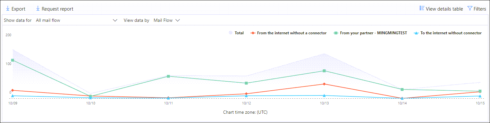

# Ver informes de flujo de correo en el panel informes del centro de seguridad & cumplimientoView mail flow reports in the Reports dashboard in Security & Compliance Center

[!INCLUDE [Microsoft 365 Defender rebranding](../includes/microsoft-defender-for-office.md)]

Además de los informes de flujo de correo que están disponibles en el [panel del flujo de correo](mail-flow-insights-v2.md) en el centro de seguridad & cumplimiento, hay disponible una variedad de informes de flujo de correo adicionales en el panel de informes para ayudarle a supervisar su organización de 365 de Microsoft.In addition to the mail flow reports that are available in the [Mail flow dashboard](mail-flow-insights-v2.md) in the Security & Compliance Center, a variety of additional mail flow reports are available in the Reports dashboard to help you monitor your Microsoft 365 organization.

Si dispone de los [permisos necesarios](#what-permissions-are-needed-to-view-these-reports), puede ver estos informes en el [centro de seguridad & cumplimiento](https://office.protection.com) desde el panel de **informes** \> **Dashboard**.If you have the [necessary permissions](#what-permissions-are-needed-to-view-these-reports), you can view these reports in the [Security & Compliance Center](https://office.protection.com) by going to **Reports** \> **Dashboard**. Para ir directamente al panel informes, Abra <https://protection.office.com/insightdashboard> .To go directly to the Reports dashboard, open <https://protection.office.com/insightdashboard>.

## Informe de conectorConnector report

El **Informe de conectores** muestra la actividad de flujo de correo en los [conectores entrantes y](https://docs.microsoft.com/Exchange/mail-flow-best-practices/use-connectors-to-configure-mail-flow/use-connectors-to-configure-mail-flow) salientes que están configurados para su organización.The **Connector report** shows mail flow activity on the [inbound and outbound connectors](https://docs.microsoft.com/Exchange/mail-flow-best-practices/use-connectors-to-configure-mail-flow/use-connectors-to-configure-mail-flow) that are configured for your organization.

Para ver el informe, abra el [centro de seguridad & cumplimiento](https://protection.office.com), vaya **Reports** al \> **Panel** informes y seleccione **Informe de conector**.To view the report, open the [Security & Compliance Center](https://protection.office.com), go to **Reports** \> **Dashboard** and select **Connector report**. Para ir directamente al informe, Abra <https://protection.office.com/reportv2?id=ConnectorReport> .To go directly to the report, open <https://protection.office.com/reportv2?id=ConnectorReport>.

### Vista informes para el informe de conectorReport view for the Connector report

Los siguientes gráficos están disponibles en la vista de informe:The following charts are available in report view:

- **Ver datos por: flujo del correo**: en este gráfico se muestra el número de mensajes entrantes y salientes organizados por:**View data by: Mail flow**: This chart shows the number of inbound and outbound messages organized by:

  - **Total****Total**
  - **De Internet sin conector****From the internet without a connector**
  - **A Internet sin conector****To the internet without a connector**
  - Un conector específico que haya configurado.A specific connector that you've configured.

  Para aislar los datos del gráfico, use el control **Mostrar datos para** para seleccionar una de estas opciones o **todo el flujo de correo**.To isolate the data in the chart, use the **Show data for** control to select one of these options or **All mail flow**.

  

- **Ver datos por: uso de TLS**: en este gráfico se muestra el porcentaje de uso de la versión de seguridad de la capa de transporte (TLS) para el flujo de correo.**View data by: TLS usage**: This chart shows the percentage of Transport Layer Security (TLS) version usage for mail flow.

  Para aislar los datos del gráfico, use el control **Mostrar datos para** para seleccionar una de las siguientes opciones:To isolate the data in the chart, use the **Show data for** control to select one of the following options:

  - **Todo el flujo de correo****All mail flow**
  - **De Internet sin conector****From the internet without a connector**
  - **A Internet sin conector****To the internet without a connector**
  - Un conector específico que haya configurado.A specific connector that you've configured.

  

Si hace clic en **filtros** en una vista de informe, puede especificar un intervalo de fechas con **fecha de inicio** y fecha de **finalización**.If you click **Filters** in a report view, you can specify a date range with **Start date** and **End date**.

### Vista de tabla de detalles para el informe de conectorDetails table view for the Connector report

Si hace clic en **ver tabla de detalles** en una vista de informe, se mostrará la siguiente información:If you click **View details table** in a report view, the following information is shown:

- **Fecha****Date**
- **Dirección y nombre del conector****Connector direction and name**
- **Tipo de conector****Connector type**
- **¿TLS forzado?**: el valor **true** o **false**.**Forced TLS?**: The value **True** or **False**.
- **Sin TLS** (porcentaje)**No TLS** (percentage)
- **TLS 1,0** (porcentaje)**TLS 1.0** (percentage)
- **TLS 1,1** (porcentaje)**TLS 1.1** (percentage)
- **TLS 1,2** (porcentaje)**TLS 1.2** (percentage)
- **Volumen**: el número de mensajes.**Volume**: The number of messages.

Si hace clic en **filtros** en una vista de tabla de detalles, puede especificar un intervalo de fechas con **fecha de inicio** y fecha de **finalización**.If you click **Filters** in a details table view, you can specify a date range with **Start date** and **End date**.

Para volver a la vista de informe, haga clic en **Ver informe**.To go back to the report view, click **View report**.

## Informe de reglas de transporte de ExchangeExchange transport rule report

El **Informe de reglas de transporte de Exchange** muestra el efecto de las reglas de flujo de correo (también conocidas como reglas de transporte) en los mensajes entrantes y salientes de la organización.The **Exchange transport rule report** shows the effect of mail flow rules (also known as transport rules) on incoming and outgoing messages in your organization.

Para ver el informe, abra el [centro de seguridad & cumplimiento](https://protection.office.com), vaya **Reports** al \> **Panel** informes y seleccione regla de **transporte de Exchange**.To view the report, open the [Security & Compliance Center](https://protection.office.com), go to **Reports** \> **Dashboard** and select **Exchange Transport rule**. Para ir directamente al informe, Abra <https://protection.office.com/reportv2?id=ETRRuleReport> .To go directly to the report, open <https://protection.office.com/reportv2?id=ETRRuleReport>.

### Vista informes para el informe de reglas de transporte de ExchangeReport view for the Exchange transport rule report

Los siguientes gráficos están disponibles en la vista de informe:The following charts are available in report view:

- **Ver datos por: reglas** \> de transporte de Exchange **Desglose por: Dirección: en** este gráfico se muestra el número de mensajes **entrantes** y **salientes** que se vieron afectados por las reglas de transporte.**View data by: Exchange transport rules** \> **Break down by: Direction**: This chart shows the number of **Inbound** and **Outbound** messages that were affected by transport rules.

- **Ver datos por: reglas** \> de transporte de Exchange **Desglose por: gravedad: en** este gráfico se muestra el número de gravedad **alta** y **mediana** y los mensajes de **gravedad baja** .**View data by: Exchange transport rules** \> **Break down by: Severity**: This chart shows the number of **High severity** and **Medium severity**, and **Low severity** messages. El nivel de gravedad se establece como una acción en la regla (**auditar esta regla con el nivel de gravedad** o _SetAuditSeverity_).You set the severity level as an action in the rule (**Audit this rule with severity level** or _SetAuditSeverity_). Para obtener más información, vea [acciones de las reglas de flujo de correo en Exchange Online](https://docs.microsoft.com//Exchange/security-and-compliance/mail-flow-rules/mail-flow-rule-actions).For more information, see [Mail flow rule actions in Exchange Online](https://docs.microsoft.com//Exchange/security-and-compliance/mail-flow-rules/mail-flow-rule-actions).

- **Ver datos por: reglas de transporte de Exchange de DLP** \> **Desglose por: Dirección: en** este gráfico se muestra el número de mensajes **entrantes** y **salientes** que se vieron afectados por las reglas de transporte de prevención de pérdida de datos (DLP).**View data by: DLP Exchange transport rules** \> **Break down by: Direction**: This chart shows the number of **Inbound** and **Outbound** messages that were affected by data loss prevention (DLP) transport rules. Puede refinar aún más el gráfico si selecciona una de las siguientes opciones:You can further refine the chart by selecting on of the following options:

  - **Mostrar datos para: todas las reglas de transporte de DLP****Show data for: All DLP transport rules**
  - **Mostrar datos para: usuarios comprometidos****Show data for: Compromised users**
  - **Mostrar datos para: bajo volumen de contenido detectado Patriot Act de Estados Unidos****Show data for: Low volume of content detected U.S. Patriot Act**

- **Ver datos por: reglas de transporte de Exchange de DLP** \> **Dividir por: dirección**: esta vista muestra el número de gravedad **alta** y **mediana** y los mensajes de **gravedad baja** que se vieron afectados por las reglas de transporte de DLP.**View data by: DLP Exchange transport rules** \> **Break down by: Direction**: This view shows the number of **High severity** and **Medium severity**, and **Low severity** messages that were affected by DLP transport rules. Puede refinar aún más el gráfico si selecciona una de las siguientes opciones:You can further refine the chart by selecting on of the following options:

  - **Mostrar datos para: todas las reglas de transporte de DLP****Show data for: All DLP transport rules**
  - **Mostrar datos para: usuarios comprometidos****Show data for: Compromised users**
  - **Mostrar datos para: bajo volumen de contenido detectado Patriot Act de Estados Unidos****Show data for: Low volume of content detected U.S. Patriot Act**

Si hace clic en **filtros** en una vista de informe, puede modificar los resultados con los siguientes filtros::If you click **Filters** in a report view, you can modify the results with the following filters::

- **Fecha de inicio** y **fecha de finalización****Start date** and **End date**
- Valores de direcciónDirection values
- Valores de gravedadSeverity values

### Vista de tabla de detalles para el informe de regla de transporte de ExchangeDetails table view for the Exchange transport rule report

Si hace clic en **ver tabla de detalles**, la información que se muestra depende del gráfico que estaba viendo:If you click **View details table**, the information that's shown depends on the chart you were looking at:

- **Ver datos por: reglas de transporte de Exchange**:**View data by: Exchange Transport rules**:

  - **Fecha****Date**
  - **Regla de transporte****Transport rule**
  - **Asunto****Subject**
  - **Dirección del remitente****Sender address**
  - **Dirección del destinatario****Recipient address**
  - **Gravedad****Severity**
  - **Dirección****Direction**

- **Ver datos por: reglas de transporte de DLP de Exchange**:**View data by: DLP Exchange transport rules**:

  - **Fecha****Date**
  - **Directiva DLP****DLP policy**
  - **Regla de transporte****Transport rule**
  - **Asunto****Subject**
  - **Dirección del remitente****Sender address**
  - **Dirección del destinatario****Recipient address**
  - **Gravedad****Severity**
  - **Dirección****Direction**

Si hace clic en **filtros** en una vista de tabla de detalles, puede modificar los resultados con los filtros siguientes:If you click **Filters** in a details table view, you can modify the results with the following filters:

- **Fecha de inicio** y **fecha de finalización****Start date** and **End date**
- Valores de direcciónDirection values
- Valores de gravedadSeverity values

Para volver a la vista de informe, haga clic en **Ver informe**.To go back to the report view, click **View report**.

## Reenvío de informesForwarding report

El **Informe de reenvío** muestra los mensajes reenviados automáticamente de la organización a dominios externos de los buzones de Exchange Online.The **Forwarding report** shows your organization's automatically forwarded messages to external domains from Exchange Online mailboxes. Los mensajes reenviados pueden suponer un riesgo de seguridad o de cumplimiento, y pueden indicar una cuenta en peligro.Forwarded messages can pose a security or compliance risk, and might indicate a compromised account.

Para ver el informe, abra el [centro de seguridad & cumplimiento](https://protection.office.com), vaya **Reports** al \> **Panel** informes y seleccione **reenviar Informe**.To view the report, open the [Security & Compliance Center](https://protection.office.com), go to **Reports** \> **Dashboard** and select **Forwarding report**. Para ir directamente al informe, Abra <https://protection.office.com/reportv2?id=MailFlowForwarding> .To go directly to the report, open <https://protection.office.com/reportv2?id=MailFlowForwarding>.

### Vista informes para el informe de reenvíoReport view for the Forwarding report

Los siguientes gráficos están disponibles en la vista de informe:The following charts are available in the report view:

- **Mostrar datos para: métodos de reenvío**: se muestran los métodos siguientes:**Show data for: Forwarding methods**: The following methods are shown:

  - **Regla de transporte**: también conocida como [reglas de flujo de correo](https://docs.microsoft.com/Exchange/security-and-compliance/mail-flow-rules/mail-flow-rules).**Transport rule**: Also known as [mail flow rules](https://docs.microsoft.com/Exchange/security-and-compliance/mail-flow-rules/mail-flow-rules).
  - **Regla de buzón de correo**: también conocida como reglas de la [bandeja de entrada](https://support.microsoft.com/office/c24f5dea-9465-4df4-ad17-a50704d66c59).**Mailbox rule**: Also known as [Inbox rules](https://support.microsoft.com/office/c24f5dea-9465-4df4-ad17-a50704d66c59).

  

- **Mostrar datos de: dominios de reenvío**: esta vista muestra los dominios de destinatario que son los destinos para el reenvío.**Show data for: Forwarding domains**: This view shows the recipient domains that are the destinations for forwarding.

  

- **Mostrar datos para: reenviadores**: se muestran los siguientes reenviadores:**Show data for: Forwarders**: The following forwarders are shown:

  - **Regla de transporte****Transport rule**
  - El buzón de correo que contiene la regla de reenvío de la bandeja de entrada.The mailbox that contains the forwarding Inbox rule.

  

Si hace clic en **filtros** en una vista de informe, puede especificar un intervalo de fechas con **fecha de inicio** y fecha de **finalización**.If you click **Filters** in a report view, you can specify a date range with **Start date** and **End date**.

### Vista de tabla de detalles para el informe de reenvíoDetails table view for the Forwarding report

Si hace clic en **ver tabla de detalles** en una vista de informe, se mostrará la siguiente información:If you click **View details table** in a report view, the following information is shown:

- **Reenviadores**: la **regla de transporte** de valor o el buzón que contiene la regla de reenvío de la bandeja de entrada.**Forwarders**: The value **Transport rule** or the mailbox that contains the forwarding Inbox rule.
- **Tipo de reenvío**: regla de **buzón de correo** de valor o regla de **transporte**.**Forwarding type**: The value **Mailbox rule** or **Transport rule**.
- **Nombre de destinatario****Recipient name**
- **Dominio del destinatario****Recipient domain**
- **Detalles**: este es el valor de GUID de la regla de flujo de correo o el valor RuleIdentity de la regla de bandeja de entrada.**Details**: This is the GUID value of the mail flow rule, or the RuleIdentity value of the Inbox rule.
- **Count****Count**
- **Primera fecha de reenvío****First forward date**

Si hace clic en **filtros** en una vista de tabla de detalles, puede especificar un intervalo de fechas con **fecha de inicio** y fecha de **finalización**.If you click **Filters** in a details table view, you can specify a date range with **Start date** and **End date**.

Para volver a la vista informes, haga clic en **Ver informe**.To go back to the reports view, click **View report**.

## Informe de estado de flujo de notificaciónMailflow status report

El **Informe de estado de flujo** de correo es similar al [Informe de correo electrónico enviado y recibido](#sent-and-received-email-report), con información adicional sobre el correo electrónico permitido o bloqueado en el servidor perimetral.The **Mailflow status report** is similar to the [Sent and received email report](#sent-and-received-email-report), with additional information about email allowed or blocked on the edge. Este es el único informe que contiene información sobre la protección perimetral y muestra la cantidad de correo electrónico que se bloquea antes de que se permita el servicio para su evaluación por parte de Exchange Online Protection (EOP).This is the only report that contains edge protection information, and shows just how much email is blocked before being allowed into the service for evaluation by Exchange Online Protection (EOP). Es importante comprender que si un mensaje se envía a cinco destinatarios, se cuenta como cinco mensajes diferentes y no un mensaje.It's important to understand that if a message is sent to five recipients we count it as five different messages and not one message.
Para ver el informe, abra el [centro de seguridad & cumplimiento](https://protection.office.com), vaya **Reports** al \> **Panel** informes y seleccione informe de **Estado de flujo** de información.To view the report, open the [Security & Compliance Center](https://protection.office.com), go to **Reports** \> **Dashboard** and select **Mailflow status report**. Para ir directamente al **Informe de estado del flujo de correo**, Abra <https://protection.office.com/mailflowStatusReport> .To go directly to the **Mail flow status report**, open <https://protection.office.com/mailflowStatusReport>.

### Tipo de vista para el informe de estado de flujo de informaciónType view for the Mailflow status report

Al abrir el informe, la ficha **tipo** se selecciona de forma predeterminada.When you open the report, the **Type** tab is selected by default. De forma predeterminada, esta vista contiene un gráfico y una tabla de datos que se configura con los siguientes filtros:By default, this view contains a chart and a data table that's configured with the following filters:

- **Fecha**: los últimos 7 días.**Date**: The last 7 days.
- **Dirección**:**Direction**:

  - **Entrada****Inbound**
  - **Saliente****Outbound**
  - **Dentro de la organización**: este recuento es para los mensajes dentro de un espacio empresarial es decir**Intra-org**: this count is for messages within a tenant i.e el remitente abc@domain.com envía al destinatario xyz@domain.com (cuenta por separado de **entrada** y de **salida**)sender abc@domain.com sends to recipient xyz@domain.com  (counted separately from **Inbound** and **Outbound**)

- **Tipo**:**Type**:

  - **Correo bueno****Good mail**
  - **Malware****Malware**
  - **Correo no deseado****Spam**
  - **Protección perimetral****Edge protection**
  - **Mensajes de regla****Rule messages**
  - **Correo de suplantación de identidad****Phishing email**

El gráfico se organiza por los valores de **tipo** .The chart is organized by the **Type** values.

Puede cambiar estos filtros haciendo clic en **filtrar** o haciendo clic en un valor de la leyenda del gráfico.You can change these filters by clicking **Filter** or by clicking a value in the chart legend.

La tabla de datos contiene la siguiente información:The data table contains the following information:

- **Dirección****Direction**
- **Tipo****Type**
- **24 horas****24 hours**
- **3 días****3 days**
- **7 días****7 days**
- **15 días****15 days**
- **30 días****30 days**

Si hace clic en **elegir una categoría para obtener más información**, puede seleccionar uno de los siguientes valores:If you click **Choose a category for more details**, you can select from the following values:

- **Correo electrónico de suplantación de identidad**: esta selección le lleva al [Informe de estado de protección contra amenazas](view-email-security-reports.md#threat-protection-status-report).**Phishing email**: This selection takes you to the [Threat protection status report](view-email-security-reports.md#threat-protection-status-report).
- **Malware en correo electrónico**: esta selección le lleva al [Informe de estado de protección contra amenazas](view-email-security-reports.md#threat-protection-status-report).**Malware in email**: This selection takes you to the [Threat protection status report](view-email-security-reports.md#threat-protection-status-report).
- **Detecciones de correo no deseado**: esta selección le lleva al [Informe de detecciones de correo no deseado](view-email-security-reports.md#spam-detections-report).**Spam detections**: This selection takes you to the [Spam Detections report](view-email-security-reports.md#spam-detections-report).
- **Correo no deseado de Edge bloqueado**: esta selección le lleva al [Informe de detecciones de correo no deseado](view-email-security-reports.md#spam-detections-report).**Edge blocked spam**: This selection takes you to the [Spam Detections report](view-email-security-reports.md#spam-detections-report).

**Exportar**:**Export**:

Para la vista de detalles, solo puede exportar datos de un día.For the detail view, you can only export data for one day. Por lo tanto, si desea exportar datos durante 7 días, necesitará hacer 7 acciones de exportación diferentes.So, if you want to export data for 7 days, you need to do 7 different export actions.

Cada archivo. csv exportado está limitado a 150.000 filas.Each exported .csv file is limited to 150,000 rows. Si los datos de ese día contienen más de 150.000 filas, se crearán varios archivos. csv.If the data for that day contains more than 150,000 rows, then multiple .csv files will be created.

### Vista de dirección para el informe de estado de flujo de informaciónDirection view for the Mailflow status report

Si hace clic en la ficha **Dirección** , se usarán los mismos filtros predeterminados de la vista de **tipos** .If you click the **Direction** tab, the same default filters from the **Type** view are used.

El gráfico está organizado por valores de **Dirección** .The chart is organized by **Direction** values.

Puede cambiar estos filtros haciendo clic en **filtrar** o haciendo clic en un valor de la leyenda del gráfico.You can change these filters by clicking **Filter** or by clicking a value in the chart legend. Se usan los mismos filtros de la vista **tipo** .The same filters from the **Type** view are used.

La tabla de datos contiene la misma información de la vista de **tipo** .The data table contains same information from the **Type** view.

El comportamiento seleccionar **una categoría para obtener más información sobre** las selecciones disponibles y el comportamiento es el mismo que el de la vista **tipo** .The **Choose a category for more details** available selections and behavior are the same as the **Type** view.

**Exportar**:**Export**:

Para la vista de detalles, solo puede exportar datos de un día.For the detail view, you can only export data for one day. Por lo tanto, si desea exportar datos durante 7 días, necesitará hacer 7 acciones de exportación diferentes.So, if you want to export data for 7 days, you need to do 7 different export actions.

Cada archivo. csv exportado está limitado a 150.000 filas.Each exported .csv file is limited to 150,000 rows. Si los datos de ese día contienen más de 150.000 filas, se crearán varios archivos. csv.If the data for that day contains more than 150,000 rows, then multiple .csv files will be created.

### Vista de embudo para el informe de estado de flujo de informaciónFunnel view for the Mailflow status report

La vista de **embudo** muestra cómo las características de protección contra amenazas de correo electrónico de Microsoft filtran el correo entrante y saliente de su organización.The **Funnel** view shows you how Microsoft's email threat protection features filter incoming and outgoing email in your organization. Proporciona detalles sobre el recuento de correo electrónico total y cómo las características de protección contra amenazas configuradas, incluida la protección perimetral, anti-malware, antiphishing, contra correo no deseado y contra la suplantación de identidad afectan a este recuento.It provides details on the total email count, and how the configured threat protection features, including edge protection, anti-malware, anti-phishing, anti-spam, and anti-spoofing affect this count.

Si hace clic en la ficha **embudo** , de forma predeterminada, esta vista contendrá un gráfico y una tabla de datos configurada con los siguientes filtros:If you click the **Funnel** tab, by default, this view contains a chart and a data table that's configured with the following filters:

- **Fecha**: los últimos 7 días.**Date**: The last 7 days.

- **Dirección**:**Direction**:

  - **Entrada****Inbound**
  - **Saliente****Outbound**
  - **Dentro de la organización**: este recuento es para los mensajes enviados en un espacio empresarial; es decir, el abc@domain.com del remitente envía al destinatario xyz@domain.com (contado por separado de entrante y saliente).**Intra-org**: This count is for messages sent within a tenant; i.e, sender abc@domain.com sends to recipient xyz@domain.com (counted separately from Inbound and Outbound).

La vista agregada y la vista de tabla de datos permiten 90 días de filtrado.The aggregate view and data table view allow for 90 days of filtering.

Si hace clic en **filtrar**, puede filtrar tanto el gráfico como la tabla de datos.If you click **Filter**, you can filter both the chart and the data table.

Este gráfico muestra el número de correos electrónicos organizados por:This chart shows the email count organized by:

- **Correo electrónico total****Total email**
- **Correo electrónico tras la protección perimetral****Email after edge protection**
- **Correo electrónico después de anti-malware, reputación de archivo, bloque de tipo de archivo****Email after anti-malware, file reputation, file type block**
- **Correo electrónico después de antiphishing, reputación de dirección URL, suplantación de marca, anti-falseamiento****Email after anti-phish, URL reputation, brand impersonation, anti-spoof**
- **Correo electrónico después de la protección contra correo no deseado, filtrado de correo masivo****Email after anti-spam, bulk mail filtering**
- **Correo electrónico después de suplantación de usuario y dominio**1**Email after user and domain impersonation**1
- **Correo electrónico después de detonación de archivo y URL**1**Email after file and URL detonation**1
- **Correo electrónico detectado como benigno después de la protección tras la entrega (dirección URL, clic en protección del tiempo)****Email detected as benign after post-delivery protection (URL click time protection)**

1 defender solo para Office 3651 Defender for Office 365 only

Para ver el correo electrónico filtrado por EOP o defender para Office 365 por separado, haga clic en el valor de la leyenda del gráfico.To view the email filtered by EOP or Defender for Office 365 separately, click on the value in the chart legend.

La tabla de datos contiene la siguiente información, que se muestra en orden de fecha descendente:The data table contains the following information, shown in descending date order:

- **Fecha****Date**
- **Correo electrónico total****Total email**
- **Protección perimetral****Edge protection**
- **Anti-malware, reputación de archivo, bloque de tipo de archivo**:**Anti-malware, file reputation, file type block**:
  - **Reputación del archivo**: mensajes filtrados debido a la identificación de un archivo adjunto por otros clientes de Microsoft.**File reputation**: Messages filtered due to identification of an attached file by other Microsoft customers.
  - **Bloqueo de tipo de archivo**: mensajes filtrados debido al tipo de archivo malintencionado identificado en el mensaje.**File type block**: Messages filtered due to the type of malicious file identified in the message.
- **Anti-phish, reputación de dirección URL, suplantación de marca, anti-falseamiento**:**Anti-phish, URL reputation, Brand impersonation, anti-spoof**:
  - **Reputación de dirección URL**: mensajes filtrados debido a la identificación de la dirección URL por otros clientes de Microsoft.**URL reputation**: Messages filtered due to the identification of the URL by other Microsoft customers.
  - **Suplantación de marca**: mensajes filtrados debido a que el mensaje proviene de remitentes de suplantación de marca conocidos.**Brand impersonation**: Messages filtered due to the message coming from well-known brand impersonating senders.
  - **Anti-falsear**: mensajes filtrados debido al mensaje que intenta suplantar un dominio al que pertenece el destinatario o a un dominio que el remitente del mensaje no tiene.**Anti-spoof**: Messages filtered due to the message attempting to spoof a domain that the recipient belongs to, or a domain that the message sender doesn't own.
- **Contra correo electrónico no deseado, filtrado de correo masivo**:**Anti-spam, bulk mail filtering**:
  - **Filtrado de correo masivo**: mensajes filtrados debido a un intento de entrega de correo masivo a sus destinatarios.**Bulk mail filtering**: Messages filtered due to an attempt to deliver bulk mail to its recipients.
- **Suplantación de usuario y dominio (defender para Office 365)**:**User and domain impersonation (Defender for Office 365)**:
  - **Suplantación del usuario**: mensajes filtrados debido a un intento de suplantar a un usuario (remitente del mensaje) que se define en la configuración de protección de suplantación de una directiva antiphishing.**User impersonation**: Messages filtered due to an attempt to impersonate a user (message sender) that's defined in the impersonation protection settings of an anti-phishing policy.
  - **Suplantación de dominio**: mensajes filtrados debido a un intento de suplantar un dominio que está definido en la configuración de protección de suplantación de una directiva antiphishing.**Domain impersonation**: Messages filtered due to an attempt to impersonate a domain that's defined in the impersonation protection settings of an anti-phishing policy.
- **Detonación de archivo y dirección URL (defender para Office 365)**:**File and URL detonation (Defender for Office 365)**:
  - **Detonación de archivo**: mensajes filtrados por una directiva de datos adjuntos seguros.**File detonation**: Messages filtered by a Safe Attachments policy.
  - **Detonación de dirección URL**: mensaje filtrado por una directiva de vínculos seguros.**URL detonation**: Message filtered by a Safe Links policy.
- **Protección tras entrega y ZAP (ATP) o Zap (EOP)**: Zap indica que hay una purga automática de cero horas.**Post-delivery protection and ZAP (ATP), or ZAP (EOP)**: ZAP indicates zero hour auto-purge.

Si selecciona una fila en la tabla de datos, se muestra un desglose de los recuentos de correo electrónico en el control flotante.If you select a row in the data table, a further breakdown of the email counts are shown in the flyout.

**Exportar**:**Export**:

Después de hacer clic en **exportar** en **Opciones**, puede seleccionar uno de los siguientes valores:After you click **Export** under **Options**, you can select one of the following values:

- **Resumen (con datos para los últimos 90 días como máximo)****Summary (with data for last 90 days at most)**
- **Detalles (con datos de 30 últimos días como máximo)****Details (with data for last 30 days at most)**

En **fecha**, elija un rango y, a continuación, haga clic en **aplicar**.Under **Date**, choose a range, and then click **Apply**. Los datos de los filtros actuales se exportarán a un archivo. csv.Data for the current filters will be exported to a .csv file.

Cada archivo. csv exportado está limitado a 150.000 filas.Each exported .csv file is limited to 150,000 rows. Si los datos contienen más de 150.000 filas, se crearán varios archivos. csv.If the data contains more than 150,000 rows, then multiple .csv files will be created.

 

### Vista técnica del informe de estado de flujo de informaciónTech view for the Mailflow status report

La **vista técnica** es similar a la vista de **embudo** y proporciona detalles más granulares para las características de protección contra amenazas configuradas.The **Tech view** is similar to the **Funnel** view, providing more granular details for the configured threat protections features. Desde el gráfico, puede ver cómo se clasifican los mensajes en las diferentes etapas de la protección contra amenazas.From the chart, you can see how messages are categorized at the different stages of threat protection.

Si hace clic en la pestaña **vista técnica** , de forma predeterminada, esta vista contendrá un gráfico y una tabla de datos configurada con los siguientes filtros:If you click the **Tech view** tab, by default, this view contains a chart and a data table that's configured with the following filters:

- **Fecha**: los últimos 7 días.**Date**: The last 7 days.

- **Dirección**:**Direction**:

  - **Entrada****Inbound**
  - **Saliente****Outbound**
  - **Dentro de la organización**: este recuento es para los mensajes dentro de un espacio empresarial es decir**Intra-org**: this count is for messages within a tenant i.e el remitente abc@domain.com envía al destinatario xyz@domain.com (cuenta por separado de entrada y de salida)sender abc@domain.com sends to recipient xyz@domain.com (counted separately from Inbound and Outbound)

La vista agregada y la vista de tabla de datos permiten 90 días de filtrado.The aggregate view and data table view allow for 90 days of filtering.

Si hace clic en **filtrar**, puede filtrar tanto el gráfico como la tabla de datos.If you click **Filter**, you can filter both the chart and the data table.

Este gráfico muestra los mensajes organizados en las siguientes categorías:This chart shows messages organized into the following categories:

- **Correo electrónico total****Total email**
- **Límite permitido** y **filtro de borde****Edge allow** and **Edge filtered**
- **No es malware**, **detección de datos adjuntos seguros** \* , **detección del motor antimalware** y **mensajes de regla****Not malware**, **Safe Attachments detection**\*, **Anti-malware engine detection**, and **Rule messages**
- **No phish**, **error de DMARC**, **detección de suplantación**, detección de **suplantación de identidad** y detección de **phish****Not phish**, **DMARC failure**, **Impersonation detection**, **Spoof detection**, and **Phish detection**
- **No hay detección con detonación de URL** y **detección de detonación de dirección URL**\***No detection with URL detonation** and **URL detonation detection**\*
- **No correo no deseado** y  **correo no deseado****Not spam** and  **Spam**
- **Correo electrónico no malintencionado**, **detección de vínculos seguros** \* y **Zap****Non-malicious email**, **Safe Links detection**\*, and **ZAP**

\* Defender para Office 365\* Defender for Office 365

Cuando desplaza el puntero sobre una categoría del gráfico, puede ver el número de mensajes que hay en esa categoría.When you hover over a category in the chart, you can see the number of messages in that category.

La tabla de datos contiene la siguiente información, que se muestra en orden de fecha descendente:The data table contains the following information, shown in descending date order:

- **Fecha****Date**
- **Correo electrónico total****Total email**
- **Borde filtrado****Edge filtered**
- **Motor antimalware, datos adjuntos seguros, regla filtrado**:**Anti-malware engine, Safe Attachments, rule filtered**:
  - **Regla filtrada**: mensajes filtrados debido a reglas de flujo de correo (también conocidas como reglas de transporte).**Rule filtered**: Messages filtered due to  mail flow rules (also known as transport rules).
- **DMARC, suplantación, suplantación, phish filtrada**:**DMARC, impersonation, spoof, phish filtered**:
  - **DMARC**: mensajes filtrados debido a que el mensaje no supera la comprobación de autenticación de DMARC.**DMARC**: Messages filtered due to the message failing its DMARC authentication check.
- **Detección de detonación de dirección URL****URL detonation detection**
- **Filtrado contra correo electrónico no deseado****Anti-spam filtered**
- **ZAP quitado****ZAP removed**
- **Detección por vínculos seguros****Detection by Safe Links**

Si selecciona una fila en la tabla de datos, se muestra un desglose de los recuentos de correo electrónico en el control flotante.If you select a row in the data table, a further breakdown of the email counts are shown in the flyout.

**Exportar**:**Export**:

Al hacer clic en **exportar**, en **Opciones** , puede seleccionar uno de los siguientes valores:On clicking **Export**, under **Options** you can select one of the following values:

- **Resumen (con datos para los últimos 90 días como máximo)****Summary (with data for last 90 days at most)**
- **Detalles (con datos de 30 últimos días como máximo)****Details (with data for last 30 days at most)**

En **fecha**, elija un rango y, a continuación, haga clic en **aplicar**.Under **Date**, choose a range, and then click **Apply**. Los datos de los filtros actuales se exportarán a un archivo. csv.Data for the current filters will be exported to a .csv file.

Cada archivo. csv exportado está limitado a 150.000 filas.Each exported .csv file is limited to 150,000 rows. Si los datos contienen más de 150.000 filas, se crearán varios archivos. csv.If the data contains more than 150,000 rows, then multiple .csv files will be created.

 

## Informe de correo electrónico enviado y recibidoSent and received email report

El informe de **correo electrónico enviado y recibido** es un informe inteligente que muestra información sobre el correo electrónico entrante y saliente, incluidas las detecciones de correo no deseado, malware y el correo electrónico identificado como "bueno".The **Sent and received email** report is a smart report that shows information about incoming and outgoing email, including spam detections, malware, and email identified as "good." La diferencia entre este informe y el [Informe de estado de flujo](#mailflow-status-report) de correos es la siguiente: este informe no incluye datos sobre los mensajes bloqueados por la protección perimetral. Es importante comprender que si un mensaje se envía a cinco destinatarios, se cuenta como un mensaje.The difference between this report and the [Mailflow status report](#mailflow-status-report) is: this report doesn't include data about messages blocked by edge protection.It's important to understand that if a message is sent to five recipients we count it as one message.

La vista agregada y la vista de detalles del informe permiten 90 días de filtrado.The aggregate view and the detail view of the report allow for 90 days of filtering.

Para ver el informe, abra el [centro de seguridad & cumplimiento](https://protection.office.com), vaya **Reports** al \> **Panel** informes y seleccione **correo electrónico enviado y recibido**.To view the report, open the [Security & Compliance Center](https://protection.office.com), go to **Reports** \> **Dashboard** and select **Sent and received email**. Para ir directamente al informe, Abra <https://protection.office.com/reportv2?id=SentAndReceivedMailATP> .To go directly to the report, open <https://protection.office.com/reportv2?id=SentAndReceivedMailATP>.

### Vista informes para el informe de correo electrónico enviado y recibidoReport view for the Sent and received email report

Los siguientes gráficos están disponibles en la vista de informe:The following charts are available in the report view:

- **Dividir por: escriba**: el gráfico muestra todas las categorías disponibles:**Break down by: Type**: The chart shows all available categories:

  - **Total****Total**
  - **Correo bueno****Good mail**
  - **Malware (anti-malware)** (EOP)**Malware (anti-malware)** (EOP)
  - **Detecciones de correo no deseado****Spam detections**
  - **Mensajes de regla****Rule messages**
  - **Malware avanzado** (Microsoft defender para Office 365)**Advanced malware** (Microsoft Defender for Office 365)

  Al pasar el mouse sobre un día (punto de datos) del gráfico, puede ver los detalles de ese día.When you hover over a day (data point) in the chart, you can see details for that day.

  

- **Desglose por: dirección**: el gráfico muestra los datos **totales**, **entrantes** y **salientes** .**Break down by: Direction**: The chart shows **Total**, **Inbound**, and **Outbound** data. Al pasar el mouse sobre un día (punto de datos) del gráfico, puede ver los detalles de ese día.When you hover over a day (data point) in the chart, you can see details for that day.

  

- **Explorar en profundidad por** \> **Malware (anti-malware)**: esta selección le lleva a las [detecciones de malware en el informe de correo electrónico](view-email-security-reports.md#malware-detections-in-email-report).**Drill down by** \> **Malware (anti-malware)**: This selection takes you to the [Malware detections in email report](view-email-security-reports.md#malware-detections-in-email-report).

- **Explorar en profundidad por** \> **Detecciones de correo no deseado)**: esta selección le lleva al [Informe de detecciones de correo no deseado](view-email-security-reports.md#spam-detections-report).**Drill down by** \> **Spam detections)**: This selection takes you to the [Spam Detections report](view-email-security-reports.md#spam-detections-report).

Si hace clic en **filtros** en una vista de informe, puede modificar los resultados con los siguientes filtros:If you click **Filters** in a report view, you can modify the results with the following filters:

- **Fecha de inicio** y **fecha de finalización****Start date** and **End date**
- Valores de direcciónDirection values
- Valores de tipoType values

Para volver a la vista de informe, haga clic en **Ver informe**.To go back to the report view, click **View report**.

### Vista de tabla de detalles para el informe de correo electrónico enviado y recibidoDetails table view for the Sent and received email report

Si hace clic en **ver tabla de detalles** en el cuadro **desglosar por: dirección** o **dividir por:** vista de dirección, se muestra la siguiente información:If you click **View details table** in the **Break down by: Direction** or **Break down by: Direction** view, the following information is shown:

- **Fecha (UTC)****Date (UTC)**
- **Tipo****Type**
- **Dirección****Direction**
- **Número de mensajes****Message count**

Si hace clic en **filtros** en una vista de tabla de detalles, puede modificar los resultados con los filtros siguientes:If you click **Filters** in a details table view, you can modify the results with the following filters:

- **Fecha de inicio** y **fecha de finalización****Start date** and **End date**
- Valores de direcciónDirection values
- Valores de tipoType values

Para volver a la vista de informe, haga clic en **Ver informe**.To go back to the report view, click **View report**.

## Informe de remitentes y destinatarios principalesTop senders and recipients report

El informe de **remitentes y destinatarios principales** es un gráfico circular que muestra los principales remitentes y destinatarios de correo electrónico.The **Top senders and recipients** report is a pie chart showing your top email senders and recipients.

Para ver el informe, abra el [centro de seguridad & cumplimiento](https://protection.office.com), vaya **Reports** al \> **Panel** informes y seleccione **principales remitentes y destinatarios**.To view the report, open the [Security & Compliance Center](https://protection.office.com), go to **Reports** \> **Dashboard** and select **Top senders and recipients**. Para ir directamente al informe, Abra <https://protection.office.com/reportv2?id=TopSenderRecipientsATP> .To go directly to the report, open <https://protection.office.com/reportv2?id=TopSenderRecipientsATP>.

### Vista informes para los principales informes de remitentes y destinatariosReport view for the Top senders and recipient report

Los siguientes gráficos están disponibles en la vista de informe:The following charts are available in the report view:

- **Mostrar datos para los \> remitentes de correo principales****Show data for \> Top mail senders**
- **Mostrar datos para los \> principales destinatarios de correo****Show data for \> Top mail recipients**
- **Mostrar datos para los \> principales destinatarios de correo no deseado****Show data for \> Top spam recipients**
- **Mostrar datos para \> Destinatarios principales de malware** (EOP)**Show data for \> Top malware recipients** (EOP)
- **Mostrar datos para \> destinatarios de malware principales (defender para Office 365)****Show data for \> Top malware recipients (Defender for Office 365)**

La composición del gráfico circular cambia en función de estas selecciones.The composition of the pie chart changes based on these selections.

Cuando desplaza el puntero sobre una cuña del gráfico circular, puede ver un recuento de los mensajes enviados o recibidos.When you hover over a wedge in the pie chart, you can see a count of messages sent or received.

Si hace clic en **filtros** en una vista de informe, puede especificar un intervalo de fechas con **fecha de inicio** y fecha de **finalización**.If you click **Filters** in a report view, you can specify a date range with **Start date** and **End date**.

### Vista de tabla de detalles para el informe de remitentes y destinatarios principalesDetails table view for the Top senders and recipient report

Si hace clic en **ver tabla de detalles**, la información que se muestra depende del gráfico que estaba viendo:If you click **View details table**, the information that's shown depends on the chart you were looking at:

- **Mostrar datos para los \> remitentes de correo principales****Show data for \> Top mail senders**

  - **Principales remitentes de correo****Top mail senders**
  - **Count****Count**

- **Mostrar datos para los \> principales destinatarios de correo****Show data for \> Top mail recipients**

  - **Destinatarios principales de correo****Top mail recipients**
  - **Count****Count**

- **Mostrar datos para los \> principales destinatarios de correo no deseado****Show data for \> Top spam recipients**

  - **Principales destinatarios de correo no deseado****Top spam recipients**
  - **Count****Count**

- **Mostrar datos para \> Destinatarios principales de malware** (EOP)**Show data for \> Top malware recipients** (EOP)

  - **Destinatarios principales de malware****Top malware recipients**
  - **Count****Count**

- **Mostrar datos para \> destinatarios de malware principales (defender para Office 365)****Show data for \> Top malware recipients (Defender for Office 365)**

  - **Destinatarios principales de malware (defender para Office 365)****Top malware recipients (Defender for Office 365)**
  - **Count****Count**

Si hace clic en **filtros** en una vista de tabla de detalles, puede especificar un intervalo de fechas con **fecha de inicio** y fecha de **finalización**.If you click **Filters** in a details table view, you can specify a date range with **Start date** and **End date**.

Para volver a la vista de informe, haga clic en **Ver informe**.To go back to the report view, click **View report**.

## ¿Qué permisos se necesitan para ver estos informes?What permissions are needed to view these reports?

Para ver y usar los informes, debe ser miembro del grupo de roles especificado en el centro de seguridad & cumplimiento **y** en Exchange Online.To view and use the reports, you need to be a member of the specified role group in the Security & Compliance Center **and** in Exchange Online.

- En el centro de seguridad & cumplimiento, debe ser miembro de uno de los siguientes grupos de roles:In the Security & Compliance Center, you need to be a member of one of the following role groups:

  -Organization Management-administrador de seguridad (también puede hacerlo en el [centro de administración de Azure Active Directory](https://aad.portal.azure.com) -lector de seguridad-Organization Management -Security Administrator (you can also do this in the [Azure Active Directory admin center](https://aad.portal.azure.com) -Security Reader

  Para obtener más información, vea [Permisos en el Centro de seguridad y cumplimiento](https://docs.microsoft.com/microsoft-365/security/office-365-security/permissions-in-the-security-and-compliance-center).For more information, see [Permissions in the Security & Compliance Center](https://docs.microsoft.com/microsoft-365/security/office-365-security/permissions-in-the-security-and-compliance-center).

- En Exchange Online, debe ser miembro de uno de los siguientes grupos de roles:In Exchange Online, you need to be a member of one of the following role groups:

  -Administración de la organización: administración de la organización de solo vista-destinatarios de solo vista-administración de cumplimiento-Organization Management -View-only Organization Management -View-Only Recipients -Compliance Management

Para obtener más información, consulte [Permissions in Exchange Online](https://docs.microsoft.com/Exchange/permissions-exo/permissions-exo) y [Manage role Groups in Exchange Online](https://docs.microsoft.com/Exchange/permissions-exo/role-groups).For more information, see [Permissions in Exchange Online](https://docs.microsoft.com/Exchange/permissions-exo/permissions-exo) and [Manage role groups in Exchange Online](https://docs.microsoft.com/Exchange/permissions-exo/role-groups).

## Temas relacionadosRelated topics

[Informes inteligentes y reportes en el Centro de seguridad y cumplimientoSmart reports and insights in the Security & Compliance Center](reports-and-insights-in-security-and-compliance.md)

[Reportes de flujo de Correo en el Centro de seguridad y cumplimientoMail flow insights in the Security & Compliance Center](mail-flow-insights-v2.md)

[Ver informes de seguridad de correo electrónico en el Centro de seguridad y cumplimientoView email security reports in the Security & Compliance Center](view-email-security-reports.md)

[Ver informes de Microsoft defender para Office 365View reports for Microsoft Defender for Office 365](view-reports-for-atp.md)
