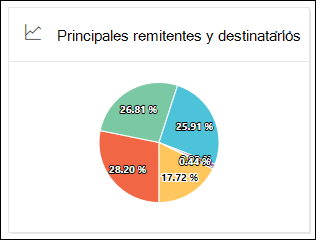

# Ver informes de flujo de correo en el panel Informes del Centro de & cumplimiento

[!INCLUDE [Microsoft 365 Defender rebranding](../includes/microsoft-defender-for-office.md)]

**Se aplica a**
- [Exchange Online Protection](exchange-online-protection-overview.md)
- [Plan 1 y Plan 2 de Microsoft Defender para Office 365](defender-for-office-365.md)
- [Microsoft 365 Defender](../defender/microsoft-365-defender.md)

> [!NOTE]
>
> La mayoría de los informes de este artículo también están disponibles en el portal de Microsoft 365 Defender o en el centro <a href="https://go.microsoft.com/fwlink/p/?linkid=2059104" target="_blank">Exchange administración.</a> Para obtener más información, consulte los siguientes temas:
>
> - [Informes de flujo de correo en el nuevo centro Exchange administración](/exchange/monitoring/mail-flow-reports/mail-flow-reports)
> - [Ver informes de seguridad de correo electrónico en el portal Microsoft 365 Defender correo electrónico](view-email-security-reports.md)

Además de los informes de flujo  de correo que están disponibles en el panel flujo de correo en el Centro de seguridad y cumplimiento de &, hay una variedad de informes de flujo de correo adicionales disponibles en el panel Informes para ayudarle a supervisar su organización Microsoft 365.

Si tiene los permisos [necesarios,](#what-permissions-are-needed-to-view-these-reports)puede ver estos informes en el Centro de seguridad & cumplimiento en el Panel <https://protection.office.com> **de** \> **informes.** Para ir directamente al panel Informes, abra <https://protection.office.com/insightdashboard> .

## Informe del conector

> [!NOTE]
> Este informe se ha reemplazado por el **informe de mensajes entrantes** y el informe de mensajes **salientes** en el EAC. Para obtener más información, vea Mensajes entrantes e informes de mensajes [salientes en el nuevo EAC](/exchange/monitoring/mail-flow-reports/mfr-inbound-messages-and-outbound-messages-reports).

## Exchange de regla de transporte

El **Exchange de regla** de transporte muestra el efecto de las reglas de flujo de correo (también conocidas como reglas de transporte) en los mensajes entrantes y salientes de la organización.

Para ver el informe, abra el Centro de seguridad & cumplimiento en , vaya al Panel de informes y <https://protection.office.com> seleccione Exchange regla de  \>  **transporte**. Para ir directamente al informe, abra <https://security.microsoft.com/reports/ETRRuleReport> .

> [!NOTE]
> Al hacer clic en el widget de este informe en el Centro de seguridad & cumplimiento (protection.office.com) ahora le llevará al informe completo en el portal de Microsoft 365 Defender (security.microsoft.com). Para obtener más información sobre el informe, [vea Exchange de regla de transporte](view-email-security-reports.md#exchange-transport-rule-report).

## Informe de reenvío

> [!NOTE]
> El **informe de reenvío** ya está disponible en el EAC. Para obtener más información, vea Informe de mensajes reenviados [automáticamente en el nuevo EAC](/exchange/monitoring/mail-flow-reports/mfr-auto-forwarded-messages-report).

## Informe de estado de flujo de correo

El **informe de estado de flujo** de correo es similar al informe de correo electrónico enviado y recibido, con información adicional sobre el correo electrónico permitido o bloqueado en el perímetro.  Este es el único informe que contiene información de protección perimetral y muestra cuánto correo electrónico se bloquea antes de que se le permita entrar en el servicio para su evaluación por parte de Exchange Online Protection (EOP). Es importante comprender que si un mensaje se envía a cinco destinatarios, lo contamos como cinco mensajes diferentes y no un mensaje.

Para ver el informe, abra el Centro de  [seguridad & cumplimiento,](https://protection.office.com)vaya al Panel de informes y seleccione Informe de estado de flujo \>  **de correo**. Para ir directamente al informe **de estado de flujo de correo**, abra <https://security.microsoft.com/reports/mailflowStatusReport> .

> [!NOTE]
> Al hacer clic en el widget de este informe en el Centro de seguridad & cumplimiento (protection.office.com) ahora le llevará al informe completo en el portal de Microsoft 365 Defender (security.microsoft.com). Para obtener más información sobre el informe, vea [Mailflow status report](view-email-security-reports.md#mailflow-status-report).

## Informe de correo electrónico enviado y recibido

> [!NOTE]
> Este informe se ha reemplazado por el [informe de estado de flujo de correo](#mailflow-status-report).

## Informe de remitentes y destinatarios principales

The **Top senders and recipients** shows the top messages senders in your organization, as well as the top recipients for messages that were detected by EOP and Defender for Office 365 protection features.

Para ver el informe, abra el Centro de seguridad & cumplimiento en , vaya al Panel de informes y seleccione Principales <https://protection.office.com>  \>  **remitentes y destinatarios.** Para ir directamente al informe, abra una de las siguientes direcciones URL:

- Defender para Office 365:<https://protection.office.com/TopSenderRecipientsATP>
- EOP: <https://protection.office.com/TopSenderRecipients>

> [!NOTE]
> Aunque hacer clic en el widget para este informe en el Centro de seguridad y cumplimiento de & le lleva a una página de protection.office.com, el contenido de la página es del portal de Microsoft 365 Defender web. Para obtener más información sobre el informe, vea [Top senders and recipients report](view-email-security-reports.md#top-senders-and-recipients-report).

## ¿Qué permisos se necesitan para ver estos informes?

Para ver y usar los informes descritos en este artículo, debe ser miembro de uno de los siguientes grupos de roles en el Centro de seguridad & cumplimiento:

- **Administración de organizaciones**
- **Administrador de seguridad**
- **Lector de seguridad**
- **Lector global**

Para obtener más información, vea [Permisos en el Centro de seguridad y cumplimiento](permissions-in-the-security-and-compliance-center.md).

> [!NOTE]
> Agregar usuarios al rol correspondiente de Azure Active Directory en el Centro de administración de Microsoft 365 otorga a los usuarios los permisos necesarios en el Centro de seguridad y cumplimiento _y_ permisos para otras características de Microsoft 365. Para obtener más información, vea [Sobre los roles de administrador](../../admin/add-users/about-admin-roles.md).

## Temas relacionados

[Informes inteligentes y reportes en el Centro de seguridad y cumplimiento](reports-and-insights-in-security-and-compliance.md)

[Reportes de flujo de Correo en el Centro de seguridad y cumplimiento](mail-flow-insights-v2.md)

[Ver informes de seguridad de correo electrónico en el Centro de seguridad y cumplimiento](view-email-security-reports.md)

[Ver informes de Microsoft Defender para Office 365](view-reports-for-mdo.md)
