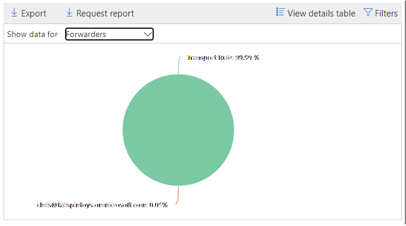

# Ver informes de flujo de correo en el panel Informes del Centro de & cumplimiento

[!INCLUDE [Microsoft 365 Defender rebranding](../includes/microsoft-defender-for-office.md)]

**Se aplica a**
- [Exchange Online Protection](exchange-online-protection-overview.md)
- [Plan 1 y Plan 2 de Microsoft Defender para Office 365](defender-for-office-365.md)
- [Microsoft 365 Defender](../defender/microsoft-365-defender.md)

Además de los informes de flujo  de correo que están disponibles en el panel flujo de correo en el Centro de seguridad y cumplimiento de &, hay una variedad de informes de flujo de correo adicionales disponibles en el panel Informes para ayudarle a supervisar su organización Microsoft 365.

Si tiene los permisos [necesarios,](#what-permissions-are-needed-to-view-these-reports)puede ver estos informes en el Centro de seguridad [& cumplimiento](https://protection.office.com) yendo al **Panel de** \> **informes**. Para ir directamente al panel Informes, abra <https://protection.office.com/insightdashboard> .

## Informe del conector

El **informe connector muestra** la actividad de flujo de correo en los conectores entrantes y [salientes configurados](/Exchange/mail-flow-best-practices/use-connectors-to-configure-mail-flow/use-connectors-to-configure-mail-flow) para la organización.

Para ver el informe, abra el Centro de  [seguridad & cumplimiento,](https://protection.office.com)vaya al Panel \> **de informes** y seleccione **Informe de conector**. Para ir directamente al informe, abra <https://protection.office.com/reportv2?id=ConnectorReport> .

### Vista Informe para el informe de Connector

Los siguientes gráficos están disponibles en la vista informe:

- **Ver datos por: Flujo de correo:** este gráfico muestra el número de mensajes entrantes y salientes organizados por:

  - **Total**
  - **Desde Internet sin conector**
  - **A Internet sin conector**
  - Un conector específico que haya configurado.

  Para aislar los datos del gráfico, use el control **Mostrar datos para** seleccionar una de estas opciones o Todo el flujo de **correo**.

  

- **Ver datos por: uso de TLS:** este gráfico muestra el porcentaje de uso de la versión seguridad de la capa de transporte (TLS) para el flujo de correo.

  Para aislar los datos del gráfico, use el control **Mostrar datos** para seleccionar una de las siguientes opciones:

  - **Todo el flujo de correo**
  - **Desde Internet sin conector**
  - **A Internet sin conector**
  - Un conector específico que haya configurado.

  

Si hace clic **en Filtros** en una vista de informe, puede especificar un intervalo de fechas con Fecha **de inicio** y Fecha **de finalización.**

### Vista de tabla Detalles del informe de Connector

Si hace clic **en Ver tabla de detalles** en una vista de informe, se muestra la siguiente información:

- **Fecha**
- **Dirección y nombre del conector**
- **Tipo de conector**
- **¿TLS forzada?**: El valor **True** o **False**.
- **Sin TLS** (porcentaje)
- **TLS 1.0** (porcentaje)
- **TLS 1.1** (porcentaje)
- **TLS 1.2** (porcentaje)
- **Volumen:** el número de mensajes.

Si hace clic **en Filtros en** una vista de tabla de detalles, puede especificar un intervalo de fechas con Fecha de **inicio** y Fecha **de finalización.**

Para volver a la vista informe, haga clic **en Ver informe**.

## Exchange de regla de transporte

El **Exchange de regla** de transporte muestra el efecto de las reglas de flujo de correo (también conocidas como reglas de transporte) en los mensajes entrantes y salientes de la organización.

Para ver el informe, abra el Centro de  [seguridad & cumplimiento,](https://protection.office.com)vaya al Panel de informes y seleccione Exchange \>  **de transporte**. Para ir directamente al informe, abra <https://protection.office.com/reportv2?id=ETRRuleReport> .

### Vista Informe para el informe Exchange regla de transporte

Los siguientes gráficos están disponibles en la vista informe:

- **Ver datos por: Exchange de transporte** \> **Dividir por: Dirección:** este gráfico  muestra  el número de mensajes entrantes y salientes que se vieron afectados por las reglas de transporte.

- **Ver datos por: Exchange de transporte** \> **Dividir por: Gravedad:** este gráfico muestra  el número de mensajes de gravedad alta y media y **de gravedad** baja. El nivel de gravedad se establece como una acción en la regla (**Auditar** esta regla con el nivel de gravedad o _SetAuditSeverity_). Para obtener más información, vea [Acciones de regla de flujo de correo en Exchange Online](//Exchange/security-and-compliance/mail-flow-rules/mail-flow-rule-actions).

- **Ver datos por: DLP Exchange de transporte** \> **Dividir por: Dirección:** este gráfico  muestra  el número de mensajes entrantes y salientes que se vieron afectados por las reglas de transporte de prevención de pérdida de datos (DLP). Puede refinar aún más el gráfico seleccionando una de las siguientes opciones:

  - **Mostrar datos para: todas las reglas de transporte DLP**
  - **Mostrar datos para: usuarios en peligro**
  - **Mostrar datos para: Bajo volumen de contenido detectado por la Ley Patriota de EE.UU.**

- **Ver datos por: DLP Exchange de transporte** \> **Dividir por: Dirección:** esta vista muestra el número de mensajes  de gravedad alta y media y de gravedad baja que se vieron afectados por las reglas de transporte DLP.  Puede refinar aún más el gráfico seleccionando una de las siguientes opciones:

  - **Mostrar datos para: todas las reglas de transporte DLP**
  - **Mostrar datos para: usuarios en peligro**
  - **Mostrar datos para: Bajo volumen de contenido detectado por la Ley Patriota de EE.UU.**

Si hace clic **en Filtros** en una vista de informe, puede modificar los resultados con los siguientes filtros::

- **Fecha de inicio** y **fecha de finalización**
- Valores de dirección
- Valores de gravedad

### Vista de tabla de detalles para el informe Exchange regla de transporte

Si hace clic **en Ver tabla de detalles,** la información que se muestra depende del gráfico que estaba mirando:

- **Ver datos por: Exchange de transporte :**

  - **Fecha**
  - **Regla de transporte**
  - **Asunto**
  - **Dirección del remitente**
  - **Dirección de destinatario**
  - **Gravedad**
  - **Dirección**

- **Ver datos por: DLP Exchange de transporte:**

  - **Fecha**
  - **Directiva DLP**
  - **Regla de transporte**
  - **Asunto**
  - **Dirección del remitente**
  - **Dirección de destinatario**
  - **Gravedad**
  - **Dirección**

Si hace clic **en Filtros en** una vista de tabla de detalles, puede modificar los resultados con los filtros siguientes:

- **Fecha de inicio** y **fecha de finalización**
- Valores de dirección
- Valores de gravedad

Para volver a la vista informe, haga clic **en Ver informe**.

## Informe de reenvío

El **informe de reenvío** muestra los mensajes reenviados automáticamente a dominios externos desde Exchange Online buzones de correo. Los mensajes reenviados pueden suponer un riesgo de seguridad o cumplimiento, e indicar una cuenta comprometida.

Para ver el informe, abra el Centro de  [seguridad & cumplimiento,](https://protection.office.com)vaya al Panel de informes y seleccione \>  **Reenviar informe**. Para ir directamente al informe, abra <https://protection.office.com/reportv2?id=MailFlowForwarding> .

### Vista Informe para el informe de reenvío

Los gráficos siguientes están disponibles en la vista informe:

- **Mostrar datos para: Métodos de reenvío:** se muestran los siguientes métodos:

  - **Regla de transporte:** también conocida como reglas [de flujo de correo](/Exchange/security-and-compliance/mail-flow-rules/mail-flow-rules).
  - **Regla de buzón:** también conocida como [reglas de bandeja de entrada](https://support.microsoft.com/office/c24f5dea-9465-4df4-ad17-a50704d66c59).

  

- **Mostrar datos para: Dominios de reenvío:** esta vista muestra los dominios de destinatario que son los destinos para el reenvío.

  

- **Mostrar datos para: Reenviadores:** se muestran los siguientes reenviadores:

  - **Regla de transporte**
  - El buzón que contiene la regla de la Bandeja de entrada de reenvío.

  

Si hace clic **en Filtros** en una vista de informe, puede especificar un intervalo de fechas con Fecha **de inicio** y Fecha **de finalización.**

### Vista de tabla Detalles del informe de reenvío

Si hace clic **en Ver tabla de detalles** en una vista de informe, se muestra la siguiente información:

- **Reenviadores:** la regla **de transporte** de valor o el buzón que contiene la regla de la Bandeja de entrada de reenvío.
- **Tipo de reenvío:** la regla **de buzón de correo** de valor o la regla de **transporte**.
- **Nombre de destinatario**
- **Dominio del destinatario**
- **Detalles:** este es el valor GUID de la regla de flujo de correo o el valor RuleIdentity de la regla Bandeja de entrada.
- **Count**
- **Primera fecha de reenvío**

Si hace clic **en Filtros en** una vista de tabla de detalles, puede especificar un intervalo de fechas con Fecha de **inicio** y Fecha **de finalización.**

Para volver a la vista informes, haga clic **en Ver informe**.

## Informe de estado de flujo de correo

El **informe de estado de flujo** de correo es similar al informe de correo electrónico enviado y recibido, con información adicional sobre el correo electrónico permitido o bloqueado en el perímetro.  Este es el único informe que contiene información de protección perimetral y muestra cuánto correo electrónico se bloquea antes de que se le permita entrar en el servicio para su evaluación por parte de Exchange Online Protection (EOP). Es importante comprender que si un mensaje se envía a cinco destinatarios, lo contamos como cinco mensajes diferentes y no un mensaje.
Para ver el informe, abra el Centro de  [seguridad & cumplimiento,](https://protection.office.com)vaya al Panel de informes y seleccione Informe de estado de flujo \>  **de correo**. Para ir directamente al informe **de estado de flujo de correo**, abra <https://protection.office.com/mailflowStatusReport> .

### Vista de tipo para el informe de estado de flujo de correo

Al abrir el informe, la **pestaña Tipo** está seleccionada de forma predeterminada. De forma predeterminada, esta vista contiene un gráfico y una tabla de datos configurada con los filtros siguientes:

- **Fecha:** los últimos 7 días.
- **Dirección**:

  - **Entrante**
  - **Saliente**
  - **Intra-org:** este recuento es para mensajes dentro de un espacio empresarial, es decir, sender abc@domain.com al destinatario xyz@domain.com (se cuenta por separado de **Entrante** y **Saliente**)

- **Tipo**:

  - **Correo bueno**
  - **Malware**
  - **Correo no deseado**
  - **Protección perimetral**
  - **Mensajes de regla**
  - **Correo de suplantación de identidad**

El gráfico está organizado por los **valores Type.**

Puede cambiar estos filtros haciendo clic en **Filtrar** o haciendo clic en un valor de la leyenda del gráfico.

La tabla de datos contiene la siguiente información:

- **Dirección**
- **Tipo**
- **24 horas**
- **3 días**
- **7 días**
- **15 días**
- **30 días**

Si hace clic **en Elegir una categoría para obtener más información,** puede seleccionar entre los siguientes valores:

- **Correo electrónico de suplantación** de identidad : esta selección le lleva al informe [de estado de protección contra amenazas](view-email-security-reports.md#threat-protection-status-report).
- **Malware en el correo** electrónico: esta selección le lleva al informe [de estado de protección contra amenazas](view-email-security-reports.md#threat-protection-status-report).
- **Detecciones de correo** no deseado: esta selección le lleva al informe [Detecciones de correo no deseado](view-email-security-reports.md#spam-detections-report).
- **Correo no deseado bloqueado** perimetral: esta selección le lleva al informe [Detecciones de correo no deseado](view-email-security-reports.md#spam-detections-report).

**Exportar**:

Para la vista de detalles, solo puede exportar datos durante un día. Por lo tanto, si desea exportar datos durante 7 días, debe realizar 7 acciones de exportación diferentes.

Cada archivo .csv exportada está limitado a 150 000 filas. Si los datos de ese día contienen más de 150.000 filas, se crearán varios .csv archivos.

### Vista Dirección del informe de estado de flujo de correo

Si hace clic en la **pestaña Dirección,** se usan los mismos filtros predeterminados de la **vista** Tipo.

El gráfico está organizado por valores **direction.**

Puede cambiar estos filtros haciendo clic en **Filtrar** o haciendo clic en un valor de la leyenda del gráfico. Se usan los mismos filtros de **la vista** Tipo.

La tabla de datos contiene la misma información de la **vista** Tipo.

La **categoría Elegir una categoría para obtener más detalles** sobre las selecciones y el comportamiento disponibles son los mismos que la **vista** Tipo.

**Exportar**:

Para la vista de detalles, solo puede exportar datos durante un día. Por lo tanto, si desea exportar datos durante 7 días, debe realizar 7 acciones de exportación diferentes.

Cada archivo .csv exportada está limitado a 150 000 filas. Si los datos de ese día contienen más de 150.000 filas, se crearán varios .csv archivos.

### Vista embudo para el informe de estado de flujo de correo

La **vista Embudo** muestra cómo las características de protección contra amenazas de correo electrónico de Microsoft filtran el correo electrónico entrante y saliente en su organización. Proporciona detalles sobre el recuento total de correo electrónico y cómo afectan a este recuento las características de protección contra amenazas configuradas, como la protección perimetral, el antimalware, la suplantación de identidad (phishing), el correo no deseado y la suplantación de identidad.

Si hace clic en la **pestaña Embudo,** de forma predeterminada, esta vista contiene un gráfico y una tabla de datos configurada con los filtros siguientes:

- **Fecha:** los últimos 7 días.

- **Dirección**:

  - **Entrante**
  - **Saliente**
  - **Intra-org:** este recuento es para los mensajes enviados dentro de un espacio empresarial; Es decir, el remitente abc@domain.com al destinatario xyz@domain.com (se cuenta por separado de Entrante y Saliente).

La vista de agregado y la vista de tabla de datos permiten 90 días de filtrado.

Si hace clic **en Filtrar,** puede filtrar tanto el gráfico como la tabla de datos.

Este gráfico muestra el recuento de correo electrónico organizado por:

- **Correo electrónico total**
- **Correo electrónico después de la protección perimetral**
- **Correo electrónico después de antimalware, reputación de archivo, bloqueo de tipo de archivo**
- **Correo electrónico después de anti phish, reputación url, suplantación de marca, anti suplantación de identidad**
- **Correo electrónico después de correo no deseado, filtrado masivo de correo**
- **Correo electrónico después de la suplantación de usuario y dominio**1
- **Email after file and URL detonation**1
- **Correo electrónico detectado como benigno después de la protección posterior a la entrega (url click time protection)**

1 Defender para Office 365 solo

Para ver el correo electrónico filtrado por EOP o Defender Office 365 por separado, haga clic en el valor de la leyenda del gráfico.

La tabla de datos contiene la siguiente información, que se muestra en orden de fecha descendente:

- **Fecha**
- **Correo electrónico total**
- **Protección perimetral**
- **Antimalware, reputación de archivo, bloque de tipo de archivo:**
  - **Reputación del archivo:** mensajes filtrados debido a la identificación de un archivo adjunto por otros clientes de Microsoft.
  - **Bloque de tipo de** archivo: mensajes filtrados debido al tipo de archivo malintencionado identificado en el mensaje.
- **Anti-phish, reputación url, suplantación de marca, suplantación de identidad:**
  - **Reputación de la dirección URL:** mensajes filtrados debido a la identificación de la dirección URL por otros clientes de Microsoft.
  - **Suplantación de marca:** mensajes filtrados debido al mensaje procedente de remitentes de suplantación de marca conocidos.
  - **Anti-spoof:** mensajes filtrados debido a que el mensaje intenta suplantar un dominio al que pertenece el destinatario o un dominio que el remitente del mensaje no posee.
- **Antispam, filtrado masivo de correo:**
  - **Filtrado masivo de correo:** mensajes filtrados debido a un intento de entregar correo masivo a sus destinatarios.
- **Suplantación de usuario y dominio (Defender para Office 365):**
  - Suplantación de **usuario:** mensajes filtrados debido a un intento de suplantar a un usuario (remitente de mensajes) que se define en la configuración de protección de suplantación de una directiva contra suplantación.
  - **Suplantación** de dominio: mensajes filtrados debido a un intento de suplantar un dominio definido en la configuración de protección de suplantación de una directiva contra suplantación.
- **Detonación de archivos y direcciones URL (Defender para Office 365):**
  - **Detonación de archivos:** mensajes filtrados por una directiva Caja fuerte datos adjuntos.
  - **Detonación de dirección URL:** mensaje filtrado por una directiva Caja fuerte vínculos.
- **Protección posterior a la entrega y ZAP (ATP) o ZAP (EOP):** ZAP indica la purga automática de cero horas.

Si selecciona una fila en la tabla de datos, se muestra un desglose adicional de los recuentos de correo electrónico en el menú desplegable.

**Exportar**:

Después de hacer **clic en Exportar** en **Opciones,** puede seleccionar uno de los siguientes valores:

- **Resumen (con datos de los últimos 90 días como máximo)**
- **Detalles (con datos de los últimos 30 días como máximo)**

En **Fecha**, elija un rango y, a continuación, haga clic **en Aplicar**. Los datos de los filtros actuales se exportarán a un .csv archivo.

Cada archivo .csv exportada está limitado a 150 000 filas. Si los datos contienen más de 150 000 filas, se crearán varios .csv archivos.

 

### Vista técnica del informe de estado del flujo de correo

La **vista Tech es** similar a la vista **Embudo,** lo que proporciona más detalles pormenorizados para las características de protección contra amenazas configuradas. En el gráfico, puede ver cómo se clasifican los mensajes en las distintas etapas de protección contra amenazas.

Si hace clic en la **pestaña Vista técnica,** de forma predeterminada, esta vista contiene un gráfico y una tabla de datos configurada con los filtros siguientes:

- **Fecha:** los últimos 7 días.

- **Dirección**:

  - **Entrante**
  - **Saliente**
  - **Intra-org:** este recuento es para mensajes dentro de un espacio empresarial, es decir, remitente abc@domain.com al destinatario xyz@domain.com (se cuenta por separado de Entrante y Saliente)

La vista de agregado y la vista de tabla de datos permiten 90 días de filtrado.

Si hace clic **en Filtrar,** puede filtrar tanto el gráfico como la tabla de datos.

En este gráfico se muestran los mensajes organizados en las siguientes categorías:

- **Correo electrónico total**
- **Edge allow** y **Edge filtered**
- **No malware**, **Caja fuerte attachments detection**, \* **Anti-malware engine detection** y Rule **messages**
- **No phish**, **error DMARC,** **detección de suplantación,** detección **de suplantación** y detección **de suplantación** de identidad
- **No hay detección con detonación de dirección URL** y **detonación de url**\*
- **No correo no** deseado y  **correo no deseado**
- **Correo electrónico no malintencionado,** **Caja fuerte de detección de vínculos y** \* **ZAP**

\*Defender para Office 365

Al pasar el mouse sobre una categoría del gráfico, puede ver el número de mensajes de esa categoría.

La tabla de datos contiene la siguiente información, que se muestra en orden de fecha descendente:

- **Fecha**
- **Correo electrónico total**
- **Perímetro filtrado**
- **Motor antimalware, Caja fuerte datos adjuntos, regla filtrada:**
  - **Regla filtrada:** mensajes filtrados debido a reglas de flujo de correo (también conocidas como reglas de transporte).
- **DMARC, suplantación, suplantación, suplantación de identidad filtrada:**
  - **DMARC:** mensajes filtrados debido a que el mensaje no ha fallado en la comprobación de autenticación de DMARC.
- **Detección de detonación de url**
- **Filtrado contra correo no deseado**
- **ZAP quitado**
- **Detección por Caja fuerte vínculos**

Si selecciona una fila en la tabla de datos, se muestra un desglose adicional de los recuentos de correo electrónico en el menú desplegable.

**Exportar**:

Al hacer **clic en** Exportar , en **Opciones,** puede seleccionar uno de los siguientes valores:

- **Resumen (con datos de los últimos 90 días como máximo)**
- **Detalles (con datos de los últimos 30 días como máximo)**

En **Fecha**, elija un rango y, a continuación, haga clic **en Aplicar**. Los datos de los filtros actuales se exportarán a un .csv archivo.

Cada archivo .csv exportada está limitado a 150 000 filas. Si los datos contienen más de 150 000 filas, se crearán varios .csv archivos.

 

## Informe de correo electrónico enviado y recibido

El **informe de correo electrónico** enviado y recibido es un informe inteligente que muestra información sobre el correo electrónico entrante y saliente, incluidas detecciones de correo no deseado, malware y correo electrónico identificado como "bueno". La diferencia entre este informe y el informe de estado [de flujo](#mailflow-status-report) de correo es: este informe no incluye datos sobre los mensajes bloqueados por la protección perimetral. Es importante comprender que si un mensaje se envía a cinco destinatarios, lo contamos como un mensaje.

La vista de agregado y la vista de detalles del informe permiten 90 días de filtrado.

Para ver el informe, abra el Centro de  [seguridad & cumplimiento,](https://protection.office.com)vaya al Panel de informes y seleccione Correo electrónico enviado \>  y **recibido.** Para ir directamente al informe, abra <https://protection.office.com/reportv2?id=SentAndReceivedMailATP> .

### Vista Informe para el informe de correo electrónico enviado y recibido

Los gráficos siguientes están disponibles en la vista informe:

- **Dividir por: Tipo**: El gráfico muestra todas las categorías disponibles:

  - **Total**
  - **Correo bueno**
  - **Malware (antimalware)** (EOP)
  - **Detecciones de correo no deseado**
  - **Mensajes de regla**
  - **Malware avanzado** (Microsoft Defender para Office 365)

  Cuando mantiene el mouse sobre un día (punto de datos) en el gráfico, puede ver los detalles de ese día.

  

- **Dividir por: Dirección:** el gráfico muestra **datos totales,** **entrantes** **y salientes.** Cuando mantiene el mouse sobre un día (punto de datos) en el gráfico, puede ver los detalles de ese día.

  

- **Explorar en profundidad** \> **Malware (antimalware):** esta selección le lleva a las detecciones [de malware en el informe de correo electrónico](view-email-security-reports.md#malware-detections-in-email-report).

- **Explorar en profundidad** \> **Detecciones de correo** no deseado): esta selección le lleva al informe Detecciones [de correo no deseado](view-email-security-reports.md#spam-detections-report).

Si hace clic **en Filtros** en una vista de informe, puede modificar los resultados con los filtros siguientes:

- **Fecha de inicio** y **fecha de finalización**
- Valores de dirección
- Valores de tipo

Para volver a la vista informe, haga clic **en Ver informe**.

### Vista de tabla De detalles para el informe de correo electrónico enviado y recibido

Si hace clic **en Ver tabla de detalles** en la vista Dividir **por:** Dirección o Dividir **por: Dirección,** se muestra la siguiente información:

- **Fecha (UTC)**
- **Tipo**
- **Dirección**
- **Recuento de mensajes**

Si hace clic **en Filtros en** una vista de tabla de detalles, puede modificar los resultados con los filtros siguientes:

- **Fecha de inicio** y **fecha de finalización**
- Valores de dirección
- Valores de tipo

Para volver a la vista informe, haga clic **en Ver informe**.

## Informe de remitentes y destinatarios principales

El **informe Principales remitentes y destinatarios** es un gráfico circular que muestra los principales remitentes y destinatarios de correo electrónico.

Para ver el informe, abra el Centro de  [seguridad & cumplimiento,](https://protection.office.com)vaya al Panel de informes y seleccione Principales \>  **remitentes y destinatarios.** Para ir directamente al informe, abra <https://protection.office.com/reportv2?id=TopSenderRecipientsATP> .

### Vista Informe para el informe de destinatarios y remitentes principales

Los gráficos siguientes están disponibles en la vista informe:

- **Mostrar datos para \> los principales remitentes de correo**
- **Mostrar datos para \> los principales destinatarios de correo**
- **Mostrar datos para los \> principales destinatarios de correo no deseado**
- **Mostrar datos para \> Principales destinatarios de malware** (EOP)
- **Mostrar datos para \> los destinatarios principales de malware (Defender para Office 365)**

La composición del gráfico circular cambia en función de estas selecciones.

Al pasar el mouse sobre una cuña en el gráfico circular, puede ver un recuento de mensajes enviados o recibidos.

Si hace clic **en Filtros** en una vista de informe, puede especificar un intervalo de fechas con Fecha **de inicio** y Fecha **de finalización.**

### Vista de tabla Detalles para el informe de destinatarios y remitentes principales

Si hace clic **en Ver tabla de detalles,** la información que se muestra depende del gráfico que estaba mirando:

- **Mostrar datos para \> los principales remitentes de correo**

  - **Principales remitentes de correo**
  - **Count**

- **Mostrar datos para \> los principales destinatarios de correo**

  - **Principales destinatarios de correo**
  - **Count**

- **Mostrar datos para los \> principales destinatarios de correo no deseado**

  - **Principales destinatarios de correo no deseado**
  - **Count**

- **Mostrar datos para \> Principales destinatarios de malware** (EOP)

  - **Principales destinatarios de malware**
  - **Count**

- **Mostrar datos para \> los destinatarios principales de malware (Defender para Office 365)**

  - **Principales destinatarios de malware (Defender para Office 365)**
  - **Count**

Si hace clic **en Filtros en** una vista de tabla de detalles, puede especificar un intervalo de fechas con Fecha de **inicio** y Fecha **de finalización.**

Para volver a la vista informe, haga clic **en Ver informe**.

## ¿Qué permisos se necesitan para ver estos informes?

Para ver y usar los informes descritos en este artículo, debe ser miembro de uno de los siguientes grupos de roles en el Centro de seguridad & cumplimiento:

- **Administración de organizaciones**
- **Administrador de seguridad**
- **Lector de seguridad**
- **Lector global**

Para obtener más información, vea [Permisos en el Centro de seguridad y cumplimiento](permissions-in-the-security-and-compliance-center.md).

> [!NOTE]
> Agregar usuarios al rol correspondiente de Azure Active Directory en el Centro de administración de Microsoft 365 otorga a los usuarios los permisos necesarios en el Centro de seguridad y cumplimiento _y_ permisos para otras características de Microsoft 365. Para obtener más información, vea [Sobre los roles de administrador](../../admin/add-users/about-admin-roles.md).

## Temas relacionados

[Informes inteligentes y reportes en el Centro de seguridad y cumplimiento](reports-and-insights-in-security-and-compliance.md)

[Reportes de flujo de Correo en el Centro de seguridad y cumplimiento](mail-flow-insights-v2.md)

[Ver informes de seguridad de correo electrónico en el Centro de seguridad y cumplimiento](view-email-security-reports.md)

[Ver informes de Microsoft Defender para Office 365](view-reports-for-mdo.md)
