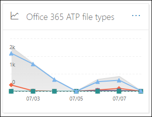
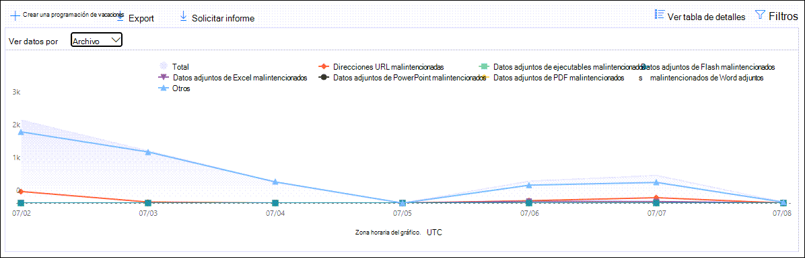
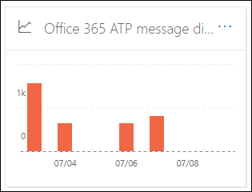
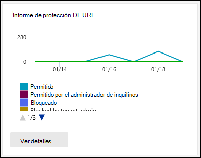
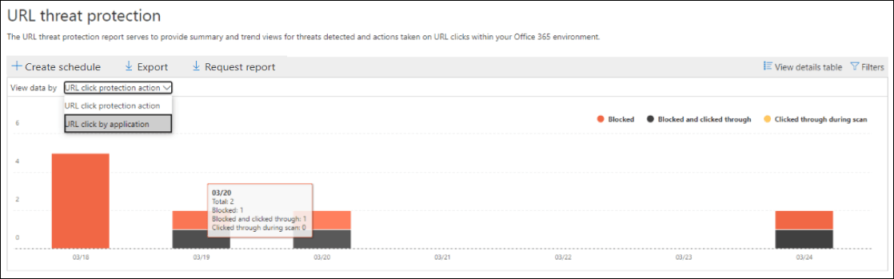

# Ver informes para la protección contra amenazas avanzada de Office 365

Las organizaciones de protección contra amenazas avanzada (ATP) de Office 365 (por ejemplo, las suscripciones de Microsoft 365 E5 o el plan de ATP 1 o ATP del plan 2) contienen una variedad de informes relacionados con la seguridad. Si dispone de los [permisos necesarios](#what-permissions-are-needed-to-view-the-atp-reports), puede ver estos informes en el centro de seguridad & cumplimiento desde el panel de **informes** \> **Dashboard**. Para ir directamente al panel informes, Abra <https://protection.office.com/insightdashboard> .

## Informe de tipos de archivos de Protección contra amenazas avanzada

El informe de **tipos de archivo de protección contra amenazas avanzada** muestra el tipo de archivos que los [datos adjuntos seguros de ATP](atp-safe-attachments.md)han detectado como malintencionados.

 La vista agregada del informe permite 90 días de filtrado, mientras que la vista de detalles solo permite 10 días de filtrado.

Para ver el informe, abra el [centro de seguridad & cumplimiento](https://protection.office.com), vaya **Reports** al \> **Panel** informes y seleccione **tipos de archivo ATP de Office**. Para ir directamente al informe, Abra <https://protection.office.com/reportv2?id=ATPFileReport> .

> [!NOTE]
> La información de este informe también está disponible en el [Informe de disposición de mensajes de protección contra amenazas avanzada](#advanced-threat-protection-message-disposition-report).

### Vista informes para el informe de tipos de archivo de protección contra amenazas avanzada

Están disponibles las siguientes vistas:

- **Ver datos por: archivo**: el gráfico contiene la siguiente información:

  - **Datos adjuntos de Excel malintencionados**
  - **Datos adjuntos de Flash malintencionados**
  - **Datos adjuntos de PDF malintencionados**
  - **Datos adjuntos de PowerPoint malintencionados**
  - **Direcciones URL malintencionadas**
  - **Datos adjuntos de Word malintencionado**
  - **Datos adjuntos ejecutables malintencionados**
  - **Otros**

  Cuando desplaza el puntero sobre un día concreto (punto de datos), puede ver el desglose de los tipos de archivos malintencionados detectados por los [datos adjuntos seguros de ATP](atp-safe-attachments.md) y la [protección antimalware en EOP](anti-malware-protection.md).

  

  Si hace clic en **filtros**, puede modificar el informe con los siguientes filtros:

  - **Fecha de inicio** y **fecha de finalización**
  - Los mismos valores de tipo de archivo que están visibles en el gráfico.

- **Ver datos por: mensaje**: el gráfico contiene la siguiente información:

  - **Bloquear acceso**
  - **Mensajes reemplazados**
  - **Mensajes supervisados**
  - **Reemplazado por la entrega de correo electrónico dinámica**: para obtener más información, vea [entrega dinámica y vista previa con datos adjuntos seguros de ATP](dynamic-delivery-and-previewing.md).

  

  Si hace clic en **filtros**, puede modificar el informe con los siguientes filtros:

  - **Fecha de inicio** y **fecha de finalización**
  - Los mismos valores de disposición de mensajes que están disponibles en el gráfico y el valor de mensajes adicionales que se **pasan** .

### Vista de tabla de detalles para el informe de tipos de archivo de protección contra amenazas avanzada

Si hace clic en **ver tabla de detalles**, el informe proporciona una vista casi en tiempo real de todos los clics que ocurren dentro de la organización durante los últimos 10 días. La información que se muestra depende del gráfico que estaba viendo:

- **Ver datos por: archivo**:

  - **Fecha**
  - **Dirección del destinatario**
  - **Dirección del remitente**
  - **Identificador del mensaje**: disponible en el campo de encabezado del **identificador del mensaje** en el encabezado del mensaje y debe ser único. Un valor de ejemplo es `<08f1e0f6806a47b4ac103961109ae6ef@server.domain>` (observe los corchetes angulares).
  - **Archivo**

  Si hace clic en **filtros**, puede modificar el informe con los siguientes filtros:

  - **Fecha de inicio** y **fecha de finalización**
  - Los mismos valores de tipo de archivo que están visibles en el gráfico.

- **Ver datos por: mensaje**:

  - **Fecha**
  - **Dirección del destinatario**
  - **Dirección del remitente**
  - **Id. de mensaje**
  - **Archivo**
  - **Asunto**

  Si hace clic en **filtros**, puede modificar los resultados con los siguientes filtros:

  - **Fecha de inicio** y **fecha de finalización**
  - Los mismos valores de disposición de mensajes que están disponibles en el gráfico y el valor de mensajes adicionales que se **pasan** .

Para volver a la vista informes, haga clic en **Ver informe**.

## Informe de eliminación de mensajes de Protección contra amenazas avanzada

El informe de **disposición de mensajes de ATP** muestra las acciones que se tomaron para los mensajes de correo electrónico que se detectaron con contenido malintencionado.

Para ver el informe, abra el [centro de seguridad & cumplimiento](https://protection.office.com), vaya **Reports** al \> **Panel** informes y seleccione **disposición de mensajes ATP de Office**. Para ir directamente al informe, Abra <https://protection.office.com/reportv2?id=ATPMessageReport> .

> [!NOTE]
> La información de este informe también está disponible en el [Informe de tipos de archivo de protección contra amenazas avanzada](#advanced-threat-protection-file-types-report).

### Vista informes para el informe de disposición de mensajes de protección contra amenazas avanzada

Están disponibles las siguientes vistas:

- **Ver datos por: mensaje**: el gráfico contiene la siguiente información:

  - **Bloquear acceso**
  - **Mensajes reemplazados**
  - **Mensajes supervisados**
  - **Reemplazado por la entrega de correo electrónico dinámica**: para obtener más información, vea [entrega dinámica y vista previa con datos adjuntos seguros de ATP](dynamic-delivery-and-previewing.md).

  

  Si hace clic en **filtros**, puede modificar el informe con los siguientes filtros:

  - **Fecha de inicio** y **fecha de finalización**
  - Los mismos valores de disposición de mensajes que están disponibles en el gráfico y el valor de mensajes adicionales que se **pasan** .

- **Ver datos por: archivo**: el gráfico contiene la siguiente información:

  - **Datos adjuntos de Excel malintencionados**
  - **Datos adjuntos de Flash malintencionados**
  - **Datos adjuntos de PDF malintencionados**
  - **Datos adjuntos de PowerPoint malintencionados**
  - **Direcciones URL malintencionadas**
  - **Datos adjuntos de Word malintencionado**
  - **Datos adjuntos ejecutables malintencionados**
  - **Otros**

  Cuando desplaza el puntero sobre un día concreto (punto de datos), puede ver el desglose de los tipos de archivos malintencionados detectados por los [datos adjuntos seguros de ATP](atp-safe-attachments.md) y la [protección antimalware en EOP](anti-malware-protection.md).

  

  Si hace clic en **filtros**, puede modificar el informe con los siguientes filtros:

  - **Fecha de inicio** y **fecha de finalización**
  - Los mismos valores de tipo de archivo que están visibles en el gráfico.

### Vista de tabla de detalles para el informe de disposición de mensajes de protección contra amenazas avanzada

Si hace clic en **ver tabla de detalles**, el informe proporciona una vista casi en tiempo real de todos los clics que ocurren dentro de la organización durante los últimos 10 días. La información que se muestra depende del gráfico que estaba viendo:

- **Ver datos por: mensaje**:

  - **Fecha**
  - **Dirección del destinatario**
  - **Dirección del remitente**
  - **Id. de mensaje**
  - **Archivo**
  - **Asunto**

  Si hace clic en **filtros**, puede modificar los resultados con los siguientes filtros:

  - **Fecha de inicio** y **fecha de finalización**
  - Los mismos valores de disposición de mensajes que están disponibles en el gráfico y el valor de mensajes adicionales que se **pasan** .

- **Ver datos por: archivo**:

  - **Fecha**
  - **Dirección del destinatario**
  - **Dirección del remitente**
  - **Id. de mensaje**
  - **Archivo**

  Si hace clic en **filtros**, puede modificar el informe con los siguientes filtros:

  - **Fecha de inicio** y **fecha de finalización**
  - Los mismos valores de tipo de archivo que están visibles en el gráfico.

Para volver a la vista informes, haga clic en **Ver informe**.

## Informe de estado de protección contra amenazas

El informe de **Estado de protección contra amenazas** es una vista única que reúne información sobre contenido malintencionado y correo electrónico malintencionado detectado y bloqueado por [Exchange Online Protection](exchange-online-protection-overview.md) (EOP) y Office 365 ATP. Para obtener más información, consulte [Informe de estado de protección contra amenazas](view-email-security-reports.md#threat-protection-status-report).

## Informe de protección contra amenazas de URL

El **Informe de protección contra amenazas de direcciones URL** proporciona vistas de Resumen y tendencias para las amenazas detectadas y las acciones tomadas en los clics de direcciones URL como parte de los [vínculos seguros ATP](atp-safe-links.md). Este informe no tendrá hacer clic en datos de usuarios en los que la Directiva de vínculos seguros aplicada tiene seleccionada la opción no hacer **un seguimiento de los clics del usuario** .

Para ver el informe, abra el [centro de seguridad & cumplimiento](https://protection.office.com), vaya a **informes** de \> **Panel** y seleccione **Informe de protección de URL**. Para ir directamente al informe, Abra <https://protection.office.com/reportv2?id=URLProtectionActionReport> .

> [!NOTE]
> Se trata de un *Informe de tendencias de protección*, lo que significa que los datos representan tendencias en un conjunto de datos más grande. Como resultado, los datos de la vista de agregado no están disponibles en tiempo real aquí, pero los datos de la vista de tabla de detalles son, por lo que es posible que vea una ligera diferencia entre las dos vistas.

### Vista informes para el informe de protección contra amenazas de direcciones URL

El informe de **protección contra amenazas de direcciones URL** tiene dos vistas agregadas que se actualizan una vez cada cuatro horas que muestra datos para los últimos 90 días:

- **Hacer clic en dirección URL acción de protección**: muestra el número de clics de direcciones URL por parte de los usuarios de la organización y los resultados del clic:

  - **Bloqueado** (se ha bloqueado al usuario para que navegue a la dirección URL)
  - **Bloqueado y clic en**
  - **Clic durante el examen**

  Un clic indica que el usuario ha acpulsado a través de la página de bloque al sitio Web malintencionado (los administradores pueden deshabilitar el clic en las directivas de vínculos a prueba de errores).

  Si hace clic en **filtros**, puede modificar el informe con los siguientes filtros:

  - **Fecha de inicio** y **fecha de finalización**
  - Las acciones de clic en protección disponibles, más el valor **permitido** (el usuario tuvo permiso para navegar a la dirección URL).

  

- **Dirección URL haga clic en por aplicación**: muestra el número de clics de direcciones URL por aplicaciones compatibles con Office 365 ATP vínculos seguros:

  - **Cliente de correo electrónico**
  - **PowerPoint**
  - **Word**
  - **Excel**
  - **OneNote**
  - **Visio**
  - **Teams**
  - **Otros**

  Si hace clic en **filtros**, puede modificar el informe con los siguientes filtros:

  - **Fecha de inicio** y **fecha de finalización**
  - Las aplicaciones disponibles.

### Vista de tabla de detalles para el informe de protección contra amenazas de direcciones URL

Si hace clic en **ver tabla de detalles**, el informe proporciona una vista casi en tiempo real de todos los clics que ocurren dentro de la organización en los últimos 7 días con los siguientes detalles:

- **Haga clic en hora**
- **User**
- **URL**
- **Acción**
- **App**

Si hace clic en **filtros** en la vista de tabla de detalles, puede filtrar por los mismos criterios que en la vista de informe y también por **dominios** o **destinatarios** separados por comas.

Para volver a la vista informes, haga clic en **Ver informe**.

## Informes adicionales para ver

Además de los informes de ATP descritos en este tema, hay disponibles varios informes más, como se describe en la tabla siguiente:

|Informe|Tema|
|---|---|
|**Explorador** (ATP plan 2) o **detecciones en tiempo real** (plan de ATP 1)|[Explorador de amenazas (y detecciones en tiempo real)](threat-explorer.md)|
|**Informes de seguridad de correo electrónico**, como el informe de remitentes y destinatarios principales, el informe de correo falsificado y el informe de detecciones de correo no deseado.|[Ver informes de seguridad de correo electrónico en el Centro de seguridad y cumplimiento](view-email-security-reports.md)|
|**Informes de flujo de correo**, como el informe de reenvío, el informe de estado de flujo de correo y el informe de remitentes y destinatarios principales.|[Ver informes de flujo de correo en el centro de seguridad & cumplimiento](view-mail-flow-reports.md)|
|**Seguimiento de dirección URL para vínculos seguros ATP** (solo PowerShell). El resultado de este cmdlet muestra los resultados de las acciones de vínculos seguros de ATP en los últimos siete días.|[Get-UrlTrace](https://docs.microsoft.com/powershell/module/exchange/get-urltrace)|
|**Resultados del tráfico de correo para EOP y ATP** (solo PowerShell). El resultado de este cmdlet contiene información sobre el dominio, la fecha, el tipo de evento, la dirección, la acción y el recuento de mensajes.|[Get-MailTrafficATPReport](https://docs.microsoft.com/powershell/module/exchange/get-mailtrafficatpreport)    |
|**Informes de detalles de correo para detecciones de EOP y ATP** (solo PowerShell). El resultado de este cmdlet contiene detalles sobre archivos malintencionados o direcciones URL, intentos de suplantación de identidad (phishing), suplantación y otras amenazas potenciales en el correo electrónico o los archivos.|[Get-MailDetailATPReport](https://docs.microsoft.com/powershell/module/exchange/get-maildetailatpreport)|

## ¿Qué permisos se necesitan para ver los informes de ATP?

Para poder ver y usar los informes descritos en este tema, **debe tener asignada una función adecuada para el centro de seguridad &amp; y cumplimiento y el centro de administración de Exchange**.

- Para el centro de seguridad & cumplimiento, debe tener asignada una de las siguientes funciones:

  - Administración de la organización
  - Administrador de seguridad (puede asignarse en el centro de administración de Azure Active Directory ( [https://aad.portal.azure.com](https://aad.portal.azure.com) ))
  - Operador de seguridad (puede asignarse en el centro de administración de Azure Active Directory ( [https://aad.portal.azure.com](https://aad.portal.azure.com) ))
  - Lector de seguridad

- Para Exchange Online, debe tener una de las siguientes funciones asignadas en el centro de administración de Exchange ( [https://outlook.office365.com/ecp](https://outlook.office365.com/ecp) ) o con cmdlets de PowerShell (vea [Exchange Online PowerShell](https://docs.microsoft.com/powershell/exchange/exchange-online-powershell)):

  - Administración de la organización
  - Administración de organización de solo lectura
  - Rol Destinatarios con permiso de vista
  - Administración de cumplimiento

Para obtener más información, consulte los siguientes recursos:

- [Permisos en el Centro de seguridad y cumplimiento ](permissions-in-the-security-and-compliance-center.md)

- [Permisos de características de Exchange Online](https://docs.microsoft.com/exchange/permissions-exo/feature-permissions)

## ¿Qué ocurre si los informes no muestran datos?

Si no ve datos en los informes de ATP, compruebe que las directivas estén correctamente configuradas. La organización debe tener directivas de [vínculos seguros ATP](set-up-atp-safe-links-policies.md) y [directivas de datos adjuntos seguros ATP](set-up-atp-safe-attachments-policies.md) definidas para que la protección de ATP esté en su lugar. Consulte también [protección contra correo no deseado y antimalware en Office 365](anti-spam-and-anti-malware-protection.md).

## Temas relacionados

[Informes inteligentes y reportes en el Centro de seguridad y cumplimiento](reports-and-insights-in-security-and-compliance.md)
  
[Permisos de funciones (Azure Active Directory](https://docs.microsoft.com/azure/active-directory/users-groups-roles/directory-assign-admin-roles#role-permissions)
