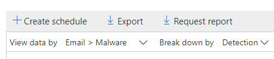
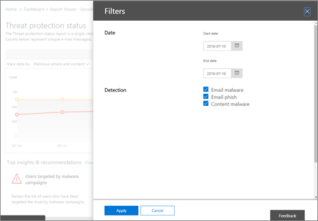

# Ver informes para la protección contra amenazas avanzada de Office 365View reports for Office 365 Advanced Threat Protection

Si la organización dispone de la [protección contra amenazas avanzada](office-365-atp.md) (ATP) de Office 365 y dispone de los [permisos necesarios](#what-permissions-are-needed-to-view-the-atp-reports), puede usar varios informes de &amp; ATP en el centro de seguridad y cumplimiento.If your organization has [Office 365 Advanced Threat Protection](office-365-atp.md) (ATP) and you have the [necessary permissions](#what-permissions-are-needed-to-view-the-atp-reports), you can use several ATP reports in the Security &amp; Compliance Center. (Vaya a \*\*\*\* \> **Panel**de informes).(Go to **Reports** \> **Dashboard**.)
  

  
Los informes de ATP incluyen lo siguiente:ATP reports include the following:
- [Informe de estado de protección contra amenazasThreat Protection Status report](#threat-protection-status-report)
- [Informe de tipos de archivos de ATPATP File Types report](#atp-file-types-report)
- [Informe de disposición de mensajes ATPATP Message Disposition report](#atp-message-disposition-report)
- [detección en tiempo real o explorador](threat-explorer.md) (en función de si tiene Office 365 ATP plan 1 o 2)either [real-time detections or Explorer](threat-explorer.md) (depending on whether you have Office 365 ATP Plan 1 or 2)
- ... [etc](#additional-reports-to-view).... [and more](#additional-reports-to-view). 

Lea este artículo para obtener información general sobre los informes de ATP y cómo usarlos.Read this article to get an overview of ATP reports and how to use them.
  
## Informe de estado de protección contra amenazasThreat Protection Status report

El informe de **Estado de protección contra amenazas** es una vista única que reúne información sobre contenido malintencionado y correo electrónico malintencionado detectado y bloqueado por [Exchange Online Protection](exchange-online-protection-overview.md) (EOP) y [Office 365 ATP](office-365-atp.md).The **Threat Protection Status** report is a single view that brings together information about malicious content and malicious email detected and blocked by [Exchange Online Protection](exchange-online-protection-overview.md) (EOP) and [Office 365 ATP](office-365-atp.md). Este informe es útil para ver las detecciones a lo largo del tiempo (hasta 90 días) y permite a los administradores de seguridad identificar las tendencias o determinar si las directivas necesitan ajustes.This report is useful for viewing detections over time (up to 90 days), and it enables security administrators to identify trends or determine whether policies need adjustments. 

El informe proporciona un recuento agregado de mensajes de correo electrónico únicos con contenido malintencionado, como archivos o direcciones de sitios web (URL) bloqueados por el motor antimalware, [purgado automático de cero horas (ZAP)](zero-hour-auto-purge.md)y características de ATP como los [vínculos seguros](atp-safe-links.md)ATP, los [datos adjuntos seguros ATP](atp-safe-attachments.md)y las [funcionalidades antiphishing de](atp-anti-phishing.md)ATP.The report provides an aggregated count of unique email messages with malicious content, such as files or website addresses (URLs) that were blocked by the anti-malware engine, [zero-hour auto purge (ZAP)](zero-hour-auto-purge.md), and ATP features like [ATP Safe Links](atp-safe-links.md), [ATP Safe Attachments](atp-safe-attachments.md), and [ATP anti-phishing capabilities](atp-anti-phishing.md). 

Los filtros y los desgloses de la información permiten clasificaciones más detalladas de la información de este informe.Filters and breakdowns of the information allow for more granular categorizations of the information in this report. En concreto, se incluye un menú de "desglosar por" para *correo electrónico >* las vistas de phishing y de *correo electrónico > malware*.Specifically, there is a 'break down by' menu included for *Email > Phish* and *Email > Malware views*. Se desglosarán los datos en:It will break down the data into:

| |  |
|---------|---------|
|Por tipo de detecciónBy detection type    | ¿Qué directiva ayudó a detectar estas amenazas?What policy helped catch these threats?         |
|Por tecnología de detecciónBy detection technology     | ¿Qué tecnología subyacente de Microsoft capturó la amenaza?What underlying Microsoft technology caught the threat?        |
|Por estado de entregaBy delivery status     | ¿Qué ocurrió con los mensajes de correo electrónico detectados como amenazas?What happened to the email messages detected as threats?         |
| | |

> [!TIP]
> El correo electrónico > phish | Las vistas de malware tienen desgloses granulares para las tecnologías de detección que se muestran, con categorías como *la reputación de archivo generado por ATP*, la *detonación de archivos*, la *detonación de dirección URL*, *anti-falseamiento: error de DMARC*, por ejemplo, útil para indicar exactamente qué característica condujo a su organización para que detecte las amenazas.Both the Email > Phish | Malware views have granular breakdowns for the detection technologies shown, with categories like *ATP-generated file reputation*, *File detonation*, *URL detonation*, *Anti-spoof: DMARC failure*, for example, helpful in pinpointing exactly which feature led your organization to catch threats.

Estas vistas le ofrecen la opción de exportar, mediante un clic de botón (en correo electrónico > phish, correo electrónico > malware y vistas de contenido > malware).These views give you the option to export, via a button click (in Email > Phish, Email > Malware, and Content > Malware views). Los datos agregados exportados a su equipo se pueden abrir en Excel.The aggregated data exported to your computer can be opened in Excel.

En las vistas información general y mensajes de correo electrónico se muestra información en horas de procesamiento, en lugar de en 24 horas (demanda re.The Overview and Emails views will display information within hours of processing rather than in 24 hours (demand re. la velocidad aumentada aquí ha sido una señal clara).increased speeds here has been a clear signal)!

> [!NOTE]
> Un informe de estado de protección contra amenazas está disponible para los clientes que tengan [Office 365 ATP](office-365-atp.md) o [Exchange Online Protection](exchange-online-protection-eop.md) (EOP); sin embargo, la información que se muestra en el informe de estado de la protección contra amenazas para los clientes de ATP probablemente contendrá distintos datos de los que pueden ver los clientes de EOP.A Threat Protection Status report is available to customers who have either [Office 365 ATP](office-365-atp.md) or [Exchange Online Protection](exchange-online-protection-eop.md) (EOP); however, the information that is displayed in the Threat Protection Status report for ATP customers will likely contain different data than what EOP customers might see. Por ejemplo, el informe de estado de protección contra amenazas para los clientes de ATP contendrá información sobre [los archivos malintencionados detectados en SharePoint Online, OneDrive o Microsoft Teams](atp-for-spo-odb-and-teams.md).For example, the Threat Protection Status report for ATP customers will contain information about [malicious files detected in SharePoint Online, OneDrive, or Microsoft Teams](atp-for-spo-odb-and-teams.md). Esta información es específica de ATP, por lo que los clientes que tengan EOP pero no ATP no verán los detalles en el informe de estado de protección contra amenazas.Such information is specific to ATP, so customers who have EOP but not ATP will not see those details in their Threat Protection Status report.
  
Para ver el informe de estado de protección contra amenazas, en el [centro de seguridad &amp; y cumplimiento](https://protection.office.com), vaya al **Panel** \> **informes** \> **Estado de protección contra amenazas**.To view the Threat Protection Status report, in the [Security &amp; Compliance Center](https://protection.office.com), go to **Reports** \> **Dashboard** \> **Threat Protection Status**.
  

  
Para obtener el estado detallado de un día, desplace el puntero sobre el gráfico.To get detailed status for a day, hover over the graph.
  

  
De forma predeterminada, el informe de estado de protección contra amenazas muestra datos de los últimos siete días.By default, the Threat Protection Status report shows data for the past seven days. Sin embargo, puede elegir **filtros** y cambiar el intervalo de fechas para ver los datos de hasta 90 días.However, you can choose **Filters** and change the date range to view data for up to 90 days. (Si usa una suscripción de prueba, es posible que se limite a 30 días de datos).(If you are using a trial subscription, you might be limited to 30 days' of data.)
  

  
También puede usar el menú **ver datos por** para cambiar la información que se muestra en el informe.You can also use the **View data by** menu to change what information is displayed in the report. 
  

## Informe de estado de protección de URLURL Protection Status report

Este informe se basa en datos recopilados y se detectan amenazas, por clic (mientras que la mayoría de los informes relacionados con amenazas de correo electrónico son por datos de mensaje).This report is based data collected, and threats detected, per click (whereas most other email threat related reports are per message data). Este informe está diseñado para mostrar las amenazas que provienen de hipervínculos en mensajes de correo electrónico y documentos, por clic.This report is designed to show threats that come from hyperlinks in email messages and documents, per click. Hay dos vistas:There are two views:

|  |  |
|---------|---------|
|Acción de clic de dirección URL en protecciónURL click protection action   | Vea el número de direcciones URL bloqueadas, bloqueadas pero reemplazadas por un usuario con un clic que se ha reemplazado con un clic por un usuario y permitido.See the number of URLs blocked, blocked but overridden with a click-through by a user, overridden with a click-through by a user, and allowed.        |
|Dirección URL haga clic por aplicaciónURL click by application     | Vea la aplicación desde la que se hizo clic en la dirección URL.See the application from which the URL was clicked.        |
|  |  |

En la tabla de detalles, podrá ver más información acerca de la hora de clic y la información del usuario.In the details table, you'll be able to see more information regarding click time and user information. Por último, tenga en cuenta que el informe de estado de protección de URL muestra la protección de la característica de vínculos seguros de ATP, de modo que solo los clientes que hayan habilitado vínculos seguros de ATP verán los datos reflejados en este informe.Finally, keep in mind the URL Protection Status report shows the protection from ATP Safe Links feature, so only customers who have enabled ATP Safe Links will see data reflected on this report.

> [!NOTE]
> Se trata de un *Informe de tendencias de protección*, lo que significa que los datos representan tendencias en un conjunto de datos más grande.This is a *protection trend report*, meaning data represents trends in a larger dataset. Los informes no están disponibles en tiempo real aquí.Reporting isn't available in real time here. Para la URL en tiempo real, haga clic en datos, siga usando el seguimiento de la dirección URL.For real time URL click data, please continue to use URL Trace.

## Informe de tipos de archivos de ATPATP File Types report

El informe de **tipos de archivo de ATP** muestra el tipo de archivos que los [datos adjuntos seguros de ATP](atp-safe-attachments.md)han detectado como malintencionados.The **ATP File Types** report shows you the type of files detected as malicious by [ATP Safe Attachments](atp-safe-attachments.md).
  
Para ver este informe, en el [Centro &amp; de seguridad y cumplimiento](https://protection.office.com), vaya a los **tipos de archivo ATP**del **Panel** \> **informes** \> .To view this report, in the [Security &amp; Compliance Center](https://protection.office.com), go to **Reports** \> **Dashboard** \> **ATP File Types**.
  

  
Al pasar el mouse sobre un día concreto, puede ver el desglose de los tipos de archivos malintencionados que ha detectado [ATP Safe Attachments](atp-safe-attachments.md) and [anti- &amp; spam Anti-Malware Protection in Office 365](anti-spam-and-anti-malware-protection.md).When you hover over a particular day, you can see the breakdown of types of malicious files that were detected by [ATP Safe Attachments](atp-safe-attachments.md) and [anti-spam &amp; anti-malware protection in Office 365](anti-spam-and-anti-malware-protection.md).
  

  
## Informe de disposición de mensajes ATPATP Message Disposition report

El informe de **disposición de mensajes de ATP** muestra las acciones que se tomaron para los mensajes de correo electrónico que se detectaron con contenido malintencionado.The **ATP Message Disposition** report shows you the actions that were taken for email messages that were detected as having malicious content. 
  
Para ver este informe, en el [Centro &amp; de seguridad y cumplimiento](https://protection.office.com), vaya a la **disposición de mensajes ATP**del **Panel** \> **informes** \> .To view this report, in the [Security &amp; Compliance Center](https://protection.office.com), go to **Reports** \> **Dashboard** \> **ATP Message Disposition**.
  

  
Cuando desplaza el puntero sobre una barra del gráfico, puede ver qué acciones se tomaron para el correo electrónico detectado durante ese día.When you hover over a bar in the chart, you can see what actions were taken for detected email for that day.
  

  
## Informes adicionales para verAdditional reports to view

Además de los informes de ATP descritos en este artículo, hay disponibles varios otros informes, como se describe en la tabla siguiente:In addition to the ATP reports described in this article, several other reports are available, as described in the following table:

|Informe (s)Report(s)  |DetallesDetails  |
|---------|---------|
|**Explorador** o **detecciones en tiempo real** (Office 365 ATP plan 2 los clientes tienen explorador; Office 365 ATP plan 1 los clientes tienen detecciones en tiempo real.)**Explorer** or **real-time detections** (Office 365 ATP Plan 2 customers have Explorer; Office 365 ATP Plan 1 customers have real-time detections.)| [Explorador de amenazas (y detecciones en tiempo real)Threat Explorer (and real-time detections)](threat-explorer.md)       |
|**Informes de seguridad de correo electrónico**, como un informe de remitentes y destinatarios principales, un informe de correo falsificado y un informe de detecciones de correo no deseado.**Email security reports**, such as a Top Senders and Recipients report, a Spoof Mail report, and a Spam Detections report. | [Ver informes de seguridad de correo electrónico &amp; en el centro de seguridad y cumplimientoView email security reports in the Security &amp; Compliance Center](view-email-security-reports.md)        |
|**Seguimiento de dirección URL de vínculos seguros ATP** (este es un informe que se genera con PowerShell). Este informe muestra los resultados de las acciones de vínculos seguros de ATP en los últimos siete (7) días.**ATP Safe Links URL trace** (This is a report you generate by using PowerShell.) This report shows the results of ATP Safe Links actions over the past seven (7) days. |[Referencia del cmdlet Get-UrlTraceGet-UrlTrace cmdlet reference](https://docs.microsoft.com/powershell/module/exchange/advanced-threat-protection/get-urltrace) |
|**Resultados de EOP y ATP** (se trata de un informe personalizado que se genera con PowerShell).**EOP and ATP results** (This is a custom report you generate by using PowerShell). Este informe contiene información como, por ejemplo, el dominio, la fecha, el tipo de evento, la dirección, la acción y el recuento de mensajes.This report contains information, such as Domain, Date, Event Type, Direction, Action, and Message Count.  | [Referencia del cmdlet Get-MailTrafficATPReportGet-MailTrafficATPReport cmdlet reference](https://docs.microsoft.com/powershell/module/exchange/advanced-threat-protection/get-mailtrafficatpreport) |
|**Detecciones de EOP y ATP** (se trata de un informe personalizado que se genera mediante PowerShell).**EOP and ATP detections** (This is a custom report you generate by using PowerShell). Este informe contiene detalles sobre archivos malintencionados o direcciones URL, intentos de suplantación de identidad, suplantación y otras amenazas potenciales en los correos electrónicos o archivos.This report contains details about malicious files or URLs, phishing attempts, impersonation, and other potential threats in email or files.   | [Referencia del cmdlet Get-MailDetailATPReportGet-MailDetailATPReport cmdlet reference](https://docs.microsoft.com/powershell/module/exchange/advanced-threat-protection/get-maildetailatpreport)        |

  
## ¿Qué permisos se necesitan para ver los informes de ATP?What permissions are needed to view the ATP reports?

Para poder ver y usar los informes descritos en este artículo, **debe tener asignada una función adecuada para el centro de &amp; seguridad y cumplimiento y el centro de administración de Exchange**.In order to view and use the reports described in this article, **you must have an appropriate role assigned for both the Security &amp; Compliance Center and the Exchange admin center**.

- Para el centro &amp; de seguridad y cumplimiento, debe tener asignada una de las siguientes funciones:For the Security &amp; Compliance Center, you must have one of the following roles assigned:
    - Administración de la organizaciónOrganization Management
    - Administrador de seguridad (puede asignarse en el centro de administración de Azure Active[https://aad.portal.azure.com](https://aad.portal.azure.com)Directory ())Security Administrator (this can be assigned in the Azure Active Directory admin center ([https://aad.portal.azure.com](https://aad.portal.azure.com)))
    - Lector de seguridadSecurity Reader

- Para Exchange Online, debe tener una de las siguientes funciones asignadas en el centro de administración de Exchange[https://outlook.office365.com/ecp](https://outlook.office365.com/ecp)() o con cmdlets de PowerShell (vea [Exchange Online PowerShell](https://docs.microsoft.com/powershell/exchange/exchange-online/exchange-online-powershell)):For Exchange Online, you must have one of the following roles assigned in either the Exchange admin center ([https://outlook.office365.com/ecp](https://outlook.office365.com/ecp)) or with PowerShell cmdlets (See [Exchange Online PowerShell](https://docs.microsoft.com/powershell/exchange/exchange-online/exchange-online-powershell)):
    - Administración de la organizaciónOrganization Management
    - Administración de organización de solo lecturaView-only Organization Management
    - Rol Destinatarios con permiso de vistaView-Only Recipients role
    - Administración de cumplimientoCompliance Management

Para obtener más información, vea los siguientes recursos:To learn more, see the following resources:

- [Permissions in the Office 365 Security &amp; Compliance CenterPermissions in the Office 365 Security &amp; Compliance Center](permissions-in-the-security-and-compliance-center.md)

- [Permisos de características de Exchange OnlineFeature permissions in Exchange Online](https://docs.microsoft.com/exchange/permissions-exo/feature-permissions)
   
## ¿Qué ocurre si los informes no muestran datos?What if the reports aren't showing data?

Si no ve datos en los informes de ATP, compruebe que las directivas estén correctamente configuradas.If you are not seeing data in your ATP reports, double-check that your policies are set up correctly. La organización debe tener directivas de [vínculos seguros ATP](set-up-atp-safe-links-policies.md) y [directivas de datos adjuntos seguros ATP](set-up-atp-safe-attachments-policies.md) definidas para que la protección de ATP esté en su lugar.Your organization must have [ATP Safe Links policies](set-up-atp-safe-links-policies.md) and [ATP Safe Attachments policies](set-up-atp-safe-attachments-policies.md) defined in order for ATP protection to be in place. Consulte también [protección contra correo no deseado y antimalware en Office 365](anti-spam-and-anti-malware-protection.md).Also see [Anti-spam and anti-malware protection in Office 365](anti-spam-and-anti-malware-protection.md).
  
## Temas relacionadosRelated topics

[Informes y opiniones en el centro de seguridad &amp; y cumplimiento de Office 365Reports and insights in the Office 365 Security &amp; Compliance Center](reports-and-insights-in-security-and-compliance.md)
  
[Crear una programación para un informe en el centro &amp; de seguridad y cumplimientoCreate a schedule for a report in the Security &amp; Compliance Center](create-a-schedule-for-a-report.md)
  
[Configurar y descargar un informe personalizado en el centro de &amp; seguridad y cumplimientoSet up and download a custom report in the Security &amp; Compliance Center](set-up-and-download-a-custom-report.md)
  

