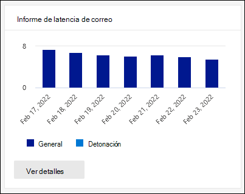

# Ver los informes de defender para Office 365 en el panel de informes del centro de seguridad & cumplimientoView Defender for Office 365 reports in the Reports dashboard in the Security & Compliance Center

[!INCLUDE [Microsoft 365 Defender rebranding](../includes/microsoft-defender-for-office.md)]

Microsoft defender para Office 365 organizaciones (por ejemplo, suscripciones a Microsoft 365 E5 o Microsoft defender para Office 365 plan 1 o Microsoft defender para Office 365 plan 2 complementos) contienen una variedad de informes relacionados con la seguridad.Microsoft Defender for Office 365 organizations (for example, Microsoft 365 E5 subscriptions or Microsoft Defender for Office 365 Plan 1 or Microsoft Defender for Office 365 Plan 2 add-ons) contain a variety of security-related reports. Si dispone de los [permisos necesarios](#what-permissions-are-needed-to-view-the-defender-for-office-365-reports), puede ver estos informes en el centro de seguridad & cumplimiento desde el panel de **informes** \> .If you have the [necessary permissions](#what-permissions-are-needed-to-view-the-defender-for-office-365-reports), you can view these reports in the Security & Compliance Center by going to **Reports** \> **Dashboard**. Para ir directamente al panel informes, Abra <https://protection.office.com/insightdashboard> .To go directly to the Reports dashboard, open <https://protection.office.com/insightdashboard>.

## Informe de tipos de archivo de defender para Office 365Defender for Office 365 file types report

El informe **de la defender para Office 365 del informe de tipos de archivo** muestra el tipo de archivos detectados como malintencionados por [datos adjuntos seguros](atp-safe-attachments.md).The **Defender for Office 365 file types report** report shows you the type of files detected as malicious by [Safe Attachments](atp-safe-attachments.md).

 La vista agregada del informe permite 90 días de filtrado, mientras que la vista de detalles solo permite 10 días de filtrado.The aggregate view of the report allows for 90 days of filtering, while the detail view only allows for 10 days of filtering.

Para ver el informe, abra el [centro de seguridad & cumplimiento](https://protection.office.com), vaya  al \> **Panel** informes y seleccione **defender para Office 365 tipos de archivo**.To view the report, open the [Security & Compliance Center](https://protection.office.com), go to **Reports** \> **Dashboard** and select **Defender for Office 365 file types**. Para ir directamente al informe, Abra <https://protection.office.com/reportv2?id=ATPFileReport> .To go directly to the report, open <https://protection.office.com/reportv2?id=ATPFileReport>.

> [!NOTE]
> La información de este informe también está disponible en el [Informe de disposición del mensaje de defender para Office 365](#defender-for-office-365-message-disposition-report).The information in this report is also available in the [Defender for Office 365 message disposition report](#defender-for-office-365-message-disposition-report).

### Vista informes para el informe de tipos de archivo de defender para Office 365Report view for the Defender for Office 365 file types report

Están disponibles las siguientes vistas:The following views are available:

- **Ver datos por: archivo**: el gráfico contiene la siguiente información:**View data by: File**: The chart contains the following information:

  - **Datos adjuntos de Excel malintencionados****Malicious Excel attachments**
  - **Datos adjuntos de Flash malintencionados****Malicious Flash attachments**
  - **Datos adjuntos de PDF malintencionados****Malicious PDF attachments**
  - **Datos adjuntos de PowerPoint malintencionados****Malicious PowerPoint attachments**
  - **Direcciones URL malintencionadas****Malicious URLs**
  - **Datos adjuntos de Word malintencionado****Malicious Word attachments**
  - **Datos adjuntos ejecutables malintencionados****Malicious executable attachments**
  - **Otros****Others**

  Cuando desplaza el puntero sobre un día concreto (punto de datos), puede ver el desglose de los tipos de archivos malintencionados que se detectaron con [datos adjuntos seguros](atp-safe-attachments.md) y la [protección antimalware en EOP](anti-malware-protection.md).When you hover over a particular day (data point), you can see the breakdown of types of malicious files that were detected by [Safe Attachments](atp-safe-attachments.md) and [anti-malware protection in EOP](anti-malware-protection.md).

  

  Si hace clic en **filtros**, puede modificar el informe con los siguientes filtros:If you click **Filters**, you can modify the report with the following filters:

  - **Fecha de inicio** y **fecha de finalización****Start date** and **End date**
  - Los mismos valores de tipo de archivo que están visibles en el gráfico.The same file type values that are visible in the chart.

- **Ver datos por: mensaje**: el gráfico contiene la siguiente información:**View data by: Message**: The chart contains the following information:

  - **Bloquear acceso****Block access**
  - **Mensajes reemplazados****Messages replaced**
  - **Mensajes supervisados****Messages monitored**
  - **Reemplazado por la entrega de correo electrónico dinámica**: para obtener más información, consulte [entrega dinámica en las directivas de datos adjuntos seguros](atp-safe-attachments.md#dynamic-delivery-in-safe-attachments-policies).**Replaced by Dynamic Email Delivery**: For more information, see [Dynamic Delivery in Safe Attachments policies](atp-safe-attachments.md#dynamic-delivery-in-safe-attachments-policies).

  

  Si hace clic en **filtros**, puede modificar el informe con los siguientes filtros:If you click **Filters**, you can modify the report with the following filters:

  - **Fecha de inicio** y **fecha de finalización****Start date** and **End date**
  - Los mismos valores de disposición de mensajes que están disponibles en el gráfico y el valor de mensajes adicionales que se **pasan** .The same message disposition values that are available in the chart, and the additional **Messages passed** value.

### Vista de tabla de detalles del informe de tipos de archivo de defender para Office 365Details table view for the Defender for Office 365 file types report

Si hace clic en **ver tabla de detalles**, el informe proporciona una vista casi en tiempo real de todos los clics que ocurren dentro de la organización durante los últimos 10 días.If you click **View details table**, the report provides a near-real-time view of all clicks that happen within the organization for the last 10 days. La información que se muestra depende del gráfico que estaba viendo:The information that's shown depends on the chart you were looking at:

- **Ver datos por: archivo**:**View data by: File**:

  - **Date****Date**
  - **Dirección del destinatario****Recipient address**
  - **Dirección del remitente****Sender address**
  - **Identificador del mensaje**: disponible en el campo de encabezado del **identificador del mensaje** en el encabezado del mensaje y debe ser único.**Message ID**: Available in the **Message-ID** header field in the message header and should be unique. Un valor de ejemplo es `<08f1e0f6806a47b4ac103961109ae6ef@server.domain>` (observe los corchetes angulares).An example value is `<08f1e0f6806a47b4ac103961109ae6ef@server.domain>` (note the angle brackets).
  - **Archivo****File**

  Si hace clic en **filtros**, puede modificar el informe con los siguientes filtros:If you click **Filters**, you can modify the report with the following filters:

  - **Fecha de inicio** y **fecha de finalización****Start date** and **End date**
  - Los mismos valores de tipo de archivo que están visibles en el gráfico.The same file type values that are visible in the chart.

- **Ver datos por: mensaje**:**View data by: Message**:

  - **Date****Date**
  - **Dirección del destinatario****Recipient address**
  - **Dirección del remitente****Sender address**
  - **Id. de mensaje****Message ID**
  - **Archivo****File**
  - **Subject****Subject**

  Si hace clic en **filtros**, puede modificar los resultados con los siguientes filtros:If you click **Filters**, you can modify the results with the following filters:

  - **Fecha de inicio** y **fecha de finalización****Start date** and **End date**
  - Los mismos valores de disposición de mensajes que están disponibles en el gráfico y el valor de mensajes adicionales que se **pasan** .The same message disposition values that are available in the chart, and the additional **Messages passed** value.

Para volver a la vista informes, haga clic en **Ver informe**.To get back to the reports view, click **View report**.

## Informe de disposición de mensajes de defender para Office 365Defender for Office 365 message disposition report

El informe de **disposición de mensajes de ATP** muestra las acciones que se tomaron para los mensajes de correo electrónico que se detectaron con contenido malintencionado.The **ATP Message Disposition** report shows you the actions that were taken for email messages that were detected as having malicious content.

Para ver el informe, abra el [centro de seguridad & cumplimiento](https://protection.office.com), vaya  al \> **Panel** informes y seleccione **defender para Office 365 disposición de mensajes**.To view the report, open the [Security & Compliance Center](https://protection.office.com), go to **Reports** \> **Dashboard** and select **Defender for Office 365 message disposition**. Para ir directamente al informe, Abra <https://protection.office.com/reportv2?id=ATPMessageReport> .To go directly to the report, open <https://protection.office.com/reportv2?id=ATPMessageReport>.

> [!NOTE]
> La información de este informe también está disponible en el [Informe de tipos de archivo de defender para Office 365](#defender-for-office-365-file-types-report).The information in this report is also available in the [Defender for Office 365 file types report](#defender-for-office-365-file-types-report).

### Vista informes del informe de disposición de los mensajes de defender para Office 365Report view for the Defender for Office 365 message disposition report

Están disponibles las siguientes vistas:The following views are available:

- **Ver datos por: mensaje**: el gráfico contiene la siguiente información:**View data by: Message**: The chart contains the following information:

  - **Bloquear acceso****Block access**
  - **Mensajes reemplazados****Messages replaced**
  - **Mensajes supervisados****Messages monitored**
  - **Reemplazado por la entrega de correo electrónico dinámica**: para obtener más información, consulte [entrega dinámica en las directivas de datos adjuntos seguros](atp-safe-attachments.md#dynamic-delivery-in-safe-attachments-policies).**Replaced by Dynamic Email Delivery**: For more information, see [Dynamic Delivery in Safe Attachments policies](atp-safe-attachments.md#dynamic-delivery-in-safe-attachments-policies).

  

  Si hace clic en **filtros**, puede modificar el informe con los siguientes filtros:If you click **Filters**, you can modify the report with the following filters:

  - **Fecha de inicio** y **fecha de finalización****Start date** and **End date**
  - Los mismos valores de disposición de mensajes que están disponibles en el gráfico y el valor de mensajes adicionales que se **pasan** .The same message disposition values that are available in the chart, and the additional **Messages passed** value.

- **Ver datos por: archivo**: el gráfico contiene la siguiente información:**View data by: File**: The chart contains the following information:

  - **Datos adjuntos de Excel malintencionados****Malicious Excel attachments**
  - **Datos adjuntos de Flash malintencionados****Malicious Flash attachments**
  - **Datos adjuntos de PDF malintencionados****Malicious PDF attachments**
  - **Datos adjuntos de PowerPoint malintencionados****Malicious PowerPoint attachments**
  - **Direcciones URL malintencionadas****Malicious URLs**
  - **Datos adjuntos de Word malintencionado****Malicious Word attachments**
  - **Datos adjuntos ejecutables malintencionados****Malicious executable attachments**
  - **Otros****Others**

  Cuando desplaza el puntero sobre un día concreto (punto de datos), puede ver el desglose de los tipos de archivos malintencionados que se detectaron con [datos adjuntos seguros](atp-safe-attachments.md) y la [protección antimalware en EOP](anti-malware-protection.md).When you hover over a particular day (data point), you can see the breakdown of types of malicious files that were detected by [Safe Attachments](atp-safe-attachments.md) and [anti-malware protection in EOP](anti-malware-protection.md).

  

  Si hace clic en **filtros**, puede modificar el informe con los siguientes filtros:If you click **Filters**, you can modify the report with the following filters:

  - **Fecha de inicio** y **fecha de finalización****Start date** and **End date**
  - Los mismos valores de tipo de archivo que están visibles en el gráfico.The same file type values that are visible in the chart.

### Vista de tabla de detalles del informe de disposición de los mensajes de defender para Office 365Details table view for the Defender for Office 365 message disposition report

Si hace clic en **ver tabla de detalles**, el informe proporciona una vista casi en tiempo real de todos los clics que ocurren dentro de la organización durante los últimos 10 días.If you click **View details table**, the report provides a near-real-time view of all clicks that happen within the organization for the last 10 days. La información que se muestra depende del gráfico que estaba viendo:The information that's shown depends on the chart you were looking at:

- **Ver datos por: mensaje**:**View data by: Message**:

  - **Date****Date**
  - **Dirección del destinatario****Recipient address**
  - **Dirección del remitente****Sender address**
  - **Id. de mensaje****Message ID**
  - **Archivo****File**
  - **Subject****Subject**

  Si hace clic en **filtros**, puede modificar los resultados con los siguientes filtros:If you click **Filters**, you can modify the results with the following filters:

  - **Fecha de inicio** y **fecha de finalización****Start date** and **End date**
  - Los mismos valores de disposición de mensajes que están disponibles en el gráfico y el valor de mensajes adicionales que se **pasan** .The same message disposition values that are available in the chart, and the additional **Messages passed** value.

- **Ver datos por: archivo**:**View data by: File**:

  - **Date****Date**
  - **Dirección del destinatario****Recipient address**
  - **Dirección del remitente****Sender address**
  - **Id. de mensaje****Message ID**
  - **Archivo****File**

  Si hace clic en **filtros**, puede modificar el informe con los siguientes filtros:If you click **Filters**, you can modify the report with the following filters:

  - **Fecha de inicio** y **fecha de finalización****Start date** and **End date**
  - Los mismos valores de tipo de archivo que están visibles en el gráfico.The same file type values that are visible in the chart.

Para volver a la vista informes, haga clic en **Ver informe**.To get back to the reports view, click **View report**.

## Informe de latencia de correoMail latency report

El **Informe de latencia de correo** muestra una vista agregada de la entrega de correo y la latencia de detonación experimentada en la organización.The **Mail latency report** shows you an aggregate view of the mail delivery and detonation latency experienced within your organization. Los tiempos de entrega de correo en el servicio se ven afectados por una serie de factores, y el tiempo de entrega absoluto en segundos no suele ser un buen indicador de éxito o problema.Mail delivery times in the service are affected by a number of factors, and the absolute delivery time in seconds is often not a good indicator of success or a problem. Una hora de entrega lenta en un día puede considerarse un promedio de tiempo de entrega en otro día o viceversa.A slow delivery time on one day might be considered an average delivery time on another day, or vice-versa. El **Informe de latencia de correo** intenta calificar la entrega de mensajes en función de los datos estadísticos sobre los tiempos de entrega observados de otros mensajes:The **Mail latency report** tries to qualify message delivery based on statistical data about the observed delivery times of other messages:

- **percentil 50**: es la mitad de los tiempos de entrega de mensajes.**50th percentile**: This is the middle for message delivery times. Este valor se puede considerar como tiempo medio de entrega.You can consider this value as an average delivery time.
- **nonagésimo percentil**: Esto indica una latencia alta para la entrega de mensajes.**90th percentile**: This indicates a high latency for message delivery. Solo el 10% de los mensajes tardó más que este valor para entregar.Only 10% of messages took longer than this value to deliver.
- **percentil 99th**: indica la latencia más alta para la entrega de mensajes.**99th percentile**: This indicates the highest latency for message delivery.

No se incluye la latencia de la red y del cliente.Client side and network latency are not included.

Para ver el informe, abra el [centro de seguridad & cumplimiento](https://protection.office.com), vaya  al \> **Panel** informes y seleccione informe de **latencia de correo**.To view the report, open the [Security & Compliance Center](https://protection.office.com), go to **Reports** \> **Dashboard** and select **Mail latency report**. Para ir directamente al informe, Abra <https://protection.office.com/mailLatencyReport?viewid=P50> .To go directly to the report, open <https://protection.office.com/mailLatencyReport?viewid=P50>.

### Vista informes para el informe de latencia de correoReport view for the Mail latency report

Al abrir el informe, la ficha **percentiles 50** está seleccionada de forma predeterminada.When you open the report, the **50th percentiles** tab is selected by default.

De forma predeterminada, esta vista contiene un gráfico que está configurado con los siguientes filtros:By default, this view contains a chart that's configured with the following filters:

- **Fecha**: los últimos 7 días**Date**: The last 7 days
- **Vista de mensajes**:**Message View**:
  - Mensajes detonadosDetonated messages

Este gráfico muestra los mensajes organizados en las siguientes categorías:This chart shows messages organized into the following categories:

- **Latencia de entrega de correo****Mail delivery latency**
- **Latencia de detonación****Detonation latency**

Cuando desplaza el puntero sobre una categoría del gráfico, puede ver un desglose de la latencia en cada categoría.When you hover over a category in the chart, you can see a breakdown of the latency in each category.

Si hace clic en **filtrar** en la vista de informe, puede modificar los resultados con los siguientes filtros:If you click **Filter** in the report view, you can modify the results with the following filters:

- Todos los mensajesAll messages
- Mensajes que contienen datos adjuntos o direcciones URLMessages that contain attachments or URLs

Si hace clic en la pestaña **90 percentiles** o la ficha **percentiles de 99th** , se usan los mismos filtros predeterminados de la vista **percentil 50** .If you click the **90th percentiles** tab or the **99th percentiles** tab, the same default filters from the **50th percentiles** view are used.

### Vista de tabla de detalles para el informe de latencia de correoDetails table view for the Mail latency report

La siguiente información se muestra en la vista de tabla de detalles:The following information is shown in the details table view:

- **Date****Date**
- **Percentiles****Percentiles**
- **Número de mensajes****Message count**
- **Latencia general****Overall latency**

El anterior muestra que el 14 de noviembre la latencia media experimentada para todos los mensajes entregados y detonaciones fue de **108,033** segundos.The above shows that on November 14 the average latency experienced for all messages delivered and detonated was **108.033** seconds.

La tabla de detalles contiene la misma información en cada pestaña.The details table contains the same information on each tab.

## Informe de estado de protección contra amenazasThreat protection status report

El informe de **Estado de protección contra amenazas** es una vista única que reúne información sobre contenido malintencionado y correo electrónico malintencionado detectado y bloqueado por [Exchange Online Protection](exchange-online-protection-overview.md) (EOP) y Microsoft defender para Office 365.The **Threat protection status** report is a single view that brings together information about malicious content and malicious email detected and blocked by [Exchange Online Protection](exchange-online-protection-overview.md) (EOP) and Microsoft Defender for Office 365. Para obtener más información, consulte [Informe de estado de protección contra amenazas](view-email-security-reports.md#threat-protection-status-report).For more information, see [Threat protection status report](view-email-security-reports.md#threat-protection-status-report).

## Informe de protección contra amenazas de URLURL threat protection report

El **Informe de protección contra amenazas de direcciones URL** proporciona vistas de Resumen y tendencias para las amenazas detectadas y las acciones tomadas en los clics de direcciones URL como parte de los [vínculos seguros](atp-safe-links.md).The **URL threat protection report** provides summary and trend views for threats detected and actions taken on URL clicks as part of [Safe Links](atp-safe-links.md). Este informe no tendrá hacer clic en datos de usuarios en los que la Directiva de vínculos seguros aplicada tiene seleccionada la opción no hacer **un seguimiento de los clics del usuario** .This report will not have click data from users where the Safe Links policy applied has the **Do not track user clicks** option selected.

Para ver el informe, abra el [centro de seguridad & cumplimiento](https://protection.office.com), vaya a **informes** de \> **Panel** y seleccione **Informe de protección de URL**.To view the report, open the [Security & Compliance Center](https://protection.office.com), go to **Reports** \> **Dashboard** and select **URL protection report**. Para ir directamente al informe, Abra <https://protection.office.com/reportv2?id=URLProtectionActionReport> .To go directly to the report, open <https://protection.office.com/reportv2?id=URLProtectionActionReport>.

> [!NOTE]
> Se trata de un *Informe de tendencias de protección*, lo que significa que los datos representan tendencias en un conjunto de datos más grande.This is a *protection trend report*, meaning data represents trends in a larger dataset. Como resultado, los datos de la vista de agregado no están disponibles en tiempo real aquí, pero los datos de la vista de tabla de detalles son, por lo que es posible que vea una ligera diferencia entre las dos vistas.As a result, the data in the aggregate view is not available in real time here, but the data in the details table view is, so you may see a slight discrepancy between the two views.

### Vista informes para el informe de protección contra amenazas de direcciones URLReport view for the URL threat protection report

El informe de **protección contra amenazas de direcciones URL** tiene dos vistas agregadas que se actualizan una vez cada cuatro horas que muestra datos para los últimos 90 días:The **URL threat protection** report has two aggregated views that are refreshed once every four hours that shows data for the last 90 days:

- **Hacer clic en dirección URL acción de protección**: muestra el número de clics de direcciones URL por parte de los usuarios de la organización y los resultados del clic:**URL click protection action**: Shows the number of URL clicks by users in the organization and the results of the click:

  - **Bloqueado** (se ha bloqueado al usuario para que navegue a la dirección URL)**Blocked** (the user was blocked from navigating to the URL)
  - **Bloqueado y clic en****Blocked and clicked through**
  - **Clic durante el examen****Clicked through during scan**

  Un clic indica que el usuario ha acpulsado a través de la página de bloque al sitio Web malintencionado (los administradores pueden deshabilitar el clic en las directivas de vínculos a prueba de errores).A click indicates that the user has clicked through the block page to the malicious website (admins can disable click through in Safe Links policies).

  Si hace clic en **filtros**, puede modificar el informe con los siguientes filtros:If you click **Filters**, you can modify the report with the following filters:

  - **Fecha de inicio** y **fecha de finalización****Start date** and **End date**
  - Las acciones de clic en protección disponibles, más el valor **permitido** (el usuario tuvo permiso para navegar a la dirección URL).The available click protection actions, plus the value **Allowed** (the user was allowed to navigate to the URL).

  

- **Dirección URL haga clic en por aplicación**: muestra el número de clics de direcciones URL por aplicaciones que admiten vínculos seguros:**URL click by application**: Shows the number of URL clicks by applications that support Safe Links:

  - **Cliente de correo electrónico****Email client**
  - **PowerPoint****PowerPoint**
  - **Word****Word**
  - **Excel****Excel**
  - **OneNote****OneNote**
  - **Visio****Visio**
  - **Teams****Teams**
  - **Otros****Other**

  Si hace clic en **filtros**, puede modificar el informe con los siguientes filtros:If you click **Filters**, you can modify the report with the following filters:

  - **Fecha de inicio** y **fecha de finalización****Start date** and **End date**
  - Las aplicaciones disponibles.The available applications.

### Vista de tabla de detalles para el informe de protección contra amenazas de direcciones URLDetails table view for the URL threat protection report

Si hace clic en **ver tabla de detalles**, el informe proporciona una vista casi en tiempo real de todos los clics que ocurren dentro de la organización en los últimos 7 días con los siguientes detalles:If you click **View details table**, the report provides a near-real-time view of all clicks that happen within the organization for the last 7 days with the following details:

- **Haga clic en hora****Click time**
- **Usuario****User**
- **URL****URL**
- **Action****Action**
- **App****App**

Si hace clic en **filtros** en la vista de tabla de detalles, puede filtrar por los mismos criterios que en la vista de informe y también por **dominios** o **destinatarios** separados por comas.If you click **Filters** in the details table view, you can filter by the same criteria as in the report view, and also by **Domains** or **Recipients** separated by commas.

Para volver a la vista informes, haga clic en **Ver informe**.To get back to the reports view, click **View report**.

## Informes adicionales para verAdditional reports to view

Además de los informes descritos en este tema, hay varios otros informes disponibles, tal como se describe en la tabla siguiente:In addition to the reports described in this topic, several other reports are available, as described in the following table:

****

|InformeReport|TemaTopic|
|---|---|
|**Explorer** (Microsoft defender para Office 365 plan 2) o **detecciones en tiempo real** (microsoft defender para Office 365 plan 1)**Explorer** (Microsoft Defender for Office 365 Plan 2) or **real-time detections** (Microsoft Defender for Office 365 Plan 1)|[Explorador de amenazas (y detecciones en tiempo real)Threat Explorer (and real-time detections)](threat-explorer.md)|
|**Informes de seguridad de correo electrónico**, como el informe de remitentes y destinatarios principales, el informe de correo falsificado y el informe de detecciones de correo no deseado.**Email security reports**, such as the Top senders and recipients report, the Spoof mail report, and the Spam detections report.|[Ver informes de seguridad de correo electrónico en el Centro de seguridad y cumplimientoView email security reports in the Security & Compliance Center](view-email-security-reports.md)|
|**Informes de flujo de correo**, como el informe de reenvío, el informe de estado de flujo de correo y el informe de remitentes y destinatarios principales.**Mail flow reports**, such as the Forwarding report, the Mailflow status report, and the Top senders and recipients report.|[Ver informes de flujo de correo en el centro de seguridad & cumplimientoView mail flow reports in the Security & Compliance Center](view-mail-flow-reports.md)|
|**Seguimiento de dirección URL para vínculos seguros** (solo PowerShell).**URL trace for Safe Links** (PowerShell only). El resultado de este cmdlet muestra los resultados de las acciones de vínculos a prueba de errores en los últimos siete días.The output of this cmdlet shows you the results of Safe Links actions over the past seven days.|[Get-UrlTraceGet-UrlTrace](https://docs.microsoft.com/powershell/module/exchange/get-urltrace)|
|**Resultados del tráfico de correo para EOP y Microsoft defender para Office 365** (solo PowerShell).**Mail traffic results for EOP and Microsoft Defender for Office 365** (PowerShell only). El resultado de este cmdlet contiene información sobre el dominio, la fecha, el tipo de evento, la dirección, la acción y el recuento de mensajes.The output of this cmdlet contains information about Domain, Date, Event Type, Direction, Action, and Message Count.|[Get-MailTrafficATPReportGet-MailTrafficATPReport](https://docs.microsoft.com/powershell/module/exchange/get-mailtrafficatpreport)|
|**Informes de detalles de correo para EOP y defender para Office 365 DETECTIONS** (solo PowerShell).**Mail detail reports for EOP and Defender for Office 365 detections** (PowerShell only). El resultado de este cmdlet contiene detalles sobre archivos malintencionados o direcciones URL, intentos de suplantación de identidad (phishing), suplantación y otras amenazas potenciales en el correo electrónico o los archivos.The output of this cmdlet contains details about malicious files or URLs, phishing attempts, impersonation, and other potential threats in email or files.|[Get-MailDetailATPReportGet-MailDetailATPReport](https://docs.microsoft.com/powershell/module/exchange/get-maildetailatpreport)|
|

## ¿Qué permisos se necesitan para ver los informes de defender para Office 365?What permissions are needed to view the Defender for Office 365 reports?

Para poder ver y usar los informes descritos en este tema, debe pertenecer a uno de los siguientes grupos de roles en el centro de seguridad & cumplimiento:In order to view and use the reports described in this topic, you need to be a member of one of the following role groups in the Security & Compliance Center:

- **Administración de organizaciones****Organization Management**
- **Administrador de seguridad****Security Administrator**
- **Lector de seguridad****Security Reader**
- **Lector global****Global Reader**

Para obtener más información, vea [Permisos en el Centro de seguridad y cumplimiento](permissions-in-the-security-and-compliance-center.md).For more information, see [Permissions in the Security & Compliance Center](permissions-in-the-security-and-compliance-center.md).

**Nota**: agregar usuarios al rol correspondiente de Azure Active Directory en el centro de administración de Microsoft 365 proporciona a los usuarios los permisos necesarios en el centro de seguridad & cumplimiento _y_ permisos para otras características de Microsoft 365.**Note**: Adding users to the corresponding Azure Active Directory role in the Microsoft 365 admin center gives users the required permissions in the Security & Compliance Center _and_ permissions for other features in Microsoft 365. Para obtener más información, vea [Sobre los roles de administrador](https://docs.microsoft.com/microsoft-365/admin/add-users/about-admin-roles).For more information, see [About admin roles](https://docs.microsoft.com/microsoft-365/admin/add-users/about-admin-roles).

## ¿Qué ocurre si los informes no muestran datos?What if the reports aren't showing data?

Si no ve datos en sus informes de defender para Office 365, compruebe que las directivas están configuradas correctamente.If you are not seeing data in your Defender for Office 365 reports, double-check that your policies are set up correctly. La organización debe tener directivas de [vínculos seguros](set-up-atp-safe-links-policies.md) y [las directivas de datos adjuntos seguros](set-up-atp-safe-attachments-policies.md) definidas para que defender para Office 365 esté en su lugar.Your organization must have [Safe Links policies](set-up-atp-safe-links-policies.md) and [Safe Attachments policies](set-up-atp-safe-attachments-policies.md) defined in order for Defender for Office 365 protection to be in place. Consulte también [protección contra correo no deseado y antimalware](anti-spam-and-anti-malware-protection.md).Also see [Anti-spam and anti-malware protection](anti-spam-and-anti-malware-protection.md).

## Temas relacionadosRelated topics

[Informes inteligentes y reportes en el Centro de seguridad y cumplimientoSmart reports and insights in the Security & Compliance Center](reports-and-insights-in-security-and-compliance.md)

[Permisos de funciones (Azure Active DirectoryRole permissions (Azure Active Directory](https://docs.microsoft.com/azure/active-directory/users-groups-roles/directory-assign-admin-roles#role-permissions)
