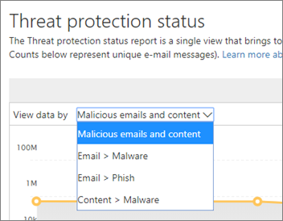

# Ver informes para la protección contra amenazas avanzada de Office 365

Si la organización dispone de la [protección contra amenazas avanzada](office-365-atp.md) (ATP) de Office 365 y dispone de los [permisos necesarios](#what-permissions-are-needed-to-view-the-atp-reports), puede usar varios informes de ATP en el centro de seguridad y &amp; cumplimiento. (Ir a **informes** \> **Panel**).

Los informes de ATP incluyen lo siguiente:

- [Informe de estado de protección contra amenazas](#threat-protection-status-report)
- [Informe de tipos de archivos de ATP](#atp-file-types-report)
- [Informe de disposición de mensajes ATP](#atp-message-disposition-report)
- [detección en tiempo real o explorador](threat-explorer.md) (en función de si tiene Office 365 ATP plan 1 o 2)
- ... [etc](#additional-reports-to-view).

Lea este artículo para obtener información general sobre los informes de ATP y cómo usarlos.

## Informe de estado de protección contra amenazas

El informe de **Estado de protección contra amenazas** es una vista única que reúne información sobre contenido malintencionado y correo electrónico malintencionado detectado y bloqueado por [Exchange Online Protection](exchange-online-protection-overview.md) (EOP) y [Office 365 ATP](office-365-atp.md). Este informe es útil para ver las detecciones a lo largo del tiempo (hasta 90 días) y permite a los administradores de seguridad identificar las tendencias o determinar si las directivas necesitan ajustes.

El informe proporciona un recuento agregado de mensajes de correo electrónico únicos con contenido malintencionado, como archivos o direcciones de sitios web (URL) bloqueados por el motor antimalware, [purgado automático de cero horas (ZAP)](zero-hour-auto-purge.md)y características de ATP, como [vínculos seguros de ATP](atp-safe-links.md), [datos adjuntos seguros](atp-safe-attachments.md)de ATP y [antiphishing de ATP](set-up-anti-phishing-policies.md).

Los filtros y los desgloses de la información permiten clasificaciones más detalladas de la información de este informe. **En concreto** , se incluye un menú de "desglosar por" para las vistas de \> **phish** y malware del **correo** electrónico \> **Malware views**. Se desglosarán los datos en:

|||
|---|---|
|Por tipo de detección|¿Qué directiva ayudó a detectar estas amenazas?|
|Por tecnología de detección|¿Qué tecnología subyacente de Microsoft capturó la amenaza?|
|Por estado de entrega|¿Qué ocurrió con los mensajes de correo electrónico detectados como amenazas?|
|

> [!TIP]
> El correo electrónico > phish | Las vistas de malware tienen desgloses granulares para las tecnologías de detección que se muestran, con categorías como *la reputación de archivo generado por ATP*, la *detonación de archivos*, la *detonación de dirección URL*, *anti-falseamiento: error de DMARC*, por ejemplo, útil para indicar exactamente qué característica condujo a su organización para que detecte las amenazas.

Estas vistas le ofrecen la opción de exportar, mediante un clic de botón (en vistas de phishing de **correo electrónico** \> **Phish**, malware de **correo electrónico** \> **Malware**y malware de **contenido** \> **Malware** ). Los datos agregados exportados a su equipo se pueden abrir en Excel.

**Nota**: el número máximo de entradas que se pueden exportar para **phish** y **Malware** solo es inferior a 10000. Si exporta una vista, se exportan sólo las entradas 10000 más recientes.

En las vistas información general y mensajes de correo electrónico se muestra información en horas de procesamiento, en lugar de en 24 horas (demanda re. la velocidad aumentada aquí ha sido una señal clara).

> [!NOTE]
> Un informe de estado de protección contra amenazas está disponible para los clientes que tengan [Office 365 ATP](office-365-atp.md) o [Exchange Online Protection](exchange-online-protection-overview.md)(EOP); sin embargo, la información que se muestra en el informe de estado de la protección contra amenazas para los clientes de ATP probablemente contendrá distintos datos de los que pueden ver los clientes de EOP. Por ejemplo, el informe de estado de protección contra amenazas para los clientes de ATP contendrá información sobre [los archivos malintencionados detectados en SharePoint Online, OneDrive o Microsoft Teams](atp-for-spo-odb-and-teams.md). Esta información es específica de ATP, por lo que los clientes que tengan EOP pero no ATP no verán los detalles en el informe de estado de protección contra amenazas.

Para ver el informe de estado de protección contra amenazas, en el [ &amp; centro de seguridad y cumplimiento](https://protection.office.com), vaya al panel **informes** \> **Dashboard** \> **Estado de protección contra amenazas**.

Para obtener el estado detallado de un día, desplace el puntero sobre el gráfico.

De forma predeterminada, el informe de estado de protección contra amenazas muestra datos de los últimos siete días. Sin embargo, puede elegir **filtros** y cambiar el intervalo de fechas para ver los datos de hasta 90 días. (Si usa una suscripción de prueba, es posible que se limite a 30 días de datos).

También puede usar el menú **ver datos por** para cambiar la información que se muestra en el informe.

## Informe de estado de protección de URL

Este informe se basa en datos recopilados y se detectan amenazas, por clic (mientras que la mayoría de los informes relacionados con amenazas de correo electrónico son por datos de mensaje). Este informe está diseñado para mostrar las amenazas que provienen de hipervínculos en mensajes de correo electrónico y documentos, por clic. Hay dos vistas:

|||
|---|---|
|Acción de clic de dirección URL en protección|Vea el número de direcciones URL bloqueadas, bloqueadas pero reemplazadas por un usuario con un clic que se ha reemplazado con un clic por un usuario y permitido.|
|Dirección URL haga clic por aplicación|Vea la aplicación desde la que se hizo clic en la dirección URL.|
|

En la tabla de detalles, podrá ver más información acerca de la hora de clic y la información del usuario. Por último, tenga en cuenta que el informe de estado de protección de URL muestra la protección de la característica de vínculos seguros de ATP, de modo que solo los clientes que hayan habilitado vínculos seguros de ATP verán los datos reflejados en este informe.

> [!NOTE]
> Se trata de un *Informe de tendencias de protección*, lo que significa que los datos representan tendencias en un conjunto de datos más grande. Como resultado, los datos de la vista de agregado no están disponibles en tiempo real aquí, pero los datos de la vista de tabla de detalles son, por lo que es posible que vea una ligera diferencia entre las dos vistas.

## Informe de tipos de archivos de ATP

El informe de **tipos de archivo de ATP** muestra el tipo de archivos que los [datos adjuntos seguros de ATP](atp-safe-attachments.md)han detectado como malintencionados.

Para ver este informe, en el [centro de seguridad y &amp; cumplimiento](https://protection.office.com), vaya a los tipos de **Reports** \> **Dashboard** \> **archivo ATP**del panel informes.

  
Al pasar el mouse sobre un día concreto, puede ver el desglose de los tipos de archivos malintencionados detectados por los [datos adjuntos seguros de ATP](atp-safe-attachments.md) y la [ &amp; protección antimalware contra correo no deseado](anti-spam-and-anti-malware-protection.md).
  

## Informe de disposición de mensajes ATP

El informe de **disposición de mensajes de ATP** muestra las acciones que se tomaron para los mensajes de correo electrónico que se detectaron con contenido malintencionado.

Para ver este informe, en el [centro de seguridad y &amp; cumplimiento](https://protection.office.com), vaya a la disposición de **Reports** \> **Dashboard** \> **mensajes ATP**del panel informes.

Cuando desplaza el puntero sobre una barra del gráfico, puede ver qué acciones se tomaron para el correo electrónico detectado durante ese día.

## Informes adicionales para ver

Además de los informes de ATP descritos en este artículo, hay disponibles varios otros informes, como se describe en la tabla siguiente:

|||
|---|---|
|**Informe (s)**|**Detalles**|
|**Explorer** o **detección en tiempo real**: (Office 365 ATP plan 2 los clientes tienen explorador; Office 365 ATP plan 1 los clientes tienen detecciones en tiempo real.)|[Explorador de amenazas (y detecciones en tiempo real)](threat-explorer.md)|
|**Informes de seguridad de correo electrónico**, como un informe de remitentes y destinatarios principales, un informe de correo falsificado y un informe de detecciones de correo no deseado.|[Ver informes de seguridad de correo electrónico en el centro de seguridad y &amp; cumplimiento](view-email-security-reports.md)|
|**Seguimiento de dirección URL de vínculos seguros de ATP**: (este es un informe que se genera con PowerShell). Este informe muestra los resultados de las acciones de vínculos seguros de ATP en los últimos siete (7) días.|[Referencia del cmdlet Get-UrlTrace](https://docs.microsoft.com/powershell/module/exchange/advanced-threat-protection/get-urltrace)|
|**Resultados de EOP y ATP**: (este es un informe personalizado que se genera con PowerShell). Este informe contiene información como, por ejemplo, el dominio, la fecha, el tipo de evento, la dirección, la acción y el recuento de mensajes.|[Referencia del cmdlet Get-MailTrafficATPReport](https://docs.microsoft.com/powershell/module/exchange/advanced-threat-protection/get-mailtrafficatpreport)|
|**Detecciones de EOP y ATP**: (este es un informe personalizado que se genera con PowerShell). Este informe contiene detalles sobre archivos malintencionados o direcciones URL, intentos de suplantación de identidad, suplantación y otras amenazas potenciales en los correos electrónicos o archivos.|[Referencia del cmdlet Get-MailDetailATPReport](https://docs.microsoft.com/powershell/module/exchange/advanced-threat-protection/get-maildetailatpreport)|
|

## ¿Qué permisos se necesitan para ver los informes de ATP?

Para poder ver y usar los informes descritos en este artículo, **debe tener asignada una función adecuada para el centro de seguridad &amp; y cumplimiento y el centro de administración de Exchange**.

- Para el centro de seguridad &amp; y cumplimiento, debe tener asignada una de las siguientes funciones:

  - Administración de la organización
  - Administrador de seguridad (puede asignarse en el centro de administración de Azure Active Directory ( [https://aad.portal.azure.com](https://aad.portal.azure.com) ))
  - Operador de seguridad (puede asignarse en el centro de administración de Azure Active Directory ( [https://aad.portal.azure.com](https://aad.portal.azure.com) ))
  - Lector de seguridad

- Para Exchange Online, debe tener una de las siguientes funciones asignadas en el centro de administración de Exchange ( [https://outlook.office365.com/ecp](https://outlook.office365.com/ecp) ) o con cmdlets de PowerShell (vea [Exchange Online PowerShell](https://docs.microsoft.com/powershell/exchange/exchange-online/exchange-online-powershell)):

  - Administración de la organización
  - Administración de organización de solo lectura
  - Rol Destinatarios con permiso de vista
  - Administración de cumplimiento

Para obtener más información, consulte los siguientes recursos:

- [Permisos en el centro de seguridad y &amp; cumplimiento](permissions-in-the-security-and-compliance-center.md)

- [Permisos de características de Exchange Online](https://docs.microsoft.com/exchange/permissions-exo/feature-permissions)

## ¿Qué ocurre si los informes no muestran datos?

Si no ve datos en los informes de ATP, compruebe que las directivas estén correctamente configuradas. La organización debe tener directivas de [vínculos seguros ATP](set-up-atp-safe-links-policies.md) y [directivas de datos adjuntos seguros ATP](set-up-atp-safe-attachments-policies.md) definidas para que la protección de ATP esté en su lugar. Consulte también [protección contra correo no deseado y antimalware en Office 365](anti-spam-and-anti-malware-protection.md).

## Temas relacionados

[Informes y información en el centro de seguridad y &amp; cumplimiento](reports-and-insights-in-security-and-compliance.md)
  
[Crear una programación para un informe en el centro de seguridad y &amp; cumplimiento](create-a-schedule-for-a-report.md)

[Configurar y descargar un informe personalizado en el centro de seguridad y &amp; cumplimiento](set-up-and-download-a-custom-report.md)

[Permisos de funciones (Azure Active Directory](https://docs.microsoft.com/azure/active-directory/users-groups-roles/directory-assign-admin-roles#role-permissions)
