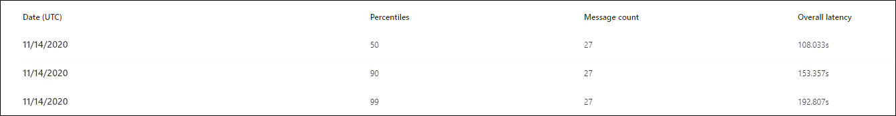

# Ver informes de Defender para Office 365 en el panel Informes del Centro de & cumplimiento

[!INCLUDE [Microsoft 365 Defender rebranding](../includes/microsoft-defender-for-office.md)]

**Se aplica a**
- [Plan 1 y Plan 2 de Microsoft Defender para Office 365](office-365-atp.md)
- [Microsoft 365 Defender](../mtp/microsoft-threat-protection.md)

Microsoft Defender para organizaciones de Office 365 (por ejemplo, suscripciones de Microsoft 365 E5 o complementos de Microsoft Defender para Office 365 Plan 1 o Microsoft Defender para Office 365 Plan 2) contienen una variedad de informes relacionados con la seguridad. Si tiene los permisos [necesarios,](#what-permissions-are-needed-to-view-the-defender-for-office-365-reports)puede ver estos informes en el Centro  de seguridad & Cumplimiento yendo al Panel \> **de informes.** Para ir directamente al panel Informes, abra <https://protection.office.com/insightdashboard> .

## Informe de tipos de archivo de Microsoft Defender para Office 365

El informe de tipos de archivo de Defender para **Office 365** muestra el tipo de archivos detectados como malintencionados por [datos adjuntos seguros.](atp-safe-attachments.md)

 La vista de agregado del informe permite 90 días de filtrado, mientras que la vista de detalles solo permite 10 días de filtrado.

Para ver el informe, abra el Centro de  seguridad [& cumplimiento,](https://protection.office.com)vaya al Panel de informes y seleccione Defender para tipos de \>  archivo de **Office 365.** Para ir directamente al informe, abra <https://protection.office.com/reportv2?id=ATPFileReport> .

> [!NOTE]
> La información de este informe también está disponible en el informe de eliminación de mensajes de [Defender para Office 365.](#defender-for-office-365-message-disposition-report)

### Vista de informes para el informe de tipos de archivo de Defender para Office 365

Están disponibles las siguientes vistas:

- **Ver datos por: Archivo:** El gráfico contiene la siguiente información:

  - **Datos adjuntos malintencionados de Excel**
  - **Datos adjuntos de Flash malintencionados**
  - **Datos adjuntos de PDF malintencionados**
  - **Datos adjuntos malintencionados de PowerPoint**
  - **Direcciones URL malintencionadas**
  - **Datos adjuntos malintencionados de Word**
  - **Datos adjuntos ejecutables malintencionados**
  - **Otros**

  Al mantener el puntero sobre un día determinado (punto de datos), puede  ver el desglose de los tipos de archivos malintencionados detectados por datos adjuntos seguros y la protección [antimalware en EOP.](anti-malware-protection.md)

  

  Si hace clic **en Filtros,** puede modificar el informe con los filtros siguientes:

  - **Fecha de inicio** y **fecha de finalización**
  - Los mismos valores de tipo de archivo que están visibles en el gráfico.

- **Ver datos por: Mensaje:** El gráfico contiene la siguiente información:

  - **Bloquear acceso**
  - **Mensajes reemplazados**
  - **Mensajes supervisados**
  - **Reemplazado por entrega dinámica de correo** electrónico: para obtener más información, vea Entrega dinámica en directivas de datos [adjuntos seguros.](atp-safe-attachments.md#dynamic-delivery-in-safe-attachments-policies)

  

  Si hace clic **en Filtros,** puede modificar el informe con los filtros siguientes:

  - **Fecha de inicio** y **fecha de finalización**
  - Los mismos valores de eliminación de mensajes que están disponibles en el gráfico y el valor **de mensajes pasados** adicionales.

### Vista de tabla de detalles del informe de tipos de archivo de Defender para Office 365

Si hace clic **en Ver tabla** de detalles, el informe proporciona una vista casi en tiempo real de todos los clics que se han hecho en la organización durante los últimos 10 días. La información que se muestra depende del gráfico que estaba viendo:

- **Ver datos por: Archivo:**

  - **Fecha**
  - **Dirección del destinatario**
  - **Dirección del remitente**
  - **Id. de** mensaje: disponible en el **campo de encabezado Id.** de mensaje en el encabezado del mensaje y debe ser único. Un valor de ejemplo es `<08f1e0f6806a47b4ac103961109ae6ef@server.domain>` (tenga en cuenta los corchetes angulares).
  - **Archivo**

  Si hace clic **en Filtros,** puede modificar el informe con los filtros siguientes:

  - **Fecha de inicio** y **fecha de finalización**
  - Los mismos valores de tipo de archivo que están visibles en el gráfico.

- **Ver datos por: Mensaje:**

  - **Fecha**
  - **Dirección del destinatario**
  - **Dirección del remitente**
  - **Id. de mensaje**
  - **Archivo**
  - **Asunto**

  Si hace clic **en Filtros,** puede modificar los resultados con los filtros siguientes:

  - **Fecha de inicio** y **fecha de finalización**
  - Los mismos valores de eliminación de mensajes que están disponibles en el gráfico y el valor **de mensajes pasados** adicionales.

Para volver a la vista informes, haga clic **en Ver informe.**

## Informe de eliminación de mensajes de Microsoft Defender para Office 365

El **informe de eliminación de** mensajes de ATP muestra las acciones que se realizaron para los mensajes de correo electrónico que se detectaron como contenido malintencionado.

Para ver el informe, abra el Centro de  seguridad [& cumplimiento,](https://protection.office.com)vaya al Panel de informes y seleccione Defender para la eliminación de mensajes \>  de **Office 365.** Para ir directamente al informe, abra <https://protection.office.com/reportv2?id=ATPMessageReport> .

> [!NOTE]
> La información de este informe también está disponible en el informe de tipos de archivo de [Defender para Office 365.](#defender-for-office-365-file-types-report)

### Vista de informe para el informe de eliminación de mensajes de Defender para Office 365

Están disponibles las siguientes vistas:

- **Ver datos por: Mensaje:** El gráfico contiene la siguiente información:

  - **Bloquear acceso**
  - **Mensajes reemplazados**
  - **Mensajes supervisados**
  - **Reemplazado por entrega dinámica de correo** electrónico: para obtener más información, vea Entrega dinámica en directivas de datos [adjuntos seguros.](atp-safe-attachments.md#dynamic-delivery-in-safe-attachments-policies)

  

  Si hace clic **en Filtros,** puede modificar el informe con los filtros siguientes:

  - **Fecha de inicio** y **fecha de finalización**
  - Los mismos valores de eliminación de mensajes que están disponibles en el gráfico y el valor **de mensajes pasados** adicionales.

- **Ver datos por: Archivo:** El gráfico contiene la siguiente información:

  - **Datos adjuntos malintencionados de Excel**
  - **Datos adjuntos de Flash malintencionados**
  - **Datos adjuntos de PDF malintencionados**
  - **Datos adjuntos malintencionados de PowerPoint**
  - **Direcciones URL malintencionadas**
  - **Datos adjuntos malintencionados de Word**
  - **Datos adjuntos ejecutables malintencionados**
  - **Otros**

  Al mantener el puntero sobre un día determinado (punto de datos), puede  ver el desglose de los tipos de archivos malintencionados detectados por datos adjuntos seguros y la protección [antimalware en EOP.](anti-malware-protection.md)

  

  Si hace clic **en Filtros,** puede modificar el informe con los filtros siguientes:

  - **Fecha de inicio** y **fecha de finalización**
  - Los mismos valores de tipo de archivo que están visibles en el gráfico.

### Vista de tabla de detalles del informe de eliminación de mensajes de Defender para Office 365

Si hace clic **en Ver tabla** de detalles, el informe proporciona una vista casi en tiempo real de todos los clics que se han hecho en la organización durante los últimos 10 días. La información que se muestra depende del gráfico que estaba viendo:

- **Ver datos por: Mensaje:**

  - **Fecha**
  - **Dirección del destinatario**
  - **Dirección del remitente**
  - **Id. de mensaje**
  - **Archivo**
  - **Asunto**

  Si hace clic **en Filtros,** puede modificar los resultados con los filtros siguientes:

  - **Fecha de inicio** y **fecha de finalización**
  - Los mismos valores de eliminación de mensajes que están disponibles en el gráfico y el valor **de mensajes pasados** adicionales.

- **Ver datos por: Archivo:**

  - **Fecha**
  - **Dirección del destinatario**
  - **Dirección del remitente**
  - **Id. de mensaje**
  - **Archivo**

  Si hace clic **en Filtros,** puede modificar el informe con los filtros siguientes:

  - **Fecha de inicio** y **fecha de finalización**
  - Los mismos valores de tipo de archivo que están visibles en el gráfico.

Para volver a la vista informes, haga clic **en Ver informe.**

## Informe de latencia de correo

El **informe de latencia de correo** muestra una vista agregada de la latencia de entrega y detonación de correo experimentada en la organización. Los tiempos de entrega de correo en el servicio se ven afectados por una serie de factores y el tiempo de entrega absoluto en segundos no suele ser un buen indicador de éxito o un problema. Un tiempo de entrega lento en un día puede considerarse un promedio de tiempo de entrega en otro día, o viceversa. El **informe de latencia de correo** intenta calificar la entrega de mensajes en función de datos estadísticos sobre las horas de entrega observadas de otros mensajes:

- **Percentil 50:** este es el medio para los tiempos de entrega de mensajes. Puede considerar este valor como un tiempo medio de entrega.
- **Percentil 90:** indica una latencia alta para la entrega de mensajes. Solo el 10 % de los mensajes tardó más que este valor en entregarse.
- **Percentil 99:** indica la latencia más alta para la entrega de mensajes.

No se incluyen la latencia de red y del lado cliente.

Para ver el informe, abra el Centro de  seguridad [& cumplimiento,](https://protection.office.com)vaya al Panel de informes y seleccione Informe \>  de latencia **de correo.** Para ir directamente al informe, abra <https://protection.office.com/mailLatencyReport?viewid=P50> .

### Vista de informe para el informe de latencia de correo

Al abrir el informe, la **ficha Percentiles 50** está seleccionada de forma predeterminada.

De forma predeterminada, esta vista contiene un gráfico configurado con los filtros siguientes:

- **Fecha:** los últimos 7 días
- **Vista de mensajes:**
  - Mensajes detonados

En este gráfico se muestran los mensajes organizados en las siguientes categorías:

- **Latencia de entrega de correo**
- **Latencia de detonación**

Al mantener el puntero sobre una categoría en el gráfico, puede ver un desglose de la latencia en cada categoría.

Si hace clic **en Filtrar** en la vista de informe, puede modificar los resultados con los filtros siguientes:

- Todos los mensajes
- Mensajes que contienen datos adjuntos o direcciones URL

Si hace clic en la ficha **Percentiles 90** o en la ficha **Percentiles 99,** se usarán los mismos filtros predeterminados de la vista **Percentiles 50.**

### Vista de tabla de detalles para el informe de latencia de correo

La siguiente información se muestra en la vista de tabla de detalles:

- **Fecha**
- **Percentiles**
- **Recuento de mensajes**
- **Latencia general**

Lo anterior muestra que el 14 de noviembre la latencia media experimentada para todos los mensajes entregados y detonados fue **de 108,033** segundos.

La tabla de detalles contiene la misma información en cada pestaña.

## Informe de estado de protección contra amenazas

El **informe de estado** de protección contra amenazas es una vista única que reúne información sobre el contenido malintencionado y el correo electrónico malintencionado detectado y bloqueado por Exchange Online [Protection](exchange-online-protection-overview.md) (EOP) y Microsoft Defender para Office 365. Para obtener más información, vea [informe de estado de protección contra amenazas.](view-email-security-reports.md#threat-protection-status-report)

## Informe de protección contra amenazas de URL

El **informe de protección contra amenazas de** url proporciona vistas de resumen y tendencias para las amenazas detectadas y las acciones realizadas en los clics de dirección URL como parte de [Vínculos seguros.](atp-safe-links.md) Este informe no tendrá datos de clic de los usuarios en los que la directiva de vínculos seguros aplicada tenga seleccionada la opción No realizar seguimiento de **clics del** usuario.

Para ver el informe, abra el Centro de  seguridad [& cumplimiento,](https://protection.office.com)vaya al Panel de informes y seleccione informe de protección \>  de **direcciones URL.** Para ir directamente al informe, abra <https://protection.office.com/reportv2?id=URLProtectionActionReport> .

> [!NOTE]
> Este es un informe *de tendencias de protección,* lo que significa que los datos representan tendencias en un conjunto de datos más grande. Como resultado, los datos de la vista de agregado no están disponibles en tiempo real aquí, pero los datos de la vista de tabla de detalles lo están, por lo que es posible que vea una ligera discrepancia entre las dos vistas.

### Vista de informe para el informe de protección contra amenazas url

El **informe de protección contra amenazas de** url tiene dos vistas agregadas que se actualizan una vez cada cuatro horas y que muestran los datos de los últimos 90 días:

- **Acción de protección de clics de** DIRECCIÓN URL: muestra el número de clics de dirección URL de los usuarios de la organización y los resultados del clic:

  - **Bloqueado** (se bloqueó al usuario para que no navegara a la dirección URL)
  - **Bloqueado y en el que se ha hecho clic**
  - **Se hizo clic durante el examen**

  Un clic indica que el usuario ha hecho clic en la página de bloqueo al sitio web malintencionado (los administradores pueden deshabilitar el clic en las directivas de vínculos seguros).

  Si hace clic **en Filtros,** puede modificar el informe con los filtros siguientes:

  - **Fecha de inicio** y **fecha de finalización**
  - Las acciones de protección de clics disponibles, además del **valor Permitido** (se permitió al usuario navegar a la dirección URL).

  

- **Clic en la dirección URL por** aplicación: muestra el número de clics de dirección URL de las aplicaciones que admiten vínculos seguros:

  - **Cliente de correo electrónico**
  - **PowerPoint**
  - **Word**
  - **Excel**
  - **OneNote**
  - **Visio**
  - **Teams**
  - **Otros**

  Si hace clic **en Filtros,** puede modificar el informe con los filtros siguientes:

  - **Fecha de inicio** y **fecha de finalización**
  - Las aplicaciones disponibles.

### Vista de tabla de detalles para el informe de protección contra amenazas url

Si hace clic **en Ver** tabla de detalles, el informe proporciona una vista casi en tiempo real de todos los clics que se han hecho en la organización durante los últimos 7 días con los siguientes detalles:

- **Hora de clic**
- **Usuario**
- **URL**
- **Acción**
- **App**

Si hace **clic** en Filtros en la vista de tabla de detalles, puede  filtrar  por los mismos criterios que en la vista de informe y también por dominios o destinatarios separados por comas.

> [!NOTE]
> El **filtro Dominios** hace referencia al dominio de dirección URL que aparece en los resultados del informe. 

Para volver a la vista informes, haga clic **en Ver informe.**

## Informes adicionales para ver

Además de los informes descritos en este artículo, hay disponibles otros informes, como se describe en la tabla siguiente:

****

|Informe|Tema|
|---|---|
|**Explorer** (Microsoft Defender para Office 365 Plan 2) o **detecciones** en tiempo real (Microsoft Defender para Office 365 Plan 1)|[Explorador de amenazas (y detecciones en tiempo real)](threat-explorer.md)|
|**Informes de seguridad de** correo electrónico, como el informe de remitentes y destinatarios principales, el informe de correo de suplantación de identidad y el informe de detecciones de correo no deseado.|[Ver informes de seguridad de correo electrónico en el Centro de seguridad y cumplimiento](view-email-security-reports.md)|
|**Informes de flujo de** correo, como el informe de reenvío, el informe de estado de flujo de correo y el informe de remitentes y destinatarios principales.|[Ver informes de flujo de correo en el Centro de & cumplimiento](view-mail-flow-reports.md)|
|**Seguimiento de url para vínculos seguros** (solo PowerShell). El resultado de este cmdlet muestra los resultados de las acciones de Vínculos seguros en los últimos siete días.|[Get-UrlTrace](https://docs.microsoft.com/powershell/module/exchange/get-urltrace)|
|**Resultados del tráfico de correo para EOP y Microsoft Defender para Office 365** (solo PowerShell). El resultado de este cmdlet contiene información sobre dominio, fecha, tipo de evento, dirección, acción y recuento de mensajes.|[Get-MailTrafficATPReport](https://docs.microsoft.com/powershell/module/exchange/get-mailtrafficatpreport)|
|**Informes de detalles de correo para detecciones de EOP y Defender para Office 365** (solo PowerShell). El resultado de este cmdlet contiene detalles sobre archivos o direcciones URL malintencionados, intentos de suplantación de identidad (phishing), suplantación y otras posibles amenazas en el correo electrónico o los archivos.|[Get-MailDetailATPReport](https://docs.microsoft.com/powershell/module/exchange/get-maildetailatpreport)|
|

## ¿Qué permisos se necesitan para ver los informes de Defender para Office 365?

Para ver y usar los informes descritos en este artículo, debe ser miembro de uno de los siguientes grupos de roles en el Centro de seguridad & cumplimiento:

- **Administración de organizaciones**
- **Administrador de seguridad**
- **Lector de seguridad**
- **Lector global**

Para más información, consulte [Permisos en el Centro de seguridad y cumplimiento](permissions-in-the-security-and-compliance-center.md).

**Nota:** agregar usuarios al rol de Azure Active Directory correspondiente en el Centro de administración de Microsoft  365 proporciona a los usuarios los permisos necesarios en el Centro de seguridad & Cumplimiento y permisos para otras características de Microsoft 365. Para obtener más información, vea [Sobre los roles de administrador](../../admin/add-users/about-admin-roles.md).

## ¿Qué ocurre si los informes no muestran datos?

Si no ve datos en los informes de Defender para Office 365, compruebe que las directivas están configuradas correctamente. Su organización debe tener  directivas [de vínculos](set-up-atp-safe-links-policies.md) seguros y directivas de datos adjuntos seguros definidas para que la protección de Defender para Office 365 esté en su lugar. Vea también [Protección contra correo electrónico no deseado y antimalware.](anti-spam-and-anti-malware-protection.md)

## Temas relacionados

[Informes inteligentes y reportes en el Centro de seguridad y cumplimiento](reports-and-insights-in-security-and-compliance.md)

[Permisos de roles (Azure Active Directory](https://docs.microsoft.com/azure/active-directory/users-groups-roles/directory-assign-admin-roles#role-permissions)
