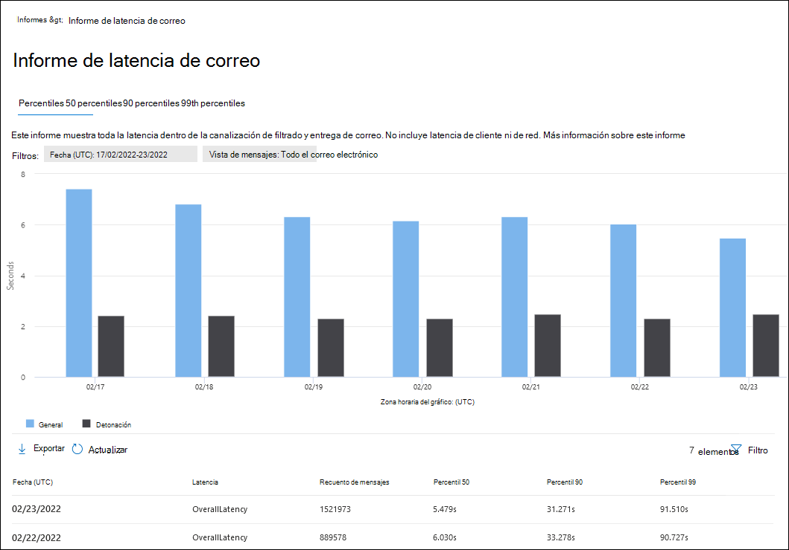
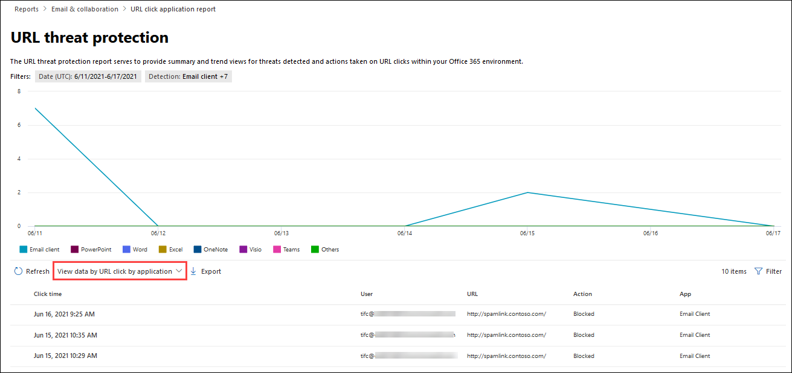

# Ver Defender para obtener Office 365 informes en el portal Microsoft 365 Defender webView Defender for Office 365 reports in the Microsoft 365 Defender portal

[!INCLUDE [Microsoft 365 Defender rebranding](../includes/microsoft-defender-for-office.md)]

**Se aplica a****Applies to**
- [Plan 1 y Plan 2 de Microsoft Defender para Office 365Microsoft Defender for Office 365 plan 1 and plan 2](defender-for-office-365.md)
- [Microsoft 365 DefenderMicrosoft 365 Defender](../defender/microsoft-365-defender.md)

Microsoft Defender para organizaciones Office 365 (por ejemplo, suscripciones Microsoft 365 E5 o Microsoft Defender para Office 365 Plan 1 o Microsoft Defender para complementos del Plan 2 de Office 365) contienen una variedad de informes relacionados con la seguridad.Microsoft Defender for Office 365 organizations (for example, Microsoft 365 E5 subscriptions or Microsoft Defender for Office 365 Plan 1 or Microsoft Defender for Office 365 Plan 2 add-ons) contain a variety of security-related reports. Si tiene los [permisos](#what-permissions-are-needed-to-view-the-defender-for-office-365-reports)necesarios, puede ver estos informes en el  portal de Microsoft 365 Defender yendo a Informes de correo electrónico & colaboración Correo electrónico & informes \>  \> **de colaboración**.If you have the [necessary permissions](#what-permissions-are-needed-to-view-the-defender-for-office-365-reports), you can view these reports in the Microsoft 365 Defender portal by going to **Reports** \> **Email & collaboration** \> **Email & collaboration reports**. Para ir directamente a la página **Informes de colaboración & correo** electrónico, abra <https://security.microsoft.com/emailandcollabreport> .To go directly to the **Email & collaboration reports** page, open <https://security.microsoft.com/emailandcollabreport>.

> [!NOTE]
>
> Los informes de seguridad de correo electrónico que no requieren Defender para Office 365 se describen en Ver informes de seguridad de correo electrónico [en el portal Microsoft 365 Defender correo](view-email-security-reports.md)electrónico .Email security reports that don't require Defender for Office 365 are described in [View email security reports in the Microsoft 365 Defender portal](view-email-security-reports.md).
>
> Los informes relacionados con el flujo de correo se encuentran ahora en el Centro Exchange administración (EAC).Reports that are related to mail flow are now in the Exchange admin center (EAC). Para obtener más información acerca de estos informes, vea Informes de flujo de correo [en el nuevo centro Exchange administración.](/exchange/monitoring/mail-flow-reports/mail-flow-reports)For more information about these reports, see [Mail flow reports in the new Exchange admin center](/exchange/monitoring/mail-flow-reports/mail-flow-reports).

## Caja fuerte Informe de tipos de archivo de datos adjuntosSafe Attachments file types report

> [!NOTE]
> El **informe Caja fuerte tipos de archivos adjuntos** desaparecerá finalmente.The **Safe Attachments file types report** will eventually go away. La misma información está disponible en el informe [de estado de protección contra amenazas](#threat-protection-status-report).The same information is available in the [Threat protection status report](#threat-protection-status-report).

## Caja fuerte Informe de eliminación de mensajes de datos adjuntosSafe Attachments message disposition report

> [!NOTE]
> El **Caja fuerte de eliminación** de mensajes de datos adjuntos desaparecerá.The **Safe Attachments message disposition report** will eventually go away. La misma información está disponible en el informe [de estado de protección contra amenazas](#threat-protection-status-report).The same information is available in the [Threat protection status report](#threat-protection-status-report).

## Informe de latencia de correoMail latency report

El **informe de latencia de** correo muestra una vista agregada de la latencia de entrega y detonación de correo experimentada en su organización.The **Mail latency report** shows you an aggregate view of the mail delivery and detonation latency experienced within your organization. Los tiempos de entrega de correo en el servicio se ven afectados por una serie de factores y el tiempo de entrega absoluto en segundos a menudo no es un buen indicador de éxito o un problema.Mail delivery times in the service are affected by a number of factors, and the absolute delivery time in seconds is often not a good indicator of success or a problem. Un tiempo de entrega lento en un día puede considerarse un promedio de tiempo de entrega en otro día, o viceversa.A slow delivery time on one day might be considered an average delivery time on another day, or vice-versa. Esto intenta calificar la entrega de mensajes en función de datos estadísticos sobre los tiempos de entrega observados de otros mensajes.This tries to qualify message delivery based on statistical data about the observed delivery times of other messages.

La latencia de red y del lado cliente no se incluyen.Client side and network latency are not included.

Para ver el informe, abra el [portal de Microsoft 365 Defender](https://security.microsoft.com), vaya a **Informes** de correo electrónico & \> **colaboración** Correo & \> **informes de colaboración.**To view the report, open the [Microsoft 365 Defender portal](https://security.microsoft.com), go to **Reports** \> **Email & collaboration** \> **Email & collaboration reports**. En la página **Informes de colaboración &** correo electrónico, busque Informe de latencia **de** correo y, a continuación, haga clic en **Ver detalles**.On the **Email & collaboration reports** page, find **Mail latency report** and then click **View details**. Para ir directamente al informe, abra <https://security.microsoft.com/mailLatencyReport> .To go directly to the report, open <https://security.microsoft.com/mailLatencyReport>.

En la **página Informe de latencia de** correo, las pestañas siguientes están disponibles en la página Informe de latencia **de** correo:On the **Mail latency report** page, the following tabs are available on the **Mail latency report** page:

- **Percentil 50:** este es el medio para los tiempos de entrega de mensajes.**50th percentile**: This is the middle for message delivery times. Puede considerar este valor como un tiempo medio de entrega.You can consider this value as an average delivery time. Esta pestaña está seleccionada de forma predeterminada.This tab is selected by default.
- **Percentil 90:** esto indica una latencia alta para la entrega de mensajes.**90th percentile**: This indicates a high latency for message delivery. Solo el 10 % de los mensajes tardaron más de este valor en entregarse.Only 10% of messages took longer than this value to deliver.
- **Percentil 99:** indica la latencia más alta para la entrega de mensajes.**99th percentile**: This indicates the highest latency for message delivery.

Independientemente de la pestaña que seleccione, el gráfico muestra los mensajes organizados en las siguientes categorías:Regardless of the tab you select, the chart shows messages organized into the following categories:

- **Latencia de entrega de correo****Mail delivery latency**
- **Detonaciones****Detonations**

Al pasar el mouse sobre una categoría del gráfico, puede ver un desglose de la latencia en cada categoría.When you hover over a category in the chart, you can see a breakdown of the latency in each category.

Si hace clic **en Filtrar,** puede filtrar el gráfico y la tabla de detalles por los siguientes valores:If you click **Filter**, you can filter both the chart and the details table by the following values:

- **Fecha (UTC):** **fecha de inicio y** fecha de **finalización****Date (UTC)**: **Start date** and **End date**
- **Vista de** mensaje: uno de los siguientes valores:**Message view**: One of the following values:
  - **Todos los mensajes****All messages**
  - **Mensajes que contienen datos adjuntos o direcciones URL****Messages that contain attachments or URLs**
  - **Mensajes detonados****Detonated messages**

Cuando haya terminado de configurar los filtros, haga clic **en Aplicar,** **Cancelar** o **Borrar filtros**.When you're finished configuring the filters, click **Apply**, **Cancel**, or **Clear filters**.

En la tabla de detalles debajo del gráfico, está disponible la siguiente información:In the details table below the chart, the following information is available:

- **Fecha (UTC)****Date (UTC)**
- **Percentiles:** **50**, **90** o **99****Percentiles**: **50**, **90**, or **99**
- **Recuento de mensajes****Message count**
- **Latencia general****Overall latency**

## Informe de estado de protección contra amenazasThreat protection status report

El **informe de estado** de protección contra amenazas es una única vista que reúne información sobre contenido malintencionado y correo electrónico malintencionado detectado y bloqueado por [Exchange Online Protection](exchange-online-protection-overview.md) (EOP) y Microsoft Defender para Office 365.The **Threat protection status** report is a single view that brings together information about malicious content and malicious email detected and blocked by [Exchange Online Protection](exchange-online-protection-overview.md) (EOP) and Microsoft Defender for Office 365. Para obtener más información, vea [Informe de estado de protección contra amenazas](view-email-security-reports.md#threat-protection-status-report).For more information, see [Threat protection status report](view-email-security-reports.md#threat-protection-status-report).

## Informe de protección contra amenazas de urlURL threat protection report

El **informe de protección contra** amenazas url proporciona vistas de resumen y tendencias para las amenazas detectadas y las acciones realizadas en los clics de dirección URL como parte de Caja fuerte [vínculos](safe-links.md).The **URL threat protection report** provides summary and trend views for threats detected and actions taken on URL clicks as part of [Safe Links](safe-links.md). Este informe no tendrá los datos de clic de los usuarios en los que la directiva de vínculos de Caja fuerte tiene seleccionada la opción No realizar seguimiento de los **clics del** usuario.This report will not have click data from users where the Safe Links policy applied has the **Do not track user clicks** option selected.

Para ver el informe, abra el [portal de Microsoft 365 Defender](https://security.microsoft.com), vaya a **Informes** de correo electrónico & \> **colaboración** Correo & \> **informes de colaboración.**To view the report, open the [Microsoft 365 Defender portal](https://security.microsoft.com), go to **Reports** \> **Email & collaboration** \> **Email & collaboration reports**. En la página **Informes de colaboración &** correo electrónico, busque la página protección de direcciones **URL** y, a continuación, haga clic en **Ver detalles**.On the **Email & collaboration reports** page, find **URL protection page** and then click **View details**. Para ir directamente al informe, abra <https://security.microsoft.com/reports/URLProtectionActionReport> .To go directly to the report, open <https://security.microsoft.com/reports/URLProtectionActionReport>.

Las vistas disponibles en la página **informe de protección contra** amenazas de url se describen en las secciones siguientes.The available views on the **URL threat protection** report page are described in the following sections.

> [!NOTE]
> Se trata de un *informe de tendencias de protección,* lo que significa que los datos representan tendencias en un conjunto de datos más grande.This is a *protection trend report*, meaning data represents trends in a larger dataset. Como resultado, los datos de los gráficos no están disponibles en tiempo real aquí, pero los datos de la tabla de detalles lo son, por lo que puede ver una ligera discrepancia entre los dos.As a result, the data in the charts is not available in real time here, but the data in the details table is, so you may see a slight discrepancy between the two. Los gráficos se actualizan una vez cada cuatro horas y contienen datos de los últimos 90 días.The charts are refreshed once every four hours and contain data for the last 90 days.

### Ver datos por acción de protección de clics de dirección URLView data by URL click protection action

La **vista Ver datos por acción** de protección de clics de dirección URL muestra el número de clics de dirección URL de los usuarios de la organización y los resultados del clic:The **View data by URL click protection action** view shows the number of URL clicks by users in the organization and the results of the click:

- **Permitido:** se le permitió al usuario navegar a la dirección URL.**Allowed**: The user was allowed to navigate to the URL.
- **Bloqueado:** se bloqueó al usuario para que no navegara a la dirección URL.**Blocked**: The user was blocked from navigating to the URL.
- **Bloqueado y hecho clic en:** el usuario ha elegido continuar navegando a la dirección URL.**Blocked and clicked through**: The user has chosen to continue navigating to the URL.
- **Se ha hecho clic durante el examen:** el usuario ha hecho clic en el vínculo antes de completar el examen.**Clicked through during scan**: The user has clicked on the link before the scan was complete.

Un clic indica que el usuario ha hecho clic a través de la página de bloqueo en el sitio web malintencionado (los administradores pueden deshabilitar el clic en las directivas de vínculos Caja fuerte usuario).A click indicates that the user has clicked through the block page to the malicious website (admins can disable click through in Safe Links policies).

Si hace clic **en Filtros,** puede modificar el informe y la tabla de detalles seleccionando uno o varios de los siguientes valores en el menú desplegable que aparece:If you click **Filters**, you can modify the report and the details table by selecting one or more of the following values in the flyout that appears:

- **Fecha (UTC):** **fecha de inicio y** fecha de **finalización****Date (UTC)**: **Start date** and **End date**
- **Detección**:**Detection**:
  - **Permitido****Allowed**
  - **Bloqueado****Blocked**
  - **Bloqueado y hecho clic****Blocked and clicked through**
  - **Se ha hecho clic durante el examen****Clicked through during scan**
- **Dominios:** los dominios url enumerados en los resultados del informe.**Domains**: The URL domains listed in the report results.
- **Destinatarios****Recipients**

Cuando haya terminado de configurar los filtros, haga clic **en Aplicar,** **Cancelar** o **Borrar filtros**.When you're finished configuring the filters, click **Apply**, **Cancel**, or **Clear filters**.

La tabla de detalles debajo del gráfico proporciona la siguiente vista casi en tiempo real de todos los clics que se han producido en la organización durante los últimos 7 días:The details table below the chart provides the following near-real-time view of all clicks that happened within the organization for the last 7 days:

- **Hora de hacer clic****Click time**
- **Usuario****User**
- **URL****URL**
- **Action****Action**
- **Aplicación****App**

### Ver datos por dirección URL hacer clic por aplicaciónView data by URL click by application

La **vista Ver datos por dirección URL clic** por aplicación muestra el número de clics de dirección URL de las aplicaciones que admiten Caja fuerte vínculos:The **View data by URL click by application** view shows the number of URL clicks by apps that support Safe Links:

- **Cliente de correo electrónico****Email client**
- **PowerPoint****PowerPoint**
- **Word****Word**
- **Excel****Excel**
- **OneNote****OneNote**
- **Visio****Visio**
- **Teams****Teams**
- **Otros****Others**

Si hace clic **en Filtros,** puede modificar el informe y la tabla de detalles seleccionando uno o varios de los siguientes valores en el menú desplegable que aparece:If you click **Filters**, you can modify the report and the details table by selecting one or more of the following values in the flyout that appears:

- **Fecha (UTC):** **fecha de inicio y** fecha de **finalización****Date (UTC)**: **Start date** and **End date**
- **Detección:** aplicaciones disponibles del gráfico.**Detection**: Available apps from the chart.
- **Dominios:** los dominios url enumerados en los resultados del informe.**Domains**: The URL domains listed in the report results.
- **Destinatarios****Recipients**

Cuando haya terminado de configurar los filtros, haga clic **en Aplicar,** **Cancelar** o **Borrar filtros**.When you're finished configuring the filters, click **Apply**, **Cancel**, or **Clear filters**.

La tabla de detalles debajo del gráfico proporciona la siguiente vista casi en tiempo real de todos los clics que se han producido en la organización durante los últimos 7 días:The details table below the chart provides the following near-real-time view of all clicks that happened within the organization for the last 7 days:

- **Hora de hacer clic****Click time**
- **Usuario****User**
- **URL****URL**
- **Action****Action**
- **Aplicación****App**

## Informes adicionales para verAdditional reports to view

Además de los informes descritos en este artículo, hay otros informes disponibles, como se describe en la tabla siguiente:In addition to the reports described in this article, several other reports are available, as described in the following table:

 

****

|InformeReport|TemaTopic|
|---|---|
|**Explorer** (Microsoft Defender para Office 365 plan 2) o detecciones en tiempo **real** (Microsoft Defender para Office 365 Plan 1)**Explorer** (Microsoft Defender for Office 365 Plan 2) or **real-time detections** (Microsoft Defender for Office 365 Plan 1)|[Explorador de amenazas (y detecciones en tiempo real)Threat Explorer (and real-time detections)](threat-explorer.md)|
|**Informes de seguridad de** correo electrónico, como el informe de remitentes y destinatarios principales, el informe de correo suplantación de identidad y el informe de detecciones de correo no deseado.**Email security reports**, such as the Top senders and recipients report, the Spoof mail report, and the Spam detections report.|[Ver informes de seguridad de correo electrónico en el portal Microsoft 365 Defender correo electrónicoView email security reports in the Microsoft 365 Defender portal](view-email-security-reports.md)|
|**Informes de flujo de** correo, como el informe de reenvío, el informe de estado de flujo de correo y el informe Principales remitentes y destinatarios.**Mail flow reports**, such as the Forwarding report, the Mailflow status report, and the Top senders and recipients report.|[Informes de flujo de correo en el nuevo centro Exchange administraciónMail flow reports in the new Exchange admin center](/exchange/monitoring/mail-flow-reports/mail-flow-reports)|
|**Seguimiento de direcciones URL para Caja fuerte (solo** PowerShell).**URL trace for Safe Links** (PowerShell only). El resultado de este cmdlet muestra los resultados de las acciones Caja fuerte links en los últimos siete días.The output of this cmdlet shows you the results of Safe Links actions over the past seven days.|[Get-UrlTraceGet-UrlTrace](/powershell/module/exchange/get-urltrace)|
|**Resultados de tráfico de correo para EOP** y Microsoft Defender para Office 365 (solo PowerShell).**Mail traffic results for EOP and Microsoft Defender for Office 365** (PowerShell only). El resultado de este cmdlet contiene información sobre Dominio, Fecha, Tipo de evento, Dirección, Acción y Recuento de mensajes.The output of this cmdlet contains information about Domain, Date, Event Type, Direction, Action, and Message Count.|[Get-MailTrafficATPReportGet-MailTrafficATPReport](/powershell/module/exchange/get-mailtrafficatpreport)|
|**Informes de detalles de correo para EOP y Defender para Office 365 (solo** PowerShell).**Mail detail reports for EOP and Defender for Office 365 detections** (PowerShell only). El resultado de este cmdlet contiene detalles sobre archivos o direcciones URL malintencionados, intentos de suplantación, suplantación y otras amenazas potenciales en el correo electrónico o los archivos.The output of this cmdlet contains details about malicious files or URLs, phishing attempts, impersonation, and other potential threats in email or files.|[Get-MailDetailATPReportGet-MailDetailATPReport](/powershell/module/exchange/get-maildetailatpreport)|
|

## ¿Qué permisos se necesitan para ver el Defender para Office 365 informes?What permissions are needed to view the Defender for Office 365 reports?

Para ver y usar los informes descritos en este artículo, debe ser miembro de uno de los siguientes grupos de roles en el portal de Microsoft 365 Defender web:In order to view and use the reports described in this article, you need to be a member of one of the following role groups in the Microsoft 365 Defender portal:

- **Administración de organizaciones****Organization Management**
- **Administrador de seguridad****Security Administrator**
- **Lector de seguridad****Security Reader**
- **Lector global****Global Reader**

Para obtener más información, vea [Permissions in the Microsoft 365 Defender portal](permissions-in-the-security-and-compliance-center.md).For more information, see [Permissions in the Microsoft 365 Defender portal](permissions-in-the-security-and-compliance-center.md).

**Nota:** Agregar usuarios al rol Azure Active Directory correspondiente en el Centro de administración de Microsoft 365 proporciona a los usuarios los permisos necesarios en el _portal_ de Microsoft 365 Defender y permisos para otras características de Microsoft 365.**Note**: Adding users to the corresponding Azure Active Directory role in the Microsoft 365 admin center gives users the required permissions in the Microsoft 365 Defender portal _and_ permissions for other features in Microsoft 365. Para obtener más información, vea [Sobre los roles de administrador](../../admin/add-users/about-admin-roles.md).For more information, see [About admin roles](../../admin/add-users/about-admin-roles.md).

## ¿Qué ocurre si los informes no muestran datos?What if the reports aren't showing data?

Si no ve datos en defender para los informes Office 365, compruebe que las directivas están configuradas correctamente.If you are not seeing data in your Defender for Office 365 reports, double-check that your policies are set up correctly. Su organización debe tener definidas [Caja fuerte de](set-up-safe-links-policies.md) vínculos y Caja fuerte [de](set-up-safe-attachments-policies.md) datos adjuntos para que Defender Office 365 protección esté en su lugar.Your organization must have [Safe Links policies](set-up-safe-links-policies.md) and [Safe Attachments policies](set-up-safe-attachments-policies.md) defined in order for Defender for Office 365 protection to be in place. Vea también Protección contra correo no deseado y [antimalware.](anti-spam-and-anti-malware-protection.md)Also see [Anti-spam and anti-malware protection](anti-spam-and-anti-malware-protection.md).

## Temas relacionadosRelated topics

[Informes e información inteligentes en el portal Microsoft 365 Defender webSmart reports and insights in the Microsoft 365 Defender portal](reports-and-insights-in-security-and-compliance.md)

[Permisos de función (Azure Active DirectoryRole permissions (Azure Active Directory](/azure/active-directory/users-groups-roles/directory-assign-admin-roles#role-permissions)
