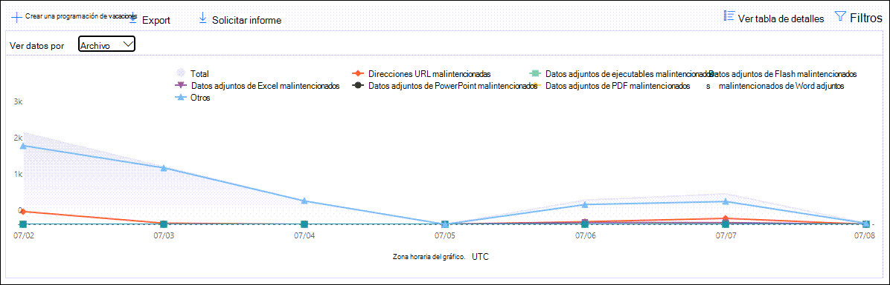
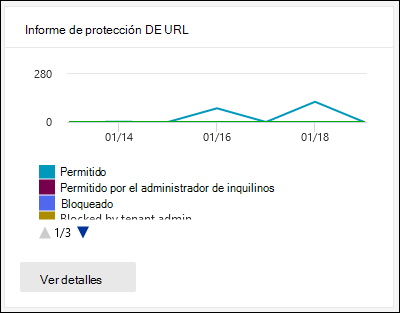

# Ver Defender para obtener Office 365 informes en el panel Informes del portal de Microsoft 365 DefenderView Defender for Office 365 reports in the Reports dashboard in the Microsoft 365 Defender portal

[!INCLUDE [Microsoft 365 Defender rebranding](../includes/microsoft-defender-for-office.md)]

**Se aplica a****Applies to**
- [Plan 1 y Plan 2 de Microsoft Defender para Office 365Microsoft Defender for Office 365 plan 1 and plan 2](defender-for-office-365.md)
- [Microsoft 365 DefenderMicrosoft 365 Defender](../defender/microsoft-365-defender.md)

Microsoft Defender para organizaciones Office 365 (por ejemplo, suscripciones Microsoft 365 E5 o Microsoft Defender para Office 365 Plan 1 o Microsoft Defender para complementos del Plan 2 de Office 365) contienen una variedad de informes relacionados con la seguridad.Microsoft Defender for Office 365 organizations (for example, Microsoft 365 E5 subscriptions or Microsoft Defender for Office 365 Plan 1 or Microsoft Defender for Office 365 Plan 2 add-ons) contain a variety of security-related reports. Si tiene los permisos [necesarios,](#what-permissions-are-needed-to-view-the-defender-for-office-365-reports)puede ver estos informes en el portal de Microsoft 365 Defender yendo a **Informes** de colaboración de correo electrónico informes de \>  \> **colaboración de correo electrónico**.If you have the [necessary permissions](#what-permissions-are-needed-to-view-the-defender-for-office-365-reports), you can view these reports in the Microsoft 365 Defender portal by going to **Reports** \> **Email collaboration** \> **Email collaboration reports**. Para ir directamente al panel Informes, abra <https://security.microsoft.com/emailandcollabreport> .To go directly to the Reports dashboard, open <https://security.microsoft.com/emailandcollabreport>.

## Informe de tipos de archivo de Microsoft Defender para Office 365Defender for Office 365 file types report

El **informe Defender for Office 365 file types muestra** el tipo de archivos detectados como malintencionados por Caja fuerte [Attachments](safe-attachments.md).The **Defender for Office 365 file types report** report shows you the type of files detected as malicious by [Safe Attachments](safe-attachments.md).

 La vista agregada del informe permite 90 días de filtrado, mientras que la vista de detalles solo permite 10 días de filtrado.The aggregate view of the report allows for 90 days of filtering, while the detail view only allows for 10 days of filtering.

Para ver el informe, abra el [portal de Microsoft 365 Defender](https://security.microsoft.com), vaya al Panel de informes y seleccione Defender para Office 365 tipos de  \>  **archivo**.To view the report, open the [Microsoft 365 Defender portal](https://security.microsoft.com), go to **Reports** \> **Dashboard** and select **Defender for Office 365 file types**. Para ir directamente al informe, abra <https://protection.office.com/reportv2?id=ATPFileReport> .To go directly to the report, open <https://protection.office.com/reportv2?id=ATPFileReport>.

> [!NOTE]
> La información de este informe también está disponible en el [informe Defender for Office 365 message disposition](#defender-for-office-365-message-disposition-report).The information in this report is also available in the [Defender for Office 365 message disposition report](#defender-for-office-365-message-disposition-report).

### Vista informe para el informe defender para Office 365 tipos de archivoReport view for the Defender for Office 365 file types report

Están disponibles las siguientes vistas:The following views are available:

- **Ver datos por: Archivo:** El gráfico contiene la siguiente información:**View data by: File**: The chart contains the following information:

  - **Datos adjuntos Excel malintencionados****Malicious Excel attachments**
  - **Datos adjuntos de Flash malintencionados****Malicious Flash attachments**
  - **Datos adjuntos de PDF malintencionados****Malicious PDF attachments**
  - **Datos adjuntos PowerPoint malintencionados****Malicious PowerPoint attachments**
  - **Direcciones URL malintencionadas****Malicious URLs**
  - **Datos adjuntos de Word malintencionados****Malicious Word attachments**
  - **Datos adjuntos ejecutables malintencionados****Malicious executable attachments**
  - **Otros****Others**

  Cuando mantiene el mouse sobre un día determinado (punto de datos), puede ver el desglose de los tipos de archivos malintencionados detectados por [Caja fuerte Attachments](safe-attachments.md) and [anti-malware protection in EOP](anti-malware-protection.md).When you hover over a particular day (data point), you can see the breakdown of types of malicious files that were detected by [Safe Attachments](safe-attachments.md) and [anti-malware protection in EOP](anti-malware-protection.md).

  

  Si hace clic **en Filtros,** puede modificar el informe con los filtros siguientes:If you click **Filters**, you can modify the report with the following filters:

  - **Fecha de inicio** y **fecha de finalización****Start date** and **End date**
  - Los mismos valores de tipo de archivo que están visibles en el gráfico.The same file type values that are visible in the chart.

- **Ver datos por: Mensaje:** El gráfico contiene la siguiente información:**View data by: Message**: The chart contains the following information:

  - **Bloquear acceso****Block access**
  - **Mensajes reemplazados****Messages replaced**
  - **Mensajes supervisados****Messages monitored**
  - **Reemplazado por entrega dinámica de** correo electrónico: para obtener más información, vea Dynamic Delivery in Caja fuerte Attachments [policies](safe-attachments.md#dynamic-delivery-in-safe-attachments-policies).**Replaced by Dynamic Email Delivery**: For more information, see [Dynamic Delivery in Safe Attachments policies](safe-attachments.md#dynamic-delivery-in-safe-attachments-policies).

  

  Si hace clic **en Filtros,** puede modificar el informe con los filtros siguientes:If you click **Filters**, you can modify the report with the following filters:

  - **Fecha de inicio** y **fecha de finalización****Start date** and **End date**
  - Los mismos valores de disposición de mensajes que están disponibles en el gráfico y el valor **de mensajes pasados** adicional.The same message disposition values that are available in the chart, and the additional **Messages passed** value.

### Vista de tabla Detalles del informe Defender para Office 365 tipos de archivoDetails table view for the Defender for Office 365 file types report

Si hace clic **en Ver tabla de detalles,** el informe proporciona una vista casi en tiempo real de todos los clics que ocurren en la organización durante los últimos 10 días.If you click **View details table**, the report provides a near-real-time view of all clicks that happen within the organization for the last 10 days. La información que se muestra depende del gráfico que estaba viendo:The information that's shown depends on the chart you were looking at:

- **Ver datos por: Archivo**:**View data by: File**:

  - **Fecha****Date**
  - **Dirección de destinatario****Recipient address**
  - **Dirección del remitente****Sender address**
  - **Id. de** mensaje: disponible en el **campo de encabezado Id. de** mensaje en el encabezado del mensaje y debe ser único.**Message ID**: Available in the **Message-ID** header field in the message header and should be unique. Un valor de ejemplo es `<08f1e0f6806a47b4ac103961109ae6ef@server.domain>` (tenga en cuenta los corchetes angulares).An example value is `<08f1e0f6806a47b4ac103961109ae6ef@server.domain>` (note the angle brackets).
  - **Archivo****File**

  Si hace clic **en Filtros,** puede modificar el informe con los filtros siguientes:If you click **Filters**, you can modify the report with the following filters:

  - **Fecha de inicio** y **fecha de finalización****Start date** and **End date**
  - Los mismos valores de tipo de archivo que están visibles en el gráfico.The same file type values that are visible in the chart.

- **Ver datos por: Mensaje**:**View data by: Message**:

  - **Fecha****Date**
  - **Dirección de destinatario****Recipient address**
  - **Dirección del remitente****Sender address**
  - **Id. de mensaje****Message ID**
  - **Archivo****File**
  - **Asunto****Subject**

  Si hace clic **en Filtros,** puede modificar los resultados con los filtros siguientes:If you click **Filters**, you can modify the results with the following filters:

  - **Fecha de inicio** y **fecha de finalización****Start date** and **End date**
  - Los mismos valores de disposición de mensajes que están disponibles en el gráfico y el valor **de mensajes pasados** adicional.The same message disposition values that are available in the chart, and the additional **Messages passed** value.

Para volver a la vista informes, haga clic **en Ver informe**.To get back to the reports view, click **View report**.

## Informe de eliminación de mensajes de Microsoft Defender para Office 365Defender for Office 365 message disposition report

El **informe de eliminación de** mensajes atp muestra las acciones que se realizaron para los mensajes de correo electrónico que se detectaron como con contenido malintencionado.The **ATP Message Disposition** report shows you the actions that were taken for email messages that were detected as having malicious content.

Para ver el informe, abra el portal de  [Microsoft 365 Defender](https://security.microsoft.com), vaya a Informes De correo electrónico & colaboración Informes de colaboración Correo electrónico & informes de colaboración y seleccione Defender para obtener Office 365 de \>  \>  **mensajes**.To view the report, open the [Microsoft 365 Defender portal](https://security.microsoft.com), go to **Reports** \> **Email & collaboration** \> **Email & collaboration reports** and select **Defender for Office 365 message disposition**. Para ir directamente al informe, abra <https://protection.office.com/reportv2?id=ATPMessageReport> .To go directly to the report, open <https://protection.office.com/reportv2?id=ATPMessageReport>.

> [!NOTE]
> La información de este informe también está disponible en el informe [Defender for Office 365 file types](#defender-for-office-365-file-types-report).The information in this report is also available in the [Defender for Office 365 file types report](#defender-for-office-365-file-types-report).

### Vista De informe para el informe de eliminación de Office 365 defenderReport view for the Defender for Office 365 message disposition report

Están disponibles las siguientes vistas:The following views are available:

- **Ver datos por: Mensaje:** El gráfico contiene la siguiente información:**View data by: Message**: The chart contains the following information:

  - **Bloquear acceso****Block access**
  - **Mensajes reemplazados****Messages replaced**
  - **Mensajes supervisados****Messages monitored**
  - **Reemplazado por entrega dinámica de** correo electrónico: para obtener más información, vea Dynamic Delivery in Caja fuerte Attachments [policies](safe-attachments.md#dynamic-delivery-in-safe-attachments-policies).**Replaced by Dynamic Email Delivery**: For more information, see [Dynamic Delivery in Safe Attachments policies](safe-attachments.md#dynamic-delivery-in-safe-attachments-policies).

  

  Si hace clic **en Filtros,** puede modificar el informe con los filtros siguientes:If you click **Filters**, you can modify the report with the following filters:

  - **Fecha de inicio** y **fecha de finalización****Start date** and **End date**
  - Los mismos valores de disposición de mensajes que están disponibles en el gráfico y el valor **de mensajes pasados** adicional.The same message disposition values that are available in the chart, and the additional **Messages passed** value.

- **Ver datos por: Archivo:** El gráfico contiene la siguiente información:**View data by: File**: The chart contains the following information:

  - **Datos adjuntos Excel malintencionados****Malicious Excel attachments**
  - **Datos adjuntos de Flash malintencionados****Malicious Flash attachments**
  - **Datos adjuntos de PDF malintencionados****Malicious PDF attachments**
  - **Datos adjuntos PowerPoint malintencionados****Malicious PowerPoint attachments**
  - **Direcciones URL malintencionadas****Malicious URLs**
  - **Datos adjuntos de Word malintencionados****Malicious Word attachments**
  - **Datos adjuntos ejecutables malintencionados****Malicious executable attachments**
  - **Otros****Others**

  Cuando mantiene el mouse sobre un día determinado (punto de datos), puede ver el desglose de los tipos de archivos malintencionados detectados por [Caja fuerte Attachments](safe-attachments.md) and [anti-malware protection in EOP](anti-malware-protection.md).When you hover over a particular day (data point), you can see the breakdown of types of malicious files that were detected by [Safe Attachments](safe-attachments.md) and [anti-malware protection in EOP](anti-malware-protection.md).

  

  Si hace clic **en Filtros,** puede modificar el informe con los filtros siguientes:If you click **Filters**, you can modify the report with the following filters:

  - **Fecha de inicio** y **fecha de finalización****Start date** and **End date**
  - Los mismos valores de tipo de archivo que están visibles en el gráfico.The same file type values that are visible in the chart.

### Vista de tabla De detalles para el informe de Office 365 de eliminación de mensajesDetails table view for the Defender for Office 365 message disposition report

Si hace clic **en Ver tabla de detalles,** el informe proporciona una vista casi en tiempo real de todos los clics que ocurren en la organización durante los últimos 10 días.If you click **View details table**, the report provides a near-real-time view of all clicks that happen within the organization for the last 10 days. La información que se muestra depende del gráfico que estaba viendo:The information that's shown depends on the chart you were looking at:

- **Ver datos por: Mensaje**:**View data by: Message**:

  - **Fecha****Date**
  - **Dirección de destinatario****Recipient address**
  - **Dirección del remitente****Sender address**
  - **Id. de mensaje****Message ID**
  - **Archivo****File**
  - **Asunto****Subject**

  Si hace clic **en Filtros,** puede modificar los resultados con los filtros siguientes:If you click **Filters**, you can modify the results with the following filters:

  - **Fecha de inicio** y **fecha de finalización****Start date** and **End date**
  - Los mismos valores de disposición de mensajes que están disponibles en el gráfico y el valor **de mensajes pasados** adicional.The same message disposition values that are available in the chart, and the additional **Messages passed** value.

- **Ver datos por: Archivo**:**View data by: File**:

  - **Fecha****Date**
  - **Dirección de destinatario****Recipient address**
  - **Dirección del remitente****Sender address**
  - **Id. de mensaje****Message ID**
  - **Archivo****File**

  Si hace clic **en Filtros,** puede modificar el informe con los filtros siguientes:If you click **Filters**, you can modify the report with the following filters:

  - **Fecha de inicio** y **fecha de finalización****Start date** and **End date**
  - Los mismos valores de tipo de archivo que están visibles en el gráfico.The same file type values that are visible in the chart.

Para volver a la vista informes, haga clic **en Ver informe**.To get back to the reports view, click **View report**.

## Informe de latencia de correoMail latency report

El **informe de latencia de** correo muestra una vista agregada de la latencia de entrega y detonación de correo experimentada en su organización.The **Mail latency report** shows you an aggregate view of the mail delivery and detonation latency experienced within your organization. Los tiempos de entrega de correo en el servicio se ven afectados por una serie de factores y el tiempo de entrega absoluto en segundos a menudo no es un buen indicador de éxito o un problema.Mail delivery times in the service are affected by a number of factors, and the absolute delivery time in seconds is often not a good indicator of success or a problem. Un tiempo de entrega lento en un día puede considerarse un promedio de tiempo de entrega en otro día, o viceversa.A slow delivery time on one day might be considered an average delivery time on another day, or vice-versa. El **informe de latencia de correo** intenta calificar la entrega de mensajes en función de datos estadísticos sobre los tiempos de entrega observados de otros mensajes:The **Mail latency report** tries to qualify message delivery based on statistical data about the observed delivery times of other messages:

- **Percentil 50:** este es el medio para los tiempos de entrega de mensajes.**50th percentile**: This is the middle for message delivery times. Puede considerar este valor como un tiempo medio de entrega.You can consider this value as an average delivery time.
- **Percentil 90:** esto indica una latencia alta para la entrega de mensajes.**90th percentile**: This indicates a high latency for message delivery. Solo el 10 % de los mensajes tardaron más de este valor en entregarse.Only 10% of messages took longer than this value to deliver.
- **Percentil 99:** indica la latencia más alta para la entrega de mensajes.**99th percentile**: This indicates the highest latency for message delivery.

La latencia de red y del lado cliente no se incluyen.Client side and network latency are not included.

Para ver el informe, abra el portal de  [Microsoft 365 Defender](https://security.microsoft.com), vaya a Informes De correo electrónico & colaboración Informes de colaboración de correo electrónico & y haga clic en Ver detalles en Informe de latencia \>  \>  **de correo**. To view the report, open the [Microsoft 365 Defender portal](https://security.microsoft.com), go to **Reports** \> **Email & collaboration** \> **Email & collaboration reports** and click **View details** under **Mail latency report**. Para ir directamente al informe, abra <https://security.microsoft.com/mailLatencyReport> .To go directly to the report, open <https://security.microsoft.com/mailLatencyReport>.

### Vista Informe para el informe de latencia de correoReport view for the Mail latency report

Al abrir el informe, la **pestaña Percentiles 50** está seleccionada de forma predeterminada.When you open the report, the **50th percentiles** tab is selected by default.

De forma predeterminada, esta vista contiene un gráfico configurado con los filtros siguientes:By default, this view contains a chart that's configured with the following filters:

- **Fecha:** los últimos 7 días**Date**: The last 7 days
- **Vista de mensaje**:**Message View**:
  - Mensajes detonadosDetonated messages

En este gráfico se muestran los mensajes organizados en las siguientes categorías:This chart shows messages organized into the following categories:

- **Latencia de entrega de correo****Mail delivery latency**
- **Latencia de detonación****Detonation latency**

Al pasar el mouse sobre una categoría del gráfico, puede ver un desglose de la latencia en cada categoría.When you hover over a category in the chart, you can see a breakdown of the latency in each category.

Si hace clic **en Filtrar** en la vista informe, puede modificar los resultados con los filtros siguientes:If you click **Filter** in the report view, you can modify the results with the following filters:

- Todos los mensajesAll messages
- Mensajes que contienen datos adjuntos o direcciones URLMessages that contain attachments or URLs

Si hace clic en la **ficha Percentiles 90** o en la **ficha Percentiles 99,** se usan los mismos filtros predeterminados de la **vista Percentiles 50.**If you click the **90th percentiles** tab or the **99th percentiles** tab, the same default filters from the **50th percentiles** view are used.

### Vista de tabla Detalles del informe de latencia de correoDetails table view for the Mail latency report

La siguiente información se muestra en la vista de tabla de detalles:The following information is shown in the details table view:

- **Fecha****Date**
- **Percentiles****Percentiles**
- **Recuento de mensajes****Message count**
- **Latencia general****Overall latency**

Lo anterior muestra que el 14 de noviembre la latencia media experimentada para todos los mensajes entregados y detonados fue **de 108.033** segundos.The above shows that on November 14 the average latency experienced for all messages delivered and detonated was **108.033** seconds.

La tabla de detalles contiene la misma información en cada pestaña.The details table contains the same information on each tab.

## Informe de estado de protección contra amenazasThreat protection status report

El **informe de estado** de protección contra amenazas es una única vista que reúne información sobre contenido malintencionado y correo electrónico malintencionado detectado y bloqueado por [Exchange Online Protection](exchange-online-protection-overview.md) (EOP) y Microsoft Defender para Office 365.The **Threat protection status** report is a single view that brings together information about malicious content and malicious email detected and blocked by [Exchange Online Protection](exchange-online-protection-overview.md) (EOP) and Microsoft Defender for Office 365. Para obtener más información, vea [Informe de estado de protección contra amenazas](view-email-security-reports.md#threat-protection-status-report).For more information, see [Threat protection status report](view-email-security-reports.md#threat-protection-status-report).

## Informe de protección contra amenazas de urlURL threat protection report

El **informe de protección contra** amenazas url proporciona vistas de resumen y tendencias para las amenazas detectadas y las acciones realizadas en los clics de dirección URL como parte de Caja fuerte [vínculos](safe-links.md).The **URL threat protection report** provides summary and trend views for threats detected and actions taken on URL clicks as part of [Safe Links](safe-links.md). Este informe no tendrá los datos de clic de los usuarios en los que la directiva de vínculos de Caja fuerte tiene seleccionada la opción No realizar seguimiento de los **clics del** usuario.This report will not have click data from users where the Safe Links policy applied has the **Do not track user clicks** option selected.

Para ver el informe, abra el portal  de [Microsoft 365 Defender](https://security.microsoft.com), vaya a Informes de correo electrónico & colaboración Correo electrónico & informes de colaboración y haga clic en Ver detalles en Informe de protección \>  \>  de **direcciones URL**. To view the report, open the [Microsoft 365 Defender portal](https://security.microsoft.com), go to **Reports** \> **Email & collaboration** \> **Email & collaboration reports** and click **View details** under **URL protection report**. Para ir directamente al informe, abra <https://security.microsoft.com/reports/URLProtectionActionReport> .To go directly to the report, open <https://security.microsoft.com/reports/URLProtectionActionReport>.

> [!NOTE]
> Se trata de un *informe de tendencias de protección,* lo que significa que los datos representan tendencias en un conjunto de datos más grande.This is a *protection trend report*, meaning data represents trends in a larger dataset. Como resultado, los datos de la vista de agregado no están disponibles en tiempo real aquí, pero los datos de la vista de tabla de detalles lo son, por lo que es posible que vea una ligera discrepancia entre las dos vistas.As a result, the data in the aggregate view is not available in real time here, but the data in the details table view is, so you may see a slight discrepancy between the two views.

### Vista Informe para el informe de protección contra amenazas de urlReport view for the URL threat protection report

El **informe de protección contra** amenazas de dirección URL tiene dos vistas agregadas que se actualizan una vez cada cuatro horas y que muestran los datos de los últimos 90 días:The **URL threat protection** report has two aggregated views that are refreshed once every four hours that shows data for the last 90 days:

- **Acción de protección de clic de dirección URL:** muestra el número de clics de url de los usuarios de la organización y los resultados del clic:**URL click protection action**: Shows the number of URL clicks by users in the organization and the results of the click:

  - **Bloqueado** (el usuario no ha navegado a la dirección URL)**Blocked** (the user was blocked from navigating to the URL)
  - **Bloqueado y hecho clic (el** usuario ha elegido continuar navegando a la dirección URL)**Blocked and clicked through** (the user has chosen to continue navigating to the URL)
  - **Se ha hecho clic durante el examen** (el usuario ha hecho clic en el vínculo antes de completar el examen)**Clicked through during scan** (the user has clicked on the link before the scan was complete)

  Un clic indica que el usuario ha hecho clic a través de la página de bloqueo en el sitio web malintencionado (los administradores pueden deshabilitar el clic en las directivas de vínculos Caja fuerte usuario).A click indicates that the user has clicked through the block page to the malicious website (admins can disable click through in Safe Links policies).

  Si hace clic **en Filtros,** puede modificar el informe con los filtros siguientes:If you click **Filters**, you can modify the report with the following filters:

  - **Fecha de inicio** y **fecha de finalización****Start date** and **End date**
  - Las acciones de protección de clics disponibles, además del valor **Permitido** (se permitió al usuario navegar a la dirección URL).The available click protection actions, plus the value **Allowed** (the user was allowed to navigate to the URL).

  

- **Clic en dirección URL por** aplicación: muestra el número de clics de dirección URL de las aplicaciones que admiten Caja fuerte vínculos:**URL click by application**: Shows the number of URL clicks by applications that support Safe Links:

  - **Cliente de correo electrónico****Email client**
  - **PowerPoint****PowerPoint**
  - **Word****Word**
  - **Excel****Excel**
  - **OneNote****OneNote**
  - **Visio****Visio**
  - **Teams****Teams**
  - **Otros****Other**

  Si hace clic **en Filtros,** puede modificar el informe con los filtros siguientes:If you click **Filters**, you can modify the report with the following filters:

  - **Fecha de inicio** y **fecha de finalización****Start date** and **End date**
  - Las aplicaciones disponibles.The available applications.

### Vista de tabla de detalles para el informe de protección contra amenazas urlDetails table view for the URL threat protection report

Si hace clic **en Ver** tabla de detalles, el informe proporciona una vista casi en tiempo real de todos los clics que ocurren en la organización durante los últimos 7 días con los siguientes detalles:If you click **View details table**, the report provides a near-real-time view of all clicks that happen within the organization for the last 7 days with the following details:

- **Hora de hacer clic****Click time**
- **Usuario****User**
- **URL****URL**
- **Action****Action**
- **Aplicación****App**

Si hace clic **en Filtros** en la vista tabla de detalles, puede filtrar  por  los mismos criterios que en la vista de informe y también por dominios o destinatarios separados por comas.If you click **Filters** in the details table view, you can filter by the same criteria as in the report view, and also by **Domains** or **Recipients** separated by commas.

> [!NOTE]
> El **filtro Dominios** hace referencia al dominio de dirección URL que aparece en los resultados del informe.The **Domains** filter refers to the URL domain listed in the report results. 

Para volver a la vista informes, haga clic **en Ver informe**.To get back to the reports view, click **View report**.

## Informes adicionales para verAdditional reports to view

Además de los informes descritos en este artículo, hay otros informes disponibles, como se describe en la tabla siguiente:In addition to the reports described in this article, several other reports are available, as described in the following table:

****

|InformeReport|TemaTopic|
|---|---|
|**Explorer** (Microsoft Defender para Office 365 plan 2) o detecciones en tiempo **real** (Microsoft Defender para Office 365 Plan 1)**Explorer** (Microsoft Defender for Office 365 Plan 2) or **real-time detections** (Microsoft Defender for Office 365 Plan 1)|[Explorador de amenazas (y detecciones en tiempo real)Threat Explorer (and real-time detections)](threat-explorer.md)|
|**Informes de seguridad de** correo electrónico, como el informe de remitentes y destinatarios principales, el informe de correo suplantación de identidad y el informe de detecciones de correo no deseado.**Email security reports**, such as the Top senders and recipients report, the Spoof mail report, and the Spam detections report.|[Ver informes de seguridad de correo electrónico en el portal de Microsoft 365 DefenderView email security reports in the Microsoft 365 Defender portal](view-email-security-reports.md)|
|**Informes de flujo de** correo, como el informe de reenvío, el informe de estado de flujo de correo y el informe Principales remitentes y destinatarios.**Mail flow reports**, such as the Forwarding report, the Mailflow status report, and the Top senders and recipients report.|[Ver informes de flujo de correo en el portal de Microsoft 365 DefenderView mail flow reports in the Microsoft 365 Defender portal](view-mail-flow-reports.md)|
|**Seguimiento de direcciones URL para Caja fuerte (solo** PowerShell).**URL trace for Safe Links** (PowerShell only). El resultado de este cmdlet muestra los resultados de las acciones Caja fuerte links en los últimos siete días.The output of this cmdlet shows you the results of Safe Links actions over the past seven days.|[Get-UrlTraceGet-UrlTrace](/powershell/module/exchange/get-urltrace)|
|**Resultados de tráfico de correo para EOP** y Microsoft Defender para Office 365 (solo PowerShell).**Mail traffic results for EOP and Microsoft Defender for Office 365** (PowerShell only). El resultado de este cmdlet contiene información sobre Dominio, Fecha, Tipo de evento, Dirección, Acción y Recuento de mensajes.The output of this cmdlet contains information about Domain, Date, Event Type, Direction, Action, and Message Count.|[Get-MailTrafficATPReportGet-MailTrafficATPReport](/powershell/module/exchange/get-mailtrafficatpreport)|
|**Informes de detalles de correo para EOP y Defender para Office 365 (solo** PowerShell).**Mail detail reports for EOP and Defender for Office 365 detections** (PowerShell only). El resultado de este cmdlet contiene detalles sobre archivos o direcciones URL malintencionados, intentos de suplantación, suplantación y otras amenazas potenciales en el correo electrónico o los archivos.The output of this cmdlet contains details about malicious files or URLs, phishing attempts, impersonation, and other potential threats in email or files.|[Get-MailDetailATPReportGet-MailDetailATPReport](/powershell/module/exchange/get-maildetailatpreport)|
|

## ¿Qué permisos se necesitan para ver el Defender para Office 365 informes?What permissions are needed to view the Defender for Office 365 reports?

Para ver y usar los informes descritos en este artículo, debe ser miembro de uno de los siguientes grupos de roles en el portal de Microsoft 365 Defender:In order to view and use the reports described in this article, you need to be a member of one of the following role groups in the Microsoft 365 Defender portal:

- **Administración de organizaciones****Organization Management**
- **Administrador de seguridad****Security Administrator**
- **Lector de seguridad****Security Reader**
- **Lector global****Global Reader**

Para obtener más información, vea [Permissions in the Microsoft 365 Defender portal](permissions-in-the-security-and-compliance-center.md).For more information, see [Permissions in the Microsoft 365 Defender portal](permissions-in-the-security-and-compliance-center.md).

**Nota:** Agregar usuarios al rol Azure Active Directory correspondiente en el Centro de administración de Microsoft 365 proporciona a los usuarios los permisos necesarios en el _portal_ de Microsoft 365 Defender y permisos para otras características de Microsoft 365.**Note**: Adding users to the corresponding Azure Active Directory role in the Microsoft 365 admin center gives users the required permissions in the Microsoft 365 Defender portal _and_ permissions for other features in Microsoft 365. Para más información, consulte [Sobre los roles de administrador](../../admin/add-users/about-admin-roles.md).For more information, see [About admin roles](../../admin/add-users/about-admin-roles.md).

## ¿Qué ocurre si los informes no muestran datos?What if the reports aren't showing data?

Si no ve datos en defender para los informes Office 365, compruebe que las directivas están configuradas correctamente.If you are not seeing data in your Defender for Office 365 reports, double-check that your policies are set up correctly. Su organización debe tener definidas [Caja fuerte de](set-up-safe-links-policies.md) vínculos y Caja fuerte [de](set-up-safe-attachments-policies.md) datos adjuntos para que Defender Office 365 protección esté en su lugar.Your organization must have [Safe Links policies](set-up-safe-links-policies.md) and [Safe Attachments policies](set-up-safe-attachments-policies.md) defined in order for Defender for Office 365 protection to be in place. Vea también Protección contra correo no deseado y [antimalware.](anti-spam-and-anti-malware-protection.md)Also see [Anti-spam and anti-malware protection](anti-spam-and-anti-malware-protection.md).

## Temas relacionadosRelated topics

[Informes e información inteligentes en el portal de Microsoft 365 DefenderSmart reports and insights in the Microsoft 365 Defender portal](reports-and-insights-in-security-and-compliance.md)

[Permisos de función (Azure Active DirectoryRole permissions (Azure Active Directory](/azure/active-directory/users-groups-roles/directory-assign-admin-roles#role-permissions)
