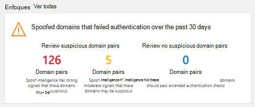
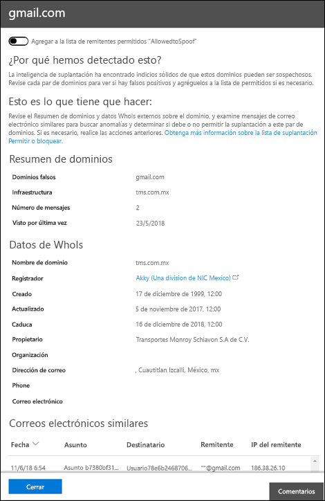

# Tutorial: información de inteligencia sobre la simulación de ATP en Microsoft 365Walkthrough - ATP Spoof intelligence insight in Microsoft 365

En Microsoft 365 organizaciones con la protección contra amenazas avanzada (ATP), puede usar la información de inteligencia de inteligencia de suplantación para determinar rápidamente qué remitentes le envían de forma legítima un correo no autenticado.In Microsoft 365 organizations with Advanced Threat Protection (ATP), you can use the spoof intelligence insight to quickly determine which senders are legitimately sending you unauthenticated email. Al permitirles enviar mensajes suplantados, puede reducir el riesgo de que los falsos positivos vayan a sus usuarios.By permitting them to send spoofed messages, you can reduce the risk of any false positives going to your users. También puede usar la información de inteligencia de inteligencia de suplantación para supervisar y administrar pares de dominios permitidos para proporcionar un nivel adicional de seguridad y evitar que lleguen mensajes no seguros a su organización.You can also use the spoof intelligence insight to monitor and manage permitted domain-pairs to provide an additional layer of security and prevent unsafe messages from arriving in your organization.

Si no está familiarizado con [los informes y la información del centro de seguridad & cumplimiento](reports-and-insights-in-security-and-compliance.md), es posible que le resulte útil ver cómo puede navegar fácilmente desde un panel hasta una perspectiva y las acciones recomendadas.If you're new to [reports and insights in the Security & Compliance Center](reports-and-insights-in-security-and-compliance.md), it might help to see how you can easily navigate from a dashboard to an insight and recommended actions.

Este tutorial es uno de los varios para el centro de seguridad & cumplimiento.This walkthrough is one of several for the Security & Compliance Center. Para obtener información sobre Cómo desplazarse por los informes y la información, vea los tutoriales de la sección temas relacionados.To about navigating reports and insights, see the walkthroughs in the Related topics section.

## ¿Qué necesita saber antes de comenzar?What do you need to know before you begin?

- Abra el Centro de seguridad y cumplimiento en <https://protection.office.com/>.You open the Security & Compliance Center at <https://protection.office.com/>. Para ir directamente a la página del **Panel** de seguridad <https://protection.office.com/searchandinvestigation/dashboard>, use.To go directly to the **Security dashboard** page, use <https://protection.office.com/searchandinvestigation/dashboard>.

  Puede ver la información de inteligencia de inteligencia de suplantación de más de un panel en el centro de seguridad & cumplimiento.You can view the spoof intelligence insight from more than one dashboard in the Security & Compliance Center. Independientemente del panel que esté mirando, la visión proporciona los mismos detalles y le permite realizar rápidamente las mismas tareas.Regardless of which dashboard you're looking at, the insight provides the same details and allows you to quickly perform the same tasks.

- Deberá tener asignados permisos antes de poder llevar a cabo estos procedimientos.You need to be assigned permissions before you can perform these procedures. Para usar el conocimiento de inteligencia de suplantación de identidad, debe ser miembro de los grupos de roles de administración de la **organización**, **Administrador de seguridad**o lector de **seguridad** .To use the spoof intelligence insight, you need to be a member of the **Organization Management**, **Security Administrator**, or **Security Reader** role groups. Para obtener más información acerca de los grupos de roles en el Centro de seguridad y cumplimiento, consulte [Permisos en el Centro de seguridad y cumplimiento](permissions-in-the-security-and-compliance-center.md).For more information about role groups in the Security & Compliance Center, see [Permissions in the Security & Compliance Center](permissions-in-the-security-and-compliance-center.md).

- Puede habilitar y deshabilitar la inteligencia de identidad en las directivas antiphishing de ATP.You enable and disable spoof intelligence in ATP anti-phishing policies. Para obtener más información, consulte [Configure ATP anti-phishing policies en Microsoft 365](configure-atp-anti-phishing-policies.md).For more information, see [Configure ATP anti-phishing policies in Microsoft 365](configure-atp-anti-phishing-policies.md).

- En Microsoft 365 organizaciones con buzones de correo de Exchange Online y en Exchange Online Protection (EOP) independiente sin buzones de correo de Exchange Online, puede usar inteligencia de suplantación de identidad para supervisar y administrar a los remitentes que le envían mensajes sin autenticar.In Microsoft 365 organizations with Exchange Online mailboxes, and in standalone Exchange Online Protection (EOP) without Exchange Online mailboxes, you can use spoof intelligence to monitor and manage senders you are sending you unauthenticated messages. Para obtener más información, consulte [Configuración de inteligencia contra la suplantación de identidad en Microsoft 365 ](learn-about-spoof-intelligence.md).For more information, see [Configure spoof intelligence in Microsoft 365](learn-about-spoof-intelligence.md).

## Abrir el conocimiento de inteligencia de infalsificación en el centro de seguridad & cumplimientoOpen the spoof intelligence insight in the Security & Compliance Center

1. En el centro de seguridad & cumplimiento, vaya a **Threat Management** \> **Dashboard.**In the Security & Compliance Center, go to **Threat Management** \> **Dashboard.**

2. En la fila **información** , busque uno de los siguientes elementos:In the **Insights** row, look for one of the following items:

   - **Inteligencia de identidad habilitada**: la información se denomina **dominios falseados que no superaron la autenticación de los últimos 30 días**.**Spoof intelligence is enabled**: The insight is named **Spoofed domains that failed authentication of the past 30 days**. Este valor es predeterminado.This is the default.

   - La **inteligencia de identidad está deshabilitada**: la información de la **habilitación de la protección contra**la suplantación de identidad y al hacer clic en ella le permite habilitar la inteligencia de identidad.**Spoof intelligence is disabled**: The insight in named **Enable Spoof Protection**, and clicking on it allows you to enable spoof intelligence.

3. El conocimiento del panel muestra la siguiente información:The insight on the dashboard shows you information like this:

   

   Esta visión tiene dos modos:This insight has two modes:

   - **Modo Insight**.**Insight mode**. Si tiene una directiva de suplantación habilitada, la información le mostrará Cuántos correos se vieron afectados por nuestras capacidades de inteligencia empresarial de suplantación en los últimos 30 días.If you have any spoof policy enabled, then the insight shows you how many mails were impacted by our spoof intelligence capabilities over the past 30 days.

   - **Mode if**.**What if mode**. Si no tiene habilitada ninguna directiva de suplantación de identidad, la información le mostrará Cuántos correos se *verían* afectados por nuestras capacidades de inteligencia de suplantación en los últimos 30 días.If you do not have any spoof policy enabled, then the insight shows you how many mails  *would*  have been impacted by our spoof intelligence capabilities over the past 30 days.

   En cualquier caso, los dominios suplantados que se muestran en la información se separan en dos categorías: **pares de dominios sospechosos** y **pares de dominios no sospechosos**.Either way, the spoofed domains displayed in the insight are separated into two categories: **suspicious domain pairs** and **non-suspicious domain pairs**. Estas categorías se subdividen en tres diferentes recipientes para su revisión.These categories are further subdivided into three different buckets for you to review.

   Un **par de dominios** es una combinación de la dirección de y la infraestructura de envío:A **domain pair** is a combination of the From address and the sending infrastructure:

   - La dirección de es la dirección de correo electrónico del remitente que se muestra en los clientes de correo electrónico.The From address is the sender's email address that's displayed in email clients. Esta dirección identifica al autor del correo electrónico.This address identifies the author of the email. Es decir, el buzón de la persona o el sistema responsables de escribir el mensaje.That is, the mailbox of the person or system responsible for writing the message. Esta dirección también se conoce como `5322.From` dirección.This address is also known as the `5322.From` address.

   - La infraestructura de envío o remitente es el dominio de la organización de la búsqueda DNS inversa (registro PTR) de la dirección IP de envío.The sending infrastructure, or sender, is the organizational domain of the reverse DNS lookup (PTR record) of the sending IP address. Si la dirección IP de envío no tiene registro PTR, el remitente se identifica mediante la IP de envío con la máscara de subred 255.255.255.0 en la notación CIDR (/24).If the sending IP address has no PTR record, then the sender is identified by the sending IP with the 255.255.255.0 subnet mask in CIDR notation (/24). Por ejemplo, si la dirección IP es 192.168.100.100, la dirección IP completa del remitente es 192.168.100.100/24.For example, if the IP address is 192.168.100.100 then the complete IP address of the sender is 192.168.100.100/24.

   Los **pares de dominios sospechosos** incluyen:**Suspicious domain pairs** include:

   - **Suplantación de confianza alta**: Microsoft 365 recibió fuertes señales de que estos dominios son sospechosos, en función de los patrones de envío históricos y la puntuación de reputación de los dominios.**High-confidence spoof**: Microsoft 365 received strong signals that these domains are suspicious, based on the historical sending patterns and the reputation score of the domains. Microsoft 365 es muy seguro que los dominios son suplantación de identidad y que los mensajes que se envían desde estos dominios tienen menos probabilidades de ser legítimos.Microsoft 365 is highly confident that the domains are spoofing and that messages sent from these domains are less likely to be legitimate.

   - **Suplantación de confianza moderada**: Microsoft 365 recibió señales medianas que estos dominios son sospechosos, según los patrones de envío históricos y la puntuación de reputación de los dominios.**Moderate confidence spoof**: Microsoft 365 received moderate signals that these domains are suspicious, based on historical sending patterns and the reputation score of the domains. Office 365 está moderadamente seguro de que los dominios son suplantación de identidad y que los mensajes enviados desde estos dominios son legítimos.Office 365 is moderately confident that the domains are spoofing and that messages sent from these domains are legitimate. Este cubo tiene una probabilidad mayor de contener falsos positivos (FPs) que el bucket de suplantación de confianza alta.This bucket has a greater chance of containing false positives (FPs) than the high-confidence spoof bucket.

   - **Pares de dominios no sospechosos** (incluye **suplantación de identidad recuperada**): suplantación de identidad recuperada los dominios que no superaron la autenticación explícita [SPF](how-office-365-uses-spf-to-prevent-spoofing.md), [DKIM](use-dkim-to-validate-outbound-email.md), [DMARC](use-dmarc-to-validate-email.md)) pero pasaron las comprobaciones de autenticación de correo electrónico IMPLÍCITAS ([autenticación compuesta](email-validation-and-authentication.md#composite-authentication)).**Non-suspicious domain pairs** (includes **rescued spoof**): Rescued spoof are domains that have failed the explicit authentication checks [SPF](how-office-365-uses-spf-to-prevent-spoofing.md), [DKIM](use-dkim-to-validate-outbound-email.md), [DMARC](use-dmarc-to-validate-email.md)) but passed our implicit email authentication checks ([composite authentication](email-validation-and-authentication.md#composite-authentication)). Como resultado, Microsoft 365 recuperar el correo en su nombre y no se ha llevado a cabo ninguna acción contra la suplantación de identidad en el mensaje.As a result, Microsoft 365 rescued the mail on your behalf and no anti-spoofing action was taken on the message.

### Ver información detallada sobre los pares de dominios sospechosos desde el conocimiento de inteligencia de suplantaciónView detailed information about suspicious domain pairs from the spoof intelligence insight

1. En el análisis de inteligencia de suplantación de identidad, haga clic en cualquiera de los pares de dominios (alta, moderada o rescatada).On the spoof intelligence insight, click any of the domain pairs (high, moderate, or rescued).

   Aparece la página **Suplantar visión de inteligencia empresarial** , que muestra una lista de remitentes que envían correo no autenticado a su organización.The **Spoof Intelligence insight** page appears showing you a list of senders that are sending unauthenticated mail into your organization. La información de esta página le ayudará a determinar si los mensajes falsos están autorizados o si necesita emprender otras acciones.The information on this page helps you determine whether spoofed messages are authorized, or if you need to take further action. Puede ordenar la información por número de mensajes, fecha de la última detección de la suplantación de identidad, etc.You can sort the information by message count, the date the spoof was last detected, and more. (Por ejemplo, haga clic en encabezados de columna, como **número de mensajes** o **última**vista).(Click column headings, such as **Message count** or **Last seen**, for example.)

2. Seleccione un elemento de la tabla para abrir un panel de detalles que contenga información enriquecida sobre el par de dominios, incluido por qué lo hemos capturado, lo que debe hacer, un resumen de dominio, datos WhoIs sobre el remitente y mensajes de correo electrónico similares que hemos visto en su espacio empresarial del mismo remitente.Select an item in the table to open a details pane that contains rich information about the domain pair, including why we caught this, what you need to do, a domain summary, WhoIs data about the sender, and similar emails we have seen in your tenant from the same sender. Desde aquí, también puede Agregar o quitar el par de dominios de la lista de remitentes seguros de **AllowedToSpoof** .From here, you can also choose to add or remove the domain pair from the **AllowedToSpoof** safe sender list.

   

### Agregar o quitar un dominio de la lista de remitentes seguros de AllowedToSpoofAdd or remove a domain from the AllowedToSpoof safe sender list

Puede Agregar o quitar un dominio de la lista de remitentes seguros de AllowedToSpoof al revisar el par de dominios en el panel de detalles de la información de inteligencia empresarial de suplantación.You add or remove a domain from the AllowedToSpoof safe sender list while reviewing the domain pair in the details pane of the spoof intelligence insight. Simplemente, establezca el botón de alternancia en consecuencia.Simply set the toggle accordingly.

Esto modifica la combinación única de par de dominios del dominio falso y de la infraestructura de envío y no proporciona cobertura para todo el dominio falso o la infraestructura de envío de forma aislada.This modifies the unique domain pair combination of the spoofed domain and the sending infrastructure and does not provide coverage for the entire spoofed domain or the sending infrastructure in isolation.

Por ejemplo, si agrega el siguiente par de dominios a la lista de permitidos del *remitente: "* gmail.com" y envía la *infraestructura* "TMS *. mx.com",* sólo se permitirá la suplantación de correo desde ese par de dominios.For example, if you add the following domain pair to the 'AllowedToSpoof' sender allow list:  *Spoofed Domain*  "gmail.com" and *Sending Infrastructure* "tms *.mx.com",* then only mail from that domain pair will be allowed to spoof. Otros remitentes que intentan imitar "gmail.com" y otros dominios que intentan simular "tms.mx.com" seguirán protegidos por inteligencia de suplantación de identidad.Other senders attempting to spoof "gmail.com", and other domains that "tms.mx.com" attempt to spoof will continue to be protected by spoof intelligence.

## Temas relacionadosRelated topics

[Protección contra suplantación de identidad (phishing) en Microsoft 365Anti-spoofing protection in Microsoft 365](anti-spoofing-protection.md)

[Tutorial: desde un panel o a un reporteWalkthrough - From a dashboard to an insight](from-a-dashboard-to-an-insight.md)

[Tutorial: desde un informe detallado a un reporteWalkthrough - From a detailed report to an insight](from-a-detailed-report-to-an-insight.md)

[Tutorial: desde un reporte a un informe detalladoWalkthrough - From an insight to a detailed report](from-an-insight-to-a-detailed-report.md)