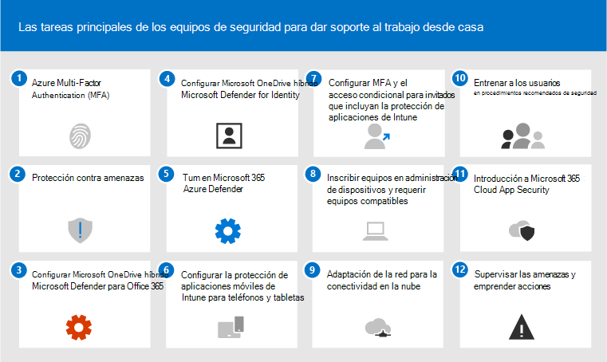

# Las 12 tareas principales para que los equipos de seguridad admitan el trabajo desde casa

Si es como [Microsoft](https://www.microsoft.com/microsoft-365/blog/2020/03/10/staying-productive-while-working-remotely-with-microsoft-teams/) y de pronto se encuentra con el soporte técnico de un personal principalmente basado en el hogar, queremos ayudarle a garantizar que su organización funciona de la forma más segura posible. En este artículo se priorizan las tareas para ayudar a los equipos de seguridad a implementar las capacidades de seguridad más importantes lo antes posible.

Si es una organización pequeña o mediana que usa uno de los planes empresariales de Microsoft, vea estos recursos en su lugar:

- [10 formas principales de proteger los planes de Office 365 y Microsoft 365 para empresas](../admin/security-and-compliance/secure-your-business-data.md)
- [Microsoft 365 para campañas](https://docs.microsoft.com/microsoft-365/campaigns/) (incluye una configuración de seguridad recomendada para Microsoft 365 Empresa)

Para los clientes que usan nuestros planes de empresa, Microsoft le recomienda que complete las tareas que se enumeran en la tabla siguiente que se aplican a su plan de servicio. Si, en lugar de comprar un plan de Microsoft 365 Enterprise, está combinando suscripciones, tenga en cuenta lo siguiente:

- Microsoft 365 E3 incluye Enterprise Mobility + Security (EMS) E3 y Azure AD P1
- Microsoft 365 E5 incluye EMS E5 y Azure AD P2

****

|Paso|Task|Todos los planes de Office 365 Enterprise|Microsoft 365 E3|Microsoft 365 E5|
|---|---|---|---|---|
|1 |[Habilitar Azure AD Multi-Factor Authentication (MFA)](#1-enable-azure-ad-multi-factor-authentication-mfa)||||
|2 |[Protección contra amenazas](#2-protect-against-threats)||||
|3|[Configurar Microsoft Defender para Office 365](#3-configure-microsoft-defender-for-office-365)||||
|4 |[Configurar Microsoft Defender para la identidad](#4-configure-microsoft-defender-for-identity)||||
|5 |[Activar Microsoft 365 Defender](#5-turn-on-microsoft-365-defender)||||
|6 |[Configurar la protección de aplicaciones móviles de Intune para teléfonos y tabletas](#6-configure-intune-mobile-app-protection-for-phones-and-tablets)||||
|7 |[Configurar MFA y el acceso condicional para invitados, incluida la protección de aplicaciones de Intune](#7-configure-mfa-and-conditional-access-for-guests-including-intune-mobile-app-protection)||||
|8 |[Inscribir equipos en la administración de dispositivos y requerir equipos compatibles](#8-enroll-pcs-into-device-management-and-require-compliant-pcs)||||
|9 |[Optimizar la red para la conectividad en la nube](#9-optimize-your-network-for-cloud-connectivity)||||
|10 |[Entrenar a los usuarios](#10-train-users)||||
|11|[Introducción a Microsoft Cloud App Security](#11-get-started-with-microsoft-cloud-app-security)||||
|12 |[Supervisar amenazas y tomar medidas](#12-monitor-for-threats-and-take-action)||||
|

Antes de empezar, compruebe la puntuación de seguridad de [Microsoft 365](https://docs.microsoft.com/microsoft-365/security/mtp/microsoft-secure-score) en el Centro de seguridad de Microsoft 365. Desde un panel centralizado, puede supervisar y mejorar la seguridad de sus identidades, datos, aplicaciones, dispositivos e infraestructura de Microsoft 365. Se le han dado puntos para configurar las características de seguridad recomendadas, realizar tareas relacionadas con la seguridad (como ver informes) o tratar recomendaciones con una aplicación o software de terceros. Las tareas recomendadas en este artículo elevarán la puntuación.

## 1: Habilitar Azure AD Multi-Factor Authentication (MFA)

Lo mejor que puedes hacer para mejorar la seguridad de los empleados que trabajan desde casa es activar MFA. Si aún no tiene procesos en su lugar, trate esto como un piloto de emergencia y asegúrese de que tiene personas de soporte técnico preparadas para ayudar a los empleados que se quedan bloqueados. Como probablemente no puedas distribuir dispositivos de seguridad de hardware, usa la biometría de Windows Hello y las aplicaciones de autenticación de smartphones como Microsoft Authenticator.

Normalmente, Microsoft recomienda dar a los usuarios 14 días para registrar su dispositivo para la autenticación multifactor antes de requerir MFA. Sin embargo, si su personal está trabajando repentinamente desde casa, vaya y requiera MFA como prioridad de seguridad y esté preparado para ayudar a los usuarios que lo necesitan.

La aplicación de estas directivas solo llevará unos minutos, pero estará preparado para dar soporte a los usuarios en los próximos días.

****

|Plan|Recomendación|
|---|---|
|Planes de Microsoft 365 (sin Azure AD P1 o P2)|[Habilitar los valores predeterminados de seguridad en Azure AD](https://docs.microsoft.com/azure/active-directory/fundamentals/concept-fundamentals-security-defaults). Los valores predeterminados de seguridad en Azure AD incluyen MFA para los usuarios y administradores.|
|Microsoft 365 E3 (con Azure AD P1)|Use [Directivas comunes de acceso condicional](https://docs.microsoft.com/azure/active-directory/conditional-access/concept-conditional-access-policy-common) para configurar las directivas siguientes:  - [Requerir MFA para los administradores](https://docs.microsoft.com/azure/active-directory/conditional-access/howto-conditional-access-policy-admin-mfa)  - [Requerir MFA para todos los usuarios](https://docs.microsoft.com/azure/active-directory/conditional-access/howto-conditional-access-policy-all-users-mfa)   - [Bloquear la autenticación heredada](https://docs.microsoft.com/azure/active-directory/conditional-access/howto-conditional-access-policy-block-legacy)|
|Microsoft 365 E5 (con Azure AD P2)|Aprovechando la protección de identidades de Azure AD Identity Protection, empiece a implementar el [conjunto recomendado de directivas de acceso condicional y relacionadas](./office-365-security/identity-access-policies.md) de Microsoft creando estas dos directivas:  - [Exigir la autenticación multifactor (MFA) cuando el riesgo de inicio de sesión es medio o alto](./office-365-security/identity-access-policies.md#require-mfa-based-on-sign-in-risk)  - [Bloquear a los clientes que no sean compatibles con la autenticación moderna](./office-365-security/identity-access-policies.md#block-clients-that-dont-support-multi-factor) - [Los usuarios de riesgo alto tienen que cambiar la contraseña](./office-365-security/identity-access-policies.md#high-risk-users-must-change-password)|
|

## 2: Proteger contra amenazas

Todos los planes de Microsoft 365 incluyen una variedad de características de protección contra amenazas. Mejorar la protección de estas características tarda unos minutos.

- Protección antimalware
- Protección contra archivos y direcciones URL malintencionadas
- Protección contra phishing
- Protección contra correo no deseado

Vea [Protección contra amenazas en Office 365](office-365-security/protect-against-threats.md) para obtener instrucciones que puede usar como punto de partida.

## 3: Configurar Microsoft Defender para Office 365

Microsoft Defender para Office 365, incluido con Microsoft 365 E5 y Office 365 E5, protege su organización contra amenazas malintencionadas que suponen mensajes de correo electrónico, vínculos (URL) y herramientas de colaboración. Esto puede tardar varias horas en configurarse.

Microsoft Defender para Office 365:

- Protege su organización de amenazas de correo electrónico desconocidas en tiempo real mediante sistemas inteligentes que inspeccionan datos adjuntos y vínculos para buscar contenido malintencionado. Estos sistemas automatizados incluyen una plataforma de detonación sólida, heurística y modelos de aprendizaje automático.
- Protege su organización cuando los usuarios colaboran y comparten archivos, mediante la identificación y el bloqueo de archivos malintencionados en sitios de grupo y bibliotecas de documentos.
- Aplica modelos de aprendizaje automático y algoritmos avanzados de detección de suplantación para evitar ataques de suplantación de identidad.

Para obtener información general, incluido un resumen de los planes, vea [Defender para Office 365.](office-365-security/office-365-atp.md)

El administrador global puede configurar estas protecciones:

- [Configurar directivas de vínculos seguros](office-365-security/set-up-atp-safe-links-policies.md)
- [Configurar las opciones globales para vínculos seguros](office-365-security/configure-global-settings-for-safe-links.md)
- [Configurar directivas de datos adjuntos seguros](office-365-security/set-up-atp-safe-attachments-policies.md)

Deberá trabajar con el administrador de Exchange Online y el administrador de SharePoint Online para configurar Defender para Office 365 para estas cargas de trabajo:

- [ATP para SharePoint, OneDrive y Microsoft Teams](office-365-security/atp-for-spo-odb-and-teams.md)

## 4: Configurar Microsoft Defender para la identidad

[Microsoft Defender for Identity](https://docs.microsoft.com/azure-advanced-threat-protection/what-is-atp) es una solución de seguridad basada en la nube que aprovecha las señales locales de Active Directory para identificar, detectar e investigar las amenazas avanzadas, las identidades vulnerables y las acciones internas malintencionadas dirigidas a su organización. Céntrate en esto a continuación porque protege tu infraestructura local y de nube, no tiene dependencias ni requisitos previos y puede proporcionar ventajas inmediatas.

- Ver [Inicios rápidos](https://docs.microsoft.com/azure-advanced-threat-protection/install-atp-step1) de Microsoft Defender para identidades para obtener la configuración rápidamente
- Ver [vídeo: Introducción a Microsoft Defender para la identidad](https://www.youtube.com/watch?reload=9&v=EGY2m8yU_KE)
- Revisar las [tres fases de la implementación de Microsoft Defender for Identity](https://docs.microsoft.com/azure-advanced-threat-protection/what-is-atp#whats-next)

## 5: Activar Microsoft 365 Defender

Ahora que ha configurado Microsoft Defender para Office 365 y Microsoft Defender para Identity, puede ver las señales combinadas de estas funcionalidades en un panel. [Microsoft 365 Defender](https://docs.microsoft.com/microsoft-365/security/mtp/microsoft-threat-protection) reúne alertas, incidentes, investigación y respuesta automatizadas y búsqueda avanzada en cargas de trabajo (Microsoft Defender para Identidad, Defender para Office 365, Microsoft Defender para Endpoint y Microsoft Cloud App Security) en un único panel en [security.microsoft.com.](https://security.microsoft.com)

Después de configurar uno o varios de los servicios de Defender para Office 365, active MTP. Las nuevas características se agregan continuamente a MTP; considere la posibilidad de participar en la recepción de características de vista previa.

- [Más información sobre MTP](https://docs.microsoft.com/microsoft-365/security/mtp/microsoft-threat-protection)
- [Activar MTP](https://docs.microsoft.com/microsoft-365/security/mtp/mtp-enable)
- [Participar en las características de vista previa](https://docs.microsoft.com/microsoft-365/security/mtp/preview)

## 6: Configurar la protección de aplicaciones móviles de Intune para teléfonos y tabletas

Microsoft Intune Mobile Application Management (MAM) le permite administrar y proteger los datos de su organización en teléfonos y tabletas sin administrar estos dispositivos. Aquí se muestra cómo funciona:

- Creas una directiva de protección de aplicaciones (APP) que determina qué aplicaciones de un dispositivo se administran y qué comportamientos se permiten (por ejemplo, impedir que los datos de una aplicación administrada se copien en una aplicación no administrada). Se crea una directiva para cada plataforma (iOS, Android).
- Después de crear las directivas de protección de aplicaciones, debes aplicar estas mediante la creación de una regla de acceso condicional en Azure AD para requerir aplicaciones aprobadas y protección de datos de APLICACIONES.

Las directivas de protección de aplicaciones incluyen muchas opciones de configuración. Afortunadamente, no es necesario obtener información sobre cada configuración y sopesar las opciones. Microsoft facilita la aplicación de una configuración de opciones al recomendar puntos de partida. El [marco de protección de datos que usa directivas de protección de aplicaciones](https://docs.microsoft.com/mem/intune/apps/app-protection-framework) incluye tres niveles entre los que puedes elegir.

Aún mejor, Microsoft coordina este marco de protección de aplicaciones con un conjunto de directivas relacionadas y de acceso condicional que recomendamos que usen todas las organizaciones como punto de partida. Si ha implementado MFA con las instrucciones de este artículo, está a la mitad.

Para configurar la protección de aplicaciones móviles, use las instrucciones de directivas comunes de acceso a dispositivos [e identidades:](./office-365-security/identity-access-policies.md)

 1. Use la guía [aplicar directivas de protección de datos de](./office-365-security/identity-access-policies.md#apply-app-data-protection-policies) APLICACIONES para crear directivas para iOS y Android. Se recomienda el nivel 2 (protección de datos mejorada) para la protección de línea base.
 2. Crear una regla de acceso condicional para [requerir aplicaciones aprobadas y protección de aplicaciones.](./office-365-security/identity-access-policies.md#require-approved-apps-and-app-protection)

## 7: Configurar MFA y el acceso condicional para invitados, incluida la protección de aplicaciones móviles de Intune

A continuación, asegúrese de que puede seguir colaborando y trabajando con invitados. Si está usando el plan de Microsoft 365 E3 e implementó MFA para todos los usuarios, está configurado.

Si usa el plan de Microsoft 365 E5 y está aprovechando Azure Identity Protection para MFA basado en riesgos, debe realizar un par de ajustes (porque Azure AD Identity Protection no se extiende a los invitados):

- Cree una nueva regla de acceso condicional para requerir MFA siempre para invitados y usuarios externos.
- Actualice la regla de acceso condicional de MFA basada en riesgos para excluir invitados y usuarios externos.

Use las instrucciones [de](./office-365-security/identity-access-policies-guest-access.md) actualización de las directivas comunes para permitir y proteger el acceso de invitado y externo para comprender cómo funciona el acceso de invitado con Azure AD y para actualizar las directivas afectadas.

Las directivas de protección de aplicaciones móviles de Intune que creaste, junto con la regla de acceso condicional para requerir aplicaciones aprobadas y protección de aplicaciones, se aplican a las cuentas de invitado y ayudarán a proteger los datos de la organización.

> [!NOTE]
> Si ya has inscrito equipos en la administración de dispositivos para requerir equipos compatibles, también tendrás que excluir las cuentas de invitado de la regla de acceso condicional que exige el cumplimiento del dispositivo.

## 8: Inscribir equipos en la administración de dispositivos y requerir equipos compatibles

Hay varios métodos para inscribir los dispositivos de los empleados. Cada método depende de la propiedad del dispositivo (personal o corporativo), el tipo de dispositivo (iOS, Windows o Android), y los requisitos de administración (restablecimientos, afinidad, bloqueo). Esto puede tardar un poco en ordenarse. Consulta: [Inscribir dispositivos en Microsoft Intune.](https://docs.microsoft.com/mem/intune/enrollment/)

La forma más rápida de empezar es [configurar la inscripción automática para dispositivos Windows 10.](https://docs.microsoft.com/mem/intune/enrollment/quickstart-setup-auto-enrollment)

También puede aprovechar estos tutoriales:

- [Usar Autopilot para inscribir dispositivos Windows en Intune](https://docs.microsoft.com/mem/intune/enrollment/tutorial-use-autopilot-enroll-devices)
- [Usar las características de inscripción de dispositivos corporativos de Apple en Apple Business Manager (ABM) para inscribir dispositivos iOS/iPadOS en Intune](https://docs.microsoft.com/mem/intune/enrollment/tutorial-use-device-enrollment-program-enroll-ios)

Después de inscribir dispositivos, usa las instrucciones de las directivas comunes de [acceso](./office-365-security/identity-access-policies.md) a dispositivos e identidades para crear estas directivas:

- [Definir directivas de cumplimiento de dispositivos:](./office-365-security/identity-access-policies.md#define-device-compliance-policies) la configuración recomendada para Windows 10 incluye la necesidad de protección antivirus. Si tiene Microsoft 365 E5, use Microsoft Defender para Endpoint para supervisar el estado de los dispositivos de los empleados. Asegúrese de que las directivas de cumplimiento para otros sistemas operativos incluyen protección antivirus y software de protección de punto final.
- [Requerir equipos compatibles:](./office-365-security/identity-access-policies.md#require-compliant-pcs-but-not-compliant-phones-and-tablets) esta es la regla de acceso condicional de Azure AD que aplica las directivas de cumplimiento de dispositivos.

Solo una organización puede administrar un dispositivo, así que asegúrese de excluir cuentas de invitado de la regla de acceso condicional en Azure AD. Si no excluye usuarios invitados y externos de las directivas que requieren el cumplimiento de dispositivos, estas directivas bloquearán estos usuarios. Para obtener más información, vea [Actualizar las directivas comunes para permitir y proteger el acceso externo y de invitado.](./office-365-security/identity-access-policies-guest-access.md)

## 9: Optimizar la red para la conectividad en la nube

Si permites rápidamente que la mayor parte de los empleados trabajen desde casa, este cambio repentino de patrones de conectividad puede tener un impacto significativo en la infraestructura de red corporativa. Muchas redes se escalaron y diseñaron antes de adoptar los servicios en la nube. En muchos casos, las redes son tolerantes a los trabajadores remotos, pero no están diseñadas para que todos los usuarios las utilicen de forma remota al mismo tiempo.

Los elementos de red como concentradores de VPN, equipos de salida de red central (como servidores proxy y dispositivos de prevención de pérdida de datos), ancho de banda de Internet central, circuitos MPLS backhaul, capacidad NAT, entre otros, se ponen de pronto bajo una gran presión debido a la carga de toda la empresa que los usa. El resultado final es un rendimiento y productividad deficientes junto con una experiencia de usuario deficiente para los usuarios que se adaptan a trabajar desde casa.

Algunas de las protecciones que tradicionalmente se han proporcionado al enrutar el tráfico a través de una red corporativa las proporcionan las aplicaciones en la nube a las que acceden los usuarios. Si ha llegado a este paso de este artículo, ha implementado un conjunto de sofisticados controles de seguridad en la nube para los datos y servicios de Microsoft 365. Con estos controles en su lugar, es posible que esté listo para enrutar el tráfico de los usuarios remotos directamente a Office 365. Si aún necesita un vínculo VPN para obtener acceso a otras aplicaciones, puede mejorar en gran medida su rendimiento y experiencia de usuario mediante la implementación de túnel dividido. Una vez que haya alcanzado un acuerdo en su organización, un equipo de red bien coordinado podrá hacerlo en un día.

Vea estos recursos en Documentos para obtener más información:

- [Información general: Optimizar la conectividad para usuarios remotos que usan túnel dividido de VPN](https://docs.microsoft.com/Office365/Enterprise/office-365-vpn-split-tunnel)
- [Implementación de túnel dividido de VPN en Office 365](https://docs.microsoft.com/Office365/Enterprise/office-365-vpn-implement-split-tunnel)

Artículos de blog recientes sobre este tema:

- [Cómo optimizar rápidamente el tráfico para el personal remoto & reducir la carga en la infraestructura](https://techcommunity.microsoft.com/t5/office-365-blog/how-to-quickly-optimize-office-365-traffic-for-remote-staff-amp/ba-p/1214571#)
- [Formas alternativas para que los profesionales de seguridad y ti logren controles de seguridad modernos en los escenarios de trabajo remoto únicos actuales](https://www.microsoft.com/security/blog/2020/03/26/alternative-security-professionals-it-achieve-modern-security-controls-todays-unique-remote-work-scenarios/)

## 10: Entrenar a los usuarios

La formación de los usuarios puede ahorrarle mucho tiempo y frustración a los usuarios y al equipo de operaciones de seguridad. Los usuarios expertos tienen menos probabilidades de abrir datos adjuntos o hacer clic en vínculos en mensajes de correo electrónico cuestionables, y es más probable que eviten sitios web sospechosos.

El Manual  de campañas de ciberseguridad de la escuela Desaceditiva de Phish proporciona instrucciones excelentes para establecer una cultura sólida de reconocimiento de la seguridad dentro de su organización, incluida la formación a los usuarios para identificar ataques de suplantación de identidad.

Microsoft 365 proporciona los siguientes recursos para ayudar a informar a los usuarios de su organización:

****

|Concepto|Recursos|
|---|---|
|Microsoft 365|[Caminos de aprendizaje personalizables](https://docs.microsoft.com/office365/customlearning/) 
Estos recursos pueden ayudarle a reunir formación para los usuarios finales de su organización|
|Centro de seguridad de Microsoft 365|[Módulo de aprendizaje: proteger su organización con seguridad inteligente integrada de Microsoft 365](https://docs.microsoft.com/learn/modules/security-with-microsoft-365) 
Este módulo le permite describir cómo funcionan conjuntamente las características de seguridad de Microsoft 365 y para articular las ventajas de estas características de seguridad.|
|Autenticación multifactor|[Comprobación en dos pasos: ¿Cuál es la página de verificación adicional?](https://docs.microsoft.com/azure/active-directory/user-help/multi-factor-authentication-end-user-first-time) 
Este artículo ayuda a los usuarios finales a comprender qué es la autenticación multifactor y por qué se usa en su organización.|
|

Además de esta guía, Microsoft recomienda que los usuarios tomen las acciones descritas en este artículo: Proteger su cuenta y dispositivos de [hackers y malware.](https://support.office.com/article/066d6216-a56b-4f90-9af3-b3a1e9a327d6.aspx) Entre estas acciones se incluyen:

- Uso de contraseñas seguras
- Protección de dispositivos
- Habilitación de características de seguridad en equipos Windows 10 y Mac (para dispositivos no administrados)

Microsoft también recomienda que los usuarios protejan sus cuentas de correo electrónico personales mediante las acciones recomendadas en los siguientes artículos:

- [Ayudar a proteger su Outlook.com de correo electrónico](https://support.microsoft.com/office/a4f20fc5-4307-4ece-8231-6d4d4bd8a9ba)

- [Proteger su cuenta de Gmail con verificación en dos pasos](https://go.microsoft.com/fwlink/p/?linkid=2015688)

## 11: Introducción a Microsoft Cloud App Security

[Microsoft Cloud App Security proporciona](https://docs.microsoft.com/cloud-app-security) una visibilidad enriqueciendo, control sobre los viajes de datos y análisis sofisticados para identificar y combatir ciberamenazas en todos los servicios en la nube. Una vez que empiezas con Cloud App Security, las directivas de detección de anomalías se habilitan automáticamente, pero Cloud App Security tiene un período de aprendizaje inicial de siete días durante el cual no se genera ninguna alerta de detección de anomalías.

Introducción a Cloud App Security ahora. Más adelante puede configurar controles y supervisión más sofisticados.

- [Inicio rápido: Introducción a Cloud App Security](https://docs.microsoft.com/cloud-app-security/getting-started-with-cloud-app-security)
- [Obtener análisis de comportamiento instantáneo y detección de anomalías](https://docs.microsoft.com/cloud-app-security/anomaly-detection-policy)
- [Más información sobre Microsoft Cloud App Security](https://docs.microsoft.com/cloud-app-security/what-is-cloud-app-security)
- [Revisar las nuevas características y capacidades](https://docs.microsoft.com/cloud-app-security/release-notes)
- [Consulta las instrucciones básicas de configuración](https://docs.microsoft.com/cloud-app-security/general-setup)

## 12: Supervisar amenazas y tomar medidas

Microsoft 365 incluye varias formas de supervisar el estado y realizar las acciones adecuadas. El mejor punto de partida es el Centro de seguridad de Microsoft 365 ( ), donde puede ver la puntuación de seguridad de Microsoft de su organización y cualquier alerta o entidad que requiera [https://security.microsoft.com](https://security.microsoft.com) su atención. 

- [Introducción al Centro de seguridad de Microsoft 365](https://docs.microsoft.com/microsoft-365/security/mtp/overview-security-center)
- [Supervisar y ver informes](https://docs.microsoft.com/microsoft-365/security/mtp/monitoring-and-reporting)
- [Ver los portales de seguridad de Microsoft 365](https://docs.microsoft.com/microsoft-365/security/mtp/portals)

## Pasos siguientes

¡Enhorabuena! Ha implementado rápidamente algunas de las protecciones de seguridad más importantes y su organización es mucho más segura. Ahora está listo para avanzar aún más con las capacidades de protección contra amenazas (incluido Microsoft Defender para puntos de conexión), las capacidades de clasificación y protección de datos y la protección de cuentas administrativas. Para obtener un conjunto más profundo y metódico de recomendaciones de seguridad para Microsoft 365, consulte [Microsoft 365 Security for Business Decision Makers (BDMs).](Microsoft-365-security-for-bdm.md)

Visite también el nuevo centro de seguridad de Microsoft [en docs.microsoft.com/security.](https://docs.microsoft.com/security)
