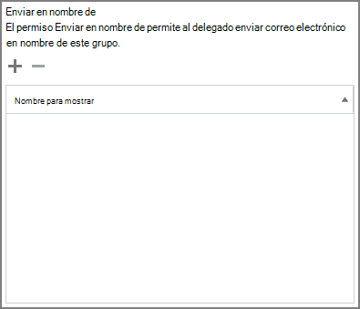

# Permitir que los miembros envíen como o envíen en nombre de un grupo

Un miembro de un Microsoft 365 a quien  se  le hayan concedido permisos Enviar como o Enviar en nombre puede enviar correo electrónico como grupo o en nombre del grupo. (No se pueden conceder estos permisos a los invitados del grupo).

En este artículo se explica cómo un administrador global Exchange puede establecer estos permisos.
  
Por ejemplo, si Megan Bowen  forma parte del grupo  Microsoft 365 de aprendizaje y tiene permisos Enviar como en el grupo, si envía un correo electrónico como grupo, parecerá que el grupo de aprendizaje envió el correo electrónico.  
  
El **permiso Enviar en nombre** permite que un usuario envíe correo electrónico en nombre de un Microsoft 365 grupo. Por ejemplo, si Alex Wilber forma parte del grupo **Marketing** Microsoft 365 y tiene permisos Enviar en nombre y envía un correo electrónico como grupo, el correo electrónico parece que lo envió **Alex Wilber en** nombre de Marketing . 

> [!IMPORTANT]
> Puede configurar **Enviar como** o Enviar en **nombre** de un usuario determinado, pero no ambos. Si configura ambos, se establecerá de forma predeterminada **en Enviar como**.

> [!TIP]
> Consulte [Enviar correo](https://support.microsoft.com/office/0f4964af-aec6-484b-a65c-0434df8cdb6b) electrónico desde o en nombre de un grupo de Microsoft 365 para obtener información sobre cómo usar Outlook y Outlook en la Web para enviar correo electrónico desde un grupo.
    
## Permitir que los miembros envíen correo electrónico como grupo

En esta sección se explica cómo permitir a  los usuarios enviar correo electrónico como grupo en el Centro de administración de Exchange (EAC) en Exchange Online.
  
1. En el <a href="https://go.microsoft.com/fwlink/p/?linkid=2059104" target="_blank">Exchange de administración,</a>vaya a **Grupos de** \> **destinatarios**.
    
2. Seleccione **Editar icono** editar grupo en el grupo que desea permitir que los usuarios envíen  como.   
    
3. Seleccione **delegación de grupo**.
    
4. En la **sección Enviar como,** seleccione el signo para agregar los **+** usuarios que desea enviar como grupo. 
    
    
  
5. Escriba para buscar o seleccionar un usuario de la lista. Seleccione **Aceptar** y **Guardar**.
    
    
  
## Permitir que los miembros envíen correo electrónico en nombre de un grupo

En esta sección se explica cómo permitir a los usuarios enviar correo electrónico en nombre de un grupo en el Centro de administración de Exchange (EAC) en Exchange Online.
  
1. En el <a href="https://go.microsoft.com/fwlink/p/?linkid=2059104" target="_blank">Exchange de administración,</a>vaya a **Grupos de** \> **destinatarios**.
    
2. Seleccione **Editar icono** editar grupo en el grupo que desea permitir que los usuarios envíen  como. 
    
3. Seleccione **delegación de grupo**.
    
4. En la sección Enviar en nombre, seleccione el signo para agregar los **+** usuarios que desea enviar como grupo. 
    
    
  
5. Escriba para buscar o seleccionar un usuario de la lista. Seleccione **Aceptar** y **Guardar**.
    
    

## Artículos relacionados

[Planeación paso a paso de gobierno de colaboración](collaboration-governance-overview.md#collaboration-governance-planning-step-by-step)

[Crear el plan de gobierno de colaboración](collaboration-governance-first.md)

[Obtenga más información sobre Microsoft 365 grupos](https://support.microsoft.com/office/b565caa1-5c40-40ef-9915-60fdb2d97fa2)

[Add-RecipientPermission](/powershell/module/exchange/add-recipientpermission)

[Set-UnifiedGroup](/powershell/module/exchange/set-unifiedgroup)