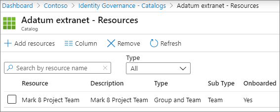

# Para obtener más información, consulte Crear una extranet de B2B con invitados administrados.Create a B2B extranet with managed guests

Puede usar la [administración Azure Active Directory derechos](/azure/active-directory/governance/entitlement-management-overview) para crear una extranet B2B para colaborar con una organización asociada que use Azure Active Directory.You can use [Azure Active Directory Entitlement Management](/azure/active-directory/governance/entitlement-management-overview) to create a B2B extranet to collaborate with a partner organization that uses Azure Active Directory. Esto permite a los usuarios auto inscribirse en el sitio o equipo de extranet y recibir acceso a través de un flujo de trabajo de aprobación.This allows users to self-enroll in the extranet site or team and receive access via an approval workflow.

Con este método de compartir recursos para la colaboración, la organización asociada puede ayudar a mantener y aprobar a los invitados al final, lo que reduce la carga para el departamento de TI y permite a los más familiarizados con el contrato de colaboración administrar el acceso de los usuarios.With this method of sharing resources for collaboration, the partner organization can help maintain and approve the guests on their end, reducing the burden on your IT department and allowing those most familiar with the collaboration agreement to manage user access.

Este artículo describe los pasos para crear un paquete de recursos (en este caso, un sitio o un equipo) que puede compartir con una organización asociada a través de un modelo de registro de acceso autoservicio.This article walks through the steps to create a package of resources (in this case, a site or team) that you can share with a partner organization through a self-service access registration model. 

Antes de comenzar, cree el sitio o el equipo que desea compartir con la organización asociada y habilite para el uso compartido de invitados.Before you begin, create the site or team that you want to share with the partner organization and enable it for guest sharing. Consulta [Colaborar con invitados en un sitio](collaborate-in-site.md) o Colaborar con [invitados de un equipo](collaborate-as-team.md) para obtener más información.See [Collaborate with guests in a site](collaborate-in-site.md) or [Collaborate with guests in a team](collaborate-as-team.md) for more information. También se recomienda revisar Crear un entorno de uso compartido de invitados seguro para obtener información sobre las características de seguridad y cumplimiento que puede usar para ayudar [a](create-secure-guest-sharing-environment.md) mantener las directivas de gobierno al colaborar con invitados.We also recommend that you review [Create a secure guest sharing environment](create-secure-guest-sharing-environment.md) for information about security and compliance features that you can use to help maintain your governance policies when collaborating with guests.

## Requisitos de licenciaLicense requirements

El uso de esta característica requiere una licencia de Azure AD Premium P2.Using this feature requires an Azure AD Premium P2 license. 

Las nubes especializadas, como Azure Germany y Azure China 21Vianet, no están disponibles actualmente para su uso.Specialized clouds, such as Azure Germany and Azure China 21Vianet, are not currently available for use.

## Vídeo de demostraciónVideo demonstration

En este vídeo se muestran los procedimientos descritos en este artículo.This video demonstrates the procedures covered in this article.

> [!VIDEO https://www.microsoft.com/videoplayer/embed/RE4wKUj?autoplay=false]

## Conectar la organización asociadaConnect the partner organization

Para invitar invitados de una organización asociada, debe agregar el dominio del partner como una organización conectada en Azure Active Directory.In order to invite guests from a partner organization, you need to add the partner's domain as a connected organization in Azure Active Directory.

Para agregar una organización conectadaTo add a connected organization
1. En [Azure Active Directory](https://aad.portal.azure.com), haga clic en **Gobierno de identidad**.In [Azure Active Directory](https://aad.portal.azure.com), click **Identity Governance**.
2. Haga clic **en Organizaciones conectadas**.Click **Connected organizations**.
4. Haga clic **en Agregar organización conectada.**Click **Add connected organization**.
5. Escriba un nombre y una descripción para la organización y, a continuación, haga clic **en Siguiente: Directorio + dominio**.Type a name and description for the organization, and then click **Next: Directory + domain**.
6. Haga **clic en Agregar directorio + dominio**.Click **Add directory + domain**.
7. Escriba el dominio de la organización que desea conectar y, a continuación, haga clic en **Agregar**.Type the domain for the organization that you want to connect, and then click **Add**.
8. Haga **clic Conectar** y, a continuación, haga clic en **Siguiente: Patrocinadores**.Click **Connect**, and then click **Next: Sponsors**.
9. Agrega personas de tu organización o de la organización a las que quieras aprobar el acceso para invitados.Add people from your organization or the organization that you're connecting to who you want to approve access for guests.
10. Haga clic en **Siguiente: Revisar + Crear**.Click **Next: Review + Create**.
11. Revise la configuración que ha elegido y, a continuación, haga clic **en Crear**.Review the settings that you've chosen and then click **Create**.

    

## Elegir los recursos que se compartiránChoose the resources to share

El primer paso para seleccionar los recursos que se compartirán con una organización asociada es crear un catálogo que los contenga.The first step in selecting resources to share with a partner organization is to create a catalog to contain them.

Para crear un catálogoTo create a catalog
1. En [Azure Active Directory](https://aad.portal.azure.com), haga clic en **Gobierno de identidad**.In [Azure Active Directory](https://aad.portal.azure.com), click **Identity Governance**.
2. Haga **clic en Catálogos**.Click **Catalogs**.
3. Haga clic **en Nuevo catálogo**.Click **New catalog**.
4. Escriba un nombre y una descripción para el catálogo y asegúrese de que **Enabled** y **Enabled para** usuarios externos estén establecidos en **Sí**.Type a name and description for the catalog and ensure that **Enabled** and **Enabled for external users** are both set to **Yes**.
5. Haga clic en **Crear**.Click **Create**.

   

Una vez creado el catálogo, se agrega el SharePoint sitio o equipo que desea compartir con la organización asociada.Once the catalog has been created, you add the SharePoint site or team that you want to share with the partner organization.

Para agregar recursos a un catálogoTo add resources to a catalog
1. En Gobierno de identidades de Azure AD, haga clic **en Catálogos** y, a continuación, haga clic en el catálogo donde desea agregar recursos.In Azure AD Identity Governance, click **Catalogs**, and then click the catalog where you want to add resources.
2. Haga **clic en Recursos** y, a **continuación, en Agregar recursos.**Click **Resources** and then click **Add resources**.
3. Seleccione los equipos o SharePoint que desea incluir en la extranet y, a continuación, haga clic en **Agregar**.Select the teams or SharePoint sites that you want to include in your extranet, and then click **Add**.

   

Una vez definidos los recursos que desea compartir, el siguiente paso es crear un paquete de acceso, que defina el tipo de acceso que se concede a los usuarios asociados y el proceso de aprobación de los nuevos usuarios asociados que solicitan acceso.Once you've defined the resources that you want to share, the next step is to create an access package, which defines the type of access that partner users are granted and the approval process for new partner users requesting access.

Para crear un paquete de accesoTo create an access package
1. En Gobierno de identidades de Azure AD, haga clic **en Catálogos** y, a continuación, haga clic en el catálogo donde desea crear un paquete de acceso.In Azure AD Identity Governance, click **Catalogs**, and then click the catalog where you want to create an access package.
2. Haga clic **en Paquetes de** Access y, a continuación, **en Nuevo paquete de acceso.**Click **Access packages**, and then click **New access package**.
3. Escriba un nombre y una descripción para el paquete de acceso y, a continuación, haga clic **en Siguiente: Roles de recurso**.Type a name and description for the access package, and then click **Next: Resource roles**.
4. Elija los recursos del catálogo que desea usar para la extranet.Choose the resources from the catalog that you want to use for your extranet.
5. Para cada recurso, en la **columna Rol,** elija el rol de usuario que desea conceder a los invitados que usan la extranet.For each resource, in the **Role** column, choose the user role you want to grant to the guests who use the extranet.
6. Haga **clic en Siguiente: Solicitudes**.Click **Next: Requests**.
7. En **Usuarios que pueden solicitar acceso,** elija Para usuarios que no están en el **directorio**.Under **Users who can request access**, choose **For users not in your directory**.
8. Asegúrese de que **la opción Organizaciones conectadas** específicas está seleccionada y, a continuación, haga clic **en Agregar directorios**.Ensure that the **Specific connected organizations** option is selected, and then click **Add directories**.
9. Elija la organización conectada que agredía anteriormente y, a continuación, haga clic en **Seleccionar**Choose the connected organization that you add earlier, and then click **Select**
10. En **Aprobación,** elija **Sí** para **Requerir aprobación**.Under **Approval**, choose **Yes** for **Require approval**.
11. En **Primer aprobador,** elija uno de los patrocinadores que agregó anteriormente o elija un usuario específico.Under **First approver**, choose one of the sponsors that you added earlier or choose a specific user.
12. Haga **clic en Agregar reserva** y seleccione un aprobador de reserva.Click **Add fallback** and select a fallback approver.
13. En **Habilitar**, elija **Sí**.Under **Enable**, choose **Yes**.
14. Haga **clic en Siguiente: Ciclo de vida**.Click **Next: Lifecycle**.
15. Elija la configuración de expiración y acceso a la revisión que desea usar y, a continuación, haga clic en **Siguiente: Revisar + Crear**.Choose the expiration and access review settings that you want to use, and then click **Next: Review + Create**.
16. Revise la configuración y, a continuación, haga clic **en Crear**.Review your settings, and then click **Create**.

    

Si te asocias con una organización grande, es posible que quieras ocultar el paquete de acceso.If you're partnering with a large organization, you may want to hide the access package. Si el paquete está oculto, los usuarios de la organización asociada no verán el paquete en su portal *de My Access.*If the package is hidden, then users in the partner organization will not see the package on their *My Access* portal. En su lugar, se les debe enviar un vínculo directo para registrarse en el paquete.Instead, they must be sent a direct link to sign up for the package. Ocultar el paquete de acceso puede reducir el número de solicitudes de acceso inadecuadas y también puede ayudar a mantener los paquetes de acceso disponibles organizados en el portal de la organización asociada.Hiding the access package can reduce the number of inappropriate access requests and can also help keep available access packages organized in the partner organization's portal.

Para establecer un paquete de acceso en ocultoTo set an access package to hidden
1. En Gobierno de identidades de Azure AD, haga clic **en Paquetes de Access** y, a continuación, haga clic en el paquete de acceso.In Azure AD Identity Governance, click **Access packages**, and then click your access package.
2. En la **página Información** general, haga clic **en Editar**.On the **Overview** page, click **Edit**.
3. En **Propiedades**, elija **Sí** **para Oculto** y, a continuación, haga clic en **Guardar**.Under **Properties**, choose **Yes** for **Hidden**, and then click **Save**.

   

## Invitar a usuarios asociadosInvite partner users

Si establece el paquete de acceso en oculto, debe enviar un vínculo directo a la organización asociada para que puedan solicitar acceso a su sitio o equipo.If you set the access package to hidden, you need to send a direct link to the partner organization so that they can request access to your site or team.

Para buscar el vínculo del portal de accesoTo find the access portal link
1. En Gobierno de identidades de Azure AD, haga clic **en Paquetes de Access** y, a continuación, haga clic en el paquete de acceso.In Azure AD Identity Governance, click **Access packages**, and then click your access package.
2. En la **página Información** general, haga clic en Copiar **en el** portapapeles para el vínculo Portal de **My Access**.On the **Overview** page, click **Copy to clipboard** link for the **My Access portal link**.

   

Una vez copiado el vínculo, puede compartirlo con su contacto en la organización asociada y puede enviarlo a los usuarios de su equipo de colaboración.Once you have copied the link, you can share it with your contact at the partner organization and they can send it to the users on their collaboration team.

## Vea tambiénSee Also

[Crear un entorno seguro de uso compartido para invitadosCreate a secure guest sharing environment](create-secure-guest-sharing-environment.md)