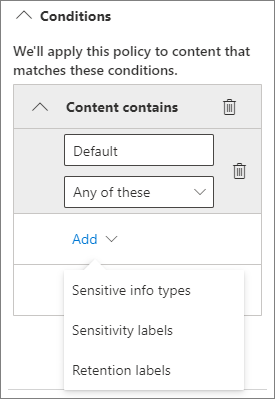

# Prácticas recomendadas para compartir archivos y carpetas con usuarios no autenticados.Best practices for sharing files and folders with unauthenticated users

El uso compartido no autenticado (los vínculos para *Cualquiera* ) puede ser práctico y útil en diversos escenarios.Unauthenticated sharing ( *Anyone* links) can be convenient and is useful in various scenarios. Los vínculos para *Cualquiera* son la manera más fácil de compartir: los usuarios pueden abrir el vínculo sin autenticación y tienen la libertad de compartirlo con otros usuarios.*Anyone* links are the easiest way to share: people can open the link without authentication and are free to pass it on to others.

Por lo general, no todo el contenido de una organización es adecuado para el uso compartido no autenticado.Usually, not all content in an organization is appropriate for unauthenticated sharing. Este artículo describe las opciones disponibles para ayudarle a crear un entorno en el que los usuarios puedan compartir sin autenticarse archivos y carpetas, pero donde existan medidas de seguridad para ayudar a proteger el contenido de su organización.This article covers the options available to help you create an environment where your users can use unauthenticated sharing of files and folders, but where there are safeguards in place to help protect your organization's content.

> [!NOTE]
> Para que funcione el uso compartido sin autenticarse, debe habilitarlo para su organización y para el sitio individual o el equipo que lo utilizará.For unauthenticated sharing to work, you must enable it for your organization and for the individual site or team that you'll be using. Consulte [Colaborar con personas fuera de su organización](collaborate-with-people-outside-your-organization.md) para ver el escenario que quiere habilitar.See [Collaborating with people outside your organization](collaborate-with-people-outside-your-organization.md) for the scenario that you want to enable.

## Establezca una fecha de expiración de los vínculos para CualquieraSet an expiration date for Anyone links

A menudo, los archivos se almacenan en sitios, grupos y equipos durante largos períodos de tiempo.Files are often stored in sites, groups, and teams for long periods of time. En ocasiones, hay directivas de retención de datos que requieren que se conserven archivos durante años.Occasionally there are data retention policies that require files to be retained for years. Si esos archivos se comparten con usuarios no autenticados, esto podría originar un acceso inesperado y cambios en los archivos en el futuro.If such files are shared with unauthenticated people, this could lead to unexpected access and changes to files in the future. Para mitigar esta posibilidad, puede configurar una fecha de expiración de los vínculos para *Cualquiera*.To mitigate this possibility, you can configure an expiration time for *Anyone* links.

Una vez que el vínculo para *Cualquiera* haya expirado, ya no podrá usarse para acceder al contenido.Once an *Anyone* link expires, it can no longer be used to access content.

Establezca una fecha de expiración para los vínculos para Cualquiera a través de la organizaciónTo set an expiration date for Anyone links across the organization

1. Abra el [Centro de administración de SharePoint](https://admin.microsoft.com/sharepoint).Open the [SharePoint admin center](https://admin.microsoft.com/sharepoint).
2. En el panel de navegación izquierdo, haga clic en **Uso compartido**.In the left navigation, click **Sharing**.
3. En la **Elegir opciones de permisos y expiración para vínculos para Cualquiera** , seleccione la casilla **Los vínculos deben expirar dentro de este número de días**.Under **Choose expiration and permissions options for Anyone links** , select the **These links must expire within this many days** check box. 
   
4. Escriba un número de días en el cuadro y después haga clic en **Guardar**.Type a number of days in the box, and then click **Save**.

Establezca una fecha de expiración para los vínculos para Cualquiera de un sitio concretoTo set an expiration date for Anyone links on a specific site

1. Abra el [Centro de administración de SharePoint](https://admin.microsoft.com/sharepoint).Open the [SharePoint admin center](https://admin.microsoft.com/sharepoint).
2. En el panel de navegación izquierdo, expanda **Sitios** y, después, haga clic en **Sitios activos**.In the left navigation, expand **Sites** , and then click **Active sites**.
3. Seleccione el sitio web que quiera cambiar y haga clic en **Uso compartido**.Select the site you want to change, and then click **Sharing**.
4. En **Configuración avanzada para los vínculos para Cualquiera** , en **Expiración de los vínculos para Cualquiera** , desactive la casilla **Igual que la configuración de nivel de organización**.Under **Advanced settings for Anyone links** , under **Expiration of Anyone links** , clear the **Same as organization-level setting** check box. 
   
5. Seleccione la opción **Los vínculos deben expirar dentro de este número de días** y escriba un número de días en el cuadro.Select the **These links must expire within this many days** option, and type a number of days in the box.
6. Haga clic en **Guardar**.Click **Save**.

Tenga en cuenta que una vez que el vínculo para *Cualquiera* expire, el archivo o la carpeta se podrá volver a compartir con un nuevo vínculo para *Cualquiera*.Note that once an *Anyone* link expires, the file or folder can be re-shared with a new *Anyone* link.

Puede establecer la caducidad del vínculo para *Cualquiera* para un OneDrive específico con [Set-SPOSite](https://docs.microsoft.com/powershell/module/sharepoint-online/set-sposite).You can set *Anyone* link expiration for a specific OneDrive by using [Set-SPOSite](https://docs.microsoft.com/powershell/module/sharepoint-online/set-sposite).

## Establezca permisos de vínculosSet link permissions

De forma predeterminada, los vínculos para *Cualquiera* para un archivo permiten a los usuarios editar el archivo, mientras que los vínculos para *Cualquiera* para una carpeta permiten a los usuarios ver, editar los archivos, y cargar archivos nuevos en la carpeta.By default, *Anyone* links for a file allow people to edit the file, and *Anyone* links for a folder allow people to edit and view files, and upload new files to the folder. Puede cambiar estos permisos para los archivos y las carpetas independientemente de si está en modo solo vista.You can change these permissions for files and for folders independently to view-only.

Si desea permitir el uso compartido sin autenticarse, pero le preocupa que los usuarios sin autenticación modifiquen el contenido de su organización, considere la posibilidad de configurar los permisos de archivos y carpetas al modo **Vista**.If you want to allow unauthenticated sharing, but are concerned about unauthenticated people modifying your organization's content, consider setting the file and folder permissions to **View**.

Establezca los permisos para los vínculos para Cualquiera a través de la organizaciónTo set permissions for Anyone links across the organization

1. Abra el [Centro de administración de SharePoint](https://admin.microsoft.com/sharepoint).Open the [SharePoint admin center](https://admin.microsoft.com/sharepoint).
2. En el panel de navegación izquierdo, haga clic en **Uso compartido**.In the left navigation, click **Sharing**.
3. En **Configuración avanzada de vínculos para "Cualquiera"** , seleccione los permisos de los archivos y carpetas que quiera usar.Under **Advanced settings for "Anyone" links** , select the file and folder permissions that you want to use. 
   

Con los vínculos para *Cualquiera* que se establecen en **Vista** , los usuarios pueden seguir compartiendo archivos y carpetas con los invitados y concederles permisos de edición mediante vínculos para *Personas específicas*.With *Anyone* links set to **View** , users can still share files and folders with guests and give them edit permissions by using *Specific people* links. Estos vínculos requieren la autenticación de los usuarios externos a la organización. Puede realizar un seguimiento de la actividad de los invitados en los archivos y carpetas compartidos con dichos vínculos.These links require people outside your organization to authenticate as guests, and you can track and audit guest activity on files and folders shared with these links.

## Establezca el tipo de vínculo predeterminado para que solo funcione para las personas de su organizaciónSet default link type to only work for people in your organization

Cuando *Cualquiera* está habilitado para su organización, el vínculo de uso compartido predeterminado está generalmente establecido para **Cualquiera**.When *Anyone* sharing is enabled for your organization, the default sharing link is normally set to **Anyone**. Aunque esto puede resultar conveniente para los usuarios, puede aumentar el riesgo de un uso compartido involuntario sin autenticarse.While this can be convenient for users, it can increase the risk of unintentional unauthenticated sharing. Si un usuario olvida cambiar el tipo de vínculo mientras comparte un documento confidencial, podría crear accidentalmente un vínculo de uso compartido que no requiera autenticación.If a user forgets to change the link type while sharing a sensitive document, they might accidentally create a sharing link that doesn't require authentication.

Para mitigar este riesgo, puede cambiar la configuración de vínculo predeterminado a un vínculo que solo funcione para las personas de su organización.You can mitigate this risk by changing the default link setting to a link that only works for people inside your organization. Los usuarios que quieran compartir con otros usuarios no autenticados tendrían que seleccionar esa opción específicamente.Users who want to share with unauthenticated people would then have to specifically select that option.

Para establecer el vínculo de uso compartido de archivos y carpetas predeterminado para la organizaciónTo set the default file and folder sharing link for the organization
1. Abra el [Centro de administración de SharePoint](https://admin.microsoft.com/sharepoint).Open the [SharePoint admin center](https://admin.microsoft.com/sharepoint).
2. En el panel de navegación izquierdo, haga clic en **Uso compartido**.In the left navigation, click **Sharing**.
3. En **Vínculos de archivos y carpetas** , seleccione **Solo personas de la organización**.Under **File and folder links** , select **Only people in your organization**.

   

4. Haga clic en **Guardar**Click **Save**

Para establecer el vínculo de uso compartido de archivos y carpetas predeterminado para un sitio web concretoTo set the default file and folder sharing link for a specific site
1. Abra el [Centro de administración de SharePoint](https://admin.microsoft.com/sharepoint).Open the [SharePoint admin center](https://admin.microsoft.com/sharepoint).
2. En el panel de navegación izquierdo, expanda **Sitios** y, después, haga clic en **Sitios activos**.In the left navigation, expand **Sites** , and then click **Active sites**.
3. Seleccione el sitio web que quiera cambiar y haga clic en **Uso compartido**.Select the site you want to change, and then click **Sharing**.
4. En **Tipo de vínculo de uso compartido predeterminado** , desactive la casilla **Igual que la configuración de nivel de organización**.Under **Default sharing link type** ,  clear the **Same as organization-level setting** check box.

   

5. Seleccione la opción **Solo personas de la organización** y haga clic en **Guardar**.Select the **Only people in your organization** option and click **Save**.

## Impida el uso compartido no autenticado de contenido confidencialPrevent unauthenticated sharing of sensitive content

Puede usar la [prevención de pérdida de datos (DLP)](https://docs.microsoft.com/microsoft-365/compliance/data-loss-prevention-policies) para evitar el uso compartido no autenticado de contenido confidencial.You can use [data loss prevention (DLP)](https://docs.microsoft.com/microsoft-365/compliance/data-loss-prevention-policies) to prevent unauthenticated sharing of sensitive content. La prevención de pérdida de datos puede actuar basándose en la etiqueta de confidencialidad, en la etiqueta de retención o en la información confidencial del archivo en sí.Data loss prevention can take action based on a file's sensitivity label, retention label, or sensitive information in the file itself.

Para crear una regla DLPTo create a DLP rule
1. En el centro de administración del centro de cumplimiento de Microsoft 365, vaya a [Prevención de pérdida de datos](https://compliance.microsoft.com/datalossprevention).In the Microsoft 365 compliance admin center, go to the [Data loss prevention page](https://compliance.microsoft.com/datalossprevention).
2. Haga clic en **Crear directiva**.Click **Create policy**.
3. Elija **Personalizado** y haga clic en **Siguiente**.Choose **Custom** and click **Next**.
4. Escriba el nombre de la directiva y haga clic en **Siguiente**.Type a name for the policy and click **Next**.
5. En la página **Ubicaciones en las que aplicar la directiva** desactive todas las páginas de configuración excepto **Sitios de SharePoint** y **Cuentas de OneDrive** y, a continuación, haga clic en **Siguiente**.On the **Locations to apply the policy** page turn off all settings except **SharePoint sites** and **OneDrive accounts** , and then click **Next**.
6. En la página **Definir configuración de directiva** , haga clic en **Siguiente**.On the **Define policy settings** page, click **Next**.
7. En la página **Personalizar las reglas DLP avanzadas** , haga clic en **Crear regla** y escriba un nombre para la regla.On the **Customize advanced DLP rules** page, click **Create rule** and type a name for the rule.
8. En **Condiciones** , haga clic en **Agregar condición** y elija **El contenido incluye**.Under **Conditions** , click **Add condition** , and choose **Content contains**.
9. Haga clic en **Agregar** y elija el tipo de información para el que desea evitar el uso compartido no autenticado.Click **Add** and choose the type of information for which you want to prevent unauthenticated sharing.

   

10. En **Acciones** haga clic en **Agregar una acción** y elija **Restringir el acceso o cifrar el contenido en la ubicaciones de Microsoft 365**.Under **Actions** click **Add an action** and choose **Restrict access or encrypt the content in Microsoft 365 locations**.
11. Active la casilla **Restringir el acceso o cifrar el contenido de las ubicaciones de Microsoft 365** y, después, elija la opción **Solo personas a las que se les ha concedido el acceso al contenido mediante las opciones "Cualquiera con el vínculo"**.Select the **Restrict access or encrypt the content in Microsoft 365 locations** check box and then choose the **Only people who were given access to the content through the "Anyone withe the link" options** option.

      

12. Haga clic en **Guardar** y, a continuación, en **Siguiente**.Click **Save** and then click **Next**.
13. Elija las opciones de prueba y haga clic en **Siguiente**.Choose your test options and click **Next**.
14. Haga clic en **Enviar** y después en **Listo**.Click **Submit** , and then click **Done**.

## Protéjase contra archivos maliciososProtect against malicious files

Cuando permite que los usuarios anónimos carguen archivos, aumenta el riesgo de que alguien cargue un archivo malintencionado.When you allow anonymous users to upload files, you're at an increased risk of someone uploading a malicious file. En Microsoft 365, puede usar la característica *Datos adjuntos seguros* en Microsoft Defender para Office 365, para analizar automáticamente los archivos cargados y los archivos en cuarentena que se encuentren como no seguros.In Microsoft 365, you can use the *Safe Attachments* feature in Defender for Office 365 to automatically scan uploaded files and quarantine files that are found to be unsafe.

Para activar los datos adjuntos segurosTo turn on safe attachments
1. Abra la página [Datos adjuntos seguros ATP](https://protection.office.com/safeattachmentv2) en el Centro de seguridad y cumplimiento.Open the [ATP Safe Attachments page](https://protection.office.com/safeattachmentv2) in the Security and Compliance admin center.
2. Haga clic en **Configuración global**.Click **Global settings**.
3. Habilite ATP para SharePoint, OneDrive y Microsoft Teams.Turn on ATP for SharePoint, OneDrive, and Microsoft Teams.

   

4. De manera opcional, habilite también Documentos seguros y, a continuación, haga clic en **Guardar**Optionally turn on Safe Documents as well, and then click **Save**

Consulte [ATP para SharePoint, OneDrive y Microsoft Teams](https://docs.microsoft.com/microsoft-365/security/office-365-security/atp-for-spo-odb-and-teams) y [Activar ATP para SharePoint, OneDrive y Microsoft Teams](https://docs.microsoft.com/microsoft-365/security/office-365-security/turn-on-atp-for-spo-odb-and-teams) para obtener más información.See [ATP for SharePoint, OneDrive, and Microsoft Teams](https://docs.microsoft.com/microsoft-365/security/office-365-security/atp-for-spo-odb-and-teams) and [Turn on ATP for SharePoint, OneDrive, and Microsoft Teams](https://docs.microsoft.com/microsoft-365/security/office-365-security/turn-on-atp-for-spo-odb-and-teams) for additional guidance.

## Agregar información de copyright a los archivosAdd copyright information to your files

Si usa etiquetas de confidencialidad en el centro de administración de Cumplimiento de Microsoft 365, puede configurar las etiquetas para agregar automáticamente una marca de agua, un encabezado o un pie de página a los documentos de Office de su organización.If you use sensitivity labels in the Microsoft 365 Compliance admin center, you can configure your labels to add a watermark or a header or footer automatically to your organization's Office documents. De esta forma, puede asegurarse de que los archivos compartidos contengan derechos de autor u otra información de propiedad.In this way, you can make sure that shared files contain copyright or other ownership information.

Para agregar un pie de página a un archivo con etiquetaTo add a footer to a labeled file

1. Abra el [Centro de administración de Cumplimiento de Microsoft 365](https://compliance.microsoft.com).Open the [Microsoft 365 compliance admin center](https://compliance.microsoft.com).
2. En el panel de navegación izquierdo, en **Soluciones** , haga clic en **Protección de la información**.In the left navigation, under **Solutions** , click **Information protection**.
3. Haga clic en la etiqueta que desea que agregue un pie de página y, a continuación, haga clic en **Editar etiqueta**.Click the label that you want to have add a footer, and then click **Edit label**.
4. Haga clic en **Siguiente** para ampliar la pestaña **Marcado de contenido** y, a continuación, seleccione **Activar** el marcado de contenido.Click **Next** to reach the **Content marking** tab, and then turn **On** content marking.
5. Active la casilla de verificación del tipo de texto que desee añadir y después, haga clic en **Personalizar texto**.Select the check box for the type of text you want to add, and then click **Customize text**.
6. Escriba el texto que quiere agregar a sus documentos, seleccione las opciones de texto que desee y después, haga clic en **Guardar**.Type the text that you want added to your documents, select the text options that you want, and then click **Save**. 
   
7. Haga clic en **Siguiente** para ir al final del asistente y, a continuación, en **Guardar etiqueta**.Click **Next** to reach the end of the wizard, and then click **Save label**.

Con el marcado de contenido habilitado para la etiqueta, el texto que haya especificado se agregará a los documentos de Office cuando un usuario aplique dicha etiqueta.With content marking enabled for the label, the text you specified will be added to Office documents when a user applies that label.

## Vea tambiénSee Also

[Información general de etiquetas de confidencialidadOverview of sensitivity labels](https://docs.microsoft.com/Office365/SecurityCompliance/sensitivity-labels)

[Reducir la exposición accidental de archivos al compartirlos con invitadosLimit accidental exposure to files when sharing with guests](share-limit-accidental-exposure.md)

[Crear un entorno seguro de uso compartido para invitadosCreate a secure guest sharing environment](create-secure-guest-sharing-environment.md)
