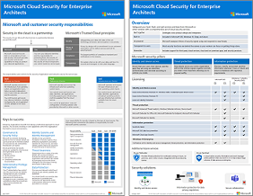
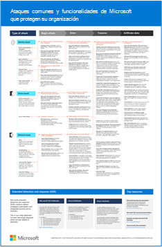
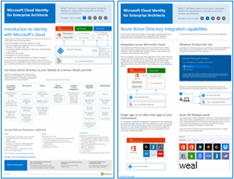

# Ilustraciones de Microsoft Cloud para arquitectos empresariales

Estos pósteres de arquitectura en la nube le ofrecen información acerca de los servicios en la nube de Microsoft, como Office 365, Azure Active Directory, Microsoft Intune, Microsoft Dynamics CRM Online y las soluciones híbridas locales y en la nube. Los arquitectos y los responsables de la toma de decisiones de TI pueden usar estos recursos para determinar las soluciones ideales para sus cargas de trabajo y para tomar decisiones acerca de los componentes de la infraestructura básica, como la identidad y la seguridad.

   

### Redes de nube de Microsoft para arquitectos empresariales

Lo que los arquitectos de TI necesitan saber sobre las redes para las plataformas y los servicios en la nube de Microsoft.
  
|**Elemento**|**Descripción**|
|:-----|:-----|
|   [PDF](https://github.com/MicrosoftDocs/microsoft-365-docs/raw/public/microsoft-365/downloads/MSFT_cloud_architecture_networking.pdf)  \| [Visio](https://github.com/MicrosoftDocs/OfficeDocs-Enterprise/raw/live/Enterprise/media/Network-Poster/MSFT_cloud_architecture_networking.vsdx)  Se actualizó el 2019 de noviembre| Este modelo contiene: <ul><li> Adaptación de la red para la conectividad en la nube </li><li> Elementos comunes de la conectividad en la nube de Microsoft </li><li> ExpressRoute para la conectividad en la nube de Microsoft </li><li> Diseño de redes para SaaS de Microsoft, IaaS de Azure y PaaS de Azure  </li></ul>    |

### Nube híbrida de Microsoft para arquitectos empresariales

Lo que los arquitectos de TI necesitan saber sobre la nube híbrida para las plataformas y los servicios Microsoft.
  
|**Elemento**|**Descripción**|
|:-----|:-----|
|   [PDF](https://github.com/MicrosoftDocs/microsoft-365-docs/raw/public/microsoft-365/downloads/MSFT_cloud_architecture_hybrid.pdf)  \| [Visio](https://github.com/MicrosoftDocs/OfficeDocs-Enterprise/raw/live/Enterprise/media/Hybrid-Poster/MSFT_cloud_architecture_hybrid.vsdx)  Se actualizó el 2019 de noviembre | Este modelo contiene lo siguiente: <ul><li> Ofertas de la nube de Microsoft (SaaS, IaaS de Azure y PaaS de Azure) y sus elementos comunes. </li><li> Arquitectura de nube híbrida para las ofertas en la nube de Microsoft </li><li> Escenarios de nube híbrida para SaaS de Microsoft (Office 365), IaaS de Azure y PaaS de Azure </li></ul> |
   

### Métodos de arquitectura para migraciones de inquilino a inquilino de la nube de Microsoft 
En esta serie de temas se muestran varios métodos de arquitectura para las fusiones, las adquisiciones, las ventas y otros casos que podrían llevarle a migrar a un nuevo inquilino en la nube. En estos temas se proporciona una guía inicial para la planeación. 

|**Item**|**Descripción**|
|:-----|:-----|
|   [PDF](https://github.com/MicrosoftDocs/microsoft-365-docs/raw/public/microsoft-365/downloads/Microsoft-365-tenant-to-tenant-migration.pdf) \| [Visio](https://github.com/MicrosoftDocs/OfficeDocs-Enterprise/raw/live/Enterprise/downloads/Microsoft-365-tenant-to-tenant-migration.vsdx)  Se actualizó el 2019 de julio    |Este modelo contiene lo siguiente: <ul><li>Una asignación de escenarios empresariales a métodos arquitectónicos</li><li>Consideraciones sobre diseño</li><li>Flujo de migración de evento único</li><li>Flujo de migración en fases</li><li>Flujo de desplazamiento o división del inquilino</li></ul>|

### Seguridad de nube de Microsoft para arquitectos empresariales

Lo que los arquitectos de TI necesitan saber sobre la seguridad en las plataformas y los servicios en la nube de Microsoft.
  
|**Elemento**|**Descripción**|
|:-----|:-----|
|[          ](https://www.microsoft.com/download/details.aspx?id=48121)   [PDF](https://go.microsoft.com/fwlink/p/?linkid=842070)  \| [Visio](https://go.microsoft.com/fwlink/p/?LinkId=842071)  \| [Más idiomas](https://www.microsoft.com/download/details.aspx?id=48121)  Actualizado el 2018 de diciembre | Este modelo contiene lo siguiente: <ul><li>Rol de Microsoft a la hora de proporcionar servicios y plataformas seguros</li><li>Responsabilidades del cliente para mitigar los riesgos de seguridad</li><li>Principales certificaciones de seguridad </li><li>Ofertas de seguridad proporcionadas por los servicios de consultoría de Microsoft </ul> |

### Ataques comunes y funcionalidades de Microsoft que protegen su organización
Obtenga información sobre los ciberataques más comunes y cómo Microsoft puede ser de utilidad a su organización en todas las fases de un ataque. 

|**Elemento**|**Descripción**|
|:-----|:-----|
|   [PDF](https://download.microsoft.com/download/F/A/C/FACFC1E9-FA35-4DF1-943C-8D4237B4275B/MSFT_Cloud_architecture_security_commonattacks.pdf) \| [Visio](https://download.microsoft.com/download/F/A/C/FACFC1E9-FA35-4DF1-943C-8D4237B4275B/MSFT_Cloud_architecture_security_commonattacks.vsdx)   Se actualizó el 2017 de agosto | Este póster ilustra la ruta de acceso de los ataques comunes y en él se describen las funcionalidades que ayudan a detener a los intrusos en cada fase de un ataque.  |

### Identidad de la nube de Microsoft para arquitectos empresariales

Lo que los arquitectos de TI necesitan saber sobre el diseño de la identidad para las organizaciones que usan plataformas y servicios en la nube de Microsoft.
  
|**Elemento**|**Descripción**|
|:-----|:-----|
|[          ](https://www.microsoft.com/download/details.aspx?id=54431)   [PDF](https://go.microsoft.com/fwlink/p/?LinkId=524586)  \| [Visio](https://download.microsoft.com/download/2/3/8/238228E6-9017-4F6C-BD3C-5559E6708F82/MSFT_cloud_architecture_identity.vsd)           \| [Más idiomas](https://www.microsoft.com/download/details.aspx?id=54431)  Se actualizó el 2016 de agosto | Este modelo contiene lo siguiente: <ul><li>Introducción a la identidad con la nube de Microsoft </li><li>Capacidades de IDaaS de Azure AD </li><li>Integración de cuentas locales de Active Directory Domain Services con Microsoft Azure Active Directory </li><li>Colocación de componentes de directorio en Azure </li><li>Opciones de servicios de dominio para cargas de trabajo en IaaS de Azure </li></ul> |
   