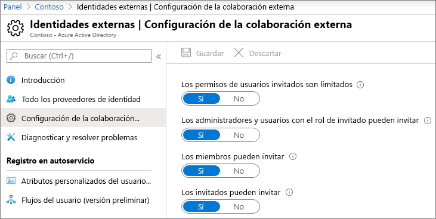
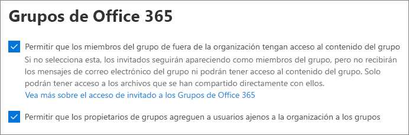
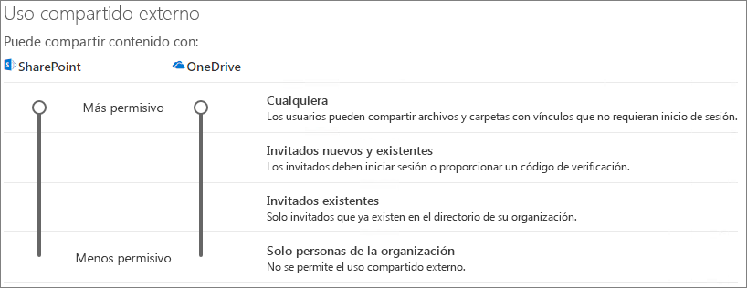
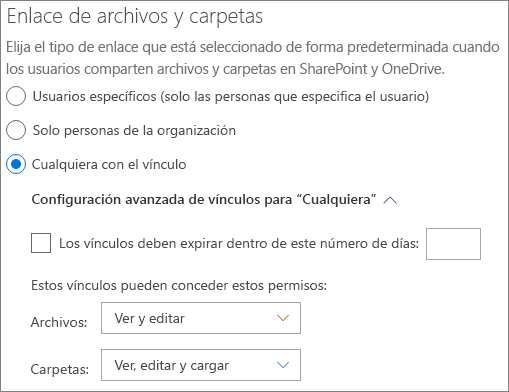
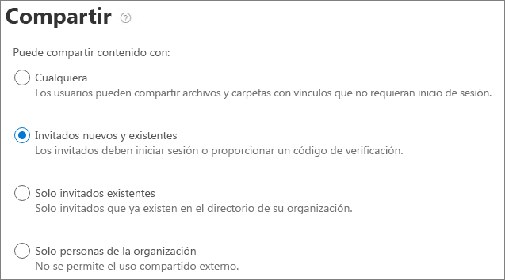

# Colaborar con invitados en un equipo

Si necesita colaborar con invitados en documentos, tareas y conversaciones, le recomendamos que use Microsoft Teams. Teams proporciona todas las características de colaboración disponibles en Office y SharePoint con chat persistente y un conjunto extensible y personalizable de herramientas de colaboración en una experiencia de usuario unificada.

En este artículo, le mostraremos los pasos de configuración necesarios de Microsoft 365 para configurar un equipo de colaboración con invitados. Después de configurar el acceso de invitado, puede añadir invitados a equipos siguiendo los pasos de [Agregar invitados a un equipo en Teams](https://support.microsoft.com/office/fccb4fa6-f864-4508-bdde-256e7384a14f).

## Demostración de vídeo

En este vídeo se muestran los pasos de configuración descritos en este documento. 

> [!VIDEO https://www.microsoft.com/videoplayer/embed/RE44NTr?autoplay=false]

## Configuración de colaboración externa de Azure

El uso compartido en Microsoft 365 se rige en su nivel más alto por la [configuración de colaboración externa B2B en Azure Active Directory](/azure/active-directory/external-identities/delegate-invitations). Si el uso compartido con invitados está deshabilitado o restringido en Azure AD, esta configuración invalida cualquier configuración de uso compartido que configure en Microsoft 365.

Compruebe la configuración de colaboración externa B2B para asegurarse de que no se bloquea el uso compartido con invitados.

Para establecer la configuración de colaboración externa

1. Inicie sesión en Azure Active Directory en [https://aad.portal.azure.com](https://aad.portal.azure.com).
2. En el panel de navegación izquierdo, haga clic en **Azure Active Directory**
3. Haga clic en **Identidades externas**.
4. En la pantalla **introducción**, en el panel de navegación izquierdo, haga clic en **Configuración de colaboración externa**.
5. Asegúrese de que **Los administradores y usuarios con el rol de invitador pueden invitar** y **Los miembros pueden invitar** están establecidos en **Sí**.
6. Si ha realizado cambios, haga clic en **Guardar**.

Fíjese en la configuración en la sección **Restricciones de colaboración**. Asegúrese de que los dominios de los invitados con los que quiere colaborar no están bloqueados.

Si trabaja con invitados de varias organizaciones, tal vez quiera restringir su capacidad para acceder a los datos del directorio. Esto les impedirá ver quién más es un invitado en el directorio. Para ello, en **Restricciones de acceso de usuario invitado**, seleccione **Los usuarios invitados tienen acceso limitado a las propiedades y a la pertenencia de la configuración de objetos de directorio** o **El acceso de usuarios invitados está restringido a las propiedades y pertenencias de sus propios objetos de directorio**.

## Configuración de acceso de invitado de Teams

Teams tiene un modificador principal para el acceso de invitados y una amplia variedad de opciones de configuración disponibles para controlar lo que pueden hacer los invitados en un equipo. El modificador principal, **Permitir el acceso de invitado en Teams** debe estar **Activado** para que el acceso de invitado funcione en Teams.

Compruebe que el acceso de invitado esté habilitado en Teams y realice ajustes en la configuración de invitado según las necesidades de la empresa. Tenga en cuenta que esta configuración afecta a todos los equipos.

Para establecer la configuración de acceso de invitados de Teams

1. Inicie sesión en el Centro de administración de Microsoft 365 en [https://admin.microsoft.com](https://admin.microsoft.com).
2. En el panel de navegación izquierdo, haga clic en **Mostrar todo**.
3. En **Centros de administración**, haga clic en **Teams**.
4. En el centro de administración de Teams, en el panel de navegación de la izquierda, expanda **Configuración de toda la organización** y haga clic en **Acceso de invitado**.
5. Asegúrese de que **Permitir el acceso de invitados en Teams** se haya establecido en **Activado**.
6. Realice los cambios que quiera en la configuración de invitado adicional y luego haga clic en **Guardar**.

Una vez activado el acceso de invitado de Teams, de manera opcional puede controlar el acceso de invitado a equipos individuales y sus sitios de SharePoint asociados mediante etiquetas de confidencialidad. Para más información, consulte [Usar etiquetas de confidencialidad para proteger el contenido en Microsoft Teams, grupos de Microsoft 365 y sitios de SharePoint](../compliance/sensitivity-labels-teams-groups-sites.md).

> [!NOTE]
> La configuración de invitado de Teams puede tardar hasta veinticuatro horas en activarse después de activarla.

## Configuración de invitado de Grupos de Microsoft 365

Teams usa Grupos de Microsoft 365 para la pertenencia a equipos. La configuración de invitado de Grupos de Microsoft 365 debe estar activada para que funcione el acceso de invitados en Teams.

Para establecer la configuración de invitado de Grupos de Microsoft 365

1. En el Centro de administración de Microsoft 365, en el panel de navegación izquierdo, expanda **Configuración**.
2. Haga clic en **Configuración de la organización**.
3. En la lista, haga clic en **Grupos de Microsoft 365**.
4. Asegúrese de que las casillas **Permitir que los propietarios del grupo agreguen personas de fuera de la organización a Grupos de Microsoft 365 como invitados** y **Permitir que los miembros del grupo invitados accedan al contenido del grupo** están activadas.
5. Si ha realizado cambios, haga clic en **Guardar cambios**.

## Configuración de uso compartido del nivel de organización de SharePoint

El contenido de los Teams, como archivos, carpetas y listas, se almacena en SharePoint. Para que los invitados tengan acceso a estos elementos en Teams, la configuración de uso compartido de nivel de organización de SharePoint debe permitir el uso compartido con invitados.

La configuración de nivel de la organización determina qué configuración está disponible para sitios individuales, incluidos los sitios asociados con equipos. La configuración del sitio no puede ser más permisiva que la configuración de nivel de organización.

Si quiere permitir el uso compartido de archivos y carpetas con personas sin autenticar, elija **Cualquier usuario**. Si quiere asegurarse de que todos los invitados se tienen que autenticar, elija **Invitados nuevos y existentes**. Elija la configuración más permisiva que cualquier sitio de su organización necesite.

Para establecer la configuración de uso compartido de nivel de organización de SharePoint

1. En el Centro de administración de Microsoft 365, en el panel de navegación izquierdo, en **Centros de administración**, haga clic en **SharePoint**.
2. En el Centro de administración de SharePoint, en el panel de navegación izquierdo, expanda el panel de navegación **Directivas** y haga clic en **Uso compartido**.
3. Asegúrese de que el uso compartido externo de SharePoint está establecido en **Cualquier usuario** o **Invitados nuevos y existentes**.
4. Si ha realizado cambios, haga clic en **Guardar**.

## Configuración de vínculos predeterminada para el nivel de organización de SharePoint

La configuración predeterminada de vínculos de archivos y carpetas determina la opción de vínculo que se mostrará de forma predeterminada a los usuarios cuando compartan un archivo o carpeta. Los usuarios pueden cambiar el tipo de vínculo a una de las otras opciones antes de compartir, si quieren.

Tenga en cuenta que esta configuración afecta a todos los equipos y sitios de SharePoint de su organización.

Elija uno de los siguientes tipos de vínculos, que se seleccionará de forma predeterminada cuando los usuarios compartan archivos y carpetas:

- **Cualquier persona con el vínculo**: elija esta opción si espera realizar una gran cantidad de uso compartido sin autenticar de archivos y carpetas. Si quiere permitir el uso compartido de vínculos con *Cualquier usuario*, pero le preocupa el uso compartido accidental sin autenticar, considere la posibilidad de usar una de las otras opciones como predeterminadas. Este tipo de vínculo solo está disponible si ha habilitado el uso compartido con **Cualquier usuario**.
- **Solo las personas de su organización**: elija esta opción si espera que la mayoría del uso compartido de archivos y carpetas sea con usuarios dentro de su organización.
- **Usuarios específicos**: considere esta opción si espera realizar una gran cantidad de uso compartido de archivos y carpetas con invitados. Este tipo de vínculo funciona con los invitados y requiere su autenticación.
 

Para establecer la configuración de vínculos predeterminada para el nivel de organización de SharePoint

1. Vaya a la página de Uso compartido en el Centro de administración de SharePoint.
2. En **Vínculos de archivos y carpetas**, seleccione el vínculo para compartir predeterminado que quiere usar.
3. Si ha realizado cambios, haga clic en **Guardar**.

## Crear un equipo

El paso siguiente es crear el equipo que va a usar para colaborar con invitados.

Para crear un equipo
1. En Teams, en la pestaña **Teams**, haga clic en **Unirse o crear un equipo** en la parte inferior del panel izquierdo.
2. Haga clic en **Crear un equipo**.
3. Haga clic en **Crear un equipo desde cero**.
4. Elija **Privado** o **Público**.
5. Escriba un nombre y una descripción para el equipo y haga clic en **Crear**.
6. Haga clic **Omitir**.

Invitaremos a los usuarios más tarde. A continuación, es importante comprobar la configuración de uso compartido de nivel de sitio para el sitio de SharePoint que está asociado al equipo.

## Configuración de uso compartido de nivel de sitio de SharePoint

Compruebe la configuración de uso compartido de nivel de sitio para asegurarse de que permite el tipo de acceso que quiere para este equipo. Por ejemplo, si establece la configuración de nivel de organización en **Cualquier usuario**, pero quiere que todos los invitados se autentiquen para este equipo, asegúrese de que la configuración de uso compartido del nivel del sitio esté establecida en **Invitados nuevos y existentes**.

Para establecer la configuración de uso compartido de nivel de sitio
1. En el Centro de administración de SharePoint, en el panel de navegación izquierdo, expanda **Sitios** y haga clic en **Sitios activos**.
2. Seleccione el sitio para el equipo recién creado.
3. Haga clic en ... y elija **Uso compartido**.
4. Asegúrese de que el uso compartido está establecido en **Cualquiera** o en **Invitados nuevos y existentes**.
5. Si ha realizado cambios, haga clic en **Guardar**.

## Invitar a usuarios

La configuración de uso compartido de invitados ya está configurada, por lo que puede empezar a agregar usuarios internos e invitados al equipo. 

Para invitar a usuarios internos a un equipo
1. En el equipo, haga clic en **Más opciones** (**\*\*\***) y después en **Agregar miembro**.
2. Escriba el nombre de la persona que quiere invitar.
3. Haga clic en **Agregar** y, después, en **Cerrar**.

Para añadir invitados a un equipo
1. En el equipo, haga clic en **Más opciones** (**\*\*\***) y después en **Agregar miembro**.
2. Escriba la dirección de correo electrónico del invitado al que quiere invitar.
3. Haga clic **Editar información de invitado**.
4. Escriba el nombre completo del invitado y haga clic en la marca de verificación.
5. Haga clic en **Agregar** y, después, en **Cerrar**.

## Vea también

[Prácticas recomendadas para compartir archivos y carpetas con usuarios no autenticados](best-practices-anonymous-sharing.md)

[Reducir la exposición accidental de archivos al compartirlos con invitados](share-limit-accidental-exposure.md)

[Crear un entorno seguro de uso compartido para invitados](create-secure-guest-sharing-environment.md)

[Crear una extranet B2B con invitados administrados](b2b-extranet.md)

[Integración de SharePoint y OneDrive con Azure AD B2B](/sharepoint/sharepoint-azureb2b-integration-preview)

[Las opciones de uso compartido están atenuadas al compartir desde SharePoint o OneDrive](/sharepoint/troubleshoot/administration/sharing-options-grayed-out-when-sharing-from-sharepoint-online-or-onedrive)