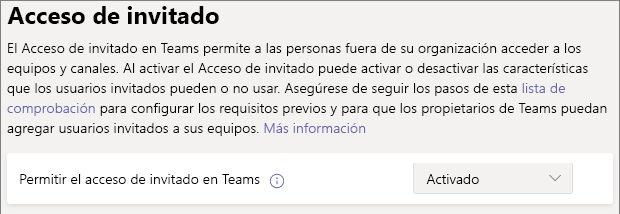

# Colaborar con invitados en un equipoCollaborate with guests in a team

Si necesita colaborar con invitados en documentos, tareas y conversaciones, le recomendamos que use Microsoft Teams.If you need to collaborate with guests across documents, tasks, and conversations, we recommend using Microsoft Teams. Teams proporciona todas las características de colaboración disponibles en Office y SharePoint con chat persistente y un conjunto extensible y personalizable de herramientas de colaboración en una experiencia de usuario unificada.Teams provides all of the collaboration features available in Office and SharePoint with persistent chat and a customizable and extensible set of collaboration tools in a unified user experience.

En este artículo, le mostraremos los pasos de configuración necesarios de Microsoft 365 para configurar un equipo de colaboración con invitados.In this article, we'll walk through the Microsoft 365 configuration steps necessary to set up a team for collaboration with guests. Después de configurar el acceso de invitado, puede añadir invitados a equipos siguiendo los pasos de [Agregar invitados a un equipo en Teams](https://support.microsoft.com/office/fccb4fa6-f864-4508-bdde-256e7384a14f).Once you have configured guest access, you can invite guests to teams by following the steps in [Add guests to a team in Teams](https://support.microsoft.com/office/fccb4fa6-f864-4508-bdde-256e7384a14f).

## Demostración de vídeoVideo demonstration

En este vídeo se muestran los pasos de configuración descritos en este documento.This video shows the configuration steps described in this document. 

> [!VIDEO https://www.microsoft.com/videoplayer/embed/RE44NTr?autoplay=false]

## Configuración de colaboración externa de AzureAzure External collaboration settings

El uso compartido en Microsoft 365 se rige en su nivel más alto por la [configuración de colaboración externa B2B en Azure Active Directory](https://docs.microsoft.com/azure/active-directory/external-identities/delegate-invitations).Sharing in Microsoft 365 is governed at its highest level by the [B2B external collaboration settings in Azure Active Directory](https://docs.microsoft.com/azure/active-directory/external-identities/delegate-invitations). Si el uso compartido con invitados está deshabilitado o restringido en Azure AD, esta configuración invalida cualquier configuración de uso compartido que configure en Microsoft 365.If guest sharing is disabled or restricted in Azure AD, this setting overrides any sharing settings that you configure in Microsoft 365.

Compruebe la configuración de colaboración externa B2B para asegurarse de que no se bloquea el uso compartido con invitados.Check the B2B external collaboration settings settings to ensure that sharing with guests is not blocked.

Para establecer la configuración de colaboración externaTo set external collaboration settings

1. Inicie sesión en Azure Active Directory en [https://aad.portal.azure.com](https://aad.portal.azure.com).Log in to Azure Active Directory at [https://aad.portal.azure.com](https://aad.portal.azure.com).
2. En el panel de navegación izquierdo, haga clic en **Azure Active Directory**In the left navigation pane, click **Azure Active Directory**.
3. Haga clic en **Identidades externas**.Click **External identities**.
4. En la pantalla **introducción**, en el panel de navegación izquierdo, haga clic en **Configuración de colaboración externa**.On the **Get started** screen, in the left navigation pane, click **External collaboration settings**.
5. Asegúrese de que **Los administradores y usuarios con el rol de invitador pueden invitar** y **Los miembros pueden invitar** están establecidos en **Sí**.Ensure that **Admins and users in the guest inviter role can invite** and **Members can invite** are both set to **Yes**.
6. Si ha realizado cambios, haga clic en **Guardar**.If you made changes, click **Save**.

Fíjese en la configuración en la sección **Restricciones de colaboración**.Note the settings in the **Collaboration restrictions** section. Asegúrese de que los dominios de los invitados con los que quiere colaborar no están bloqueados.Make sure that the domains of the guests that you want to collaborate with aren't blocked.

Si trabaja con invitados de varias organizaciones, tal vez quiera restringir su capacidad para acceder a los datos del directorio.If you work with guests from multiple organizations, you may want to restrict their ability to access directory data. Esto les impedirá ver quién más es un invitado en el directorio.This will prevent them from seeing who else is a guest in the directory. Para ello, en **Restricciones de acceso de usuario invitado**, seleccione **Los usuarios invitados tienen acceso limitado a las propiedades y a la pertenencia de la configuración de objetos de directorio** o **El acceso de usuarios invitados está restringido a las propiedades y pertenencias de sus propios objetos de directorio**.To do this, under **Guest user access restrictions**, select **Guest users have limited access to properties and membership of directory objects settings** or **Guest user access is restricted to properties and memberships of their own directory objects**.

## Configuración de acceso de invitado de TeamsTeams guest access settings

Teams tiene un modificador principal para el acceso de invitados y una amplia variedad de opciones de configuración disponibles para controlar lo que pueden hacer los invitados en un equipo.Teams has a master on/off switch for guest access and a variety of settings available to control what guests can do in a team. El modificador principal, **Permitir el acceso de invitado en Teams** debe estar **Activado** para que el acceso de invitado funcione en Teams.The master switch, **Allow guest access in Teams** must be **On** for guest access to work in Teams.

Compruebe que el acceso de invitado esté habilitado en Teams y realice ajustes en la configuración de invitado según las necesidades de la empresa.Check to ensure that guest access is enabled in Teams and make any adjustment to the guest settings based on your business needs. Tenga en cuenta que esta configuración afecta a todos los equipos.Keep in mind that these settings affect all teams.

Para establecer la configuración de acceso de invitados de TeamsTo set Teams guest access settings

1. Inicie sesión en el Centro de administración de Microsoft 365 en [https://admin.microsoft.com](https://admin.microsoft.com).Log in to the Microsoft 365 admin center at [https://admin.microsoft.com](https://admin.microsoft.com).
2. En el panel de navegación izquierdo, haga clic en **Mostrar todo**.In the left navigation pane, click **Show all**.
3. En **Centros de administración**, haga clic en **Teams**.Under **Admin centers**, click **Teams**.
4. En el centro de administración de Teams, en el panel de navegación de la izquierda, expanda **Configuración de toda la organización** y haga clic en **Acceso de invitado**.In the Teams admin center, in the left navigation pane, expand **Org-wide settings** and click **Guest access**.
5. Asegúrese de que **Permitir el acceso de invitados en Teams** se haya establecido en **Activado**.Ensure that **Allow guest access in Teams** is set to **On**.
6. Realice los cambios que quiera en la configuración de invitado adicional y luego haga clic en **Guardar**.Make any desired changes to the additional guest settings, and then click **Save**.

Una vez activado el acceso de invitado de Teams, de manera opcional puede controlar el acceso de invitado a equipos individuales y sus sitios de SharePoint asociados mediante etiquetas de confidencialidad.Once Teams guest access is turned on, you can optionally control guest access to individual teams and their associated SharePoint sites using sensitivity labels. Para más información, consulte [Usar etiquetas de confidencialidad para proteger el contenido en Microsoft Teams, grupos de Microsoft 365 y sitios de SharePoint](https://docs.microsoft.com/microsoft-365/compliance/sensitivity-labels-teams-groups-sites).For more information, see [Use sensitivity labels to protect content in Microsoft Teams, Microsoft 365 groups, and SharePoint sites](https://docs.microsoft.com/microsoft-365/compliance/sensitivity-labels-teams-groups-sites).

> [!NOTE]
> La configuración de invitado de Teams puede tardar hasta veinticuatro horas en activarse después de activarla.It may take up to twenty-four hours for the Teams guest settings to become active after you turn it on.

## Configuración de invitado de Grupos de Microsoft 365Microsoft 365 Groups guest settings

Teams usa Grupos de Microsoft 365 para la pertenencia a equipos.Teams uses Microsoft 365 Groups for team membership. La configuración de invitado de Grupos de Microsoft 365 debe estar activada para que funcione el acceso de invitados en Teams.The Microsoft 365 Groups guest settings must be turned on in order for guest access in Teams to work.

Para establecer la configuración de invitado de Grupos de Microsoft 365To set Microsoft 365 Groups guest settings

1. En el Centro de administración de Microsoft 365, en el panel de navegación izquierdo, expanda **Configuración**.In the Microsoft 365 admin center, in the left navigation pane, expand **Settings**.
2. Haga clic en **Configuración de la organización**.Click **Org settings**.
3. En la lista, haga clic en **Grupos de Microsoft 365**.In the list, click **Microsoft 365 Groups**.
4. Asegúrese de que las casillas **Permitir que los propietarios del grupo agreguen personas de fuera de la organización a Grupos de Microsoft 365 como invitados** y **Permitir que los miembros del grupo invitados accedan al contenido del grupo** están activadas.Ensure that the **Let group owners add people outside your organization to Microsoft 365 Groups as guests** and **Let guest group members access group content** check boxes are both checked.
5. Si ha realizado cambios, haga clic en **Guardar cambios**.If you made changes, click **Save changes**.

## Configuración de uso compartido del nivel de organización de SharePointSharePoint organization level sharing settings

El contenido de los Teams, como archivos, carpetas y listas, se almacena en SharePoint.Teams content such as files, folders, and lists are all stored in SharePoint. Para que los invitados tengan acceso a estos elementos en Teams, la configuración de uso compartido de nivel de organización de SharePoint debe permitir el uso compartido con invitados.In order for guests to have access to these items in Teams, the SharePoint organization-level sharing settings must allow for sharing with guests.

La configuración de nivel de la organización determina qué configuración está disponible para sitios individuales, incluidos los sitios asociados con equipos.The organization-level settings determine what settings are available for individual sites, including sites associated with teams. La configuración del sitio no puede ser más permisiva que la configuración de nivel de organización.Site settings cannot be more permissive than the organization-level settings.

Si quiere permitir el uso compartido de archivos y carpetas con personas sin autenticar, elija **Cualquier usuario**.If you want to allow file and folder sharing with unauthenticated people, choose **Anyone**. Si quiere asegurarse de que todos los invitados se tienen que autenticar, elija **Invitados nuevos y existentes**.If you want to ensure that all guests have to authenticate, choose **New and existing guests**. Elija la configuración más permisiva que cualquier sitio de su organización necesite.Choose the most permissive setting that will be needed by any site in your organization.

Para establecer la configuración de uso compartido de nivel de organización de SharePointTo set SharePoint organization-level sharing settings

1. En el Centro de administración de Microsoft 365, en el panel de navegación izquierdo, en **Centros de administración**, haga clic en **SharePoint**.In the Microsoft 365 admin center, in the left navigation pane, under **Admin centers**, click **SharePoint**.
2. En el Centro de administración de SharePoint, en el panel de navegación izquierdo, expanda el panel de navegación **Directivas** y haga clic en **Uso compartido**.In the SharePoint admin center, in the left navigation pane, expand **Policies** and then click **Sharing**.
3. Asegúrese de que el uso compartido externo de SharePoint está establecido en **Cualquier usuario** o **Invitados nuevos y existentes**.Ensure that external sharing for SharePoint is set to **Anyone** or **New and existing guests**.
4. Si ha realizado cambios, haga clic en **Guardar**.If you made changes, click **Save**.

## Configuración de vínculos predeterminada para el nivel de organización de SharePointSharePoint organization-level default link settings

La configuración predeterminada de vínculos de archivos y carpetas determina la opción de vínculo que se mostrará de forma predeterminada a los usuarios cuando compartan un archivo o carpeta.The default file and folder link settings determine the link option that will be shown to users by default when they share a file or folder. Los usuarios pueden cambiar el tipo de vínculo a una de las otras opciones antes de compartir, si quieren.Users can change the link type to one of the other options before sharing, if desired.

Tenga en cuenta que esta configuración afecta a todos los equipos y sitios de SharePoint de su organización.Keep in mind that this setting affects all teams and SharePoint sites in your organization.

Elija uno de los siguientes tipos de vínculos, que se seleccionará de forma predeterminada cuando los usuarios compartan archivos y carpetas:Choose any one of the following link-types which will be selected by default when users share files and folders:

- **Cualquier persona con el vínculo**: elija esta opción si espera realizar una gran cantidad de uso compartido sin autenticar de archivos y carpetas.**Anyone with the link** - Choose this option if you expect to do a lot of unauthenticated sharing of files and folders. Si quiere permitir el uso compartido de vínculos con *Cualquier usuario*, pero le preocupa el uso compartido accidental sin autenticar, considere la posibilidad de usar una de las otras opciones como predeterminadas.If you want to allow *Anyone* links but are concerned about accidental unauthenticated sharing, consider one of the other options as the default. Este tipo de vínculo solo está disponible si ha habilitado el uso compartido con **Cualquier usuario**.This link type is only available if you've enabled **Anyone** sharing.
- **Solo las personas de su organización**: elija esta opción si espera que la mayoría del uso compartido de archivos y carpetas sea con usuarios dentro de su organización.**Only people in your organization** - Choose this option if you expect most file and folder sharing to be with people inside your organization.
- **Usuarios específicos**: considere esta opción si espera realizar una gran cantidad de uso compartido de archivos y carpetas con invitados.**Specific people** - Consider this option if you expect to do a lot of file and folder sharing with guests. Este tipo de vínculo funciona con los invitados y requiere su autenticación.This type of link works with guests and requires them to authenticate.
 

Para establecer la configuración de vínculos predeterminada para el nivel de organización de SharePointTo set the SharePoint organization-level default link settings

1. Vaya a la página de Uso compartido en el Centro de administración de SharePoint.Navigate to the Sharing page in the SharePoint admin center.
2. En **Vínculos de archivos y carpetas**, seleccione el vínculo para compartir predeterminado que quiere usar.Under **File and folder links**, select the default sharing link that you want to use.
3. Si ha realizado cambios, haga clic en **Guardar**.If you made changes, click **Save**.

## Crear un equipoCreate a team

El paso siguiente es crear el equipo que va a usar para colaborar con invitados.The next step is to create the team that you plan to use for collaborating with guests.

Para crear un equipoTo create a team
1. En Teams, en la pestaña **Teams**, haga clic en **Unirse o crear un equipo** en la parte inferior del panel izquierdo.In Teams, on the **Teams** tab, click **Join or create a team** at the bottom of the left pane.
2. Haga clic en **Crear un equipo**.Click **Create a team**.
3. Haga clic en **Crear un equipo desde cero**.Click **Build a team from scratch**.
4. Elija **Privado** o **Público**.Choose **Private** or **Public**.
5. Escriba un nombre y una descripción para el equipo y haga clic en **Crear**.Type a name and description for the team, and then click **Create**.
6. Haga clic **Omitir**.Click **Skip**.

Invitaremos a los usuarios más tarde.We'll invite users later. A continuación, es importante comprobar la configuración de uso compartido de nivel de sitio para el sitio de SharePoint que está asociado al equipo.Next, it's important to check the site-level sharing settings for the SharePoint site that is associated with the team.

## Configuración de uso compartido de nivel de sitio de SharePointSharePoint site-level sharing settings

Compruebe la configuración de uso compartido de nivel de sitio para asegurarse de que permite el tipo de acceso que quiere para este equipo.Check the site-level sharing settings to make sure that they allow the type of access that you want for this team. Por ejemplo, si establece la configuración de nivel de organización en **Cualquier usuario**, pero quiere que todos los invitados se autentiquen para este equipo, asegúrese de que la configuración de uso compartido del nivel del sitio esté establecida en **Invitados nuevos y existentes**.For example, if you set the organization-level settings to **Anyone**, but you want all guests to authenticate for this team, then make sure the site-level sharing settings are set to **New and existing guests**.

Para establecer la configuración de uso compartido de nivel de sitioTo set site-level sharing settings
1. En el Centro de administración de SharePoint, en el panel de navegación izquierdo, expanda **Sitios** y haga clic en **Sitios activos**.In the SharePoint admin center, in the left navigation pane, expand **Sites** and click **Active sites**.
2. Seleccione el sitio para el equipo recién creado.Select the site for the team that you just created.
3. Haga clic en ... y elija **Uso compartido**.Click ... and choose **Sharing**.
4. Asegúrese de que el uso compartido está establecido en **Cualquiera** o en **Invitados nuevos y existentes**.Ensure that sharing is set to **Anyone** or **New and existing guests**.
5. Si ha realizado cambios, haga clic en **Guardar**.If you made changes, click **Save**.

## Invitar a usuariosInvite users

La configuración de uso compartido de invitados ya está configurada, por lo que puede empezar a agregar usuarios internos e invitados al equipo.Guest sharing settings are now configured, so you can start adding internal users and guests to your team. 

Para invitar a usuarios internos a un equipoTo invite internal users to a team
1. En el equipo, haga clic en **Más opciones** (**\*\*\***) y después en **Agregar miembro**.In the team, click **More options** (**\*\*\***), and then click **Add member**.
2. Escriba el nombre de la persona que quiere invitar.Type the name of the person who you want to invite.
3. Haga clic en **Agregar** y, después, en **Cerrar**.Click **Add**, and then click **Close**.

Para añadir invitados a un equipoTo invite guests to a team
1. En el equipo, haga clic en **Más opciones** (**\*\*\***) y después en **Agregar miembro**.In the team, click **More options** (**\*\*\***), and then click **Add member**.
2. Escriba la dirección de correo electrónico del invitado al que quiere invitar.Type the email address of the guest whom you want to invite.
3. Haga clic **Editar información de invitado**.Click **Edit guest information**.
4. Escriba el nombre completo del invitado y haga clic en la marca de verificación.Type the guest's full name and click the check mark.
5. Haga clic en **Agregar** y, después, en **Cerrar**.Click **Add**, and then click **Close**.

## Vea tambiénSee also

[Prácticas recomendadas para compartir archivos y carpetas con usuarios no autenticadosBest practices for sharing files and folders with unauthenticated users](best-practices-anonymous-sharing.md)

[Reducir la exposición accidental de archivos al compartirlos con invitadosLimit accidental exposure to files when sharing with guests](share-limit-accidental-exposure.md)

[Crear un entorno seguro de uso compartido para invitadosCreate a secure guest sharing environment](create-secure-guest-sharing-environment.md)

[Crear una extranet B2B con invitados administradosCreate a B2B extranet with managed guests](b2b-extranet.md)

[Integración de SharePoint y OneDrive con Azure AD B2BSharePoint and OneDrive integration with Azure AD B2B](https://docs.microsoft.com/sharepoint/sharepoint-azureb2b-integration-preview)

[Las opciones de uso compartido están atenuadas al compartir desde SharePoint o OneDriveSharing options are greyed out when sharing from SharePoint or OneDrive](https://docs.microsoft.com/sharepoint/troubleshoot/administration/sharing-options-grayed-out-when-sharing-from-sharepoint-online-or-onedrive)
