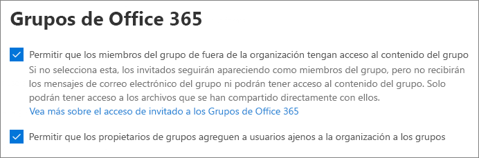

# Colaborar con invitados en un sitio

Si necesita colaborar con invitados en documentos, datos y listas, puede usar un sitio de SharePoint. Los sitios de SharePoint modernos están conectados a grupos de Microsoft 365 y pueden administrar la pertenencia al sitio y proporcionar herramientas de colaboración adicionales, como un buzón compartido y un calendario.

En este artículo, veremos los pasos de configuración de Microsoft 365 necesarios para configurar un sitio de SharePoint para la colaboración con invitados.

## Vídeo de demostración

En este vídeo se muestran los pasos de configuración descritos en este documento. 

> [!VIDEO https://www.microsoft.com/videoplayer/embed/RE44Llg?autoplay=false]

## Configuración de colaboración externa de Azure

El uso compartido en Microsoft 365 se rige en su nivel más alto por la configuración de [colaboración externa B2B en Azure Active Directory.](https://docs.microsoft.com/azure/active-directory/external-identities/delegate-invitations) Si el uso compartido de invitados está deshabilitado o restringido en Azure AD, esta configuración invalida cualquier configuración de uso compartido que configure en Microsoft 365.

Compruebe la configuración de colaboración externa B2B para asegurarse de que no se bloquee el uso compartido con invitados.

Para establecer la configuración de colaboración externa

1. Inicie sesión en Azure Active Directory en [https://aad.portal.azure.com](https://aad.portal.azure.com) .
2. En el panel de navegación izquierdo, haga clic **en Azure Active Directory.**
3. Haga **clic en Identidades externas.**
4. En la **pantalla Introducción, en** el panel de navegación izquierdo, haga clic en **Configuración de colaboración externa.**
5. Asegúrese de **que los administradores y los usuarios del** rol de invitador de invitado pueden invitar y que **los** miembros pueden invitar están establecidos en **Sí**.
6. Si ha realizado cambios, haga clic en **Guardar**.

Tenga en cuenta la configuración de la **sección Restricciones de colaboración.** Asegúrese de que los dominios de los invitados con los que desea colaborar no están bloqueados.

Si trabaja con invitados de varias organizaciones, es posible que desee restringir su capacidad para obtener acceso a los datos del directorio. Esto les impedirá ver quién más es un invitado en el directorio. Para ello, en Restricciones de  acceso de usuarios **invitados,** seleccione Los usuarios invitados tienen acceso limitado a las propiedades y la pertenencia a la configuración de objetos de directorio o el acceso de usuarios invitados está restringido a las propiedades y pertenencias de sus **propios** objetos de directorio.

## Configuración de invitado de Grupos de Microsoft 365

Los sitios de SharePoint modernos usan Grupos de Microsoft 365 para controlar el acceso a sitios. La configuración de invitado de Grupos de Microsoft 365 debe estar activada para que funcione el acceso de invitado en los sitios de SharePoint.

Para establecer la configuración de invitado de Grupos de Microsoft 365

1. En el Centro de administración de Microsoft 365, en el panel de navegación izquierdo, expanda **Configuración.**
2. Haga clic **en Configuración de la organización.**
3. En la lista, haga clic **en Grupos de Microsoft 365.**
4. Asegúrese de que las casillas Permitir que los propietarios del grupo agreguen personas fuera de su organización a Grupos de **Microsoft 365** como invitados y permitir que los miembros del grupo invitados accedan a las casillas de contenido **del** grupo estén activadas.
5. Si realizó cambios, haga clic **en Guardar cambios.**

## Configuración de uso compartido en el nivel de organización de SharePoint

Para que los invitados tengan acceso a los sitios de SharePoint, la configuración de uso compartido de nivel de organización de SharePoint debe permitir el uso compartido con invitados.

La configuración de nivel de organización determina la configuración que estará disponible para sitios individuales. La configuración del sitio no puede ser más permisiva que la configuración de nivel de organización.

Si desea permitir el uso compartido de archivos y carpetas no autenticados, elija **Cualquiera**. Si desea asegurarse de que todas las personas fuera de su organización tienen que autenticarse, elija **Invitados nuevos y existentes.** Elija la configuración más permisiva que necesite cualquier sitio de su organización.

Para establecer la configuración de uso compartido en el nivel de organización de SharePoint

1. En el Centro de administración de Microsoft 365, en el panel de navegación izquierdo, en Centros de **administración,** haga clic **en SharePoint.**
2. En el Centro de administración de SharePoint, en el panel de navegación izquierdo, en **Directivas,** haga clic en **Compartir.**
3. Asegúrese de que el uso compartido externo para SharePoint esté establecido en **Cualquiera** o **Nuevo y los invitados existentes.**
4. Si ha realizado cambios, haga clic en **Guardar**.

## Crear un sitio

El siguiente paso es crear el sitio que tiene previsto usar para colaborar con invitados.

Para crear un sitio
1. En el Centro de administración de SharePoint, en **Sitios**, haga clic en **Sitios activos**.
2. Haga clic en **Crear**.
3. Haga clic **en Sitio de grupo.**
4. Escriba un nombre de sitio y escriba un nombre para el propietario del grupo (propietario del sitio).
5. En **Configuración avanzada,** elija si desea que este sitio sea público o privado.
6. Haga clic en **Siguiente**.
7. Haga clic en **Finalizar**.

Invitaremos a los usuarios más adelante. A continuación, es importante comprobar la configuración de uso compartido de nivel de sitio para este sitio.

## Configuración de uso compartido en el nivel de sitio de SharePoint

Compruebe la configuración de uso compartido de nivel de sitio para asegurarse de que permiten el tipo de acceso que desea para este sitio. Por ejemplo, si establece la configuración de nivel de organización en **Cualquiera,** pero desea que todos los invitados se autentiquen para este sitio, asegúrese de que la configuración de uso compartido de nivel de sitio esté establecida en Invitados nuevos y **existentes.**

Tenga en cuenta que el sitio no se puede compartir con personas no autenticadas **(configuración** cualquiera), pero sí con archivos y carpetas individuales.

También puede usar [etiquetas de confidencialidad para controlar la configuración de uso compartido externo para sitios de SharePoint.](https://docs.microsoft.com/microsoft-365/compliance/sensitivity-labels-teams-groups-sites)

Para establecer la configuración de uso compartido de nivel de sitio
1. En el Centro de administración de SharePoint, en el panel de navegación izquierdo, expanda **Sitios** y haga clic en **Sitios activos**.
2. Seleccione el sitio que desea compartir.
3. Haga clic en ...y haga clic en **Compartir.**
4. Asegúrese de que el uso compartido está establecido en **Cualquiera** o **Invitados nuevos y existentes.**
5. Si ha realizado cambios, haga clic en **Guardar**.

## Invitar a usuarios

La configuración de uso compartido de invitados ya está configurada, por lo que puede empezar a agregar usuarios e invitados internos a su sitio. El acceso al sitio se controla a través del grupo asociado de Microsoft 365, por lo que agregaremos usuarios allí.

Para invitar a usuarios internos a un grupo
1. Vaya al sitio donde desea agregar usuarios.
2. Haga **clic en** el vínculo Miembros en la esquina superior derecha, que indica el recuento de miembros.
3. Haga clic en **Agregar miembros**.
4. Escriba los nombres o las direcciones de correo electrónico de los usuarios a los que desea invitar al sitio y, a continuación, haga clic en **Guardar.**

Los invitados no se pueden agregar desde el sitio. Debe agregarlos con Outlook en la Web. Por lo tanto, como requisito previo para agregar e invitar invitados a un grupo, haga clic en la dirección URL del sitio en la columna **dirección URL**  para navegar a la página específica del sitio. En esta página, haga clic en el icono **del iniciador** de aplicaciones y seleccione **Outlook**. Esta es la pantalla desde la que puede invitar a invitados a un grupo, para lo cual se describe el procedimiento a continuación.

Para invitar a invitados a un grupo
1. En **Grupos,** haga clic en el grupo al que desea invitar a invitados.
2. Abra la tarjeta de  contacto del grupo y haga clic en el vínculo Miembros en la esquina superior derecha (vínculo que indica el recuento de miembros).
3. haga clic **en Agregar miembros.**
4. Escriba las direcciones de correo electrónico de los invitados que desea invitar y, a continuación, haga clic en **Agregar**.
5. Haga clic en **Cerrar**.
Tenga en cuenta  que solo necesita hacer clic en Cerrar si no es el propietario del grupo y, como resultado, no puede agregar el invitado al grupo. En estos casos, la solicitud para agregar el invitado al grupo se transfiere al propietario del grupo para su aprobación.

## Vea también

[Prácticas recomendadas para compartir archivos y carpetas con usuarios no autenticados](best-practices-anonymous-sharing.md)

[Reducir la exposición accidental de archivos al compartirlos con invitados](share-limit-accidental-exposure.md)

[Crear un entorno seguro de uso compartido para invitados](create-secure-guest-sharing-environment.md)

Para obtener más información, consulte [Crear una extranet de B2B con invitados administrados](b2b-extranet.md).

[Integración de SharePoint y OneDrive con Azure AD B2B](https://docs.microsoft.com/sharepoint/sharepoint-azureb2b-integration-preview)
