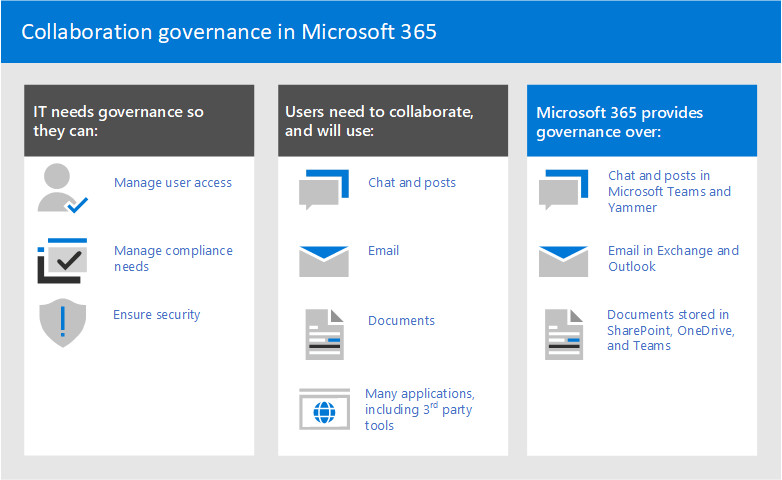
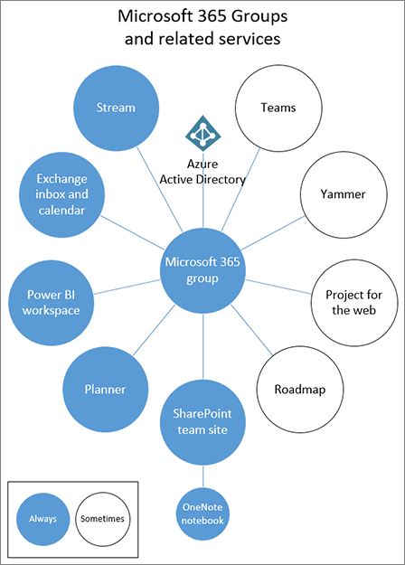

# ¿Qué es la gobernanza de la colaboración?What is collaboration governance?

El gobierno de colaboración es cómo administrar el acceso de los usuarios a los recursos, el cumplimiento de los estándares empresariales y garantizar la seguridad de los datos.Collaboration governance is how you manage users' access to resources, compliance with your business standards, and ensure the security of your data.

Las organizaciones hoy en día usan un conjunto de herramientas diverso.Organizations today are using a diverse tool set. Está el equipo de desarrolladores que usa el chat de equipo, los ejecutivos que envían correo electrónico y toda la organización que se conecta a través de redes sociales empresariales.There's the team of developers using team chat, the executives sending email, and the entire organization connecting over enterprise social. Hay varias herramientas de colaboración en uso porque cada grupo es único y tiene sus propias necesidades funcionales y estilo de trabajo.Multiple collaboration tools are in use because every group is unique and has their own functional needs and work style. Algunos solo usarán correo electrónico mientras que otros vivirán principalmente en chat.Some will use only email while others will live primarily in chat. 

Si los usuarios creen que las herramientas proporcionadas por IT no se ajustan a sus necesidades, es probable que descarguen su aplicación de consumidor favorita que admita sus escenarios.If users feel the IT-provided tools do not fit their needs, they will likely download their favorite consumer app which supports their scenarios. Aunque este proceso permite que los usuarios se inicien rápidamente, esto lleva a una experiencia de usuario frustrante en toda la organización con varios inicios de sesión, dificultad para compartir y ningún lugar único para ver contenido.Although this process allows users to get started quickly, it leads to a frustrating user experience across the organization with multiple logins, difficulty sharing, and no single place to view content. Este concepto se conoce como "TI de instantánea" y supone un riesgo importante para las organizaciones.This concept is referred to as “Shadow IT” and poses a significant risk to organizations. Reduce la capacidad de administrar uniformemente el acceso de los usuarios, garantizar la seguridad y las necesidades de cumplimiento del servicio.It reduces the ability to uniformly manage user access, ensure security, and service compliance needs.

Servicios como grupos de Microsoft 365, Teams y Yammer habilitan a los usuarios y reducen el riesgo de ti de instantánea proporcionando las herramientas necesarias para colaborar.Services such as Microsoft 365 groups, Teams, and Yammer empower users and reduces the risk of shadow IT by providing the tools needed to collaborate. Microsoft 365 tiene un amplio conjunto de herramientas para implementar las capacidades de gobierno que su organización pueda necesitar.Microsoft 365 has a rich set of tools to implement any governance capabilities your organization might require. 

Esta serie de artículos le ayudará a comprender cómo interactúan los grupos, los equipos y la configuración de SharePoint, qué capacidades de gobierno están disponibles y cómo crear e implementar un plan de gobierno para las características de colaboración en Microsoft 365.This series of articles will help you understand how groups, teams, and SharePoint settings interact, what governance capabilities are available, and how to create and implement a governance plan for the collaboration features in Microsoft 365.

### Configurar la colaboración segura con Microsoft 365Setting up secure collaboration with Microsoft 365

Existen muchas opciones para implementar Grupos de Microsoft 365 y Teams para una colaboración segura en su organización.There are many options for deploying Microsoft 365 Groups and Teams for secure collaboration in your organization. Se recomienda usar este contenido de gobierno junto con Configurar la colaboración segura con [Microsoft 365](setup-secure-collaboration-with-teams.md) y sus artículos asociados para crear la mejor solución de colaboración para su organización.We recommend you use this governance content alongside [Set up secure collaboration with Microsoft 365](setup-secure-collaboration-with-teams.md) and its associated articles to create the best collaboration solution for your organization.

## Por qué los grupos de Microsoft 365 son importantesWhy Microsoft 365 groups are important

Los grupos de Microsoft 365 te permiten elegir un conjunto de personas con las que quieres colaborar y configurar fácilmente una colección de recursos para que esas personas compartan.Microsoft 365 groups lets you choose a set of people with whom you wish to collaborate, and easily set up a collection of resources for those people to share. Agregar miembros al grupo concede automáticamente los permisos necesarios a todos los activos proporcionados por el grupo.Adding members to the group automatically grants the needed permissions to all assets provided by the group. Tanto Teams como Yammer usan grupos de Microsoft 365 para administrar su pertenencia.Both Teams and Yammer use Microsoft 365 groups to manage their membership.

Los grupos de Microsoft 365 incluyen un conjunto de recursos vinculados que los usuarios pueden usar para la comunicación y la colaboración.Microsoft 365 groups include a suite of linked resources that users can use for communication and collaboration. Los grupos siempre incluyen un sitio de SharePoint, Planner, un área de trabajo de Power BI, un buzón y un calendario y Stream.Groups always include a SharePoint site, Planner, a Power BI workspace, a mailbox and calendar, and Stream. Dependiendo de cómo cree el grupo, puede agregar otros servicios, como Teams, Yammer y Project.Depending on how you create the group, you can optionally add other services such as Teams, Yammer, and Project.

|RecursoResource|DescripciónDescription|
|:------|:----------|
|[CalendarioCalendar](https://support.office.com/article/schedule-a-meeting-on-a-group-calendar-in-outlook-0cf1ad68-1034-4306-b367-d75e9818376a)|Para programar eventos relacionados con el grupoFor scheduling events related to the group|
|[Bandeja de entradaInbox](https://support.office.com/article/have-a-group-conversation-in-outlook-a0482e24-a769-4e39-a5ba-a7c56e828b22)|Para conversaciones de correo electrónico entre miembros del grupo.For email conversations between group members. Esta bandeja de entrada tiene una dirección de correo electrónico y se puede configurar para aceptar mensajes de personas fuera del grupo e incluso fuera de la organización, como una lista de distribución tradicional.This inbox has an email address and can be set to accept messages from people outside the group and even outside your organization, much like a traditional distribution list.|
|[Bloc de notas de OneNoteOneNote notebook](https://support.office.com/article/get-started-with-onenote-e768fafa-8f9b-4eac-8600-65aa10b2fe97)|Para recopilar ideas, investigación e informaciónFor gathering ideas, research, and information|
|[PlanificadorPlanner](https://support.office.com/article/microsoft-planner-help-4a9a13c6-3adf-4a60-a6fc-15c0b15e16fc)|Para asignar y administrar tareas de proyecto entre los miembros del grupoFor assigning and managing project tasks among your group members|
|[Área de trabajo de Power BIPower BI Workspace](https://docs.microsoft.com/power-bi/collaborate-share/service-new-workspaces)|Un espacio de colaboración de datos con paneles e informesA data collaboration space with dashboards and reports|
|[Proyecto y guía básicaProject and Roadmap](https://support.microsoft.com/project)|Herramientas de administración de proyectos basadas en webWeb-based project management tools|
|[Sitio de grupo de SharePointSharePoint team site](https://support.office.com/article/what-is-a-sharepoint-team-site-75545757-36c3-46a7-beed-0aaa74f0401e)|Un repositorio central para información, vínculos y contenido relacionado con el grupoA central repository for information, links and content relating to your group|
|[SecuenciaStream](https://support.microsoft.com/microsoft-stream)|Un servicio de streaming de vídeoA video streaming service|
|[TeamsTeams](https://support.microsoft.com/teams)|Un área de trabajo basada en chat en Microsoft 365A chat-based workspace in Microsoft 365|
|[Grupo YammerYammer group](https://support.office.com/article/Learn-about-Office-365-groups-b565caa1-5c40-40ef-9915-60fdb2d97fa2)|Un lugar común para tener conversaciones y compartir informaciónA common place to have conversations and share information|

Grupos de Microsoft 365 incluye una variedad de controles de gobierno, incluida una directiva de expiración, convenciones de nomenclatura y una directiva de palabras bloqueadas, para ayudarle a administrar grupos de su organización.Microsoft 365 Groups includes a variety of governance controls, including an expiration policy, naming conventions, and a blocked words policy, to help you manage groups in your organization. Dado que los grupos controlan la pertenencia y el acceso a este conjunto de recursos, la administración de grupos es una parte clave de la colaboración de gobierno en Microsoft 365.Because groups control membership and access to this suite of resources, managing groups is a key part of governing collaboration in Microsoft 365.

## Definir una estrategia de colaboración para su organizaciónDefine a collaboration strategy for your organization

Hay varios lugares para colaborar y mantener conversaciones en Microsoft 365.There are multiple places to collaborate and have conversations within Microsoft 365. Comprender dónde los usuarios pueden iniciar conversaciones puede ayudarle a definir una estrategia de comunicación.Understanding where users can start conversations can help you define a strategy for communication.

Microsoft 365 admite tres métodos de comunicación principales:There are three main communication methods supported by Microsoft 365:

- Outlook: colaboración a través del correo electrónico con una bandeja de entrada y un calendario de grupo compartidosOutlook: collaboration through email with a shared group inbox and calendar
- Microsoft Teams: un área de trabajo basada en chat persistente donde puede tener conversaciones informales, en tiempo real, en torno a una variedad de temas, organizados por subgrupos específicosMicrosoft Teams: a persistent-chat-based workspace where you can have informal, real-time, conversations around a variety of topics, organized by specific sub-groups
- Yammer: experiencia social empresarial para la colaboraciónYammer: enterprise social experience for collaboration

- Teams: área de trabajo basada en chat (colaboración de alta velocidad): bucle internoTeams: chat-based workspace (high velocity collaboration) – inner loop
  - Creado para la colaboración con las personas con las que trabajan los usuarios todos los díasBuilt for collaboration with the people your users work with every day
  - Pone la información al alcance de los usuarios en una sola experienciaPuts information at the fingertips of users in a single experience
  - Agregar pestañas, conectores y botsAdd tabs, connectors and bots
  - Chat en directo, conferencias de audio y vídeo, reuniones grabadasLive chat, audio/video conferencing, recorded meetings

- Yammer: conectarse a través de la organización (social de empresa): bucle externoYammer: connect across the org (enterprise social) – outer loop
  - Comunidades de prácticas: grupos funcionales de personas que comparten un interés o experiencia comunes, pero que no necesariamente trabajan juntos día a díaCommunities of practice - Cross-functional groups of people who share a common interest or expertise but are not necessarily working together on a day-to-day basis
  - Conexión de liderazgo, comunidades de aprendizaje, comunidades basadas en rolesLeadership connection, learning communities, role-based communities

- Buzón y calendario (colaboración basada en correo electrónico)Mailbox and calendar (email-based collaboration)
  - Se usa para la comunicación dirigida con un grupo de personasUsed for targeted communication with a group of people
  - Calendario compartido para reuniones con otros miembros del grupoShared calendar for meetings with other group members
 
A medida que determine cómo desea usar las características de colaboración en Microsoft 365, tenga en cuenta estos métodos de comunicación y que es probable que los usuarios usen en distintos escenarios.As you determine how you want to use collaboration features in Microsoft 365, consider these methods of communication and which your users are likely to use in different scenarios.

> [!NOTE]
> Cuando se crea un nuevo grupo de Office 365 a través de Yammer o Teams, el grupo no es visible en Outlook ni en la libreta de direcciones porque la comunicación principal entre esos usuarios se produce en sus respectivos clientes.When a new Office 365 Group is created via Yammer or Teams, the group isn't visible in Outlook or the address book because the primary communication between those users happens in their respective clients. Los grupos de Yammer no se pueden conectar a Teams.Yammer groups cannot be connected to Teams.

## Procedimientos recomendadosBest practices

Al iniciar el proceso de planeación de gobierno, tenga en cuenta estos procedimientos recomendados:As you start your governance planning process, keep these best practices in mind:

- **Hable con los usuarios:** identifique a los usuarios más grandes de las características de colaboración y reúnase con ellos para comprender sus requisitos empresariales principales y usar escenarios de casos.**Talk to your users** - identify your biggest users of collaboration features and meet with them to understand their core business requirements and use case scenarios.

- **Equilibrar riesgos y ventajas:** revise sus necesidades empresariales, reglamentarias, legales y de cumplimiento y planee una solución que optimice todos los resultados.**Balance risks and benefits** - review your business, regulatory, legal, and compliance needs and plan a solution that optimizes for all outcomes.

- **Adapt to different organizations and different types of content and scenarios** - consider the different needs for different groups or departments and different types of content such as intranet content versus a user's OneDrive content.**Adapt to different organizations and different types of content and scenarios** - consider the different needs for different groups or departments and different types of content such as intranet content versus a user's OneDrive content.

- **Alinearse con las prioridades empresariales:** los objetivos empresariales le ayudarán a definir cuánto tiempo y energía necesita invertir en gobierno.**Align to business priorities** - business goals will help you define how much time and energy you need to invest in governance.

- **Inserte las decisiones de** gobierno directamente en las soluciones que cree: muchas decisiones de gobierno se pueden implementar al activar o desactivar las características de Microsoft 365.**Embed governance decisions directly in the solutions you create** - many governance decisions can be implemented by turning on or off features in Microsoft 365.

- **Reforzar con la formación:** adapte soluciones como las rutas de aprendizaje de [Microsoft 365](https://docs.microsoft.com/office365/customlearning) para garantizar que las expectativas específicas de la organización se refuercen con la formación proporcionada por Microsoft.**Reinforce with training** - adapt solutions such as [Microsoft 365 learning pathways](https://docs.microsoft.com/office365/customlearning) to ensure that your organization-specific expectations are reinforced with Microsoft-provided training.

- **Tener una estrategia para** comunicar directivas de gobierno y directrices en su organización: cree un Centro de adopción de Microsoft 365 en un sitio de comunicación de SharePoint para comunicar directivas y procedimientos.**Have a strategy for communicating governance policies and guidelines in your organization** - create a Microsoft 365 Adoption Center in a SharePoint communication site to communicate policies and procedures.

- **Definir roles y responsabilidades:** identifique su equipo principal de gobierno y trabaje primero a través de decisiones clave de gobierno sobre el aprovisionamiento y la nomenclatura y el acceso externo y, a continuación, trabaje en las decisiones restantes.**Define roles and responsibilities** - identify your governance core team and work through key governance decisions about provisioning and naming and external access first, and then work through the remaining decisions.

- **Revise sus decisiones a medida que cambia la tecnología y la** empresa: se reúne periódicamente para revisar las nuevas capacidades y las nuevas expectativas empresariales.**Revisit your decisions as business and technology changes** - meet periodically to review new capabilities and new business expectations.

Para ver más de cerca estas prácticas, lea [Crear el plan de gobierno de colaboración](collaboration-governance-first.md).For a closer look at these practices, read [Create your collaboration governance plan](collaboration-governance-first.md).

## Impacto del usuario final y administración de cambiosEnd user impact and change management

Dado que los grupos y los equipos se pueden crear de varias maneras, se recomienda formar a los usuarios para que usen el método que mejor se adapte a su organización:Because groups and teams can be created in several ways, we recommend training your users to use the method that fits your organization the best:

- Si su organización realiza la mayor parte de su comunicación mediante correo electrónico, indique a los usuarios que creen grupos en Outlook.If your organization does most of its communication using email, instruct your users to create groups in Outlook.
- Si su organización usa en gran medida SharePoint o está migrando desde SharePoint local, indique a los usuarios que creen sitios de grupo de SharePoint para la colaboración.If your organization heavily uses SharePoint or is migrating from SharePoint on-premises, instruct your users to create SharePoint team sites for collaboration.
- Si su organización ha implementado Teams, indique a los usuarios que creen un equipo cuando necesiten un espacio de colaboración.If your organization has deployed Teams, instruct your users to create a team when they need need a collaboration space.

Esto ayuda a evitar confusiones si los usuarios no están familiarizados con la forma en que los grupos se relacionan con sus servicios relacionados.This helps avoid confusion if users are unfamiliar with how groups relate to their related services. Para obtener más información acerca de cómo hablar con los usuarios acerca de los grupos, vea [Explaining Microsoft 365 Groups to your users](../admin/create-groups/explain-groups-knowledge-worker.md).For more information about how to talk to your users about groups, see [Explaining Microsoft 365 Groups to your users](../admin/create-groups/explain-groups-knowledge-worker.md).

## Capacidades de gobierno clave y requisitos de licenciasKey governance capabilities and licensing requirements

Las capacidades de gobierno para la colaboración en Microsoft 365 incluyen características de Microsoft 365, Teams, SharePoint y Azure Active Directory.Governance capabilities for collaboration in Microsoft 365 include features in Microsoft 365, Teams, SharePoint, and Azure Active Directory.

| Funcionalidad o característicaCapability or feature | DescriptionDescription | LicenciasLicensing |
|:----------------------|:------------|:----------|
|Uso compartido de equipos y sitiosTeam and site sharing|Controle si los equipos, grupos y sitios se pueden compartir con personas de fuera de la organización.Control if teams, groups, and sites can be shared with people outside your organization.|Microsoft 365 E5 o E3Microsoft 365 E5 or E3|
|Domain allow/blockDomain allow/block|Restringir el uso compartido con personas fuera de la organización a personas de dominios específicos.Restrict sharing with people outside your organization to people from specific domains.|Microsoft 365 E5 o E3Microsoft 365 E5 or E3|
|Creación de sitios sin intervención del administradorSelf-service site creation|Permitir o impedir que los usuarios creen sus propios sitios de SharePoint.Allow or prevent users from creating their own SharePoint sites.|Microsoft 365 E5 o E3Microsoft 365 E5 or E3|
|Uso compartido restringido de sitios y archivosRestricted site and file sharing|Restringir el uso compartido de sitios, archivos y carpetas a los miembros de un grupo de seguridad específico.Restrict site, file, and folder sharing to members of a specific security group.|Microsoft 365 E5 o E3Microsoft 365 E5 or E3|
|Creación de grupos restringidosRestricted group creation|Restringir la creación de grupos y equipos a los miembros de un grupo de seguridad específico.Restrict team and group creation to members of a specific security group.|Microsoft 365 E5 o E3 con licencias EDU de Azure AD Premium o Azure AD BasicMicrosoft 365 E5 or E3 with Azure AD Premium or Azure AD Basic EDU licenses|
|Directiva de nomenclatura de grupoGroup naming policy|Exigir prefijos o sufijos en los nombres de grupo y grupo.Enforce prefixes or suffixes on group and team names.|Microsoft 365 E5 o E3 con licencias EDU de Azure AD Premium o Azure AD BasicMicrosoft 365 E5 or E3 with Azure AD Premium or Azure AD Basic EDU licenses|
|Directiva de expiración de grupoGroup expiration policy|Establezca grupos inactivos y equipos para que expiren y se eliminen después de un período de tiempo especificado.Set inactive groups and teams to expire and be deleted after a specified period of time.|Microsoft 365 E5 o E3 con licencias de Azure AD PremiumMicrosoft 365 E5 or E3 with Azure AD Premium licenses|
|Acceso de invitado por grupoPer-group guest access|Permitir o impedir el uso compartido de equipos y grupos con personas ajenas a la organización por grupo.Allow or prevent team and group sharing with people outside your organization on a per-group basis.|Microsoft 365 E5 o E3Microsoft 365 E5 or E3|

## Planeación paso a paso de gobierno de colaboraciónCollaboration governance planning step-by-step

Siga estos pasos básicos para crear su plan de gobierno:Follow these basic steps to create your governance plan:

1. Considere los objetivos y procesos empresariales clave: [cree su plan de gobierno](collaboration-governance-first.md) para satisfacer las necesidades de su empresa.Consider key business goals and processes - [create your governance plan](collaboration-governance-first.md) to meet the needs of your business.
2. Comprender la configuración de los servicios: la configuración en grupos y [SharePoint](groups-sharepoint-governance.md) interactúan entre sí, al igual que la configuración en [grupos, SharePoint y Teams](groups-sharepoint-teams-governance.md) y [otros servicios.](groups-services-interactions.md)Understand settings in services - [settings in groups and SharePoint](groups-sharepoint-governance.md) interact with each other, as do [settings in groups, SharePoint and Teams](groups-sharepoint-teams-governance.md) and [other services](groups-services-interactions.md). Asegúrese de comprender estas interacciones al planear la estrategia de gobierno.Be sure to understand these interactions as you plan your governance strategy.
3. Planear la administración del acceso de usuarios: planee el nivel de acceso que desea conceder a los usuarios en [grupos, SharePoint y Teams](groups-teams-access-governance.md).Plan to manage user access - plan [the level of access you want to grant users in groups, SharePoint, and Teams](groups-teams-access-governance.md).
4. Planear la configuración de cumplimiento: revise las opciones de cumplimiento disponibles para grupos [de Microsoft 365, Teams y colaboración de SharePoint](groups-teams-compliance-governance.md).Plan to manage compliance settings - review the available [compliance options for Microsoft 365 groups, Teams, and SharePoint collaboration](groups-teams-compliance-governance.md).
5. Planear la administración de comunicaciones: revise las opciones de gobierno de [comunicaciones disponibles para escenarios de colaboración.](groups-teams-communication-governance.md)Plan to manage communications - review the available [communications governance options for collaboration scenarios](groups-teams-communication-governance.md).
6. Planear el gobierno de la organización y el ciclo de vida: elija las directivas que desea usar para la creación de grupos y equipos, la nomenclatura, la expiración [y el archivado.](plan-organization-lifecycle-governance.md)Plan for organization and lifecycle governance - choose [the policies you want to use for group and team creation, naming, expiration, and archiving](plan-organization-lifecycle-governance.md). Además, comprenda las opciones [de fin de ciclo de vida para grupos, equipos y Yammer](end-life-cycle-groups-teams-sites-yammer.md)Also, understand the [end of lifecycle options for groups, teams, and Yammer](end-life-cycle-groups-teams-sites-yammer.md)

## Formación para administradoresTraining for administrators

Estos módulos de aprendizaje de Microsoft Learn pueden ayudarle a aprender las características de gobierno de Microsoft 365.These training modules from Microsoft Learn can help you learn the governance features in Microsoft 365.

#### Protección de la informaciónInformation protection

|Aprendizaje:Training:|Administrar la protección y el gobierno de la informaciónManage information protection and governance|
|:---|:---|
||La cantidad de datos que se generan hoy en día está creciendo más rápido que nunca, los empleados quieren realizar el trabajo en todas partes y el panorama normativo está cambiando constantemente.The amount of data being generated today is growing faster than ever, employees want to get work done everywhere, and the regulatory landscape is constantly changing. Las soluciones de Microsoft para la protección de la información y el gobierno ayudan a las organizaciones a lograr el equilibrio adecuado entre mantener sus datos protegidos y sus personas productivas.Microsoft's solutions for information protection and governance help organizations achieve the right balance between keeping their data protected and their people productive. Esta ruta de aprendizaje puede ayudarle a preparar los certificados Microsoft 365 Certified: Security Administrator Associate y Microsoft 365 Certified: Enterprise Administration Expert.This learning path can help you prepare for the Microsoft 365 Certified: Security Administrator Associate and Microsoft 365 Certified: Enterprise Administration Expert certifications.  5 horas 13 min - Ruta de aprendizaje - 7 módulos5 hr 13 min - Learning Path - 7 Modules|

> [!div class="nextstepaction"]
> [Iniciar >Start >](https://docs.microsoft.com/learn/modules/m365-compliance-information-governance/introduction/)

  

|Aprendizaje:Training:|Proteger la información de la empresa con Microsoft 365Protect enterprise information with Microsoft 365|
|:---|:---|
||Proteger y asegurar la información de su organización es más difícil que nunca.Protecting and securing your organization's information is more challenging than ever. La ruta de aprendizaje Proteger la información de la empresa con Microsoft 365 analiza cómo proteger su información confidencial de un uso excesivo o indebido accidental, cómo descubrir y clasificar los datos, cómo protegerlos con etiquetas de sensibilidad y cómo supervisar y analizar su información confidencial para protegerla contra su pérdida.The Protect enterprise information with Microsoft 365 learning path discusses how to protect your sensitive information from accidental oversharing or misuse, how to discover and classify data, how to protect it with sensitivity labels, and how to both monitor and analyze your sensitive information to protect against its loss. Esta ruta de aprendizaje puede ayudarle a prepararse para las certificaciones Microsoft 365 Certified: Security Administrator Associate y Microsoft 365 Certified: Enterprise Administration Expert.This learning path can help you prepare for the Microsoft 365 Certified: Security Administrator Associate and Microsoft 365 Certified: Enterprise Administration Expert certifications..  1 hora - Ruta de aprendizaje: 5 módulos1 hr - Learning Path - 5 Modules|

> [!div class="nextstepaction"]
> [Iniciar >Start >](https://docs.microsoft.com/learn/modules/m365-security-info-overview/introduction/)

#### Seguridad y cumplimientoSecurity and compliance

|Aprendizaje:Training:|Demuestre conocimientos básicos de las funciones del Centro de seguridad y cumplimiento normativo de Microsoft 365Demonstrate fundamental knowledge of Microsoft 365 security and compliance capabilities|
|:---|:---|
||Obtenga información sobre las áreas de soluciones de seguridad y cumplimiento de Microsoft 365 y las capacidades disponibles para ayudar a las empresas a proteger su empresa y cumplir los requisitos normativos.Learn about the Microsoft 365 security and compliance solutions areas and the capabilities available to help enterprises secure their enterprise and meet regulatory requirements. Si no está familiarizado con los conceptos básicos de informática en la nube, le recomendamos que tome Conceptos de [nube: principios de informática en la nube.](https://docs.microsoft.com/learn/modules/principles-cloud-computing/index)If you're unfamiliar with basic cloud computing concepts, we recommend you take [Cloud Concepts - Principles of cloud computing](https://docs.microsoft.com/learn/modules/principles-cloud-computing/index).  3 h 11 min - Ruta de aprendizaje - 8 módulos3 hr 11 min - Learning Path - 8 Modules|

> [!div class="nextstepaction"]
> [Iniciar >Start >](https://docs.microsoft.com/learn/modules/what-is-m365/1-introduction/)

## IlustracionesIllustrations

Estas ilustraciones le ayudarán a comprender cómo interactúan grupos y equipos con otros servicios de Microsoft 365 y qué características de gobierno y cumplimiento están disponibles para ayudarle a administrar estos servicios en su organización.These illustrations will help you understand how groups and teams interact with other services in Microsoft 365 and what governance and compliance features are available to help you manage these services in your organization.

### Grupos en Microsoft 365 para arquitectos de TIGroups in Microsoft 365 for IT Architects
Lo que necesitan saber los arquitectos de TI sobre los grupos en Microsoft 365What IT architects need to know about groups in Microsoft 365

|**Item****Item**|**Descripción****Description**|
|:-----|:-----|
|   [PDF](https://github.com/MicrosoftDocs/microsoft-365-docs/raw/public/microsoft-365/downloads/msft-m365-groups.pdf) \| [Visio](https://github.com/MicrosoftDocs/OfficeDocs-Enterprise/raw/live/Enterprise/downloads/msft-m365-groups.vsdx)[PDF](https://github.com/MicrosoftDocs/microsoft-365-docs/raw/public/microsoft-365/downloads/msft-m365-groups.pdf) \| [Visio](https://github.com/MicrosoftDocs/OfficeDocs-Enterprise/raw/live/Enterprise/downloads/msft-m365-groups.vsdx)   Actualizado en junio de 2019Updated June 2019|Estas ilustraciones detallan los diferentes tipos de grupos, cómo se crean y administran, y algunas recomendaciones para el gobierno de estos.These illustrations detail the different types of groups, how these are created and managed, and a few governance recommendations.|

### Microsoft Teams y servicios de productividad relacionados de Microsoft 365 para arquitectos de TIMicrosoft Teams and related productivity services in Microsoft 365 for IT architects
La arquitectura lógica de los servicios de productividad en Microsoft 365, una de las más destacadas gracias a Microsoft Teams.The logical architecture of productivity services in Microsoft 365, leading with Microsoft Teams.

|**Item****Item**|**Descripción****Description**|
|:-----|:-----|
|   [PDF](https://github.com/MicrosoftDocs/microsoft-365-docs/raw/public/microsoft-365/downloads/msft-m365-teams-logical-architecture.pdf) \| [Visio](https://github.com/MicrosoftDocs/OfficeDocs-Enterprise/raw/live/Enterprise/downloads/msft-m365-teams-logical-architecture.vsdx)[PDF](https://github.com/MicrosoftDocs/microsoft-365-docs/raw/public/microsoft-365/downloads/msft-m365-teams-logical-architecture.pdf) \| [Visio](https://github.com/MicrosoftDocs/OfficeDocs-Enterprise/raw/live/Enterprise/downloads/msft-m365-teams-logical-architecture.vsdx)   Actualizado en abril de 2019Updated April 2019   |Microsoft proporciona un conjunto de servicios de productividad que funcionan en conjunto para proporcionar experiencias de colaboración con funcionalidades de gobierno, seguridad y cumplimiento.Microsoft provides a suite of productivity services that work together to provide collaboration experiences with data governance, security, and compliance capabilities.    Esta serie de ilustraciones proporciona una vista de la arquitectura lógica de los servicios de productividad para arquitectos empresariales, que es una de las más destacadas gracias a Microsoft Teams.This series of illustrations provides a view into the logical architecture of productivity services for enterprise architects, leading with Microsoft Teams.|

### Capacidades de protección y cumplimiento de la información de Microsoft 365Microsoft 365 information protection and compliance capabilities

Microsoft 365 incluye un amplio conjunto de capacidades de protección de la información y cumplimiento.Microsoft 365 includes a broad set of information protection and compliance capabilities. Junto con las herramientas de productividad de Microsoft, estas capacidades están diseñadas para ayudar a las organizaciones a colaborar en tiempo real, a la vez que se adhieren a los estrictos marcos de cumplimiento normativo.Together with Microsoft’s productivity tools, these capabilities are designed to help organizations collaborate in real time while adhering to stringent regulatory compliance frameworks. 

Este conjunto de ilustraciones usa uno de los sectores más regulados, los servicios financieros, para demostrar cómo se pueden aplicar estas capacidades para cumplir los requisitos normativos comunes.This set of illustrations uses one of the most regulated industries, financial services, to demonstrate how these capabilities can be applied to address common regulatory requirements. Siéntase libre de adaptar estas ilustraciones para su propio uso.Feel free to adapt these illustrations for your own use. 

| ElementoItem | DescripciónDescription |
|:-----|:-----|
|   Inglés: [Descargar como PDF](https://download.microsoft.com/download/3/a/6/3a6ab1a3-feb0-4ee2-8e77-62415a772e53/m365-compliance-illustrations.pdf)  \| [Descargar como Visio](https://download.microsoft.com/download/3/a/6/3a6ab1a3-feb0-4ee2-8e77-62415a772e53/m365-compliance-illustrations.vsdx)English: [Download as a PDF](https://download.microsoft.com/download/3/a/6/3a6ab1a3-feb0-4ee2-8e77-62415a772e53/m365-compliance-illustrations.pdf)  \| [Download as a Visio](https://download.microsoft.com/download/3/a/6/3a6ab1a3-feb0-4ee2-8e77-62415a772e53/m365-compliance-illustrations.vsdx)   Japonés: [Descargar como PDF](https://download.microsoft.com/download/6/f/1/6f1a7d0e-dd8e-442e-b073-8e94327ae4f8/m365-compliance-illustrations.pdf)  \| [Descargar como Visio](https://download.microsoft.com/download/6/f/1/6f1a7d0e-dd8e-442e-b073-8e94327ae4f8/m365-compliance-illustrations.vsdx)Japanese: [Download as a PDF](https://download.microsoft.com/download/6/f/1/6f1a7d0e-dd8e-442e-b073-8e94327ae4f8/m365-compliance-illustrations.pdf)  \| [Download as a Visio](https://download.microsoft.com/download/6/f/1/6f1a7d0e-dd8e-442e-b073-8e94327ae4f8/m365-compliance-illustrations.vsdx)   Actualizado en noviembre de 2020Updated November 2020|Incluye:Includes: <ul><li>  Protección de la información y prevención de la pérdida de datos de MicrosoftMicrosoft information protection and data loss prevention</li><li>Directivas y etiquetas de retenciónRetention policies and retention labels </li><li>Barreras de informaciónInformation barriers</li><li>Cumplimiento de comunicacionesCommunication compliance</li><li>Riesgo de InsiderInsider risk</li><li>Ingesta de datos de tercerosThird-party data ingestion</li>|

## Sesiones de conferenciaConference sessions

Vea estas sesiones de conferencia para obtener más información sobre el gobierno de Grupos y Teams de Microsoft 365.Watch these conference sessions to learn more about governance for Microsoft 365 Groups and Teams.

**Conceptos básicos****Fundamentals**

Obtenga información sobre los aspectos básicos y las nuevas innovaciones en grupos de Microsoft 365, como la administración y el gobierno a escala, los procedimientos recomendados para impulsar el uso y la adopción, y el autoservicio.Learn the fundamentals and new innovations in Microsoft 365 Groups, including management and governance at scale, best practices for driving usage and adoption, and self-service.

- [Adoptar grupos de Microsoft 365Embrace Microsoft 365 Groups](https://www.youtube.com/watch?v=dAamBF1gb7M)

**Gobierno****Governance**

Obtenga información sobre cómo configurar el ciclo de vida de expiración de los grupos, las directivas de nomenclatura, las etiquetas de clasificación, la colaboración con invitados externos y la administración de permisos de creación de grupos.Learn how to set up your groups expiry lifecycle, naming policies, classification labels, collaboration with external guests, and manage group creation permissions.

- [Transformar la colaboración y combatir la sombra de LA INFORMACIÓN con grupos de Office 365Transform collaboration and fight shadow IT with Office 365 groups](https://www.youtube.com/watch?v=Bhf_bKx3lAg)

**Ejemplo de cliente****Customer example**

Vea un ejemplo en segundo plano de cómo los grupos de Microsoft 365, SharePoint, Teams y Yammer trabajan juntos para proporcionar una plataforma de colaboración global.See a behind-the-scenes example of how Microsoft 365 Groups, SharePoint, Teams, and Yammer work together to provide a global collaboration platform.

- [Encontrar el lugar ideal de colaboración con Grupos de Office 365, SharePoint, Teams y YammerFinding your collaboration sweet spot with Office 365 Groups, SharePoint, Teams, and Yammer](https://www.youtube.com/watch?v=Rx9eVwqXeQk)

## Vea tambiénSee also

[Documentación de Seguridad de Microsoft 365Microsoft 365 security documentation](https://docs.microsoft.com/microsoft-365/security)

[Documentación de cumplimiento de Microsoft 365Microsoft 365 compliance documentation](https://docs.microsoft.com/microsoft-365/compliance)
