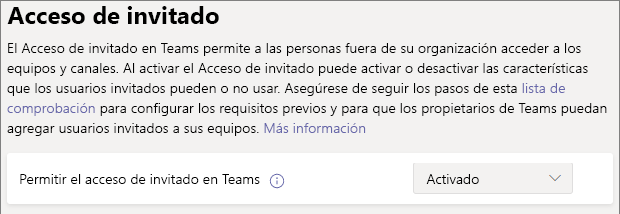

# Configure equipos con la protección de base de referenciaConfigure teams with baseline protection

En este artículo, veremos cómo implementar equipos con un nivel de protección de base de referencia.In this article, we look at how to deploy teams with a baseline level of protection. Este nivel permite a los usuarios disponer de una amplia variedad de opciones de colaboración al mismo tiempo que mejora la gestión de permisos y proporciona protección básica contra el uso compartido excesivo.This level allows users a wide range of options for collaboration while enhancing permissions management and providing basic protection against oversharing. Las protecciones recomendadas para este nivel incluyen directivas de identidad y acceso a dispositivos y protección contra malware.Recommended protections for this level include identity and device access policies and protection against malware. Asimismo, puede aplicar directivas de acceso condicional y protección de pérdida de datos según sea necesario.Additionally, you can apply conditional access policies and data loss protections as needed.

## Protecciones inicialesInitial protections

Como primer paso, le recomendamos que configure directivas básicas de identidad y acceso de dispositivo.As a first step, we recommend that you configure basic identity and device-access policies. Para más información, vea [Recomendaciones de directivas para proteger los chats, grupos y archivos de Teams](../security/office-365-security/teams-access-policies.md).See [Policy recommendations for securing Teams chats, groups, and files](../security/office-365-security/teams-access-policies.md) for details.

También recomendamos activar las características básicas de protección contra amenazas avanzada para protegerse contra malware en documentos, datos adjuntos y vínculos.We also recommend turning on basic Advanced Threat Protection features to guard against malware in documents, attachments, and links. Se recomienda activar todas las opciones de la tabla siguiente.We recommend turning on each of the options in the following table.

|OpciónOption|InformaciónInformation|
|:------|:-----------|
|Datos adjuntos seguros ATP para SPO, OneDrive y TeamsATP Safe Attachments for SPO, OneDrive and Teams|[Datos adjuntos seguros de ATP de Office 365Office 365 ATP Safe Attachments](https://docs.microsoft.com/microsoft-365/security/office-365-security/atp-safe-attachments) [ATP de Office 365 para SharePoint, OneDrive y Microsoft Teams](https://docs.microsoft.com/microsoft-365/security/office-365-security/atp-for-spo-odb-and-teams).[Office 365 ATP for SharePoint, OneDrive, and Microsoft Teams](https://docs.microsoft.com/microsoft-365/security/office-365-security/atp-for-spo-odb-and-teams)|
|Documentos seguros de ATPATP Safe Documents|[Documentos seguros en Protección contra amenazas avanzada de Office 365Safe Documents in Office 365 Advanced Threat Protection](https://docs.microsoft.com/microsoft-365/security/office-365-security/safe-docs)|
|Vínculos seguros de ATP para TeamsATP Safe Links for Teams|[Vínculos seguros de Office 365 en TeamsOffice 365 Safe Links in Teams](https://docs.microsoft.com/microsoft-365/security/office-365-security/atp-safe-links-for-teams) [Vínculos seguros de Protección contra amenazas avanzada de Office 365Office 365 ATP Safe Links](https://docs.microsoft.com/microsoft-365/security/office-365-security/atp-safe-links)|

## Uso compartido de invitados en TeamsTeams guest sharing

En cada uno de los niveles tenemos la opción de compartir con personas de fuera de la organización.In each of the tiers, we have the option of sharing with people outside your organization. En el caso de los niveles de confidencialidad y alta confidencialidad, tendremos la opción de desactivar el uso compartido de invitados en el nivel de equipo usando etiquetas de confidencialidad.For the sensitive and highly sensitive tiers, we will have the option to turn guest sharing off at the team level by using sensitivity labels. Pero la configuración de uso compartido de invitados en el nivel de la organización tiene que estar activada para que el uso compartido de invitados funcione en Teams.But the organization-level guest sharing setting must be turned on for guest sharing to work at all in Teams.

Para establecer la configuración de acceso de invitados de TeamsTo set Teams guest access settings

1. Inicie sesión en el Centro de administración de Microsoft 365 en [https://admin.microsoft.com](https://admin.microsoft.com).Log in to the Microsoft 365 admin center at [https://admin.microsoft.com](https://admin.microsoft.com).
2. En el panel de navegación izquierdo, haga clic en **Mostrar todos**.In the left navigation, click **Show all**.
3. En **Centros de administración**, haga clic en **Teams**.Under **Admin centers**, click **Teams**.
4. En el centro de administración de Teams, en el panel de navegación de la izquierda, expanda **Configuración de toda la organización** y haga clic en **Acceso de invitado**.In the Teams admin center, in the left navigation, expand **Org-wide settings** and click **Guest access**.
5. Asegúrese de que **Permitir el acceso de invitados en Teams** se haya establecido en **Activado**.Ensure that **Allow guest access in Teams** is set to **On**.
6. Realice los cambios que quiera en la configuración de invitado adicional y luego haga clic en **Guardar**.Make any desired changes to the additional guest settings, and then click **Save**.

> [!NOTE]
> La configuración de invitado de Teams puede tardar hasta veinticuatro horas en activarse después de activarla.It may take up to twenty-four hours for the Teams guest setting to become active after you turn it on.

El uso compartido de invitados está activado de forma predeterminada para los grupos de Office 365 y SharePoint, pero si ha cambiado anteriormente alguna de las configuraciones de uso compartido de invitado en su organización, le recomendamos que revise [Colaborar con invitados en un equipo](https://docs.microsoft.com/microsoft-365/solutions/collaborate-as-team) para asegurarse de que el uso compartido de invitados estará disponible en Teams.Guest sharing is turned on by default for Office 365 groups and SharePoint, however if you have previously changed any of the guest sharing settings for your organization, we recommend that you review [Collaborate with guests in a team](https://docs.microsoft.com/microsoft-365/solutions/collaborate-as-team) to ensure that guest sharing will be available in Teams.

## Uso compartido de sitios y archivosSite and file sharing

Para reducir el riesgo de compartir accidentalmente archivos o carpetas con personas de fuera de su organización, le recomendamos que cambie el vínculo de uso compartido predeterminado para SharePoint a *Solo personas de la organización*.To reduce the risk of accidentally sharing files or folders with people outside your organization, we recommend changing the default sharing link for SharePoint to *Only people in your organization*. (Si los usuarios necesitan compartir externamente y ha habilitado el uso compartido de invitados, aún podrán cambiar el tipo de vínculo al compartir).(If users need to share externally, and you have enabled guest sharing, they can still change the link type when they share.)

Para cambiar el vínculo para compartir predeterminadoTo change the default sharing link
1. Abra el [Centro de administración de SharePoint](https://admin.microsoft.com/sharepoint).Open the [SharePoint admin center](https://admin.microsoft.com/sharepoint).
2. En **Directivas**, haga clic en **Uso compartido**.Under **Policies**, click **Sharing**.
3. En **Vínculos de archivos y carpetas**, seleccione **Solo personas de la organización**.Under **File and folder links**, select **Only people in your organization**.
4. Haga clic en **Guardar**.Click **Save**.

Para disfrutar de la mejor experiencia de uso compartido de invitados, también le recomendamos que habilite la [Integración de SharePoint y OneDrive con B2B de Azure AD](https://docs.microsoft.com/sharepoint/sharepoint-azureb2b-integration-preview).For the best guest sharing experience, we also recommend that you enable [SharePoint and OneDrive integration with Azure AD B2B](https://docs.microsoft.com/sharepoint/sharepoint-azureb2b-integration-preview).

## Crear un equipoCreate a team

La configuración adicional para el nivel de protección de base de referencia se lleva a cabo en el sitio de SharePoint asociado a un equipo.Additional configuration for the baseline level of protection is done in the SharePoint site associated with a team. [Cree un equipo público o privado](https://support.office.com/article/174adf5f-846b-4780-b765-de1a0a737e2b) antes de continuar con la siguiente sección.[Create a public or private team](https://support.office.com/article/174adf5f-846b-4780-b765-de1a0a737e2b) before proceeding to the next section.

## Configuración de uso compartido del sitio Site sharing settings

De forma predeterminada, los miembros de un sitio de SharePoint pueden invitar a otros usuarios al sitio.By default, members of a SharePoint site can invite others to the site. Cuando un sitio forma parte de un equipo, los miembros del equipo se incluyen como miembros del sitio.When a site is part of a team, team members are included as site members. Sin embargo, los usuarios agregados directamente al sitio no tienen acceso al resto del equipo.However, people added directly to the site don't have access to the rest of the team. Por este motivo, le recomendamos que administre los permisos exclusivamente mediante el equipo.For this reason, we recommend managing permissions exclusively through the team.

Para ayudarle con la administración de permisos, le recomendamos que configure el sitio asociado para que solo los propietarios del sitio puedan compartirlo.To help with permissions management, we recommend configuring the associated site to only allow owners to share the site by itself. Esto simplifica la administración de permisos y evita el acceso por parte de usuarios sin el conocimiento del propietario del equipo.This simplifies permissions management and helps prevent access by people without a team owner's knowledge. Haga esto para cada equipo que necesita protección de base de referencia.Do this for each team that requires baseline protection.

Para actualizar la configuración de uso compartido del sitioTo update the site sharing settings
1. En la barra de herramientas del equipo, haga clic en **Archivos**.In the tool bar for the team, click **Files**.
2. Haga clic en **Abrir en SharePoint**.Click **Open in SharePoint**.
3. En la barra de herramientas de SharePoint, haga clic en el icono de configuración y luego en **Permisos del sitio**.In the tool bar of the SharePoint site, click the settings icon, and then click **Site permissions**.
4. En el panel **Permisos del sitio**, en **Configuración de uso compartido**, haga clic en **Cambiar configuración de uso compartido**.In the **Site permissions** pane, under **Sharing settings**, click **Change sharing settings**.
5. En **Permisos de uso compartido**, elija **Los propietarios y miembros del sitio, y las personas con permisos de edición pueden compartir archivos y carpetas, pero solo los propietarios de sitios pueden compartir el sitio** y haga clic en **Guardar**.Under **Sharing permissions**, choose **Site owners and members, and people with Edit permissions can share files and folders, but only site owners can share the site**, and then click **Save**.

## Protecciones adicionalesAdditional protections

Microsoft 365 ofrece otros métodos para proteger el contenido.Microsoft 365 offers additional methods for securing your content. Considere si las siguientes opciones ayudarían a mejorar la seguridad de su organización.Consider if the following options would help improve security for your organization.

- Hacer que los usuarios invitados acepten los [términos de uso](https://docs.microsoft.com/azure/active-directory/conditional-access/terms-of-use).Have your guest users agree to a [terms of use](https://docs.microsoft.com/azure/active-directory/conditional-access/terms-of-use).
- Configurar una [directiva de tiempo de espera de sesión](https://docs.microsoft.com/azure/active-directory/conditional-access/howto-conditional-access-session-lifetime) para invitadosConfigure a [session timeout policy](https://docs.microsoft.com/azure/active-directory/conditional-access/howto-conditional-access-session-lifetime) for guests.
- Crear [tipos de información confidencial](https://docs.microsoft.com/microsoft-365/compliance/custom-sensitive-info-types) y usar [protección de pérdida de datos](https://docs.microsoft.com/microsoft-365/compliance/data-loss-prevention-policies) para establecer directivas en relación con el acceso a información confidencial.Create [sensitive information types](https://docs.microsoft.com/microsoft-365/compliance/custom-sensitive-info-types) and use [data loss protection](https://docs.microsoft.com/microsoft-365/compliance/data-loss-prevention-policies) to set policies around accessing sensitive information.

## Consulte tambiénSee Also

[Administración de directivas de reunión en TeamsManage meeting policies in Teams](https://docs.microsoft.com/microsoftteams/meeting-policies-in-teams)

[Introducción a la administración de riesgos internosGet started with insider risk management](https://docs.microsoft.com/microsoft-365/compliance/insider-risk-management-configure)
