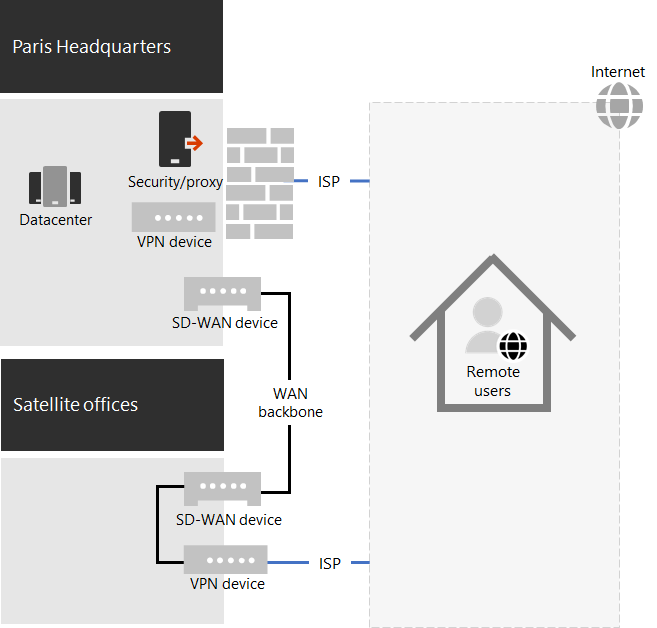

# Respuesta COVID-19 de Contoso y soporte técnico para trabajos remotos y en el sitio

Contoso siempre ha admitido a sus trabajadores remotos que han tenido acceso a recursos locales a través de un servidor VPN central en la sede central de París. Contoso ha emitido a todos los trabajadores remotos un portátil administrado. Los trabajadores locales tenían una mezcla de equipos de escritorio y portátiles.

## Respuesta de Contoso a COVID-19

Con el comienzo del COVID-19 Pandemic, de repente todos los trabajadores básicos eran trabajadores remotos. Contoso ha respondido cambiando su personal para trabajar desde casa y dirigir sus actividades principales a través del acceso remoto a recursos locales y en línea con los servicios en la nube de Microsoft 365.

Contoso tenía servidores VPN de acceso remoto en la oficina de la sede de París para admitir el 25% de su personal ya Remote, pero se ha movido rápidamente a escalabilidad vertical de su capacidad de acceso remoto para que admita el 90% de su personal. Contoso implementó servidores VPN de acceso remoto en cada oficina satélite para que los trabajadores remotos usen un punto de entrada de cierre regional para obtener acceso a la intranet de contoso.

Contoso también se actualizó la configuración de los clientes de VPN instalados en equipos portátiles, tabletas y teléfonos inteligentes para túneles divididos, de modo que el tráfico para el conjunto Optimize de los extremos de Office 365 omitió la conexión VPN y se envió directamente a través de Internet. Para obtener más información, consulte [optimizar la conectividad de Office 365 para usuarios remotos mediante la tunelización dividida de VPN](../enterprise/microsoft-365-vpn-split-tunnel.md).

Esta es la configuración resultante con los dispositivos VPN instalados en la sede central de París y en cada una de las oficinas satélite. 

Un trabajador remoto con el cliente VPN instalado usa DNS para encontrar la oficina más cercana a la región y se conecta al dispositivo VPN instalado allí. Con la tunelización dividida, el tráfico a Microsoft 365 optimizar extremos se envía directamente a la ubicación de red de Microsoft 365 de la forma más cercana. El resto del tráfico se envía a través de la conexión VPN al dispositivo VPN.

## Soporte de Contoso para trabajos remotos y en el sitio

Una vez que se han realizado los cambios iniciales para admitir principalmente los trabajadores remotos durante los bloqueos regionales, contoso realizó cambios en la infraestructura para apoyar el trabajo remoto y en el sitio en el que un trabajador podría ser:

- Siempre remoto.
- Siempre local.
- Una combinación de remoto y local.

Las características de identidad, seguridad y cumplimiento de Microsoft 365 están diseñadas para la confianza cero y para funcionar independientemente de la ubicación del usuario y de su dispositivo. Para obtener más información, consulte [Zero Trust](https://www.microsoft.com/security/business/zero-trust).

Sin embargo, la administración de nuevas instalaciones y actualizaciones de software depende de la ubicación del dispositivo porque el software que se va a instalar puede provenir de un origen local o de Internet. Los arquitectos de TI de Contoso diseñaron sus nuevas instalaciones y actualizan la infraestructura en función de la ubicación del dispositivo, en lugar del trabajo.

Designó dos tipos de dispositivos: dedicado de forma local y móvil.

### Dedicado localmente

Un dispositivo local dedicado es un equipo de escritorio o servidor que nunca sale de la intranet de Contoso y no tiene un cliente de VPN instalado. Estos dispositivos locales siguen usando Microsoft Endpoint Configuration Manager y sus puntos de distribución para instalaciones y actualizaciones de Windows 10, Microsoft 365 apps for Enterprise y el explorador perimetral.

### Movilidad

Un dispositivo móvil puede dejar la intranet de Contoso e incluye equipos portátiles emitidos a muchos trabajadores de Office y todos los trabajadores remotos y otros dispositivos de propiedad de la organización, como teléfonos inteligentes y tabletas con el cliente de VPN de Contoso instalado. 

Como estos dispositivos se pueden conectar a Internet en cualquier momento, usan Intune u otros servicios basados en la nube para instalaciones y actualizaciones de Windows 10, Microsoft 365 apps for Enterprise y Edge. No usan los puntos de distribución existentes del administrador de configuración local.

Esto significa que algunas de las instalaciones y actualizaciones del dispositivo móvil se realizarán a través de Internet mientras están locales y conectadas a la intranet. Pero los arquitectos de TI de Contoso decidieron que la simplicidad de la configuración era más importante que la optimización del ancho de banda de la intranet a Internet, sobre todo cuando la mayoría de los trabajadores remotos rara vez están conectados a la intranet.

Esta es la infraestructura resultante.

El comportamiento de la instalación y la actualización se determina haciendo que las cuentas de equipo de los dispositivos sean miembros de uno de estos grupos:

- OnPremDevices

  El cliente de Configuration Manager del dispositivo usa puntos de distribución para instalaciones y actualizaciones.

- RoamingDevices

  Intune y otras opciones de configuración en el dispositivo especifican el uso de la red de Microsoft 365 para las instalaciones y actualizaciones.

## Nuevo proceso de incorporación

Para un nuevo dispositivo local dedicado emitido a un nuevo trabajador o para un nuevo servidor en un centro de proceso de trabajo, cuando el trabajador inicia sesión, el cliente de Configuration Manager en función de la pertenencia del dispositivo en el grupo OnPremDevices descarga e instala las actualizaciones más recientes para Windows 10, las aplicaciones de Microsoft 365 para empresas y el perímetro de los puntos de distribución del administrador de configuración local. Una vez completado, el dispositivo local dedicado está listo para su uso y usa estos puntos de distribución para las actualizaciones en curso.

Para un nuevo dispositivo remoto emitido a un nuevo trabajador, cuando el trabajador inicie sesión, el dispositivo, según su pertenencia al grupo RoamingDevices, se pone en contacto con el servicio en la nube de Intune y otros servicios y descarga e instala las actualizaciones más recientes para Windows 10, las aplicaciones de Microsoft 365 para empresas y Edge. Una vez completado, el dispositivo remoto está listo para su uso y usa el cliente VPN instalado para tener acceso a los recursos locales y a la red de Microsoft 365 para las actualizaciones continuas.

## Paso siguiente

[Permita a los trabajadores remotos](empower-people-to-work-remotely.md) de su organización.
